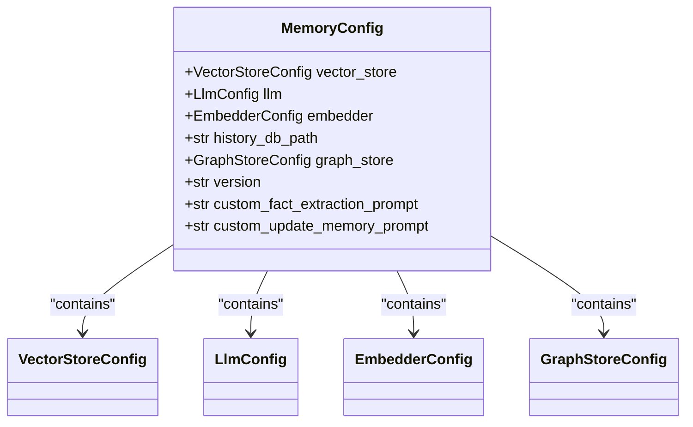
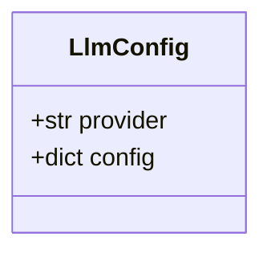
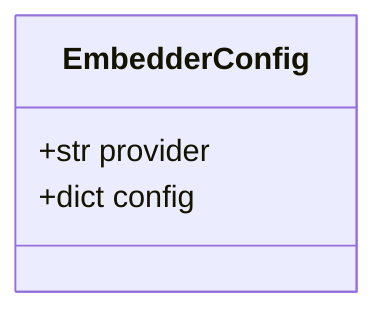
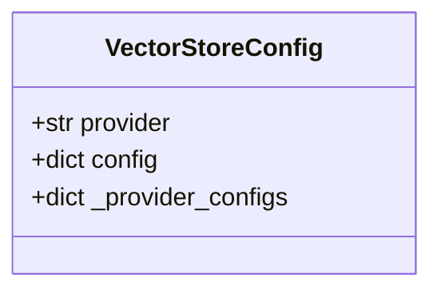
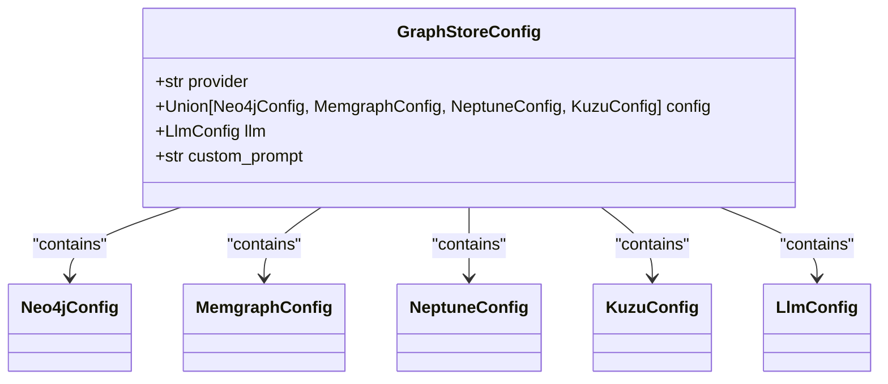
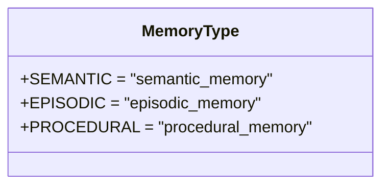
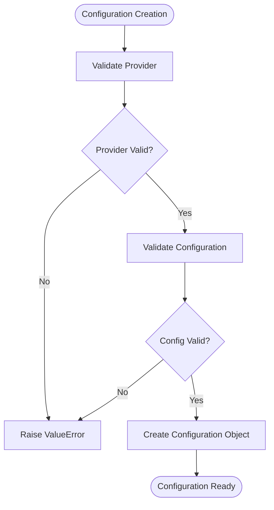

# Configuration Classes

<cite>
**Referenced Files in This Document**   
- [base.py](file://mem0/configs/base.py)
- [enums.py](file://mem0/configs/enums.py)
- [prompts.py](file://mem0/configs/prompts.py)
- [embeddings/configs.py](file://mem0/embeddings/configs.py)
- [llms/configs.py](file://mem0/llms/configs.py)
- [vector_stores/configs.py](file://mem0/vector_stores/configs.py)
- [graphs/configs.py](file://mem0/graphs/configs.py)
</cite>

## Table of Contents
1. [Introduction](#introduction)
2. [MemoryConfig Structure](#memoryconfig-structure)
3. [Nested Configuration Objects](#nested-configuration-objects)
   - [LLM Configuration](#llm-configuration)
   - [Embedder Configuration](#embedder-configuration)
   - [Vector Store Configuration](#vector-store-configuration)
   - [Graph Store Configuration](#graph-store-configuration)
4. [Enums and Valid Values](#enums-and-valid-values)
5. [System Prompts](#system-prompts)
6. [Configuration Validation](#configuration-validation)
7. [Configuration Examples](#configuration-examples)
8. [Environment Variables and Precedence](#environment-variables-and-precedence)
9. [Conclusion](#conclusion)

## Introduction

The mem0 framework provides a comprehensive configuration system that allows users to customize various components including language models, embedding models, vector stores, and graph stores. The core configuration is managed through the `MemoryConfig` class, which serves as the central configuration object for the entire framework. This document details the structure and usage of all configuration classes in the mem0 framework, providing guidance on how to configure the system for different deployment scenarios.

**Section sources**
- [base.py](file://mem0/configs/base.py#L29-L62)

## MemoryConfig Structure

The `MemoryConfig` class is the primary configuration object in the mem0 framework, defined in the `base.py` file. It serves as a container for all configuration settings and provides default values for various components. The class is built using Pydantic, which enables robust validation and type checking.

The `MemoryConfig` class contains several key attributes that define the behavior of the mem0 system:

- **vector_store**: Configuration for the vector store component, which handles storage and retrieval of vector embeddings
- **llm**: Configuration for the language model component, which processes natural language input and generates responses
- **embedder**: Configuration for the embedding model component, which converts text into vector representations
- **history_db_path**: Path to the SQLite database file used for storing conversation history
- **graph_store**: Configuration for the graph database component, which manages relationships between entities
- **version**: API version identifier
- **custom_fact_extraction_prompt**: Optional custom prompt for fact extraction
- **custom_update_memory_prompt**: Optional custom prompt for memory updates

The configuration system uses default factories to instantiate nested configuration objects, ensuring that each component has appropriate default settings even when not explicitly configured.



**Diagram sources**
- [base.py](file://mem0/configs/base.py#L29-L62)

**Section sources**
- [base.py](file://mem0/configs/base.py#L29-L62)

## Nested Configuration Objects

### LLM Configuration

The LLM configuration is managed through the `LlmConfig` class, which defines settings for language model providers. This configuration allows users to specify which LLM provider to use and configure provider-specific settings.

Key attributes of the `LlmConfig` class include:

- **provider**: Specifies the LLM provider (e.g., 'openai', 'anthropic', 'groq', 'together', 'aws_bedrock', 'azure_openai', 'gemini', 'deepseek', 'xai', 'sarvam', 'lmstudio', 'vllm', 'langchain')
- **config**: A dictionary containing provider-specific configuration options such as API keys, model names, temperature settings, and other parameters

The configuration includes validation to ensure that only supported providers are used. When a provider is specified, the corresponding configuration options in the `config` dictionary are validated against the expected schema for that provider.



**Diagram sources**
- [llms/configs.py](file://mem0/llms/configs.py#L6-L35)

**Section sources**
- [llms/configs.py](file://mem0/llms/configs.py#L6-L35)

### Embedder Configuration

The embedder configuration is managed through the `EmbedderConfig` class, which defines settings for embedding model providers. This configuration controls how text is converted into vector representations for storage and retrieval.

Key attributes of the `EmbedderConfig` class include:

- **provider**: Specifies the embedding provider (e.g., 'openai', 'ollama', 'huggingface', 'azure_openai', 'gemini', 'vertexai', 'together', 'lmstudio', 'langchain', 'aws_bedrock', 'github_copilot')
- **config**: A dictionary containing provider-specific configuration options such as API keys, model specifications, and connection settings

The configuration includes validation to ensure that only supported embedding providers are used. The system supports various embedding providers, allowing users to choose based on their specific requirements and infrastructure.



**Diagram sources**
- [embeddings/configs.py](file://mem0/embeddings/configs.py#L6-L32)

**Section sources**
- [embeddings/configs.py](file://mem0/embeddings/configs.py#L6-L32)

### Vector Store Configuration

The vector store configuration is managed through the `VectorStoreConfig` class, which defines settings for vector database providers. This configuration controls how vector embeddings are stored and retrieved.

Key attributes of the `VectorStoreConfig` class include:

- **provider**: Specifies the vector store provider (e.g., 'qdrant', 'chroma', 'pgvector', 'pinecone', 'mongodb', 'milvus', 'baidu', 'neptune', 'upstash_vector', 'azure_ai_search', 'azure_mysql', 'redis', 'valkey', 'databricks', 'elasticsearch', 'vertex_ai_vector_search', 'opensearch', 'supabase', 'weaviate', 'faiss', 'langchain', 's3_vectors')
- **config**: Configuration specific to the chosen vector store provider

The configuration includes a comprehensive list of supported providers through the `_provider_configs` dictionary, which maps provider names to their corresponding configuration classes. The validation process ensures that only supported providers are used and that the configuration is properly structured for the selected provider.



**Diagram sources**
- [vector_stores/configs.py](file://mem0/vector_stores/configs.py#L6-L66)

**Section sources**
- [vector_stores/configs.py](file://mem0/vector_stores/configs.py#L6-L66)

### Graph Store Configuration

The graph store configuration is managed through the `GraphStoreConfig` class, which defines settings for graph database providers. This configuration controls how relationships between entities are stored and queried.

Key attributes of the `GraphStoreConfig` class include:

- **provider**: Specifies the graph store provider (e.g., 'neo4j', 'memgraph', 'neptune', 'kuzu')
- **config**: Configuration specific to the chosen graph store provider, which can be one of several provider-specific configuration classes
- **llm**: Optional LLM configuration for querying the graph store
- **custom_prompt**: Optional custom prompt for entity extraction from text

The configuration supports multiple graph database providers, each with its own specific configuration requirements. The validation process ensures that the appropriate configuration is used based on the selected provider.



**Diagram sources**
- [graphs/configs.py](file://mem0/graphs/configs.py#L80-L106)

**Section sources**
- [graphs/configs.py](file://mem0/graphs/configs.py#L80-L106)

## Enums and Valid Values

The mem0 framework defines valid values for various configuration options using Python enums in the `enums.py` file. These enums ensure type safety and prevent invalid values from being used in the configuration.

The primary enum defined in the framework is `MemoryType`, which specifies the different types of memory that can be managed by the system:

- **SEMANTIC**: Represents semantic memory, which stores general knowledge and facts
- **EPISODIC**: Represents episodic memory, which stores personal experiences and events
- **PROCEDURAL**: Represents procedural memory, which stores skills and processes

These memory types can be used to categorize and organize memories within the system, allowing for more sophisticated memory management and retrieval strategies.



**Diagram sources**
- [enums.py](file://mem0/configs/enums.py#L4-L8)

**Section sources**
- [enums.py](file://mem0/configs/enums.py#L4-L8)

## System Prompts

The mem0 framework includes several system prompts that guide the behavior of the AI system in various scenarios. These prompts are defined in the `prompts.py` file and can be customized or overridden through configuration.

Key prompts include:

- **MEMORY_ANSWER_PROMPT**: Guides the AI in answering questions based on stored memories, emphasizing accuracy and conciseness
- **FACT_RETRIEVAL_PROMPT**: Instructs the AI on how to extract relevant facts and preferences from conversations, with detailed guidelines for different types of information
- **DEFAULT_UPDATE_MEMORY_PROMPT**: Provides instructions for updating the memory system, including rules for adding, updating, deleting, or making no changes to existing memories
- **PROCEDURAL_MEMORY_SYSTEM_PROMPT**: Guides the summarization of agent execution history, ensuring that all outputs are recorded verbatim

These prompts follow a structured format with clear guidelines and examples, ensuring consistent behavior across different deployment scenarios. Users can override these prompts using the `custom_fact_extraction_prompt` and `custom_update_memory_prompt` configuration options in the `MemoryConfig` class.

**Section sources**
- [prompts.py](file://mem0/configs/prompts.py#L3-L346)

## Configuration Validation

The mem0 framework uses Pydantic for comprehensive configuration validation, ensuring that all configuration settings are valid and properly structured. The validation process occurs at multiple levels:

1. **Field-level validation**: Individual fields are validated using Pydantic's built-in validation features and custom validators
2. **Model-level validation**: Entire configuration models are validated to ensure consistency between related fields
3. **Provider-specific validation**: When a provider is specified, the configuration is validated against the expected schema for that provider

For example, the `EmbedderConfig` class includes a `validate_config` method that ensures the specified provider is supported before allowing the configuration to be used. Similarly, the `VectorStoreConfig` class includes a `validate_and_create_config` method that validates the provider and creates the appropriate provider-specific configuration object.

The validation system also handles default values and fallbacks, ensuring that the system can operate with minimal configuration while still allowing for extensive customization when needed.



**Diagram sources**
- [embeddings/configs.py](file://mem0/embeddings/configs.py#L13-L32)
- [llms/configs.py](file://mem0/llms/configs.py#L10-L35)
- [vector_stores/configs.py](file://mem0/vector_stores/configs.py#L38-L66)
- [graphs/configs.py](file://mem0/graphs/configs.py#L93-L106)

**Section sources**
- [embeddings/configs.py](file://mem0/embeddings/configs.py#L13-L32)
- [llms/configs.py](file://mem0/llms/configs.py#L10-L35)
- [vector_stores/configs.py](file://mem0/vector_stores/configs.py#L38-L66)
- [graphs/configs.py](file://mem0/graphs/configs.py#L93-L106)

## Configuration Examples

The mem0 framework supports various deployment scenarios through flexible configuration options. Below are examples of configuration dictionaries for different use cases:

### Single-User Configuration
```python
config = MemoryConfig(
    llm=LlmConfig(provider="openai", config={"api_key": "your-api-key"}),
    embedder=EmbedderConfig(provider="openai"),
    vector_store=VectorStoreConfig(provider="chroma", config={"path": "/path/to/chroma"}),
    history_db_path="/path/to/history.db"
)
```

### Multi-Agent Configuration
```python
config = MemoryConfig(
    llm=LlmConfig(provider="anthropic", config={"api_key": "your-api-key", "model": "claude-3-opus-20240229"}),
    embedder=EmbedderConfig(provider="huggingface", config={"model": "BAAI/bge-large-en-v1.5"}),
    vector_store=VectorStoreConfig(provider="qdrant", config={"url": "http://qdrant:6333", "api_key": "your-api-key"}),
    graph_store=GraphStoreConfig(
        provider="neo4j",
        config=Neo4jConfig(
            url="bolt://neo4j:7687",
            username="neo4j",
            password="password"
        )
    )
)
```

### Production Configuration
```python
config = MemoryConfig(
    llm=LlmConfig(provider="azure_openai", config={
        "api_key": "your-api-key",
        "azure_endpoint": "https://your-resource.openai.azure.com",
        "azure_deployment": "gpt-4o"
    }),
    embedder=EmbedderConfig(provider="azure_openai", config={
        "api_key": "your-api-key",
        "azure_endpoint": "https://your-resource.openai.azure.com",
        "azure_deployment": "text-embedding-3-large"
    }),
    vector_store=VectorStoreConfig(provider="pinecone", config={
        "api_key": "your-api-key",
        "environment": "us-west1-gcp"
    }),
    graph_store=GraphStoreConfig(
        provider="neptune",
        config=NeptuneConfig(
            endpoint="neptune-graph://g-12345678",
            app_id="Mem0"
        )
    )
)
```

These examples demonstrate how the configuration system can be adapted to different deployment scenarios, from simple single-user setups to complex multi-agent systems in production environments.

**Section sources**
- [base.py](file://mem0/configs/base.py#L29-L62)
- [llms/configs.py](file://mem0/llms/configs.py#L6-L35)
- [embeddings/configs.py](file://mem0/embeddings/configs.py#L6-L32)
- [vector_stores/configs.py](file://mem0/vector_stores/configs.py#L6-L66)
- [graphs/configs.py](file://mem0/graphs/configs.py#L80-L106)

## Environment Variables and Precedence

The mem0 framework supports configuration through environment variables, providing flexibility in different deployment environments. The configuration system follows a specific precedence order when resolving values:

1. **Explicit configuration**: Values provided directly in the configuration object take highest precedence
2. **Environment variables**: Values from environment variables are used when not explicitly configured
3. **Default values**: Built-in default values are used when neither explicit configuration nor environment variables are provided

For example, the OpenAI LLM configuration will use the `OPENAI_API_KEY` environment variable if an API key is not explicitly provided in the configuration. Similarly, the OpenAI embedding configuration will use the same environment variable for authentication.

This precedence system allows for secure management of sensitive information like API keys while still providing the flexibility to override settings for specific use cases. In production environments, it's recommended to use environment variables for sensitive configuration options and explicit configuration for non-sensitive settings.

**Section sources**
- [llms/openai.py](file://mem0/llms/openai.py#L48-L51)
- [embeddings/openai.py](file://mem0/embeddings/openai.py#L18-L23)

## Conclusion

The mem0 framework provides a comprehensive and flexible configuration system that allows users to customize various components according to their specific needs. The `MemoryConfig` class serves as the central configuration object, containing nested configurations for LLM, embedder, vector store, and graph store components.

The configuration system leverages Pydantic for robust validation, ensuring that all settings are properly structured and valid. Users can customize the system through explicit configuration, environment variables, or by using default values. The framework supports a wide range of providers for each component, allowing for deployment in various environments from development to production.

By understanding the structure and options available in the configuration system, users can effectively tailor the mem0 framework to their specific use cases, whether for single-user applications, multi-agent systems, or large-scale production deployments.