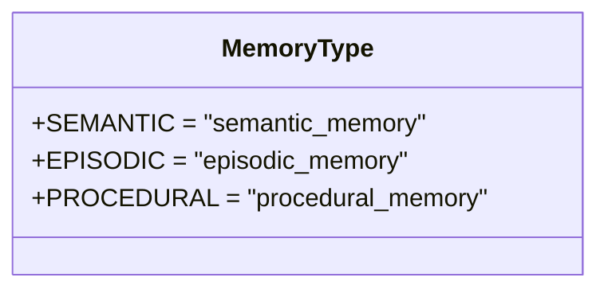
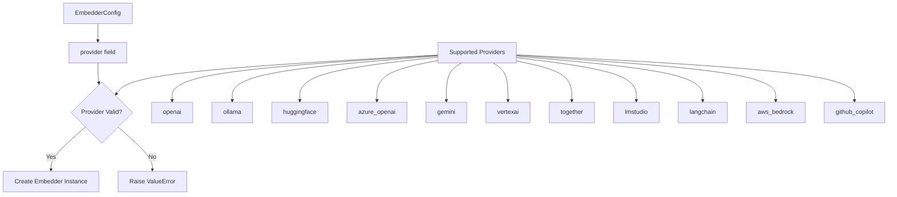
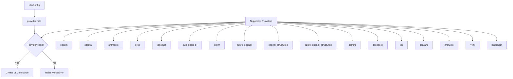
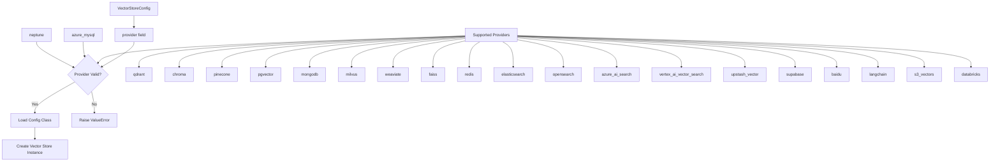
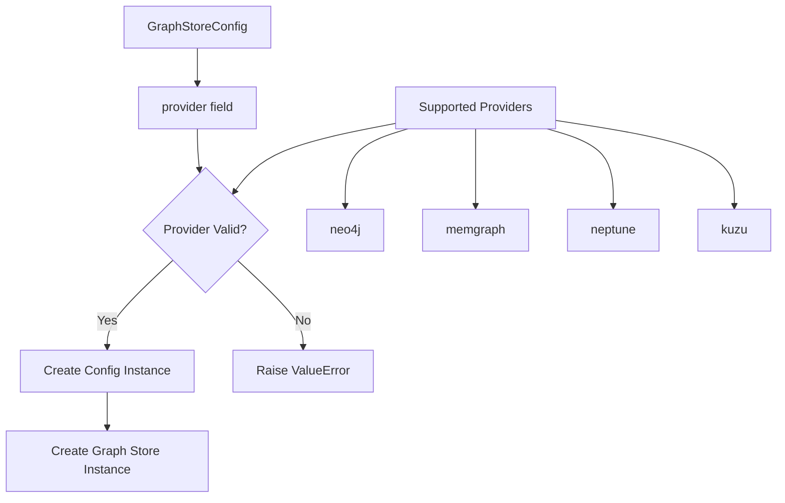
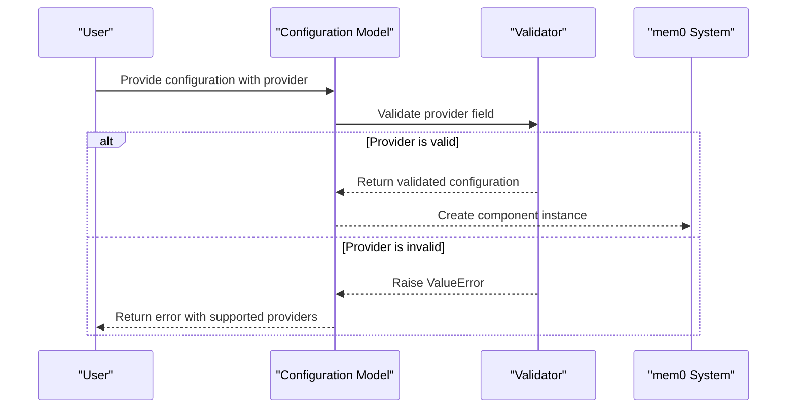

# Configuration Enums

<cite>
**Referenced Files in This Document**   
- [enums.py](file://mem0/configs/enums.py)
- [base.py](file://mem0/configs/base.py)
- [configs.py](file://mem0/embeddings/configs.py)
- [configs.py](file://mem0/llms/configs.py)
- [configs.py](file://mem0/vector_stores/configs.py)
- [configs.py](file://mem0/graphs/configs.py)
- [LLM.md](file://LLM.md)
</cite>

## Table of Contents
1. [Introduction](#introduction)
2. [MemoryType Enum](#memorytype-enum)
3. [ProviderType Configuration System](#providertype-configuration-system)
4. [Embedding Providers](#embedding-providers)
5. [LLM Providers](#llm-providers)
6. [Vector Store Providers](#vector-store-providers)
7. [Graph Store Providers](#graph-store-providers)
8. [Enum Integration with Pydantic Models](#enum-integration-with-pydantic-models)
9. [Configuration Validation and Error Handling](#configuration-validation-and-error-handling)
10. [Usage Examples](#usage-examples)
11. [Best Practices and Common Issues](#best-practices-and-common-issues)
12. [Extending the Enum System](#extending-the-enum-system)

## Introduction
The mem0 framework utilizes a comprehensive configuration system that relies on enumerated types to ensure type safety and prevent invalid provider selections. This document provides detailed documentation for all configuration enums in the mem0 framework, focusing on the MemoryType enum and the provider configuration system for LLMs, embedders, vector stores, and graph stores. The configuration system leverages Pydantic models to validate configurations and ensure that only supported providers are used.

**Section sources**
- [enums.py](file://mem0/configs/enums.py#L1-L8)
- [base.py](file://mem0/configs/base.py#L1-L86)

## MemoryType Enum
The MemoryType enum defines the different types of memory that can be used in the mem0 framework. Currently, the framework supports three types of memory:

- **SEMANTIC**: Represents semantic memory that stores general knowledge and facts
- **EPISODIC**: Represents episodic memory that stores specific events and experiences
- **PROCEDURAL**: Represents procedural memory that stores skills and processes

Each memory type is associated with a string representation that is used in the configuration system. The enum ensures that only valid memory types can be specified in the configuration, preventing errors from invalid memory type values.



**Diagram sources**
- [enums.py](file://mem0/configs/enums.py#L4-L7)

**Section sources**
- [enums.py](file://mem0/configs/enums.py#L4-L7)

## ProviderType Configuration System
The mem0 framework implements a provider-based configuration system that allows users to select from various providers for different components. Unlike a traditional ProviderType enum, the framework uses string-based provider specifications with validation to ensure type safety. This approach provides flexibility while maintaining configuration integrity.

The provider system is implemented through Pydantic models that validate the provider field against a list of supported providers. Each component (LLM, embedder, vector store, and graph store) has its own configuration model with provider validation. This design allows for easy extension of supported providers without requiring changes to enum definitions.

**Section sources**
- [base.py](file://mem0/configs/base.py#L29-L53)
- [configs.py](file://mem0/embeddings/configs.py#L6-L32)
- [configs.py](file://mem0/llms/configs.py#L6-L35)
- [configs.py](file://mem0/vector_stores/configs.py#L6-L66)
- [configs.py](file://mem0/graphs/configs.py#L80-L106)

## Embedding Providers
The embedding provider system allows users to select from various embedding models. The supported providers are validated through the EmbedderConfig Pydantic model. The following providers are supported:

- **openai**: OpenAI embeddings (default)
- **ollama**: Ollama embeddings
- **huggingface**: HuggingFace models
- **azure_openai**: Azure OpenAI embeddings
- **gemini**: Google Gemini embeddings
- **vertexai**: Google Vertex AI
- **together**: Together AI embeddings
- **lmstudio**: LM Studio embeddings
- **langchain**: LangChain embeddings
- **aws_bedrock**: AWS Bedrock embeddings
- **github_copilot**: GitHub Copilot embeddings

The EmbedderConfig model validates that the provider field contains one of these supported values, raising a ValueError if an unsupported provider is specified.



**Diagram sources**
- [configs.py](file://mem0/embeddings/configs.py#L6-L32)
- [LLM.md](file://LLM.md#L295-L305)

**Section sources**
- [configs.py](file://mem0/embeddings/configs.py#L6-L32)
- [LLM.md](file://LLM.md#L295-L305)

## LLM Providers
The LLM provider system supports various language model providers. The LlmConfig Pydantic model validates the provider field to ensure only supported providers are used. The following providers are supported:

- **openai**: OpenAI models
- **ollama**: Ollama models
- **anthropic**: Anthropic models
- **groq**: Groq models
- **together**: Together AI models
- **aws_bedrock**: AWS Bedrock models
- **litellm**: LiteLLM models
- **azure_openai**: Azure OpenAI models
- **openai_structured**: OpenAI structured output
- **azure_openai_structured**: Azure OpenAI structured output
- **gemini**: Google Gemini models
- **deepseek**: DeepSeek models
- **xai**: xAI models
- **sarvam**: Sarvam models
- **lmstudio**: LM Studio models
- **vllm**: vLLM models
- **langchain**: LangChain models

The validation occurs through a field validator that checks if the provider is in the list of supported providers, ensuring configuration integrity.



**Diagram sources**
- [configs.py](file://mem0/llms/configs.py#L6-L35)
- [LLM.md](file://LLM.md#L295-L305)

**Section sources**
- [configs.py](file://mem0/llms/configs.py#L6-L35)
- [LLM.md](file://LLM.md#L295-L305)

## Vector Store Providers
The vector store provider system supports various vector database providers. The VectorStoreConfig Pydantic model validates the provider field and dynamically loads the appropriate configuration class based on the provider. The following providers are supported:

- **qdrant**: Qdrant vector database (default)
- **chroma**: ChromaDB
- **pinecone**: Pinecone vector database
- **pgvector**: PostgreSQL with pgvector
- **mongodb**: MongoDB Atlas Vector Search
- **milvus**: Milvus vector database
- **weaviate**: Weaviate
- **faiss**: Facebook AI Similarity Search
- **redis**: Redis vector search
- **elasticsearch**: Elasticsearch
- **opensearch**: OpenSearch
- **azure_ai_search**: Azure AI Search
- **vertex_ai_vector_search**: Google Vertex AI Vector Search
- **upstash_vector**: Upstash Vector
- **supabase**: Supabase vector
- **baidu**: Baidu vector database
- **langchain**: LangChain vector stores
- **s3_vectors**: Amazon S3 Vectors
- **databricks**: Databricks vector stores
- **azure_mysql**: Azure MySQL
- **neptune**: AWS Neptune Analytics

The validation occurs through a model validator that checks if the provider is in the _provider_configs dictionary, ensuring only supported providers are used.



**Diagram sources**
- [configs.py](file://mem0/vector_stores/configs.py#L6-L66)
- [LLM.md](file://LLM.md#L307-L327)

**Section sources**
- [configs.py](file://mem0/vector_stores/configs.py#L6-L66)
- [LLM.md](file://LLM.md#L307-L327)

## Graph Store Providers
The graph store provider system supports various graph database providers. The GraphStoreConfig Pydantic model validates the provider field and creates the appropriate configuration instance based on the provider. The following providers are supported:

- **neo4j**: Neo4j graph database (default)
- **memgraph**: Memgraph
- **neptune**: AWS Neptune Analytics
- **kuzu**: Kuzu Graph database

The validation occurs through a field validator that checks the provider value and returns the appropriate configuration class instance, ensuring only supported providers are used.



**Diagram sources**
- [configs.py](file://mem0/graphs/configs.py#L80-L106)
- [LLM.md](file://LLM.md#L328-L332)

**Section sources**
- [configs.py](file://mem0/graphs/configs.py#L80-L106)
- [LLM.md](file://LLM.md#L328-L332)

## Enum Integration with Pydantic Models
The mem0 framework integrates enumerated types with Pydantic models to ensure type safety and prevent invalid provider selections. Instead of using traditional enum classes for providers, the framework uses string fields with validation methods to achieve the same goal with greater flexibility.

The integration works as follows:
1. Each configuration model has a provider field of type string with a default value
2. A validator method checks if the provider value is in the list of supported providers
3. If the provider is valid, the configuration is accepted
4. If the provider is invalid, a ValueError is raised with a descriptive message

This approach provides several benefits:
- Easy extension of supported providers without modifying enum definitions
- Clear error messages that list supported providers
- Case-sensitive validation to prevent common configuration errors
- Integration with Pydantic's validation system for comprehensive configuration validation



**Diagram sources**
- [configs.py](file://mem0/embeddings/configs.py#L13-L32)
- [configs.py](file://mem0/llms/configs.py#L10-L35)
- [configs.py](file://mem0/vector_stores/configs.py#L38-L66)
- [configs.py](file://mem0/graphs/configs.py#L93-L106)

**Section sources**
- [configs.py](file://mem0/embeddings/configs.py#L13-L32)
- [configs.py](file://mem0/llms/configs.py#L10-L35)
- [configs.py](file://mem0/vector_stores/configs.py#L38-L66)
- [configs.py](file://mem0/graphs/configs.py#L93-L106)

## Configuration Validation and Error Handling
The mem0 framework implements comprehensive configuration validation and error handling to ensure robust operation. The validation system uses Pydantic's built-in validation features along with custom validators to validate provider selections and configuration parameters.

Key aspects of the validation system:
- Provider validation: Ensures only supported providers are used
- Field validation: Validates individual configuration fields
- Model validation: Validates relationships between fields
- Error messages: Provides descriptive error messages with suggestions for correction

When a configuration error occurs, the framework raises a ValueError with a message that includes:
- The specific error (e.g., "Unsupported vector store provider")
- The invalid value provided
- A list of supported providers (where applicable)
- Suggestions for correcting the error

This approach helps users quickly identify and fix configuration issues.

**Section sources**
- [configs.py](file://mem0/embeddings/configs.py#L13-L32)
- [configs.py](file://mem0/llms/configs.py#L10-L35)
- [configs.py](file://mem0/vector_stores/configs.py#L38-L66)
- [configs.py](file://mem0/graphs/configs.py#L93-L106)

## Usage Examples
### Correct Usage
```python
# Correct configuration for OpenAI LLM with Qdrant vector store
config = MemoryConfig(
    llm=LlmConfig(
        provider="openai",
        config={"api_key": "your-api-key"}
    ),
    vector_store=VectorStoreConfig(
        provider="qdrant",
        config={"host": "localhost", "port": 6333}
    ),
    embedder=EmbedderConfig(
        provider="openai",
        config={"api_key": "your-api-key"}
    )
)
```

### Incorrect Usage
```python
# Incorrect - misspelled provider name
config = MemoryConfig(
    llm=LlmConfig(
        provider="openaii",  # Error: should be "openai"
        config={"api_key": "your-api-key"}
    )
)

# Incorrect - unsupported provider
config = MemoryConfig(
    vector_store=VectorStoreConfig(
        provider="cassandra",  # Error: Cassandra is not supported
        config={"host": "localhost"}
    )
)
```

**Section sources**
- [base.py](file://mem0/configs/base.py#L29-L53)
- [configs.py](file://mem0/embeddings/configs.py#L6-L32)
- [configs.py](file://mem0/llms/configs.py#L6-L35)
- [configs.py](file://mem0/vector_stores/configs.py#L6-L66)

## Best Practices and Common Issues
### Best Practices
1. Use the default providers when possible for maximum compatibility
2. Always validate configuration before deployment
3. Use environment variables for sensitive information like API keys
4. Keep configuration files separate from code for easier management
5. Test configuration changes in a development environment first

### Common Issues
1. **Case sensitivity**: Provider names are case-sensitive; use lowercase as specified
2. **Deprecated values**: Some providers may be deprecated in future versions
3. **Version compatibility**: Ensure provider versions are compatible with the mem0 framework version
4. **Missing dependencies**: Some providers require additional dependencies to be installed
5. **Configuration conflicts**: Avoid conflicting configurations between components

### Troubleshooting
- Check provider spelling and case
- Verify that the provider is supported in your version of mem0
- Ensure required dependencies are installed
- Validate configuration with the appropriate Pydantic model
- Check error messages for specific guidance on correction

**Section sources**
- [configs.py](file://mem0/embeddings/configs.py#L13-L32)
- [configs.py](file://mem0/llms/configs.py#L10-L35)
- [configs.py](file://mem0/vector_stores/configs.py#L38-L66)
- [configs.py](file://mem0/graphs/configs.py#L93-L106)

## Extending the Enum System
The mem0 framework's provider system is designed to be extensible, allowing for the addition of custom providers while maintaining backward compatibility. To extend the system:

1. **For Embedders**: Add the provider to the validation list in EmbedderConfig and create a corresponding embedder class
2. **For LLMs**: Add the provider to the validation list in LlmConfig and create a corresponding LLM class
3. **For Vector Stores**: Add the provider to the _provider_configs dictionary in VectorStoreConfig and create a corresponding config class
4. **For Graph Stores**: Add the provider to the validation logic in GraphStoreConfig and create a corresponding config class

When adding new providers, follow these guidelines:
- Maintain backward compatibility with existing configurations
- Use descriptive provider names that clearly indicate the service
- Provide comprehensive documentation for the new provider
- Include validation for required configuration parameters
- Test thoroughly with the new provider

The framework's design allows for easy extension without modifying existing enum definitions, making it simple to add support for new providers as needed.

**Section sources**
- [configs.py](file://mem0/embeddings/configs.py#L13-L32)
- [configs.py](file://mem0/llms/configs.py#L10-L35)
- [configs.py](file://mem0/vector_stores/configs.py#L38-L66)
- [configs.py](file://mem0/graphs/configs.py#L93-L106)
- [utils/factory.py](file://mem0/utils/factory.py#L150-L209)