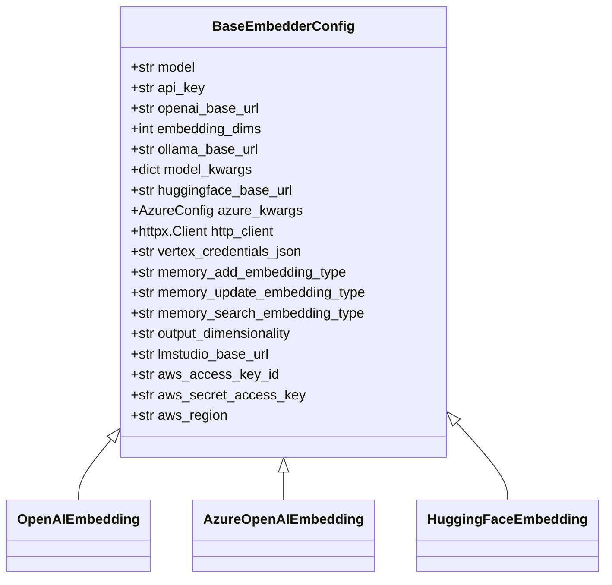
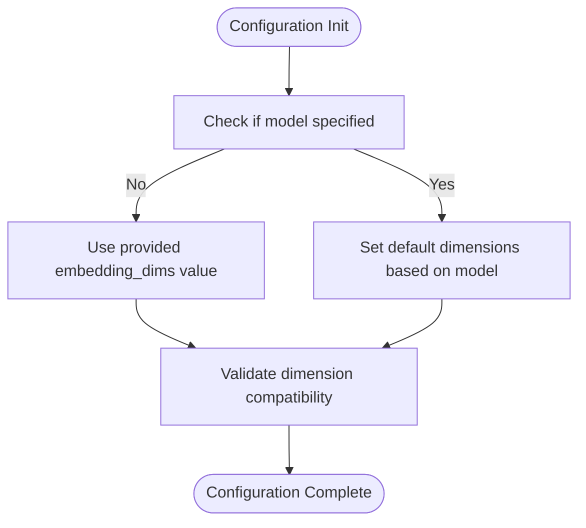
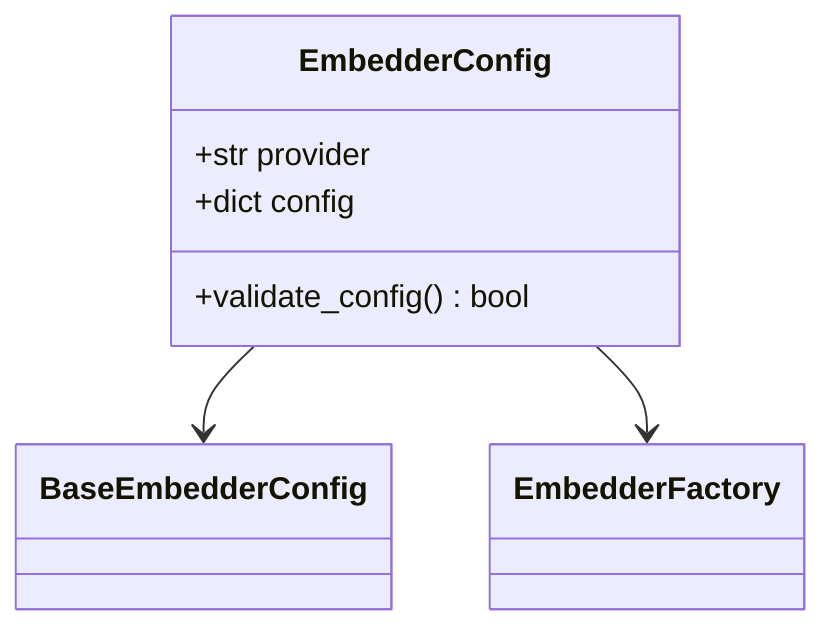
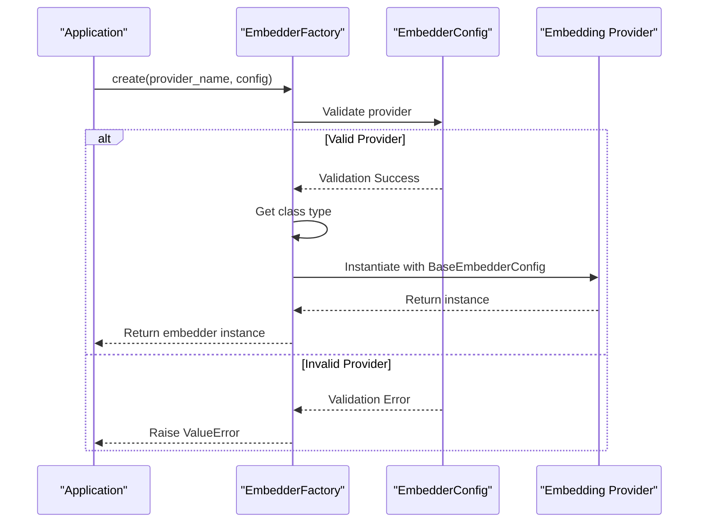
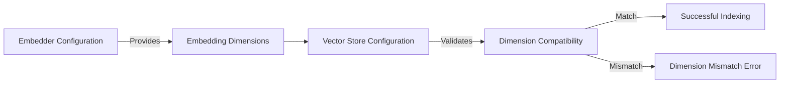

# Embedder Configuration

<cite>
**Referenced Files in This Document**   
- [base.py](file://mem0/configs/embeddings/base.py)
- [base.py](file://mem0/embeddings/base.py)
- [factory.py](file://mem0/utils/factory.py)
- [openai.py](file://mem0/embeddings/openai.py)
- [azure_openai.py](file://mem0/embeddings/azure_openai.py)
- [huggingface.py](file://mem0/embeddings/huggingface.py)
- [configs.py](file://mem0/embeddings/configs.py)
- [base.py](file://mem0/configs/base.py)
</cite>

## Table of Contents
1. [Introduction](#introduction)
2. [Core Configuration Interface](#core-configuration-interface)
3. [Provider-Agnostic Configuration Options](#provider-agnostic-configuration-options)
4. [Configuration Validation and Factory Pattern](#configuration-validation-and-factory-pattern)
5. [Vector Store Dimension Compatibility](#vector-store-dimension-compatibility)
6. [Provider-Specific Configuration Examples](#provider-specific-configuration-examples)
7. [Common Issues and Troubleshooting](#common-issues-and-troubleshooting)
8. [Performance Considerations](#performance-considerations)

## Introduction
The embedder configuration system in mem0 provides a unified interface for managing various embedding models across different providers. This documentation details the configuration architecture, focusing on the common interface defined in the BaseEmbedderConfig class, provider-agnostic settings, and the integration between embedder configurations and vector store configurations. The system supports both API-based services and local models, with comprehensive configuration options for different deployment scenarios.

**Section sources**
- [base.py](file://mem0/configs/embeddings/base.py#L10-L111)

## Core Configuration Interface

The embedder configuration system is built around the `BaseEmbedderConfig` abstract base class, which defines the common interface for all embedding models. This class serves as the foundation for configuring embedding parameters across different providers, ensuring consistency in configuration patterns.



**Diagram sources**
- [base.py](file://mem0/configs/embeddings/base.py#L10-L111)

**Section sources**
- [base.py](file://mem0/configs/embeddings/base.py#L10-L111)

## Provider-Agnostic Configuration Options

The embedder configuration system provides several provider-agnostic settings that apply across different embedding models. These options allow for consistent configuration patterns regardless of the underlying provider.

### Embedding Dimensions
The `embedding_dims` parameter specifies the number of dimensions in the generated embedding vectors. This setting is crucial for ensuring compatibility with vector stores and can be explicitly set or automatically determined based on the model.



**Diagram sources**
- [base.py](file://mem0/configs/embeddings/base.py#L19-L20)
- [openai.py](file://mem0/embeddings/openai.py#L16)

### Distance Metrics and Batch Processing
While not explicitly configured in the base class, the embedder system supports batch processing through the embed method, which can handle single texts or batches of texts. Distance metrics are typically determined by the vector store configuration rather than the embedder configuration, ensuring separation of concerns between embedding generation and similarity calculation.

**Section sources**
- [base.py](file://mem0/configs/embeddings/base.py#L10-L111)
- [base.py](file://mem0/embeddings/base.py#L21-L31)

## Configuration Validation and Factory Pattern

The embedder configuration system uses Pydantic for validation and a factory pattern for instantiation, ensuring type safety and consistent object creation.

### Configuration Validation with Pydantic
The system employs Pydantic models to validate configuration parameters at runtime. The `EmbedderConfig` class validates the provider and configuration dictionary, ensuring that only supported providers are used.



**Diagram sources**
- [configs.py](file://mem0/embeddings/configs.py#L6-L32)

### EmbedderFactory Integration
The `EmbedderFactory` class handles the instantiation of embedder instances based on the provider configuration. It maps provider names to their corresponding classes and creates instances with the appropriate configuration.



**Diagram sources**
- [factory.py](file://mem0/utils/factory.py#L131-L157)

**Section sources**
- [configs.py](file://mem0/embeddings/configs.py#L6-L32)
- [factory.py](file://mem0/utils/factory.py#L131-L157)

## Vector Store Dimension Compatibility

The relationship between embedder configuration and vector store configuration is critical for system functionality, particularly regarding dimension compatibility.

### Dimension Synchronization
The embedding dimensions specified in the embedder configuration must match the dimensions expected by the vector store. The system handles this through automatic dimension detection and explicit configuration.



### Automatic Dimension Detection
For local models like Hugging Face embeddings, the system automatically detects the embedding dimensions by querying the model's configuration. This ensures compatibility without requiring manual dimension specification.

**Section sources**
- [huggingface.py](file://mem0/embeddings/huggingface.py#L26)
- [base.py](file://mem0/configs/embeddings/base.py#L19-L20)

## Provider-Specific Configuration Examples

The embedder configuration system supports various providers with specific configuration options for each.

### OpenAI Configuration
The OpenAI embedder configuration includes provider-specific options such as custom base URLs and automatic API key retrieval from environment variables.

```python
# Example OpenAI configuration
config = BaseEmbedderConfig(
    model="text-embedding-3-small",
    api_key="your-api-key",
    embedding_dims=1536,
    openai_base_url="https://api.openai.com/v1"
)
```

**Section sources**
- [openai.py](file://mem0/embeddings/openai.py#L11-L50)

### Azure OpenAI Configuration
The Azure OpenAI embedder uses Azure-specific configuration through the `azure_kwargs` parameter, which contains deployment-specific settings.

```python
# Example Azure OpenAI configuration
config = BaseEmbedderConfig(
    azure_kwargs=AzureConfig(
        api_key="your-api-key",
        azure_deployment="your-deployment",
        azure_endpoint="https://your-endpoint.openai.azure.com",
        api_version="2023-05-15"
    )
)
```

**Section sources**
- [azure_openai.py](file://mem0/embeddings/azure_openai.py#L13-L56)

### Hugging Face Configuration
The Hugging Face embedder supports both local models and API-based services, with configuration options for model kwargs and custom base URLs.

```python
# Example Hugging Face configuration
config = BaseEmbedderConfig(
    model="all-MiniLM-L6-v2",
    model_kwargs={"device": "cuda"},
    embedding_dims=384
)
```

**Section sources**
- [huggingface.py](file://mem0/embeddings/huggingface.py#L15-L42)

## Common Issues and Troubleshooting

### Dimension Mismatches
Dimension mismatches between embedders and vector stores are a common issue. This typically occurs when:
- The embedder's `embedding_dims` parameter doesn't match the vector store's expected dimensions
- Automatic dimension detection fails for custom models
- Configuration is inconsistent across different components

**Troubleshooting Steps:**
1. Verify the embedder's `embedding_dims` value
2. Check the vector store configuration for dimension requirements
3. Ensure consistent configuration across all components

### Slow Embedding Generation
Slow embedding generation can occur due to:
- Network latency with API-based services
- Insufficient hardware resources for local models
- Large batch sizes overwhelming the embedding model

**Optimization Strategies:**
- Use batch processing for multiple texts
- Implement caching for frequently embedded content
- Optimize hardware configuration for local models

### API Key Management
API key management issues commonly arise from:
- Missing or incorrect API keys
- Environment variable configuration errors
- Permission issues with cloud providers

**Best Practices:**
- Use environment variables for API keys
- Implement secure key storage solutions
- Provide clear error messages for authentication failures

**Section sources**
- [base.py](file://mem0/configs/embeddings/base.py#L18-L19)
- [openai.py](file://mem0/embeddings/openai.py#L18-L23)
- [azure_openai.py](file://mem0/embeddings/azure_openai.py#L17-L20)

## Performance Considerations

### Synchronous vs Asynchronous Generation
The embedder system currently uses synchronous embedding generation, which can impact performance during bulk operations. For high-throughput scenarios, consider:

- Implementing batch processing to reduce API call overhead
- Using connection pooling for API-based services
- Optimizing local model loading and caching

### Memory Usage Patterns
Memory usage during bulk operations varies significantly based on the embedder type:

- **API-based services**: Lower memory usage, as processing occurs remotely
- **Local models**: Higher memory usage due to model loading and computation
- **Hybrid approaches**: Variable memory usage depending on configuration

**Optimization Recommendations:**
- Monitor memory usage during bulk operations
- Implement streaming for large datasets
- Use appropriate batch sizes to balance memory and performance

**Section sources**
- [base.py](file://mem0/configs/embeddings/base.py#L82-L83)
- [huggingface.py](file://mem0/embeddings/huggingface.py#L24-L25)