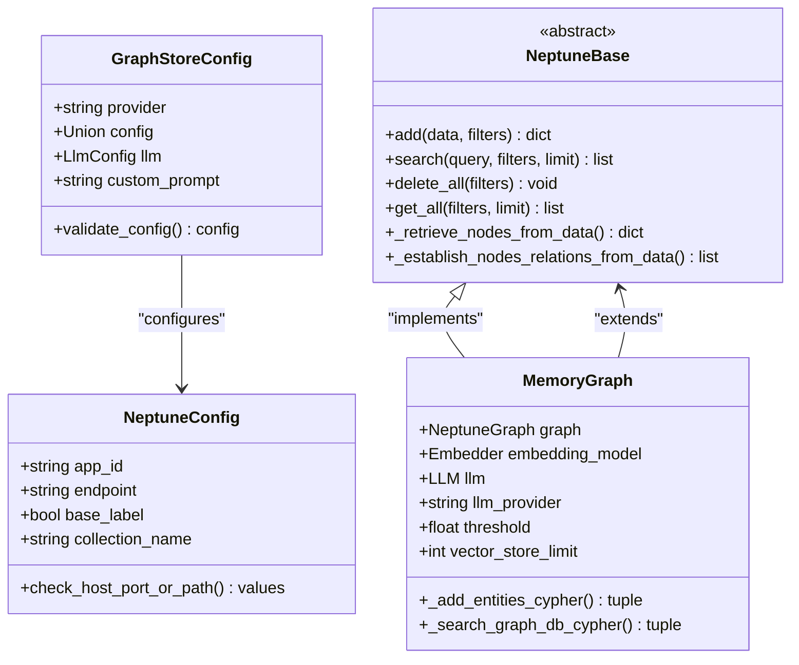
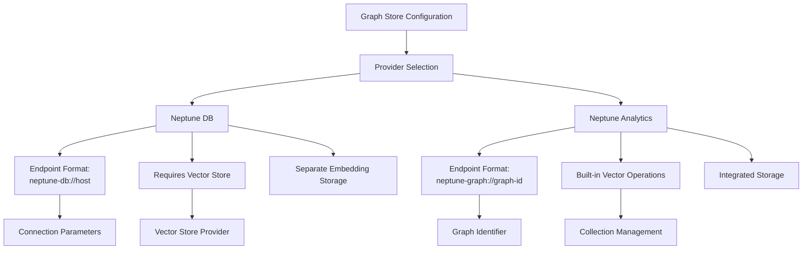
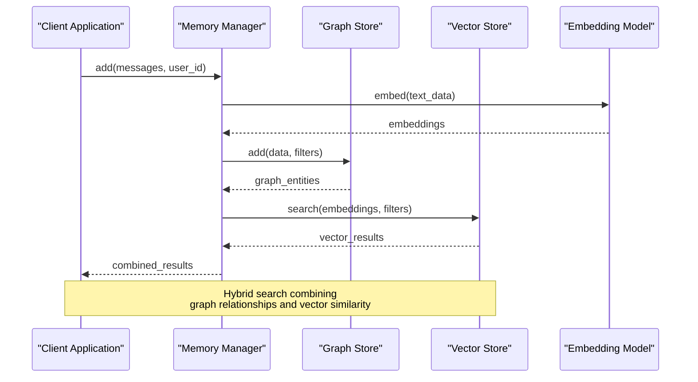

# Graph Store Configuration

<cite>
**Referenced Files in This Document**
- [mem0/graphs/configs.py](file://mem0/graphs/configs.py)
- [mem0/graphs/neptune/base.py](file://mem0/graphs/neptune/base.py)
- [mem0/graphs/neptune/neptunedb.py](file://mem0/graphs/neptune/neptunedb.py)
- [mem0/graphs/neptune/neptunegraph.py](file://mem0/graphs/neptune/neptunegraph.py)
- [mem0/vector_stores/neptune_analytics.py](file://mem0/vector_stores/neptune_analytics.py)
- [mem0/utils/factory.py](file://mem0/utils/factory.py)
- [mem0/memory/main.py](file://mem0/memory/main.py)
- [mem0/configs/base.py](file://mem0/configs/base.py)
- [examples/graph-db-demo/neptune-db-example.ipynb](file://examples/graph-db-demo/neptune-db-example.ipynb)
- [examples/graph-db-demo/neptune-example.ipynb](file://examples/graph-db-demo/neptune-example.ipynb)
- [mem0/exceptions.py](file://mem0/exceptions.py)
</cite>

## Table of Contents
1. [Introduction](#introduction)
2. [Graph Store Architecture](#graph-store-architecture)
3. [Neptune Graph Database Configuration](#neptune-graph-database-configuration)
4. [Connection Parameters and Authentication](#connection-parameters-and-authentication)
5. [Cluster Settings and Deployment Types](#cluster-settings-and-deployment-types)
6. [Query Optimization Options](#query-optimization-options)
7. [Hybrid Memory Systems](#hybrid-memory-systems)
8. [Configuration Examples](#configuration-examples)
9. [Common Issues and Troubleshooting](#common-issues-and-troubleshooting)
10. [Use Cases and Best Practices](#use-cases-and-best-practices)

## Introduction

The mem0 framework provides comprehensive graph store configuration capabilities, with Amazon Neptune as the primary implementation. Graph stores enable sophisticated memory management by maintaining relationships between entities in a graph format, allowing for complex queries and knowledge graph applications. This documentation covers the Neptune graph database configuration, including connection parameters, authentication methods, cluster settings, and integration with vector stores in hybrid memory systems.

## Graph Store Architecture

The mem0 framework implements a modular graph store architecture that supports multiple providers while maintaining consistent interfaces. The graph store system is built around the concept of entities and relationships, where entities represent concepts or objects, and relationships define how these entities interact.



**Diagram sources**
- [mem0/graphs/configs.py](file://mem0/graphs/configs.py#L44-L106)
- [mem0/graphs/neptune/base.py](file://mem0/graphs/neptune/base.py#L25-L498)

**Section sources**
- [mem0/graphs/configs.py](file://mem0/graphs/configs.py#L80-L106)
- [mem0/graphs/neptune/base.py](file://mem0/graphs/neptune/base.py#L25-L50)

## Neptune Graph Database Configuration

### Neptune DB vs Neptune Analytics

The mem0 framework supports two distinct Neptune deployment types, each with different capabilities and use cases:

#### Neptune DB (Serverless)
Neptune DB is a serverless graph database that stores graph data directly in the database. It requires a separate vector store for vector operations and provides traditional graph database capabilities.

#### Neptune Analytics
Neptune Analytics is a serverless graph analytics service that combines graph storage with vector operations. It supports vector similarity search directly within the graph database, eliminating the need for a separate vector store.

### Configuration Structure

The Neptune configuration follows a standardized structure that accommodates both deployment types:



**Diagram sources**
- [mem0/graphs/configs.py](file://mem0/graphs/configs.py#L44-L74)

**Section sources**
- [mem0/graphs/configs.py](file://mem0/graphs/configs.py#L44-L74)

## Connection Parameters and Authentication

### Endpoint Configuration

Both Neptune DB and Neptune Analytics require specific endpoint formats for proper connection establishment:

#### Neptune DB Connection
```python
{
    "graph_store": {
        "provider": "neptunedb",
        "config": {
            "endpoint": "neptune-db://your-neptune-cluster-endpoint",
            "collection_name": "mem0_neptune_entities"
        }
    }
}
```

#### Neptune Analytics Connection
```python
{
    "graph_store": {
        "provider": "neptune",
        "config": {
            "endpoint": "neptune-graph://g-xxxxxxxxxxxx",
            "app_id": "Mem0"
        }
    }
}
```

### Authentication Methods

#### AWS IAM Authentication
For production deployments, AWS IAM authentication is recommended:

```python
import boto3
from mem0 import Memory

# Configure AWS credentials
boto3_session = boto3.Session(region_name='us-west-2')
credentials = boto3_session.get_credentials()

# Memory configuration with IAM authentication
config = {
    "graph_store": {
        "provider": "neptune",
        "config": {
            "endpoint": "neptune-graph://g-xxxxxxxxxxxx",
            "app_id": "Mem0"
        }
    },
    "vector_store": {
        "provider": "neptune",
        "config": {
            "endpoint": "neptune-graph://g-xxxxxxxxxxxx"
        }
    }
}

memory = Memory.from_config(config)
```

#### Environment Variables
Configure AWS credentials using standard environment variables:
- `AWS_ACCESS_KEY_ID`
- `AWS_SECRET_ACCESS_KEY`
- `AWS_REGION`

### Connection Security

#### SSL/TLS Configuration
Both Neptune DB and Neptune Analytics support encrypted connections:

```python
# Neptune DB with SSL
config = {
    "graph_store": {
        "provider": "neptunedb",
        "config": {
            "endpoint": "neptune-db://your-cluster.cluster-xxxxxxxxxxx.region.neptune.amazonaws.com",
            "collection_name": "mem0_neptune_entities"
        }
    },
    "vector_store": {
        "provider": "opensearch",
        "config": {
            "host": "your-opensearch-domain.region.es.amazonaws.com",
            "use_ssl": True,
            "verify_certs": True,
            "http_auth": AWSV4SignerAuth(credentials, 'region')
        }
    }
}
```

**Section sources**
- [mem0/graphs/configs.py](file://mem0/graphs/configs.py#L44-L74)
- [examples/graph-db-demo/neptune-db-example.ipynb](file://examples/graph-db-demo/neptune-db-example.ipynb#L130-L145)

## Cluster Settings and Deployment Types

### Neptune DB Cluster Configuration

#### Serverless Deployment
Serverless Neptune DB automatically scales compute capacity based on workload demands:

```python
# Serverless Neptune DB configuration
neptune_db_config = {
    "graph_store": {
        "provider": "neptunedb",
        "config": {
            "endpoint": "neptune-db://your-serverless-cluster.cluster-xxxxxxxxxxx.region.neptune.amazonaws.com",
            "collection_name": "mem0_neptune_entities",
            "base_label": True  # Use __Entity__ as base label
        }
    }
}
```

#### Provisioned Deployment
Provisioned clusters offer predictable performance with fixed resources:

```python
# Provisioned Neptune DB configuration
provisioned_config = {
    "graph_store": {
        "provider": "neptunedb",
        "config": {
            "endpoint": "neptune-db://your-provisioned-cluster.cluster-xxxxxxxxxxx.region.neptune.amazonaws.com",
            "collection_name": "mem0_neptune_entities",
            "base_label": False  # Custom node labels
        }
    }
}
```

### Neptune Analytics Global Clusters

#### Multi-Region Deployment
Neptune Analytics supports global clusters for cross-region replication:

```python
# Global cluster configuration
global_cluster_config = {
    "graph_store": {
        "provider": "neptune",
        "config": {
            "endpoint": "neptune-graph://g-global-cluster-id",
            "app_id": "Mem0-Global"
        }
    }
}
```

#### Regional Endpoints
Each region in a global cluster has its own endpoint:

```python
# Region-specific configuration
region_configs = {
    "us-east-1": {
        "graph_store": {
            "provider": "neptune",
            "config": {
                "endpoint": "neptune-graph://g-xxxxxxxxxxxx.us-east-1.neptune.amazonaws.com"
            }
        }
    },
    "eu-west-1": {
        "graph_store": {
            "provider": "neptune",
            "config": {
                "endpoint": "neptune-graph://g-xxxxxxxxxxxx.eu-west-1.neptune.amazonaws.com"
            }
        }
    }
}
```

**Section sources**
- [mem0/graphs/neptune/neptunedb.py](file://mem0/graphs/neptune/neptunedb.py#L15-L32)
- [mem0/graphs/neptune/neptunegraph.py](file://mem0/graphs/neptune/neptunegraph.py#L14-L28)

## Query Optimization Options

### Vector Search Optimization

#### Threshold Configuration
Adjust similarity thresholds for vector search operations:

```python
# Memory initialization with custom threshold
memory = Memory.from_config(config)
memory.graph.threshold = 0.8  # Higher threshold for stricter matching
```

#### Vector Store Limits
Control the number of vector search results:

```python
# Configure vector store limits
memory.graph.vector_store_limit = 10  # Increase for more candidates
```

### Cypher Query Optimization

#### Index Management
Neptune automatically manages indexes for vector operations in Neptune Analytics, but manual optimization may be needed for Neptune DB:

```python
# Neptune DB Cypher optimization
class OptimizedMemoryGraph(NeptuneBase):
    def _search_graph_db_cypher(self, n_embedding, filters, limit):
        # Optimized query with proper indexing hints
        cypher_query = f"""
            MATCH (n {self.node_label})
            WHERE n.user_id = $user_id
            WITH n, $n_embedding as n_embedding
            CALL neptune.algo.vectors.distanceByEmbedding(
                n_embedding,
                n,
                {{metric:"CosineSimilarity"}}
            ) YIELD distance
            WITH n, distance as similarity
            WHERE similarity >= $threshold
            CALL {{
                WITH n
                MATCH (n)-[r]->(m) 
                RETURN n.name AS source, id(n) AS source_id, 
                       type(r) AS relationship, id(r) AS relation_id, 
                       m.name AS destination, id(m) AS destination_id
                UNION ALL
                WITH n
                MATCH (m)-[r]->(n) 
                RETURN m.name AS source, id(m) AS source_id, 
                       type(r) AS relationship, id(r) AS relation_id, 
                       n.name AS destination, id(n) AS destination_id
            }}
            WITH distinct source, source_id, relationship, relation_id, 
                 destination, destination_id, similarity
            RETURN source, source_id, relationship, relation_id, 
                   destination, destination_id, similarity
            ORDER BY similarity DESC
            LIMIT $limit
        """
        return cypher_query, {
            "n_embedding": n_embedding,
            "threshold": self.threshold,
            "user_id": filters["user_id"],
            "limit": limit
        }
```

### Performance Tuning Parameters

#### Connection Pooling
Optimize connection management for high-throughput applications:

```python
# Connection pooling configuration
connection_config = {
    "min_connections": 5,
    "max_connections": 20,
    "connection_timeout": 30,
    "idle_timeout": 300
}
```

#### Batch Processing
Enable batch operations for improved throughput:

```python
# Batch processing for bulk operations
def batch_add_entities(self, entity_batches, filters):
    with self.graph.transaction() as tx:
        for batch in entity_batches:
            tx.run(batch_query, batch_params)
        tx.commit()
```

**Section sources**
- [mem0/graphs/neptune/neptunedb.py](file://mem0/graphs/neptune/neptunedb.py#L58-L61)
- [mem0/graphs/neptune/neptunegraph.py](file://mem0/graphs/neptune/neptunegraph.py#L41-L43)

## Hybrid Memory Systems

### Vector Store Integration

The mem0 framework supports hybrid memory systems where graph stores work alongside vector stores for optimal performance:



**Diagram sources**
- [mem0/memory/main.py](file://mem0/memory/main.py#L283-L291)
- [mem0/memory/main.py](file://mem0/memory/main.py#L483-L492)

### Configuration for Hybrid Systems

#### Neptune DB with External Vector Store
```python
hybrid_config = {
    "embedder": {
        "provider": "aws_bedrock",
        "config": {
            "model": "amazon.titan-embed-text-v2:0"
        }
    },
    "llm": {
        "provider": "aws_bedrock",
        "config": {
            "model": "anthropic.claude-3-sonnet-20241022-v1:0"
        }
    },
    "vector_store": {
        "provider": "opensearch",
        "config": {
            "host": "your-opensearch-domain.region.es.amazonaws.com",
            "port": 443,
            "use_ssl": True,
            "embedding_model_dims": 1024
        }
    },
    "graph_store": {
        "provider": "neptunedb",
        "config": {
            "endpoint": "neptune-db://your-neptune-cluster.cluster-xxxxxxxxxxx.region.neptune.amazonaws.com",
            "collection_name": "mem0_neptune_entities"
        }
    }
}
```

#### Neptune Analytics (Self-contained)
```python
analytics_config = {
    "embedder": {
        "provider": "aws_bedrock",
        "config": {
            "model": "amazon.titan-embed-text-v2:0",
            "embedding_dims": 1024
        }
    },
    "llm": {
        "provider": "aws_bedrock",
        "config": {
            "model": "anthropic.claude-3-sonnet-20241022-v1:0"
        }
    },
    "vector_store": {
        "provider": "neptune",
        "config": {
            "endpoint": "neptune-graph://g-xxxxxxxxxxxx"
        }
    },
    "graph_store": {
        "provider": "neptune",
        "config": {
            "endpoint": "neptune-graph://g-xxxxxxxxxxxx"
        }
    }
}
```

### Memory Management Strategies

#### Graph Store Advantages
- **Relationship Tracking**: Maintains complex relationships between entities
- **Query Flexibility**: Supports sophisticated graph queries and traversals
- **Knowledge Graph Applications**: Ideal for semantic networks and ontologies
- **Entity Resolution**: Automatically detects and merges similar entities

#### Vector Store Advantages
- **Scalability**: Handles large-scale vector operations efficiently
- **Similarity Search**: Fast approximate nearest neighbor search
- **Dimensionality**: Supports various embedding dimensions
- **Integration**: Works seamlessly with existing vector databases

**Section sources**
- [mem0/memory/main.py](file://mem0/memory/main.py#L150-L158)
- [mem0/utils/factory.py](file://mem0/utils/factory.py#L202-L223)

## Configuration Examples

### Basic Neptune Analytics Configuration

```python
# Minimal Neptune Analytics setup
basic_config = {
    "embedder": {
        "provider": "aws_bedrock",
        "config": {
            "model": "amazon.titan-embed-text-v2:0",
            "embedding_dims": 1024
        }
    },
    "llm": {
        "provider": "aws_bedrock",
        "config": {
            "model": "anthropic.claude-3-sonnet-20241022-v1:0"
        }
    },
    "vector_store": {
        "provider": "neptune",
        "config": {
            "endpoint": "neptune-graph://g-xxxxxxxxxxxx"
        }
    },
    "graph_store": {
        "provider": "neptune",
        "config": {
            "endpoint": "neptune-graph://g-xxxxxxxxxxxx"
        }
    }
}
```

### Production Neptune DB Configuration

```python
# Production-grade Neptune DB setup with external vector store
production_config = {
    "embedder": {
        "provider": "aws_bedrock",
        "config": {
            "model": "amazon.titan-embed-text-v2:0"
        }
    },
    "llm": {
        "provider": "aws_bedrock",
        "config": {
            "model": "anthropic.claude-3-sonnet-20241022-v1:0",
            "temperature": 0.1,
            "max_tokens": 2000
        }
    },
    "vector_store": {
        "provider": "opensearch",
        "config": {
            "collection_name": "mem0ai_text_summaries",
            "host": "your-opensearch-domain.region.es.amazonaws.com",
            "port": 443,
            "http_auth": AWSV4SignerAuth(credentials, 'region'),
            "connection_class": RequestsHttpConnection,
            "use_ssl": True,
            "verify_certs": True,
            "embedding_model_dims": 1024
        }
    },
    "graph_store": {
        "provider": "neptunedb",
        "config": {
            "collection_name": "mem0ai_neptune_entities",
            "endpoint": "neptune-db://your-neptune-cluster.cluster-xxxxxxxxxxx.region.neptune.amazonaws.com"
        }
    }
}
```

### Development Configuration

```python
# Development setup with local vector store
dev_config = {
    "embedder": {
        "provider": "openai",
        "config": {
            "model": "text-embedding-3-small"
        }
    },
    "llm": {
        "provider": "openai",
        "config": {
            "model": "gpt-4o-mini"
        }
    },
    "vector_store": {
        "provider": "qdrant",
        "config": {
            "location": ":memory:",
            "collection_name": "mem0_dev"
        }
    },
    "graph_store": {
        "provider": "neptune",
        "config": {
            "endpoint": "neptune-graph://g-dev-cluster"
        }
    }
}
```

### Multi-Environment Configuration

```python
# Environment-specific configurations
environment_configs = {
    "development": {
        "graph_store": {
            "provider": "neptune",
            "config": {
                "endpoint": "neptune-graph://g-dev-cluster"
            }
        }
    },
    "staging": {
        "graph_store": {
            "provider": "neptune",
            "config": {
                "endpoint": "neptune-graph://g-staging-cluster"
            }
        }
    },
    "production": {
        "graph_store": {
            "provider": "neptune",
            "config": {
                "endpoint": "neptune-graph://g-production-cluster"
            }
        }
    }
}
```

**Section sources**
- [examples/graph-db-demo/neptune-db-example.ipynb](file://examples/graph-db-demo/neptune-db-example.ipynb#L130-L178)
- [examples/graph-db-demo/neptune-example.ipynb](file://examples/graph-db-demo/neptune-example.ipynb#L125-L159)

## Common Issues and Troubleshooting

### Connection Timeout Issues

#### Symptoms
- Connection attempts fail with timeout errors
- Slow initial connection establishment
- Intermittent connectivity issues

#### Solutions

##### Increase Connection Timeout
```python
# Configure longer timeout for Neptune DB
config = {
    "graph_store": {
        "provider": "neptunedb",
        "config": {
            "endpoint": "neptune-db://your-cluster.cluster-xxxxxxxxxxx.region.neptune.amazonaws.com",
            "connection_timeout": 60  # Increase from default
        }
    }
}
```

##### Enable Connection Retry
```python
# Implement retry logic for connection failures
import time
from botocore.exceptions import ClientError

def connect_with_retry(graph_config, max_retries=3):
    for attempt in range(max_retries):
        try:
            memory = Memory.from_config(graph_config)
            return memory
        except ClientError as e:
            if attempt < max_retries - 1:
                time.sleep(2 ** attempt)  # Exponential backoff
                continue
            raise
```

### IAM Role Configuration Issues

#### Common Problems
- Insufficient permissions for Neptune operations
- Incorrect IAM role attachment
- Missing cross-account access permissions

#### Solution: Proper IAM Policy

```json
{
    "Version": "2012-10-17",
    "Statement": [
        {
            "Effect": "Allow",
            "Action": [
                "neptune-db:*",
                "neptune-graph:*",
                "iam:PassRole"
            ],
            "Resource": "*"
        },
        {
            "Effect": "Allow",
            "Action": [
                "bedrock:*"
            ],
            "Resource": "*"
        }
    ]
}
```

### Query Performance Issues

#### Symptoms
- Slow graph traversal operations
- High latency in relationship queries
- Memory exhaustion during large queries

#### Optimization Strategies

##### Query Optimization
```python
# Optimized graph query with proper indexing
def optimized_traversal_query(self, user_id, depth=2):
    cypher_query = f"""
        MATCH (u:User {{user_id: $user_id}})
        OPTIONAL MATCH (u)-[r1]->(n1)
        WHERE r1.created_at > datetime().minus(duration('P7D'))
        OPTIONAL MATCH (n1)-[r2]->(n2)
        WHERE depth <= $depth AND r2.created_at > datetime().minus(duration('P14D'))
        RETURN u, collect(DISTINCT n1) as nodes1, collect(DISTINCT n2) as nodes2
        LIMIT 100
    """
    return self.graph.query(cypher_query, {
        "user_id": user_id,
        "depth": depth
    })
```

##### Vector Search Tuning
```python
# Fine-tune vector search parameters
memory.graph.threshold = 0.7  # Adjust based on domain
memory.graph.vector_store_limit = 5  # Limit search candidates
```

### Memory Management Issues

#### Out of Memory Errors
```python
# Monitor and manage memory usage
def monitor_memory_usage(memory):
    import psutil
    import gc
    
    # Force garbage collection
    gc.collect()
    
    # Check system memory
    memory_info = psutil.virtual_memory()
    if memory_info.percent > 80:
        # Reduce batch sizes or clear caches
        memory.graph.vector_store_limit = 3
```

#### Large Dataset Handling
```python
# Process large datasets in batches
def process_large_dataset(memory, messages_list, batch_size=100):
    results = []
    for i in range(0, len(messages_list), batch_size):
        batch = messages_list[i:i + batch_size]
        batch_result = memory.add(batch, user_id="batch_user")
        results.extend(batch_result)
        # Clear intermediate results
        del batch_result
    return results
```

### Authentication and Authorization Issues

#### Debugging Authentication
```python
# Comprehensive authentication debugging
def debug_authentication():
    import boto3
    
    try:
        # Test AWS credentials
        sts_client = boto3.client('sts')
        identity = sts_client.get_caller_identity()
        print(f"Authenticated as: {identity['Arn']}")
        
        # Test Neptune access
        neptune_client = boto3.client('neptune-graph')
        response = neptune_client.list_graphs()
        print(f"Available graphs: {len(response.get('graphs', []))}")
        
    except Exception as e:
        print(f"Authentication failed: {e}")
        print("Check AWS credentials and IAM permissions")
```

**Section sources**
- [mem0/exceptions.py](file://mem0/exceptions.py#L64-L223)
- [mem0/llms/aws_bedrock.py](file://mem0/llms/aws_bedrock.py#L76-L106)

## Use Cases and Best Practices

### When to Use Graph Stores vs Vector Stores

#### Graph Store Use Cases
- **Complex Relationship Tracking**: When entities have intricate relationships that need to be maintained
- **Knowledge Graph Applications**: Semantic networks, ontologies, and taxonomies
- **Recommendation Systems**: Social networks, product recommendations with complex user-item relationships
- **Entity Resolution**: Automatic merging of similar entities across different contexts
- **Temporal Graphs**: Time-aware relationships and historical tracking

#### Vector Store Use Cases
- **Large-Scale Similarity Search**: Massive datasets requiring fast approximate nearest neighbor search
- **Content-Based Retrieval**: Text, image, or multimedia content similarity
- **Dimensionality Reduction**: High-dimensional data compression for efficient storage
- **Batch Processing**: Bulk operations on large datasets
- **Real-Time Applications**: Low-latency similarity queries

### Recommended Architectures

#### Knowledge Graph Architecture
```python
# Knowledge graph configuration
knowledge_graph_config = {
    "embedder": {
        "provider": "aws_bedrock",
        "config": {
            "model": "amazon.titan-embed-text-v2:0",
            "embedding_dims": 1024
        }
    },
    "llm": {
        "provider": "aws_bedrock",
        "config": {
            "model": "anthropic.claude-3-sonnet-20241022-v1:0"
        }
    },
    "vector_store": {
        "provider": "neptune",
        "config": {
            "endpoint": "neptune-graph://g-knowledge-graph"
        }
    },
    "graph_store": {
        "provider": "neptune",
        "config": {
            "endpoint": "neptune-graph://g-knowledge-graph"
        }
    }
}
```

#### Recommendation System Architecture
```python
# Recommendation system configuration
recommendation_config = {
    "embedder": {
        "provider": "openai",
        "config": {
            "model": "text-embedding-3-large"
        }
    },
    "llm": {
        "provider": "openai",
        "config": {
            "model": "gpt-4o"
        }
    },
    "vector_store": {
        "provider": "opensearch",
        "config": {
            "host": "recommendation-vector-store.domain.com",
            "embedding_model_dims": 3072
        }
    },
    "graph_store": {
        "provider": "neptune",
        "config": {
            "endpoint": "neptune-graph://g-recommendation-graph"
        }
    }
}
```

### Performance Best Practices

#### Query Optimization Guidelines
1. **Use Appropriate Thresholds**: Set similarity thresholds based on domain requirements
2. **Limit Query Results**: Control the number of returned entities and relationships
3. **Index Management**: Leverage automatic indexing in Neptune Analytics
4. **Batch Operations**: Group related operations for better performance
5. **Connection Pooling**: Reuse connections for multiple operations

#### Memory Management
1. **Monitor Resource Usage**: Track memory consumption during operations
2. **Garbage Collection**: Regular cleanup of unused objects
3. **Batch Processing**: Process large datasets in manageable chunks
4. **Connection Limits**: Set appropriate limits for concurrent connections

#### Security Best Practices
1. **IAM Roles**: Use dedicated IAM roles with minimal permissions
2. **Network Security**: Deploy in VPC with proper security groups
3. **Encryption**: Enable encryption at rest and in transit
4. **Access Logging**: Monitor access patterns and anomalies

### Monitoring and Observability

#### Performance Metrics
```python
# Comprehensive monitoring setup
import logging
import time

class NeptuneMonitor:
    def __init__(self, memory):
        self.memory = memory
        self.logger = logging.getLogger(__name__)
        
    def measure_query_time(self, query_func, *args, **kwargs):
        start_time = time.time()
        try:
            result = query_func(*args, **kwargs)
            duration = time.time() - start_time
            self.logger.info(f"Query completed in {duration:.2f}s")
            return result
        except Exception as e:
            duration = time.time() - start_time
            self.logger.error(f"Query failed after {duration:.2f}s: {e}")
            raise
```

#### Health Checks
```python
# Neptune health check implementation
def check_neptune_health(memory):
    try:
        # Test basic connectivity
        memory.search("test query", user_id="health_check")
        return {"status": "healthy", "timestamp": time.time()}
    except Exception as e:
        return {"status": "unhealthy", "error": str(e), "timestamp": time.time()}
```

**Section sources**
- [mem0/memory/main.py](file://mem0/memory/main.py#L150-L158)
- [mem0/graphs/neptune/base.py](file://mem0/graphs/neptune/base.py#L58-L74)