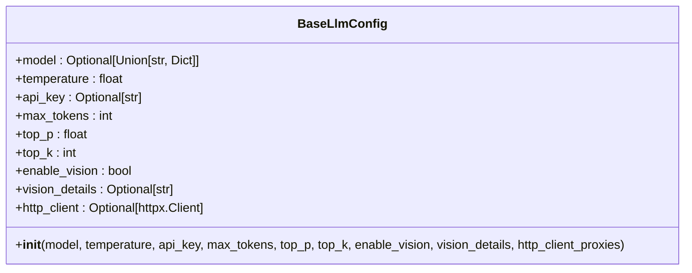
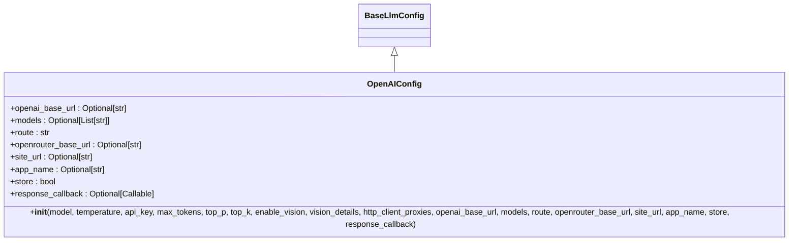
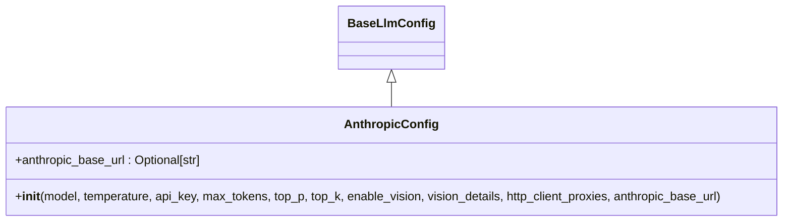
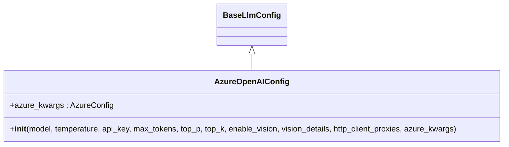
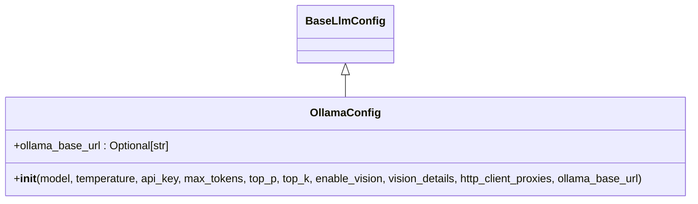
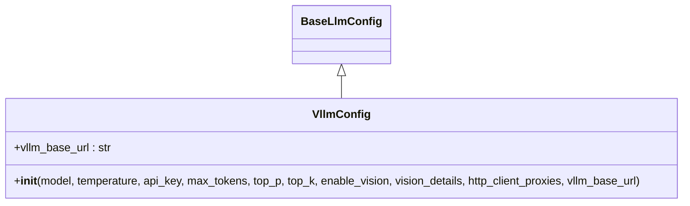
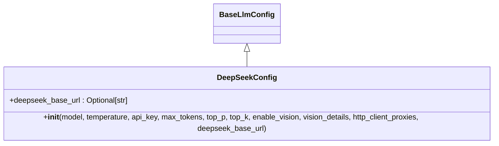
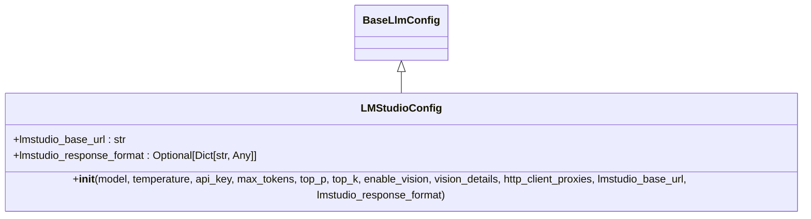
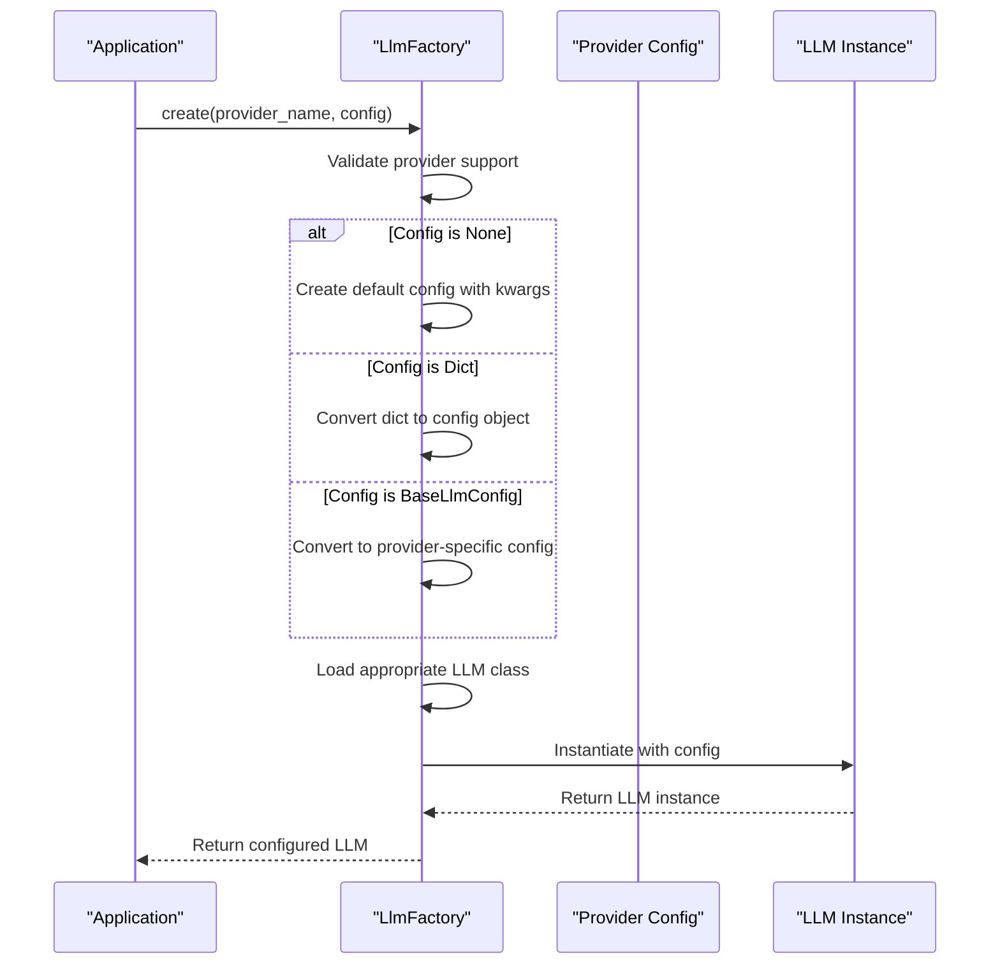

# LLM Configuration

<cite>
**Referenced Files in This Document**   
- [base.py](file://mem0/configs/llms/base.py)
- [openai.py](file://mem0/configs/llms/openai.py)
- [anthropic.py](file://mem0/configs/llms/anthropic.py)
- [azure.py](file://mem0/configs/llms/azure.py)
- [ollama.py](file://mem0/configs/llms/ollama.py)
- [vllm.py](file://mem0/configs/llms/vllm.py)
- [deepseek.py](file://mem0/configs/llms/deepseek.py)
- [lmstudio.py](file://mem0/configs/llms/lmstudio.py)
- [factory.py](file://mem0/utils/factory.py)
</cite>

## Table of Contents
1. [Introduction](#introduction)
2. [Base LLM Configuration](#base-llm-configuration)
3. [Provider-Specific Configurations](#provider-specific-configurations)
4. [Configuration Integration](#configuration-integration)
5. [Common Configuration Issues](#common-configuration-issues)
6. [Structured Output Configuration](#structured-output-configuration)
7. [Model Selection Guidance](#model-selection-guidance)
8. [Conclusion](#conclusion)

## Introduction
The mem0 framework provides a comprehensive LLM configuration system that supports multiple providers through a unified interface. This document details the configuration classes and their usage patterns across different LLM providers. The system is designed to be flexible, allowing users to configure various parameters for different LLM services while maintaining a consistent interface.

**Section sources**
- [base.py](file://mem0/configs/llms/base.py#L1-L63)

## Base LLM Configuration

The foundation of the LLM configuration system is the `BaseLlmConfig` class, which defines common parameters shared across all LLM providers. This abstract base class ensures consistency in configuration while allowing provider-specific extensions.

The base configuration includes essential parameters such as:
- **model**: The model identifier to use (e.g., "gpt-4o-mini", "claude-3-5-sonnet-20240620")
- **temperature**: Controls randomness of output (range: 0.0 to 2.0, default: 0.1)
- **api_key**: Authentication key for the LLM provider
- **max_tokens**: Maximum tokens to generate (default: 2000)
- **top_p**: Nucleus sampling parameter for diversity control (range: 0.0 to 1.0, default: 0.1)
- **top_k**: Top-k sampling parameter (default: 1)
- **enable_vision**: Flag to enable vision capabilities for multimodal models
- **vision_details**: Level of detail for vision processing ("low", "high", "auto")
- **http_client_proxies**: Proxy settings for HTTP client connections

**Diagram sources**
- [base.py](file://mem0/configs/llms/base.py#L7-L63)

**Section sources**
- [base.py](file://mem0/configs/llms/base.py#L7-L63)

## Provider-Specific Configurations

### OpenAI Configuration
The `OpenAIConfig` class extends the base configuration with OpenAI-specific parameters. It supports both OpenAI and OpenRouter services.

Key parameters include:
- **openai_base_url**: Custom base URL for OpenAI API
- **models**: List of models for OpenRouter
- **route**: OpenRouter route strategy ("fallback" by default)
- **openrouter_base_url**: OpenRouter API base URL
- **site_url**: Site URL for OpenRouter
- **app_name**: Application name for OpenRouter
- **store**: Boolean flag for storing usage data
- **response_callback**: Optional callback function for monitoring LLM responses

**Diagram sources**
- [openai.py](file://mem0/configs/llms/openai.py#L6-L80)

**Section sources**
- [openai.py](file://mem0/configs/llms/openai.py#L6-L80)

### Anthropic Configuration
The `AnthropicConfig` class adds Anthropic-specific settings to the base configuration.

Key parameter:
- **anthropic_base_url**: Custom base URL for Anthropic API

**Diagram sources**
- [anthropic.py](file://mem0/configs/llms/anthropic.py#L6-L57)

**Section sources**
- [anthropic.py](file://mem0/configs/llms/anthropic.py#L6-L57)

### Azure Configuration
The `AzureOpenAIConfig` class handles Azure OpenAI-specific parameters.

Key parameter:
- **azure_kwargs**: Dictionary of Azure-specific configuration options wrapped in AzureConfig

**Diagram sources**
- [azure.py](file://mem0/configs/llms/azure.py#L7-L58)

**Section sources**
- [azure.py](file://mem0/configs/llms/azure.py#L7-L58)

### Ollama Configuration
The `OllamaConfig` class provides Ollama-specific settings.

Key parameter:
- **ollama_base_url**: Base URL for Ollama server (default: None)

**Diagram sources**
- [ollama.py](file://mem0/configs/llms/ollama.py#L6-L57)

**Section sources**
- [ollama.py](file://mem0/configs/llms/ollama.py#L6-L57)

### VLLM Configuration
The `VllmConfig` class handles vLLM-specific parameters.

Key parameter:
- **vllm_base_url**: Base URL for vLLM server (default: "http://localhost:8000/v1")

**Diagram sources**
- [vllm.py](file://mem0/configs/llms/vllm.py#L6-L57)

**Section sources**
- [vllm.py](file://mem0/configs/llms/vllm.py#L6-L57)

### DeepSeek Configuration
The `DeepSeekConfig` class provides DeepSeek-specific settings.

Key parameter:
- **deepseek_base_url**: Base URL for DeepSeek API

**Diagram sources**
- [deepseek.py](file://mem0/configs/llms/deepseek.py#L6-L57)

**Section sources**
- [deepseek.py](file://mem0/configs/llms/deepseek.py#L6-L57)

### LMStudio Configuration
The `LMStudioConfig` class handles LM Studio-specific parameters.

Key parameters:
- **lmstudio_base_url**: Base URL for LM Studio server (default: "http://localhost:1234/v1")
- **lmstudio_response_format**: Response format configuration for structured output

**Diagram sources**
- [lmstudio.py](file://mem0/configs/llms/lmstudio.py#L6-L60)

**Section sources**
- [lmstudio.py](file://mem0/configs/llms/lmstudio.py#L6-L60)

## Configuration Integration

### MemoryConfig Integration
LLM configurations are integrated into the main `MemoryConfig` object, which serves as the central configuration hub for the mem0 framework. The LLM configuration is typically specified as part of the overall memory system configuration, allowing for coordinated setup of all components.

### LlmFactory Usage
The `LlmFactory` class is responsible for instantiating LLM clients based on the provided configuration. It uses a provider-to-class mapping system to determine the appropriate LLM implementation and configuration class.

**Diagram sources**
- [factory.py](file://mem0/utils/factory.py#L23-L104)

**Section sources**
- [factory.py](file://mem0/utils/factory.py#L23-L104)

## Common Configuration Issues

### Rate Limiting
Rate limiting issues can occur when exceeding API quotas. To mitigate:
- Implement retry logic with exponential backoff
- Monitor usage metrics
- Use appropriate rate limiting headers
- Consider upgrading API plans for higher limits

### Token Limits
Token limit issues arise when requests exceed model capacity:
- Monitor token usage with appropriate tools
- Implement text truncation or summarization for long inputs
- Use streaming responses for large outputs
- Select models with appropriate context window sizes

### Connection Timeouts
Connection issues may occur due to network problems:
- Configure appropriate timeout values
- Implement retry mechanisms
- Verify network connectivity and firewall settings
- Check provider status and availability

**Section sources**
- [base.py](file://mem0/configs/llms/base.py#L62)
- [factory.py](file://mem0/utils/factory.py#L66-L67)

## Structured Output Configuration

Structured output configuration is supported by providers that offer JSON schema validation or function calling capabilities. The configuration approach varies by provider:

- **OpenAI**: Uses response format parameters and function calling
- **LMStudio**: Utilizes the `lmstudio_response_format` parameter
- **Azure OpenAI**: Leverages structured output capabilities through Azure-specific settings
- **Anthropic**: Implements structured output through message format specifications

For providers supporting structured output, the configuration typically includes schema definitions and validation rules to ensure consistent response formats.

**Section sources**
- [lmstudio.py](file://mem0/configs/llms/lmstudio.py#L26)
- [openai.py](file://mem0/configs/llms/openai.py#L33)

## Model Selection Guidance

When selecting models for specific use cases, consider the following factors:

### General Purpose Tasks
For general conversation and text generation:
- OpenAI GPT models (gpt-3.5-turbo, gpt-4)
- Anthropic Claude models (claude-3-haiku, claude-3-sonnet)
- Azure OpenAI equivalents

### High-Quality Reasoning
For complex reasoning and analysis:
- GPT-4 variants
- Claude 3 Opus
- Higher parameter open-source models via vLLM or Ollama

### Cost-Effective Solutions
For budget-conscious applications:
- GPT-3.5-turbo
- Claude 3 Haiku
- Open-source models via Ollama or vLLM

### Local Deployment
For on-premises or offline use:
- Ollama with local models
- vLLM with self-hosted models
- LM Studio for desktop deployment

### Specialized Tasks
For domain-specific applications:
- Fine-tuned models from providers
- Domain-specific open-source models
- Custom models via Azure or AWS Bedrock

**Section sources**
- [base.py](file://mem0/configs/llms/base.py#L31-L53)
- [factory.py](file://mem0/utils/factory.py#L30-L48)

## Conclusion
The mem0 framework provides a robust and flexible LLM configuration system that supports multiple providers through a consistent interface. The hierarchical configuration design, with a base class extended by provider-specific implementations, allows for both standardization and customization. The factory pattern enables easy instantiation of LLM clients, while the comprehensive parameter system accommodates the diverse requirements of different LLM services. By understanding the configuration options and integration patterns, developers can effectively leverage various LLM providers within the mem0 ecosystem.