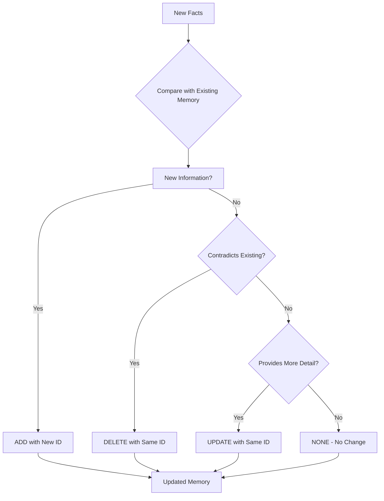
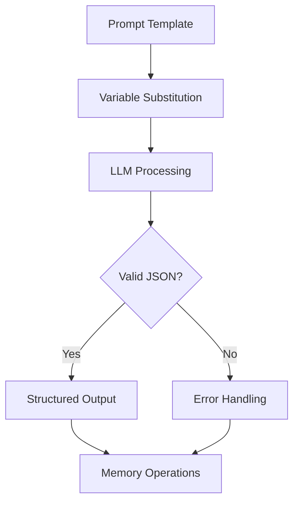
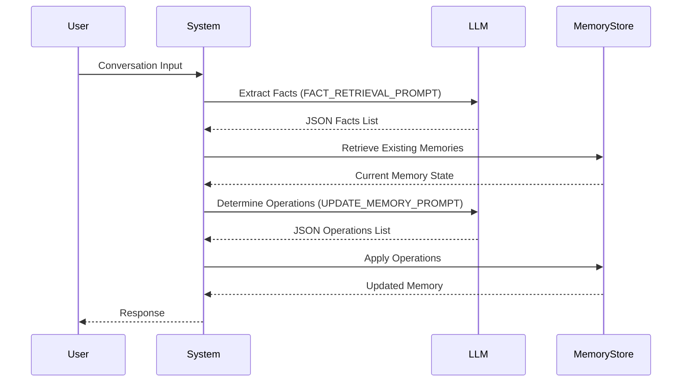

# System Prompts

<cite>
**Referenced Files in This Document**   
- [prompts.py](file://mem0/configs/prompts.py)
- [base.py](file://mem0/configs/base.py)
- [main.py](file://mem0/memory/main.py)
- [utils.py](file://mem0/memory/utils.py)
- [LLM.md](file://LLM.md)
- [test_prompts.py](file://tests/configs/test_prompts.py)
- [test_main.py](file://tests/test_main.py)
</cite>

## Table of Contents
1. [Introduction](#introduction)
2. [Core Prompt Types](#core-prompt-types)
3. [Prompt Template Structure](#prompt-template-structure)
4. [Configuration and Customization](#configuration-and-customization)
5. [Memory Update Process](#memory-update-process)
6. [Procedural Memory Generation](#procedural-memory-generation)
7. [Custom Prompt Implementation](#custom-prompt-implementation)
8. [Best Practices for Prompt Engineering](#best-practices-for-prompt-engineering)
9. [Use Case Examples](#use-case-examples)
10. [Evaluation and Testing](#evaluation-and-testing)
11. [Security and Performance Considerations](#security-and-performance-considerations)

## Introduction

The mem0 framework utilizes a sophisticated system of prompts to manage memory operations, including fact extraction, memory updates, and procedural memory generation. These prompts serve as the foundation for the framework's ability to understand, store, and retrieve information from conversations. The system is designed to extract relevant facts from conversations, determine appropriate memory operations (add, update, delete, or no change), and generate comprehensive procedural memories of agent interactions.

The prompt system is highly configurable, allowing developers to customize behavior based on specific use cases while maintaining a consistent structure for reliable LLM interactions. This documentation provides a comprehensive overview of the prompt configuration system, detailing the predefined prompts, their structure, customization options, and best practices for implementation.

**Section sources**
- [prompts.py](file://mem0/configs/prompts.py#L1-L346)
- [LLM.md](file://LLM.md#L653-L691)

## Core Prompt Types

The mem0 framework implements several core prompt types that handle different aspects of memory management:

### Fact Retrieval Prompt
The `FACT_RETRIEVAL_PROMPT` is responsible for extracting relevant facts and preferences from conversations. It guides the LLM to identify and organize information into distinct, manageable facts that can be stored for future retrieval. The prompt is designed to focus on specific categories of information including personal preferences, important personal details, plans and intentions, activity and service preferences, health and wellness preferences, professional details, and miscellaneous information.

The prompt includes detailed guidelines and few-shot examples to ensure consistent fact extraction. It specifically instructs the LLM to:
- Extract relevant information based on the conversation
- Return facts in JSON format with a "facts" key containing a list of strings
- Detect the language of user input and record facts in the same language
- Ignore system messages when extracting facts
- Return an empty list if no relevant information is found

```mermaid
flowchart TD
A[Conversation Input] --> B{Contains Relevant Information?}
B --> |Yes| C[Extract Facts by Category]
B --> |No| D[Return Empty Facts List]
C --> E[Format as JSON with "facts" key]
D --> E
E --> F[Output Structured Facts]
```

**Diagram sources**
- [prompts.py](file://mem0/configs/prompts.py#L14-L59)
- [utils.py](file://mem0/memory/utils.py#L7-L8)

### Memory Update Prompt
The `DEFAULT_UPDATE_MEMORY_PROMPT` governs the memory update process, determining whether to add, update, delete, or make no change to existing memories based on newly retrieved facts. This prompt implements a decision-making system with four possible operations:

- **ADD**: Add new information not present in current memory
- **UPDATE**: Modify existing memory when new information provides additional context or represents a significant change
- **DELETE**: Remove information that contradicts new facts or when explicitly instructed to delete
- **NONE**: Make no change when facts are already present or irrelevant

The prompt includes detailed guidelines and examples for each operation, ensuring consistent decision-making. It emphasizes maintaining the same ID when updating or deleting memories and generating new IDs only for additions.



**Diagram sources**
- [prompts.py](file://mem0/configs/prompts.py#L61-L209)
- [main.py](file://mem0/memory/main.py#L400-L402)

### Procedural Memory Prompt
The `PROCEDURAL_MEMORY_SYSTEM_PROMPT` is designed for generating comprehensive summaries of agent interactions, particularly for procedural tasks. This prompt instructs the LLM to create detailed records of agent actions that include:

- **Agent Action**: Precise description of what the agent did
- **Action Result**: Exact, unaltered output from the action
- **Embedded Metadata**: Additional context including key findings, navigation history, errors, and current context

The prompt emphasizes preserving every output verbatim and maintaining chronological order. It's specifically designed for scenarios where complete fidelity to the agent's execution history is critical for task continuation.

**Section sources**
- [prompts.py](file://mem0/configs/prompts.py#L211-L288)
- [main.py](file://mem0/memory/main.py#L881-L883)

### Answer Generation Prompts
The framework includes specialized prompts for answering questions based on stored memories. These prompts are designed to retrieve accurate information while handling time references appropriately. Key features include:

- Analyzing memories from multiple speakers
- Prioritizing the most recent memory when contradictions exist
- Converting relative time references to specific dates
- Focusing only on content from memories, not confusing character names with actual users
- Providing concise answers (typically 5-6 words)

These prompts are used in different variants depending on the specific requirements, such as graph-based memory retrieval or integration with external systems like Zep.

**Section sources**
- [prompts.py](file://evaluation/prompts.py#L1-L148)

## Prompt Template Structure

The mem0 framework follows a consistent structure for its prompt templates, designed to ensure reliable and predictable LLM behavior.

### Template Components
Each prompt template consists of several key components:

1. **Role Definition**: Clearly establishes the LLM's role (e.g., "Personal Information Organizer")
2. **Task Description**: Details the specific task the LLM should perform
3. **Guidelines**: Provides step-by-step instructions for completing the task
4. **Examples**: Includes few-shot examples to demonstrate expected behavior
5. **Output Format**: Specifies the required output structure
6. **Constraints**: Lists important rules and limitations

### Variable Substitution
The framework uses Python's f-string formatting for dynamic content insertion. Key variables include:

- `{datetime.now().strftime("%Y-%m-%d")}`: Current date for temporal context
- `{response_content}`: New facts to be evaluated for memory updates
- `{retrieved_old_memory_dict}`: Existing memory state for comparison
- `{custom_update_memory_prompt}`: Custom prompt override when provided

These variables are dynamically inserted into the prompt templates at runtime, allowing for context-aware processing.

### JSON Output Formatting
All critical prompts are designed to produce JSON output for structured data processing. The framework enforces strict JSON formatting requirements:

- Response must be valid JSON
- Specific structure requirements (e.g., "memory" key containing array of objects)
- Required fields for each memory operation
- Proper escaping of special characters

The LLM is explicitly instructed to return only the JSON format without additional commentary.



**Diagram sources**
- [prompts.py](file://mem0/configs/prompts.py#L322-L345)
- [main.py](file://mem0/memory/main.py#L405-L408)

## Configuration and Customization

The mem0 framework provides flexible configuration options for customizing prompt behavior through the `MemoryConfig` class.

### Configuration Parameters
The framework exposes two primary configuration parameters for prompt customization:

- `custom_fact_extraction_prompt`: Overrides the default fact extraction prompt
- `custom_update_memory_prompt`: Overrides the default memory update prompt

These parameters are defined in the `MemoryConfig` class with appropriate typing and default values:

```python
class MemoryConfig(BaseModel):
    # ... other config parameters
    custom_fact_extraction_prompt: Optional[str] = Field(
        description="Custom prompt for the fact extraction",
        default=None,
    )
    custom_update_memory_prompt: Optional[str] = Field(
        description="Custom prompt for the update memory",
        default=None,
    )
```

### Prompt Selection Logic
The framework implements a clear hierarchy for prompt selection:

1. **Custom Prompt**: If a custom prompt is provided in the configuration, it takes precedence
2. **Default Prompt**: If no custom prompt is provided, the framework uses the predefined default prompt

This logic is implemented in the `get_update_memory_messages` function:

```python
def get_update_memory_messages(retrieved_old_memory_dict, response_content, custom_update_memory_prompt=None):
    if custom_update_memory_prompt is None:
        custom_update_memory_prompt = DEFAULT_UPDATE_MEMORY_PROMPT
    # ... rest of function
```

The same pattern applies to fact extraction, where the system checks for a custom prompt before falling back to the default.

### Provider-Specific Considerations
While the framework doesn't implement provider-specific prompts by default, the configuration system allows for dynamic prompt selection based on the LLM provider. Developers can create different prompt variants optimized for specific providers (e.g., OpenAI, Anthropic, Gemini) and select them at runtime based on configuration settings.

**Section sources**
- [base.py](file://mem0/configs/base.py#L53-L61)
- [prompts.py](file://mem0/configs/prompts.py#L290-L294)
- [main.py](file://mem0/memory/main.py#L134-L135)

## Memory Update Process

The memory update process in the mem0 framework follows a systematic workflow to ensure accurate and consistent memory management.

### Process Flow
The memory update process consists of the following steps:

1. **Fact Retrieval**: Extract relevant facts from the current conversation
2. **Memory Retrieval**: Retrieve existing memories that may be relevant
3. **Comparison**: Compare new facts with existing memories
4. **Decision Making**: Determine appropriate operations (ADD, UPDATE, DELETE, NONE)
5. **Memory Update**: Apply the determined operations to the memory store

### Decision Criteria
The framework uses specific criteria to determine the appropriate operation for each fact:

#### Add Operation
An ADD operation is performed when:
- The fact contains new information not present in existing memory
- The information is relevant and significant
- There is no contradiction with existing memories

The system generates a new ID for the memory entry while preserving the content of existing memories.

#### Update Operation
An UPDATE operation is performed when:
- The fact contains information that is already partially present but provides additional context
- The new information represents an evolution of existing information (e.g., "likes pizza" to "loves cheese and chicken pizza")
- The direction is explicitly to update the memory

The system maintains the same ID while updating the text content and includes the old memory content for reference.

#### Delete Operation
A DELETE operation is performed when:
- The fact directly contradicts existing information (e.g., "likes cheese pizza" vs. "dislikes cheese pizza")
- The direction is explicitly to delete the memory
- The information is no longer valid or relevant

The system maintains the same ID while marking the operation as DELETE.

#### No Change Operation
A NONE operation is performed when:
- The fact is already present in the memory
- The information is redundant or irrelevant
- The fact conveys the same meaning as existing information

This prevents unnecessary memory modifications and maintains stability.



**Diagram sources**
- [prompts.py](file://mem0/configs/prompts.py#L61-L209)
- [main.py](file://mem0/memory/main.py#L399-L408)

## Procedural Memory Generation

The procedural memory system in mem0 is designed to capture and preserve complete interaction histories for complex tasks.

### System Prompt Structure
The `PROCEDURAL_MEMORY_SYSTEM_PROMPT` follows a comprehensive structure designed for detailed record-keeping:

#### Overview Section
- **Task Objective**: The overall goal the agent is working to accomplish
- **Progress Status**: Current completion percentage and milestone summary

#### Sequential Agent Actions
Each action is recorded as a numbered step containing:

1. **Agent Action**: Precise description of the action with parameters
2. **Action Result**: Exact, unaltered output from the action
3. **Embedded Metadata**: Additional context including:
   - Key findings
   - Navigation history
   - Errors and challenges
   - Current context and next steps

### Key Requirements
The prompt enforces several critical requirements:

- **Preserve Every Output**: Exact outputs must be stored verbatim
- **Chronological Order**: Actions must be numbered sequentially
- **Detail and Precision**: Use exact data, preserve numeric counts, include full error messages
- **Output Only the Summary**: The response must contain only the structured summary

### Use Cases
Procedural memory is particularly valuable for:
- Web scraping workflows
- Multi-step API integrations
- Complex data processing pipelines
- Automated testing sequences
- Task automation with recovery capabilities

The system ensures that every step of the agent's execution history is preserved, enabling accurate task continuation and debugging.

**Section sources**
- [prompts.py](file://mem0/configs/prompts.py#L211-L288)
- [main.py](file://mem0/memory/main.py#L878-L891)

## Custom Prompt Implementation

The mem0 framework supports custom prompt implementation through configuration-based overrides.

### Implementation Process
To implement custom prompts, developers should:

1. **Create Custom Prompt String**: Define the prompt text with appropriate instructions and formatting
2. **Configure MemoryConfig**: Set the custom prompt in the MemoryConfig instance
3. **Initialize Memory**: Create a Memory instance with the configured settings

```python
custom_extraction_prompt = """
Extract key facts from the conversation focusing on:
1. Personal preferences
2. Technical skills
3. Project requirements
4. Important dates and deadlines

Conversation: {messages}
"""

config = MemoryConfig(
    custom_fact_extraction_prompt=custom_extraction_prompt
)
memory = Memory(config)
```

### Integration Points
Custom prompts are integrated at specific points in the processing pipeline:

- **Fact Extraction**: The custom fact extraction prompt is used when retrieving facts from conversations
- **Memory Updates**: The custom update memory prompt is used when determining memory operations

The framework automatically handles the integration, substituting custom prompts when provided and falling back to defaults when not.

### Testing Custom Prompts
When implementing custom prompts, it's essential to test their behavior thoroughly:

- Verify JSON output format compliance
- Test edge cases and error conditions
- Validate decision-making consistency
- Check for prompt injection vulnerabilities
- Measure token usage and performance impact

The framework's testing suite provides examples for validating custom prompt behavior.

**Section sources**
- [LLM.md](file://LLM.md#L674-L689)
- [test_main.py](file://tests/test_main.py#L62-L65)
- [main.py](file://mem0/memory/main.py#L348-L349)

## Best Practices for Prompt Engineering

Effective prompt engineering is critical for optimal performance in the mem0 framework. The following best practices ensure reliable and efficient memory management.

### Clarity and Specificity
- Use clear, unambiguous language in prompts
- Define specific roles and responsibilities for the LLM
- Provide concrete examples for expected behavior
- Avoid vague or subjective terms

### Structured Output Design
- Enforce strict JSON formatting requirements
- Define clear schema for output data
- Include all necessary fields for downstream processing
- Use consistent naming conventions

### Error Handling and Edge Cases
- Include instructions for handling missing or contradictory information
- Define behavior for edge cases (empty inputs, irrelevant content)
- Specify fallback behavior when no action is required
- Handle multilingual inputs appropriately

### Performance Optimization
- Minimize prompt length while maintaining clarity
- Remove unnecessary examples or redundant instructions
- Consider token limits when designing prompts
- Optimize for the target LLM's strengths and limitations

### Common Pitfalls to Avoid
- **Over-constraining**: Avoid overly restrictive rules that limit the LLM's ability to handle novel situations
- **Under-specifying**: Ensure sufficient detail to guide consistent behavior
- **Inconsistent formatting**: Maintain consistent structure across related prompts
- **Ignoring localization**: Consider multilingual support and cultural context

### Testing and Validation
- Test prompts with diverse input scenarios
- Validate output format and structure
- Check for hallucinations or incorrect behavior
- Monitor performance metrics and token usage

**Section sources**
- [prompts.py](file://mem0/configs/prompts.py#L1-L346)
- [test_prompts.py](file://tests/configs/test_prompts.py#L1-L51)

## Use Case Examples

The mem0 framework's prompt system can be adapted for various use cases by customizing the prompts to focus on domain-specific information.

### Customer Support
For customer support applications, prompts can be customized to focus on:

- Customer preferences and history
- Product knowledge and specifications
- Support ticket details and status
- Service level agreements and response times

Example custom prompt:
```
Extract key information from customer interactions focusing on:
1. Customer identity and contact information
2. Product or service issues
3. Previous support interactions
4. Desired resolution and timeline
5. Customer sentiment and urgency
```

### Healthcare
In healthcare applications, prompts should emphasize:

- Patient medical history and conditions
- Medication and treatment plans
- Appointment schedules and follow-ups
- Insurance and billing information
- Privacy and compliance requirements

Example custom prompt:
```
Extract relevant healthcare information with strict privacy adherence:
1. Patient symptoms and concerns
2. Medical history and diagnoses
3. Medication list and dosages
4. Appointment details and test results
5. Caregiver instructions and follow-up needs
```

### Gaming
For gaming applications, prompts can focus on:

- Player preferences and play style
- Character attributes and progression
- Game world knowledge and lore
- Quest objectives and completion status
- Inventory and resource management

Example custom prompt:
```
Extract gaming-related information focusing on:
1. Player character attributes and abilities
2. Quest objectives and progress
3. Inventory items and resources
4. Game world locations and NPCs
5. Player preferences and play style
```

These examples demonstrate how the core prompt structure can be adapted to different domains while maintaining the framework's consistent approach to memory management.

**Section sources**
- [LLM.md](file://LLM.md#L674-L689)
- [prompts.py](file://mem0/configs/prompts.py#L14-L25)

## Evaluation and Testing

The mem0 framework includes comprehensive testing and evaluation capabilities for prompt effectiveness.

### Unit Testing
The framework provides unit tests for prompt functionality:

- **Prompt Generation**: Tests that verify prompt construction with and without custom prompts
- **Empty Memory Handling**: Tests that ensure proper behavior when memory is empty
- **Non-empty Memory Handling**: Tests that validate correct processing with existing memories

Example test cases:
```python
def test_get_update_memory_messages():
    # Test with custom prompt
    result = prompts.get_update_memory_messages(
        retrieved_old_memory_dict, 
        response_content, 
        custom_update_memory_prompt
    )
    assert result.startswith(custom_update_memory_prompt)

def test_get_update_memory_messages_empty_memory():
    # Test with empty memory
    result = prompts.get_update_memory_messages(None, ["new fact"], None)
    assert "Current memory is empty" in result
```

### Integration Testing
Integration tests verify the complete memory management workflow:

- End-to-end fact extraction and memory update
- Procedural memory generation and retrieval
- Custom prompt integration and behavior

### Evaluation Metrics
The framework supports evaluation of prompt effectiveness through:

- Accuracy of fact extraction
- Consistency of memory operations
- Completeness of procedural records
- Token efficiency and performance
- Error rate and hallucination detection

Developers can use these testing and evaluation methods to ensure their custom prompts behave as expected and maintain the reliability of the memory system.

**Section sources**
- [test_prompts.py](file://tests/configs/test_prompts.py#L1-L51)
- [test_main.py](file://tests/test_main.py#L282-L298)

## Security and Performance Considerations

Effective prompt management requires attention to both security and performance aspects.

### Prompt Injection Prevention
To prevent prompt injection attacks:

- Sanitize input content before processing
- Limit the scope of accessible memories
- Implement strict output formatting requirements
- Validate JSON structure before processing
- Monitor for unexpected behavior patterns

The framework's design helps mitigate injection risks by:
- Using structured JSON output
- Isolating system prompts from user content
- Implementing clear separation between instructions and data

### Token Limit Management
To optimize token usage:

- Minimize prompt length while maintaining effectiveness
- Use concise language and remove redundant instructions
- Consider the context window of the target LLM
- Implement chunking for long conversations
- Monitor token usage during development

### Multilingual Support
The framework supports multilingual operation by:
- Detecting the language of user input
- Recording facts in the same language
- Maintaining language consistency within memory entries
- Supporting international date and number formats

### Performance Optimization
Additional performance considerations include:

- Caching frequently used prompt templates
- Minimizing API calls through batch processing
- Optimizing memory retrieval queries
- Using efficient data structures for temporary storage
- Monitoring and logging performance metrics

By addressing these security and performance considerations, developers can ensure that their prompt implementations are both effective and efficient.

**Section sources**
- [prompts.py](file://mem0/configs/prompts.py#L58)
- [utils.py](file://mem0/memory/utils.py#L50-L62)
- [main.py](file://mem0/memory/main.py#L394-L397)