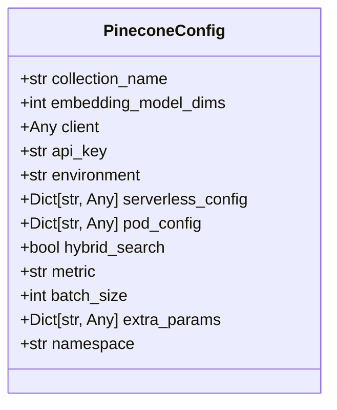
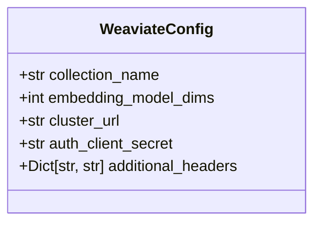
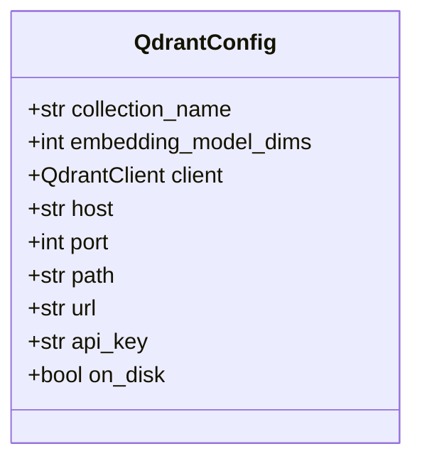
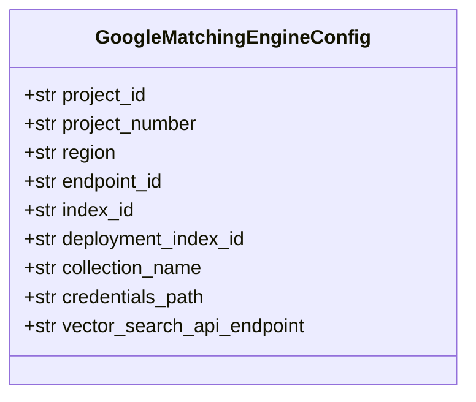
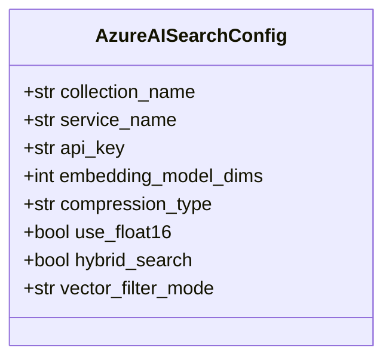
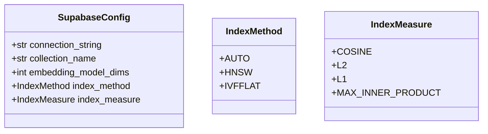
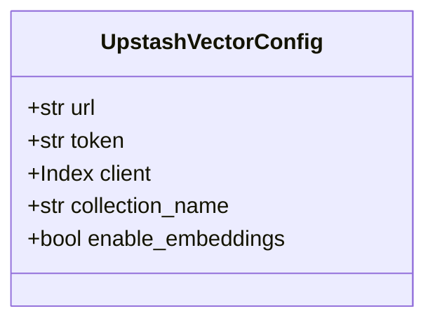
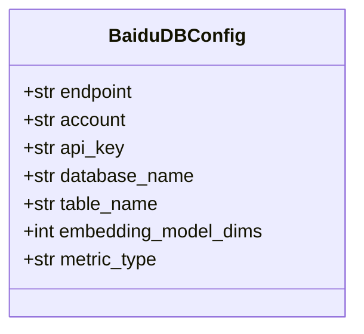

# Cloud-Managed Vector Stores

<cite>
**Referenced Files in This Document**   
- [pinecone.py](file://mem0/configs/vector_stores/pinecone.py)
- [weaviate.py](file://mem0/configs/vector_stores/weaviate.py)
- [qdrant.py](file://mem0/configs/vector_stores/qdrant.py)
- [vertex_ai_vector_search.py](file://mem0/configs/vector_stores/vertex_ai_vector_search.py)
- [azure_ai_search.py](file://mem0/configs/vector_stores/azure_ai_search.py)
- [supabase.py](file://mem0/configs/vector_stores/supabase.py)
- [upstash_vector.py](file://mem0/configs/vector_stores/upstash_vector.py)
- [baidu.py](file://mem0/configs/vector_stores/baidu.py)
- [pinecone.yaml](file://embedchain/configs/pinecone.yaml)
- [weaviate.yaml](file://embedchain/configs/weaviate.yaml)
</cite>

## Table of Contents
1. [Introduction](#introduction)
2. [Pinecone Configuration](#pinecone-configuration)
3. [Weaviate Configuration](#weaviate-configuration)
4. [Qdrant Cloud Configuration](#qdrant-cloud-configuration)
5. [Vertex AI Vector Search Configuration](#vertex-ai-vector-search-configuration)
6. [Azure AI Search Configuration](#azure-ai-search-configuration)
7. [Supabase Vector Configuration](#supabase-vector-configuration)
8. [Upstash Vector Configuration](#upstash-vector-configuration)
9. [Baidu Cloud Configuration](#baidu-cloud-configuration)
10. [Configuration Best Practices](#configuration-best-practices)
11. [Migration Guidance](#migration-guidance)
12. [Cost Optimization Strategies](#cost-optimization-strategies)

## Introduction
The mem0 framework provides comprehensive support for cloud-managed vector stores, enabling developers to configure and manage various vector database providers with consistent patterns. This documentation covers the configuration of Pinecone, Weaviate, Qdrant Cloud, Vertex AI Vector Search, Azure AI Search, Supabase Vector, Upstash Vector, and Baidu Cloud, focusing on authentication, deployment options, performance tuning, and operational considerations.

The framework uses Pydantic models for configuration validation, ensuring that only valid parameters are accepted and providing clear error messages for invalid configurations. Each vector store provider has a dedicated configuration class that defines the required and optional parameters, with appropriate validation rules to prevent common configuration errors.

**Section sources**
- [pinecone.py](file://mem0/configs/vector_stores/pinecone.py#L7-L56)
- [weaviate.py](file://mem0/configs/vector_stores/weaviate.py#L6-L42)

## Pinecone Configuration

### Authentication and Connection
Pinecone configuration supports multiple authentication methods:
- API key via the `api_key` parameter or `PINECONE_API_KEY` environment variable
- Pre-configured client instance via the `client` parameter
- Environment specification via the `environment` parameter

The configuration validates that either an API key or client instance is provided, ensuring that connections can be established.



**Diagram sources**
- [pinecone.py](file://mem0/configs/vector_stores/pinecone.py#L7-L56)

### Deployment Options
Pinecone offers two deployment models:
- **Serverless**: Configured via `serverless_config` with cloud and region specifications
- **Pod-based**: Configured via `pod_config` for dedicated infrastructure

The configuration enforces mutual exclusivity between serverless and pod configurations, preventing invalid deployment setups.

### Performance and Scaling
Key performance parameters include:
- `batch_size`: Controls the number of vectors processed in each operation (default: 100)
- `metric`: Distance metric for similarity search (cosine, euclidean, dotproduct)
- `hybrid_search`: Enables hybrid search with sparse vector support using BM25 encoding

For high QPS workloads, increase the batch size and consider using serverless deployment with auto-scaling. For large datasets, pod-based deployments with appropriate pod types (p1, s1) provide better performance isolation.

### Real-World Configuration Examples
```yaml
vectordb:
  provider: pinecone
  config:
    metric: cosine
    vector_dimension: 1536
    collection_name: my-pinecone-index
```

For low-latency requirements:
```python
PineconeConfig(
    collection_name="low-latency-index",
    serverless_config={"cloud": "aws", "region": "us-east-1"},
    metric="cosine",
    batch_size=50,
    hybrid_search=False
)
```

**Section sources**
- [pinecone.py](file://mem0/configs/vector_stores/pinecone.py#L7-L56)
- [pinecone.yaml](file://embedchain/configs/pinecone.yaml#L1-L7)

## Weaviate Configuration

### Authentication and Connection
Weaviate configuration requires:
- `cluster_url`: The URL of the Weaviate cluster
- `auth_client_secret`: API key for authentication (required for cloud deployments)
- `additional_headers`: Custom headers for requests

The configuration validates that the cluster URL is provided, ensuring connectivity to the Weaviate instance.



**Diagram sources**
- [weaviate.py](file://mem0/configs/vector_stores/weaviate.py#L6-L42)

### Deployment and Networking
Weaviate supports multiple connection methods:
- Local development: `localhost` connections with `connect_to_local`
- Cloud deployments: `connect_to_weaviate_cloud` with API key authentication
- Custom deployments: `connect_to_custom` with HTTP and gRPC endpoint configuration

For private networking, configure the cluster URL with internal endpoints and use appropriate authentication methods.

### Index Configuration
The Weaviate implementation automatically creates collections with a predefined schema including:
- Standard metadata fields (created_at, updated_at, user_id, agent_id, run_id)
- Vector indexing using HNSW algorithm
- No built-in vectorizer (vectors are provided externally)

### Real-World Configuration Examples
```yaml
vectordb:
  provider: weaviate
  config:
    collection_name: my_weaviate_index
```

For production deployments with authentication:
```python
WeaviateConfig(
    collection_name="production-index",
    cluster_url="https://my-cluster.weaviate.cloud",
    auth_client_secret="my-api-key",
    embedding_model_dims=1536
)
```

**Section sources**
- [weaviate.py](file://mem0/configs/vector_stores/weaviate.py#L6-L42)
- [weaviate.yaml](file://embedchain/configs/weaviate.yaml#L1-L5)

## Qdrant Cloud Configuration

### Authentication and Connection
Qdrant configuration supports multiple connection methods:
- Host and port: For dedicated clusters
- URL and API key: For cloud deployments
- Local path: For embedded/local deployments

The configuration validates that at least one connection method is provided, ensuring that the client can connect to the Qdrant instance.



**Diagram sources**
- [qdrant.py](file://mem0/configs/vector_stores/qdrant.py#L6-L48)

### Deployment Options
Qdrant supports three deployment models:
- **Cloud**: Configured with URL and API key
- **Dedicated**: Configured with host and port
- **Embedded**: Configured with local path

The `on_disk` parameter controls persistent storage for embedded deployments.

### Performance Considerations
For high QPS workloads, use cloud or dedicated deployments with appropriate hardware specifications. For large datasets, ensure sufficient memory and storage capacity based on vector dimensions and count.

**Section sources**
- [qdrant.py](file://mem0/configs/vector_stores/qdrant.py#L6-L48)

## Vertex AI Vector Search Configuration

### Authentication and Connection
Vertex AI Vector Search requires Google Cloud authentication:
- `project_id`: Google Cloud project ID
- `project_number`: Google Cloud project number
- `region`: Google Cloud region
- `credentials_path`: Path to service account credentials file



**Diagram sources**
- [vertex_ai_vector_search.py](file://mem0/configs/vector_stores/vertex_ai_vector_search.py#L6-L28)

### Deployment and Indexing
Configuration requires:
- `endpoint_id`: Vector search endpoint ID
- `index_id`: Index ID
- `deployment_index_id`: Deployment-specific index ID

The collection name defaults to the index_id if not specified.

### Regional Availability
Vertex AI Vector Search is available in specific Google Cloud regions. Choose regions based on data residency requirements and proximity to your application servers for low-latency access.

**Section sources**
- [vertex_ai_vector_search.py](file://mem0/configs/vector_stores/vertex_ai_vector_search.py#L6-L28)

## Azure AI Search Configuration

### Authentication and Connection
Azure AI Search requires:
- `service_name`: Azure AI Search service name
- `api_key`: API key for the service



**Diagram sources**
- [azure_ai_search.py](file://mem0/configs/vector_stores/azure_ai_search.py#L6-L58)

### Performance Optimization
Key configuration options:
- `compression_type`: "scalar", "binary", or None for vector compression
- `use_float16`: Store vectors in half precision to reduce storage costs
- `hybrid_search`: Enable hybrid search with keyword and vector search
- `vector_filter_mode`: "preFilter" or "postFilter" for filtering behavior

For large datasets, enable compression and use_float16 to reduce storage costs. For high QPS workloads, optimize indexing strategy and partitioning.

**Section sources**
- [azure_ai_search.py](file://mem0/configs/vector_stores/azure_ai_search.py#L6-L58)

## Supabase Vector Configuration

### Authentication and Connection
Supabase Vector uses PostgreSQL connection strings:
- `connection_string`: PostgreSQL connection string starting with "postgresql://"
- Supports all PostgreSQL authentication methods (password, IAM, etc.)



**Diagram sources**
- [supabase.py](file://mem0/configs/vector_stores/supabase.py#L20-L45)

### Index Configuration
- `index_method`: AUTO, HNSW, or IVFFLAT
- `index_measure`: COSINE, L2, L1, or MAX_INNER_PRODUCT

For large datasets, HNSW provides better performance for approximate nearest neighbor search. For exact search requirements, IVFFLAT may be more appropriate.

**Section sources**
- [supabase.py](file://mem0/configs/vector_stores/supabase.py#L20-L45)

## Upstash Vector Configuration

### Authentication and Connection
Upstash Vector supports:
- URL and token via `url` and `token` parameters or environment variables
- Pre-configured client instance via the `client` parameter



**Diagram sources**
- [upstash_vector.py](file://mem0/configs/vector_stores/upstash_vector.py#L12-L35)

### Deployment Options
- Serverless vector database with automatic scaling
- Global distribution for low-latency access
- Built-in embeddings option via `enable_embeddings`

For low-latency requirements, leverage Upstash's global distribution by deploying application servers in the same regions as the vector store.

**Section sources**
- [upstash_vector.py](file://mem0/configs/vector_stores/upstash_vector.py#L12-L35)

## Baidu Cloud Configuration

### Authentication and Connection
Baidu Cloud VectorDB requires:
- `endpoint`: Endpoint URL for Baidu VectorDB
- `account`: Account name
- `api_key`: API key for authentication



**Diagram sources**
- [baidu.py](file://mem0/configs/vector_stores/baidu.py#L6-L28)

### Index Configuration
- `database_name`: Name of the database
- `table_name`: Name of the table
- `metric_type`: L2, IP, or COSINE for similarity search

Baidu Cloud provides regional availability in China, making it suitable for applications with data residency requirements in China.

**Section sources**
- [baidu.py](file://mem0/configs/vector_stores/baidu.py#L6-L28)

## Configuration Best Practices

### Security Considerations
- Use environment variables for API keys and sensitive credentials
- Implement private networking where available
- Use short-lived credentials and rotate keys regularly
- Enable encryption at rest and in transit

### Performance Optimization
For high QPS workloads:
- Use serverless or dedicated deployments with appropriate scaling
- Optimize batch sizes for write operations
- Implement connection pooling
- Use appropriate distance metrics (cosine for normalized vectors)

For large datasets:
- Choose deployments with sufficient storage capacity
- Use vector compression where supported
- Implement data partitioning strategies
- Monitor and optimize index performance

For low-latency requirements:
- Deploy in regions close to application servers
- Use global distribution where available
- Optimize network connectivity
- Implement caching strategies

### Common Cloud-Specific Issues
- **API rate limiting**: Implement retry logic with exponential backoff
- **Regional availability**: Choose providers with regions close to your users
- **Data residency compliance**: Select providers that meet your regulatory requirements
- **Network latency**: Use private networking and optimize connection settings

## Migration Guidance
When migrating between cloud providers:
1. Export data from the source vector store
2. Transform data to match the target schema
3. Import data into the target vector store
4. Update application configuration
5. Test thoroughly before switching traffic

Consider using the mem0 framework's consistent API to minimize code changes during migration. The configuration classes provide a consistent interface across providers, making it easier to switch between different vector databases.

## Cost Optimization Strategies
- Use serverless options for variable workloads
- Right-size dedicated clusters based on actual usage
- Implement data retention policies
- Use compression to reduce storage costs
- Monitor usage and adjust configurations accordingly
- Consider regional pricing differences when selecting deployment locations