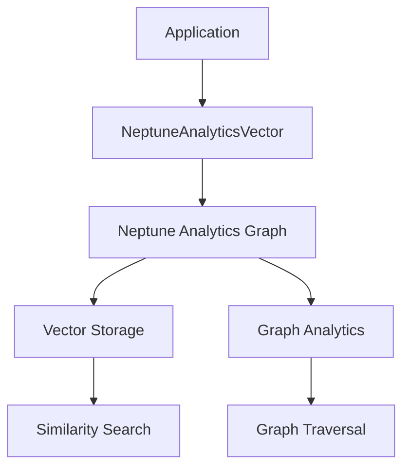
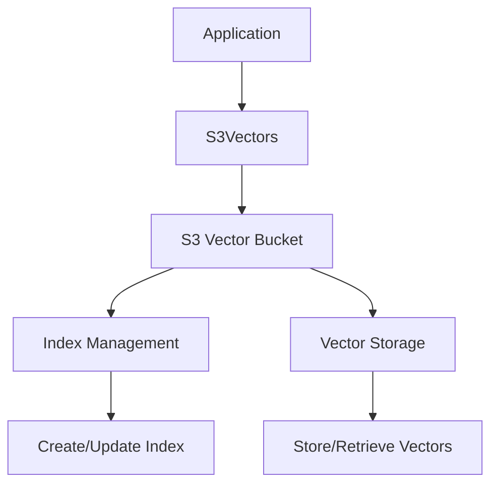
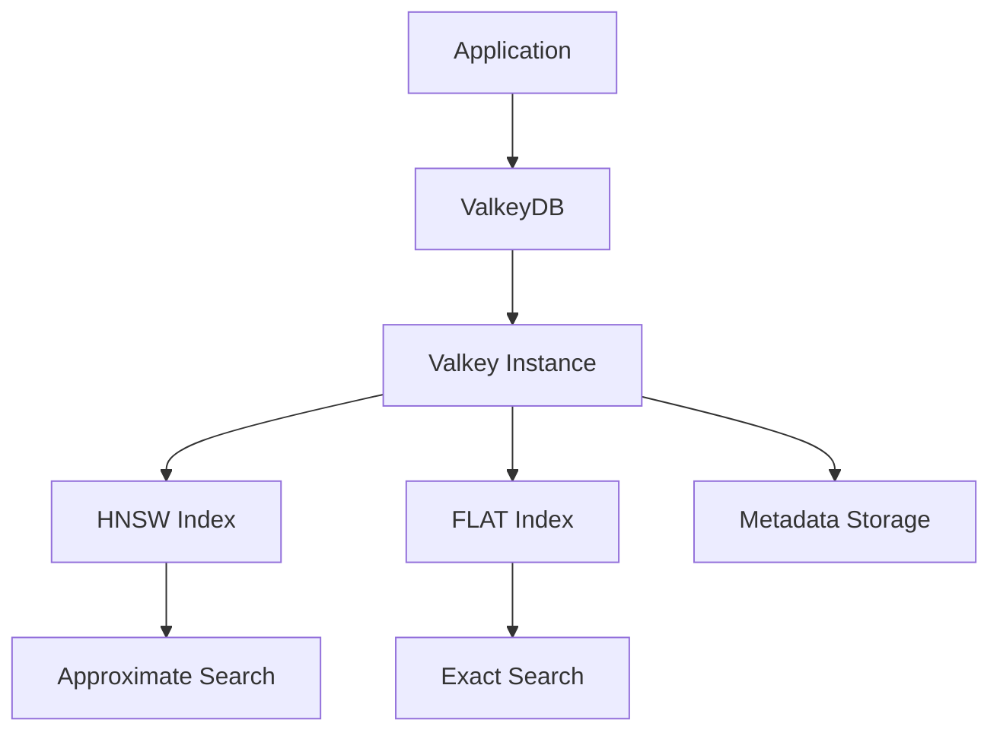
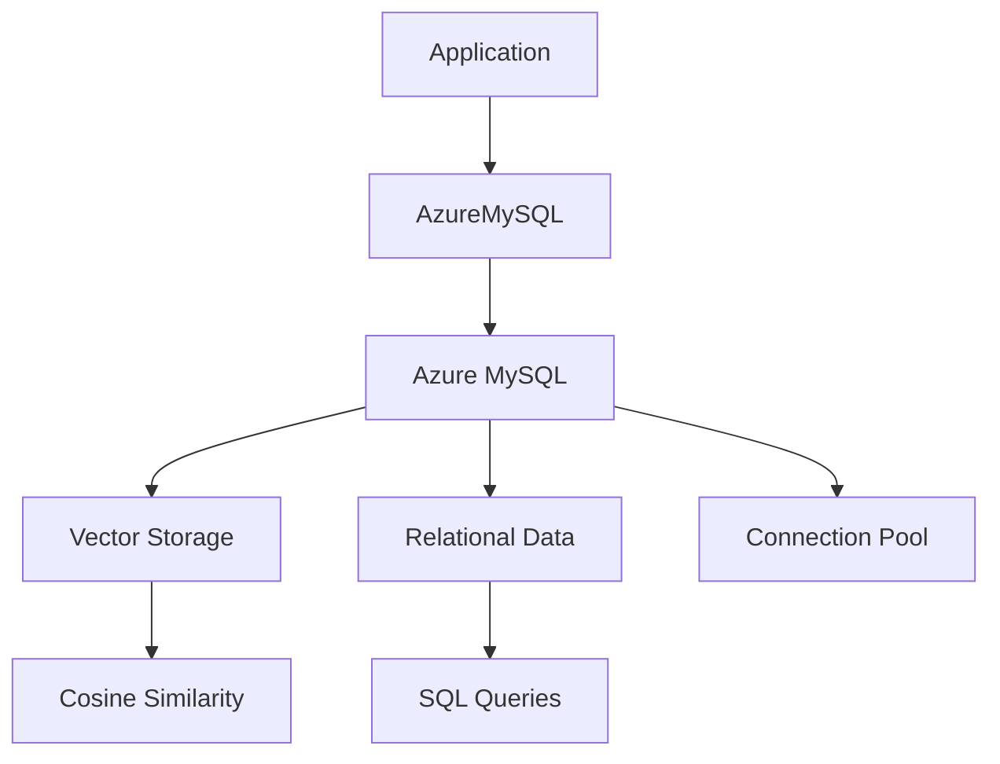
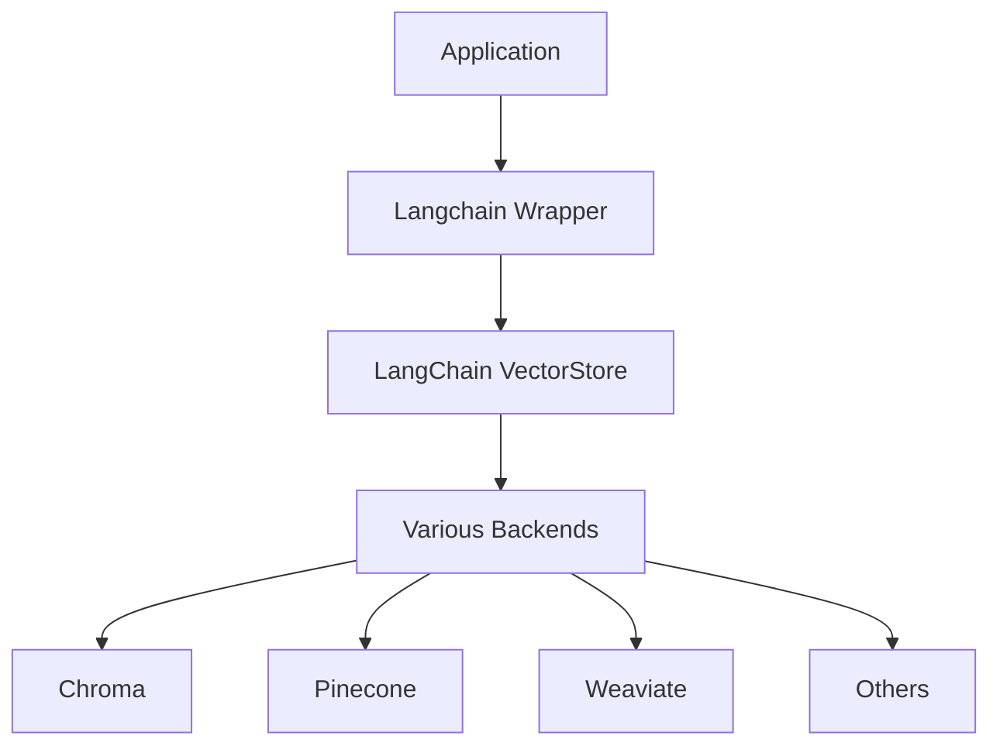

# Specialized & Hybrid Vector Stores

<cite>
**Referenced Files in This Document**   
- [neptune_analytics.py](file://mem0/vector_stores/neptune_analytics.py)
- [s3_vectors.py](file://mem0/vector_stores/s3_vectors.py)
- [valkey.py](file://mem0/vector_stores/valkey.py)
- [azure_mysql.py](file://mem0/vector_stores/azure_mysql.py)
- [langchain.py](file://mem0/vector_stores/langchain.py)
- [neptune.py](file://mem0/configs/vector_stores/neptune.py)
- [s3_vectors.py](file://mem0/configs/vector_stores/s3_vectors.py)
- [valkey.py](file://mem0/configs/vector_stores/valkey.py)
- [azure_mysql.py](file://mem0/configs/vector_stores/azure_mysql.py)
- [neptune-db-example.ipynb](file://examples/graph-db-demo/neptune-db-example.ipynb)
</cite>

## Table of Contents
1. [Introduction](#introduction)
2. [Amazon Neptune Analytics](#amazon-neptune-analytics)
3. [S3 Vectors](#s3-vectors)
4. [Valkey](#valkey)
5. [Azure MySQL with Vector Capabilities](#azure-mysql-with-vector-capabilities)
6. [LangChain Integration](#langchain-integration)
7. [Hybrid Indexing and Data Synchronization](#hybrid-indexing-and-data-synchronization)
8. [Cross-Service Authentication](#cross-service-authentication)
9. [Complex Deployment Topologies](#complex-deployment-topologies)
10. [Integration Challenges](#integration-challenges)
11. [Best Practices for Production Environments](#best-practices-for-production-environments)

## Introduction
The mem0 framework supports specialized and hybrid vector store configurations that enable advanced use cases such as graph-enhanced retrieval, serverless vector storage, and hybrid transactional-analytical processing. These specialized stores integrate with various cloud services and databases, providing flexibility in deployment and data management. This document details the configuration parameters, integration patterns, and best practices for leveraging these specialized vector stores in production environments with mixed workload requirements.

## Amazon Neptune Analytics
Amazon Neptune Analytics is a serverless graph analytics service that supports vector operations, enabling graph-enhanced retrieval capabilities within the mem0 framework. The NeptuneAnalyticsVector store implementation provides vector storage and similarity search using Amazon Neptune Analytics.

The configuration requires an endpoint in the format 'neptune-graph://<graphid>' and a collection name. Unlike traditional vector databases, Neptune Analytics supports dynamic indices that are created implicitly when vectors are inserted, eliminating the need for explicit collection creation. The implementation leverages the langchain_aws library to interface with Neptune Analytics, requiring proper AWS authentication setup.

**Diagram sources**
- [neptune_analytics.py](file://mem0/vector_stores/neptune_analytics.py#L23-L84)

**Section sources**
- [neptune_analytics.py](file://mem0/vector_stores/neptune_analytics.py#L1-L84)
- [neptune.py](file://mem0/configs/vector_stores/neptune.py#L11-L28)

## S3 Vectors
S3 Vectors provides serverless vector storage by leveraging Amazon S3 as the underlying storage layer. This implementation enables cost-effective, scalable vector storage with built-in redundancy and durability. The S3Vectors class manages vector operations through the boto3 library, interfacing with a specialized S3 Vectors service.

Configuration parameters include the vector bucket name, collection name, embedding model dimensions, distance metric, and AWS region. The implementation automatically ensures bucket existence and creates indexes as needed. Vector data is stored with metadata, enabling rich filtering capabilities during retrieval operations.

**Diagram sources**
- [s3_vectors.py](file://mem0/vector_stores/s3_vectors.py#L24-L41)

**Section sources**
- [s3_vectors.py](file://mem0/vector_stores/s3_vectors.py#L1-L177)
- [s3_vectors.py](file://mem0/configs/vector_stores/s3_vectors.py#L6-L29)

## Valkey
Valkey (a Redis fork) provides high-performance vector storage with support for both HNSW and FLAT indexing algorithms. The ValkeyDB implementation offers low-latency vector operations with configurable index parameters for optimizing search performance.

Configuration parameters include the Valkey URL, collection name, embedding model dimensions, timezone, index type (HNSW or FLAT), and HNSW-specific parameters (M, ef_construction, ef_runtime). The implementation uses Valkey's search module to create and manage vector indexes, with automatic schema creation based on predefined fields including memory_id, hash, agent_id, user_id, and embedding vectors.

**Diagram sources**
- [valkey.py](file://mem0/vector_stores/valkey.py#L44-L56)

**Section sources**
- [valkey.py](file://mem0/vector_stores/valkey.py#L1-L825)
- [valkey.py](file://mem0/configs/vector_stores/valkey.py#L4-L16)

## Azure MySQL with Vector Capabilities
Azure MySQL integration enables hybrid transactional-analytical processing by combining traditional relational data management with vector search capabilities. The AzureMySQL implementation stores vectors as JSON data within MySQL tables, enabling co-location of vector and structured data.

Configuration parameters include host, port, user, password, database name, collection name, embedding model dimensions, and connection pooling settings. The implementation supports Azure Active Directory authentication through DefaultAzureCredential, providing secure, token-based access to Azure MySQL instances. Vector similarity calculations are performed in Python, with cosine distance as the default metric.

**Diagram sources**
- [azure_mysql.py](file://mem0/vector_stores/azure_mysql.py#L35-L44)

**Section sources**
- [azure_mysql.py](file://mem0/vector_stores/azure_mysql.py#L1-L464)
- [azure_mysql.py](file://mem0/configs/vector_stores/azure_mysql.py#L6-L85)

## LangChain Integration
LangChain integration enables the mem0 framework to leverage LangChain's extensive ecosystem of vector stores and retrieval tools. The Langchain wrapper class provides a unified interface to various LangChain vector stores, supporting both embedding-based and text-based operations.

The implementation supports multiple insertion methods, using add_embeddings when available or falling back to add_texts. Search operations leverage similarity_search_by_vector with optional filtering. The wrapper handles different output formats from LangChain stores, normalizing them to the mem0 OutputData structure for consistent processing.

**Diagram sources**
- [langchain.py](file://mem0/vector_stores/langchain.py#L24-L26)

**Section sources**
- [langchain.py](file://mem0/vector_stores/langchain.py#L1-L181)

## Hybrid Indexing and Data Synchronization
The mem0 framework supports hybrid indexing strategies that combine multiple vector stores for optimized performance and reliability. For example, the Neptune DB implementation uses a hybrid approach where graph relationships are stored in Neptune DB while vector similarities are managed in a separate vector store like OpenSearch.

Data synchronization between primary and specialized vector stores is handled through the framework's memory management system. When a memory is added or updated, the changes are propagated to all configured vector stores according to their specific requirements. The synchronization process ensures consistency across stores while minimizing latency through asynchronous operations where appropriate.

**Section sources**
- [neptune-db-example.ipynb](file://examples/graph-db-demo/neptune-db-example.ipynb#L1-L200)

## Cross-Service Authentication
Cross-service authentication is implemented through provider-specific mechanisms that support both traditional credential-based and modern token-based approaches. Azure MySQL supports Azure Active Directory authentication via DefaultAzureCredential, enabling secure, passwordless access. S3 Vectors and Neptune Analytics leverage AWS authentication through boto3 and langchain_aws, supporting IAM roles, access keys, and temporary credentials.

The configuration system validates authentication parameters at initialization, ensuring that either a password or token-based authentication method is properly configured. Connection pooling is implemented for database-backed stores like Azure MySQL to optimize resource utilization and reduce connection overhead.

**Section sources**
- [azure_mysql.py](file://mem0/vector_stores/azure_mysql.py#L83-L112)
- [s3_vectors.py](file://mem0/vector_stores/s3_vectors.py#L10-L13)

## Complex Deployment Topologies
The mem0 framework supports complex deployment topologies where specialized vector stores complement primary vector databases. For example, a deployment might use Pinecone as the primary vector store for high-performance similarity search while using Valkey for real-time caching and Azure MySQL for persistent, transactional storage.

These hybrid topologies enable use cases such as:
- Graph-enhanced retrieval: Combining Neptune Analytics for relationship-based queries with traditional vector search
- Serverless vector storage: Using S3 Vectors for cost-effective, scalable storage with on-demand processing
- Hybrid transactional-analytical processing: Co-locating vector and relational data in Azure MySQL for integrated queries

The framework's configuration system allows for flexible composition of these stores, enabling tailored solutions for specific workload requirements.

**Section sources**
- [neptune-db-example.ipynb](file://examples/graph-db-demo/neptune-db-example.ipynb#L34-L76)

## Integration Challenges
Integrating specialized vector stores presents several challenges related to schema mapping, latency trade-offs, and consistency models. Schema mapping requires careful consideration of data types and field names across different stores, particularly when using JSON-based storage like Azure MySQL.

Latency trade-offs vary significantly between stores, with in-memory solutions like Valkey offering sub-millisecond response times while serverless options like S3 Vectors may have higher latency due to cold starts. The framework addresses these trade-offs through configurable timeouts and fallback mechanisms.

Consistency models differ between stores, with some providing strong consistency (Azure MySQL) and others offering eventual consistency (S3 Vectors). The mem0 framework implements application-level consistency checks and reconciliation processes to ensure data integrity across stores.

**Section sources**
- [valkey.py](file://mem0/vector_stores/valkey.py#L186-L199)
- [azure_mysql.py](file://mem0/vector_stores/azure_mysql.py#L271-L280)

## Best Practices for Production Environments
For production environments with mixed workload requirements, the following best practices are recommended:

1. **Performance Optimization**: Configure index parameters based on query patterns, using HNSW for approximate nearest neighbor search in high-dimensional spaces and FLAT for exact search in smaller datasets.

2. **Resource Management**: Implement connection pooling for database-backed stores and monitor resource utilization to prevent bottlenecks.

3. **Security**: Use managed identity and token-based authentication where available, avoiding hardcoded credentials in configuration files.

4. **Monitoring and Logging**: Enable detailed logging for troubleshooting and implement monitoring for key performance metrics like query latency and error rates.

5. **Disaster Recovery**: Implement regular backups and test recovery procedures, particularly for critical data stores.

6. **Cost Optimization**: Use serverless options like S3 Vectors for variable workloads and reserved instances for predictable, high-volume operations.

7. **Testing**: Implement comprehensive testing, including integration tests that validate cross-store consistency and performance benchmarks for different query patterns.

**Section sources**
- [neptune_analytics.py](file://mem0/vector_stores/neptune_analytics.py#L56-L58)
- [valkey.py](file://mem0/vector_stores/valkey.py#L78-L80)
- [azure_mysql.py](file://mem0/vector_stores/azure_mysql.py#L127-L131)