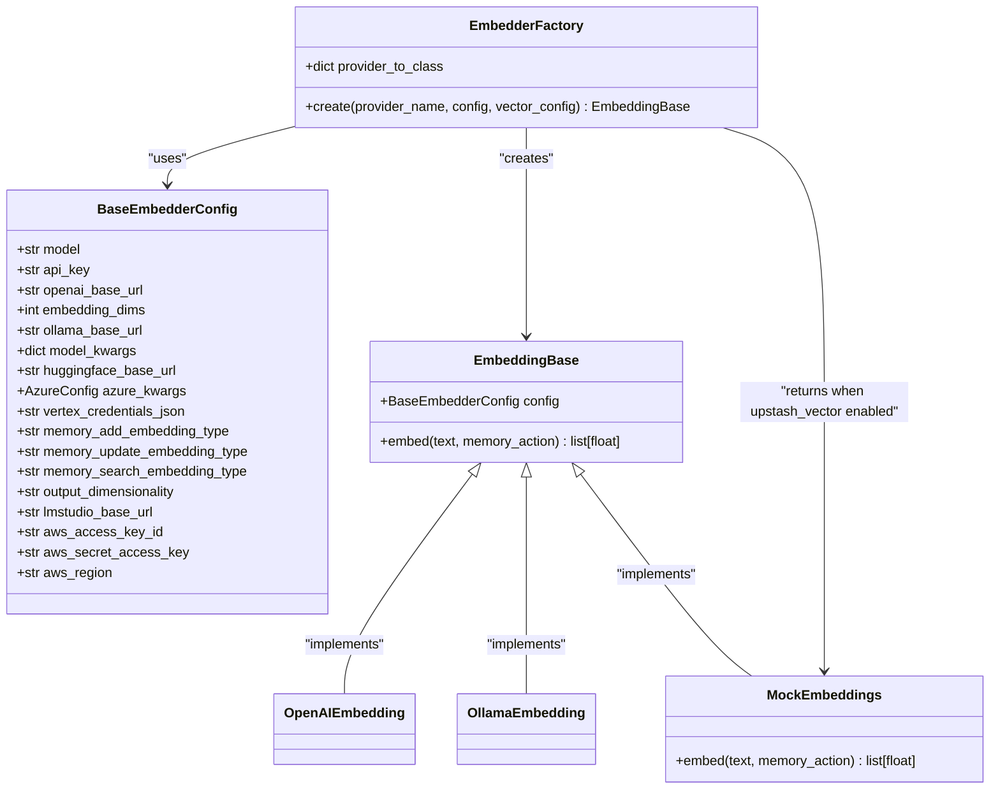
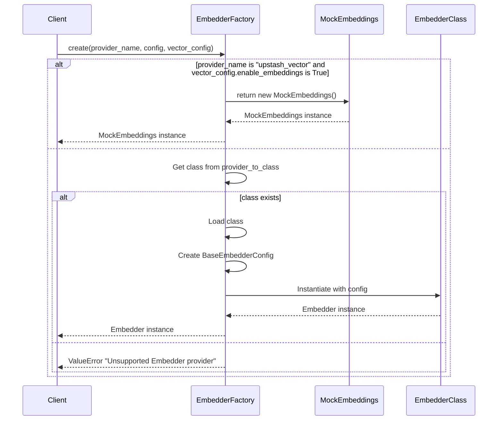
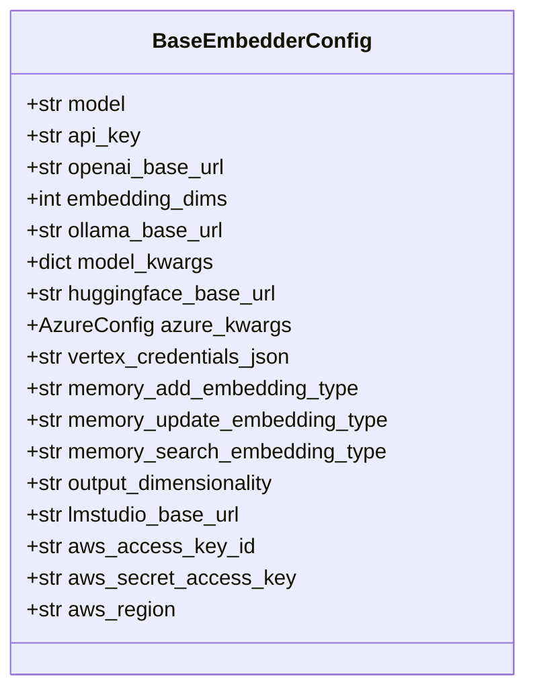
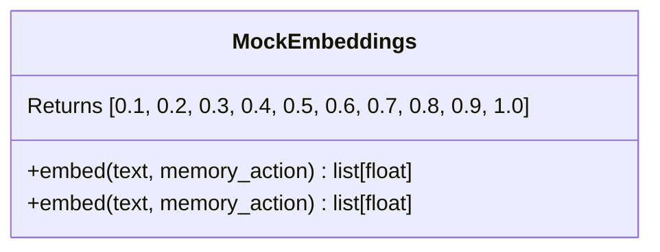

# EmbedderFactory

<cite>
**Referenced Files in This Document**   
- [factory.py](file://mem0/utils/factory.py#L131-L157)
- [base.py](file://mem0/configs/embeddings/base.py#L10-L111)
- [mock.py](file://mem0/embeddings/mock.py#L6-L11)
- [openai.py](file://mem0/embeddings/openai.py#L11-L50)
- [ollama.py](file://mem0/embeddings/ollama.py#L24-L54)
- [upstash_vector.py](file://mem0/vector_stores/upstash_vector.py#L23-L293)
- [upstash_vector.py](file://mem0/configs/vector_stores/upstash_vector.py#L12-L34)
</cite>

## Table of Contents
1. [Introduction](#introduction)
2. [Core Components](#core-components)
3. [Architecture Overview](#architecture-overview)
4. [Detailed Component Analysis](#detailed-component-analysis)
5. [Provider Configuration and Implementation Mapping](#provider-configuration-and-implementation-mapping)
6. [Error Handling and Validation](#error-handling-and-validation)
7. [Examples](#examples)
8. [Conclusion](#conclusion)

## Introduction
The EmbedderFactory class is a factory pattern implementation responsible for creating embedding model instances in the Mem0 framework. It provides a unified interface for instantiating various embedding providers with their respective configurations. The factory handles the creation of embedder instances based on provider names, manages configuration through the BaseEmbedderConfig class, and implements special handling for the upstash_vector provider when built-in embeddings are enabled.

**Section sources**
- [factory.py](file://mem0/utils/factory.py#L131-L157)

## Core Components
The EmbedderFactory class is the central component for creating embedding model instances. It maintains a mapping of provider names to their corresponding implementation classes and handles the instantiation process with proper configuration. The factory works in conjunction with the BaseEmbedderConfig class which defines the common configuration parameters for all embedders, and the MockEmbeddings class which provides a special implementation for the upstash_vector provider when built-in embeddings are enabled.

**Section sources**
- [factory.py](file://mem0/utils/factory.py#L131-L157)
- [base.py](file://mem0/configs/embeddings/base.py#L10-L111)
- [mock.py](file://mem0/embeddings/mock.py#L6-L11)

## Architecture Overview


**Diagram sources **
- [factory.py](file://mem0/utils/factory.py#L131-L157)
- [base.py](file://mem0/configs/embeddings/base.py#L10-L111)
- [mock.py](file://mem0/embeddings/mock.py#L6-L11)

## Detailed Component Analysis

### EmbedderFactory Class Analysis
The EmbedderFactory class implements the factory pattern to create embedding model instances. It maintains a provider_to_class dictionary that maps provider names to their corresponding implementation classes. The create() method is the primary interface for creating embedder instances, taking a provider name, configuration data, and vector configuration as parameters.

The factory implements special handling for the upstash_vector provider when built-in embeddings are enabled in the vector configuration. In this case, it returns a MockEmbeddings instance instead of attempting to create a regular embedder. For all other providers, it loads the corresponding class from the provider_to_class mapping and instantiates it with the provided configuration.



**Diagram sources **
- [factory.py](file://mem0/utils/factory.py#L147-L157)

**Section sources**
- [factory.py](file://mem0/utils/factory.py#L131-L157)

### BaseEmbedderConfig Analysis
The BaseEmbedderConfig class defines the common configuration parameters for all embedding providers. It includes parameters for model selection, API keys, base URLs for different providers (OpenAI, Ollama, Hugging Face, etc.), and provider-specific configurations like Azure settings, Vertex AI credentials, and AWS credentials. The configuration class serves as a standardized way to pass configuration options to all embedder implementations.



**Diagram sources **
- [base.py](file://mem0/configs/embeddings/base.py#L10-L111)

**Section sources**
- [base.py](file://mem0/configs/embeddings/base.py#L10-L111)

### MockEmbeddings Analysis
The MockEmbeddings class provides a special implementation that returns a fixed embedding vector when built-in embeddings are enabled for the upstash_vector provider. This allows the system to use Upstash Vector's built-in embedding capabilities instead of external embedding models, reducing complexity and costs.



**Diagram sources **
- [mock.py](file://mem0/embeddings/mock.py#L6-L11)

**Section sources**
- [mock.py](file://mem0/embeddings/mock.py#L6-L11)

## Provider Configuration and Implementation Mapping
The EmbedderFactory class supports multiple embedding providers through its provider_to_class mapping. Each provider is mapped to its corresponding implementation class, allowing the factory to instantiate the appropriate embedder based on the provider name.

```mermaid
flowchart TD
A[Provider Name] --> B{Check provider_to_class}
B --> |"openai"| C[mem0.embeddings.openai.OpenAIEmbedding]
B --> |"ollama"| D[mem0.embeddings.ollama.OllamaEmbedding]
B --> |"huggingface"| E[mem0.embeddings.huggingface.HuggingFaceEmbedding]
B --> |"azure_openai"| F[mem0.embeddings.azure_openai.AzureOpenAIEmbedding]
B --> |"gemini"| G[mem0.embeddings.gemini.GoogleGenAIEmbedding]
B --> |"vertexai"| H[mem0.embeddings.vertexai.VertexAIEmbedding]
B --> |"together"| I[mem0.embeddings.together.TogetherEmbedding]
B --> |"lmstudio"| J[mem0.embeddings.lmstudio.LMStudioEmbedding]
B --> |"langchain"| K[mem0.embeddings.langchain.LangchainEmbedding]
B --> |"aws_bedrock"| L[mem0.embeddings.aws_bedrock.AWSBedrockEmbedding]
B --> |"github_copilot"| M[mem0.embeddings.github_copilot.GitHubCopilotEmbedding]
B --> |"upstash_vector"| N[MockEmbeddings]
B --> |Unsupported provider| O[ValueError]
```



**Diagram sources **
- [factory.py](file://mem0/utils/factory.py#L132-L144)

**Section sources**
- [factory.py](file://mem0/utils/factory.py#L131-L157)

## Error Handling and Validation
The EmbedderFactory implements robust error handling for invalid providers and configuration issues. When an unsupported provider is requested, the factory raises a ValueError with a descriptive message. The factory also validates the vector configuration when handling the upstash_vector provider, ensuring that the enable_embeddings flag is properly set.

For individual embedder implementations, error handling is implemented at the class level. For example, the OllamaEmbedding class checks for the presence of the ollama library and attempts to install it if missing, while the OpenAIEmbedding class handles API key configuration through environment variables.

```mermaid
flowchart TD
A[create() method] --> B{provider_name == "upstash_vector" and vector_config.enable_embeddings}
B --> |Yes| C[Return MockEmbeddings]
B --> |No| D{provider_name in provider_to_class}
D --> |Yes| E[Load class and create instance]
D --> |No| F[Raise ValueError]
E --> G[Return embedder instance]
F --> H["Error: 'Unsupported Embedder provider: {provider_name}'"]
```

**Diagram sources **
- [factory.py](file://mem0/utils/factory.py#L147-L157)

**Section sources**
- [factory.py](file://mem0/utils/factory.py#L131-L157)
- [ollama.py](file://mem0/embeddings/ollama.py#L8-L22)
- [openai.py](file://mem0/embeddings/openai.py#L18-L24)

## Examples

### Creating an OpenAI Embedder Instance
To create an OpenAI embedder instance, call the create() method with "openai" as the provider name and provide the necessary configuration:

```python
config = {
    "model": "text-embedding-3-small",
    "api_key": "your-openai-api-key",
    "embedding_dims": 1536
}
embedder = EmbedderFactory.create("openai", config, vector_config=None)
```

The OpenAI embedder will use the specified model and API key, with default values applied for any missing configuration parameters.

**Section sources**
- [factory.py](file://mem0/utils/factory.py#L147-L157)
- [openai.py](file://mem0/embeddings/openai.py#L11-L50)

### Creating an Ollama Embedder Instance
To create an Ollama embedder instance, call the create() method with "ollama" as the provider name:

```python
config = {
    "model": "nomic-embed-text",
    "ollama_base_url": "http://localhost:11434"
}
embedder = EmbedderFactory.create("ollama", config, vector_config=None)
```

The Ollama embedder will connect to the specified base URL and ensure the requested model is available locally.

**Section sources**
- [factory.py](file://mem0/utils/factory.py#L147-L157)
- [ollama.py](file://mem0/embeddings/ollama.py#L24-L54)

### Using Upstash Vector with Built-in Embeddings
When using Upstash Vector with built-in embeddings enabled, the factory returns a MockEmbeddings instance:

```python
vector_config = {"enable_embeddings": True}
embedder = EmbedderFactory.create("upstash_vector", {}, vector_config)
```

This special case allows the system to leverage Upstash Vector's native embedding capabilities instead of external embedding models.

**Section sources**
- [factory.py](file://mem0/utils/factory.py#L147-L157)
- [upstash_vector.py](file://mem0/vector_stores/upstash_vector.py#L23-L293)
- [upstash_vector.py](file://mem0/configs/vector_stores/upstash_vector.py#L12-L34)

## Conclusion
The EmbedderFactory class provides a flexible and extensible mechanism for creating embedding model instances in the Mem0 framework. By implementing the factory pattern, it abstracts away the complexity of instantiating different embedding providers while maintaining a consistent interface. The factory's support for multiple providers, standardized configuration through BaseEmbedderConfig, and special handling for Upstash Vector with built-in embeddings makes it a robust solution for managing embedding models in various deployment scenarios.

The implementation demonstrates good software engineering practices with clear separation of concerns, proper error handling, and extensibility through the provider_to_class mapping. The use of MockEmbeddings for Upstash Vector with built-in embeddings is a particularly elegant solution that reduces dependencies and costs when the vector store can handle embeddings natively.