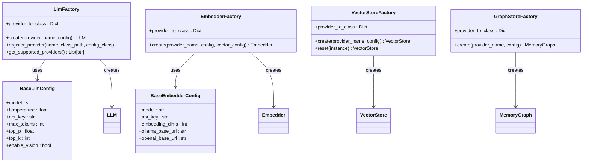
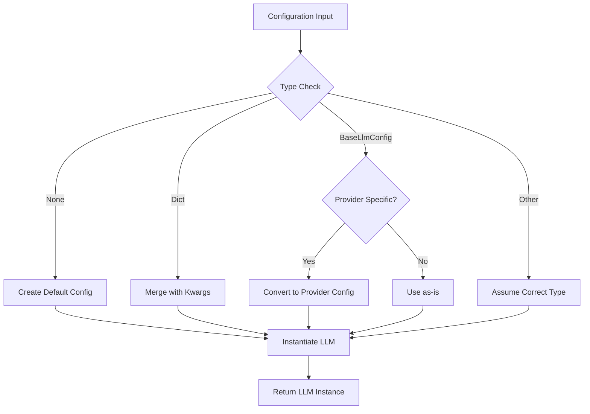
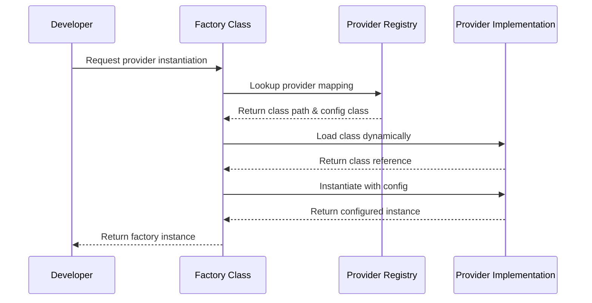
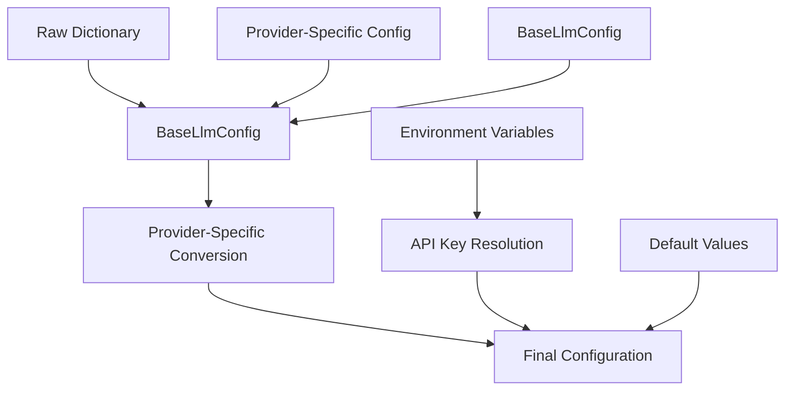
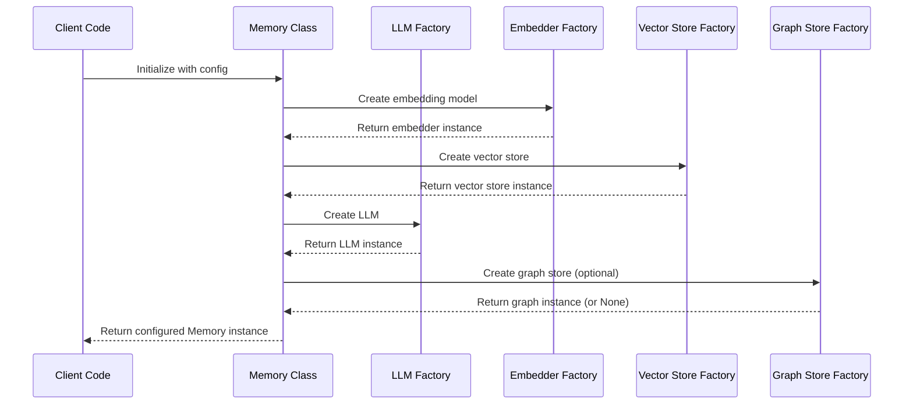
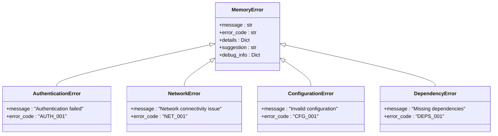
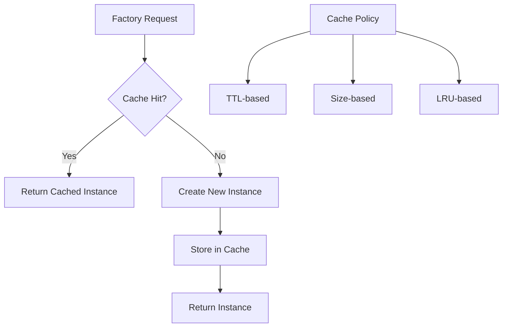

# Factory Classes

<cite>
**Referenced Files in This Document**
- [mem0/utils/factory.py](file://mem0/utils/factory.py)
- [mem0/configs/base.py](file://mem0/configs/base.py)
- [mem0/configs/llms/base.py](file://mem0/configs/llms/base.py)
- [mem0/configs/embeddings/base.py](file://mem0/configs/embeddings/base.py)
- [mem0/llms/openai.py](file://mem0/llms/openai.py)
- [mem0/vector_stores/qdrant.py](file://mem0/vector_stores/qdrant.py)
- [mem0/memory/main.py](file://mem0/memory/main.py)
- [mem0/memory/graph_memory.py](file://mem0/memory/graph_memory.py)
- [mem0/memory/memgraph_memory.py](file://mem0/memory/memgraph_memory.py)
- [mem0-ts/src/oss/src/utils/factory.ts](file://mem0-ts/src/oss/src/utils/factory.ts)
- [embedchain/embedchain/factory.py](file://embedchain/embedchain/factory.py)
- [embedchain/tests/test_factory.py](file://embedchain/tests/test_factory.py)
- [tests/test_main.py](file://tests/test_main.py)
- [mem0/exceptions.py](file://mem0/exceptions.py)
</cite>

## Table of Contents
1. [Introduction](#introduction)
2. [Factory Architecture Overview](#factory-architecture-overview)
3. [Core Factory Classes](#core-factory-classes)
4. [Provider Registration Patterns](#provider-registration-patterns)
5. [Configuration Management](#configuration-management)
6. [Factory Usage Examples](#factory-usage-examples)
7. [Error Handling](#error-handling)
8. [Performance Considerations](#performance-considerations)
9. [Extensibility Model](#extensibility-model)
10. [Best Practices](#best-practices)

## Introduction

The mem0 framework employs a sophisticated factory pattern architecture that enables seamless plugin-based integration of various AI providers and services. The factory classes serve as centralized entry points for instantiating LLM providers, embedding models, vector stores, and graph databases, providing a unified interface while maintaining flexibility for custom implementations.

This architecture follows the Abstract Factory pattern, allowing developers to configure and instantiate different provider implementations through standardized interfaces. The factories handle provider registration, configuration validation, and instance creation while abstracting away the complexity of individual provider integrations.

## Factory Architecture Overview

The factory system consists of four primary factory classes, each responsible for managing a specific category of providers:



**Diagram sources**
- [mem0/utils/factory.py](file://mem0/utils/factory.py#L23-L224)
- [mem0/configs/llms/base.py](file://mem0/configs/llms/base.py#L7-L63)
- [mem0/configs/embeddings/base.py](file://mem0/configs/embeddings/base.py#L10-L111)

**Section sources**
- [mem0/utils/factory.py](file://mem0/utils/factory.py#L1-L224)

## Core Factory Classes

### LlmFactory

The LlmFactory manages Language Model provider instantiation with support for both legacy BaseLlmConfig and provider-specific configuration classes.

#### Key Features:
- **Provider Mapping**: Maintains a registry of supported LLM providers with their respective class paths and configuration classes
- **Flexible Configuration**: Supports multiple configuration formats including BaseLlmConfig, provider-specific configs, and raw dictionaries
- **Provider Registration**: Allows dynamic registration of custom LLM providers
- **Version Compatibility**: Handles conversion between different configuration formats

#### Supported Providers:
- OpenAI (including OpenRouter integration)
- Anthropic Claude
- Ollama
- Azure OpenAI
- Groq
- Together AI
- AWS Bedrock
- Google Gemini
- DeepSeek
- LM Studio
- vLLM
- LangChain integration

#### Configuration Handling:



**Diagram sources**
- [mem0/utils/factory.py](file://mem0/utils/factory.py#L50-L104)

**Section sources**
- [mem0/utils/factory.py](file://mem0/utils/factory.py#L23-L128)

### EmbedderFactory

The EmbedderFactory handles embedding model instantiation with special handling for vector store integration requirements.

#### Key Features:
- **Vector Store Integration**: Special logic for Upstash Vector store with mock embedding support
- **Provider Registry**: Manages embedding provider mappings
- **Configuration Validation**: Ensures proper embedding dimension handling
- **Provider-Specific Logic**: Handles unique requirements for different embedding providers

#### Supported Providers:
- OpenAI
- Ollama
- Hugging Face
- Azure OpenAI
- Google Gemini
- Vertex AI
- Together AI
- LM Studio
- AWS Bedrock
- GitHub Copilot

**Section sources**
- [mem0/utils/factory.py](file://mem0/utils/factory.py#L131-L157)

### VectorStoreFactory

The VectorStoreFactory manages vector database provider instantiation with support for various vector store implementations.

#### Key Features:
- **Provider Registry**: Comprehensive mapping of vector store providers
- **Configuration Serialization**: Handles Pydantic model to dictionary conversion
- **Instance Reset**: Provides reset functionality for vector store instances
- **Error Handling**: Robust error handling for unsupported providers

#### Supported Providers:
- Qdrant
- ChromaDB
- PGVector
- Milvus
- Upstash Vector
- Azure AI Search
- Azure MySQL
- Pinecone
- MongoDB
- Redis
- Valkey
- Databricks
- Elasticsearch
- Vertex AI Vector Search
- OpenSearch
- Supabase
- Weaviate
- FAISS
- S3 Vectors
- Baidu
- Neptune Analytics

**Section sources**
- [mem0/utils/factory.py](file://mem0/utils/factory.py#L159-L200)

### GraphStoreFactory

The GraphStoreFactory manages graph database provider instantiation for knowledge graph functionality.

#### Key Features:
- **Provider Flexibility**: Supports multiple graph database providers
- **Default Fallback**: Falls back to default MemoryGraph if specific provider not found
- **Error Handling**: Provides meaningful error messages for import failures
- **Configuration Integration**: Seamlessly integrates with MemoryConfig

#### Supported Providers:
- Memgraph
- Amazon Neptune
- Kuzu
- Default MemoryGraph

**Section sources**
- [mem0/utils/factory.py](file://mem0/utils/factory.py#L202-L224)

## Provider Registration Patterns

### Static Registration

Providers are statically registered in the factory classes using a mapping dictionary that associates provider names with their implementation classes and configuration classes.



**Diagram sources**
- [mem0/utils/factory.py](file://mem0/utils/factory.py#L17-L21)

### Dynamic Registration

The LlmFactory supports runtime provider registration through the `register_provider()` method, enabling custom provider integration without modifying factory source code.

#### Registration Process:
1. **Provider Name Validation**: Ensures the provider name is unique
2. **Class Path Resolution**: Validates the class path format
3. **Configuration Class Assignment**: Assigns appropriate configuration class
4. **Registry Update**: Updates the provider_to_class mapping

**Section sources**
- [mem0/utils/factory.py](file://mem0/utils/factory.py#L106-L118)

## Configuration Management

### Configuration Hierarchy

The factory system employs a hierarchical configuration approach that supports multiple configuration formats and automatic conversion between them:



**Diagram sources**
- [mem0/configs/llms/base.py](file://mem0/configs/llms/base.py#L16-L63)
- [mem0/configs/embeddings/base.py](file://mem0/configs/embeddings/base.py#L15-L111)

### Configuration Classes

Each factory maintains specific configuration classes that define the parameters supported by their respective providers:

#### BaseLlmConfig
- **Common Parameters**: model, temperature, api_key, max_tokens, top_p, top_k
- **Vision Support**: enable_vision, vision_details
- **Network Configuration**: http_client_proxies
- **Provider-Specific Extensions**: Additional parameters for specific providers

#### BaseEmbedderConfig
- **Model Configuration**: model, embedding_dims
- **Provider-Specific URLs**: ollama_base_url, openai_base_url, huggingface_base_url
- **Azure Configuration**: azure_kwargs for Azure OpenAI
- **Cloud Provider Settings**: vertex_credentials_json for Vertex AI
- **AWS Configuration**: aws_access_key_id, aws_secret_access_key, aws_region

**Section sources**
- [mem0/configs/llms/base.py](file://mem0/configs/llms/base.py#L7-L63)
- [mem0/configs/embeddings/base.py](file://mem0/configs/embeddings/base.py#L10-L111)

## Factory Usage Examples

### Creating LLM Instances

#### Basic Usage:
```python
# Using provider name and configuration dictionary
llm = LlmFactory.create(
    provider_name="openai",
    config={
        "model": "gpt-4o-mini",
        "temperature": 0.1,
        "api_key": "your-api-key"
    }
)

# Using BaseLlmConfig
from mem0.configs.llms.base import BaseLlmConfig
config = BaseLlmConfig(model="gpt-4o-mini", temperature=0.1)
llm = LlmFactory.create("openai", config)
```

#### Advanced Usage with Custom Providers:
```python
# Register custom provider
LlmFactory.register_provider(
    name="custom_llm",
    class_path="my_package.custom_llm.CustomLLM",
    config_class=CustomLLMConfig
)

# Create instance with custom provider
llm = LlmFactory.create("custom_llm", custom_config)
```

### Creating Vector Store Instances

#### Basic Usage:
```python
# Qdrant vector store
vector_store = VectorStoreFactory.create(
    provider_name="qdrant",
    config={
        "collection_name": "memories",
        "host": "localhost",
        "port": 6333
    }
)

# ChromaDB vector store
vector_store = VectorStoreFactory.create(
    provider_name="chroma",
    config={
        "path": "./chroma_db",
        "collection_name": "memories"
    }
)
```

#### Vector Store with Reset Capability:
```python
# Create vector store
vs = VectorStoreFactory.create("qdrant", config)

# Perform operations...

# Reset vector store
vs = VectorStoreFactory.reset(vs)
```

### Creating Graph Store Instances

#### Basic Usage:
```python
# Memgraph graph store
graph_store = GraphStoreFactory.create(
    provider_name="memgraph",
    config=memory_config
)

# Default graph store
graph_store = GraphStoreFactory.create("default", config)
```

### Memory Instance Creation

The main Memory class demonstrates comprehensive factory usage:



**Diagram sources**
- [mem0/memory/main.py](file://mem0/memory/main.py#L131-L158)

**Section sources**
- [mem0/memory/main.py](file://mem0/memory/main.py#L131-L158)
- [mem0/memory/graph_memory.py](file://mem0/memory/graph_memory.py#L38-L66)
- [mem0/memory/memgraph_memory.py](file://mem0/memory/memgraph_memory.py#L38-L65)

## Error Handling

### Unsupported Provider Errors

The factory classes implement comprehensive error handling for unsupported providers and configuration mismatches:

#### LlmFactory Error Handling:
```python
try:
    llm = LlmFactory.create("unsupported_provider", {})
except ValueError as e:
    print(f"Unsupported LLM provider: {e}")
```

#### VectorStoreFactory Error Handling:
```python
try:
    vs = VectorStoreFactory.create("unsupported_vector_store", {})
except ValueError as e:
    print(f"Unsupported vector store provider: {e}")
```

#### GraphStoreFactory Error Handling:
```python
try:
    graph = GraphStoreFactory.create("unsupported_graph", config)
except (ImportError, AttributeError) as e:
    print(f"Could not import MemoryGraph: {e}")
```

### Configuration Validation

The factory system performs extensive configuration validation:

#### Parameter Validation:
- **Temperature Range**: Validates temperature values between 0.0 and 2.0
- **Token Limits**: Ensures max_tokens are within acceptable ranges
- **Model Availability**: Verifies model names are supported by providers
- **API Key Presence**: Checks for required authentication credentials

#### Type Checking:
- **Configuration Types**: Validates input configuration types
- **Parameter Types**: Ensures parameter types match expected formats
- **Provider Compatibility**: Verifies provider-specific parameter compatibility

### Exception Hierarchy

The framework defines a comprehensive exception hierarchy for different error scenarios:



**Diagram sources**
- [mem0/exceptions.py](file://mem0/exceptions.py#L64-L424)

**Section sources**
- [mem0/utils/factory.py](file://mem0/utils/factory.py#L66-L104)
- [mem0/utils/factory.py](file://mem0/utils/factory.py#L186-L194)
- [mem0/utils/factory.py](file://mem0/utils/factory.py#L216-L223)

## Performance Considerations

### Factory Instantiation Performance

#### Lazy Loading Strategy
The factory system implements lazy loading for provider classes to optimize startup performance:

- **Dynamic Import**: Provider classes are imported only when requested
- **Minimal Dependencies**: Factories minimize external dependencies during initialization
- **Cached Lookups**: Provider mappings are cached after initial lookup

#### Configuration Processing Efficiency
- **Type Coercion**: Efficient type conversion between configuration formats
- **Validation Optimization**: Minimal validation overhead during normal operation
- **Default Value Handling**: Optimized default value assignment

### Caching Strategies

#### Instance Caching
While the current factory implementation doesn't include built-in caching, several caching strategies can be implemented:



#### Recommended Caching Approaches:
1. **Provider Instance Caching**: Cache frequently used provider instances
2. **Configuration Caching**: Cache validated configuration objects
3. **Class Loading Caching**: Cache loaded class references
4. **Connection Pooling**: Implement connection pooling for expensive resources

### Memory Management

#### Garbage Collection Considerations:
- **Circular References**: Proper cleanup of circular references in provider instances
- **Resource Cleanup**: Automatic resource cleanup through context managers
- **Weak References**: Use weak references for cache implementations

#### Resource Optimization:
- **Connection Reuse**: Reuse connections where possible
- **Batch Operations**: Support batch operations for vector stores
- **Streaming Support**: Implement streaming for large data operations

**Section sources**
- [mem0/utils/factory.py](file://mem0/utils/factory.py#L17-L21)

## Extensibility Model

### Custom Provider Development

#### Provider Interface Requirements
To create custom providers, developers must implement specific interfaces:

##### LLM Provider Interface:
```python
class CustomLLM(LLMBase):
    def __init__(self, config: CustomLLMConfig):
        # Initialize with provider-specific configuration
        pass
    
    def generate_response(self, messages, **kwargs):
        # Implement response generation
        pass
```

##### Embedder Provider Interface:
```python
class CustomEmbedder(EmbedderBase):
    def __init__(self, config: BaseEmbedderConfig):
        # Initialize with embedding configuration
        pass
    
    def embed(self, texts: List[str], task_type: str = "search"):
        # Implement embedding generation
        pass
```

##### Vector Store Provider Interface:
```python
class CustomVectorStore(VectorStoreBase):
    def __init__(self, **kwargs):
        # Initialize with vector store configuration
        pass
    
    def insert(self, vectors: List[List[float]], payloads: List[Dict]):
        # Implement vector insertion
        pass
    
    def search(self, query: str, vectors: List[float], limit: int = 5):
        # Implement vector search
        pass
```

### Provider Registration Process

#### Static Registration:
```python
# Add to provider_to_class mapping
LlmFactory.provider_to_class["custom_provider"] = (
    "my_package.custom_provider.CustomLLM",
    CustomLLMConfig
)
```

#### Dynamic Registration:
```python
# Runtime registration
LlmFactory.register_provider(
    name="custom_provider",
    class_path="my_package.custom_provider.CustomLLM",
    config_class=CustomLLMConfig
)
```

### Plugin Architecture Benefits

#### Modular Design:
- **Separation of Concerns**: Clear separation between factory logic and provider implementations
- **Testability**: Easy unit testing of individual providers
- **Maintainability**: Isolated provider updates without affecting other components

#### Scalability:
- **Horizontal Scaling**: Easy addition of new providers
- **Vertical Scaling**: Support for different provider tiers
- **Feature Parity**: Consistent API across all providers

**Section sources**
- [mem0/utils/factory.py](file://mem0/utils/factory.py#L106-L118)

## Best Practices

### Configuration Management

#### Environment Variable Usage:
```python
# Use environment variables for sensitive configuration
import os
config = BaseLlmConfig(
    model="gpt-4o-mini",
    api_key=os.getenv("OPENAI_API_KEY"),
    temperature=0.1
)
```

#### Configuration Validation:
```python
# Validate configuration before factory instantiation
from pydantic import ValidationError

try:
    config = BaseLlmConfig(**raw_config)
except ValidationError as e:
    print(f"Configuration validation failed: {e}")
```

### Error Handling Best Practices

#### Graceful Degradation:
```python
def create_fallback_provider(primary_provider, fallback_provider, config):
    try:
        return LlmFactory.create(primary_provider, config)
    except ValueError:
        print(f"Falling back to {fallback_provider}")
        return LlmFactory.create(fallback_provider, config)
```

#### Comprehensive Error Reporting:
```python
try:
    llm = LlmFactory.create(provider, config)
except ValueError as e:
    raise ConfigurationError(
        message=f"Failed to create {provider} provider",
        error_code="PROV_001",
        details={"provider": provider, "config": config},
        suggestion="Check provider availability and configuration"
    )
```

### Performance Optimization

#### Connection Pooling:
```python
# Implement connection pooling for expensive resources
class PooledLLMFactory:
    def __init__(self):
        self.pool = {}
    
    def get_connection(self, provider, config):
        pool_key = f"{provider}_{hash(str(config))}"
        if pool_key not in self.pool:
            self.pool[pool_key] = LlmFactory.create(provider, config)
        return self.pool[pool_key]
```

#### Batch Operations:
```python
# Use batch operations for vector stores
def batch_insert_embeddings(vector_store, texts, metadata_list):
    embeddings = embedder.embed(texts)
    vector_store.insert(
        vectors=embeddings,
        payloads=[{"text": text, **meta} for text, meta in zip(texts, metadata_list)]
    )
```

### Testing Strategies

#### Factory Testing:
```python
def test_factory_creation():
    # Test basic factory functionality
    llm = LlmFactory.create("openai", {"model": "gpt-4o-mini"})
    assert isinstance(llm, OpenAILLM)
    
    # Test unsupported provider
    with pytest.raises(ValueError):
        LlmFactory.create("unsupported", {})
```

#### Provider Integration Testing:
```python
def test_provider_integration():
    # Test provider with real configuration
    config = BaseLlmConfig(
        model="gpt-4o-mini",
        api_key=os.getenv("TEST_API_KEY")
    )
    llm = LlmFactory.create("openai", config)
    response = llm.generate_response([{"role": "user", "content": "Hello"}])
    assert response is not None
```

**Section sources**
- [tests/test_main.py](file://tests/test_main.py#L1-L200)
- [embedchain/tests/test_factory.py](file://embedchain/tests/test_factory.py#L1-L62)