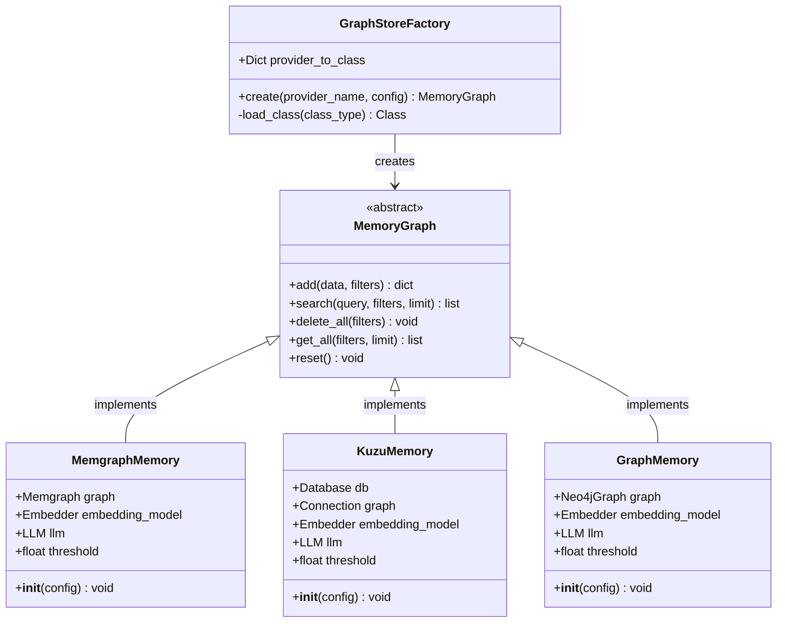
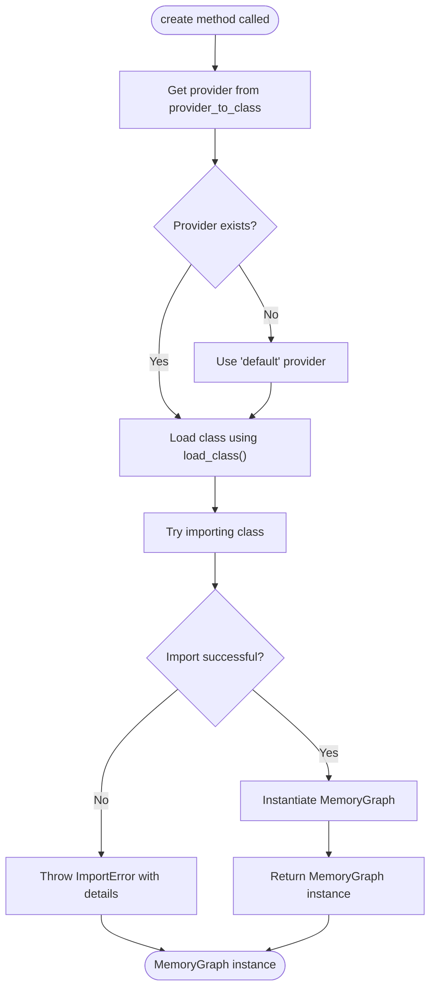
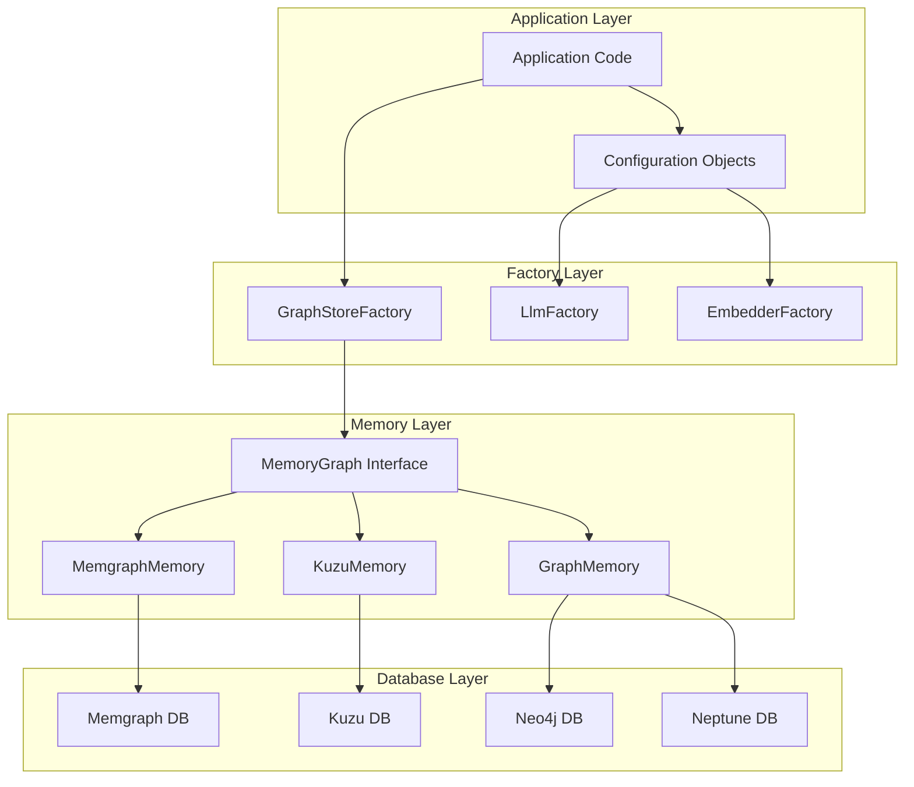
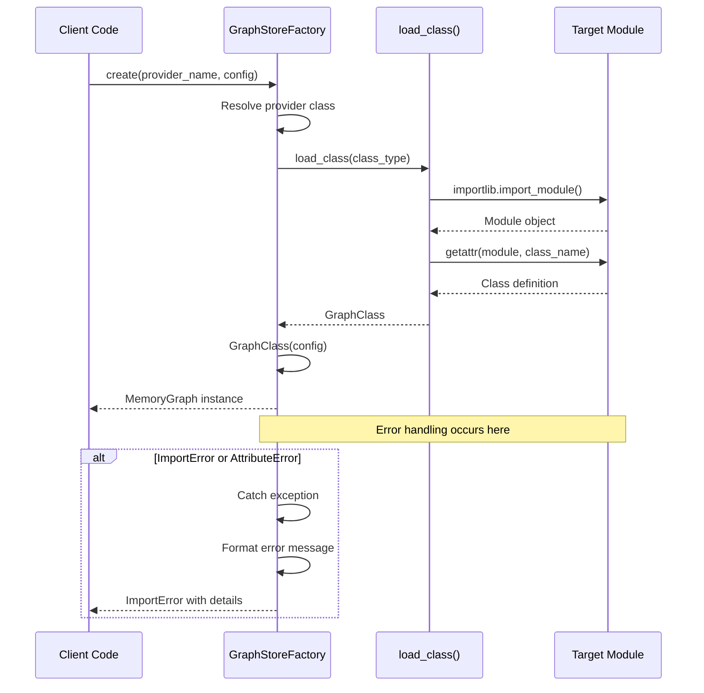
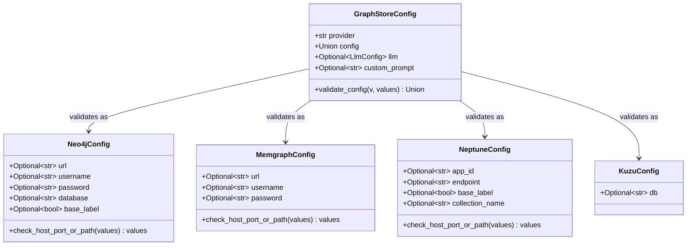
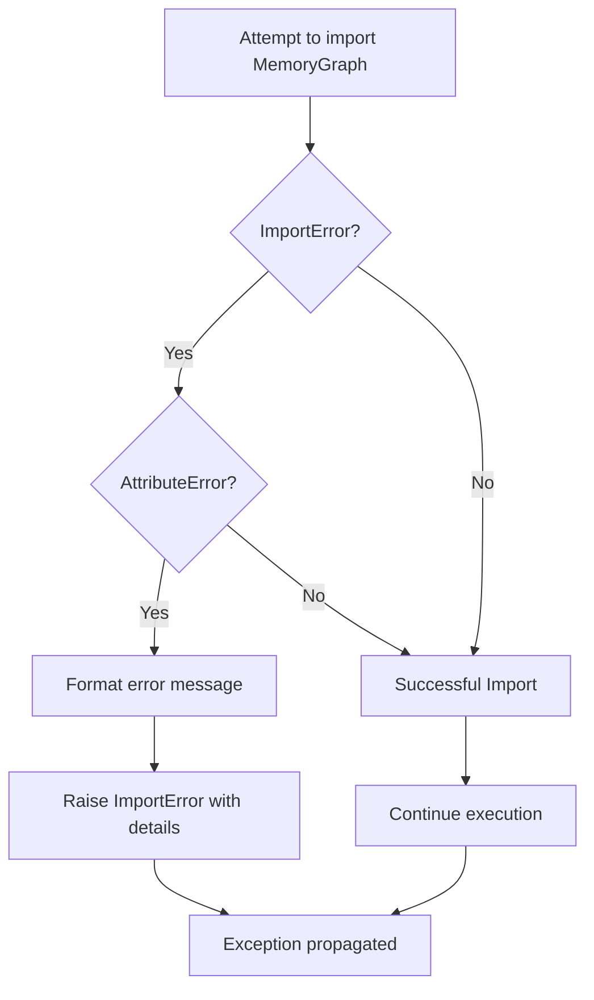
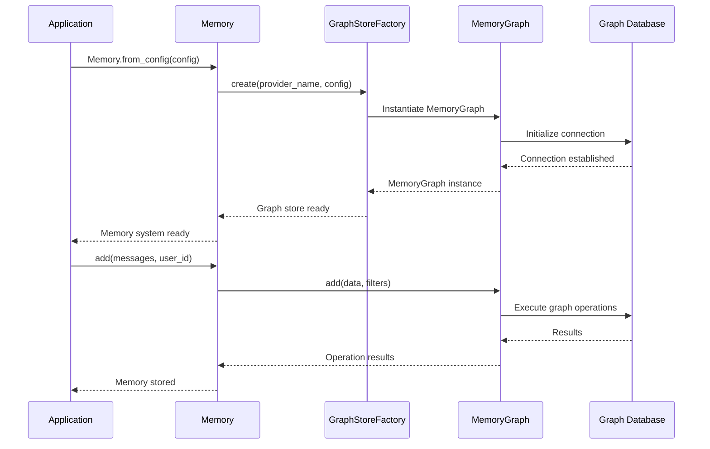

# GraphStoreFactory

<cite>
**Referenced Files in This Document**
- [factory.py](file://mem0/utils/factory.py)
- [memgraph_memory.py](file://mem0/memory/memgraph_memory.py)
- [kuzu_memory.py](file://mem0/memory/kuzu_memory.py)
- [graph_memory.py](file://mem0/memory/graph_memory.py)
- [configs.py](file://mem0/graphs/configs.py)
- [test_kuzu.py](file://tests/memory/test_kuzu.py)
- [memgraph-example.ipynb](file://examples/graph-db-demo/memgraph-example.ipynb)
- [kuzu-example.ipynb](file://examples/graph-db-demo/kuzu-example.ipynb)
</cite>

## Table of Contents
1. [Introduction](#introduction)
2. [Class Overview](#class-overview)
3. [Core Components](#core-components)
4. [Architecture Overview](#architecture-overview)
5. [Detailed Component Analysis](#detailed-component-analysis)
6. [Configuration Management](#configuration-management)
7. [Error Handling Mechanism](#error-handling-mechanism)
8. [Usage Examples](#usage-examples)
9. [Integration Patterns](#integration-patterns)
10. [Best Practices](#best-practices)
11. [Troubleshooting Guide](#troubleshooting-guide)
12. [Conclusion](#conclusion)

## Introduction

The GraphStoreFactory class serves as a centralized factory pattern implementation responsible for creating and managing graph database instances for memory storage across different graph store providers. It provides a unified interface for instantiating MemoryGraph implementations while handling provider-specific dependencies, configuration validation, and error management.

This factory enables seamless integration with various graph databases including Memgraph, Kuzu, Neo4j, and Neptune, offering developers a consistent API regardless of the underlying graph store technology. The factory implements robust error handling mechanisms and follows the default provider pattern to ensure reliable graph database connectivity and initialization.

## Class Overview

The GraphStoreFactory class is implemented as a singleton-style factory with class methods for creating graph store instances. It maintains a mapping between provider names and their corresponding MemoryGraph implementation classes, enabling dynamic instantiation based on runtime configuration.



**Diagram sources**
- [factory.py](file://mem0/utils/factory.py#L201-L223)
- [memgraph_memory.py](file://mem0/memory/memgraph_memory.py#L29-L639)
- [kuzu_memory.py](file://mem0/memory/kuzu_memory.py#L29-L711)
- [graph_memory.py](file://mem0/memory/graph_memory.py#L29-L699)

**Section sources**
- [factory.py](file://mem0/utils/factory.py#L201-L223)

## Core Components

### Provider Mapping System

The GraphStoreFactory maintains a comprehensive provider-to-class mapping that defines which MemoryGraph implementation corresponds to each supported graph store provider:

| Provider | Implementation Class | Description |
|----------|---------------------|-------------|
| `memgraph` | `mem0.memory.memgraph_memory.MemoryGraph` | Memgraph in-memory graph database with vector indexing |
| `neptune` | `mem0.graphs.neptune.neptunegraph.MemoryGraph` | Amazon Neptune graph database for cloud deployments |
| `neptunedb` | `mem0.graphs.neptune.neptunedb.MemoryGraph` | Neptune DB cluster implementation |
| `kuzu` | `mem0.memory.kuzu_memory.MemoryGraph` | Kuzu native graph database with SQL-like interface |
| `default` | `mem0.memory.graph_memory.MemoryGraph` | Fallback Neo4j implementation |

### Factory Method Implementation

The core `create()` method implements the factory pattern with sophisticated error handling and fallback mechanisms:



**Diagram sources**
- [factory.py](file://mem0/utils/factory.py#L216-L223)

**Section sources**
- [factory.py](file://mem0/utils/factory.py#L208-L223)

## Architecture Overview

The GraphStoreFactory integrates with the broader mem0 ecosystem through several key architectural patterns:



**Diagram sources**
- [factory.py](file://mem0/utils/factory.py#L175-L223)
- [configs.py](file://mem0/graphs/configs.py#L80-L106)

## Detailed Component Analysis

### GraphStoreFactory.create() Method

The `create()` method serves as the primary entry point for graph store instantiation, implementing sophisticated parameter handling and error management:

#### Method Signature and Parameters

```python
@classmethod
def create(cls, provider_name, config):
```

**Parameters:**
- `provider_name` (str): Identifier for the graph store provider (e.g., "memgraph", "kuzu", "neptune")
- `config`: Configuration object or dictionary containing provider-specific settings

#### Implementation Details

The method follows a structured approach for graph store creation:

1. **Provider Resolution**: Uses `provider_to_class.get(provider_name, cls.provider_to_class["default"])` to resolve the appropriate MemoryGraph implementation
2. **Class Loading**: Attempts to dynamically load the specified class using the `load_class()` utility function
3. **Error Handling**: Implements comprehensive error handling for import failures and missing dependencies
4. **Instance Creation**: Instantiates the resolved MemoryGraph class with the provided configuration

#### Error Handling Strategy

The factory implements a multi-layered error handling approach:



**Diagram sources**
- [factory.py](file://mem0/utils/factory.py#L218-L222)

**Section sources**
- [factory.py](file://mem0/utils/factory.py#L216-L223)

### MemoryGraph Implementation Classes

Each MemoryGraph implementation provides specialized functionality for its respective graph database while maintaining a consistent interface:

#### MemgraphMemory Implementation

The MemgraphMemory class provides advanced vector indexing capabilities and supports multiple LLM providers:

**Key Features:**
- Vector similarity search using cosine distance
- Automatic index creation for performance optimization
- Support for structured and unstructured entity extraction
- Integration with LangChain Memgraph connector

**Configuration Requirements:**
- URL, username, and password for Memgraph connection
- Embedding dimensions for vector indexing
- Optional LLM provider configuration

#### KuzuMemory Implementation

The KuzuMemory class offers a lightweight, embedded graph database solution:

**Key Features:**
- Native Kuzu database integration
- SQL-like query interface for graph operations
- Schema creation with automatic table setup
- Efficient vector similarity calculations

**Configuration Requirements:**
- Database file path (default: in-memory)
- Embedding model configuration
- Optional LLM provider settings

#### GraphMemory Implementation

The GraphMemory class serves as the default Neo4j implementation with broad compatibility:

**Key Features:**
- Standard Neo4j driver integration
- Flexible node labeling with optional base labels
- Composite indexing for improved query performance
- Comprehensive Cypher query support

**Section sources**
- [memgraph_memory.py](file://mem0/memory/memgraph_memory.py#L29-L639)
- [kuzu_memory.py](file://mem0/memory/kuzu_memory.py#L29-L711)
- [graph_memory.py](file://mem0/memory/graph_memory.py#L29-L699)

## Configuration Management

### GraphStoreConfig Structure

The GraphStoreFactory relies on a hierarchical configuration system that supports multiple graph store providers:



**Diagram sources**
- [configs.py](file://mem0/graphs/configs.py#L8-L106)

### Provider-Specific Configuration

Each graph store provider requires specific configuration parameters:

#### Memgraph Configuration
- `url`: Host address for Memgraph connection (e.g., "bolt://localhost:7687")
- `username`: Authentication username
- `password`: Authentication password

#### Kuzu Configuration  
- `db`: Path to Kuzu database file (default: ":memory:" for in-memory)

#### Neptune Configuration
- `endpoint`: Connection endpoint with protocol prefix
- `app_id`: Application identifier for connections
- `collection_name`: Vector store collection name (for Neptune DB)

**Section sources**
- [configs.py](file://mem0/graphs/configs.py#L8-L106)

## Error Handling Mechanism

### Import Error Management

The GraphStoreFactory implements robust error handling for import failures and missing dependencies:



**Diagram sources**
- [factory.py](file://mem0/utils/factory.py#L218-L222)

### Error Message Formatting

When import errors occur, the factory provides detailed error messages that help diagnose issues:

**Error Pattern:** `"Could not import MemoryGraph for provider '{provider_name}': {original_error_message}"`

**Common Error Scenarios:**
- Missing dependencies (e.g., `langchain_memgraph`, `kuzu`)
- Incorrect provider name
- Invalid class path specification
- Module import failures

### Default Provider Fallback

The factory implements a default provider pattern that ensures graceful degradation when preferred providers are unavailable:

**Fallback Logic:**
1. Attempt to resolve provider from `provider_to_class` mapping
2. If provider not found, fall back to `"default"` provider
3. Use `default` provider's implementation as last resort
4. Raise appropriate error if default provider also fails

**Section sources**
- [factory.py](file://mem0/utils/factory.py#L218-L222)

## Usage Examples

### Creating Memgraph Graph Store Instance

```python
from mem0.utils.factory import GraphStoreFactory
from mem0.graphs.configs import GraphStoreConfig, MemgraphConfig

# Configure Memgraph connection
memgraph_config = MemgraphConfig(
    url="bolt://localhost:7687",
    username="memgraph",
    password="mem0graph"
)

# Create GraphStoreConfig
config = GraphStoreConfig(
    provider="memgraph",
    config=memgraph_config
)

# Create Memgraph MemoryGraph instance
memory_graph = GraphStoreFactory.create("memgraph", config)
```

### Creating Kuzu Graph Store Instance

```python
from mem0.utils.factory import GraphStoreFactory
from mem0.graphs.configs import GraphStoreConfig, KuzuConfig

# Configure Kuzu database
kuzu_config = KuzuConfig(db="/path/to/database")

# Create GraphStoreConfig
config = GraphStoreConfig(
    provider="kuzu",
    config=kuzu_config
)

# Create Kuzu MemoryGraph instance
memory_graph = GraphStoreFactory.create("kuzu", config)
```

### Using Default Provider

```python
from mem0.utils.factory import GraphStoreFactory
from mem0.graphs.configs import GraphStoreConfig, Neo4jConfig

# Create configuration for unsupported provider
invalid_config = GraphStoreConfig(
    provider="unsupported_provider",
    config=Neo4jConfig(url="bolt://localhost:7687")
)

# Factory falls back to default provider
memory_graph = GraphStoreFactory.create("unsupported_provider", invalid_config)
```

**Section sources**
- [memgraph-example.ipynb](file://examples/graph-db-demo/memgraph-example.ipynb#L69-L88)
- [kuzu-example.ipynb](file://examples/graph-db-demo/kuzu-example.ipynb#L1-L51)

## Integration Patterns

### Memory System Integration

The GraphStoreFactory integrates seamlessly with the broader mem0 memory system:



**Diagram sources**
- [factory.py](file://mem0/utils/factory.py#L216-L223)

### Factory Pattern Benefits

The GraphStoreFactory provides several architectural benefits:

1. **Abstraction**: Hides provider-specific implementation details
2. **Flexibility**: Allows runtime provider selection
3. **Extensibility**: Easy addition of new graph store providers
4. **Consistency**: Uniform interface across all providers
5. **Maintainability**: Centralized provider management

**Section sources**
- [factory.py](file://mem0/utils/factory.py#L201-L223)

## Best Practices

### Provider Selection Guidelines

Choose the appropriate graph store provider based on your requirements:

**Memgraph Recommended For:**
- Real-time graph analytics
- Vector similarity search requirements
- High-performance in-memory operations
- Integration with LangChain ecosystem

**Kuzu Recommended For:**
- Lightweight, embedded solutions
- SQL-like graph querying
- Minimal external dependencies
- Resource-constrained environments

**Neo4j (Default) Recommended For:**
- Enterprise-grade features
- Advanced graph algorithms
- Production Neo4j deployments
- Maximum compatibility

### Configuration Best Practices

1. **Validation**: Always validate configuration objects before passing to factory
2. **Error Handling**: Implement proper error handling for factory creation attempts
3. **Resource Management**: Ensure proper cleanup of graph store connections
4. **Testing**: Test with different providers to ensure compatibility
5. **Documentation**: Document provider-specific requirements and limitations

### Performance Considerations

- **Indexing**: Ensure proper indexing for frequently queried entities
- **Connection Pooling**: Implement connection pooling for high-throughput applications
- **Batch Operations**: Use batch operations for bulk data insertion
- **Memory Management**: Monitor memory usage, especially with large graphs

## Troubleshooting Guide

### Common Issues and Solutions

#### Import Errors

**Problem**: `ImportError: Could not import MemoryGraph for provider 'memgraph'`

**Causes:**
- Missing `langchain_memgraph` dependency
- Incorrect provider name
- Module path issues

**Solutions:**
1. Install required dependencies: `pip install langchain-memgraph`
2. Verify provider name spelling
3. Check module import paths

#### Connection Failures

**Problem**: Graph store connection timeouts or authentication failures

**Causes:**
- Incorrect connection credentials
- Network connectivity issues
- Database service not running

**Solutions:**
1. Verify connection parameters
2. Check database service status
3. Test network connectivity

#### Configuration Validation Errors

**Problem**: `ValueError: Unsupported graph store provider`

**Causes:**
- Invalid provider name
- Missing required configuration fields
- Type mismatches in configuration

**Solutions:**
1. Use valid provider names from the mapping
2. Complete all required configuration fields
3. Ensure proper data types in configuration

### Debugging Strategies

1. **Enable Logging**: Set appropriate log levels for detailed error information
2. **Test Connectivity**: Verify database connectivity independently
3. **Validate Configuration**: Use Pydantic validation to catch configuration errors early
4. **Monitor Resources**: Track memory and CPU usage during graph operations

**Section sources**
- [factory.py](file://mem0/utils/factory.py#L218-L222)

## Conclusion

The GraphStoreFactory class provides a robust, extensible foundation for managing graph database instances in the mem0 ecosystem. Its factory pattern implementation ensures consistent behavior across different graph store providers while maintaining flexibility for future enhancements.

Key strengths of the GraphStoreFactory include:

- **Unified Interface**: Consistent API across all supported graph stores
- **Robust Error Handling**: Comprehensive error management with detailed diagnostics
- **Flexible Provider System**: Easy addition of new graph store implementations
- **Default Provider Fallback**: Graceful degradation when preferred providers are unavailable
- **Configuration Validation**: Built-in validation for provider-specific requirements

The factory's integration with the broader mem0 system demonstrates best practices for modular architecture design, making it an essential component for building scalable, provider-agnostic graph memory solutions.

Future enhancements could include support for additional graph store providers, enhanced caching mechanisms, and improved performance monitoring capabilities. The factory's extensible design ensures that such improvements can be implemented without breaking existing functionality.