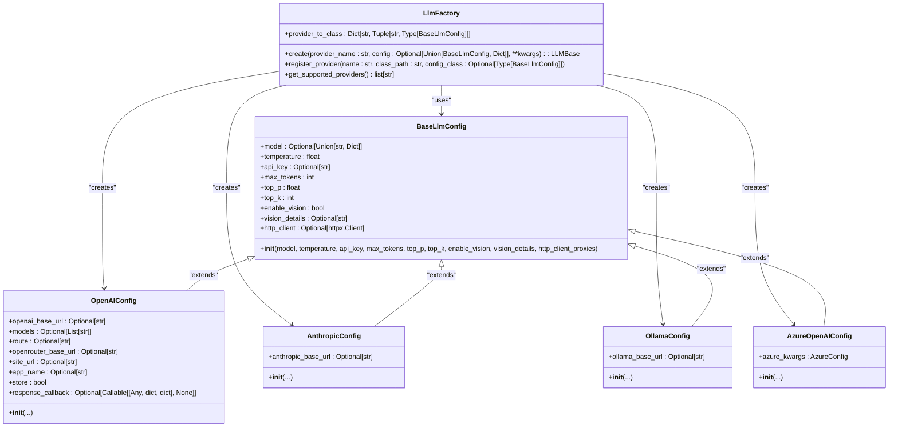
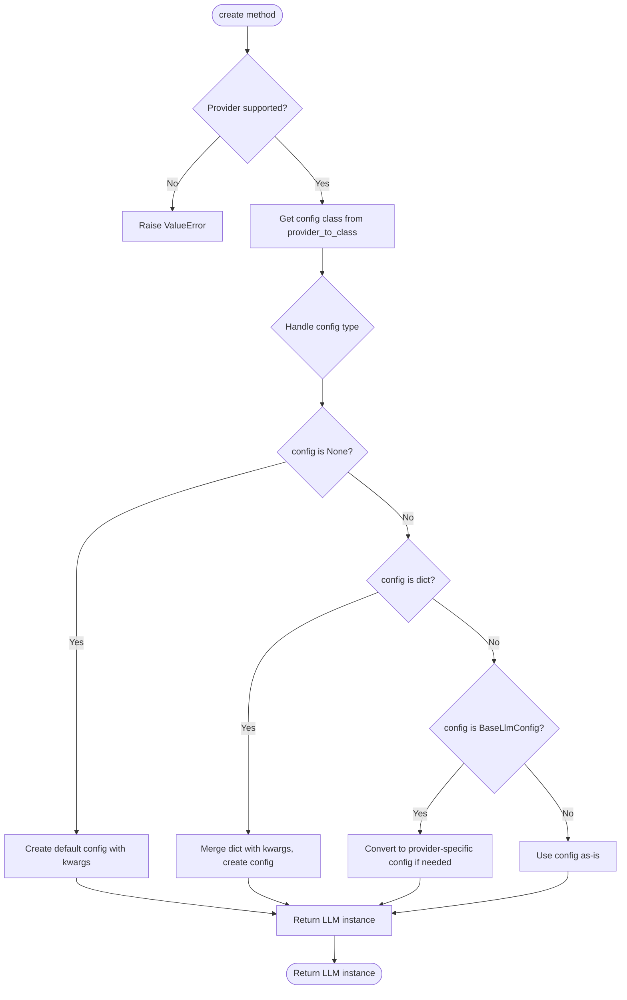
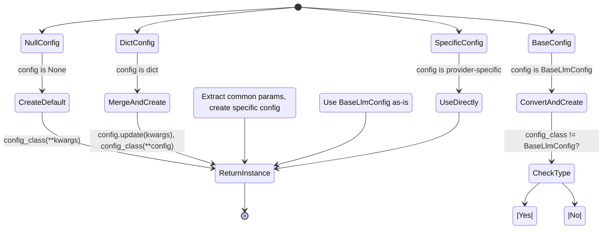
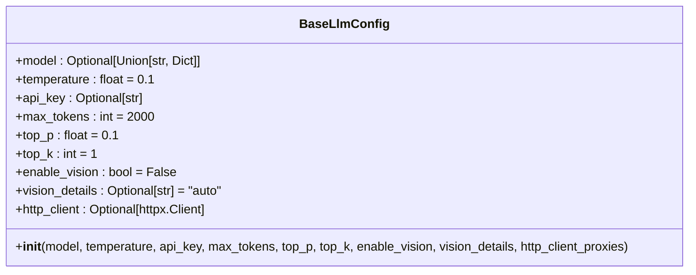
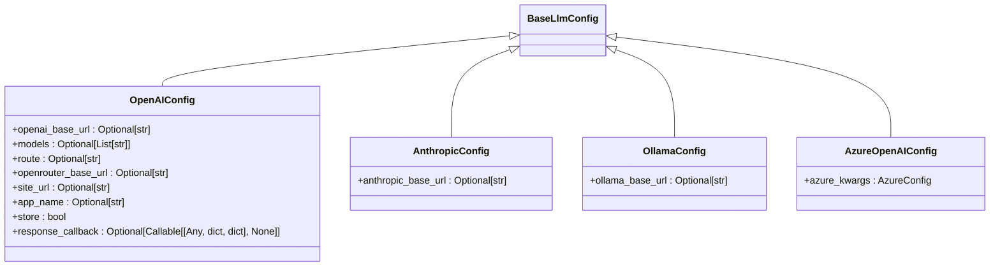
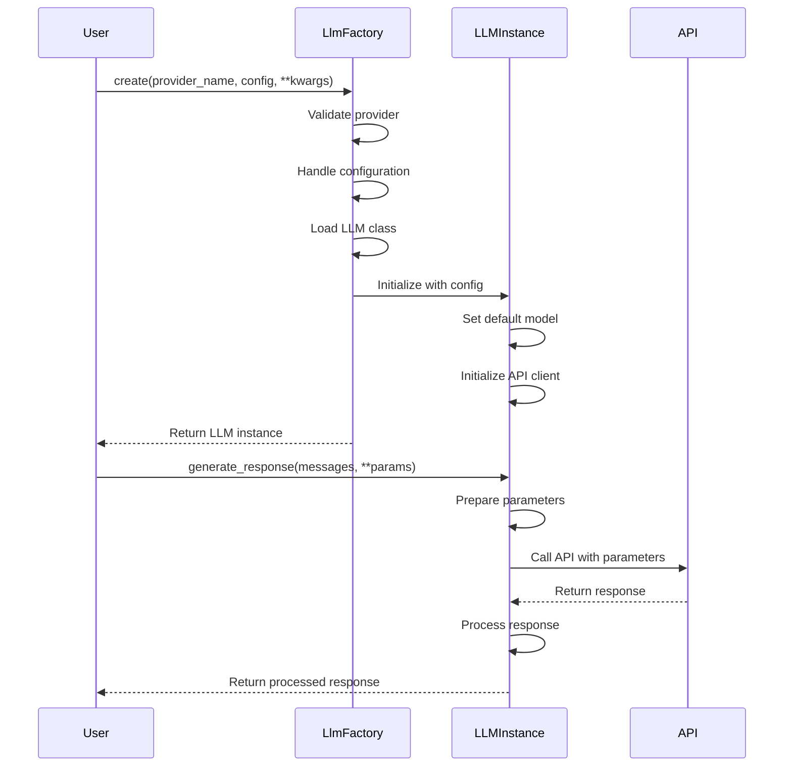

# LlmFactory

<cite>
**Referenced Files in This Document**   
- [factory.py](file://mem0/utils/factory.py#L23-L129)
- [base.py](file://mem0/configs/llms/base.py#L7-L63)
- [openai.py](file://mem0/configs/llms/openai.py#L6-L80)
- [anthropic.py](file://mem0/configs/llms/anthropic.py#L6-L57)
- [ollama.py](file://mem0/configs/llms/ollama.py#L6-L57)
- [azure.py](file://mem0/configs/llms/azure.py#L7-L58)
- [openai.py](file://mem0/llms/openai.py#L14-L148)
- [anthropic.py](file://mem0/llms/anthropic.py#L14-L88)
- [ollama.py](file://mem0/llms/ollama.py#L13-L115)
</cite>

## Table of Contents
1. [Introduction](#introduction)
2. [Core Components](#core-components)
3. [Architecture Overview](#architecture-overview)
4. [Detailed Component Analysis](#detailed-component-analysis)
5. [Dependency Analysis](#dependency-analysis)
6. [Performance Considerations](#performance-considerations)

## Introduction
The LlmFactory class provides a comprehensive factory pattern implementation for creating and managing LLM (Large Language Model) provider instances. It supports multiple LLM providers with their specific configuration requirements, enabling flexible instantiation through various configuration methods. The factory handles configuration normalization, provider registration, and instance creation with proper error handling for unsupported providers.

## Core Components
The LlmFactory class is the central component for LLM provider management, offering methods to create instances, register new providers, and discover available options. It works in conjunction with provider-specific configuration classes that extend the BaseLlmConfig to handle both common and provider-specific parameters.

**Section sources**
- [factory.py](file://mem0/utils/factory.py#L23-L129)

## Architecture Overview


**Diagram sources**
- [factory.py](file://mem0/utils/factory.py#L23-L129)
- [base.py](file://mem0/configs/llms/base.py#L7-L63)
- [openai.py](file://mem0/configs/llms/openai.py#L6-L80)
- [anthropic.py](file://mem0/configs/llms/anthropic.py#L6-L57)
- [ollama.py](file://mem0/configs/llms/ollama.py#L6-L57)
- [azure.py](file://mem0/configs/llms/azure.py#L7-L58)

## Detailed Component Analysis

### LlmFactory Class Analysis
The LlmFactory class implements a factory pattern for creating LLM instances with proper configuration handling. It supports multiple configuration types and provides methods for extensibility.

#### create() Method
The create() method handles LLM instance creation with flexible configuration options:



**Diagram sources**
- [factory.py](file://mem0/utils/factory.py#L51-L105)

**Section sources**
- [factory.py](file://mem0/utils/factory.py#L51-L105)

#### provider_to_class Mapping
The provider_to_class dictionary maps provider names to their corresponding implementation classes and configuration types:

```mermaid
erDiagram
PROVIDER_TO_CLASS {
string provider_name PK
string class_path
string config_class_name
}
PROVIDER_TO_CLASS ||--o{ LLM_PROVIDER : "maps to"
LLM_PROVIDER {
string name PK
string description
}
PROVIDER_TO_CLASS {
"ollama" | "mem0.llms.ollama.OllamaLLM" | "OllamaConfig"
"openai" | "mem0.llms.openai.OpenAILLM" | "OpenAIConfig"
"anthropic" | "mem0.llms.anthropic.AnthropicLLM" | "AnthropicConfig"
"azure_openai" | "mem0.llms.azure_openai.AzureOpenAILLM" | "AzureOpenAIConfig"
"groq" | "mem0.llms.groq.GroqLLM" | "BaseLlmConfig"
"together" | "mem0.llms.together.TogetherLLM" | "BaseLlmConfig"
"aws_bedrock" | "mem0.llms.aws_bedrock.AWSBedrockLLM" | "BaseLlmConfig"
"litellm" | "mem0.llms.litellm.LiteLLM" | "BaseLlmConfig"
"openai_structured" | "mem0.llms.openai_structured.OpenAIStructuredLLM" | "OpenAIConfig"
"azure_openai_structured" | "mem0.llms.azure_openai_structured.AzureOpenAIStructuredLLM" | "AzureOpenAIConfig"
"gemini" | "mem0.llms.gemini.GeminiLLM" | "BaseLlmConfig"
"deepseek" | "mem0.llms.deepseek.DeepSeekLLM" | "DeepSeekConfig"
"xai" | "mem0.llms.xai.XAILLM" | "BaseLlmConfig"
"sarvam" | "mem0.llms.sarvam.SarvamLLM" | "BaseLlmConfig"
"lmstudio" | "mem0.llms.lmstudio.LMStudioLLM" | "LMStudioConfig"
"vllm" | "mem0.llms.vllm.VllmLLM" | "VllmConfig"
"langchain" | "mem0.llms.langchain.LangchainLLM" | "BaseLlmConfig"
}
```

**Diagram sources**
- [factory.py](file://mem0/utils/factory.py#L30-L48)

**Section sources**
- [factory.py](file://mem0/utils/factory.py#L30-L48)

#### Configuration Handling
The factory supports three configuration types with appropriate conversion logic:



**Diagram sources**
- [factory.py](file://mem0/utils/factory.py#L73-L102)

**Section sources**
- [factory.py](file://mem0/utils/factory.py#L73-L102)

### Configuration Classes Analysis
The configuration system uses a hierarchy of classes to handle both common and provider-specific parameters.

#### Base Configuration


**Diagram sources**
- [base.py](file://mem0/configs/llms/base.py#L7-L63)

**Section sources**
- [base.py](file://mem0/configs/llms/base.py#L7-L63)

#### Provider-Specific Configuration Examples


**Diagram sources**
- [openai.py](file://mem0/configs/llms/openai.py#L6-L80)
- [anthropic.py](file://mem0/configs/llms/anthropic.py#L6-L57)
- [ollama.py](file://mem0/configs/llms/ollama.py#L6-L57)
- [azure.py](file://mem0/configs/llms/azure.py#L7-L58)

**Section sources**
- [openai.py](file://mem0/configs/llms/openai.py#L6-L80)
- [anthropic.py](file://mem0/configs/llms/anthropic.py#L6-L57)
- [ollama.py](file://mem0/configs/llms/ollama.py#L6-L57)
- [azure.py](file://mem0/configs/llms/azure.py#L7-L58)

### Implementation Examples
The LLM implementations follow a consistent pattern across providers:



**Diagram sources**
- [openai.py](file://mem0/llms/openai.py#L14-L148)
- [anthropic.py](file://mem0/llms/anthropic.py#L14-L88)
- [ollama.py](file://mem0/llms/ollama.py#L13-L115)

**Section sources**
- [openai.py](file://mem0/llms/openai.py#L14-L148)
- [anthropic.py](file://mem0/llms/anthropic.py#L14-L88)
- [ollama.py](file://mem0/llms/ollama.py#L13-L115)

## Dependency Analysis
```mermaid
graph TD
LlmFactory --> load_class : "uses"
LlmFactory --> BaseLlmConfig : "depends on"
LlmFactory --> OpenAIConfig : "depends on"
LlmFactory --> AnthropicConfig : "depends on"
LlmFactory --> OllamaConfig : "depends on"
LlmFactory --> AzureOpenAIConfig : "depends on"
LlmFactory --> DeepSeekConfig : "depends on"
LlmFactory --> LMStudioConfig : "depends on"
LlmFactory --> VllmConfig : "depends on"
BaseLlmConfig --> httpx : "uses"
OpenAIConfig --> OpenAI : "uses"
AnthropicConfig --> anthropic : "uses"
OllamaConfig --> ollama : "uses"
AzureOpenAIConfig --> AzureConfig : "uses"
LlmFactory --> LLMBase : "creates"
OpenAILLM --> OpenAI : "uses"
AnthropicLLM --> anthropic : "uses"
OllamaLLM --> ollama : "uses"
```

**Diagram sources**
- [factory.py](file://mem0/utils/factory.py#L23-L129)
- [base.py](file://mem0/configs/llms/base.py#L7-L63)
- [openai.py](file://mem0/configs/llms/openai.py#L6-L80)
- [anthropic.py](file://mem0/configs/llms/anthropic.py#L6-L57)
- [ollama.py](file://mem0/configs/llms/ollama.py#L6-L57)
- [azure.py](file://mem0/configs/llms/azure.py#L7-L58)
- [openai.py](file://mem0/llms/openai.py#L14-L148)
- [anthropic.py](file://mem0/llms/anthropic.py#L14-L88)
- [ollama.py](file://mem0/llms/ollama.py#L13-L115)

**Section sources**
- [factory.py](file://mem0/utils/factory.py#L23-L129)

## Performance Considerations
The LlmFactory implementation includes several performance considerations:

1. **Instance Reuse**: LLM instances should be reused rather than created repeatedly, as initialization involves API client setup and configuration processing.

2. **Configuration Caching**: For applications with frequent LLM creation, consider caching commonly used configurations to avoid repeated dictionary merging and object creation.

3. **Lazy Initialization**: The factory could be extended with lazy initialization patterns to defer expensive operations until the first method call.

4. **Connection Pooling**: The underlying API clients (OpenAI, Anthropic, etc.) typically handle connection pooling internally, but this should be verified for each provider.

5. **Error Handling**: The factory provides clear error messages for unsupported providers, helping to prevent repeated failed instantiation attempts.

6. **Thread Safety**: The current implementation appears to be thread-safe as it doesn't maintain mutable shared state across method calls.

**Section sources**
- [factory.py](file://mem0/utils/factory.py#L23-L129)