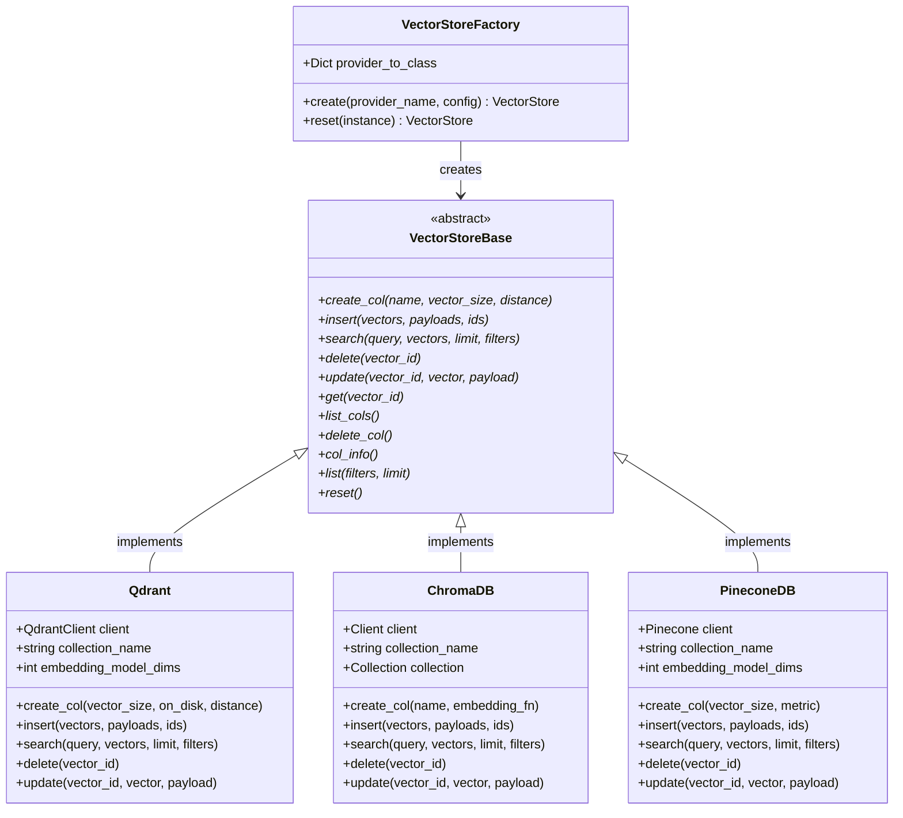
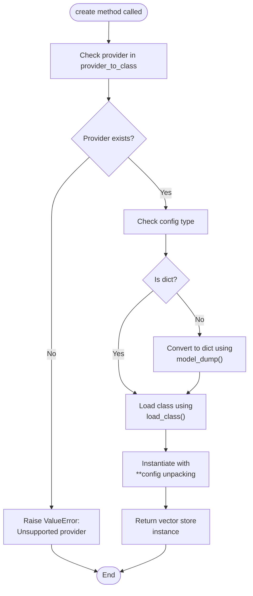
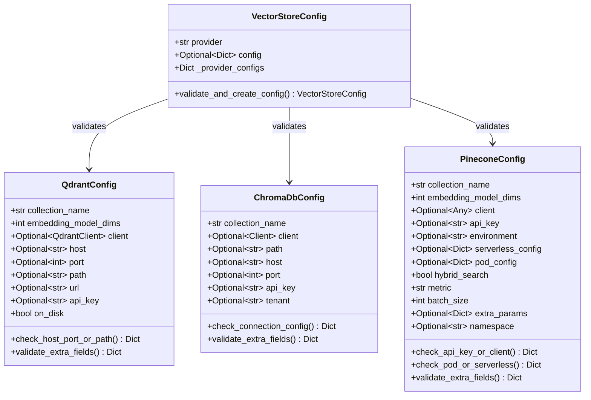

# VectorStoreFactory API Documentation

<cite>
**Referenced Files in This Document**
- [factory.py](file://mem0/utils/factory.py)
- [base.py](file://mem0/vector_stores/base.py)
- [configs.py](file://mem0/vector_stores/configs.py)
- [qdrant.py](file://mem0/vector_stores/qdrant.py)
- [chroma.py](file://mem0/vector_stores/chroma.py)
- [pinecone.py](file://mem0/vector_stores/pinecone.py)
- [qdrant.py](file://mem0/configs/vector_stores/qdrant.py)
- [chroma.py](file://mem0/configs/vector_stores/chroma.py)
- [pinecone.py](file://mem0/configs/vector_stores/pinecone.py)
</cite>

## Table of Contents
1. [Introduction](#introduction)
2. [Class Overview](#class-overview)
3. [Core Methods](#core-methods)
4. [Provider Mapping](#provider-mapping)
5. [Configuration Management](#configuration-management)
6. [Usage Examples](#usage-examples)
7. [Error Handling](#error-handling)
8. [Performance Considerations](#performance-considerations)
9. [Integration Patterns](#integration-patterns)
10. [Troubleshooting Guide](#troubleshooting-guide)

## Introduction

The VectorStoreFactory class serves as a centralized factory pattern implementation for managing vector database provider instantiation in the Mem0 ecosystem. It provides a unified interface for creating and configuring various vector store implementations while handling dynamic class loading, configuration validation, and connection management.

This factory enables seamless switching between different vector database providers (Qdrant, Chroma, Pinecone, Weaviate, etc.) through a consistent API, abstracting away the complexities of individual provider configurations and initialization processes.

## Class Overview

The VectorStoreFactory implements a singleton-like pattern with class methods for creating vector store instances and managing their lifecycle. It maintains a comprehensive mapping of supported providers to their respective implementation classes and handles automatic configuration conversion for Pydantic models.



**Diagram sources**
- [factory.py](file://mem0/utils/factory.py#L159-L200)
- [base.py](file://mem0/vector_stores/base.py#L4-L59)
- [qdrant.py](file://mem0/vector_stores/qdrant.py#L22-L271)
- [chroma.py](file://mem0/vector_stores/chroma.py#L23-L268)
- [pinecone.py](file://mem0/vector_stores/pinecone.py#L25-L383)

**Section sources**
- [factory.py](file://mem0/utils/factory.py#L159-L200)

## Core Methods

### create() Method

The primary factory method for instantiating vector store providers with automatic configuration handling.

#### Method Signature
```python
@classmethod
def create(cls, provider_name: str, config: Union[Dict, BaseModel]) -> VectorStore
```

#### Parameters

| Parameter | Type | Description | Required |
|-----------|------|-------------|----------|
| `provider_name` | `str` | Name of the vector store provider (e.g., "qdrant", "chroma", "pinecone") | Yes |
| `config` | `Union[Dict, BaseModel]` | Configuration object or dictionary for the vector store | Yes |

#### Configuration Processing

The factory method implements intelligent configuration handling:

1. **Pydantic Model Detection**: Automatically detects if `config` is a Pydantic model and converts it using `model_dump()`
2. **Dynamic Class Loading**: Uses the `load_class()` utility to dynamically import and instantiate the appropriate vector store class
3. **Parameter Validation**: Validates provider existence in the `provider_to_class` mapping
4. **Instance Creation**: Creates the vector store instance with processed configuration

#### Return Value
Returns an instantiated vector store object implementing the `VectorStoreBase` interface.

#### Implementation Flow



**Diagram sources**
- [factory.py](file://mem0/utils/factory.py#L185-L194)

**Section sources**
- [factory.py](file://mem0/utils/factory.py#L185-L194)

### reset() Method

Provides functionality to clear vector store contents and reset the collection state.

#### Method Signature
```python
@classmethod
def reset(cls, instance: VectorStore) -> VectorStore
```

#### Parameters

| Parameter | Type | Description | Required |
|-----------|------|-------------|----------|
| `instance` | `VectorStore` | Vector store instance to reset | Yes |

#### Behavior

The reset method delegates to the underlying vector store's `reset()` implementation, which typically:
- Deletes the existing collection
- Recreates the collection with original configuration
- Preserves connection settings and metadata

#### Usage Pattern

```python
# Reset a vector store instance
vector_store = VectorStoreFactory.create("qdrant", qdrant_config)
VectorStoreFactory.reset(vector_store)
```

**Section sources**
- [factory.py](file://mem0/utils/factory.py#L196-L199)

## Provider Mapping

The VectorStoreFactory maintains an extensive mapping of supported vector store providers to their implementation classes. This mapping enables dynamic instantiation based on provider names.

### Complete Provider List

| Provider Name | Implementation Class | Description |
|---------------|---------------------|-------------|
| `qdrant` | `mem0.vector_stores.qdrant.Qdrant` | Qdrant vector database with local and cloud support |
| `chroma` | `mem0.vector_stores.chroma.ChromaDB` | ChromaDB with local, server, and cloud configurations |
| `pgvector` | `mem0.vector_stores.pgvector.PGVector` | PostgreSQL with pgvector extension |
| `milvus` | `mem0.vector_stores.milvus.MilvusDB` | Milvus vector database |
| `upstash_vector` | `mem0.vector_stores.upstash_vector.UpstashVector` | Upstash vector database |
| `azure_ai_search` | `mem0.vector_stores.azure_ai_search.AzureAISearch` | Azure AI Search |
| `azure_mysql` | `mem0.vector_stores.azure_mysql.AzureMySQL` | Azure MySQL with vector support |
| `pinecone` | `mem0.vector_stores.pinecone.PineconeDB` | Pinecone vector database |
| `mongodb` | `mem0.vector_stores.mongodb.MongoDB` | MongoDB with vector search |
| `redis` | `mem0.vector_stores.redis.RedisDB` | Redis with RedisAI |
| `valkey` | `mem0.vector_stores.valkey.ValkeyDB` | Valkey vector database |
| `databricks` | `mem0.vector_stores.databricks.Databricks` | Databricks vector search |
| `elasticsearch` | `mem0.vector_stores.elasticsearch.ElasticsearchDB` | Elasticsearch with vector support |
| `vertex_ai_vector_search` | `mem0.vector_stores.vertex_ai_vector_search.GoogleMatchingEngine` | Google Vertex AI Matching Engine |
| `opensearch` | `mem0.vector_stores.opensearch.OpenSearchDB` | OpenSearch with vector support |
| `supabase` | `mem0.vector_stores.supabase.Supabase` | Supabase vector search |
| `weaviate` | `mem0.vector_stores.weaviate.Weaviate` | Weaviate vector database |
| `faiss` | `mem0.vector_stores.faiss.FAISS` | FAISS local vector search |
| `langchain` | `mem0.vector_stores.langchain.Langchain` | Langchain vector store adapter |
| `s3_vectors` | `mem0.vector_stores.s3_vectors.S3Vectors` | S3-based vector storage |
| `baidu` | `mem0.vector_stores.baidu.BaiduDB` | Baidu vector database |
| `neptune` | `mem0.vector_stores.neptune_analytics.NeptuneAnalyticsVector` | AWS Neptune Analytics |

### Provider Selection Criteria

When choosing a vector store provider, consider:

- **Deployment Environment**: Local vs. cloud vs. managed service
- **Performance Requirements**: Latency, throughput, scalability
- **Feature Set**: Advanced filtering, hybrid search, metadata support
- **Cost Model**: Free tier limits, pay-per-use pricing
- **Integration Complexity**: Dependencies, setup requirements

**Section sources**
- [factory.py](file://mem0/utils/factory.py#L160-L182)

## Configuration Management

### VectorStoreConfig Model

The factory integrates with a comprehensive configuration system that validates and manages provider-specific settings.



**Diagram sources**
- [configs.py](file://mem0/vector_stores/configs.py#L6-L65)
- [qdrant.py](file://mem0/configs/vector_stores/qdrant.py#L6-L48)
- [chroma.py](file://mem0/configs/vector_stores/chroma.py#L6-L59)
- [pinecone.py](file://mem0/configs/vector_stores/pinecone.py#L7-L56)

### Configuration Validation

The factory implements robust configuration validation:

1. **Provider Validation**: Ensures the requested provider is supported
2. **Type Checking**: Validates configuration object types
3. **Field Validation**: Checks required fields and constraints
4. **Connection Validation**: Verifies connectivity parameters

### Dynamic Configuration Conversion

The factory automatically handles configuration conversion:

- **Pydantic Models**: Converts Pydantic models to dictionaries using `model_dump()`
- **Dictionary Objects**: Passes dictionaries directly to the constructor
- **Mixed Types**: Handles combinations of validated and raw configurations

**Section sources**
- [configs.py](file://mem0/vector_stores/configs.py#L6-L65)

## Usage Examples

### Creating Qdrant Vector Store

```python
from mem0.utils.factory import VectorStoreFactory
from mem0.configs.vector_stores.qdrant import QdrantConfig

# Local Qdrant configuration
qdrant_config = QdrantConfig(
    collection_name="memories",
    embedding_model_dims=1536,
    path="/tmp/qdrant"
)

vector_store = VectorStoreFactory.create("qdrant", qdrant_config)

# Cloud Qdrant configuration
cloud_config = QdrantConfig(
    collection_name="memories",
    embedding_model_dims=1536,
    url="https://your-qdrant-endpoint.com",
    api_key="your-api-key"
)

vector_store = VectorStoreFactory.create("qdrant", cloud_config)
```

### Creating ChromaDB Vector Store

```python
from mem0.utils.factory import VectorStoreFactory
from mem0.configs.vector_stores.chroma import ChromaDbConfig

# Local ChromaDB configuration
chroma_config = ChromaDbConfig(
    collection_name="memories",
    path="./chroma_db"
)

vector_store = VectorStoreFactory.create("chroma", chroma_config)

# Cloud ChromaDB configuration
cloud_config = ChromaDbConfig(
    collection_name="memories",
    api_key="your-chromadb-cloud-api-key",
    tenant="your-tenant-id"
)

vector_store = VectorStoreFactory.create("chroma", cloud_config)
```

### Creating Pinecone Vector Store

```python
from mem0.utils.factory import VectorStoreFactory
from mem0.configs.vector_stores.pinecone import PineconeConfig

# Serverless Pinecone configuration
pinecone_config = PineconeConfig(
    collection_name="memories",
    embedding_model_dims=1536,
    serverless_config={
        "cloud": "aws",
        "region": "us-west-2"
    },
    hybrid_search=True,
    metric="cosine"
)

vector_store = VectorStoreFactory.create("pinecone", pinecone_config)

# Pod-based Pinecone configuration
pod_config = PineconeConfig(
    collection_name="memories",
    embedding_model_dims=1536,
    pod_config={
        "environment": "us-west4-gcp",
        "pod_type": "p1.x1"
    }
)

vector_store = VectorStoreFactory.create("pinecone", pod_config)
```

### Dictionary-Based Configuration

```python
# Using dictionary configuration
qdrant_dict_config = {
    "collection_name": "memories",
    "embedding_model_dims": 1536,
    "path": "/tmp/qdrant"
}

vector_store = VectorStoreFactory.create("qdrant", qdrant_dict_config)
```

### Resetting Vector Store

```python
# Reset vector store contents
vector_store = VectorStoreFactory.create("qdrant", qdrant_config)
VectorStoreFactory.reset(vector_store)

# Continue using the reset instance
vector_store.insert(vectors, payloads, ids)
```

**Section sources**
- [qdrant.py](file://mem0/configs/vector_stores/qdrant.py#L6-L48)
- [chroma.py](file://mem0/configs/vector_stores/chroma.py#L6-L59)
- [pinecone.py](file://mem0/configs/vector_stores/pinecone.py#L7-L56)

## Error Handling

### Unsupported Provider Error

The factory raises a `ValueError` when attempting to create an instance with an unsupported provider:

```python
try:
    vector_store = VectorStoreFactory.create("unsupported_provider", config)
except ValueError as e:
    print(f"Error: {e}")  # "Unsupported VectorStore provider: unsupported_provider"
```

### Configuration Validation Errors

Configuration validation occurs during the factory's `create()` method:

- **Missing Required Fields**: Raises validation errors for missing mandatory configuration fields
- **Invalid Types**: Rejects incompatible configuration types
- **Connection Issues**: Validates connection parameters and credentials

### Connection Management

The factory handles various connection scenarios:

- **Local Connections**: Manages local file paths and embedded databases
- **Remote Connections**: Handles network connections with authentication
- **Cloud Services**: Manages API keys and service endpoints
- **Fallback Mechanisms**: Provides graceful degradation for unavailable providers

### Error Recovery Patterns

```python
def create_vector_store_with_fallback(provider_name, config):
    try:
        return VectorStoreFactory.create(provider_name, config)
    except ValueError as e:
        if "Unsupported" in str(e):
            # Try fallback provider
            fallback_config = get_fallback_config(provider_name)
            return VectorStoreFactory.create("qdrant", fallback_config)
        else:
            raise
```

**Section sources**
- [factory.py](file://mem0/utils/factory.py#L193-L194)

## Performance Considerations

### Initialization Performance

Vector store initialization involves several performance-critical operations:

1. **Class Loading**: Dynamic import of provider classes
2. **Connection Establishment**: Network and authentication overhead
3. **Schema Creation**: Collection/index creation and indexing
4. **Validation**: Configuration and parameter validation

### Connection Pooling

For high-throughput applications, consider:

- **Connection Reuse**: Maintain persistent connections where supported
- **Batch Operations**: Group multiple operations into batches
- **Async Operations**: Use asynchronous APIs when available
- **Caching**: Cache frequently accessed vector store instances

### Memory Management

- **Local Stores**: Monitor disk space for local vector databases
- **Cloud Stores**: Consider data transfer costs and bandwidth limitations
- **Index Size**: Optimize index sizes for query performance
- **Garbage Collection**: Implement cleanup for temporary collections

### Scaling Considerations

- **Horizontal Scaling**: Choose providers that support horizontal scaling
- **Sharding**: Implement sharding strategies for large datasets
- **Replication**: Consider replication for high availability
- **Monitoring**: Implement performance monitoring and alerting

### Best Practices for Production

1. **Connection Management**: Use connection pooling and keep-alive
2. **Error Handling**: Implement comprehensive retry mechanisms
3. **Resource Cleanup**: Properly close connections and clean up resources
4. **Monitoring**: Track performance metrics and error rates
5. **Backup Strategies**: Implement data backup and recovery procedures

## Integration Patterns

### Factory Pattern Integration

The VectorStoreFactory follows the Factory design pattern, enabling:

- **Decoupling**: Application code doesn't depend on specific vector store implementations
- **Extensibility**: Easy addition of new vector store providers
- **Configuration Management**: Centralized configuration handling
- **Lifecycle Management**: Consistent initialization and cleanup

### Dependency Injection

```python
class MemoryManager:
    def __init__(self, vector_store_config):
        self.vector_store = VectorStoreFactory.create(
            vector_store_config.provider, 
            vector_store_config.config
        )
    
    def add_memory(self, vectors, payloads):
        self.vector_store.insert(vectors, payloads)
```

### Configuration-Driven Architecture

```python
def create_vector_store_from_env():
    provider = os.getenv("VECTOR_STORE_PROVIDER", "qdrant")
    
    if provider == "qdrant":
        config = QdrantConfig(
            collection_name=os.getenv("QDRANT_COLLECTION", "memories"),
            path=os.getenv("QDRANT_PATH", "/tmp/qdrant")
        )
    elif provider == "chroma":
        config = ChromaDbConfig(
            collection_name=os.getenv("CHROMA_COLLECTION", "memories"),
            path=os.getenv("CHROMA_PATH")
        )
    
    return VectorStoreFactory.create(provider, config)
```

### Multi-Provider Strategy

```python
class MultiProviderVectorStore:
    def __init__(self):
        self.providers = {}
        self.current_provider = None
    
    def add_provider(self, name, config):
        self.providers[name] = VectorStoreFactory.create(name, config)
    
    def select_provider(self, name):
        if name in self.providers:
            self.current_provider = name
        else:
            raise ValueError(f"Provider {name} not configured")
    
    def insert(self, vectors, payloads):
        if self.current_provider:
            return self.providers[self.current_provider].insert(vectors, payloads)
        raise ValueError("No provider selected")
```

## Troubleshooting Guide

### Common Issues and Solutions

#### Issue: "Unsupported VectorStore provider"

**Cause**: Attempting to use a provider not in the factory's mapping.

**Solution**: 
- Verify the provider name spelling
- Check if the provider is supported (see provider mapping)
- Ensure the provider module is installed

```python
# Check supported providers
from mem0.utils.factory import VectorStoreFactory
print(VectorStoreFactory.provider_to_class.keys())
```

#### Issue: Configuration Validation Errors

**Cause**: Missing or invalid configuration parameters.

**Solution**:
- Review provider-specific configuration requirements
- Validate all required fields are present
- Check data types and constraints

```python
# Validate configuration manually
from mem0.configs.vector_stores.qdrant import QdrantConfig

try:
    config = QdrantConfig(
        collection_name="test",
        embedding_model_dims=1536,
        path="/tmp/test"
    )
    print("Configuration valid")
except Exception as e:
    print(f"Configuration error: {e}")
```

#### Issue: Connection Failures

**Cause**: Network issues, authentication problems, or service unavailability.

**Solution**:
- Verify network connectivity
- Check API keys and credentials
- Validate endpoint URLs
- Review firewall and security group settings

#### Issue: Performance Problems

**Cause**: Suboptimal configuration or resource constraints.

**Solution**:
- Optimize batch sizes and connection parameters
- Monitor resource usage (CPU, memory, disk)
- Consider scaling options
- Review indexing strategies

### Debugging Techniques

#### Enable Logging

```python
import logging
logging.basicConfig(level=logging.DEBUG)
logger = logging.getLogger("mem0.utils.factory")

# Factory will now show detailed debug information
vector_store = VectorStoreFactory.create("qdrant", config)
```

#### Configuration Inspection

```python
# Inspect factory configuration
from mem0.utils.factory import VectorStoreFactory

# Print all supported providers
print("Supported providers:", list(VectorStoreFactory.provider_to_class.keys()))

# Check specific provider mapping
provider = "qdrant"
class_path = VectorStoreFactory.provider_to_class.get(provider)
print(f"{provider} -> {class_path}")
```

#### Connection Testing

```python
def test_vector_store_connection(provider, config):
    try:
        vector_store = VectorStoreFactory.create(provider, config)
        # Test basic operations
        vector_store.list(limit=1)
        print(f"✓ {provider} connection successful")
        return True
    except Exception as e:
        print(f"✗ {provider} connection failed: {e}")
        return False
```

### Performance Monitoring

#### Resource Usage Tracking

```python
import time
import psutil

def monitor_vector_store_performance():
    start_time = time.time()
    start_memory = psutil.Process().memory_info().rss
    
    # Perform vector store operations
    vector_store.search(query_vector, limit=10)
    
    end_time = time.time()
    end_memory = psutil.Process().memory_info().rss
    
    print(f"Operation time: {end_time - start_time:.2f}s")
    print(f"Memory delta: {(end_memory - start_memory) / 1024 / 1024:.2f}MB")
```

**Section sources**
- [factory.py](file://mem0/utils/factory.py#L17-L21)