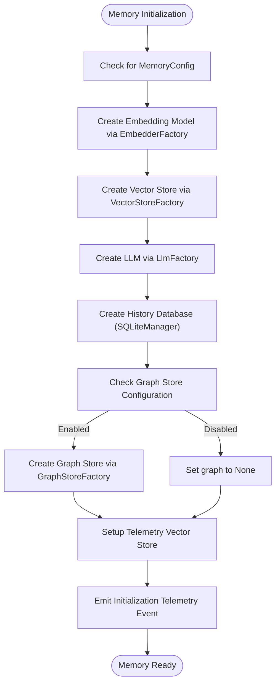
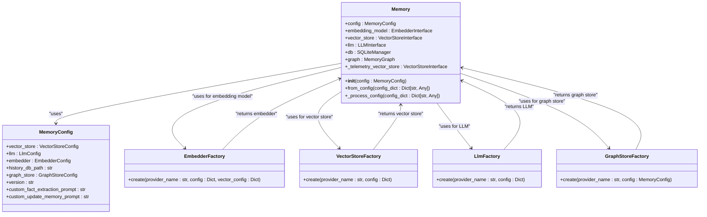
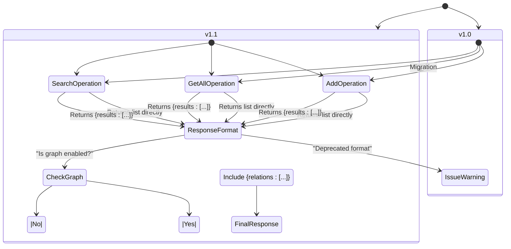
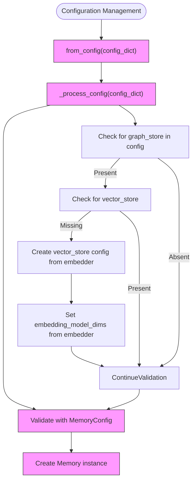
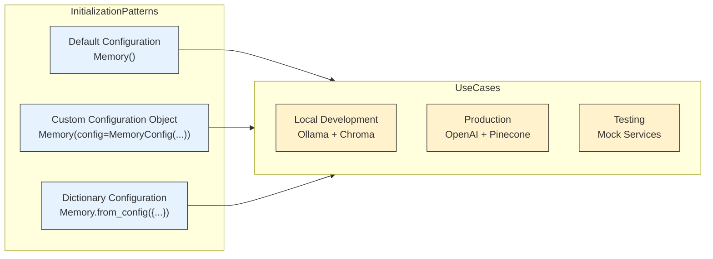

# Initialization and Configuration

<cite>
**Referenced Files in This Document**   
- [main.py](file://mem0/memory/main.py)
- [base.py](file://mem0/configs/base.py)
- [factory.py](file://mem0/utils/factory.py)
- [enums.py](file://mem0/configs/enums.py)
</cite>

## Table of Contents
1. [Introduction](#introduction)
2. [Memory Class Initialization](#memory-class-initialization)
3. [Configuration-Driven Component Orchestration](#configuration-driven-component-orchestration)
4. [API Versioning and Response Formats](#api-versioning-and-response-formats)
5. [Configuration Management](#configuration-management)
6. [Practical Examples](#practical-examples)
7. [Common Configuration Issues](#common-configuration-issues)
8. [Best Practices](#best-practices)

## Introduction
The Memory class serves as the core component for managing long-term memory in AI applications, providing a comprehensive system for storing, retrieving, and updating memories through a configuration-driven architecture. This documentation details the initialization process of the Memory class via its `__init__()` and `from_config()` methods, explaining how the MemoryConfig object orchestrates the creation of core components including embedding models, vector stores, LLMs, and history databases. The system supports flexible configuration through both object-based and dictionary-based approaches, enabling seamless integration with various providers and services while maintaining backward compatibility through the `_process_config()` helper method.

**Section sources**
- [main.py](file://mem0/memory/main.py#L130-L198)

## Memory Class Initialization
The Memory class initialization process begins with the `__init__()` method, which accepts an optional MemoryConfig object as a parameter. When no configuration is provided, the class uses a default MemoryConfig instance, establishing a complete memory management system with sensible defaults. The initialization process systematically creates and configures all core components through factory patterns, ensuring proper dependency injection and component orchestration.

The initialization sequence follows a specific order: first creating the embedding model through EmbedderFactory, then initializing the vector store via VectorStoreFactory, followed by the LLM instance through LlmFactory, and finally setting up the SQLiteManager for history tracking. This sequential creation ensures that each component is properly configured before being used by subsequent components. The process also handles the optional graph store initialization when enabled in the configuration, and sets up telemetry tracking for monitoring and analytics.

**Diagram sources**
- [main.py](file://mem0/memory/main.py#L130-L168)

**Section sources**
- [main.py](file://mem0/memory/main.py#L130-L168)

## Configuration-Driven Component Orchestration
The MemoryConfig object serves as the central configuration mechanism for the memory system, orchestrating the creation and configuration of all core components. The configuration-driven approach enables dependency injection by specifying provider types and configuration parameters for each component, allowing for flexible integration with various services and providers.

The embedding model is created through the EmbedderFactory, which uses the provider specified in the config.embedder.provider field and applies the configuration from config.embedder.config. Similarly, the vector store is instantiated via VectorStoreFactory using the provider from config.vector_store.provider and configuration from config.vector_store.config. The LLM component is created through LlmFactory with the provider from config.llm.provider and configuration from config.llm.config. The history database is set up using SQLiteManager with the path specified in config.history_db_path.

The system also supports optional graph store initialization when the config.graph_store.config is provided, creating a MemoryGraph instance through GraphStoreFactory. This graph store enables relationship tracking between memories, enhancing the system's ability to understand context and connections between stored information. Telemetry setup is automatically configured using the vector store configuration with a special collection name "mem0migrations", ensuring that initialization events are properly tracked and recorded.

**Diagram sources**
- [main.py](file://mem0/memory/main.py#L130-L168)
- [base.py](file://mem0/configs/base.py#L29-L62)
- [factory.py](file://mem0/utils/factory.py#L131-L223)

**Section sources**
- [main.py](file://mem0/memory/main.py#L130-L168)
- [base.py](file://mem0/configs/base.py#L29-L62)
- [factory.py](file://mem0/utils/factory.py#L131-L223)

## API Versioning and Response Formats
The memory system implements an API versioning system through the config.version field in the MemoryConfig object, with current support for "v1.0" and "v1.1" versions. This versioning system directly impacts the response formats returned by the memory operations, ensuring backward compatibility while enabling the introduction of new features and improvements.

In API version "v1.0", the response format for operations like add, get_all, and search returns a direct list of memory items without wrapping them in a results key. This format is deprecated and will be removed in future versions. In contrast, API version "v1.1" introduces a standardized response format that wraps the memory results in a "results" key, providing a consistent structure across all operations. When the graph store is enabled, version "v1.1" also includes a "relations" key in the response, containing information about relationships between memories.

The system issues deprecation warnings when using version "v1.0", encouraging users to migrate to the newer "v1.1" format. These warnings are triggered in the add, get_all, and search methods when the API version is set to "v1.0". The version is stored in the Memory instance as self.api_version during initialization and is used to determine the appropriate response format for all operations.

**Diagram sources**
- [main.py](file://mem0/memory/main.py#L147-L148)
- [main.py](file://mem0/memory/main.py#L291-L307)
- [main.py](file://mem0/memory/main.py#L592-L602)

**Section sources**
- [main.py](file://mem0/memory/main.py#L147-L148)
- [main.py](file://mem0/memory/main.py#L291-L307)
- [main.py](file://mem0/memory/main.py#L592-L602)

## Configuration Management
The Memory class provides robust configuration management through both the `__init__()` method and the `from_config()` class method, supporting flexible initialization patterns. The `from_config()` method accepts a dictionary representation of the configuration, making it easy to initialize the memory system from JSON or other serialized formats. This method first processes the configuration through the `_process_config()` helper to ensure backward compatibility and proper structure, then validates it against the MemoryConfig schema before creating the Memory instance.

The `_process_config()` static method serves as a compatibility layer, handling configuration transformations for backward compatibility. It specifically addresses scenarios where the graph_store is configured but the vector_store is not explicitly defined, automatically creating a vector_store configuration based on the embedder settings. This ensures that legacy configurations continue to work while encouraging the use of the full configuration structure.

The system uses Pydantic models for configuration validation, ensuring that all configuration parameters meet the required types and constraints. The MemoryConfig class defines default values for all fields, allowing for partial configurations where only specific components need to be customized. This default configuration approach simplifies setup for common use cases while maintaining the flexibility to override any setting as needed.

**Diagram sources**
- [main.py](file://mem0/memory/main.py#L170-L193)
- [main.py](file://mem0/memory/main.py#L180-L192)

**Section sources**
- [main.py](file://mem0/memory/main.py#L170-L193)
- [main.py](file://mem0/memory/main.py#L180-L192)

## Practical Examples
The Memory class supports multiple initialization patterns, accommodating different use cases and configuration preferences. The simplest approach uses the default configuration, requiring no parameters and automatically setting up a functional memory system with default providers and settings. For more specific requirements, users can create a custom MemoryConfig object with tailored settings for each component.

When initializing with a custom configuration object, users can specify providers and configuration parameters for the embedding model, vector store, LLM, and other components. This approach provides type safety and IDE support, making it easier to discover available configuration options. Alternatively, the `from_config()` class method accepts a dictionary representation of the configuration, enabling initialization from JSON files, environment variables, or API responses.

The configuration system supports environment-specific setups through conditional logic and provider-specific settings. For example, local development environments can use Ollama for both LLM and embeddings with a local Chroma vector store, while production environments might use OpenAI services with Pinecone for vector storage. The flexible configuration structure allows for easy switching between different providers and settings based on the deployment environment.

**Diagram sources**
- [main.py](file://mem0/memory/main.py#L130-L132)
- [main.py](file://mem0/memory/main.py#L170-L178)
- [base.py](file://mem0/configs/base.py#L29-L62)

**Section sources**
- [main.py](file://mem0/memory/main.py#L130-L132)
- [main.py](file://mem0/memory/main.py#L170-L178)
- [base.py](file://mem0/configs/base.py#L29-L62)

## Common Configuration Issues
Several common configuration issues can arise when initializing the Memory class, primarily related to missing required fields, provider-specific settings, and version compatibility. The most frequent issue is missing API keys or authentication credentials for external providers, which results in configuration validation errors. Users must ensure that all required environment variables or configuration parameters are properly set for their chosen providers.

Another common issue involves mismatched embedding dimensions between the embedder and vector store configurations. When using different providers for embeddings and vector storage, the embedding dimension must be consistent across both configurations. The system attempts to handle this automatically when the vector_store configuration is missing but the embedder is configured, but explicit configuration is recommended for reliability.

Version compatibility issues can occur when using deprecated configuration formats or API versions. The system provides deprecation warnings for version "v1.0" of the API, encouraging migration to "v1.1". Users should update their configuration to use the newer version to ensure continued support and access to the latest features. Additionally, circular dependencies between configuration components should be avoided, particularly when custom prompts reference configuration values that depend on those same prompts.

**Section sources**
- [main.py](file://mem0/memory/main.py#L174-L177)
- [main.py](file://mem0/memory/main.py#L180-L192)
- [main.py](file://mem0/memory/main.py#L291-L298)

## Best Practices
To ensure optimal performance and reliability when configuring the Memory class, several best practices should be followed. First, always use explicit configuration for production environments rather than relying on defaults, as this provides better control and visibility into the system's behavior. Store sensitive configuration values like API keys in environment variables rather than hardcoding them in configuration files.

For environment-specific setups, use configuration files or environment variables to manage differences between development, testing, and production environments. This approach allows for consistent code across environments while accommodating different service providers and settings. When using external vector stores or LLM providers, implement proper error handling and fallback mechanisms to maintain system availability during service interruptions.

Regularly update to the latest API version ("v1.1") to benefit from improved response formats and new features. Monitor telemetry data to understand usage patterns and identify potential performance bottlenecks. Finally, document the configuration structure and provider choices within the team to ensure consistency and facilitate onboarding of new developers.

**Section sources**
- [main.py](file://mem0/memory/main.py#L130-L198)
- [base.py](file://mem0/configs/base.py#L29-L62)
- [factory.py](file://mem0/utils/factory.py#L131-L223)