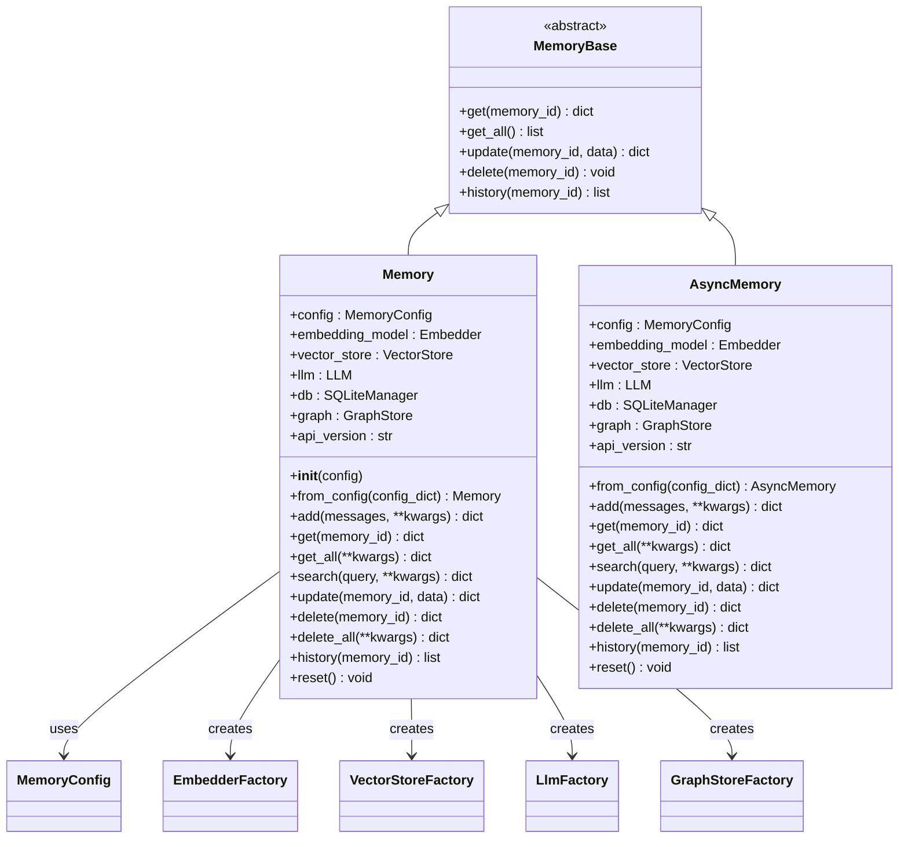
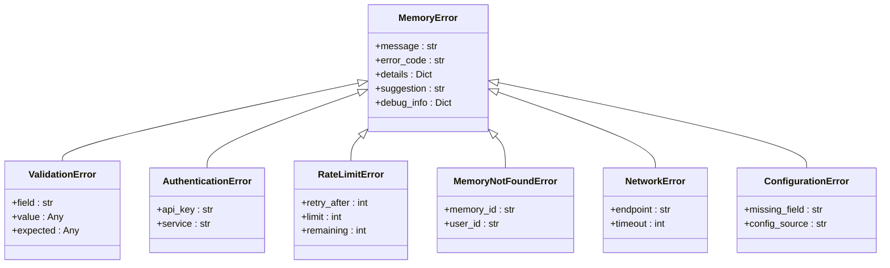

# Memory Class API Documentation

<cite>
**Referenced Files in This Document**
- [mem0/memory/main.py](file://mem0/memory/main.py)
- [mem0/memory/base.py](file://mem0/memory/base.py)
- [mem0/memory/utils.py](file://mem0/memory/utils.py)
- [mem0/memory/storage.py](file://mem0/memory/storage.py)
- [mem0/configs/base.py](file://mem0/configs/base.py)
- [mem0/utils/factory.py](file://mem0/utils/factory.py)
- [mem0/__init__.py](file://mem0/__init__.py)
- [mem0/exceptions.py](file://mem0/exceptions.py)
- [mem0/configs/enums.py](file://mem0/configs/enums.py)
</cite>

## Table of Contents
1. [Introduction](#introduction)
2. [Class Overview](#class-overview)
3. [Initialization Methods](#initialization-methods)
4. [Core Memory Operations](#core-memory-operations)
5. [Advanced Features](#advanced-features)
6. [API Versioning and Compatibility](#api-versioning-and-compatibility)
7. [Error Handling](#error-handling)
8. [Performance and Thread Safety](#performance-and-thread-safety)
9. [Usage Examples](#usage-examples)
10. [Troubleshooting Guide](#troubleshooting-guide)

## Introduction

The Memory class is the primary interface for memory operations in the mem0 framework, providing a comprehensive suite of methods for storing, retrieving, updating, and managing conversational memories. Built on a modular architecture with factory-based component creation, the Memory class supports multiple vector stores, LLM providers, and embedding models while maintaining thread-safe operations for concurrent access.

The class implements the MemoryBase abstract class and offers both synchronous and asynchronous variants (Memory and AsyncMemory) to accommodate different application architectures. It features intelligent memory inference, automatic deduplication, and seamless integration with graph databases for relationship modeling.

## Class Overview

The Memory class serves as the central hub for all memory-related operations, inheriting from MemoryBase and implementing a sophisticated factory pattern for component injection. The class manages four core subsystems: vector storage for semantic memory, LLM integration for intelligent inference, embedding models for semantic understanding, and optional graph stores for relationship modeling.



**Diagram sources**
- [mem0/memory/base.py](file://mem0/memory/base.py#L4-L64)
- [mem0/memory/main.py](file://mem0/memory/main.py#L131-L1911)

**Section sources**
- [mem0/memory/base.py](file://mem0/memory/base.py#L1-L64)
- [mem0/memory/main.py](file://mem0/memory/main.py#L131-L1911)

## Initialization Methods

### Constructor (__init__)

The primary constructor initializes the Memory instance with a configuration object and creates all necessary components through factory patterns.

**Parameters:**
- `config` (MemoryConfig, optional): Configuration object containing provider settings, defaults to MemoryConfig()

**Key Initialization Steps:**
1. **Configuration Injection**: Validates and applies the provided configuration
2. **Component Factory Creation**: Instantiates LLM, embedding model, vector store, and graph store components
3. **Database Setup**: Initializes SQLite history database for change tracking
4. **Telemetry Configuration**: Sets up monitoring infrastructure
5. **Version Detection**: Identifies API version for backward compatibility

**Section sources**
- [mem0/memory/main.py](file://mem0/memory/main.py#L132-L168)

### Class Method: from_config()

Creates a Memory instance from a configuration dictionary, providing a convenient way to initialize with external configuration sources.

**Parameters:**
- `config_dict` (Dict[str, Any]): Dictionary containing configuration parameters

**Returns:** Memory instance with configured components

**Error Handling:**
- Raises ValidationError if configuration validation fails
- Propagates factory creation errors for unsupported providers

**Section sources**
- [mem0/memory/main.py](file://mem0/memory/main.py#L170-L178)

## Core Memory Operations

### add()

Creates new memories from messages with intelligent inference capabilities for fact extraction and memory management.

**Parameters:**
- `messages` (str or List[Dict[str, str]]): Message content or list of message dictionaries
- `user_id` (str, optional): User identifier for session scoping
- `agent_id` (str, optional): Agent identifier for session scoping  
- `run_id` (str, optional): Run identifier for session scoping
- `metadata` (Dict[str, Any], optional): Additional metadata to store
- `infer` (bool, optional): Enable LLM-based fact extraction (default: True)
- `memory_type` (str, optional): Memory type specification
- `prompt` (str, optional): Custom prompt for memory creation

**Returns:**
- `dict`: Operation results containing memory items and relations (if enabled)

**Processing Flow:**
1. **Input Validation**: Validates message format and session identifiers
2. **Message Parsing**: Converts various input formats to standardized messages
3. **Concurrent Processing**: Executes vector store and graph operations in parallel
4. **Fact Extraction**: Uses LLM to extract key facts when inference is enabled
5. **Deduplication**: Compares against existing memories to prevent duplicates
6. **Action Generation**: Creates update/delete/add operations based on comparison
7. **Storage**: Persists memories to vector store and tracks changes in history

**Section sources**
- [mem0/memory/main.py](file://mem0/memory/main.py#L195-L308)

### get()

Retrieves a specific memory by its unique identifier with comprehensive metadata extraction.

**Parameters:**
- `memory_id` (str): Unique identifier of the memory to retrieve

**Returns:**
- `dict`: Memory object with core attributes and metadata

**Retrieved Fields:**
- `id`: Memory identifier
- `memory`: Stored memory content
- `hash`: MD5 hash for deduplication
- `created_at`: ISO timestamp of creation
- `updated_at`: ISO timestamp of last modification
- `user_id`, `agent_id`, `run_id`, `actor_id`, `role`: Session identifiers
- `metadata`: Additional custom metadata

**Section sources**
- [mem0/memory/main.py](file://mem0/memory/main.py#L494-L535)

### get_all()

Lists all memories within specified session scopes with optional filtering and pagination.

**Parameters:**
- `user_id` (str, optional): User identifier for filtering
- `agent_id` (str, optional): Agent identifier for filtering
- `run_id` (str, optional): Run identifier for filtering
- `filters` (Dict[str, Any], optional): Additional custom filters
- `limit` (int, optional): Maximum number of memories to return (default: 100)

**Returns:**
- `dict`: Results container with memories and optional relations

**Filtering Behavior:**
- At least one session identifier (user_id, agent_id, or run_id) is required
- Custom filters are merged with session-based scoping
- Results are sorted by creation time with newest first

**Section sources**
- [mem0/memory/main.py](file://mem0/memory/main.py#L537-L603)

### search()

Performs semantic search across memories using vector similarity with configurable thresholds.

**Parameters:**
- `query` (str): Search query for semantic matching
- `user_id` (str, optional): User identifier for filtering
- `agent_id` (str, optional): Agent identifier for filtering
- `run_id` (str, optional): Run identifier for filtering
- `limit` (int, optional): Maximum results to return (default: 100)
- `filters` (Dict[str, Any], optional): Additional filters
- `threshold` (float, optional): Minimum similarity score threshold

**Returns:**
- `dict`: Search results with scores and metadata

**Similarity Scoring:**
- Uses cosine similarity for vector comparison
- Scores range from 0.0 (no similarity) to 1.0 (identical)
- Threshold filtering removes low-confidence matches

**Section sources**
- [mem0/memory/main.py](file://mem0/memory/main.py#L644-L718)

### update()

Modifies existing memory content with automatic change tracking and embedding updates.

**Parameters:**
- `memory_id` (str): Identifier of memory to update
- `data` (str): New content for the memory

**Returns:**
- `dict`: Success confirmation message

**Update Process:**
1. Generates new embeddings for updated content
2. Updates vector store with new embeddings and metadata
3. Records change history with old/new values
4. Maintains temporal consistency in metadata

**Section sources**
- [mem0/memory/main.py](file://mem0/memory/main.py#L758-L778)

### delete()

Removes a specific memory from storage with comprehensive cleanup.

**Parameters:**
- `memory_id` (str): Identifier of memory to delete

**Returns:**
- `dict`: Success confirmation message

**Cleanup Process:**
- Removes memory from vector store
- Records deletion in history database
- Marks as deleted in change tracking

**Section sources**
- [mem0/memory/main.py](file://mem0/memory/main.py#L780-L789)

### delete_all()

Bulk deletion of memories within specified session scopes.

**Parameters:**
- `user_id` (str, optional): User identifier for filtering
- `agent_id` (str, optional): Agent identifier for filtering
- `run_id` (str, optional): Run identifier for filtering

**Returns:**
- `dict`: Success confirmation message

**Behavior:**
- Requires at least one filter parameter
- Deletes all memories matching filters
- Resets vector store collections
- Clears graph store relationships (if enabled)

**Section sources**
- [mem0/memory/main.py](file://mem0/memory/main.py#L791-L826)

### history()

Retrieves complete change history for a memory with audit trail capabilities.

**Parameters:**
- `memory_id` (str): Identifier of memory to audit

**Returns:**
- `list`: History records ordered chronologically

**History Record Structure:**
- `id`: Change identifier
- `memory_id`: Associated memory
- `old_memory`: Previous content
- `new_memory`: Updated content
- `event`: Type of change (ADD, UPDATE, DELETE)
- `created_at`: When change occurred
- `updated_at`: When record was created
- `is_deleted`: Deletion flag
- `actor_id`: User who made change
- `role`: Role of actor

**Section sources**
- [mem0/memory/main.py](file://mem0/memory/main.py#L828-L839)

## Advanced Features

### Procedural Memory Creation

The Memory class supports specialized procedural memory creation for capturing skills and procedures.

**Usage Pattern:**
```python
memory.add(
    messages,
    agent_id="skill_agent",
    memory_type="procedural_memory",
    prompt="Create procedural memory summarizing the skill demonstrated."
)
```

**Procedural Memory Characteristics:**
- Stored with `memory_type: "procedural_memory"`
- Generated using specialized prompts
- Optimized for skill retention and transfer
- Requires agent_id for proper categorization

**Section sources**
- [mem0/memory/main.py](file://mem0/memory/main.py#L870-L907)

### Vision Processing

Support for multimodal content processing including image descriptions and visual understanding.

**Vision Capabilities:**
- Automatic image URL detection and processing
- LLM-based image description generation
- Text replacement for visual content
- Configurable vision details (auto, low, high)

**Section sources**
- [mem0/memory/utils.py](file://mem0/memory/utils.py#L65-L116)

### Graph Integration

Optional integration with graph databases for relationship modeling and knowledge graph construction.

**Graph Features:**
- Entity extraction and relationship mapping
- Automatic graph store creation
- Relationship persistence and querying
- Hybrid vector+graph search capabilities

**Section sources**
- [mem0/memory/main.py](file://mem0/memory/main.py#L483-L492)

## API Versioning and Compatibility

### Version 1.0 vs 1.1

The Memory class supports dual API versions for backward compatibility and gradual migration.

**Version 1.0 (Legacy):**
- Direct list returns for get_all() and search()
- Simplified output format
- Deprecated with warnings
- Scheduled removal in v1.1.0+

**Version 1.1 (Current):**
- Structured dictionary returns with "results" key
- Enhanced metadata preservation
- Graph relations support
- Improved error handling

**Version Configuration:**
```python
config = MemoryConfig(version="v1.1")  # Explicitly request modern API
memory = Memory(config)
```

**Deprecation Warnings:**
- Automatic warnings for legacy API usage
- Stacklevel=2 for accurate source reporting
- Migration guidance in warning messages

**Section sources**
- [mem0/memory/main.py](file://mem0/memory/main.py#L292-L300)
- [mem0/memory/main.py](file://mem0/memory/main.py#L593-L600)
- [mem0/memory/main.py](file://mem0/memory/main.py#L708-L716)

## Error Handling

### Exception Hierarchy

The mem0 framework provides a comprehensive exception hierarchy for robust error handling.



**Diagram sources**
- [mem0/exceptions.py](file://mem0/exceptions.py#L34-L466)

### Common Error Scenarios

**Validation Errors:**
- Invalid memory_type parameters
- Missing required session identifiers
- Malformed message formats
- Unsupported provider configurations

**Network Errors:**
- API connectivity issues
- Timeout exceptions
- Service unavailability
- DNS resolution failures

**Memory Errors:**
- Memory not found during update/delete
- Storage capacity exceeded
- Concurrent access conflicts
- Database corruption

**Section sources**
- [mem0/exceptions.py](file://mem0/exceptions.py#L1-L466)

## Performance and Thread Safety

### Concurrent Operations

The Memory class implements sophisticated concurrency patterns for optimal performance.

**Thread Pool Execution:**
- Vector store operations in separate threads
- Graph store operations in parallel
- Automatic resource cleanup
- Exception propagation handling

**SQLite Thread Safety:**
- Connection pooling with thread-local storage
- Transaction isolation with locking
- Automatic rollback on errors
- WAL mode optimization

**Section sources**
- [mem0/memory/main.py](file://mem0/memory/main.py#L283-L291)
- [mem0/memory/storage.py](file://mem0/memory/storage.py#L10-L17)

### Performance Optimization Strategies

**Batch Operations:**
- Bulk memory processing for improved throughput
- Parallel embedding generation
- Concurrent vector/graph operations

**Caching Mechanisms:**
- Embedding result caching
- Metadata caching for frequently accessed memories
- Connection pooling for database operations

**Resource Management:**
- Automatic garbage collection triggers
- Connection cleanup on operation completion
- Memory leak prevention through proper resource management

**Section sources**
- [mem0/memory/main.py](file://mem0/memory/main.py#L310-L345)

## Usage Examples

### Basic Memory Operations

**Simple Memory Addition:**
```python
memory = Memory()
result = memory.add(
    "User mentioned they like coffee in the morning.",
    user_id="user123",
    metadata={"category": "personal_preference"}
)
```

**Memory Retrieval:**
```python
memory_item = memory.get("mem_abc123")
print(f"Stored: {memory_item['memory']}")
print(f"Created: {memory_item['created_at']}")
```

**Bulk Memory Search:**
```python
results = memory.search(
    "coffee preferences",
    user_id="user123",
    limit=10,
    threshold=0.7
)
for memory in results['results']:
    print(f"Score: {memory['score']:.3f} - {memory['memory']}")
```

### Advanced Usage Patterns

**Multi-session Memory Management:**
```python
# Agent-based memory
memory.add(
    messages,
    agent_id="customer_service_agent",
    run_id="conversation_001"
)

# User-specific memories
memory.add(
    messages,
    user_id="customer_456",
    metadata={"priority": "high"}
)
```

**Procedural Memory for Skills:**
```python
memory.add(
    skill_demo_messages,
    agent_id="expert_trainer",
    memory_type="procedural_memory",
    prompt="Summarize the expert demonstration as a procedural skill."
)
```

**Complex Filtering and Search:**
```python
filtered_results = memory.search(
    "technical support",
    user_id="support_user",
    filters={
        "metadata.category": "technical",
        "metadata.priority": "urgent"
    },
    limit=50
)
```

**Section sources**
- [LLM.md](file://LLM.md#L767-L817)

## Troubleshooting Guide

### Common Issues and Solutions

**Memory Not Found Errors:**
- Verify memory_id format and existence
- Check session scoping parameters
- Confirm user/agent/run_id alignment
- Review history() for memory lifecycle

**Performance Degradation:**
- Monitor vector store indexing
- Check embedding model latency
- Review concurrent operation limits
- Analyze database connection pool usage

**Configuration Problems:**
- Validate provider credentials
- Check vector store connectivity
- Verify embedding model availability
- Review graph store configuration

**Concurrency Issues:**
- Monitor thread pool utilization
- Check SQLite connection limits
- Review transaction isolation levels
- Analyze deadlock scenarios

### Debug Information Collection

**Enable Debug Logging:**
```python
import logging
logging.basicConfig(level=logging.DEBUG)
```

**Capture Telemetry Data:**
```python
# Memory class automatically captures events
# Access through telemetry configuration
```

**Database Inspection:**
```python
# SQLite history table structure
# Check for corrupted entries
# Review connection status
```

**Section sources**
- [mem0/memory/storage.py](file://mem0/memory/storage.py#L169-L200)