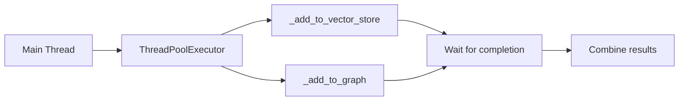

# add Method

<cite>
**Referenced Files in This Document**   
- [main.py](file://mem0/memory/main.py#L194-L307)
- [main.py](file://mem0/memory/main.py#L308-L481)
- [main.py](file://mem0/memory/main.py#L482-L492)
- [main.py](file://mem0/memory/main.py#L869-L906)
- [utils.py](file://mem0/memory/utils.py#L90-L117)
- [base.py](file://mem0/configs/base.py#L28)
- [enums.py](file://mem0/configs/enums.py#L4)
- [test_main.py](file://tests/test_main.py#L70-L96)
</cite>

## Table of Contents
1. [Introduction](#introduction)
2. [Method Overview](#method-overview)
3. [Parameters](#parameters)
4. [Return Structure](#return-structure)
5. [Internal Workflow](#internal-workflow)
6. [Usage Examples](#usage-examples)
7. [Error Handling](#error-handling)
8. [Performance Considerations](#performance-considerations)

## Introduction
The `add()` method of the Memory class is a core component of the mem0 memory system, responsible for creating new memories from user messages. This method implements a sophisticated memory inference process that combines fact extraction, semantic matching, and intelligent updates using Large Language Models (LLMs). The method supports various memory types and provides flexible configuration options for different use cases, from basic message storage to procedural memory creation.

## Method Overview
The `add()` method creates new memories by processing input messages through a multi-step inference pipeline. It first validates input parameters and builds appropriate filters and metadata for session scoping. The method then handles different message formats (string, dictionary, or list of dictionaries) and processes vision messages when enabled. For standard memory creation, it uses LLMs to extract key facts from messages and determine whether to add, update, or delete related memories. For procedural memory creation, it generates a summary of the conversation. The method executes vector and graph store operations concurrently for optimal performance and returns results in a version-specific format.

**Section sources**
- [main.py](file://mem0/memory/main.py#L194-L307)

## Parameters
The `add()` method accepts the following parameters:

- **messages** (str, dict, or list[dict]): The message content to be processed and stored. Supports multiple formats:
  - String: Converted to `{"role": "user", "content": messages}`
  - Dictionary: Treated as a single message object
  - List[dict]: Multiple message objects in the format `[{"role": "user", "content": "Hello"}, {"role": "assistant", "content": "Hi"}]`

- **user_id** (str, optional): ID of the user creating the memory. Used for session scoping.

- **agent_id** (str, optional): ID of the agent creating the memory. Required for procedural memory creation.

- **run_id** (str, optional): ID of the run creating the memory. Used for session scoping.

- **metadata** (dict, optional): Additional metadata to store with the memory.

- **infer** (bool, optional): Controls the memory creation mode:
  - `True` (default): Uses LLM to extract key facts from messages and decide memory operations (add/update/delete)
  - `False`: Adds messages as raw memories directly without inference

- **memory_type** (str, optional): Specifies the type of memory to create:
  - `procedural_memory`: Creates procedural memories (requires `agent_id`)
  - Other values are not supported; only `MemoryType.PROCEDURAL.value` is explicitly handled

- **prompt** (str, optional): Custom prompt to use for memory creation, particularly for procedural memory generation.

**Section sources**
- [main.py](file://mem0/memory/main.py#L194-L307)

## Return Structure
The return structure of the `add()` method varies based on the API version and configuration:

### API v1.0
Returns the raw vector store result (deprecated format with deprecation warning):
```json
[
  {"id": "...", "memory": "...", "event": "ADD"}
]
```

### API v1.1+
Returns a standardized dictionary structure:
```json
{
  "results": [
    {"id": "...", "memory": "...", "event": "ADD"}
  ],
  "relations": [...]  // Only present when graph store is enabled
}
```

When the graph store is enabled (`enable_graph=True`), the response includes both `results` (from vector store) and `relations` (from graph store). The `results` field contains information about memory operations (ADD, UPDATE, DELETE) with details like memory ID, content, and event type.

**Section sources**
- [main.py](file://mem0/memory/main.py#L291-L307)
- [test_main.py](file://tests/test_main.py#L70-L96)

## Internal Workflow
The `add()` method follows a comprehensive internal workflow to process and store memories:

```mermaid
flowchart TD
Start([Start add() method]) --> ValidateInput["Validate input parameters<br/>Check session IDs<br/>Validate message format"]
ValidateInput --> ProcessMessages["Process messages<br/>Convert to standard format<br/>Handle string/dict/list inputs"]
ProcessMessages --> CheckProcedural["Check for procedural memory<br/>(agent_id + memory_type)"]
CheckProcedural --> |Yes| CreateProcedural["Create procedural memory<br/>using _create_procedural_memory()"]
CheckProcedural --> |No| ProcessVision["Process vision messages<br/>if enable_vision is True"]
ProcessVision --> ConcurrentOps["Execute concurrent operations"]
subgraph ConcurrentOperations
ConcurrentOps --> VectorStore["Add to vector store<br/>_add_to_vector_store()"]
ConcurrentOps --> GraphStore["Add to graph store<br/>_add_to_graph()"]
end
ConcurrentOps --> CheckAPIVersion["Check API version"]
CheckAPIVersion --> |v1.0| ReturnLegacy["Return legacy format<br/>(with deprecation warning)"]
CheckAPIVersion --> |v1.1+| CheckGraph["Check if graph enabled"]
CheckGraph --> |Yes| ReturnStandardGraph["Return standard format<br/>with results and relations"]
CheckGraph --> |No| ReturnStandard["Return standard format<br/>with results only"]
CreateProcedural --> ReturnProcedural
ReturnLegacy --> End([End])
ReturnStandardGraph --> End
ReturnStandard --> End
ReturnProcedural --> End
```

**Diagram sources**
- [main.py](file://mem0/memory/main.py#L194-L307)
- [main.py](file://mem0/memory/main.py#L308-L481)
- [main.py](file://mem0/memory/main.py#L482-L492)
- [main.py](file://mem0/memory/main.py#L869-L906)

### Session Scoping via _build_filters_and_metadata
The method uses the `_build_filters_and_metadata()` helper function to create appropriate filters and metadata for session scoping. This function enforces that at least one of `user_id`, `agent_id`, or `run_id` is provided, as these are required for proper memory organization. It constructs a metadata template for storage and query filters for retrieval, ensuring memories are properly scoped to the appropriate session.

### Procedural Memory Handling
When `agent_id` is provided and `memory_type` is set to `procedural_memory`, the method calls `_create_procedural_memory()`. This function generates a procedural memory by:
1. Creating a system message with the procedural memory prompt
2. Combining input messages with a user message requesting procedural memory creation
3. Using the LLM to generate a summary of the conversation
4. Creating a new memory with the summary and appropriate metadata

### Vision Message Parsing
When vision capabilities are enabled (`config.llm.config.get("enable_vision")`), the method processes vision messages using `parse_vision_messages()`. This function:
1. Identifies messages with image content (either as a list of content items or a single image_url object)
2. Uses the LLM to generate a description of the image
3. Replaces the image content with the textual description
4. Returns the processed messages for further processing

### Concurrent Execution
The method uses concurrent.futures.ThreadPoolExecutor to execute vector and graph store operations in parallel:


This concurrent execution improves performance by allowing independent operations to run simultaneously rather than sequentially.

**Section sources**
- [main.py](file://mem0/memory/main.py#L194-L307)
- [main.py](file://mem0/memory/main.py#L308-L481)
- [main.py](file://mem0/memory/main.py#L482-L492)
- [utils.py](file://mem0/memory/utils.py#L90-L117)

## Usage Examples
### Basic Message Addition
```python
# Add a simple string message
result = memory.add(
    messages="Hello, how are you?",
    user_id="user_123"
)

# Add a message with role information
result = memory.add(
    messages={"role": "user", "content": "What's the weather today?"},
    user_id="user_123"
)

# Add multiple messages
result = memory.add(
    messages=[
        {"role": "user", "content": "I'm planning a trip"},
        {"role": "assistant", "content": "That sounds exciting! Where are you thinking of going?"}
    ],
    user_id="user_123"
)
```

### Procedural Memory Creation
```python
# Create a procedural memory (requires agent_id)
result = memory.add(
    messages=[
        {"role": "user", "content": "I need to book a flight to New York"},
        {"role": "assistant", "content": "I can help with that. When would you like to travel?"}
    ],
    agent_id="agent_travel",
    memory_type="procedural_memory"
)
```

### Batch Operations
```python
# Add multiple messages with custom metadata
result = memory.add(
    messages=[
        {"role": "user", "content": "Meeting notes from today"},
        {"role": "user", "content": "1. Project timeline discussed"},
        {"role": "user", "content": "2. Budget approved"}
    ],
    user_id="user_123",
    run_id="meeting_456",
    metadata={"category": "meeting", "date": "2023-11-15"},
    infer=True
)
```

**Section sources**
- [main.py](file://mem0/memory/main.py#L194-L307)
- [test_main.py](file://tests/test_main.py#L70-L96)

## Error Handling
The `add()` method implements comprehensive error handling for various scenarios:

- **Validation Errors**: Raises `Mem0ValidationError` when:
  - No session ID (`user_id`, `agent_id`, or `run_id`) is provided
  - Invalid `memory_type` is specified (only `procedural_memory` is supported)
  - Messages are in an unsupported format (not string, dict, or list[dict])

- **Processing Errors**: Handles various runtime exceptions:
  - Invalid message format (skips invalid messages with warning)
  - Empty or invalid LLM responses (graceful degradation)
  - JSON parsing errors in LLM responses (logs error and continues)

- **Store Operation Errors**: Raises specific exceptions for storage failures:
  - `VectorStoreError`: When vector store operations fail
  - `GraphStoreError`: When graph store operations fail
  - `EmbeddingError`: When embedding generation fails
  - `LLMError`: When LLM operations fail
  - `DatabaseError`: When database operations fail

Common issues include missing session IDs and incorrect message formats. To avoid validation errors, ensure that at least one of `user_id`, `agent_id`, or `run_id` is provided, and format messages correctly as strings, dictionaries, or lists of dictionaries.

**Section sources**
- [main.py](file://mem0/memory/main.py#L194-L307)
- [main.py](file://mem0/memory/main.py#L308-L481)

## Performance Considerations
The `add()` method includes several performance optimizations:

### Concurrent Operations
The method uses ThreadPoolExecutor to execute vector and graph store operations concurrently, reducing overall latency:
```python
with concurrent.futures.ThreadPoolExecutor() as executor:
    future1 = executor.submit(self._add_to_vector_store, messages, processed_metadata, effective_filters, infer)
    future2 = executor.submit(self._add_to_graph, messages, effective_filters)
    concurrent.futures.wait([future1, future2])
```

### Thread Safety
The implementation is thread-safe through:
- Use of ThreadPoolExecutor for concurrent operations
- Proper synchronization of shared resources
- Immutable data structures where possible
- Atomic operations for database transactions

### Optimization Recommendations
- **Batch Processing**: When adding multiple related messages, include them in a single `add()` call rather than making multiple calls
- **Inference Mode**: Use `infer=False` when you want to store messages as-is without LLM processing, which is faster but lacks intelligent memory management
- **Session Scoping**: Always provide appropriate session IDs to ensure efficient memory retrieval and organization
- **Metadata Usage**: Use metadata judiciously to avoid excessive storage overhead while maintaining necessary context

The concurrent execution model ensures that vector and graph operations do not block each other, maximizing throughput in high-load scenarios.

**Section sources**
- [main.py](file://mem0/memory/main.py#L282-L287)
- [main.py](file://mem0/memory/main.py#L308-L481)
- [main.py](file://mem0/memory/main.py#L482-L492)