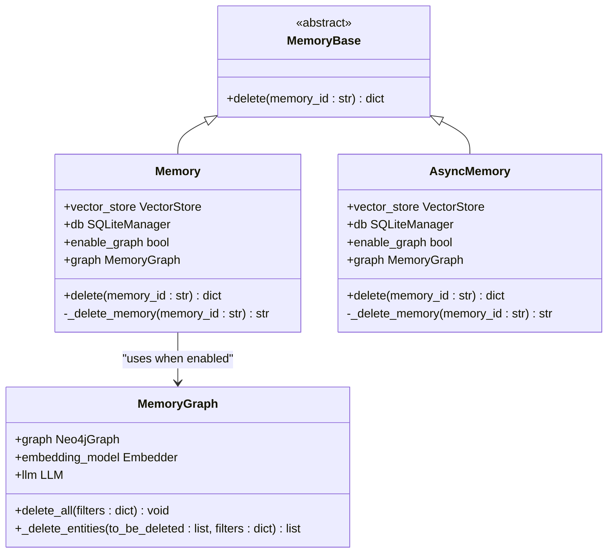
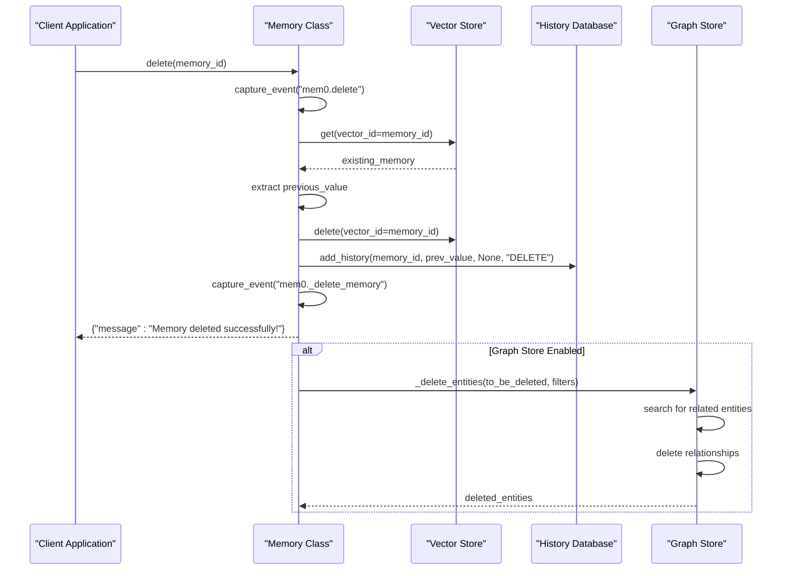
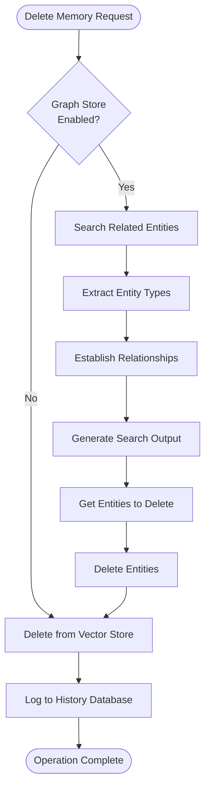

# delete Method

<cite>
**Referenced Files in This Document**
- [main.py](file://mem0/memory/main.py)
- [base.py](file://mem0/memory/base.py)
- [storage.py](file://mem0/memory/storage.py)
- [index.ts](file://mem0-ts/src/oss/src/memory/index.ts)
- [graph_memory.py](file://mem0/memory/graph_memory.py)
- [test_main.py](file://tests/memory/test_main.py)
- [memory.test.ts](file://mem0-ts/src/oss/tests/memory.test.ts)
</cite>

## Table of Contents
1. [Introduction](#introduction)
2. [Method Signature and Purpose](#method-signature-and-purpose)
3. [Parameter Details](#parameter-details)
4. [Return Structure](#return-structure)
5. [Internal Processing Flow](#internal-processing-flow)
6. [Graph Store Integration](#graph-store-integration)
7. [Audit Logging and History](#audit-logging-and-history)
8. [Practical Usage Examples](#practical-usage-examples)
9. [Error Handling and Edge Cases](#error-handling-and-edge-cases)
10. [Privacy and Compliance Considerations](#privacy-and-compliance-considerations)
11. [Best Practices](#best-practices)
12. [Troubleshooting Guide](#troubleshooting-guide)

## Introduction

The `delete()` method is a core component of the Memory class that provides secure and audited deletion capabilities for individual memories within the mem0 memory management system. This method serves as the primary interface for removing specific memories by their unique identifiers while maintaining data integrity, audit trails, and privacy compliance standards.

The delete operation is designed with several key principles:
- **Irreversible Deletion**: Once executed, memory deletion cannot be undone
- **Complete Removal**: Both vector store and graph store components are cleared
- **Audit Trail**: All deletions are recorded in the history database
- **Privacy Compliance**: Supports GDPR-style data deletion requirements
- **Consistent API**: Available across both synchronous and asynchronous memory implementations

## Method Signature and Purpose

The delete method is implemented in both the synchronous and asynchronous Memory classes, providing consistent functionality across different execution contexts.



**Diagram sources**
- [base.py](file://mem0/memory/base.py#L42-L50)
- [main.py](file://mem0/memory/main.py#L779-L789)
- [graph_memory.py](file://mem0/memory/graph_memory.py#L357-L411)

**Section sources**
- [base.py](file://mem0/memory/base.py#L42-L50)
- [main.py](file://mem0/memory/main.py#L779-L789)

## Parameter Details

### memory_id (Required)

The `memory_id` parameter is the unique identifier of the memory to be deleted. This parameter serves as the primary key for locating and removing the specific memory from all storage systems.

#### Valid Identifier Formats

The memory ID follows UUID format standards and typically appears as:
- **Standard UUID**: `"mem_12345678-1234-5678-9abc-123456789abc"`
- **Shortened Format**: `"mem_12345678"`
- **Custom Prefix**: `"custom_prefix_12345678"`

#### Identifier Validation

The system performs automatic validation to ensure the memory ID exists before attempting deletion:
- **Existence Check**: Verifies the memory exists in the vector store
- **Format Validation**: Ensures proper UUID format
- **Access Control**: Validates user permissions for the memory

**Section sources**
- [main.py](file://mem0/memory/main.py#L963-L978)
- [index.ts](file://mem0-ts/src/oss/src/memory/index.ts#L490-L495)

## Return Structure

The delete method consistently returns a standardized success message dictionary across all API versions and implementations.

### Standard Return Format

```python
{
    "message": "Memory deleted successfully!"
}
```

### Return Structure Consistency

| API Version | Return Format | Description |
|-------------|---------------|-------------|
| v1.0 | Direct string | Deprecated format |
| v1.1+ | Dictionary | Current standard format |
| TypeScript | Promise\<{ message: string }\> | Asynchronous equivalent |

### Success Indicators

The return structure provides clear success confirmation:
- **Success Message**: Standardized confirmation message
- **Operation Status**: Indicates successful completion
- **API Compatibility**: Maintains backward compatibility

**Section sources**
- [main.py](file://mem0/memory/main.py#L788-L789)
- [index.ts](file://mem0-ts/src/oss/src/memory/index.ts#L490-L495)

## Internal Processing Flow

The delete operation follows a structured internal process that ensures data consistency and audit compliance.



**Diagram sources**
- [main.py](file://mem0/memory/main.py#L963-L978)
- [storage.py](file://mem0/memory/storage.py#L126-L168)

### Step-by-Step Process

1. **Event Capture**: Records the deletion operation for telemetry
2. **Memory Retrieval**: Fetches the existing memory to preserve content
3. **Vector Store Deletion**: Removes the memory from the vector database
4. **History Recording**: Logs the deletion in the SQLite history database
5. **Graph Store Cleanup**: Handles cascading deletions in graph stores
6. **Final Confirmation**: Returns success message to the caller

**Section sources**
- [main.py](file://mem0/memory/main.py#L963-L978)
- [storage.py](file://mem0/memory/storage.py#L126-L168)

## Graph Store Integration

When graph store functionality is enabled, the delete operation triggers cascading cleanup of associated entities and relationships.

### Cascading Effects



**Diagram sources**
- [graph_memory.py](file://mem0/memory/graph_memory.py#L357-L411)
- [main.py](file://mem0/memory/main.py#L963-L978)

### Graph Store Operations

#### Entity Detection
- **Automatic Extraction**: Identifies entities mentioned in the deleted memory
- **Relationship Analysis**: Determines connections between entities
- **Impact Assessment**: Evaluates which entities are affected by deletion

#### Relationship Cleanup
- **Direct Deletion**: Removes relationships involving the deleted memory
- **Orphan Handling**: Manages orphaned entities that lose all connections
- **Graph Integrity**: Maintains graph structure consistency

**Section sources**
- [graph_memory.py](file://mem0/memory/graph_memory.py#L357-L411)
- [main.py](file://mem0/memory/main.py#L963-L978)

## Audit Logging and History

The delete operation maintains comprehensive audit trails through the SQLite history database, ensuring transparency and compliance with data governance requirements.

### History Database Schema

| Column | Type | Description |
|--------|------|-------------|
| id | TEXT | Unique identifier for the history entry |
| memory_id | TEXT | Reference to the deleted memory |
| old_memory | TEXT | Content of the deleted memory |
| new_memory | NULL | Always null for delete operations |
| event | TEXT | Event type ("DELETE") |
| created_at | DATETIME | Timestamp of deletion |
| updated_at | NULL | Not applicable for deletes |
| is_deleted | INTEGER | Boolean flag (1 for deleted) |
| actor_id | TEXT | User who performed the deletion |
| role | TEXT | Role of the actor |

### Audit Trail Features

#### Comprehensive Logging
- **Content Preservation**: Stores the original memory content
- **Timestamp Tracking**: Records precise deletion timestamps
- **Actor Identification**: Links deletions to specific users
- **Event Classification**: Categorizes operations for reporting

#### Compliance Support
- **GDPR Compliance**: Enables data subject rights fulfillment
- **Regulatory Reporting**: Supports audit and compliance requirements
- **Data Retention**: Maintains historical records per policy

**Section sources**
- [storage.py](file://mem0/memory/storage.py#L126-L168)
- [storage.py](file://mem0/memory/storage.py#L169-L197)

## Practical Usage Examples

### Basic Memory Deletion

```python
# Synchronous Python Example
from mem0 import Memory

# Initialize memory instance
memory = Memory()

# Delete a specific memory
result = memory.delete("mem_12345678-1234-5678-9abc-123456789abc")
print(result)  # {"message": "Memory deleted successfully!"}
```

### TypeScript Implementation

```typescript
// TypeScript Example
import { Memory } from '@mem0ai/mem0';

// Initialize memory client
const memory = new Memory();

// Delete memory with error handling
try {
    const result = await memory.delete("mem_12345678-1234-5678-9abc-123456789abc");
    console.log(result.message); // "Memory deleted successfully!"
} catch (error) {
    console.error("Failed to delete memory:", error);
}
```

### Bulk Deletion Pattern

```python
# Delete multiple memories in sequence
memory_ids = [
    "mem_12345678-1234-5678-9abc-123456789abc",
    "mem_87654321-4321-8765-cba9-987654321cba",
    "mem_abcdef12-3456-7890-abcd-ef1234567890"
]

for memory_id in memory_ids:
    try:
        result = memory.delete(memory_id)
        print(f"Deleted {memory_id}: {result['message']}")
    except Exception as e:
        print(f"Failed to delete {memory_id}: {str(e)}")
```

### Error Handling Patterns

```python
# Robust error handling example
def safe_delete_memory(memory, memory_id):
    try:
        # Check if memory exists before attempting deletion
        existing_memory = memory.get(memory_id)
        if not existing_memory:
            return {"error": "Memory not found", "memory_id": memory_id}
        
        # Perform deletion
        result = memory.delete(memory_id)
        return result
        
    except Exception as e:
        return {"error": str(e), "memory_id": memory_id}

# Usage
result = safe_delete_memory(memory, "nonexistent_memory_id")
if "error" in result:
    print(f"Deletion failed: {result['error']}")
else:
    print("Memory deleted successfully")
```

**Section sources**
- [test_main.py](file://tests/memory/test_main.py#L1-128)
- [memory.test.ts](file://mem0-ts/src/oss/tests/memory.test.ts#L171-L190)

## Error Handling and Edge Cases

### Common Error Scenarios

#### Non-Existent Memory IDs

```python
# Attempting to delete a non-existent memory
try:
    result = memory.delete("nonexistent_memory_id")
except Exception as e:
    print(f"Error: {e}")
    # Typically raises: "Memory with ID nonexistent_memory_id not found"
```

#### Permission Constraints

```python
# Memory access restrictions
try:
    # User tries to delete another user's memory
    result = memory.delete("foreign_memory_id")
except PermissionError as e:
    print(f"Access denied: {e}")
```

#### Graph Store Failures

```python
# Graph store connectivity issues
try:
    result = memory.delete("memory_with_graph_relations")
except GraphStoreError as e:
    print(f"Graph store error: {e}")
    # Operation continues with vector store deletion
```

### Error Recovery Strategies

#### Graceful Degradation
- **Partial Success**: Continue vector store deletion even if graph store fails
- **Rollback Capability**: Implement mechanisms for partial recovery
- **Compensation Actions**: Trigger cleanup for partially completed operations

#### Retry Mechanisms
- **Exponential Backoff**: Implement retry logic for transient failures
- **Idempotency**: Ensure repeated delete attempts don't cause issues
- **State Validation**: Verify operation outcomes before proceeding

**Section sources**
- [main.py](file://mem0/memory/main.py#L963-L978)
- [index.ts](file://mem0-ts/src/oss/src/memory/index.ts#L691-L710)

## Privacy and Compliance Considerations

### Data Protection Principles

The delete method implements several privacy and compliance features:

#### Right to Erasure
- **Complete Removal**: Ensures memories are permanently deleted
- **Cascade Deletion**: Removes all associated data and relationships
- **Audit Verification**: Provides proof of deletion completion

#### Data Minimization
- **Selective Deletion**: Allows precise memory removal
- **Scope Control**: Supports user-specific and session-based deletion
- **Retention Management**: Enables configurable retention policies

#### Accountability
- **Immutable Logs**: Maintains tamper-proof deletion records
- **Access Monitoring**: Tracks who performed deletions
- **Compliance Reporting**: Generates reports for regulatory requirements

### GDPR Compliance Features

| Requirement | Implementation |
|-------------|----------------|
| Right to Erasure | Full memory deletion with cascade |
| Data Minimization | Selective deletion capabilities |
| Transparency | Audit logs and deletion confirmations |
| Accountability | Immutable deletion records |
| Security | Access control and encryption |

### Regulatory Reporting

The audit trail supports various regulatory frameworks:
- **GDPR**: Right to erasure and data minimization
- **CCPA**: Consumer data deletion requests
- **HIPAA**: Protected health information removal
- **SOX**: Financial data deletion requirements

**Section sources**
- [storage.py](file://mem0/memory/storage.py#L126-L168)
- [main.py](file://mem0/memory/main.py#L963-L978)

## Best Practices

### Operational Guidelines

#### Pre-Deletion Verification
```python
def safe_delete_with_verification(memory, memory_id):
    # Verify memory exists and belongs to user
    memory_item = memory.get(memory_id)
    if not memory_item:
        raise ValueError(f"Memory {memory_id} not found")
    
    # Check ownership or permissions
    if memory_item.get('user_id') != current_user_id:
        raise PermissionError("Not authorized to delete this memory")
    
    # Proceed with deletion
    return memory.delete(memory_id)
```

#### Batch Deletion Strategy
```python
def batch_delete_memories(memory, memory_ids, batch_size=10):
    """Delete multiple memories with controlled batching"""
    results = []
    
    for i in range(0, len(memory_ids), batch_size):
        batch = memory_ids[i:i + batch_size]
        batch_results = []
        
        for memory_id in batch:
            try:
                result = memory.delete(memory_id)
                batch_results.append({"memory_id": memory_id, "status": "success", "result": result})
            except Exception as e:
                batch_results.append({"memory_id": memory_id, "status": "failed", "error": str(e)})
        
        results.extend(batch_results)
        # Optional: Add delay between batches
        time.sleep(0.1)
    
    return results
```

#### Monitoring and Alerting
```python
def monitored_delete(memory, memory_id, user_id):
    """Delete with monitoring and alerting"""
    try:
        # Monitor deletion frequency
        if is_deletion_rate_exceeded(user_id):
            raise RateLimitError("Too many deletions recently")
        
        # Perform deletion
        result = memory.delete(memory_id)
        
        # Log successful deletion
        log_deletion_success(user_id, memory_id)
        
        return result
        
    except Exception as e:
        # Log failure for monitoring
        log_deletion_failure(user_id, memory_id, str(e))
        raise
```

### Performance Optimization

#### Efficient Deletion Patterns
- **Batch Operations**: Group related deletions when possible
- **Index Utilization**: Leverage vector store indexing for fast lookups
- **Connection Pooling**: Reuse database connections for multiple operations
- **Asynchronous Processing**: Use async methods for high-throughput scenarios

#### Resource Management
- **Memory Cleanup**: Ensure proper garbage collection after large deletions
- **Storage Optimization**: Trigger compaction after significant deletions
- **Connection Limits**: Respect database connection limits

**Section sources**
- [main.py](file://mem0/memory/main.py#L963-L978)
- [index.ts](file://mem0-ts/src/oss/src/memory/index.ts#L691-L710)

## Troubleshooting Guide

### Common Issues and Solutions

#### Issue: Memory Not Found Error
**Symptoms**: `Memory with ID XXX not found` exception
**Causes**: 
- Incorrect memory ID format
- Memory already deleted
- Access permission issues

**Solutions**:
```python
# Verify memory existence before deletion
def safe_delete(memory, memory_id):
    if memory.get(memory_id):
        return memory.delete(memory_id)
    else:
        # Handle missing memory gracefully
        return {"message": "Memory not found (already deleted)"}
```

#### Issue: Graph Store Connection Failure
**Symptoms**: Graph store operations timeout or fail
**Causes**:
- Network connectivity issues
- Authentication problems
- Database resource constraints

**Solutions**:
```python
# Implement fallback for graph store failures
def delete_with_fallback(memory, memory_id):
    try:
        return memory.delete(memory_id)
    except GraphStoreError:
        # Fall back to vector store only
        return memory._delete_memory(memory_id)
```

#### Issue: Audit Log Corruption
**Symptoms**: History database errors or missing records
**Causes**:
- Concurrent access conflicts
- Disk space limitations
- Database corruption

**Solutions**:
```python
# Implement robust history logging
def robust_delete(memory, memory_id):
    try:
        # Ensure history database is accessible
        memory.db.connection.execute("PRAGMA journal_mode=WAL")
        
        # Perform deletion with atomic operations
        with memory.db.connection:
            result = memory.delete(memory_id)
            
        return result
        
    except sqlite3.Error as e:
        # Fallback to minimal logging
        logger.warning(f"History logging failed: {e}")
        return memory._delete_memory(memory_id)
```

### Debugging Techniques

#### Enable Debug Logging
```python
import logging
logging.getLogger("mem0").setLevel(logging.DEBUG)
```

#### Verify Operation Results
```python
def debug_delete(memory, memory_id):
    # Log before and after states
    print(f"Before deletion - Memory exists: {bool(memory.get(memory_id))}")
    
    result = memory.delete(memory_id)
    
    print(f"After deletion - Memory exists: {bool(memory.get(memory_id))}")
    print(f"Result: {result}")
    
    return result
```

#### Monitor Performance Metrics
```python
import time

def timed_delete(memory, memory_id):
    start_time = time.time()
    
    try:
        result = memory.delete(memory_id)
        duration = time.time() - start_time
        
        print(f"Deletion completed in {duration:.2f} seconds")
        return result
        
    except Exception as e:
        duration = time.time() - start_time
        print(f"Deletion failed after {duration:.2f} seconds: {e}")
        raise
```

**Section sources**
- [main.py](file://mem0/memory/main.py#L963-L978)
- [storage.py](file://mem0/memory/storage.py#L126-L168)