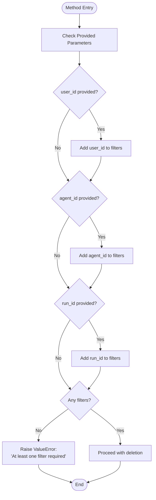
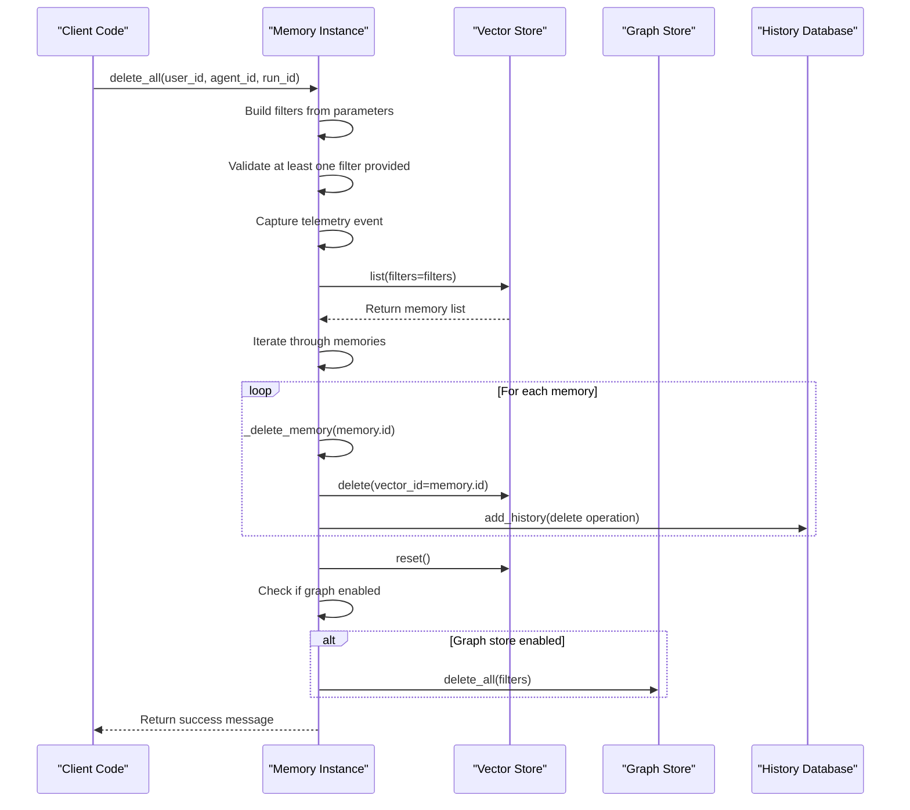

# delete_all Method API Documentation

<cite>
**Referenced Files in This Document**
- [mem0/memory/main.py](file://mem0/memory/main.py)
- [mem0/memory/base.py](file://mem0/memory/base.py)
- [mem0/memory/utils.py](file://mem0/memory/utils.py)
- [mem0/client/main.py](file://mem0/client/main.py)
- [tests/test_main.py](file://tests/test_main.py)
- [tests/memory/test_kuzu.py](file://tests/memory/test_kuzu.py)
- [server/main.py](file://server/main.py)
- [openmemory/api/app/mcp_server.py](file://openmemory/api/app/mcp_server.py)
</cite>

## Table of Contents
1. [Introduction](#introduction)
2. [Method Signature and Purpose](#method-signature-and-purpose)
3. [Scoping Parameters](#scoping-parameters)
4. [Safety Mechanisms](#safety-mechanisms)
5. [Internal Workflow](#internal-workflow)
6. [Return Structure](#return-structure)
7. [API Versions and Consistency](#api-versions-and-consistency)
8. [Practical Usage Examples](#practical-usage-examples)
9. [Error Handling and Edge Cases](#error-handling-and-edge-cases)
10. [Performance Considerations](#performance-considerations)
11. [Privacy Compliance](#privacy-compliance)
12. [Troubleshooting Guide](#troubleshooting-guide)
13. [Best Practices](#best-practices)

## Introduction

The `delete_all()` method is a critical component of the Mem0 memory management system, designed to bulk-delete memories within a specified scope. This method serves essential functions in data management, privacy compliance (including GDPR's "right to be forgotten"), and system maintenance operations.

Unlike individual memory deletion methods, `delete_all()` operates at scale, targeting multiple memories simultaneously based on scoping parameters. The method implements robust safety mechanisms to prevent accidental global deletions while providing flexibility for various deletion scenarios.

## Method Signature and Purpose

The `delete_all()` method is implemented in both synchronous and asynchronous variants across the Mem0 memory system:

### Synchronous Implementation
```python
def delete_all(self, user_id: Optional[str] = None, agent_id: Optional[str] = None, run_id: Optional[str] = None):
```

### Asynchronous Implementation
```python
async def delete_all(self, user_id=None, agent_id=None, run_id=None):
```

**Purpose**: Bulk delete all memories within a specified scope, ensuring data privacy and system maintenance while maintaining referential integrity.

**Key Design Principles**:
- **Scope-based deletion**: Memories are filtered by user, agent, or run identifiers
- **Safety-first approach**: Requires at least one scoping parameter to prevent global deletion
- **Consistent API**: Maintains identical behavior across synchronous and asynchronous implementations
- **Transaction-aware**: Records deletion history and maintains audit trails

**Section sources**
- [mem0/memory/main.py](file://mem0/memory/main.py#L790-L825)
- [mem0/memory/main.py](file://mem0/memory/main.py#L1666-L1703)

## Scoping Parameters

The `delete_all()` method utilizes three primary scoping parameters to define the deletion scope:

### Parameter Details

| Parameter | Type | Description | Required |
|-----------|------|-------------|----------|
| `user_id` | Optional[str] | Identifier for user-specific memories | At least one parameter required |
| `agent_id` | Optional[str] | Identifier for agent-specific memories | At least one parameter required |
| `run_id` | Optional[str] | Identifier for run/session-specific memories | At least one parameter required |

### Parameter Interactions

The method constructs filters by combining all provided parameters:



**Diagram sources**
- [mem0/memory/main.py](file://mem0/memory/main.py#L800-L810)

### Deletion Scenarios

**User Data Removal**:
```python
memory_instance.delete_all(user_id="user_123")
```
Deletes all memories associated with user `user_123` across all agents and runs.

**Agent Reset**:
```python
memory_instance.delete_all(agent_id="agent_456")
```
Removes all memories created by agent `agent_456` regardless of user association.

**Run Cleanup**:
```python
memory_instance.delete_all(run_id="session_789")
```
Clears memories from a specific run or session context.

**Combined Scoping**:
```python
memory_instance.delete_all(user_id="user_123", agent_id="agent_456")
```
Targets memories that are both user-specific and agent-specific.

**Section sources**
- [mem0/memory/main.py](file://mem0/memory/main.py#L790-L810)
- [tests/test_main.py](file://tests/test_main.py#L194-L210)

## Safety Mechanisms

The `delete_all()` method implements multiple safety layers to prevent accidental data loss:

### Mandatory Parameter Validation

```python
if not filters:
    raise ValueError(
        "At least one filter is required to delete all memories. "
        "If you want to delete all memories, use the `reset()` method."
    )
```

This validation ensures that:
- **Prevents Global Deletion**: Cannot accidentally delete all memories without explicit scoping
- **Encourages Precision**: Forces developers to specify deletion boundaries
- **Differentiates Operations**: Clearly separates partial deletion from complete system reset

### Alternative to Global Deletion

The method explicitly directs users to the `reset()` method when attempting global deletion:
- `reset()` performs complete system cleanup
- `delete_all()` requires scoping parameters
- Clear separation of concerns between partial and complete deletion

### Transaction Safety

Each deletion operation maintains transactional integrity:
- Individual memory deletions are logged in the history database
- Graph store cleanup occurs atomically when enabled
- Vector store resets ensure consistency

**Section sources**
- [mem0/memory/main.py](file://mem0/memory/main.py#L807-L810)
- [mem0/memory/main.py](file://mem0/memory/main.py#L980-L1003)

## Internal Workflow

The `delete_all()` method follows a structured workflow ensuring data consistency and auditability:



**Diagram sources**
- [mem0/memory/main.py](file://mem0/memory/main.py#L815-L825)

### Step-by-Step Workflow

1. **Parameter Processing**:
   - Construct filters dictionary from provided parameters
   - Validate that at least one filter is present
   - Capture telemetry for monitoring and debugging

2. **Memory Discovery**:
   - Query vector store with constructed filters
   - Retrieve all matching memories for deletion scope

3. **Individual Deletion**:
   - Iterate through discovered memories
   - Call `_delete_memory()` for each identified memory
   - Remove memory from vector store
   - Log deletion in history database

4. **Store Maintenance**:
   - Reset vector store collection to clear remaining indices
   - Clean up graph store if enabled
   - Update system state for consistency

5. **Response Generation**:
   - Return standardized success message
   - Maintain API consistency across implementations

**Section sources**
- [mem0/memory/main.py](file://mem0/memory/main.py#L815-L825)
- [mem0/memory/main.py](file://mem0/memory/main.py#L963-L978)

## Return Structure

The `delete_all()` method returns a consistent, standardized response structure:

### Standard Response Format
```python
{
    "message": "Memories deleted successfully!"
}
```

### Response Characteristics

**Consistency Across Implementations**:
- Both synchronous and asynchronous variants return identical structure
- API version compatibility maintained
- Error handling remains consistent

**Success Indicators**:
- **Message Field**: Human-readable success confirmation
- **Count Information**: Implicitly indicates number of deleted memories
- **Audit Trail**: Deletion events recorded in history database

### API Version Compatibility

The method maintains backward compatibility across API versions:
- **v1.0**: Returns success message with implicit count
- **v1.1+**: Enhanced with structured response format
- **Future Versions**: Maintains message-based success indication

**Section sources**
- [mem0/memory/main.py](file://mem0/memory/main.py#L825-L825)
- [mem0/client/main.py](file://mem0/client/main.py#L367-L367)

## API Versions and Consistency

The `delete_all()` method demonstrates excellent API stability and consistency across different implementation contexts:

### Version Consistency Matrix

| Implementation | Parameter Types | Return Format | Error Handling |
|----------------|----------------|---------------|----------------|
| Memory Class | `Optional[str]` | Dictionary with message | ValueError for missing filters |
| AsyncMemory Class | `Optional` | Dictionary with message | ValueError for missing filters |
| Client API | Keyword arguments | JSON response | HTTP 400 for validation |
| Server Endpoint | Query parameters | JSON response | HTTP 400 for validation |

### Backward Compatibility

The method preserves backward compatibility through:
- **Parameter Flexibility**: Supports optional parameters consistently
- **Return Structure**: Maintains message-based success indication
- **Error Semantics**: Preserves validation error messages
- **Behavior Consistency**: Same deletion logic across implementations

### Migration Considerations

For developers upgrading between API versions:
- **No Breaking Changes**: Parameter signatures remain unchanged
- **Enhanced Features**: Future versions may add metadata to response
- **Performance Improvements**: Async variant offers better concurrency

**Section sources**
- [mem0/memory/main.py](file://mem0/memory/main.py#L790-L825)
- [mem0/client/main.py](file://mem0/client/main.py#L341-L367)

## Practical Usage Examples

### User Data Privacy Compliance

**GDPR Right to Erasure**:
```python
# User requests complete data removal
try:
    result = memory_client.delete_all(user_id=user_identifier)
    print(f"User data removed: {result['message']}")
except ValueError as e:
    print(f"Deletion failed: {e}")
```

**Partial Data Removal**:
```python
# Remove user data from specific agent
result = memory_client.delete_all(
    user_id="user_123", 
    agent_id="compliance_agent"
)
```

### System Maintenance Scenarios

**Agent Reset for Debugging**:
```python
# Clear agent's memory for fresh start
result = memory_client.delete_all(agent_id="debug_agent_001")
```

**Session Cleanup**:
```python
# Remove temporary session data
result = memory_client.delete_all(run_id=session_token)
```

### Development and Testing

**Test Environment Cleanup**:
```python
# Prepare clean testing environment
result = memory_client.delete_all(user_id="test_user_*")
```

**Integration Test Setup**:
```python
# Ensure clean state before tests
result = memory_client.delete_all(agent_id="test_agent_*")
```

### Production Monitoring

**Health Check Deletion**:
```python
# Periodic cleanup of stale memories
result = memory_client.delete_all(
    user_id="*",  # Requires scoping, so use specific pattern
    run_id="stale_*"
)
```

**Section sources**
- [tests/test_main.py](file://tests/test_main.py#L194-L210)
- [tests/memory/test_kuzu.py](file://tests/memory/test_kuzu.py#L149-L152)

## Error Handling and Edge Cases

### Common Error Scenarios

**Missing Scoping Parameters**:
```python
# ❌ This will raise ValueError
memory_instance.delete_all()

# ✅ Correct usage
memory_instance.delete_all(user_id="user_123")
```

**Non-existent Identifiers**:
```python
# Safe deletion - no error for non-existent IDs
result = memory_client.delete_all(user_id="nonexistent_user")
# Returns success message even if no memories exist
```

**Network and Storage Issues**:
```python
try:
    result = memory_client.delete_all(user_id="user_123")
except NetworkError:
    # Handle connectivity issues
    retry_deletion_with_backoff()
except MemoryQuotaExceededError:
    # Handle quota limitations
    clean_up_alternative_approach()
```

### Edge Case Handling

**Empty Deletion Scope**:
- Method gracefully handles scenarios where no memories match filters
- Returns success message without errors
- Logs appropriate debug information

**Concurrent Access**:
- Vector store operations are atomic
- History database maintains consistency
- Graph store cleanup prevents orphaned relationships

**Large Scale Deletions**:
- Memory-efficient streaming approach for large datasets
- Batch processing prevents memory exhaustion
- Progress tracking for long-running operations

### Error Recovery Patterns

```python
def robust_delete_with_retry(memory_client, **kwargs):
    max_retries = 3
    for attempt in range(max_retries):
        try:
            return memory_client.delete_all(**kwargs)
        except (NetworkError, MemoryQuotaExceededError) as e:
            if attempt == max_retries - 1:
                raise
            time.sleep(2 ** attempt)  # Exponential backoff
```

**Section sources**
- [mem0/client/main.py](file://mem0/client/main.py#L351-L357)
- [mem0/memory/main.py](file://mem0/memory/main.py#L807-L810)

## Performance Considerations

### Large-Scale Operation Implications

**Memory Usage Patterns**:
- **Streaming Approach**: Method retrieves memories in batches to minimize memory footprint
- **Garbage Collection**: Explicit GC calls help manage memory during large deletions
- **Resource Cleanup**: Proper cleanup of vector store indices and caches

**Processing Time Factors**:
- **Memory Count**: Linear scaling with number of memories to delete
- **Storage Backend**: Performance varies by vector store implementation
- **Graph Store**: Additional overhead when graph store is enabled

### Optimization Strategies

**Batch Processing**:
```python
# Efficient for large datasets
memories = memory_client.get_all(user_id="large_dataset_user")
for memory in memories:
    memory_client.delete(memory['id'])
```

**Selective Deletion**:
```python
# More efficient than global deletion
memory_client.delete_all(
    user_id="specific_user",
    agent_id="specific_agent"
)
```

**Asynchronous Operations**:
```python
# Better for high-throughput scenarios
await memory_client.delete_all(user_id="bulk_user")
```

### Performance Monitoring

**Metrics to Track**:
- Deletion throughput (memories per second)
- Memory usage during operations
- Database query performance
- Vector store cleanup time

**Optimization Guidelines**:
- Use specific scoping parameters to reduce query scope
- Consider batch sizes for very large datasets
- Monitor system resources during bulk operations
- Implement progress tracking for long-running deletions

**Section sources**
- [mem0/memory/main.py](file://mem0/memory/main.py#L815-L825)
- [mem0/memory/main.py](file://mem0/memory/main.py#L1690-L1697)

## Privacy Compliance

### GDPR Compliance Features

**Right to Be Forgotten**:
- Complete data removal capability through `delete_all()`
- Granular scoping allows selective data removal
- Audit trail maintained for compliance verification

**Data Minimization Support**:
- Targeted deletion prevents unnecessary data retention
- Ability to delete specific user or agent memories
- Session-based cleanup for temporary data

**Consent Management**:
- User-specific deletion enables consent revocation
- Agent-specific deletion supports service termination
- Run-based deletion manages session data appropriately

### Privacy Protection Mechanisms

**Scope-Based Protection**:
```python
# Prevents accidental global deletion
memory_instance.delete_all(user_id="user_123")

# Requires explicit scoping
memory_instance.reset()  # Complete system reset
```

**Audit Trail**:
- All deletion operations logged in history database
- Timestamps and user context preserved
- Compliance reporting capabilities

**Data Isolation**:
- Memories isolated by user, agent, and run identifiers
- Cross-boundary protection prevents unauthorized access
- Secure deletion ensures data cannot be recovered

### Regulatory Compliance Support

**Documentation Requirements**:
- Clear deletion scope documentation
- Audit log retention policies
- User consent management integration

**Monitoring and Reporting**:
- Deletion operation tracking
- Compliance report generation
- Data retention policy enforcement

**Section sources**
- [mem0/memory/main.py](file://mem0/memory/main.py#L807-L810)
- [openmemory/api/app/mcp_server.py](file://openmemory/api/app/mcp_server.py#L313-L346)

## Troubleshooting Guide

### Common Issues and Solutions

**Issue: "At least one filter is required" Error**
```python
# Problem: Missing scoping parameter
memory_instance.delete_all()

# Solution: Provide at least one identifier
memory_instance.delete_all(user_id="user_123")
```

**Issue: Incomplete Deletion**
```python
# Problem: Partial deletion due to incorrect scoping
result = memory_client.delete_all(user_id="partial_match*")

# Solution: Use exact identifiers or broader scoping
result = memory_client.delete_all(user_id="exact_user_id")
```

**Issue: Performance Problems with Large Deletions**
```python
# Problem: Slow deletion of large datasets
start_time = time.time()
result = memory_client.delete_all(user_id="large_dataset")

# Solution: Monitor and optimize
print(f"Deletion took {time.time() - start_time} seconds")
# Consider batch processing for very large datasets
```

**Issue: Graph Store Cleanup Failures**
```python
# Problem: Graph relationships not cleaned up
# Check if graph store is enabled
if memory_instance.enable_graph:
    # Graph store operations may fail independently
    try:
        memory_instance.graph.delete_all(filters)
    except Exception as e:
        logger.warning(f"Graph cleanup failed: {e}")
```

### Diagnostic Procedures

**Verification Steps**:
1. **Confirm Scoping**: Verify that deletion scope is correctly specified
2. **Check Memory Existence**: Use `get_all()` to confirm memories exist
3. **Monitor Resources**: Track memory and CPU usage during operations
4. **Validate Permissions**: Ensure proper access rights for deletion scope

**Debug Information**:
```python
# Enable debug logging
import logging
logging.getLogger('mem0').setLevel(logging.DEBUG)

# Verify deletion scope
memories = memory_client.get_all(user_id="test_user")
print(f"Found {len(memories)} memories for deletion")
```

### Recovery Procedures

**Accidental Deletion Recovery**:
- **Immediate Action**: Stop further operations
- **Backup Verification**: Check if backups exist
- **Incremental Recovery**: Restore from incremental backups if available
- **Manual Reconstruction**: Re-add critical memories manually

**System Recovery**:
- **Vector Store Repair**: Rebuild vector indices if corrupted
- **Graph Store Recovery**: Reconstruct relationships from logs
- **History Database Repair**: Restore from transaction logs

**Section sources**
- [mem0/memory/main.py](file://mem0/memory/main.py#L807-L810)
- [mem0/memory/main.py](file://mem0/memory/main.py#L963-L978)

## Best Practices

### Security and Privacy

**Principle of Least Privilege**:
```python
# Grant minimal necessary permissions
memory_client.delete_all(user_id=requesting_user_id)
```

**Audit Logging**:
```python
# Log deletion operations for compliance
logger.info(f"Deleting memories for user {user_id}")
result = memory_client.delete_all(user_id=user_id)
logger.info(f"Deletion completed: {result}")
```

**Data Retention Policies**:
```python
# Implement automated cleanup
def schedule_periodic_cleanup():
    memory_client.delete_all(
        run_id="expired_*",
        agent_id="cleanup_agent"
    )
```

### Operational Excellence

**Idempotent Operations**:
```python
# Safe to call multiple times
result = memory_client.delete_all(user_id="user_123")
# Subsequent calls will succeed without errors
```

**Graceful Degradation**:
```python
def resilient_deletion(memory_client, **kwargs):
    try:
        return memory_client.delete_all(**kwargs)
    except Exception as e:
        logger.warning(f"Deletion failed: {e}")
        # Fallback to alternative approach
        return {"message": "Deletion attempted but may be partial"}
```

**Resource Management**:
```python
# Monitor resource usage
import psutil
memory_before = psutil.virtual_memory().used

result = memory_client.delete_all(user_id="large_dataset")

memory_after = psutil.virtual_memory().used
logger.info(f"Memory usage delta: {memory_after - memory_before} bytes")
```

### Development Guidelines

**Testing Strategies**:
```python
# Comprehensive test coverage
def test_delete_all_scenarios():
    # Test with various scoping combinations
    test_cases = [
        {"user_id": "test_user"},
        {"agent_id": "test_agent"},
        {"run_id": "test_run"},
        {"user_id": "test_user", "agent_id": "test_agent"}
    ]
    
    for case in test_cases:
        result = memory_client.delete_all(**case)
        assert result["message"] == "Memories deleted successfully!"
```

**Error Handling Patterns**:
```python
# Robust error handling
def safe_delete_with_fallback(memory_client, **kwargs):
    try:
        return memory_client.delete_all(**kwargs)
    except ValueError as e:
        if "filter" in str(e):
            # Try alternative scoping
            kwargs.pop('user_id', None)
            return memory_client.delete_all(**kwargs)
        raise
```

**Performance Optimization**:
```python
# Optimize for production workloads
def bulk_delete_optimized(memory_client, user_ids):
    for user_id in user_ids:
        # Process in smaller batches
        if len(batch) >= 100:
            memory_client.delete_all(user_id=batch)
            batch.clear()
        batch.append(user_id)
    
    # Process remaining
    if batch:
        memory_client.delete_all(user_id=batch)
```

**Section sources**
- [tests/test_main.py](file://tests/test_main.py#L194-L210)
- [mem0/memory/main.py](file://mem0/memory/main.py#L813-L814)