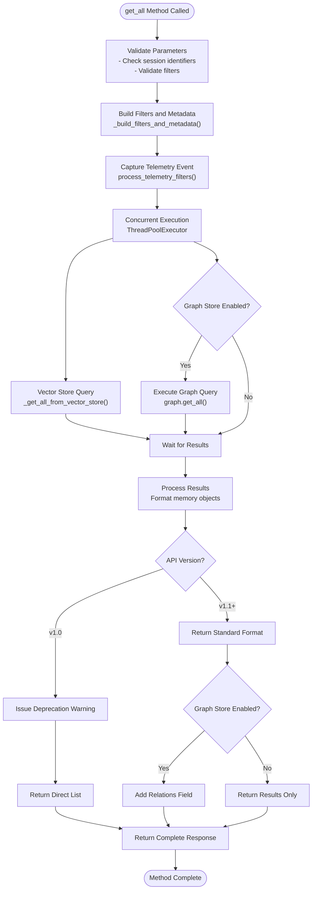

# get_all Method API Documentation

<cite>
**Referenced Files in This Document**
- [main.py](file://mem0/memory/main.py)
- [base.py](file://mem0/memory/base.py)
- [utils.py](file://mem0/memory/utils.py)
- [base.py](file://mem0/vector_stores/base.py)
- [graph_memory.py](file://mem0/memory/graph_memory.py)
- [base.py](file://mem0/graphs/neptune/base.py)
- [base.py](file://mem0-ts/src/oss/src/vector_stores/base.ts)
- [test_memory.py](file://tests/test_memory.py)
- [base.py](file://mem0/configs/base.py)
</cite>

## Table of Contents
1. [Introduction](#introduction)
2. [Method Signature and Parameters](#method-signature-and-parameters)
3. [Core Functionality](#core-functionality)
4. [Return Structure](#return-structure)
5. [Internal Workflow](#internal-workflow)
6. [Pagination and Limiting](#pagination-and-limiting)
7. [Practical Examples](#practical-examples)
8. [Common Issues and Solutions](#common-issues-and-solutions)
9. [Performance Considerations](#performance-considerations)
10. [API Version Compatibility](#api-version-compatibility)

## Introduction

The `get_all()` method is a core API endpoint in the mem0 memory system that enables bulk retrieval of memories within a specified scope. This method serves as the primary mechanism for auditing, monitoring, and accessing collections of memories, supporting both vector store and graph store queries depending on the system configuration.

The method implements sophisticated filtering capabilities with session scoping (user_id, agent_id, run_id), custom metadata filtering, and concurrent execution for optimal performance. It provides backward compatibility with API v1.0 while transitioning to the modern v1.1+ format with standardized response structures.

## Method Signature and Parameters

```python
def get_all(
    self,
    *,
    user_id: Optional[str] = None,
    agent_id: Optional[str] = None,
    run_id: Optional[str] = None,
    filters: Optional[Dict[str, Any]] = None,
    limit: int = 100,
):
```

### Parameter Details

| Parameter | Type | Required | Description |
|-----------|------|----------|-------------|
| `user_id` | `Optional[str]` | No | Unique identifier for the user session, enabling user-specific memory retrieval |
| `agent_id` | `Optional[str]` | No | Unique identifier for the agent session, enabling agent-specific memory retrieval |
| `run_id` | `Optional[str]` | No | Unique identifier for the run/session, enabling session-scoped memory retrieval |
| `filters` | `Optional[Dict[str, Any]]` | No | Additional custom key-value filters for advanced memory filtering |
| `limit` | `int` | No | Maximum number of memories to return, defaults to 100 |

**Key Constraints:**
- At least one of `user_id`, `agent_id`, or `run_id` must be specified
- `filters` parameter accepts arbitrary key-value pairs for metadata-based filtering
- `limit` controls result size and impacts performance characteristics

**Section sources**
- [main.py](file://mem0/memory/main.py#L537-L563)

## Core Functionality

The `get_all()` method implements a comprehensive memory retrieval system with the following core capabilities:

### Session Scoping
The method provides flexible session scoping through multiple identifiers:
- **User-scoped**: Retrieve memories associated with specific users
- **Agent-scoped**: Retrieve memories associated with specific agents  
- **Run-scoped**: Retrieve memories from specific sessions or runs
- **Hybrid scoping**: Combine multiple identifiers for precise targeting

### Filter Construction
Advanced filtering is achieved through the `_build_filters_and_metadata()` utility, which:
- Merges session identifiers with custom filters
- Supports actor-based filtering with `actor_id` precedence
- Validates filter combinations and prevents conflicts
- Handles metadata augmentation for storage templates

### Concurrent Execution
The method employs concurrent execution for optimal performance:
- Vector store queries executed in parallel with graph store queries
- Thread pool executor manages concurrent operations
- Results aggregated and returned as unified response

**Section sources**
- [main.py](file://mem0/memory/main.py#L564-L592)
- [utils.py](file://mem0/memory/utils.py#L46-L125)

## Return Structure

The `get_all()` method returns different response structures based on API version and system configuration:

### API v1.1+ Format (Recommended)
```python
{
    "results": [
        {
            "id": "memory_uuid",
            "memory": "memory_content",
            "created_at": "timestamp",
            "updated_at": "timestamp",
            "user_id": "user_identifier",
            "agent_id": "agent_identifier",
            "run_id": "run_identifier",
            "actor_id": "actor_identifier",
            "role": "message_role",
            "metadata": {
                "custom_key": "custom_value",
                "additional_fields": "values"
            }
        }
    ],
    "relations": [
        {
            "source": "entity_name",
            "relationship": "relationship_type",
            "target": "related_entity"
        }
    ] if graph_store_enabled else None
}
```

### API v1.0 Format (Deprecated)
```python
[
    {
        "id": "memory_uuid",
        "memory": "memory_content",
        "created_at": "timestamp",
        "updated_at": "timestamp",
        "user_id": "user_identifier",
        "agent_id": "agent_identifier",
        "run_id": "run_identifier",
        "actor_id": "actor_identifier",
        "role": "message_role",
        "metadata": {
            "custom_key": "custom_value",
            "additional_fields": "values"
        }
    }
]
```

### Response Fields

| Field | Type | Description |
|-------|------|-------------|
| `id` | `str` | Unique memory identifier |
| `memory` | `str` | Content of the memory |
| `created_at` | `str` | ISO timestamp of creation |
| `updated_at` | `str` | ISO timestamp of last update |
| `user_id` | `Optional[str]` | Associated user identifier |
| `agent_id` | `Optional[str]` | Associated agent identifier |
| `run_id` | `Optional[str]` | Associated run/session identifier |
| `actor_id` | `Optional[str]` | Message actor identifier |
| `role` | `Optional[str]` | Message role (user/assistant/system) |
| `metadata` | `Dict[str, Any]` | Additional custom metadata |
| `relations` | `List[Dict]` | Graph store relationships (when enabled) |

**Section sources**
- [main.py](file://mem0/memory/main.py#L558-L602)

## Internal Workflow

The `get_all()` method follows a sophisticated internal workflow that ensures efficient and accurate memory retrieval:



**Diagram sources**
- [main.py](file://mem0/memory/main.py#L564-L602)

### Step-by-Step Workflow

1. **Parameter Validation**
   - Ensures at least one session identifier is provided
   - Validates filter structures and types
   - Processes telemetry data for monitoring

2. **Filter Construction**
   - Calls `_build_filters_and_metadata()` to merge session and custom filters
   - Applies actor precedence rules for filtering
   - Creates effective query filters for both vector and graph stores

3. **Concurrent Execution**
   - Uses ThreadPoolExecutor for parallel processing
   - Executes vector store query concurrently with graph store query
   - Waits for both operations to complete

4. **Result Processing**
   - Formats vector store results with standardized memory objects
   - Processes graph store results into relationship structures
   - Applies API version compatibility handling

5. **Response Formatting**
   - Returns appropriate format based on API version
   - Includes relations field when graph store is enabled
   - Provides deprecation warnings for legacy API versions

**Section sources**
- [main.py](file://mem0/memory/main.py#L564-L602)
- [utils.py](file://mem0/memory/utils.py#L46-L125)

## Pagination and Limiting

The `limit` parameter controls the maximum number of memories returned and affects both performance and memory usage:

### Limit Behavior
- **Default Value**: 100 memories per request
- **Minimum Value**: 1 (enforced by underlying vector stores)
- **Maximum Value**: System-dependent, typically limited by memory constraints
- **Impact**: Directly affects query performance and response size

### Pagination Strategy
For large datasets, implement pagination using the following approach:

```python
def get_all_paginated(memory_instance, user_id, limit=100):
    """Retrieve all memories with pagination support."""
    offset = 0
    all_memories = []
    
    while True:
        batch = memory_instance.get_all(
            user_id=user_id,
            limit=limit,
            filters={"offset": offset} if offset > 0 else None
        )
        
        if not batch.get("results"):
            break
            
        all_memories.extend(batch["results"])
        offset += limit
        
        # Break if we got less than the full limit
        if len(batch["results"]) < limit:
            break
    
    return {"results": all_memories}
```

### Performance Considerations
- **Small Limits**: Faster response times, reduced memory usage
- **Large Limits**: Comprehensive results, higher resource consumption
- **Batch Processing**: Recommended for large datasets to manage memory usage

**Section sources**
- [main.py](file://mem0/memory/main.py#L544-L545)

## Practical Examples

### Basic User-Specific Retrieval
```python
# Retrieve all memories for a specific user
memories = memory.get_all(user_id="user_123")

# Expected response structure
{
    "results": [
        {
            "id": "mem_abc123",
            "memory": "User mentioned they enjoy hiking",
            "user_id": "user_123",
            "created_at": "2024-01-15T10:30:00Z",
            "updated_at": "2024-01-15T10:30:00Z"
        }
    ]
}
```

### Agent-Specific Memory Retrieval
```python
# Retrieve memories for a specific agent
memories = memory.get_all(agent_id="agent_support_001")

# Response includes agent-specific metadata
{
    "results": [
        {
            "id": "mem_xyz789",
            "memory": "Customer inquiry about refund policy",
            "agent_id": "agent_support_001",
            "role": "assistant",
            "created_at": "2024-01-15T11:45:00Z"
        }
    ]
}
```

### Session-Scoped Retrieval
```python
# Retrieve memories from a specific session/run
memories = memory.get_all(run_id="session_2024_01_15_001")

# Response includes session context
{
    "results": [
        {
            "id": "mem_def456",
            "memory": "Initial conversation about product features",
            "run_id": "session_2024_01_15_001",
            "created_at": "2024-01-15T10:00:00Z"
        }
    ]
}
```

### Advanced Filtering with Custom Metadata
```python
# Filter memories by custom metadata
filters = {
    "category": "technical_support",
    "priority": "high",
    "resolved": False
}

memories = memory.get_all(
    user_id="user_123",
    filters=filters,
    limit=50
)

# Response includes filtered results
{
    "results": [
        {
            "id": "mem_ghi123",
            "memory": "Technical issue with login system",
            "user_id": "user_123",
            "metadata": {
                "category": "technical_support",
                "priority": "high",
                "resolved": False,
                "severity": "critical"
            }
        }
    ]
}
```

### Graph Store Integration
```python
# When graph store is enabled, includes relationships
memories = memory.get_all(user_id="user_123")

# Response includes both memories and relationships
{
    "results": [
        {
            "id": "mem_abc123",
            "memory": "User mentioned they enjoy hiking",
            "user_id": "user_123"
        }
    ],
    "relations": [
        {
            "source": "user_123",
            "relationship": "enjoys",
            "target": "hiking"
        }
    ]
}
```

**Section sources**
- [test_memory.py](file://tests/test_memory.py#L70-L76)

## Common Issues and Solutions

### Missing Session Identifiers
**Problem**: `ValueError: At least one of 'user_id', 'agent_id', or 'run_id' must be specified.`

**Solution**: Always provide at least one session identifier:
```python
# ❌ Incorrect - missing session identifier
memories = memory.get_all()

# ✅ Correct - provide user_id
memories = memory.get_all(user_id="user_123")

# ✅ Alternative - provide agent_id  
memories = memory.get_all(agent_id="agent_001")
```

### Large Result Sets
**Problem**: Memory exhaustion or slow performance with large result sets

**Solution**: Implement pagination or reduce limit:
```python
# Reduce limit for better performance
memories = memory.get_all(user_id="user_123", limit=50)

# Or implement pagination
def get_all_safe(memory_instance, user_id, max_total=1000):
    results = []
    limit = 100
    offset = 0
    
    while len(results) < max_total:
        batch = memory_instance.get_all(
            user_id=user_id,
            limit=limit,
            filters={"offset": offset} if offset > 0 else None
        )
        
        if not batch.get("results"):
            break
            
        results.extend(batch["results"])
        offset += limit
        
        if len(batch["results"]) < limit:
            break
    
    return {"results": results[:max_total]}
```

### API Version Compatibility
**Problem**: Deprecated API format warnings or unexpected response structures

**Solution**: Set API version explicitly:
```python
# Set to use modern API format
config = MemoryConfig(version="v1.1")
memory = Memory(config)

# Or handle both formats
response = memory.get_all(user_id="user_123")
if isinstance(response, list):
    # Legacy v1.0 format
    memories = response
else:
    # Modern v1.1+ format
    memories = response.get("results", [])
```

### Graph Store Not Available
**Problem**: `AttributeError: 'NoneType' object has no attribute 'get_all'`

**Solution**: Check graph store configuration:
```python
# Verify graph store is enabled
if memory.enable_graph:
    response = memory.get_all(user_id="user_123")
    relations = response.get("relations", [])
else:
    # Fallback for systems without graph store
    response = memory.get_all(user_id="user_123")
    relations = []
```

### Filter Validation Issues
**Problem**: Unexpected filter behavior or empty results

**Solution**: Validate filter structure:
```python
# Ensure filters are properly structured
filters = {
    "category": "support",
    "timestamp": {"$gte": "2024-01-01"}
}

try:
    memories = memory.get_all(user_id="user_123", filters=filters)
except Exception as e:
    print(f"Filter validation error: {e}")
    # Adjust filter structure or handle gracefully
```

**Section sources**
- [main.py](file://mem0/memory/main.py#L568-L569)
- [main.py](file://mem0/memory/main.py#L593-L600)

## Performance Considerations

### Memory Usage Optimization
- **Limit Parameter**: Use smaller limits for large datasets to prevent memory exhaustion
- **Pagination**: Implement pagination for datasets exceeding 1000 memories
- **Selective Retrieval**: Use specific session identifiers to minimize scope

### Query Performance
- **Index Utilization**: Ensure vector store indexes are properly configured
- **Filter Efficiency**: Use indexed fields in filters for better performance
- **Concurrent Execution**: Leverage built-in concurrency for vector and graph queries

### Scalability Guidelines
- **Batch Size**: Process memories in batches of 100-500 for optimal performance
- **Connection Pooling**: Reuse memory instances across requests
- **Monitoring**: Track query duration and memory usage for capacity planning

### Best Practices
```python
# Efficient memory retrieval pattern
def efficient_memory_retrieval(memory_instance, user_id, category=None):
    """Efficient memory retrieval with performance optimization."""
    
    # Use reasonable limits
    limit = 100
    
    # Apply filters efficiently
    filters = {}
    if category:
        filters["category"] = category
    
    # Execute query
    try:
        response = memory_instance.get_all(
            user_id=user_id,
            filters=filters,
            limit=limit
        )
        
        return response.get("results", [])
        
    except Exception as e:
        logger.error(f"Memory retrieval failed: {e}")
        return []
```

**Section sources**
- [main.py](file://mem0/memory/main.py#L576-L588)

## API Version Compatibility

The `get_all()` method maintains backward compatibility while transitioning to modern API standards:

### Version Detection
```python
# Check current API version
print(memory.api_version)  # "v1.1" or "v1.0"

# Configure for specific version
config = MemoryConfig(version="v1.0")  # Legacy format
config = MemoryConfig(version="v1.1")  # Modern format (recommended)
```

### Migration Strategy
- **Current Status**: v1.0 format returns direct lists, v1.1+ returns structured dictionaries
- **Migration Timeline**: v1.0 format is deprecated and will be removed in mem0ai 1.1.0+
- **Recommendation**: Set `api_version="v1.1"` for new implementations

### Response Format Comparison

| Aspect | v1.0 Format | v1.1+ Format |
|--------|-------------|--------------|
| **Structure** | Direct list of memories | Dictionary with "results" key |
| **Relations** | Not supported | Included in "relations" key when graph store enabled |
| **Backward Compatibility** | Yes | No (deprecated) |
| **Recommended** | No | Yes |

### Deprecation Handling
The method includes automatic deprecation warnings for v1.0 usage:
```python
# Warning issued when using v1.0 format
warnings.warn(
    "The current get_all API output format is deprecated. "
    "To use the latest format, set `api_version='v1.1'`...",
    category=DeprecationWarning,
    stacklevel=2
)
```

**Section sources**
- [main.py](file://mem0/memory/main.py#L593-L600)
- [base.py](file://mem0/configs/base.py#L49-L51)