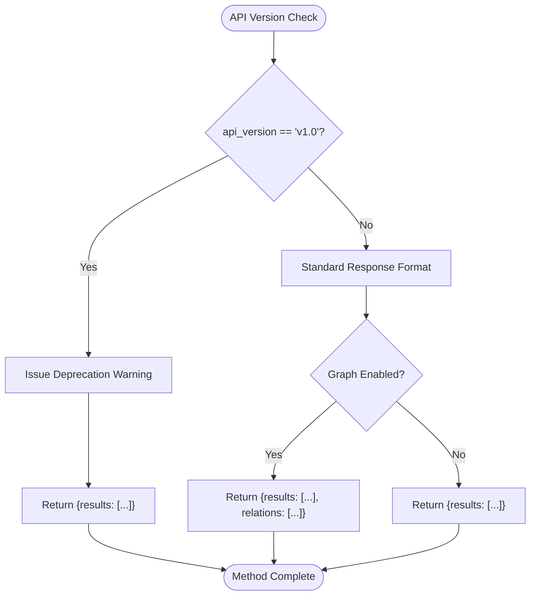
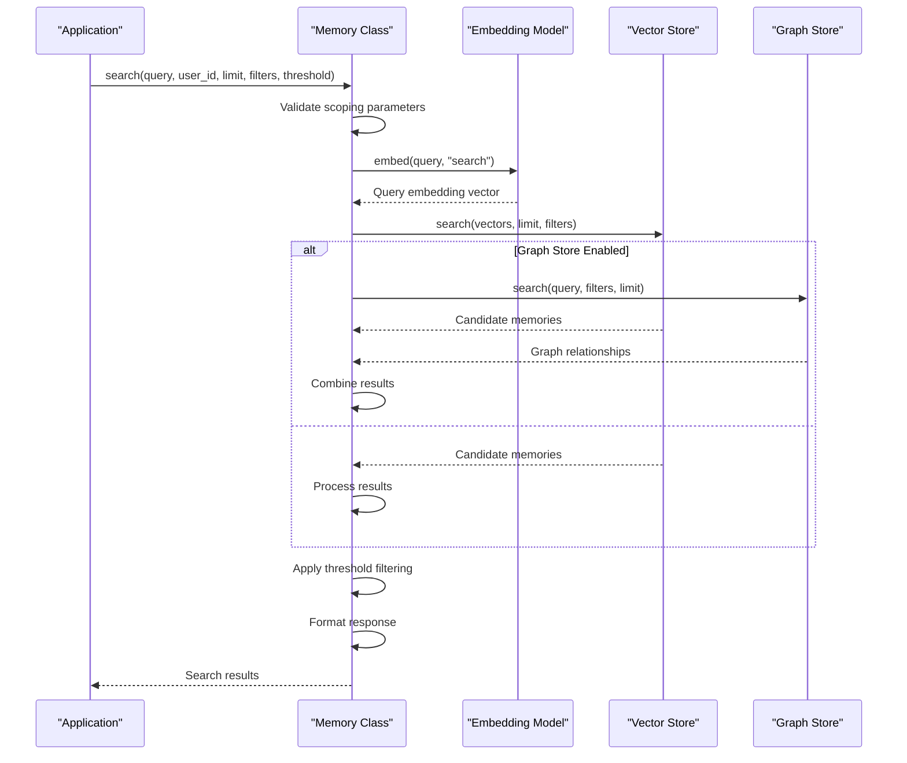

# search Method

<cite>
**Referenced Files in This Document**   
- [main.py](file://mem0/memory/main.py)
- [utils.py](file://mem0/memory/utils.py)
- [graph_memory.py](file://mem0/memory/graph_memory.py)
</cite>

## Table of Contents
1. [Introduction](#introduction)
2. [Core Functionality](#core-functionality)
3. [Parameters](#parameters)
4. [Return Structure](#return-structure)
5. [API Version Differences](#api-version-differences)
6. [Internal Process](#internal-process)
7. [Promoted Payload Fields](#promoted-payload-fields)
8. [Practical Examples](#practical-examples)
9. [Common Issues and Troubleshooting](#common-issues-and-troubleshooting)
10. [Performance Optimization](#performance-optimization)

## Introduction
The `search()` method of the Memory class provides semantic search capabilities across stored memories using vector similarity. This method enables users to find relevant memories by converting a text query into an embedding vector and searching for similar vectors in the vector store. The search can be scoped to specific users, agents, or runs, and supports additional filtering, result limiting, and similarity thresholding. This documentation provides comprehensive details about the method's functionality, parameters, return structure, and usage patterns.

**Section sources**
- [main.py](file://mem0/memory/main.py#L643-L717)

## Core Functionality
The `search()` method performs semantic search across memories by leveraging vector similarity. When a query is provided, the method first generates an embedding vector from the query text using the configured embedding model. This query vector is then used to search the vector store for similar vectors, with results ranked by their similarity scores (cosine similarity). The method supports scoped searches through user_id, agent_id, or run_id parameters, allowing for targeted memory retrieval within specific contexts. The search process is optimized through concurrent execution of vector and graph store queries when enabled, ensuring efficient retrieval of relevant memories.

The method implements a two-phase search process: first retrieving candidate memories from the vector store based on vector similarity, then optionally enriching results with graph relationships when the graph store is enabled. This hybrid approach combines the strengths of vector-based semantic search with graph-based relationship discovery, providing comprehensive results that capture both content similarity and contextual relationships.

**Section sources**
- [main.py](file://mem0/memory/main.py#L643-L717)
- [main.py](file://mem0/memory/main.py#L720-L756)

## Parameters
The `search()` method accepts the following parameters:

- **query** (str): The search text to find relevant memories. This is the primary input for the semantic search and is converted into an embedding vector for similarity matching.

- **user_id** (Optional[str]): ID of the user to scope the search. When provided, the search is limited to memories associated with this user. At least one of user_id, agent_id, or run_id must be specified.

- **agent_id** (Optional[str]): ID of the agent to scope the search. When provided, the search is limited to memories associated with this agent. At least one of user_id, agent_id, or run_id must be specified.

- **run_id** (Optional[str]): ID of the run to scope the search. When provided, the search is limited to memories associated with this specific run. At least one of user_id, agent_id, or run_id must be specified.

- **limit** (int): The maximum number of results to return. Defaults to 100. This parameter controls the size of the result set and can be adjusted based on performance requirements and use case needs.

- **filters** (Optional[Dict[str, Any]]): Additional constraints to apply to the search. These filters are combined with the scoping filters (user_id, agent_id, run_id) and can include custom key-value pairs for more granular filtering.

- **threshold** (Optional[float]): Minimum similarity score for a memory to be included in the results. Memories with scores below this threshold are filtered out. The score represents cosine similarity, with higher values indicating greater similarity (typically in the range of 0.0 to 1.0).

**Section sources**
- [main.py](file://mem0/memory/main.py#L643-L664)

## Return Structure
The `search()` method returns a dictionary containing the search results. For API version v1.1 and later, the structure is standardized with results contained in a "results" key:

```json
{
  "results": [
    {
      "id": "memory_id",
      "memory": "memory content",
      "score": 0.95,
      "user_id": "user_123",
      "created_at": "2023-01-01T00:00:00",
      "updated_at": "2023-01-02T00:00:00",
      "metadata": {
        "additional_field": "value"
      }
    }
  ],
  "relations": [
    {
      "source": "entity1",
      "relationship": "knows",
      "destination": "entity2"
    }
  ]
}
```

Each memory item in the results array contains:
- **id**: Unique identifier for the memory
- **memory**: The actual memory content (previously stored as "data" in the payload)
- **score**: Similarity score between the query and memory (cosine similarity)
- **user_id/agent_id/run_id**: Scoped identifiers (promoted from payload)
- **created_at/updated_at**: Timestamps for memory creation and updates
- **metadata**: Additional fields from the payload that are not promoted
- **hash**: MD5 hash of the memory content

When the graph store is enabled, the response also includes a "relations" key containing graph relationships discovered during the search.

**Section sources**
- [main.py](file://mem0/memory/main.py#L665-L669)
- [main.py](file://mem0/memory/main.py#L736-L752)

## API Version Differences
The `search()` method behavior differs between API versions v1.0 and v1.1+:

### v1.0 (Deprecated)
- Returns results directly as a dictionary with a "results" key
- Issues a deprecation warning when called
- Will be removed in future versions (mem0ai 1.1.0 and later)
- Example return: `{"results": [...]}`

### v1.1+ (Current)
- Returns results in a standardized format with a "results" key
- No deprecation warning
- Supports graph store results in a "relations" key when enabled
- Example return: `{"results": [...], "relations": [...]}` (when graph enabled)

The v1.1+ version provides a more consistent and extensible response format, allowing for additional result types (like graph relationships) to be included without breaking changes. Users are strongly encouraged to migrate to v1.1+ by setting the `api_version` parameter to 'v1.1' in their Memory configuration to avoid future compatibility issues.



**Diagram sources **
- [main.py](file://mem0/memory/main.py#L708-L716)
- [main.py](file://mem0/memory/main.py#L1581-L1588)

**Section sources**
- [main.py](file://mem0/memory/main.py#L708-L716)
- [main.py](file://mem0/memory/main.py#L1581-L1588)

## Internal Process
The `search()` method follows a systematic internal process to retrieve relevant memories:



**Diagram sources **
- [main.py](file://mem0/memory/main.py#L691-L703)
- [main.py](file://mem0/memory/main.py#L1562-L1576)

**Section sources**
- [main.py](file://mem0/memory/main.py#L691-L703)
- [main.py](file://mem0/memory/main.py#L1562-L1576)

The process begins with parameter validation, ensuring that at least one scoping identifier (user_id, agent_id, or run_id) is provided. The query text is then converted into an embedding vector using the configured embedding model. This embedding is used to search the vector store for similar vectors, with the search constrained by the provided filters and limited by the specified result count.

Concurrently, if the graph store is enabled, a separate search is initiated to find relevant graph relationships. The vector store search and graph store search execute in parallel using a ThreadPoolExecutor for synchronous calls or asyncio for asynchronous calls, optimizing performance. Once both searches complete, the results are combined, with vector store results forming the primary "results" and graph store results included as "relations" when applicable.

The final step involves filtering results based on the threshold parameter, where memories with similarity scores below the threshold are excluded from the results. The remaining memories are formatted into the response structure, with certain payload fields promoted to top-level properties and additional metadata preserved in a separate "metadata" object.

## Promoted Payload Fields
The `search()` method promotes certain fields from the memory payload to top-level properties in the response for easier access. These promoted fields are extracted from the payload and included directly in the result object, avoiding the need to access them through nested structures.

The following fields are promoted from the payload:

- **user_id**: User identifier for scoping
- **agent_id**: Agent identifier for scoping  
- **run_id**: Run identifier for scoping
- **actor_id**: Actor identifier for message attribution
- **role**: Role of the message (user, assistant, system)

These fields are considered essential for context and are therefore elevated to the top level of the response. All other fields in the payload that are not in this promoted list are consolidated into a "metadata" object in the response. This design provides a clean separation between core memory properties and additional metadata, making the API response more intuitive to work with while preserving all stored information.

The promotion logic is implemented in the `_search_vector_store` method, which processes each memory result and constructs the final response structure. This ensures consistent field promotion across all search operations, regardless of the vector store backend being used.

**Section sources**
- [main.py](file://mem0/memory/main.py#L724-L730)
- [main.py](file://mem0/memory/main.py#L745-L748)

## Practical Examples
The `search()` method supports various search scenarios through different parameter combinations:

### Basic Semantic Search
```python
# Basic search for memories related to "favorite foods"
results = memory.search("favorite foods", user_id="user_123")
```

### Filtered Searches
```python
# Search with multiple scoping parameters
results = memory.search(
    "travel plans", 
    user_id="user_123", 
    agent_id="agent_456",
    run_id="run_789"
)

# Search with custom filters
results = memory.search(
    "important meetings",
    user_id="user_123",
    filters={"priority": "high", "category": "work"}
)
```

### Threshold-Based Filtering
```python
# Search with minimum similarity threshold
results = memory.search(
    "weekend activities",
    user_id="user_123",
    threshold=0.8  # Only return memories with 80%+ similarity
)

# Search with low threshold for broader results
results = memory.search(
    "hobbies",
    user_id="user_123",
    threshold=0.3,  # Include less similar memories
    limit=50
)
```

### Graph-Enhanced Search
```python
# Enable graph store for relationship discovery
memory.enable_graph = True
results = memory.search(
    "Alice's friends", 
    user_id="user_123"
)
# Results include both memories and graph relationships
```

These examples demonstrate the flexibility of the `search()` method in handling different search requirements. The basic search provides simple semantic matching, while filtered searches allow for precise scoping and additional constraints. Threshold-based filtering enables control over result relevance, with higher thresholds returning only the most similar memories and lower thresholds providing more comprehensive but potentially less relevant results.

**Section sources**
- [main.py](file://mem0/memory/main.py#L643-L717)
- [graph_memory.py](file://mem0/memory/graph_memory.py#L95-L129)

## Common Issues and Troubleshooting
The `search()` method may encounter several common issues that can affect search quality and performance:

### Low Recall
Low recall (few results returned) is often caused by an overly restrictive similarity threshold. When the threshold is set too high, many potentially relevant memories may be filtered out due to insufficient similarity scores.

**Solution**: Adjust the threshold parameter to a lower value:
```python
# If getting too few results
results = memory.search("query", user_id="user_123", threshold=0.9)  # Too restrictive

# Adjust to lower threshold for better recall
results = memory.search("query", user_id="user_123", threshold=0.6)  # More inclusive
```

### Performance Issues with Large Vector Spaces
Searching large vector spaces can lead to performance degradation, especially when no scoping parameters are provided or when the result limit is very high.

**Solutions**:
1. Always specify scoping parameters (user_id, agent_id, or run_id) to limit the search space
2. Use appropriate limits based on actual needs (default is 100)
3. Implement caching for frequent queries
4. Consider using vector databases with optimized indexing for large datasets

```python
# Poor performance - searching entire database
results = memory.search("query", limit=1000)  # Large limit, no scoping

# Improved performance - scoped search with reasonable limit
results = memory.search(
    "query", 
    user_id="user_123",  # Scoped to user
    limit=50  # Reasonable limit
)
```

### Missing Required Parameters
The method requires at least one scoping parameter (user_id, agent_id, or run_id). Omitting all scoping parameters will raise a ValueError.

**Solution**: Always provide at least one scoping parameter:
```python
# This will raise an error
results = memory.search("query")  # Missing scoping parameter

# Correct usage
results = memory.search("query", user_id="user_123")
```

### Deprecated API Version Warning
Users of API version v1.0 will see deprecation warnings, indicating that the current format will be removed in future versions.

**Solution**: Migrate to v1.1+ by setting the api_version in configuration:
```python
config = MemoryConfig(version="v1.1")
memory = Memory(config)
```

**Section sources**
- [main.py](file://mem0/memory/main.py#L674-L676)
- [main.py](file://mem0/memory/main.py#L708-L716)

## Performance Optimization
Optimizing the `search()` method performance involves several strategies that address both query efficiency and system resource utilization:

### Search Performance Tips
1. **Use Appropriate Scoping**: Always specify the most specific scoping parameter available (user_id, agent_id, or run_id) to minimize the search space.
2. **Optimize Result Limits**: Set the limit parameter to the minimum number of results actually needed, as larger limits increase processing time.
3. **Tune Similarity Thresholds**: Balance precision and recall by adjusting the threshold parameter based on use case requirements.
4. **Leverage Filters**: Use additional filters to further constrain searches when possible, reducing the number of vectors that need to be compared.

### Relevance Tuning
1. **Threshold Adjustment**: For high-precision needs, use higher thresholds (0.8-0.9); for comprehensive results, use lower thresholds (0.5-0.7).
2. **Query Formulation**: Use clear, specific query terms that match the vocabulary likely to be found in stored memories.
3. **Embedding Model Selection**: Choose embedding models that are well-suited to the domain and language of the stored memories.

### System-Level Optimization
1. **Vector Database Configuration**: Ensure the underlying vector database is properly configured with appropriate indexing for the expected query patterns.
2. **Concurrency Management**: The method already uses concurrent execution for vector and graph searches, but ensure the system has adequate resources to handle parallel operations.
3. **Caching Strategy**: Implement application-level caching for frequently repeated queries to avoid redundant vector computations and database searches.

By following these optimization guidelines, users can achieve faster search response times and more relevant results, enhancing the overall effectiveness of the memory system.

**Section sources**
- [main.py](file://mem0/memory/main.py#L691-L703)
- [main.py](file://mem0/memory/main.py#L720-L756)