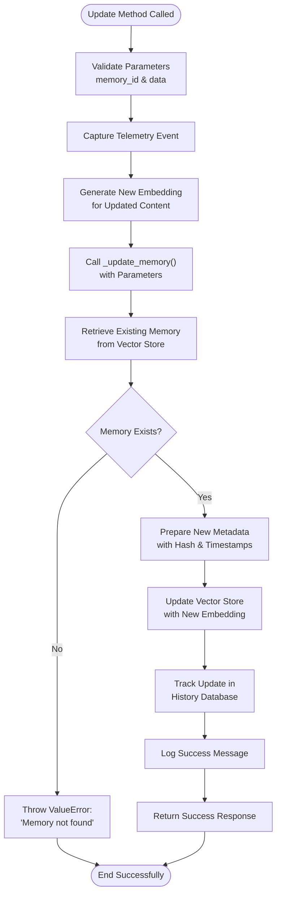
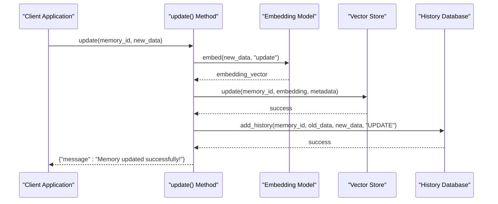

# update Method API Documentation

<cite>
**Referenced Files in This Document**
- [main.py](file://mem0/memory/main.py)
- [index.ts](file://mem0-ts/src/oss/src/memory/index.ts)
- [storage.py](file://mem0/memory/storage.py)
- [SQLiteManager.ts](file://mem0-ts/src/oss/src/storage/SQLiteManager.ts)
- [memory.test.ts](file://mem0-ts/src/oss/src/tests/memory.test.ts)
- [main.py](file://mem0/client/main.py)
- [mem0.ts](file://mem0-ts/src/client/mem0.ts)
</cite>

## Table of Contents
1. [Introduction](#introduction)
2. [Method Signature and Parameters](#method-signature-and-parameters)
3. [Return Structure](#return-structure)
4. [Internal Workflow](#internal-workflow)
5. [Comparison with Inference-Based Updates](#comparison-with-inference-based-updates)
6. [Practical Examples](#practical-examples)
7. [Common Issues and Solutions](#common-issues-and-solutions)
8. [Data Consistency Considerations](#data-consistency-considerations)
9. [API Version Compatibility](#api-version-compatibility)
10. [Troubleshooting Guide](#troubleshooting-guide)

## Introduction

The `update()` method is a core API endpoint in the mem0 memory management system that enables direct modification of existing memory entries by their unique identifiers. This method serves as the primary mechanism for maintaining accurate and current memory records by allowing developers to programmatically update memory content while preserving the integrity of the underlying vector store and history tracking systems.

Unlike the inference-based update mechanisms employed during the `add()` operation, the `update()` method bypasses the natural language processing and memory inference pipeline, providing immediate and deterministic content replacement with minimal computational overhead.

## Method Signature and Parameters

### Python Implementation

The Python `update()` method accepts two primary parameters:

```python
def update(self, memory_id, data):
```

### TypeScript Implementation

The TypeScript equivalent provides similar functionality with type-safe parameter handling:

```typescript
async update(memoryId: string, data: string): Promise<{ message: string }>
```

### Parameter Details

| Parameter | Type | Description | Required |
|-----------|------|-------------|----------|
| `memory_id` | string | Unique identifier of the memory to be updated | Yes |
| `data` | string | New content to replace the existing memory content | Yes |

**Parameter Validation:**
- `memory_id` must correspond to an existing memory entry in the vector store
- `data` should be a non-empty string representing the new memory content
- Both parameters undergo validation before processing begins

**Section sources**
- [main.py](file://mem0/memory/main.py#L757-L777)
- [index.ts](file://mem0-ts/src/oss/src/memory/index.ts#L483-L488)

## Return Structure

The `update()` method consistently returns a standardized success message dictionary across all API versions:

### Standard Success Response

```json
{
    "message": "Memory updated successfully!"
}
```

### Response Characteristics

- **Consistency**: The return structure remains identical across API v1.0 and v1.1+
- **Success Indicator**: The presence of the success message confirms successful execution
- **Minimal Overhead**: The response contains only essential information to confirm operation completion

### API Version Compatibility

The method maintains backward compatibility with API v1.0 while providing enhanced functionality in v1.1+:

- **v1.0**: Returns the success message directly
- **v1.1+**: Maintains the same response structure while enabling additional features

**Section sources**
- [main.py](file://mem0/memory/main.py#L777-L778)
- [index.ts](file://mem0-ts/src/oss/src/memory/index.ts#L487-L488)

## Internal Workflow

The `update()` method follows a carefully orchestrated workflow that ensures data integrity and maintains audit trails:



**Diagram sources**
- [main.py](file://mem0/memory/main.py#L757-L777)
- [index.ts](file://mem0-ts/src/oss/src/memory/index.ts#L483-L488)

### Step-by-Step Process

1. **Parameter Validation**: The method validates input parameters before proceeding
2. **Telemetry Capture**: An event is logged for monitoring and analytics
3. **Embedding Generation**: New vector embeddings are created for the updated content
4. **Private Method Delegation**: The operation delegates to the protected `_update_memory()` method
5. **Existing Memory Retrieval**: The current memory content is fetched from the vector store
6. **Existence Verification**: The method verifies the existence of the target memory
7. **Metadata Preparation**: New metadata is constructed with updated timestamps and content hashes
8. **Vector Store Update**: The vector store is updated with the new embedding and metadata
9. **History Tracking**: The change is recorded in the SQLite history database
10. **Success Confirmation**: A standardized success message is returned

**Section sources**
- [main.py](file://mem0/memory/main.py#L757-L777)
- [index.ts](file://mem0-ts/src/oss/src/memory/index.ts#L483-L488)

## Comparison with Inference-Based Updates

The `update()` method differs fundamentally from the inference-based updates performed during `add()` operations:

### Direct vs. Inference-Based Updates

| Aspect | `update()` Method | `add()` Operation |
|--------|-------------------|-------------------|
| **Processing Pipeline** | Direct content replacement | Natural language processing + inference |
| **Content Modification** | Immediate and deterministic | Conditional based on LLM analysis |
| **Computational Cost** | Minimal (embedding generation only) | Higher (LLM processing, vector operations) |
| **Memory Inference** | Bypassed entirely | Central to the operation |
| **Content Validation** | Basic parameter validation | Comprehensive semantic analysis |
| **Use Case** | Programmatic updates | Natural conversation processing |

### Technical Differences

**Direct Update (`update()`):**
- Operates solely on the provided `data` parameter
- Generates embeddings only for the new content
- Updates the vector store immediately
- Records the change in the history database
- Minimal computational overhead

**Inference-Based Update (`add()`):**
- Processes incoming messages through LLM
- Extracts facts and determines update actions
- May trigger ADD, UPDATE, or DELETE operations
- Performs semantic similarity matching
- More computationally intensive

### When to Use Each Method

- **Use `update()`** when you need immediate, programmatic content replacement
- **Use `add()`** when processing natural language conversations that require semantic analysis

**Section sources**
- [main.py](file://mem0/memory/main.py#L757-L777)
- [index.ts](file://mem0-ts/src/oss/src/memory/index.ts#L483-L488)

## Practical Examples

### Basic Memory Update

**Python Example:**
```python
# Update a factual memory
result = memory.update(
    memory_id="mem_12345",
    data="Likes to play tennis on weekends"
)
print(result)
# Output: {'message': 'Memory updated successfully!'}
```

**TypeScript Example:**
```typescript
// Update a procedural memory
const result = await memory.update(
    "mem_12345",
    "Updated content reflecting new preferences"
);
console.log(result);
// Output: { message: "Memory updated successfully!" }
```

### Updating Factual Memories

**Real-world Scenario:**
```python
# Update personal preference
memory.update(
    memory_id="person_preferences_001",
    data="Prefers Italian cuisine over Mexican"
)

# Update professional skill
memory.update(
    memory_id="skill_set_002",
    data="Proficient in Python, JavaScript, and React"
)
```

### Updating Procedural Memories

**Use Case Example:**
```python
# Update workflow procedure
memory.update(
    memory_id="workflow_step_005",
    data="Send notification email after order confirmation"
)

# Update decision-making criteria
memory.update(
    memory_id="decision_rule_003",
    data="Approve orders under $1000 without manager review"
)
```

### Batch Update Operations

While the `update()` method operates on individual memories, batch operations can be implemented:

```python
# Batch update example (not built-in, requires custom implementation)
memory_updates = [
    {"memory_id": "mem_001", "data": "Updated content 1"},
    {"memory_id": "mem_002", "data": "Updated content 2"},
    {"memory_id": "mem_003", "data": "Updated content 3"}
]

for update in memory_updates:
    memory.update(update["memory_id"], update["data"])
```

**Section sources**
- [main.py](file://mem0/memory/main.py#L757-L777)
- [index.ts](file://mem0-ts/src/oss/src/memory/index.ts#L483-L488)
- [memory.test.ts](file://mem0-ts/src/oss/src/tests/memory.test.ts#L100-L121)

## Common Issues and Solutions

### Issue 1: Memory Not Found

**Problem:** Attempting to update a non-existent memory ID

**Error Message:**
```python
ValueError: Error getting memory with ID mem_nonexistent. Please provide a valid 'memory_id'
```

**Solution:**
```python
# Verify memory exists before updating
existing_memory = memory.get(memory_id)
if existing_memory:
    memory.update(memory_id, new_data)
else:
    print(f"Memory {memory_id} does not exist")
```

### Issue 2: Empty Data Parameter

**Problem:** Providing empty or null data for update

**Solution:**
```python
# Validate data before update
if not data or not data.strip():
    raise ValueError("Update data cannot be empty")

memory.update(memory_id, data)
```

### Issue 3: Concurrent Modifications

**Problem:** Multiple simultaneous updates to the same memory

**Mitigation Strategies:**
```python
# Implement optimistic locking
try:
    memory.update(memory_id, new_data)
except Exception as e:
    # Handle concurrent modification scenarios
    if "memory not found" in str(e):
        # Retry logic or user notification
        pass
```

### Issue 4: Large Content Updates

**Problem:** Updating with excessively large content

**Solution:**
```python
# Implement content size validation
MAX_CONTENT_SIZE = 10000  # 10KB limit

if len(data) > MAX_CONTENT_SIZE:
    data = data[:MAX_CONTENT_SIZE]  # Truncate or notify user
    print("Content was truncated to fit size limits")
```

### Issue 5: Encoding Problems

**Problem:** Character encoding issues with special characters

**Solution:**
```python
# Ensure proper encoding
data = data.encode('utf-8').decode('utf-8')

# Handle special characters
data = data.replace('\u2019', "'")  # Replace smart quotes
```

**Section sources**
- [main.py](file://mem0/memory/main.py#L913-L916)
- [index.ts](file://mem0-ts/src/oss/src/memory/index.ts#L652-L654)

## Data Consistency Considerations

### Embedding Regeneration

The `update()` method automatically regenerates vector embeddings for the new content:



**Diagram sources**
- [main.py](file://mem0/memory/main.py#L774-L776)
- [index.ts](file://mem0-ts/src/oss/src/memory/index.ts#L485-L486)

### Hash Generation

Each update generates a new MD5 hash for content verification:

- **Purpose**: Detect content changes and ensure data integrity
- **Implementation**: Uses `hashlib.md5(data.encode()).hexdigest()`
- **Verification**: Enables detection of identical content updates

### Timestamp Management

The method maintains accurate temporal information:

- **Created At**: Preserved from the original memory
- **Updated At**: Automatically generated using UTC timezone
- **Audit Trail**: Complete history of modifications

### Atomic Operations

The update process ensures atomicity:

1. **Embedding Generation**: Completed before vector store modification
2. **Vector Store Update**: Applied only after successful embedding generation
3. **History Recording**: Logged immediately after vector store update
4. **Error Handling**: Rollback capabilities for partial failures

**Section sources**
- [main.py](file://mem0/memory/main.py#L918-L937)
- [index.ts](file://mem0-ts/src/oss/src/memory/index.ts#L657-L676)

## API Version Compatibility

### Version Support Matrix

| API Version | Feature Support | Return Format | Compatibility Notes |
|-------------|----------------|---------------|-------------------|
| v1.0 | Basic update functionality | Direct success message | Deprecated, will be removed |
| v1.1+ | Enhanced features | Standardized success message | Recommended for new implementations |

### Migration Guidelines

**From v1.0 to v1.1+:**
```python
# v1.0 (deprecated)
result = memory.update("mem_123", "new content")
# Returns: "Memory updated successfully!"

# v1.1+ (recommended)
result = memory.update("mem_123", "new content")
# Returns: {"message": "Memory updated successfully!"}
```

### Backward Compatibility

The `update()` method maintains backward compatibility for:
- Parameter signatures
- Return value structure
- Error handling patterns
- Database operations

**Section sources**
- [main.py](file://mem0/memory/main.py#L777-L778)
- [index.ts](file://mem0-ts/src/oss/src/memory/index.ts#L487-L488)

## Troubleshooting Guide

### Debugging Update Failures

**Enable Debug Logging:**
```python
import logging
logging.basicConfig(level=logging.DEBUG)

# Enable debug logs for memory operations
memory.update(memory_id, data)
```

**Common Debug Scenarios:**

1. **Memory Not Found**
   ```python
   # Debug: Check if memory exists
   existing = memory.get(memory_id)
   if not existing:
       print(f"Memory {memory_id} does not exist")
   ```

2. **Vector Store Issues**
   ```python
   # Debug: Test vector store connectivity
   try:
       embeddings = memory.embedding_model.embed("test")
       print("Embedding successful")
   except Exception as e:
       print(f"Embedding failed: {e}")
   ```

3. **History Database Problems**
   ```python
   # Debug: Check history database
   try:
       history = memory.db.get_history(memory_id)
       print(f"History entries: {len(history)}")
   except Exception as e:
       print(f"History database error: {e}")
   ```

### Performance Optimization

**Optimization Strategies:**

1. **Batch Size Management**: Process updates in appropriate batch sizes
2. **Connection Pooling**: Reuse database connections when possible
3. **Embedding Caching**: Cache frequently updated embeddings
4. **Async Operations**: Use asynchronous methods for high-throughput scenarios

**Monitoring and Metrics:**

```python
# Monitor update performance
import time

start_time = time.time()
result = memory.update(memory_id, data)
end_time = time.time()

print(f"Update completed in {end_time - start_time:.2f} seconds")
```

### Error Recovery

**Graceful Degradation:**
```python
def safe_update(memory, memory_id, data, max_retries=3):
    for attempt in range(max_retries):
        try:
            return memory.update(memory_id, data)
        except Exception as e:
            if attempt == max_retries - 1:
                raise e
            time.sleep(2 ** attempt)  # Exponential backoff
```

**Section sources**
- [main.py](file://mem0/memory/main.py#L773-L774)
- [index.ts](file://mem0-ts/src/oss/src/memory/index.ts#L483-L484)