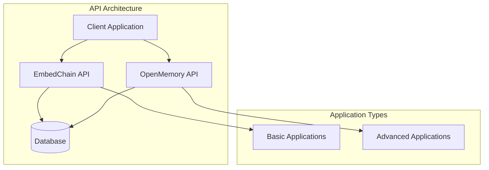
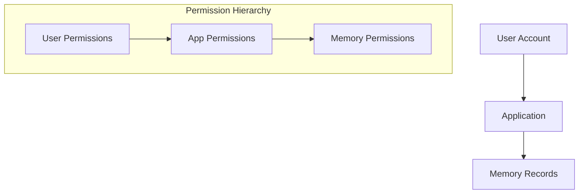
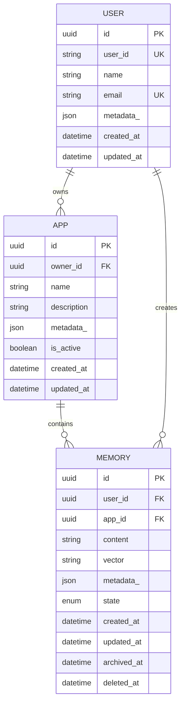
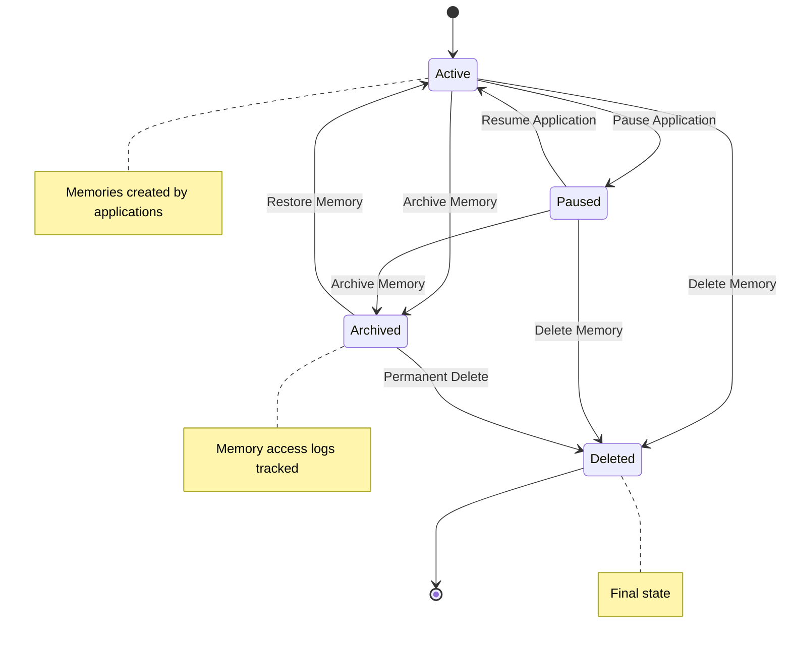
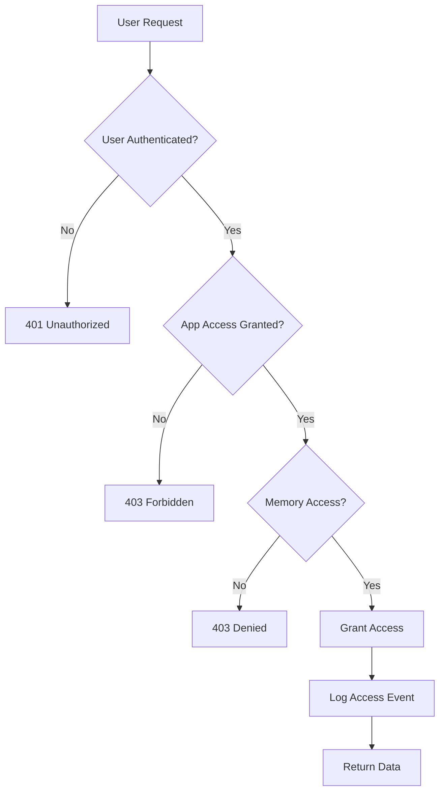

# Applications Endpoints

<cite>
**Referenced Files in This Document**
- [apps.py](file://openmemory/api/app/routers/apps.py)
- [models.py](file://openmemory/api/app/models.py)
- [schemas.py](file://openmemory/api/app/schemas.py)
- [database.py](file://openmemory/api/app/database.py)
- [main.py](file://embedchain/examples/rest-api/main.py)
- [models.py](file://embedchain/examples/rest-api/models.py)
- [services.py](file://embedchain/examples/rest-api/services.py)
- [memories.py](file://openmemory/api/app/routers/memories.py)
- [rest-api.json](file://embedchain/docs/rest-api.json)
</cite>

## Table of Contents
1. [Introduction](#introduction)
2. [API Overview](#api-overview)
3. [Authentication and Permissions](#authentication-and-permissions)
4. [Application Data Model](#application-data-model)
5. [REST API Endpoints](#rest-api-endpoints)
6. [Relationship Between Applications and Memories](#relationship-between-applications-and-memories)
7. [Use Cases and Best Practices](#use-cases-and-best-practices)
8. [Error Handling](#error-handling)
9. [Troubleshooting Guide](#troubleshooting-guide)

## Introduction

The Applications REST API provides comprehensive endpoints for managing applications within the OpenMemory system. Applications serve as containers for organizing and managing memories, enabling structured data organization and access control. This API supports full CRUD operations for applications while maintaining strong relationships with the underlying memory system.

The API follows RESTful principles and provides both basic EmbedChain-style applications and advanced OpenMemory applications with sophisticated access control and memory organization capabilities.

## API Overview

The Applications API consists of two main implementations:

### EmbedChain Applications API
- **Base URL**: `/`
- **Features**: Basic CRUD operations for applications
- **Use Case**: Simple application management for EmbedChain integrations

### OpenMemory Applications API  
- **Base URL**: `/api/v1/apps`
- **Features**: Advanced application management with memory statistics and access control
- **Use Case**: Enterprise-grade application management with detailed analytics



**Diagram sources**
- [main.py](file://embedchain/examples/rest-api/main.py#L29-L46)
- [apps.py](file://openmemory/api/app/routers/apps.py#L10-L11)

## Authentication and Permissions

### EmbedChain API Authentication
The EmbedChain API uses a simple token-based authentication system:

```python
# Authentication header format
headers = {"Authorization": f"Token {api_key}"}
```

### OpenMemory API Authentication
The OpenMemory API implements role-based access control with user and app-level permissions:

#### User Authentication
- **User ID**: Unique identifier for user accounts
- **API Keys**: Used for service-to-service authentication
- **Session Management**: Based on user sessions and API keys

#### Permission Controls
The system implements fine-grained access control through:

1. **User-Level Permissions**: Control access to user resources
2. **App-Level Permissions**: Control access to application resources
3. **Memory-Level Permissions**: Control access to individual memories



**Diagram sources**
- [memories.py](file://openmemory/api/app/routers/memories.py#L60-L97)
- [models.py](file://openmemory/api/app/models.py#L132-L145)

**Section sources**
- [main.py](file://embedchain/examples/rest-api/main.py#L90-L91)
- [memories.py](file://openmemory/api/app/routers/memories.py#L60-L97)

## Application Data Model

### EmbedChain Application Model
The basic application model includes essential fields for application management:

| Field | Type | Description | Required |
|-------|------|-------------|----------|
| app_id | String | Unique application identifier | Yes |
| config | String | Configuration file path | Yes |

### OpenMemory Application Model
The advanced application model provides comprehensive metadata and relationships:

| Field | Type | Description | Required |
|-------|------|-------------|----------|
| id | UUID | Unique application identifier | Yes |
| owner_id | UUID | User who owns the application | Yes |
| name | String | Human-readable application name | Yes |
| description | String | Application description | No |
| metadata_ | JSON | Additional metadata | No |
| is_active | Boolean | Application activation status | Yes |
| created_at | DateTime | Creation timestamp | Yes |
| updated_at | DateTime | Last update timestamp | Yes |

### Application Relationships



**Diagram sources**
- [models.py](file://openmemory/api/app/models.py#L37-L68)
- [models.py](file://openmemory/api/app/models.py#L85-L109)

**Section sources**
- [models.py](file://openmemory/api/app/models.py#L53-L68)
- [models.py](file://embedchain/examples/rest-api/models.py#L41-L46)

## REST API Endpoints

### EmbedChain Applications API

#### POST /create
Creates a new application with optional configuration.

**Request Body Schema:**
```json
{
  "app_id": "string",
  "config": "file" // Optional YAML configuration file
}
```

**Response:**
```json
{
  "response": "App created successfully. App ID: {app_id}"
}
```

**cURL Example:**
```bash
curl -X POST "http://localhost:8080/create" \
  -H "Content-Type: multipart/form-data" \
  -F "app_id=my-app" \
  -F "config=@config.yaml"
```

#### GET /apps
Retrieves all applications (basic EmbedChain implementation).

**Response:**
```json
{
  "results": [
    {
      "app_id": "string",
      "config": "string"
    }
  ]
}
```

#### GET /{app_id}/data
Gets all data sources associated with an application.

**Parameters:**
- `app_id`: Application identifier (use "default" for default app)

**Response:**
```json
{
  "results": [
    {
      "source": "string",
      "data_type": "string"
    }
  ]
}
```

#### POST /{app_id}/add
Adds a data source to an existing application.

**Request Body Schema:**
```json
{
  "source": "string",
  "data_type": "string" // Optional
}
```

**Response:**
```json
{
  "response": "string"
}
```

#### POST /{app_id}/query
Queries an existing application.

**Request Body Schema:**
```json
{
  "query": "string"
}
```

**Response:**
```json
{
  "response": "string"
}
```

#### DELETE /{app_id}/delete
Deletes an existing application.

**Response:**
```json
{
  "response": "string"
}
```

### OpenMemory Applications API

#### GET /api/v1/apps
Lists all applications with pagination and filtering.

**Query Parameters:**
- `name`: Filter by application name (partial match)
- `is_active`: Filter by activation status
- `sort_by`: Sort field (name, memories, memories_accessed)
- `sort_direction`: Sort direction (asc, desc)
- `page`: Page number (default: 1)
- `page_size`: Items per page (default: 10, max: 100)

**Response Schema:**
```json
{
  "total": "integer",
  "page": "integer", 
  "page_size": "integer",
  "apps": [
    {
      "id": "uuid",
      "name": "string",
      "is_active": "boolean",
      "total_memories_created": "integer",
      "total_memories_accessed": "integer"
    }
  ]
}
```

**cURL Example:**
```bash
curl -X GET "http://localhost:8080/api/v1/apps?page=1&page_size=10&sort_by=name&sort_direction=asc" \
  -H "Authorization: Bearer {api_token}"
```

#### GET /api/v1/apps/{app_id}
Retrieves detailed information about a specific application.

**Path Parameters:**
- `app_id`: Application UUID

**Response Schema:**
```json
{
  "is_active": "boolean",
  "total_memories_created": "integer",
  "total_memories_accessed": "integer",
  "first_accessed": "datetime",
  "last_accessed": "datetime"
}
```

**cURL Example:**
```bash
curl -X GET "http://localhost:8080/api/v1/apps/{app_id}" \
  -H "Authorization: Bearer {api_token}"
```

#### PUT /api/v1/apps/{app_id}
Updates application activation status.

**Path Parameters:**
- `app_id`: Application UUID

**Request Body Schema:**
```json
{
  "is_active": "boolean"
}
```

**Response:**
```json
{
  "status": "success",
  "message": "Updated app details successfully"
}
```

**cURL Example:**
```bash
curl -X PUT "http://localhost:8080/api/v1/apps/{app_id}" \
  -H "Authorization: Bearer {api_token}" \
  -H "Content-Type: application/json" \
  -d '{"is_active": false}'
```

#### GET /api/v1/apps/{app_id}/memories
Lists memories created by a specific application.

**Path Parameters:**
- `app_id`: Application UUID

**Query Parameters:**
- `page`: Page number
- `page_size`: Items per page

**Response Schema:**
```json
{
  "total": "integer",
  "page": "integer",
  "page_size": "integer",
  "memories": [
    {
      "id": "uuid",
      "content": "string",
      "created_at": "datetime",
      "state": "string",
      "app_id": "uuid",
      "categories": ["string"],
      "metadata_": "object"
    }
  ]
}
```

#### GET /api/v1/apps/{app_id}/accessed
Lists memories accessed by a specific application with access counts.

**Path Parameters:**
- `app_id`: Application UUID

**Response Schema:**
```json
{
  "total": "integer",
  "page": "integer",
  "page_size": "integer",
  "memories": [
    {
      "memory": {
        "id": "uuid",
        "content": "string",
        "created_at": "datetime",
        "state": "string",
        "app_id": "uuid",
        "app_name": "string",
        "categories": ["string"],
        "metadata_": "object"
      },
      "access_count": "integer"
    }
  ]
}
```

**Section sources**
- [main.py](file://embedchain/examples/rest-api/main.py#L48-L91)
- [apps.py](file://openmemory/api/app/routers/apps.py#L20-L224)

## Relationship Between Applications and Memories

### Memory Organization Structure

Applications serve as logical containers for memories, providing:

1. **Organizational Context**: Group memories by application context
2. **Access Control**: Restrict memory access based on application permissions
3. **Analytics Tracking**: Monitor memory creation and access patterns
4. **State Management**: Manage memory lifecycle within application boundaries

### Memory States and Application Integration



**Diagram sources**
- [models.py](file://openmemory/api/app/models.py#L30-L35)
- [memories.py](file://openmemory/api/app/routers/memories.py#L37-L57)

### Access Control Flow

The system implements hierarchical access control:

1. **User Level**: Determines user's ability to access applications
2. **Application Level**: Controls application visibility and modification
3. **Memory Level**: Manages individual memory access permissions



**Diagram sources**
- [memories.py](file://openmemory/api/app/routers/memories.py#L60-L97)

**Section sources**
- [memories.py](file://openmemory/api/app/routers/memories.py#L126-L211)
- [models.py](file://openmemory/api/app/models.py#L85-L109)

## Use Cases and Best Practices

### Application-Level Memory Organization

#### Customer Support Chatbot
```json
{
  "name": "CustomerSupportBot",
  "description": "Handles customer inquiries and support tickets",
  "config": {
    "llm": {
      "provider": "openai",
      "config": {
        "model": "gpt-4",
        "temperature": 0.7
      }
    },
    "embedder": {
      "provider": "openai",
      "config": {
        "model": "text-embedding-ada-002"
      }
    }
  }
}
```

#### Content Management System
```json
{
  "name": "ContentManagementSystem", 
  "description": "Manages website content and articles",
  "config": {
    "chunker": {
      "chunk_size": 1000,
      "chunk_overlap": 200
    },
    "vectordb": {
      "provider": "chroma",
      "config": {
        "collection_name": "content_embeddings"
      }
    }
  }
}
```

### Best Practices

#### Application Naming Conventions
- Use descriptive, lowercase names with hyphens: `customer-support-bot`
- Include environment indicators: `production-customer-support`
- Version applications appropriately: `v1-customer-support`

#### Configuration Management
- Store configurations in version control
- Use environment-specific configurations
- Implement configuration validation

#### Memory Organization Strategies
- Group related memories by application context
- Use consistent metadata schemas
- Implement regular memory cleanup policies

#### Access Control Implementation
- Implement principle of least privilege
- Regular audit access permissions
- Monitor application memory access patterns

**Section sources**
- [main.py](file://embedchain/examples/rest-api/main.py#L58-L87)
- [apps.py](file://openmemory/api/app/routers/apps.py#L20-L89)

## Error Handling

### Common Error Responses

#### EmbedChain API Errors
```json
{
  "detail": "App ID not provided."
}
```

#### OpenMemory API Errors
```json
{
  "detail": "App not found",
  "status_code": 404
}
```

### Error Status Codes

| Status Code | Description | Common Causes |
|-------------|-------------|---------------|
| 400 | Bad Request | Invalid parameters, malformed JSON |
| 401 | Unauthorized | Missing or invalid API key |
| 403 | Forbidden | Insufficient permissions |
| 404 | Not Found | Application or memory not found |
| 409 | Conflict | Resource already exists |
| 422 | Validation Error | Invalid request data |
| 429 | Rate Limit Exceeded | Too many requests |
| 500 | Internal Server Error | Server-side error |

### Error Handling Best Practices

#### Client-Side Handling
```javascript
// Example error handling pattern
try {
  const response = await fetch('/api/v1/apps', {
    method: 'GET',
    headers: { 'Authorization': `Bearer ${token}` }
  });
  
  if (!response.ok) {
    const errorData = await response.json();
    throw new Error(`API Error ${response.status}: ${errorData.detail}`);
  }
  
  return await response.json();
} catch (error) {
  console.error('Application API error:', error.message);
  // Implement retry logic or fallback
}
```

**Section sources**
- [main.py](file://embedchain/examples/rest-api/main.py#L89-L91)
- [apps.py](file://openmemory/api/app/routers/apps.py#L13-L17)

## Troubleshooting Guide

### Common Issues and Solutions

#### Application Creation Failures
**Problem**: Application creation fails with validation errors
**Solution**: 
- Verify app_id uniqueness
- Check configuration file format
- Ensure required fields are present

#### Memory Access Issues
**Problem**: Cannot access memories created by an application
**Solution**:
- Verify application permissions
- Check user-app relationships
- Review access control rules

#### Performance Issues
**Problem**: Slow response times for application queries
**Solution**:
- Optimize database indexes
- Implement pagination for large datasets
- Use query filtering effectively

#### Authentication Problems
**Problem**: 401 Unauthorized responses
**Solution**:
- Verify API key validity
- Check token expiration
- Ensure proper header formatting

### Debugging Tools

#### Enable Debug Logging
```python
import logging
logging.basicConfig(level=logging.DEBUG)
```

#### API Monitoring
- Monitor request/response times
- Track error rates by endpoint
- Analyze access patterns

#### Database Health Checks
- Verify database connectivity
- Check query performance
- Monitor connection pools

**Section sources**
- [database.py](file://openmemory/api/app/database.py#L15-L31)
- [main.py](file://embedchain/examples/rest-api/main.py#L16-L17)