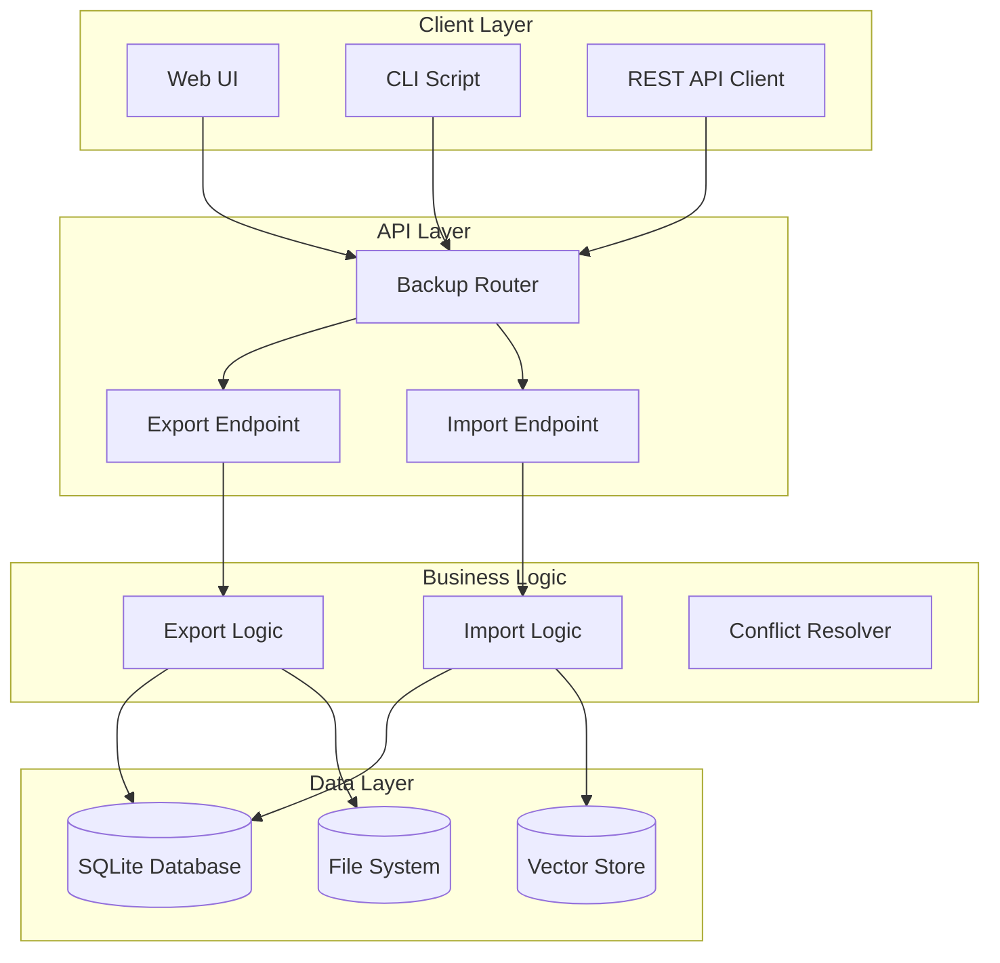
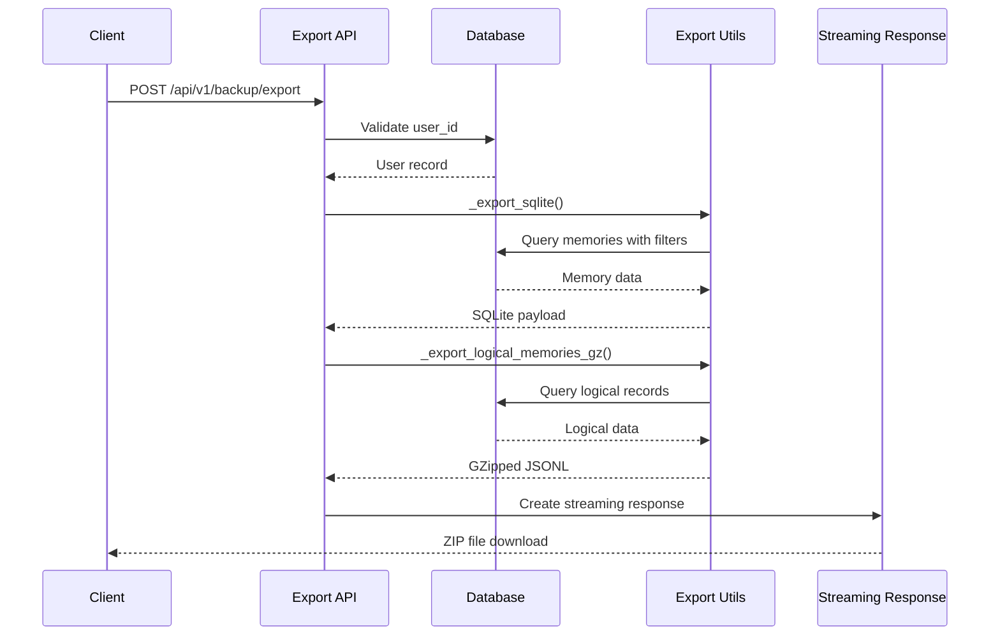
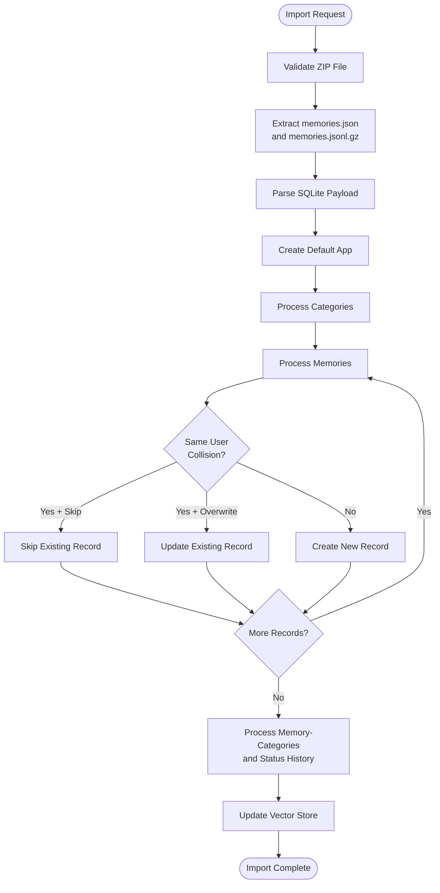
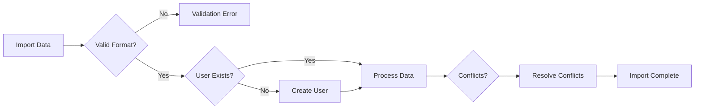
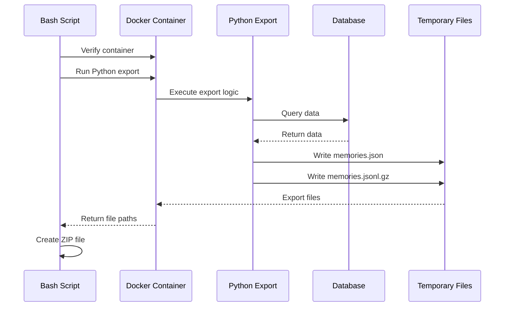
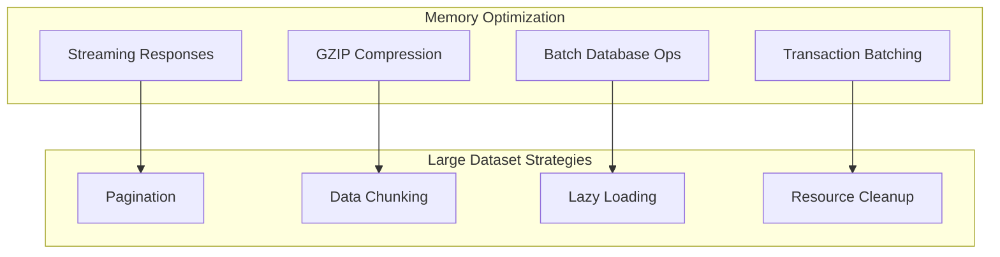
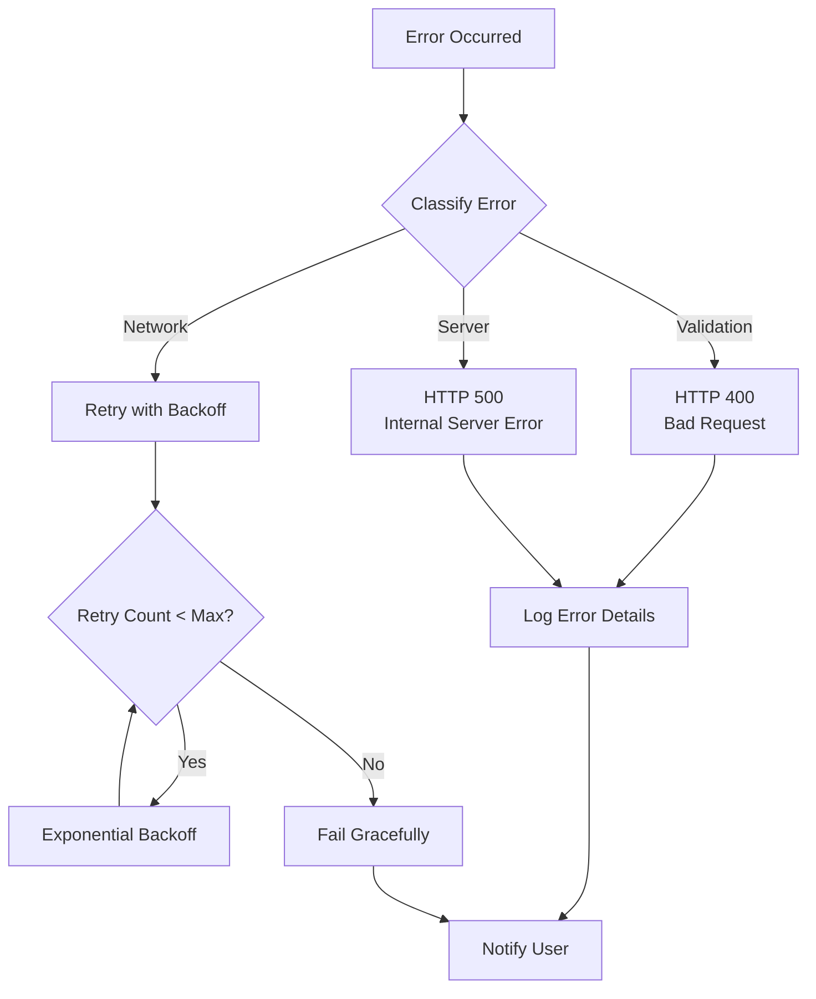

# Backup Endpoints

<cite>
**Referenced Files in This Document**
- [backup.py](file://openmemory/api/app/routers/backup.py)
- [export_openmemory.sh](file://openmemory/backup-scripts/export_openmemory.sh)
- [models.py](file://openmemory/api/app/models.py)
- [schemas.py](file://openmemory/api/app/schemas.py)
- [form-view.tsx](file://openmemory/ui/components/form-view.tsx)
- [main.py](file://mem0/client/main.py)
</cite>

## Table of Contents
1. [Introduction](#introduction)
2. [API Architecture](#api-architecture)
3. [Export Endpoint](#export-endpoint)
4. [Import Endpoint](#import-endpoint)
5. [Export File Structure](#export-file-structure)
6. [Data Integrity and Conflict Resolution](#data-integrity-and-conflict-resolution)
7. [Script Integration](#script-integration)
8. [Performance Considerations](#performance-considerations)
9. [Error Handling](#error-handling)
10. [Usage Examples](#usage-examples)

## Introduction

The Backup REST API provides comprehensive data export and import functionality for OpenMemory, enabling users to backup their memories, applications, and associated metadata. The system supports multiple export formats, conflict resolution during imports, and integration with both API endpoints and standalone scripts.

The backup system consists of two primary endpoints:
- **POST /api/v1/backup/export**: Initiates data export operations with flexible filtering options
- **POST /api/v1/backup/import**: Handles data import with sophisticated conflict resolution mechanisms

## API Architecture

The backup functionality is built on FastAPI with SQLAlchemy ORM for database operations. The system maintains data integrity through transactional imports and supports both SQLite-compatible exports and provider-agnostic logical exports.



**Diagram sources**
- [backup.py](file://openmemory/api/app/routers/backup.py#L24-L264)
- [models.py](file://openmemory/api/app/models.py#L37-L109)

**Section sources**
- [backup.py](file://openmemory/api/app/routers/backup.py#L1-L264)
- [models.py](file://openmemory/api/app/models.py#L1-L244)

## Export Endpoint

### POST /api/v1/backup/export

Initiates a data export operation for a specific user with configurable filtering and format options.

#### Request Parameters

| Parameter | Type | Required | Description |
|-----------|------|----------|-------------|
| `user_id` | string | Yes | External user identifier (not internal UUID) |
| `app_id` | UUID | No | Specific application ID to filter memories |
| `from_date` | integer | No | Unix timestamp for start date filter |
| `to_date` | integer | No | Unix timestamp for end date filter |
| `include_vectors` | boolean | No | Whether to include vector embeddings in export |

#### Request Example

```bash
curl -X POST "https://api.openmemory.com/api/v1/backup/export" \
  -H "Content-Type: application/json" \
  -d '{
    "user_id": "john.doe@example.com",
    "app_id": "550e8400-e29b-41d4-a716-446655440000",
    "from_date": 1609459200,
    "to_date": 1640995200,
    "include_vectors": true
  }'
```

#### Response Format

The export endpoint returns a ZIP file containing:
- `memories.json`: SQLite-compatible structured data
- `memories.jsonl.gz`: Provider-agnostic logical records

#### Response Headers

| Header | Value | Description |
|--------|-------|-------------|
| Content-Type | application/zip | Binary ZIP archive |
| Content-Disposition | attachment; filename="memories_export_{user_id}.zip" | Download filename |

#### Export Process Flow



**Diagram sources**
- [backup.py](file://openmemory/api/app/routers/backup.py#L239-L264)

**Section sources**
- [backup.py](file://openmemory/api/app/routers/backup.py#L239-L264)

## Import Endpoint

### POST /api/v1/backup/import

Imports previously exported data with sophisticated conflict resolution capabilities.

#### Request Parameters

| Parameter | Type | Required | Description |
|-----------|------|----------|-------------|
| `file` | UploadFile | Yes | ZIP file containing export data |
| `user_id` | string | Yes | Target user for import |
| `mode` | string | No | Conflict resolution mode ("skip" or "overwrite") |

#### Import Modes

| Mode | Behavior | Use Case |
|------|----------|----------|
| `skip` | Skip existing records, preserve current data | Merge with existing data |
| `overwrite` | Replace existing records with imported data | Full replacement |

#### Request Example

```bash
curl -X POST "https://api.openmemory.com/api/v1/backup/import" \
  -F "file=@memories_export_john.doe.zip" \
  -F "user_id=john.doe@example.com" \
  -F "mode=overwrite"
```

#### Import Process Flow



**Diagram sources**
- [backup.py](file://openmemory/api/app/routers/backup.py#L265-L462)

#### Import Validation Rules

1. **File Format**: Must be ZIP file containing required files
2. **User Validation**: Target user must exist in database
3. **Conflicts**: Automatic conflict resolution based on mode
4. **Cross-User**: Prevents cross-user data leakage

**Section sources**
- [backup.py](file://openmemory/api/app/routers/backup.py#L265-L462)

## Export File Structure

### memories.json (SQLite-Compatible)

Contains structured data compatible with SQLite database schema:

```json
{
  "user": {
    "id": "uuid-string",
    "user_id": "external-identifier",
    "name": "User Name",
    "email": "user@example.com",
    "metadata": {},
    "created_at": "2024-01-01T00:00:00Z",
    "updated_at": "2024-01-01T00:00:00Z"
  },
  "apps": [
    {
      "id": "uuid-string",
      "owner_id": "uuid-string",
      "name": "Application Name",
      "description": "App description",
      "metadata": {},
      "is_active": true,
      "created_at": "2024-01-01T00:00:00Z",
      "updated_at": "2024-01-01T00:00:00Z"
    }
  ],
  "categories": [...],
  "memories": [...],
  "memory_categories": [...],
  "status_history": [...],
  "access_controls": [...],
  "export_meta": {
    "app_id_filter": "optional-app-id",
    "from_date": 1234567890,
    "to_date": 1234567890,
    "version": "1",
    "generated_at": "2024-01-01T00:00:00Z"
  }
}
```

### memories.jsonl.gz (Logical Format)

Provider-agnostic format with one JSON object per line:

```json
{
  "id": "uuid-string",
  "content": "Memory content text",
  "metadata": {},
  "created_at": "2024-01-01T00:00:00Z",
  "updated_at": "2024-01-01T00:00:00Z",
  "state": "active",
  "app": "Application Name",
  "categories": ["category1", "category2"]
}
```

**Section sources**
- [backup.py](file://openmemory/api/app/routers/backup.py#L52-L175)
- [backup.py](file://openmemory/api/app/routers/backup.py#L177-L237)

## Data Integrity and Conflict Resolution

### Conflict Resolution Strategies

The import system handles conflicts through intelligent resolution:

#### Cross-User Conflicts
- **Prevention**: Cross-user data is automatically reassigned new UUIDs
- **Preservation**: Original user relationships are maintained in metadata

#### Same-User Conflicts
- **Skip Mode**: Existing records are preserved, imported data ignored
- **Overwrite Mode**: Imported data replaces existing records completely

#### State Management
- **Timestamp Preservation**: Created_at and updated_at timestamps are handled intelligently
- **State History**: Memory state transitions are preserved during imports

### Data Validation



**Diagram sources**
- [backup.py](file://openmemory/api/app/routers/backup.py#L324-L359)

**Section sources**
- [backup.py](file://openmemory/api/app/routers/backup.py#L324-L462)

## Script Integration

### export_openmemory.sh

The standalone script provides container-based export functionality without API dependencies.

#### Features
- **Container Integration**: Runs inside Docker containers
- **Direct Database Access**: Uses SQLAlchemy for direct database queries
- **Flexible Filtering**: Supports all export parameters
- **Automatic Packaging**: Creates ZIP files with required structure

#### Usage Examples

```bash
# Basic export
./export_openmemory.sh --user-id john.doe@example.com

# Export with date range
./export_openmemory.sh --user-id john.doe@example.com \
  --from-date 1609459200 \
  --to-date 1640995200

# Export specific application
./export_openmemory.sh --user-id john.doe@example.com \
  --app-id 550e8400-e29b-41d4-a716-446655440000
```

#### Script Architecture



**Diagram sources**
- [export_openmemory.sh](file://openmemory/backup-scripts/export_openmemory.sh#L71-L393)

**Section sources**
- [export_openmemory.sh](file://openmemory/backup-scripts/export_openmemory.sh#L1-L393)

## Performance Considerations

### Large Dataset Handling

#### Export Performance
- **Streaming**: Uses streaming responses to handle large exports
- **Compression**: GZIP compression reduces file sizes significantly
- **Pagination**: Memory-efficient processing for large datasets

#### Import Performance
- **Batch Operations**: Groups database operations for efficiency
- **Transaction Management**: Uses transactions for atomic updates
- **Vector Store Optimization**: Conditional vector regeneration

### Memory Management



### Performance Recommendations

| Scenario | Recommendation | Expected Impact |
|----------|---------------|-----------------|
| Large exports (>10K memories) | Use date filtering | Reduces memory usage |
| Frequent imports | Use skip mode | Avoids unnecessary updates |
| Vector store rebuild | Disable include_vectors | Faster import process |
| Batch imports | Process in smaller chunks | Better resource utilization |

## Error Handling

### Common Error Scenarios

#### Export Errors
- **User Not Found**: HTTP 404 when user_id doesn't exist
- **Invalid Date Range**: HTTP 400 for malformed timestamps
- **Database Connection**: Graceful fallback with descriptive messages

#### Import Errors
- **Invalid ZIP File**: HTTP 400 for corrupted archives
- **Missing Files**: HTTP 400 for missing required files
- **Conflicting Data**: HTTP 400 for invalid import modes

### Error Response Format

```json
{
  "detail": "Error description",
  "code": "ERROR_CODE",
  "timestamp": "2024-01-01T00:00:00Z"
}
```

### Error Recovery Strategies



**Section sources**
- [backup.py](file://openmemory/api/app/routers/backup.py#L272-L305)

## Usage Examples

### Complete Workflow Examples

#### Basic Export and Import

```bash
# Step 1: Export data
curl -X POST "https://api.openmemory.com/api/v1/backup/export" \
  -H "Content-Type: application/json" \
  -d '{
    "user_id": "user@example.com",
    "include_vectors": false
  }' \
  -o user_backup.zip

# Step 2: Import data to another account
curl -X POST "https://api.openmemory.com/api/v1/backup/import" \
  -F "file=@user_backup.zip" \
  -F "user_id=newuser@example.com" \
  -F "mode=overwrite"
```

#### Advanced Export with Filtering

```bash
# Export specific application data
curl -X POST "https://api.openmemory.com/api/v1/backup/export" \
  -H "Content-Type: application/json" \
  -d '{
    "user_id": "user@example.com",
    "app_id": "550e8400-e29b-41d4-a716-446655440000",
    "from_date": 1609459200,
    "to_date": 1640995200
  }'
```

#### Using the Script for Production

```bash
# Export from production container
./export_openmemory.sh --user-id production_user@example.com \
  --container openmemory-prod \
  --from-date 1609459200 \
  --to-date 1640995200
```

### Client Library Integration

#### Python Client Example

```python
from mem0 import MemoryClient

client = MemoryClient(api_key="your-api-key")

# Export data
export_response = client.create_memory_export(
    user_id="user@example.com",
    app_id="specific-app-id",
    from_date=1609459200,
    to_date=1640995200
)

# Get export status
export_status = client.get_memory_export(
    user_id="user@example.com"
)
```

#### JavaScript Client Example

```javascript
const formData = new FormData();
formData.append('file', file);
formData.append('user_id', 'user@example.com');
formData.append('mode', 'overwrite');

const response = await fetch('/api/v1/backup/import', {
  method: 'POST',
  body: formData
});

if (!response.ok) {
  throw new Error(`Import failed: ${response.status}`);
}

const result = await response.json();
console.log('Import successful:', result.message);
```

**Section sources**
- [main.py](file://mem0/client/main.py#L559-L602)
- [form-view.tsx](file://openmemory/ui/components/form-view.tsx#L435-L461)