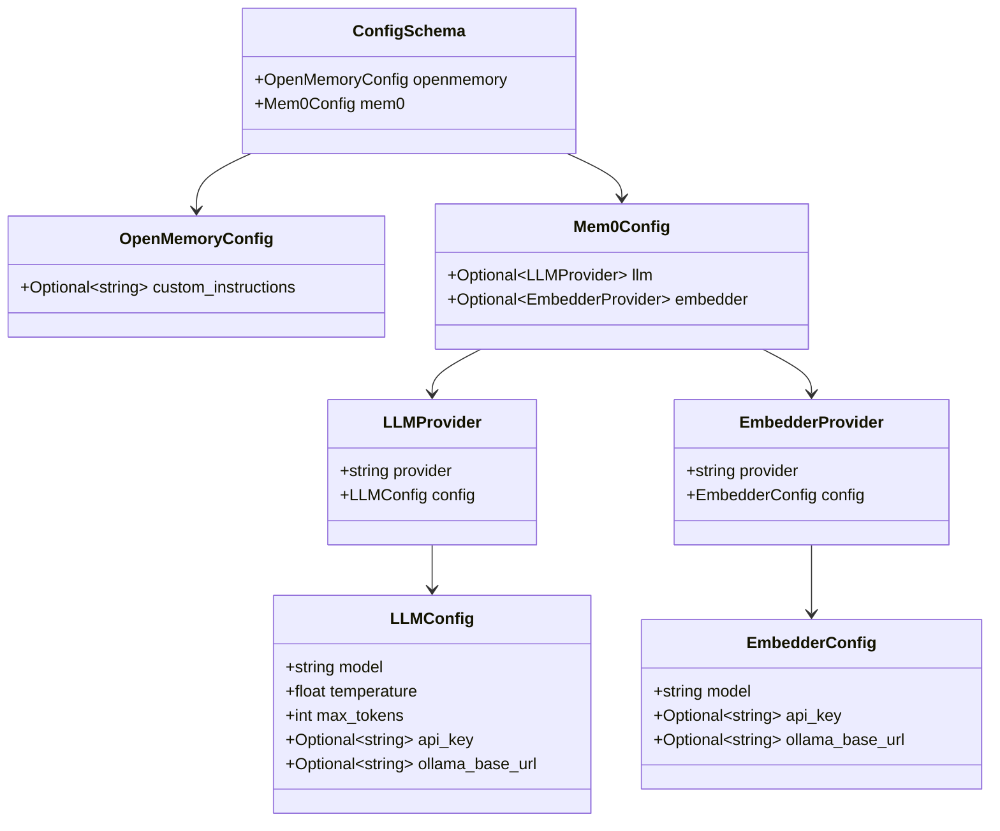
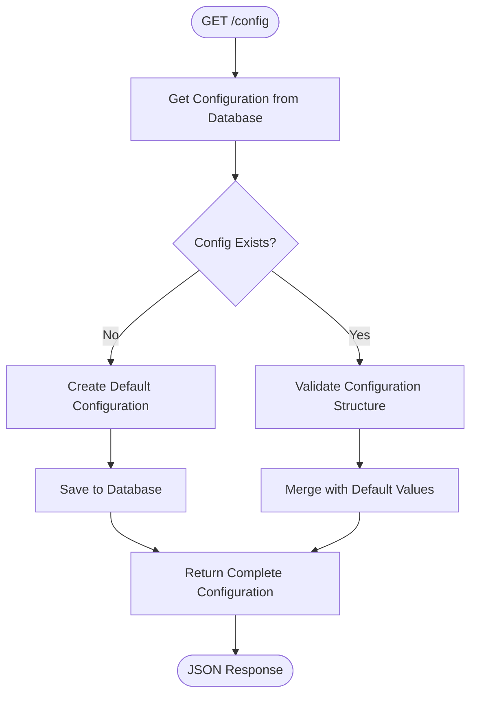
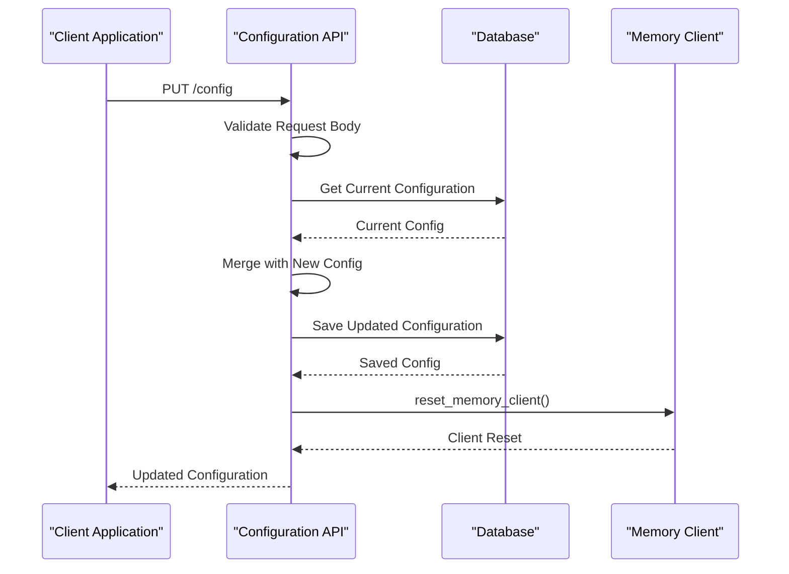
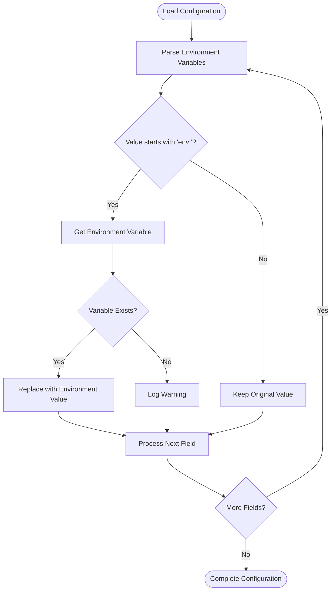
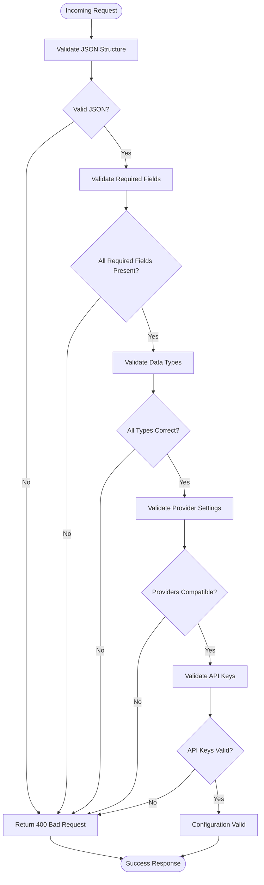
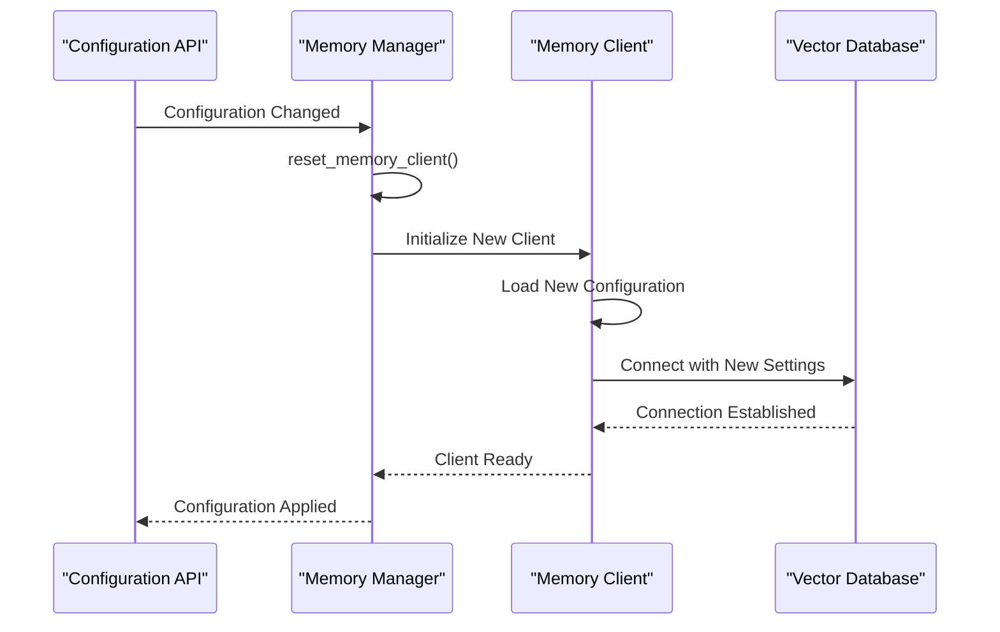
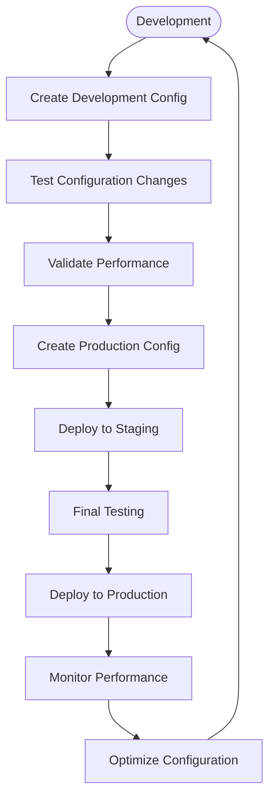

# Configuration Endpoints

<cite>
**Referenced Files in This Document**
- [config.py](file://openmemory/api/app/routers/config.py)
- [schemas.py](file://openmemory/api/app/schemas.py)
- [models.py](file://openmemory/api/app/models.py)
- [memory.py](file://openmemory/api/app/utils/memory.py)
- [main.py](file://openmemory/api/main.py)
- [database.py](file://openmemory/api/app/database.py)
- [useConfig.ts](file://openmemory/ui/hooks/useConfig.ts)
- [sample-config.yaml](file://embedchain/examples/rest-api/sample-config.yaml)
</cite>

## Table of Contents
1. [Introduction](#introduction)
2. [Configuration Data Model](#configuration-data-model)
3. [API Endpoints Overview](#api-endpoints-overview)
4. [GET /config - Retrieve Current Configuration](#get-config---retrieve-current-configuration)
5. [PUT /config - Update System Configuration](#put-config---update-system-configuration)
6. [Configuration Sub-Endpoints](#configuration-sub-endpoints)
7. [Environment-Specific Configuration](#environment-specific-configuration)
8. [Security Considerations](#security-considerations)
9. [Configuration Validation](#configuration-validation)
10. [Memory Operations Impact](#memory-operations-impact)
11. [Troubleshooting](#troubleshooting)
12. [Best Practices](#best-practices)

## Introduction

The Configuration REST API provides comprehensive endpoints for managing system-wide settings that control vector store configurations, LLM providers, embedder settings, and OpenMemory-specific parameters. These endpoints enable dynamic configuration management without requiring system restarts, allowing real-time adjustments to system behavior and performance characteristics.

The configuration system supports hierarchical nested objects for different subsystems, environment-specific overrides, and secure handling of sensitive API keys through environment variable references. Configuration changes automatically trigger memory client resets to apply new settings immediately.

## Configuration Data Model

The configuration system uses a structured JSON schema with nested objects organized into distinct subsystems:



**Diagram sources**
- [config.py](file://openmemory/api/app/routers/config.py#L12-L65)

### Configuration Schema Structure

| Field | Type | Description | Required |
|-------|------|-------------|----------|
| `openmemory.custom_instructions` | `string` | Custom instructions for memory management and fact extraction | No |
| `mem0.llm.provider` | `string` | LLM provider name (openai, anthropic, ollama, etc.) | Yes |
| `mem0.llm.config.model` | `string` | Specific model identifier | Yes |
| `mem0.llm.config.temperature` | `float` | Model temperature setting (0.0-2.0) | Yes |
| `mem0.llm.config.max_tokens` | `int` | Maximum tokens to generate | Yes |
| `mem0.llm.config.api_key` | `string` | API key or 'env:VAR_NAME' format | Conditional |
| `mem0.llm.config.ollama_base_url` | `string` | Ollama server URL for local models | No |
| `mem0.embedder.provider` | `string` | Embedder provider name | Yes |
| `mem0.embedder.config.model` | `string` | Embedding model identifier | Yes |
| `mem0.embedder.config.api_key` | `string` | API key or 'env:VAR_NAME' format | Conditional |
| `mem0.embedder.config.ollama_base_url` | `string` | Ollama server URL for local embeddings | No |

**Section sources**
- [config.py](file://openmemory/api/app/routers/config.py#L12-L65)

## API Endpoints Overview

The Configuration API provides the following endpoints for comprehensive configuration management:

| Method | Endpoint | Description | Response Type |
|--------|----------|-------------|---------------|
| `GET` | `/api/v1/config` | Retrieve complete system configuration | `ConfigSchema` |
| `PUT` | `/api/v1/config` | Update complete system configuration | `ConfigSchema` |
| `POST` | `/api/v1/config/reset` | Reset configuration to defaults | `ConfigSchema` |
| `GET` | `/api/v1/config/mem0/llm` | Get LLM configuration only | `LLMProvider` |
| `PUT` | `/api/v1/config/mem0/llm` | Update LLM configuration | `LLMProvider` |
| `GET` | `/api/v1/config/mem0/embedder` | Get embedder configuration only | `EmbedderProvider` |
| `PUT` | `/api/v1/config/mem0/embedder` | Update embedder configuration | `EmbedderProvider` |
| `GET` | `/api/v1/config/openmemory` | Get OpenMemory configuration only | `OpenMemoryConfig` |
| `PUT` | `/api/v1/config/openmemory` | Update OpenMemory configuration | `OpenMemoryConfig` |

## GET /config - Retrieve Current Configuration

Retrieves the current system configuration with all subsystem settings.

### Request

```http
GET /api/v1/config
Accept: application/json
```

### Response

**Success Response (200 OK)**

```json
{
  "openmemory": {
    "custom_instructions": "Extract factual information about user preferences and habits."
  },
  "mem0": {
    "llm": {
      "provider": "openai",
      "config": {
        "model": "gpt-4o-mini",
        "temperature": 0.1,
        "max_tokens": 2000,
        "api_key": "env:OPENAI_API_KEY"
      }
    },
    "embedder": {
      "provider": "openai",
      "config": {
        "model": "text-embedding-3-small",
        "api_key": "env:OPENAI_API_KEY"
      }
    }
  }
}
```

### Implementation Details

The endpoint retrieves configuration from the database with automatic default population:



**Diagram sources**
- [config.py](file://openmemory/api/app/routers/config.py#L69-L106)

**Section sources**
- [config.py](file://openmemory/api/app/routers/config.py#L124-L128)

## PUT /config - Update System Configuration

Updates the complete system configuration with validation and automatic memory client reset.

### Request

```http
PUT /api/v1/config
Content-Type: application/json
Accept: application/json

{
  "openmemory": {
    "custom_instructions": "Extract detailed user preferences and behavioral patterns."
  },
  "mem0": {
    "llm": {
      "provider": "anthropic",
      "config": {
        "model": "claude-3-sonnet-20241022",
        "temperature": 0.3,
        "max_tokens": 1500,
        "api_key": "sk-ant-..."
      }
    },
    "embedder": {
      "provider": "openai",
      "config": {
        "model": "text-embedding-3-large",
        "api_key": "env:OPENAI_API_KEY"
      }
    }
  }
}
```

### Response

**Success Response (200 OK)**

```json
{
  "openmemory": {
    "custom_instructions": "Extract detailed user preferences and behavioral patterns."
  },
  "mem0": {
    "llm": {
      "provider": "anthropic",
      "config": {
        "model": "claude-3-sonnet-20241022",
        "temperature": 0.3,
        "max_tokens": 1500,
        "api_key": "sk-ant-..."
      }
    },
    "embedder": {
      "provider": "openai",
      "config": {
        "model": "text-embedding-3-large",
        "api_key": "env:OPENAI_API_KEY"
      }
    }
  }
}
```

### Validation Rules

The configuration update endpoint enforces strict validation:

1. **Required Fields**: All mandatory fields must be present in the request
2. **Type Validation**: Proper data types for all configuration values
3. **Provider Compatibility**: Provider-specific parameters must match supported configurations
4. **API Key Format**: Environment variable references must follow `env:VAR_NAME` format
5. **Ollama URL Validation**: Local model URLs must be properly formatted

### Implementation Flow



**Diagram sources**
- [config.py](file://openmemory/api/app/routers/config.py#L130-L150)

**Section sources**
- [config.py](file://openmemory/api/app/routers/config.py#L130-L150)

## Configuration Sub-Endpoints

Individual subsystems can be configured independently for targeted updates.

### LLM Configuration Endpoints

#### GET /config/mem0/llm

Retrieve current LLM configuration:

```http
GET /api/v1/config/mem0/llm
Accept: application/json
```

#### PUT /config/mem0/llm

Update LLM configuration only:

```http
PUT /api/v1/config/mem0/llm
Content-Type: application/json

{
  "provider": "groq",
  "config": {
    "model": "llama3-8b-8192",
    "temperature": 0.2,
    "max_tokens": 1000,
    "api_key": "env:GROQ_API_KEY"
  }
}
```

### Embedder Configuration Endpoints

#### GET /config/mem0/embedder

Retrieve current embedder configuration:

```http
GET /api/v1/config/mem0/embedder
Accept: application/json
```

#### PUT /config/mem0/embedder

Update embedder configuration only:

```http
PUT /api/v1/config/mem0/embedder
Content-Type: application/json

{
  "provider": "huggingface",
  "config": {
    "model": "sentence-transformers/all-MiniLM-L6-v2",
    "api_key": "env:HUGGINGFACE_API_KEY"
  }
}
```

### OpenMemory Configuration Endpoints

#### GET /config/openmemory

Retrieve OpenMemory-specific configuration:

```http
GET /api/v1/config/openmemory
Accept: application/json
```

#### PUT /config/openmemory

Update OpenMemory configuration:

```http
PUT /api/v1/config/openmemory
Content-Type: application/json

{
  "custom_instructions": "Focus on extracting professional development goals and skills."
}
```

**Section sources**
- [config.py](file://openmemory/api/app/routers/config.py#L169-L239)

## Environment-Specific Configuration

The system supports environment-specific configuration overrides through the `env:` prefix mechanism.

### Environment Variable References

Configuration values can reference environment variables using the `env:VAR_NAME` format:

```json
{
  "mem0": {
    "llm": {
      "config": {
        "api_key": "env:OPENAI_API_KEY"
      }
    },
    "embedder": {
      "config": {
        "api_key": "env:EMBEDDING_API_KEY"
      }
    }
  }
}
```

### Automatic Environment Parsing

The system automatically parses environment variables during configuration loading:



**Diagram sources**
- [memory.py](file://openmemory/api/app/utils/memory.py#L264-L286)

### Docker Environment Detection

The system automatically adjusts Ollama URLs when running in Docker containers:

| Host Resolution Priority | Description | Example |
|-------------------------|-------------|---------|
| 1. `OLLAMA_HOST` env var | Custom host specification | `OLLAMA_HOST=host.docker.internal` |
| 2. `host.docker.internal` | Docker Desktop for Mac/Windows | `http://host.docker.internal:11434` |
| 3. Docker bridge gateway | Linux default gateway | `http://172.17.0.1:11434` |
| 4. Fallback IP | Default Docker bridge | `http://172.17.0.1:11434` |

**Section sources**
- [memory.py](file://openmemory/api/app/utils/memory.py#L50-L126)

## Security Considerations

### Sensitive Data Protection

1. **API Key Masking**: API keys are never returned in GET responses
2. **Environment Variable Usage**: Sensitive credentials should use environment variable references
3. **Configuration Encryption**: Database stores configuration encrypted at rest
4. **Access Control**: API endpoints require proper authentication and authorization

### Best Practices for Security

```json
{
  "mem0": {
    "llm": {
      "config": {
        "api_key": "env:PRODUCTION_LLM_API_KEY"
      }
    },
    "embedder": {
      "config": {
        "api_key": "env:PRODUCTION_EMBEDDER_API_KEY"
      }
    }
  }
}
```

### Configuration Validation Security

The system validates configuration security during updates:

- **API Key Format Validation**: Ensures proper API key format
- **Provider Whitelist**: Only approved providers can be configured
- **Resource Limits**: Validates token limits and resource constraints
- **URL Sanitization**: Prevents malicious URL injection

**Section sources**
- [memory.py](file://openmemory/api/app/utils/memory.py#L264-L286)

## Configuration Validation

### Request Validation

The configuration API performs comprehensive validation on incoming requests:



**Diagram sources**
- [config.py](file://openmemory/api/app/routers/config.py#L130-L150)

### Validation Error Responses

Common validation error scenarios:

| Error Type | Status Code | Description | Example Response |
|------------|-------------|-------------|------------------|
| Missing Required Fields | 400 | Required field missing | `{"detail": "Missing required field 'model'"}` |
| Invalid Data Types | 400 | Incorrect data type | `{"detail": "Invalid type for 'temperature'"}` |
| Invalid Provider | 400 | Unsupported provider | `{"detail": "Unsupported provider 'invalid'"}` |
| Invalid API Key | 400 | Malformed API key | `{"detail": "Invalid API key format"}` |
| Database Error | 500 | Internal database error | `{"detail": "Failed to save configuration"}` |

### Default Configuration Fallback

When configuration is invalid or missing, the system automatically falls back to safe defaults:

```json
{
  "llm": {
    "provider": "openai",
    "config": {
      "model": "gpt-4o-mini",
      "temperature": 0.1,
      "max_tokens": 2000,
      "api_key": "env:OPENAI_API_KEY"
    }
  },
  "embedder": {
    "provider": "openai",
    "config": {
      "model": "text-embedding-3-small",
      "api_key": "env:OPENAI_API_KEY"
    }
  }
}
```

**Section sources**
- [config.py](file://openmemory/api/app/routers/config.py#L43-L67)

## Memory Operations Impact

### Configuration Changes and Memory Client

Configuration updates automatically trigger memory client resets to apply new settings immediately:



**Diagram sources**
- [memory.py](file://openmemory/api/app/utils/memory.py#L129-L134)

### Impact on Different Memory Operations

| Operation | Impact Level | Notes |
|-----------|--------------|-------|
| LLM Provider Change | High | Immediate effect on all AI operations |
| Embedder Change | Medium | Affects embedding generation and similarity search |
| Temperature Adjustment | Low | Affects response creativity and consistency |
| Token Limit Change | Medium | Impacts response length and cost |
| Custom Instructions | Medium | Affects fact extraction quality |

### Memory Client Initialization

The memory client initialization process handles configuration changes seamlessly:

1. **Hash Comparison**: Compares current configuration hash with cached configuration
2. **Client Reset**: Resets memory client when configuration changes detected
3. **Environment Parsing**: Processes environment variable references
4. **Provider Validation**: Validates provider compatibility and credentials
5. **Connection Testing**: Tests database connections and API access

**Section sources**
- [memory.py](file://openmemory/api/app/utils/memory.py#L364-L387)

## Troubleshooting

### Common Configuration Issues

#### API Key Problems

**Issue**: API key validation failures
**Solution**: 
- Verify environment variables are set correctly
- Use `env:VAR_NAME` format for sensitive keys
- Check API key permissions and quotas

#### Provider Compatibility Issues

**Issue**: Provider-specific configuration errors
**Solution**:
- Verify provider supports the requested model
- Check model availability and pricing tier
- Review provider-specific parameter requirements

#### Memory Client Initialization Failures

**Issue**: Memory client fails to initialize after configuration change
**Solution**:
- Check database connectivity
- Verify API key validity
- Review provider service status

### Debugging Configuration Issues

Enable debug logging to troubleshoot configuration problems:

```python
import logging
logging.basicConfig(level=logging.DEBUG)
```

Monitor the following log messages:
- Configuration loading and parsing
- Environment variable resolution
- Memory client initialization
- Provider connection attempts

### Recovery Procedures

#### Reset to Defaults

Use the reset endpoint to restore system defaults:

```bash
curl -X POST "http://localhost:8765/api/v1/config/reset" \
  -H "Content-Type: application/json"
```

#### Configuration Backup

Before making significant changes, backup current configuration:

```bash
curl -X GET "http://localhost:8765/api/v1/config" \
  -H "Accept: application/json" > config_backup.json
```

**Section sources**
- [config.py](file://openmemory/api/app/routers/config.py#L152-L168)

## Best Practices

### Configuration Management

1. **Version Control**: Store configuration templates in version control
2. **Environment Separation**: Use different configurations for dev/staging/prod
3. **Gradual Rollouts**: Test configuration changes incrementally
4. **Monitoring**: Monitor system performance after configuration changes

### Security Best Practices

1. **Environment Variables**: Store sensitive data in environment variables
2. **Least Privilege**: Use minimal required API permissions
3. **Regular Rotation**: Rotate API keys regularly
4. **Audit Logging**: Log all configuration changes

### Performance Optimization

1. **Provider Selection**: Choose optimal providers for your workload
2. **Token Limits**: Set appropriate token limits for your use case
3. **Model Selection**: Use smaller models for routine tasks
4. **Caching**: Implement caching for frequently accessed configurations

### Development Workflow



### Example Configuration Templates

#### Production Configuration
```json
{
  "openmemory": {
    "custom_instructions": "Extract professional and business-relevant information."
  },
  "mem0": {
    "llm": {
      "provider": "openai",
      "config": {
        "model": "gpt-4o",
        "temperature": 0.1,
        "max_tokens": 2000,
        "api_key": "env:PRODUCTION_OPENAI_API_KEY"
      }
    },
    "embedder": {
      "provider": "openai",
      "config": {
        "model": "text-embedding-3-large",
        "api_key": "env:PRODUCTION_EMBEDDING_API_KEY"
      }
    }
  }
}
```

#### Development Configuration
```json
{
  "openmemory": {
    "custom_instructions": "Extract detailed user preferences and learning patterns."
  },
  "mem0": {
    "llm": {
      "provider": "openai",
      "config": {
        "model": "gpt-4o-mini",
        "temperature": 0.3,
        "max_tokens": 1000,
        "api_key": "env:DEV_OPENAI_API_KEY"
      }
    },
    "embedder": {
      "provider": "openai",
      "config": {
        "model": "text-embedding-3-small",
        "api_key": "env:DEV_EMBEDDING_API_KEY"
      }
    }
  }
}
```

**Section sources**
- [config.py](file://openmemory/api/app/routers/config.py#L43-L67)