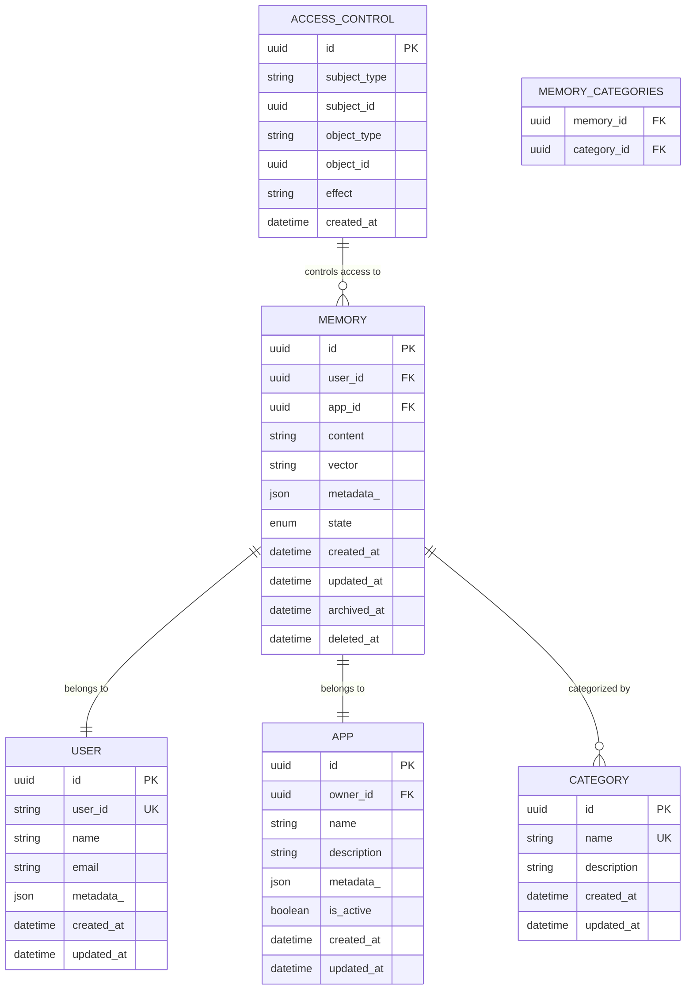
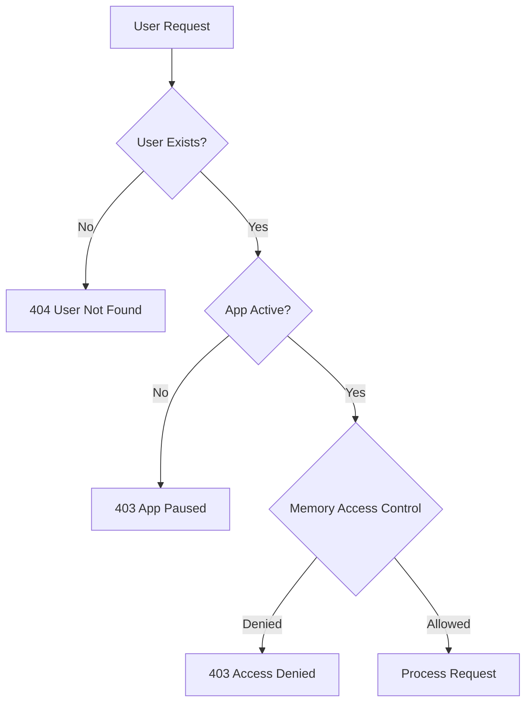

# Memories Endpoints

<cite>
**Referenced Files in This Document**
- [memories.py](file://openmemory/api/app/routers/memories.py)
- [models.py](file://openmemory/api/app/models.py)
- [schemas.py](file://openmemory/api/app/schemas.py)
- [memory.py](file://openmemory/api/app/utils/memory.py)
- [permissions.py](file://openmemory/api/app/utils/permissions.py)
- [database.py](file://openmemory/api/app/database.py)
- [apps.py](file://openmemory/api/app/routers/apps.py)
</cite>

## Table of Contents
1. [Introduction](#introduction)
2. [Memory Data Model](#memory-data-model)
3. [API Endpoints Overview](#api-endpoints-overview)
4. [POST /memories - Create Memory](#post-memories---create-memory)
5. [GET /memories - List Memories](#get-memories---list-memories)
6. [GET /memories/{id} - Get Memory](#get-memoriesid---get-memory)
7. [PUT /memories/{id} - Update Memory](#put-memoriesid---update-memory)
8. [DELETE /memories/{id} - Delete Memory](#delete-memoriesid---delete-memory)
9. [DELETE /memories - Bulk Delete](#delete-memories---bulk-delete)
10. [Error Responses](#error-responses)
11. [Pagination Implementation](#pagination-implementation)
12. [Authentication and Permissions](#authentication-and-permissions)
13. [Curl Examples](#curl-examples)

## Introduction

The Memories REST API provides comprehensive endpoints for managing user memories within the OpenMemory system. Memories represent persistent knowledge units that applications can store, retrieve, and manage. The API follows RESTful principles and supports CRUD operations with advanced filtering, pagination, and permission-based access control.

## Memory Data Model

The memory system uses a sophisticated data model with multiple interconnected entities:



**Diagram sources**
- [models.py](file://openmemory/api/app/models.py#L37-L109)

### Core Memory Fields

| Field | Type | Description | Required |
|-------|------|-------------|----------|
| `id` | UUID | Unique identifier for the memory | Yes |
| `content` | String | Text content of the memory | Yes |
| `user_id` | UUID | Reference to the owning user | Yes |
| `app_id` | UUID | Reference to the creating application | Yes |
| `metadata_` | JSON | Additional metadata and context | No |
| `state` | Enum | Current state (active, paused, archived, deleted) | Yes |
| `created_at` | DateTime | Timestamp of creation | Yes |
| `updated_at` | DateTime | Last modification timestamp | Yes |

**Section sources**
- [models.py](file://openmemory/api/app/models.py#L85-L109)

## API Endpoints Overview

The Memories API provides the following endpoints organized by functionality:

```mermaid
graph TD
A[Memories API] --> B[Create Operations]
A --> C[Retrieve Operations]
A --> D[Update Operations]
A --> E[Delete Operations]
B --> B1[POST /memories]
C --> C1[GET /memories]
C --> C2[GET /memories/{id}]
C --> C3[GET /memories/{id}/related]
C --> C4[GET /memories/categories]
D --> D1[PUT /memories/{id}]
D --> D2[POST /memories/actions/archive]
D --> D3[POST /memories/actions/pause]
E --> E1[DELETE /memories/{id}]
E --> E2[DELETE /memories]
```

**Diagram sources**
- [memories.py](file://openmemory/api/app/routers/memories.py#L27-L659)

## POST /memories - Create Memory

Creates a new memory with automatic vector embedding and categorization.

### Request Schema

```json
{
  "user_id": "string (UUID format)",
  "text": "string (memory content)",
  "metadata": {
    "source": "string",
    "tags": ["array of strings"],
    "priority": "integer"
  },
  "infer": "boolean (default: true)",
  "app": "string (default: 'openmemory')"
}
```

### Request Parameters

| Parameter | Type | Location | Required | Description |
|-----------|------|----------|----------|-------------|
| `user_id` | String | Body | Yes | Unique identifier for the user |
| `text` | String | Body | Yes | Content of the memory to store |
| `metadata` | Object | Body | No | Additional context and properties |
| `infer` | Boolean | Body | No | Whether to automatically categorize (default: true) |
| `app` | String | Body | No | Application name creating the memory |

### Response Schema

```json
{
  "id": "uuid",
  "text": "string",
  "created_at": integer (timestamp),
  "state": "string (state enum)",
  "app_id": "uuid",
  "app_name": "string",
  "categories": ["array of strings"],
  "metadata_": {}
}
```

### Success Response

**Status:** 200 OK  
**Content-Type:** application/json

```json
{
  "id": "123e4567-e89b-12d3-a456-426614174000",
  "text": "User mentioned they enjoy hiking on weekends.",
  "created_at": 1718505600,
  "state": "active",
  "app_id": "987fcdeb-51a2-43d7-b123-456789abcdef",
  "app_name": "openmemory",
  "categories": ["hobbies", "weekend activities"],
  "metadata_": {
    "confidence_score": 0.95,
    "source": "conversation",
    "extracted_at": 1718505600
  }
}
```

### Error Responses

**404 Not Found**: User not found
```json
{
  "detail": "User not found"
}
```

**403 Forbidden**: App is paused
```json
{
  "detail": "App openmemory is currently paused on OpenMemory. Cannot create new memories."
}
```

**500 Internal Server Error**: Memory client unavailable
```json
{
  "error": "Memory client is not available"
}
```

**Section sources**
- [memories.py](file://openmemory/api/app/routers/memories.py#L202-L315)

## GET /memories - List Memories

Retrieves a paginated list of memories with advanced filtering capabilities.

### Query Parameters

| Parameter | Type | Default | Description |
|-----------|------|---------|-------------|
| `user_id` | String | Required | User identifier for filtering |
| `app_id` | UUID | Optional | Filter by specific application |
| `from_date` | Integer | Optional | Filter memories created after timestamp |
| `to_date` | Integer | Optional | Filter memories created before timestamp |
| `categories` | String | Optional | Comma-separated category names |
| `search_query` | String | Optional | Full-text search across memory content |
| `sort_column` | String | Optional | Sort field (memory, categories, app_name, created_at) |
| `sort_direction` | String | Optional | Sort order (asc, desc) |

### Pagination Parameters

| Parameter | Type | Default | Range | Description |
|-----------|------|---------|-------|-------------|
| `page` | Integer | 1 | ≥ 1 | Page number |
| `page_size` | Integer | 10 | 1-100 | Items per page |

### Response Schema

```json
{
  "items": [
    {
      "id": "uuid",
      "content": "string",
      "created_at": integer (timestamp),
      "state": "string",
      "app_id": "uuid",
      "app_name": "string",
      "categories": ["array of strings"],
      "metadata_": {}
    }
  ],
  "total": integer,
  "page": integer,
  "size": integer,
  "pages": integer
}
```

### Example Response

```json
{
  "items": [
    {
      "id": "123e4567-e89b-12d3-a456-426614174000",
      "content": "User prefers coffee over tea.",
      "created_at": 1718505600,
      "state": "active",
      "app_id": "987fcdeb-51a2-43d7-b123-456789abcdef",
      "app_name": "customer-service",
      "categories": ["preferences"],
      "metadata_": {}
    }
  ],
  "total": 15,
  "page": 1,
  "size": 10,
  "pages": 2
}
```

**Section sources**
- [memories.py](file://openmemory/api/app/routers/memories.py#L101-L175)

## GET /memories/{id} - Get Memory

Retrieves a specific memory by its unique identifier.

### Path Parameters

| Parameter | Type | Required | Description |
|-----------|------|----------|-------------|
| `memory_id` | UUID | Yes | Unique identifier for the memory |

### Response Schema

```json
{
  "id": "uuid",
  "text": "string",
  "created_at": integer (timestamp),
  "state": "string (state enum)",
  "app_id": "uuid",
  "app_name": "string",
  "categories": ["array of strings"],
  "metadata_": {}
}
```

### Success Response

**Status:** 200 OK  
**Content-Type:** application/json

```json
{
  "id": "123e4567-e89b-12d3-a456-426614174000",
  "text": "Customer complaint about delivery delay.",
  "created_at": 1718505600,
  "state": "active",
  "app_id": "987fcdeb-51a2-43d7-b123-456789abcdef",
  "app_name": "support-system",
  "categories": ["complaints", "delivery"],
  "metadata_": {
    "priority": "high",
    "resolution_status": "pending"
  }
}
```

### Error Responses

**404 Not Found**: Memory not found
```json
{
  "detail": "Memory not found"
}
```

**Section sources**
- [memories.py](file://openmemory/api/app/routers/memories.py#L320-L336)

## PUT /memories/{id} - Update Memory

Updates the content of an existing memory.

### Path Parameters

| Parameter | Type | Required | Description |
|-----------|------|----------|-------------|
| `memory_id` | UUID | Yes | Unique identifier for the memory |

### Request Schema

```json
{
  "memory_content": "string (new content)",
  "user_id": "string (UUID format)"
}
```

### Response Schema

```json
{
  "id": "uuid",
  "content": "string (updated content)",
  "created_at": integer (timestamp),
  "state": "string (state enum)",
  "app_id": "uuid",
  "app_name": "string",
  "categories": ["array of strings"],
  "metadata_": {}
}
```

### Success Response

**Status:** 200 OK  
**Content-Type:** application/json

```json
{
  "id": "123e4567-e89b-12d3-a456-426614174000",
  "content": "Updated: Customer complaint about delivery delay resolved.",
  "created_at": 1718505600,
  "state": "active",
  "app_id": "987fcdeb-51a2-43d7-b123-456789abcdef",
  "app_name": "support-system",
  "categories": ["complaints", "delivery"],
  "metadata_": {
    "priority": "high",
    "resolution_status": "resolved",
    "updated_at": 1718505900
  }
}
```

### Error Responses

**404 Not Found**: User or memory not found
```json
{
  "detail": "User not found"
}
```

**Section sources**
- [memories.py](file://openmemory/api/app/routers/memories.py#L477-L495)

## DELETE /memories/{id} - Delete Memory

Soft deletes a single memory by setting its state to "deleted".

### Path Parameters

| Parameter | Type | Required | Description |
|-----------|------|----------|-------------|
| `memory_id` | UUID | Yes | Unique identifier for the memory |

### Response Schema

```json
{
  "message": "Successfully deleted memory"
}
```

### Success Response

**Status:** 200 OK  
**Content-Type:** application/json

```json
{
  "message": "Successfully deleted memory"
}
```

### Error Responses

**404 Not Found**: Memory not found
```json
{
  "detail": "Memory not found"
}
```

**Section sources**
- [memories.py](file://openmemory/api/app/routers/memories.py#L320-L336)

## DELETE /memories - Bulk Delete

Bulk soft deletes multiple memories by their identifiers.

### Request Schema

```json
{
  "memory_ids": ["array of UUIDs"],
  "user_id": "string (UUID format)"
}
```

### Response Schema

```json
{
  "message": "Successfully deleted X memories"
}
```

### Success Response

**Status:** 200 OK  
**Content-Type:** application/json

```json
{
  "message": "Successfully deleted 5 memories"
}
```

### Error Responses

**404 Not Found**: User not found
```json
{
  "detail": "User not found"
}
```

**Section sources**
- [memories.py](file://openmemory/api/app/routers/memories.py#L339-L355)

## Error Responses

The API implements comprehensive error handling with standardized HTTP status codes and detailed error messages.

### Common Error Status Codes

| Status Code | Error Type | Description |
|-------------|------------|-------------|
| 400 | Bad Request | Invalid request parameters or malformed JSON |
| 401 | Unauthorized | Missing or invalid authentication |
| 403 | Forbidden | Insufficient permissions or app paused |
| 404 | Not Found | Resource does not exist |
| 422 | Unprocessable Entity | Validation errors in request data |
| 429 | Too Many Requests | Rate limit exceeded |
| 500 | Internal Server Error | Unexpected server error |

### Error Response Format

```json
{
  "detail": "Human-readable error message",
  "error_code": "machine-readable-error-code",
  "suggestion": "Helpful suggestion for resolving the issue",
  "debug_info": {
    "status_code": 404,
    "url": "https://api.openmemory.com/api/v1/memories/invalid-id",
    "method": "GET"
  }
}
```

### Validation Error Examples

**Invalid UUID format:**
```json
{
  "detail": "Invalid UUID format",
  "error_code": "VALIDATION_ERROR",
  "suggestion": "Please provide a valid UUID for memory_id"
}
```

**Missing required field:**
```json
{
  "detail": "user_id is required",
  "error_code": "VALIDATION_ERROR",
  "suggestion": "Please include user_id in the request body"
}
```

**Section sources**
- [memories.py](file://openmemory/api/app/routers/memories.py#L30-L34)
- [permissions.py](file://openmemory/api/app/utils/permissions.py#L8-L54)

## Pagination Implementation

The API implements cursor-based pagination with configurable page sizes and comprehensive metadata.

### Pagination Parameters

| Parameter | Type | Default | Range | Description |
|-----------|------|---------|-------|-------------|
| `page` | Integer | 1 | ≥ 1 | Page number (1-indexed) |
| `page_size` | Integer | 10 | 1-100 | Number of items per page |

### Pagination Response Structure

```json
{
  "items": [...],           // Array of paginated items
  "total": 100,             // Total number of items
  "page": 1,                // Current page number
  "size": 10,               // Items per page
  "pages": 10               // Total number of pages
}
```

### Advanced Filtering and Sorting

The API supports sophisticated filtering and sorting mechanisms:

**Sorting Options:**
- `memory`: Sort by content (lexicographical)
- `categories`: Sort by number of categories
- `app_name`: Sort by application name
- `created_at`: Sort by creation timestamp

**Filtering Capabilities:**
- Date range filtering (`from_date`, `to_date`)
- Category-based filtering
- Full-text search across content
- State-based filtering (active, archived, etc.)

### Example Pagination Request

```bash
curl -X GET "https://api.openmemory.com/api/v1/memories?user_id=abc123&page=2&page_size=20&sort_column=created_at&sort_direction=desc" \
  -H "Content-Type: application/json"
```

**Section sources**
- [memories.py](file://openmemory/api/app/routers/memories.py#L117-L175)

## Authentication and Permissions

The API implements role-based access control with granular permissions.

### Permission Model



**Diagram sources**
- [permissions.py](file://openmemory/api/app/utils/permissions.py#L8-L54)

### Access Control Features

1. **Memory States**: Memories can be in active, paused, archived, or deleted states
2. **App-Level Permissions**: Applications can have specific access restrictions
3. **User-Based Filtering**: Results are automatically filtered by user ownership
4. **State-Based Visibility**: Deleted and archived memories are excluded from queries

### Permission Check Logic

The system validates permissions through multiple layers:

1. **User Authentication**: Validates user existence and ownership
2. **App State**: Ensures the requesting application is active
3. **Memory State**: Filters out inactive or deleted memories
4. **Access Controls**: Applies granular access restrictions

**Section sources**
- [permissions.py](file://openmemory/api/app/utils/permissions.py#L8-L54)
- [memories.py](file://openmemory/api/app/routers/memories.py#L60-L97)

## Curl Examples

### Create a New Memory

```bash
curl -X POST "https://api.openmemory.com/api/v1/memories" \
  -H "Content-Type: application/json" \
  -d '{
    "user_id": "abc123-def4-5678-9012-34567890abcd",
    "text": "User mentioned they enjoy hiking on weekends.",
    "metadata": {
      "source": "conversation",
      "confidence": 0.95
    },
    "infer": true,
    "app": "customer-service"
  }'
```

### Retrieve All Memories

```bash
curl -X GET "https://api.openmemory.com/api/v1/memories?user_id=abc123-def4-5678-9012-34567890abcd&page=1&page_size=10" \
  -H "Content-Type: application/json"
```

### Get Specific Memory

```bash
curl -X GET "https://api.openmemory.com/api/v1/memories/123e4567-e89b-12d3-a456-426614174000" \
  -H "Content-Type: application/json"
```

### Update Memory Content

```bash
curl -X PUT "https://api.openmemory.com/api/v1/memories/123e4567-e89b-12d3-a456-426614174000" \
  -H "Content-Type: application/json" \
  -d '{
    "memory_content": "Updated: User enjoys hiking on weekends and mountain biking.",
    "user_id": "abc123-def4-5678-9012-34567890abcd"
  }'
```

### Delete Single Memory

```bash
curl -X DELETE "https://api.openmemory.com/api/v1/memories/123e4567-e89b-12d3-a456-426614174000" \
  -H "Content-Type: application/json"
```

### Bulk Delete Memories

```bash
curl -X DELETE "https://api.openmemory.com/api/v1/memories" \
  -H "Content-Type: application/json" \
  -d '{
    "memory_ids": [
      "123e4567-e89b-12d3-a456-426614174000",
      "567890ab-cdef-1234-5678-90abcdef1234"
    ],
    "user_id": "abc123-def4-5678-9012-34567890abcd"
  }'
```

### Filter Memories with Advanced Parameters

```bash
curl -X GET "https://api.openmemory.com/api/v1/memories?user_id=abc123-def4-5678-9012-34567890abcd&from_date=1718505600&to_date=1718592000&categories=hobbies,preferences&sort_column=created_at&sort_direction=desc" \
  -H "Content-Type: application/json"
```

These examples demonstrate the complete functionality of the Memories REST API, from basic CRUD operations to advanced filtering and bulk operations. The API provides robust error handling, comprehensive pagination, and sophisticated permission controls to ensure secure and efficient memory management.