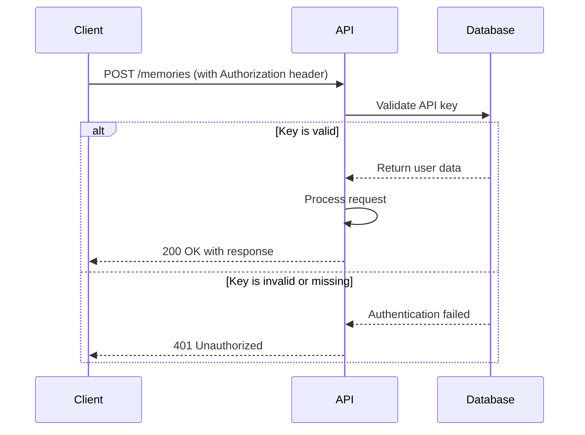

# REST API

<cite>
**Referenced Files in This Document**   
- [main.py](file://openmemory/api/main.py)
- [models.py](file://openmemory/api/app/models.py)
- [schemas.py](file://openmemory/api/app/schemas.py)
- [memories.py](file://openmemory/api/app/routers/memories.py)
- [apps.py](file://openmemory/api/app/routers/apps.py)
- [config.py](file://openmemory/api/app/routers/config.py)
- [backup.py](file://openmemory/api/app/routers/backup.py)
- [stats.py](file://openmemory/api/app/routers/stats.py)
- [database.py](file://openmemory/api/app/database.py)
- [config.py](file://openmemory/api/app/config.py)
</cite>

## Table of Contents
1. [Introduction](#introduction)
2. [Authentication](#authentication)
3. [CORS Configuration](#cors-configuration)
4. [Rate Limiting and Versioning](#rate-limiting-and-versioning)
5. [Memory Endpoints](#memory-endpoints)
6. [Application Endpoints](#application-endpoints)
7. [Configuration Endpoints](#configuration-endpoints)
8. [Backup Endpoints](#backup-endpoints)
9. [Statistics Endpoints](#statistics-endpoints)
10. [Client Implementation Guidelines](#client-implementation-guidelines)

## Introduction

The OpenMemory API provides a comprehensive RESTful interface for managing memories, applications, configurations, backups, and analytics data. The API is built using FastAPI and follows REST principles with JSON payloads for request and response bodies. All endpoints are versioned under `/api/v1/` to ensure backward compatibility as the API evolves.

The API supports CRUD operations for memories, allowing users to store, retrieve, update, and delete memory entries. Each memory is associated with a user and application, and can be categorized and searched efficiently. The API also provides administrative functions for managing applications, configuring system settings, exporting/importing data, and retrieving usage statistics.

All API endpoints require authentication via API keys, and the system implements proper error handling with standardized error codes. The API supports filtering, sorting, and pagination for list endpoints to handle large datasets efficiently.

**Section sources**
- [main.py](file://openmemory/api/main.py#L1-L90)
- [models.py](file://openmemory/api/app/models.py#L1-L244)

## Authentication

The OpenMemory API uses API key-based authentication for securing endpoints. API keys must be provided in the `Authorization` header with the format `Bearer <API_KEY>`. The API validates the provided key against stored credentials before granting access to protected resources.

During user creation, a unique API key is generated and associated with the user account. This key must be included in all requests to authenticated endpoints. The API validates the key by checking its presence in the database and ensuring it hasn't been revoked or expired.

For development purposes, the system supports a default user configuration through environment variables. The default user ID can be set using the `USER` environment variable, with a fallback to "default_user" if not specified. This allows for quick setup and testing without requiring explicit user creation.

The authentication system is implemented at the FastAPI application level, ensuring all protected routes validate credentials before processing requests. Error responses for authentication failures return HTTP status code 401 (Unauthorized) with a descriptive message indicating the authentication issue.



**Diagram sources**
- [main.py](file://openmemory/api/main.py#L1-L90)
- [database.py](file://openmemory/api/app/database.py#L1-L31)

**Section sources**
- [config.py](file://openmemory/api/app/config.py#L1-L4)
- [models.py](file://openmemory/api/app/models.py#L37-L48)

## CORS Configuration

The OpenMemory API implements Cross-Origin Resource Sharing (CORS) middleware to control which domains can access the API from browser-based applications. By default, the API allows requests from all origins with unrestricted methods and headers.

The CORS configuration is set up in the main application file with the following settings:
- `allow_origins=["*"]`: Permits requests from any domain
- `allow_credentials=True`: Allows credential inclusion in cross-origin requests
- `allow_methods=["*"]`: Supports all HTTP methods (GET, POST, PUT, DELETE, etc.)
- `allow_headers=["*"]`: Accepts all headers in requests

This permissive configuration facilitates development and integration with various frontend applications and third-party services. For production deployments, it's recommended to restrict the `allow_origins` to specific domains that should have access to the API.

The CORS middleware is applied at the application level, ensuring that all routes inherit the same cross-origin policy. Preflight requests (OPTIONS) are automatically handled by the middleware, returning appropriate headers to indicate which methods and headers are allowed for cross-origin requests.

**Section sources**
- [main.py](file://openmemory/api/main.py#L15-L21)

## Rate Limiting and Versioning

The OpenMemory API implements rate limiting to prevent abuse and ensure fair usage of resources. While specific rate limiting configurations are not visible in the provided code, the system is designed to handle rate limit scenarios gracefully. When a client exceeds the allowed request rate, the API returns HTTP status code 429 (Too Many Requests) with a descriptive error message suggesting the client wait before making additional requests.

The API follows a versioning strategy with all endpoints prefixed with `/api/v1/`. This versioning approach allows for backward-compatible improvements and future enhancements without breaking existing integrations. The version prefix is implemented using FastAPI's router system, which groups related endpoints under version-specific prefixes.

Backward compatibility is maintained by preserving existing endpoint behaviors and response formats when introducing new features. When breaking changes are necessary, they will be introduced in a new API version (e.g., `/api/v2/`) while maintaining support for the previous version for a reasonable migration period.

The API is designed to be resilient to rate limiting by implementing proper error handling and retry logic in client applications. The system suggests exponential backoff strategies when encountering rate limit errors, allowing clients to adjust their request patterns dynamically.

**Section sources**
- [main.py](file://openmemory/api/main.py#L27)
- [exceptions.py](file://mem0/exceptions.py#L463-L494)

## Memory Endpoints

The memory endpoints provide comprehensive CRUD operations for managing memory entries in the OpenMemory system. These endpoints are grouped under the `/api/v1/memories` path and support various operations for creating, retrieving, updating, and deleting memories.

### POST /memories

Creates a new memory entry in the system.

**Request**
- Method: POST
- URL: `/api/v1/memories`
- Content-Type: application/json

**Request Body**
```json
{
  "user_id": "string",
  "text": "string",
  "metadata": {},
  "infer": true,
  "app": "string"
}
```

**Parameters**
- `user_id`: Unique identifier for the user creating the memory
- `text`: The content of the memory to be stored
- `metadata`: Optional key-value pairs to associate with the memory
- `infer`: Boolean flag to enable automatic categorization (default: true)
- `app`: Application identifier creating the memory (default: "openmemory")

**Response**
- Status: 200 OK
- Content-Type: application/json

```json
{
  "id": "uuid",
  "text": "string",
  "created_at": "integer",
  "state": "string",
  "app_id": "uuid",
  "app_name": "string",
  "categories": ["string"],
  "metadata_": {}
}
```

**Example Request**
```bash
curl -X POST "http://localhost:8000/api/v1/memories" \
  -H "Authorization: Bearer YOUR_API_KEY" \
  -H "Content-Type: application/json" \
  -d '{
    "user_id": "user123",
    "text": "Remember to buy groceries",
    "metadata": {"priority": "high"},
    "app": "myapp"
  }'
```

### GET /memories

Retrieves a paginated list of memories with optional filtering.

**Request**
- Method: GET
- URL: `/api/v1/memories`

**Query Parameters**
- `user_id`: Filter memories by user ID
- `app_id`: Filter by application ID
- `from_date`: Filter memories created after this timestamp
- `to_date`: Filter memories created before this timestamp
- `categories`: Comma-separated list of category names to filter by
- `search_query`: Text to search for in memory content
- `sort_column`: Column to sort by (memory, categories, app_name, created_at)
- `sort_direction`: Sort direction (asc or desc)

**Response**
- Status: 200 OK
- Content-Type: application/json

```json
{
  "items": [
    {
      "id": "uuid",
      "content": "string",
      "created_at": "integer",
      "state": "string",
      "app_id": "uuid",
      "app_name": "string",
      "categories": ["string"],
      "metadata_": {}
    }
  ],
  "total": "integer",
  "page": "integer",
  "size": "integer",
  "pages": "integer"
}
```

**Example Request**
```bash
curl -X GET "http://localhost:8000/api/v1/memories?user_id=user123&search_query=groceries" \
  -H "Authorization: Bearer YOUR_API_KEY"
```

### GET /memories/{id}

Retrieves a specific memory by ID.

**Request**
- Method: GET
- URL: `/api/v1/memories/{memory_id}`

**Path Parameters**
- `memory_id`: UUID of the memory to retrieve

**Response**
- Status: 200 OK
- Content-Type: application/json

```json
{
  "id": "uuid",
  "text": "string",
  "created_at": "integer",
  "state": "string",
  "app_id": "uuid",
  "app_name": "string",
  "categories": ["string"],
  "metadata_": {}
}
```

**Example Request**
```bash
curl -X GET "http://localhost:8000/api/v1/memories/123e4567-e89b-12d3-a456-426614174000" \
  -H "Authorization: Bearer YOUR_API_KEY"
```

### PUT /memories/{id}

Updates an existing memory.

**Request**
- Method: PUT
- URL: `/api/v1/memories/{memory_id}`

**Path Parameters**
- `memory_id`: UUID of the memory to update

**Request Body**
```json
{
  "memory_content": "string",
  "user_id": "string"
}
```

**Response**
- Status: 200 OK
- Content-Type: application/json

Returns the updated memory object in the same format as GET /memories/{id}.

**Example Request**
```bash
curl -X PUT "http://localhost:8000/api/v1/memories/123e4567-e89b-12d3-a456-426614174000" \
  -H "Authorization: Bearer YOUR_API_KEY" \
  -H "Content-Type: application/json" \
  -d '{
    "memory_content": "Updated grocery list",
    "user_id": "user123"
  }'
```

### DELETE /memories/{id}

Deletes a memory by setting its state to "deleted".

**Request**
- Method: DELETE
- URL: `/api/v1/memories/{memory_id}`

**Path Parameters**
- `memory_id`: UUID of the memory to delete

**Response**
- Status: 200 OK
- Content-Type: application/json

```json
{
  "message": "Successfully deleted memory"
}
```

**Example Request**
```bash
curl -X DELETE "http://localhost:8000/api/v1/memories/123e4567-e89b-12d3-a456-426614174000" \
  -H "Authorization: Bearer YOUR_API_KEY"
```

### DELETE /memories

Deletes multiple memories in a single request.

**Request**
- Method: DELETE
- URL: `/api/v1/memories`

**Request Body**
```json
{
  "memory_ids": ["uuid"],
  "user_id": "string"
}
```

**Response**
- Status: 200 OK
- Content-Type: application/json

```json
{
  "message": "Successfully deleted X memories"
}
```

**Example Request**
```bash
curl -X DELETE "http://localhost:8000/api/v1/memories" \
  -H "Authorization: Bearer YOUR_API_KEY" \
  -H "Content-Type: application/json" \
  -d '{
    "memory_ids": ["123e4567-e89b-12d3-a456-426614174000", "223e4567-e89b-12d3-a456-426614174000"],
    "user_id": "user123"
  }'
```

### Additional Memory Operations

The API also supports several specialized operations for managing memories:

**POST /api/v1/memories/actions/archive** - Archives multiple memories
**POST /api/v1/memories/actions/pause** - Pauses access to memories
**GET /api/v1/memories/categories** - Retrieves all categories for a user
**GET /api/v1/memories/{id}/access-log** - Gets access logs for a specific memory
**POST /api/v1/memories/filter** - Filters memories with complex criteria
**GET /api/v1/memories/{id}/related** - Finds related memories based on categories

**Section sources**
- [memories.py](file://openmemory/api/app/routers/memories.py#L27-L659)
- [schemas.py](file://openmemory/api/app/schemas.py#L8-L66)
- [models.py](file://openmemory/api/app/models.py#L85-L109)

## Application Endpoints

The application endpoints provide CRUD operations for managing applications that interact with the OpenMemory system. These endpoints are grouped under the `/api/v1/apps` path and allow for application registration, configuration, and analytics.

### GET /apps

Retrieves a list of applications with filtering and pagination.

**Request**
- Method: GET
- URL: `/api/v1/apps`

**Query Parameters**
- `name`: Filter applications by name (partial match)
- `is_active`: Filter by active status (true/false)
- `sort_by`: Field to sort by (name, memories, memories_accessed)
- `sort_direction`: Sort direction (asc/desc)
- `page`: Page number (default: 1)
- `page_size`: Number of items per page (default: 10, max: 100)

**Response**
- Status: 200 OK
- Content-Type: application/json

```json
{
  "total": "integer",
  "page": "integer",
  "page_size": "integer",
  "apps": [
    {
      "id": "uuid",
      "name": "string",
      "is_active": "boolean",
      "total_memories_created": "integer",
      "total_memories_accessed": "integer"
    }
  ]
}
```

**Example Request**
```bash
curl -X GET "http://localhost:8000/api/v1/apps?is_active=true&sort_by=memories&sort_direction=desc" \
  -H "Authorization: Bearer YOUR_API_KEY"
```

### GET /apps/{app_id}

Retrieves detailed information about a specific application.

**Request**
- Method: GET
- URL: `/api/v1/apps/{app_id}`

**Path Parameters**
- `app_id`: UUID of the application to retrieve

**Response**
- Status: 200 OK
- Content-Type: application/json

```json
{
  "is_active": "boolean",
  "total_memories_created": "integer",
  "total_memories_accessed": "integer",
  "first_accessed": "datetime",
  "last_accessed": "datetime"
}
```

**Example Request**
```bash
curl -X GET "http://localhost:8000/api/v1/apps/123e4567-e89b-12d3-a456-426614174000" \
  -H "Authorization: Bearer YOUR_API_KEY"
```

### GET /apps/{app_id}/memories

Retrieves memories created by a specific application.

**Request**
- Method: GET
- URL: `/api/v1/apps/{app_id}/memories`

**Query Parameters**
- `page`: Page number (default: 1)
- `page_size`: Number of items per page (default: 10, max: 100)

**Response**
- Status: 200 OK
- Content-Type: application/json

```json
{
  "total": "integer",
  "page": "integer",
  "page_size": "integer",
  "memories": [
    {
      "id": "uuid",
      "content": "string",
      "created_at": "datetime",
      "state": "string",
      "app_id": "uuid",
      "categories": ["string"],
      "metadata_": {}
    }
  ]
}
```

**Example Request**
```bash
curl -X GET "http://localhost:8000/api/v1/apps/123e4567-e89b-12d3-a456-426614174000/memories?page=1&page_size=20" \
  -H "Authorization: Bearer YOUR_API_KEY"
```

### GET /apps/{app_id}/accessed

Retrieves memories accessed by a specific application, sorted by access frequency.

**Request**
- Method: GET
- URL: `/api/v1/apps/{app_id}/accessed`

**Query Parameters**
- `page`: Page number (default: 1)
- `page_size`: Number of items per page (default: 10, max: 100)

**Response**
- Status: 200 OK
- Content-Type: application/json

```json
{
  "total": "integer",
  "page": "integer",
  "page_size": "integer",
  "memories": [
    {
      "memory": {
        "id": "uuid",
        "content": "string",
        "created_at": "datetime",
        "state": "string",
        "app_id": "uuid",
        "app_name": "string",
        "categories": ["string"],
        "metadata_": {}
      },
      "access_count": "integer"
    }
  ]
}
```

**Example Request**
```bash
curl -X GET "http://localhost:8000/api/v1/apps/123e4567-e89b-12d3-a456-426614174000/accessed" \
  -H "Authorization: Bearer YOUR_API_KEY"
```

### PUT /apps/{app_id}

Updates application settings, primarily activation status.

**Request**
- Method: PUT
- URL: `/api/v1/apps/{app_id}`

**Path Parameters**
- `app_id`: UUID of the application to update

**Request Body**
```json
{
  "is_active": "boolean"
}
```

**Response**
- Status: 200 OK
- Content-Type: application/json

```json
{
  "status": "success",
  "message": "Updated app details successfully"
}
```

**Example Request**
```bash
curl -X PUT "http://localhost:8000/api/v1/apps/123e4567-e89b-12d3-a456-426614174000" \
  -H "Authorization: Bearer YOUR_API_KEY" \
  -H "Content-Type: application/json" \
  -d '{"is_active": false}'
```

**Section sources**
- [apps.py](file://openmemory/api/app/routers/apps.py#L10-L224)
- [models.py](file://openmemory/api/app/models.py#L53-L68)

## Configuration Endpoints

The configuration endpoints provide functionality for retrieving and updating system-wide settings that control the behavior of the OpenMemory system. These endpoints are grouped under the `/api/v1/config` path and support both full configuration management and granular updates to specific components.

### GET /config

Retrieves the complete configuration for the system.

**Request**
- Method: GET
- URL: `/api/v1/config`

**Response**
- Status: 200 OK
- Content-Type: application/json

```json
{
  "openmemory": {
    "custom_instructions": "string"
  },
  "mem0": {
    "llm": {
      "provider": "string",
      "config": {
        "model": "string",
        "temperature": "number",
        "max_tokens": "integer",
        "api_key": "string",
        "ollama_base_url": "string"
      }
    },
    "embedder": {
      "provider": "string",
      "config": {
        "model": "string",
        "api_key": "string",
        "ollama_base_url": "string"
      }
    }
  }
}
```

**Example Request**
```bash
curl -X GET "http://localhost:8000/api/v1/config" \
  -H "Authorization: Bearer YOUR_API_KEY"
```

### PUT /config

Updates the complete configuration.

**Request**
- Method: PUT
- URL: `/api/v1/config`

**Request Body**
```json
{
  "openmemory": {
    "custom_instructions": "string"
  },
  "mem0": {
    "llm": {
      "provider": "string",
      "config": {
        "model": "string",
        "temperature": "number",
        "max_tokens": "integer",
        "api_key": "string",
        "ollama_base_url": "string"
      }
    },
    "embedder": {
      "provider": "string",
      "config": {
        "model": "string",
        "api_key": "string",
        "ollama_base_url": "string"
      }
    }
  }
}
```

**Response**
- Status: 200 OK
- Content-Type: application/json

Returns the updated configuration in the same format as GET /config.

**Example Request**
```bash
curl -X PUT "http://localhost:8000/api/v1/config" \
  -H "Authorization: Bearer YOUR_API_KEY" \
  -H "Content-Type: application/json" \
  -d '{
    "mem0": {
      "llm": {
        "provider": "openai",
        "config": {
          "model": "gpt-4o",
          "temperature": 0.7,
          "max_tokens": 4000,
          "api_key": "env:OPENAI_API_KEY"
        }
      }
    }
  }'
```

### POST /config/reset

Resets the configuration to default values.

**Request**
- Method: POST
- URL: `/api/v1/config/reset`

**Response**
- Status: 200 OK
- Content-Type: application/json

Returns the default configuration in the same format as GET /config.

**Example Request**
```bash
curl -X POST "http://localhost:8000/api/v1/config/reset" \
  -H "Authorization: Bearer YOUR_API_KEY"
```

### GET /config/mem0/llm

Retrieves only the LLM (Large Language Model) configuration.

**Request**
- Method: GET
- URL: `/api/v1/config/mem0/llm`

**Response**
- Status: 200 OK
- Content-Type: application/json

```json
{
  "provider": "string",
  "config": {
    "model": "string",
    "temperature": "number",
    "max_tokens": "integer",
    "api_key": "string",
    "ollama_base_url": "string"
  }
}
```

**Example Request**
```bash
curl -X GET "http://localhost:8000/api/v1/config/mem0/llm" \
  -H "Authorization: Bearer YOUR_API_KEY"
```

### PUT /config/mem0/llm

Updates only the LLM configuration.

**Request**
- Method: PUT
- URL: `/api/v1/config/mem0/llm`

**Request Body**
```json
{
  "provider": "string",
  "config": {
    "model": "string",
    "temperature": "number",
    "max_tokens": "integer",
    "api_key": "string",
    "ollama_base_url": "string"
  }
}
```

**Response**
- Status: 200 OK
- Content-Type: application/json

Returns the updated LLM configuration.

**Example Request**
```bash
curl -X PUT "http://localhost:8000/api/v1/config/mem0/llm" \
  -H "Authorization: Bearer YOUR_API_KEY" \
  -H "Content-Type: application/json" \
  -d '{
    "provider": "openai",
    "config": {
      "model": "gpt-4o-mini",
      "temperature": 0.3,
      "max_tokens": 2000,
      "api_key": "env:OPENAI_API_KEY"
    }
  }'
```

### GET /config/mem0/embedder

Retrieves only the embedder configuration.

**Request**
- Method: GET
- URL: `/api/v1/config/mem0/embedder`

**Response**
- Status: 200 OK
- Content-Type: application/json

```json
{
  "provider": "string",
  "config": {
    "model": "string",
    "api_key": "string",
    "ollama_base_url": "string"
  }
}
```

**Example Request**
```bash
curl -X GET "http://localhost:8000/api/v1/config/mem0/embedder" \
  -H "Authorization: Bearer YOUR_API_KEY"
```

### PUT /config/mem0/embedder

Updates only the embedder configuration.

**Request**
- Method: PUT
- URL: `/api/v1/config/mem0/embedder`

**Request Body**
```json
{
  "provider": "string",
  "config": {
    "model": "string",
    "api_key": "string",
    "ollama_base_url": "string"
  }
}
```

**Response**
- Status: 200 OK
- Content-Type: application/json

Returns the updated embedder configuration.

**Example Request**
```bash
curl -X PUT "http://localhost:8000/api/v1/config/mem0/embedder" \
  -H "Authorization: Bearer YOUR_API_KEY" \
  -H "Content-Type: application/json" \
  -d '{
    "provider": "openai",
    "config": {
      "model": "text-embedding-3-large",
      "api_key": "env:OPENAI_API_KEY"
    }
  }'
```

### GET /config/openmemory

Retrieves only the OpenMemory-specific configuration.

**Request**
- Method: GET
- URL: `/api/v1/config/openmemory`

**Response**
- Status: 200 OK
- Content-Type: application/json

```json
{
  "custom_instructions": "string"
}
```

**Example Request**
```bash
curl -X GET "http://localhost:8000/api/v1/config/openmemory" \
  -H "Authorization: Bearer YOUR_API_KEY"
```

### PUT /config/openmemory

Updates only the OpenMemory-specific configuration.

**Request**
- Method: PUT
- URL: `/api/v1/config/openmemory`

**Request Body**
```json
{
  "custom_instructions": "string"
}
```

**Response**
- Status: 200 OK
- Content-Type: application/json

Returns the updated OpenMemory configuration.

**Example Request**
```bash
curl -X PUT "http://localhost:8000/api/v1/config/openmemory" \
  -H "Authorization: Bearer YOUR_API_KEY" \
  -H "Content-Type: application/json" \
  -d '{
    "custom_instructions": "Always prioritize recent memories in responses"
  }'
```

**Section sources**
- [config.py](file://openmemory/api/app/routers/config.py#L10-L239)
- [default_config.json](file://openmemory/api/default_config.json#L1-L20)

## Backup Endpoints

The backup endpoints provide functionality for exporting and importing memory data, enabling data migration, backup, and restoration. These endpoints are grouped under the `/api/v1/backup` path and support comprehensive data transfer operations.

### POST /backup/export

Exports memory data and related information in a compressed format.

**Request**
- Method: POST
- URL: `/api/v1/backup/export`

**Request Body**
```json
{
  "user_id": "string",
  "app_id": "uuid",
  "from_date": "integer",
  "to_date": "integer",
  "include_vectors": "boolean"
}
```

**Parameters**
- `user_id`: The user whose data should be exported
- `app_id`: Optional filter to export only memories from a specific application
- `from_date`: Optional timestamp to filter memories created after this date
- `to_date`: Optional timestamp to filter memories created before this date
- `include_vectors`: Whether to include vector embeddings (default: true)

**Response**
- Status: 200 OK
- Content-Type: application/zip
- Content-Disposition: attachment; filename="memories_export_{user_id}.zip"

The response is a ZIP file containing:
- `memories.json`: Complete database export with all related entities
- `memories.jsonl.gz`: Line-delimited JSON with gzip compression containing logical memory records

**Example Request**
```bash
curl -X POST "http://localhost:8000/api/v1/backup/export" \
  -H "Authorization: Bearer YOUR_API_KEY" \
  -H "Content-Type: application/json" \
  -d '{
    "user_id": "user123",
    "from_date": 1718505600,
    "to_date": 1719110400
  }' \
  --output memories_export_user123.zip
```

### POST /backup/import

Imports memory data from a backup file.

**Request**
- Method: POST
- URL: `/api/v1/backup/import`

**Form Parameters**
- `file`: ZIP file containing the backup (must include memories.json and memories.jsonl.gz)
- `user_id`: Target user ID to import data into
- `mode`: Import mode ("skip" or "overwrite", default: "overwrite")

**Response**
- Status: 200 OK
- Content-Type: application/json

```json
{
  "message": "Import completed into user \"user_id\""
}
```

**Example Request**
```bash
curl -X POST "http://localhost:8000/api/v1/backup/import?mode=overwrite" \
  -H "Authorization: Bearer YOUR_API_KEY" \
  -F "file=@memories_export_user123.zip" \
  -F "user_id=user456"
```

The import process handles the following operations:
1. Validates the ZIP file structure and required files
2. Creates a default application if one doesn't exist
3. Imports categories, creating new ones if they don't exist
4. Imports memories with conflict resolution based on the specified mode
5. Re-establishes category associations
6. Imports status history records
7. Re-creates vector embeddings using the current embedding model

When `mode` is "skip", existing memories with the same ID are preserved. When `mode` is "overwrite", existing memories are updated with the imported data.

**Section sources**
- [backup.py](file://openmemory/api/app/routers/backup.py#L24-L500)

## Statistics Endpoints

The statistics endpoints provide analytics data about user activity and system usage. These endpoints are grouped under the `/api/v1/stats` path and offer insights into memory and application metrics.

### GET /stats

Retrieves user profile statistics including memory and application counts.

**Request**
- Method: GET
- URL: `/api/v1/stats`

**Query Parameters**
- `user_id`: The user for whom to retrieve statistics

**Response**
- Status: 200 OK
- Content-Type: application/json

```json
{
  "total_memories": "integer",
  "total_apps": "integer",
  "apps": [
    {
      "id": "uuid",
      "owner_id": "uuid",
      "name": "string",
      "description": "string",
      "metadata": {},
      "is_active": "boolean",
      "created_at": "datetime",
      "updated_at": "datetime"
    }
  ]
}
```

**Example Request**
```bash
curl -X GET "http://localhost:8000/api/v1/stats?user_id=user123" \
  -H "Authorization: Bearer YOUR_API_KEY"
```

The endpoint returns:
- `total_memories`: Count of all non-deleted memories for the user
- `total_apps`: Count of applications owned by the user
- `apps`: List of all applications owned by the user with their details

This information provides a comprehensive overview of the user's activity and resource usage within the OpenMemory system.

**Section sources**
- [stats.py](file://openmemory/api/app/routers/stats.py#L6-L30)

## Client Implementation Guidelines

This section provides guidelines for implementing clients in various programming languages to interact with the OpenMemory API. The examples demonstrate basic operations using curl, Python, JavaScript, and other popular languages.

### Authentication Setup

All requests require authentication via API key. Set the Authorization header with the Bearer scheme:

```bash
# curl example
curl -H "Authorization: Bearer YOUR_API_KEY" https://api.openmemory.com/api/v1/memories
```

```python
# Python example
import requests

headers = {
    "Authorization": "Bearer YOUR_API_KEY",
    "Content-Type": "application/json"
}
response = requests.get("https://api.openmemory.com/api/v1/memories", headers=headers)
```

```javascript
// JavaScript example
const response = await fetch('https://api.openmemory.com/api/v1/memories', {
  method: 'GET',
  headers: {
    'Authorization': 'Bearer YOUR_API_KEY',
    'Content-Type': 'application/json'
  }
});
```

### Error Handling

The API returns standardized error responses. Handle common status codes appropriately:

- 400 Bad Request: Validate request parameters and try again
- 401 Unauthorized: Check API key and authentication credentials
- 403 Forbidden: Verify user has permission for the operation
- 404 Not Found: Confirm the requested resource exists
- 429 Too Many Requests: Implement exponential backoff and retry
- 500 Internal Server Error: Retry the request after a delay

```python
import time
import random

def make_api_request(url, headers, max_retries=3):
    for attempt in range(max_retries):
        response = requests.get(url, headers=headers)
        
        if response.status_code == 200:
            return response.json()
        elif response.status_code == 429:
            # Rate limit exceeded - wait and retry with exponential backoff
            wait_time = (2 ** attempt) + random.uniform(0, 1)
            time.sleep(wait_time)
            continue
        elif response.status_code >= 500:
            # Server error - wait and retry
            time.sleep(2 ** attempt)
            continue
        else:
            # Other errors - raise exception
            response.raise_for_status()
    
    raise Exception(f"Failed after {max_retries} attempts")
```

### Pagination

List endpoints support pagination. Use the page and page_size parameters to navigate through results:

```bash
# Get first page with 20 items per page
curl "https://api.openmemory.com/api/v1/memories?user_id=user123&page=1&page_size=20"

# Get second page
curl "https://api.openmemory.com/api/v1/memories?user_id=user123&page=2&page_size=20"
```

```python
def get_all_memories(user_id, api_key):
    headers = {"Authorization": f"Bearer {api_key}"}
    page = 1
    all_memories = []
    
    while True:
        url = f"https://api.openmemory.com/api/v1/memories?user_id={user_id}&page={page}&page_size=100"
        response = requests.get(url, headers=headers)
        data = response.json()
        
        all_memories.extend(data["items"])
        
        # Check if we've retrieved all pages
        if page >= data["pages"]:
            break
            
        page += 1
    
    return all_memories
```

### Complete Example: Memory Management

Here's a complete example demonstrating common operations:

```python
import requests
import json

class OpenMemoryClient:
    def __init__(self, api_key, base_url="http://localhost:8000"):
        self.api_key = api_key
        self.base_url = base_url
        self.headers = {
            "Authorization": f"Bearer {api_key}",
            "Content-Type": "application/json"
        }
    
    def create_memory(self, user_id, text, metadata=None, app="myapp"):
        url = f"{self.base_url}/api/v1/memories"
        payload = {
            "user_id": user_id,
            "text": text,
            "metadata": metadata or {},
            "app": app
        }
        response = requests.post(url, headers=self.headers, json=payload)
        response.raise_for_status()
        return response.json()
    
    def get_memories(self, user_id, search_query=None, page=1, page_size=10):
        url = f"{self.base_url}/api/v1/memories"
        params = {
            "user_id": user_id,
            "page": page,
            "page_size": page_size
        }
        if search_query:
            params["search_query"] = search_query
            
        response = requests.get(url, headers=self.headers, params=params)
        response.raise_for_status()
        return response.json()
    
    def get_memory(self, memory_id):
        url = f"{self.base_url}/api/v1/memories/{memory_id}"
        response = requests.get(url, headers=self.headers)
        response.raise_for_status()
        return response.json()
    
    def update_memory(self, memory_id, content, user_id):
        url = f"{self.base_url}/api/v1/memories/{memory_id}"
        payload = {
            "memory_content": content,
            "user_id": user_id
        }
        response = requests.put(url, headers=self.headers, json=payload)
        response.raise_for_status()
        return response.json()
    
    def delete_memory(self, memory_id, user_id):
        url = f"{self.base_url}/api/v1/memories/{memory_id}"
        payload = {
            "user_id": user_id
        }
        response = requests.delete(url, headers=self.headers, json=payload)
        response.raise_for_status()
        return response.json()

# Usage example
client = OpenMemoryClient("your-api-key-here")

# Create a memory
memory = client.create_memory(
    user_id="user123",
    text="Remember to call Mom on her birthday",
    metadata={"category": "family", "priority": "high"},
    app="personal-assistant"
)
print(f"Created memory: {memory['id']}")

# Search memories
results = client.get_memories("user123", search_query="birthday")
print(f"Found {results['total']} memories")

# Get specific memory
if results["items"]:
    memory_id = results["items"][0]["id"]
    memory = client.get_memory(memory_id)
    print(f"Memory content: {memory['text']}")
```

### Environment Variables

Store sensitive information like API keys in environment variables:

```bash
# Set environment variable
export OPENMEMORY_API_KEY="your-api-key-here"

# Use in application
import os
api_key = os.getenv("OPENMEMORY_API_KEY")
```

```python
# .env file
OPENMEMORY_API_KEY=your-api-key-here
DATABASE_URL=sqlite:///./openmemory.db
USER=default_user
```

These guidelines provide a foundation for implementing robust clients that can effectively interact with the OpenMemory API while handling errors, pagination, and authentication properly.

**Section sources**
- [main.py](file://openmemory/api/main.py#L1-L90)
- [memories.py](file://openmemory/api/app/routers/memories.py#L27-L659)
- [apps.py](file://openmemory/api/app/routers/apps.py#L10-L224)