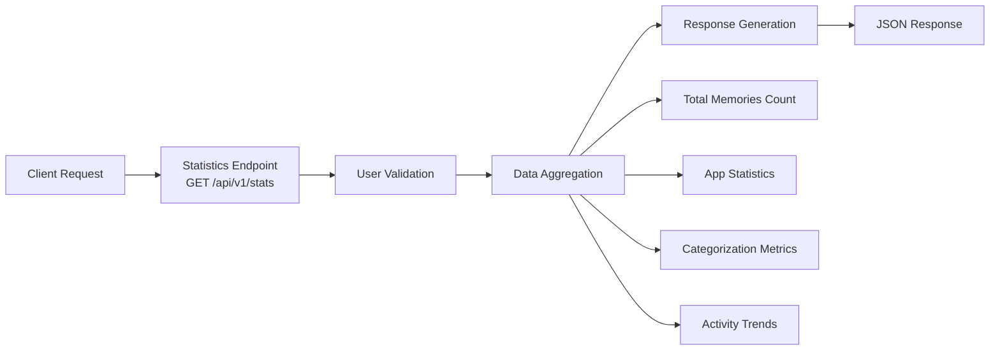
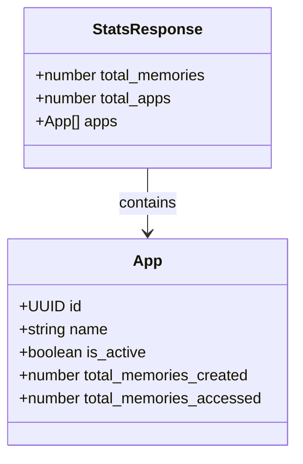
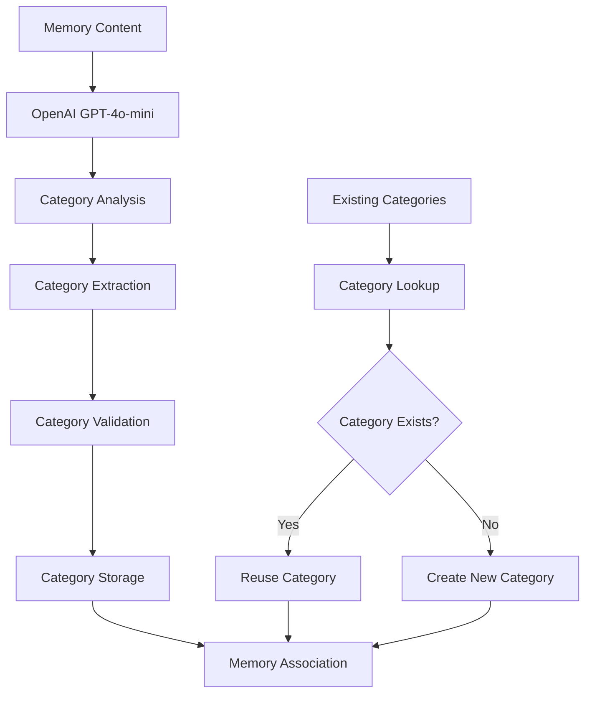
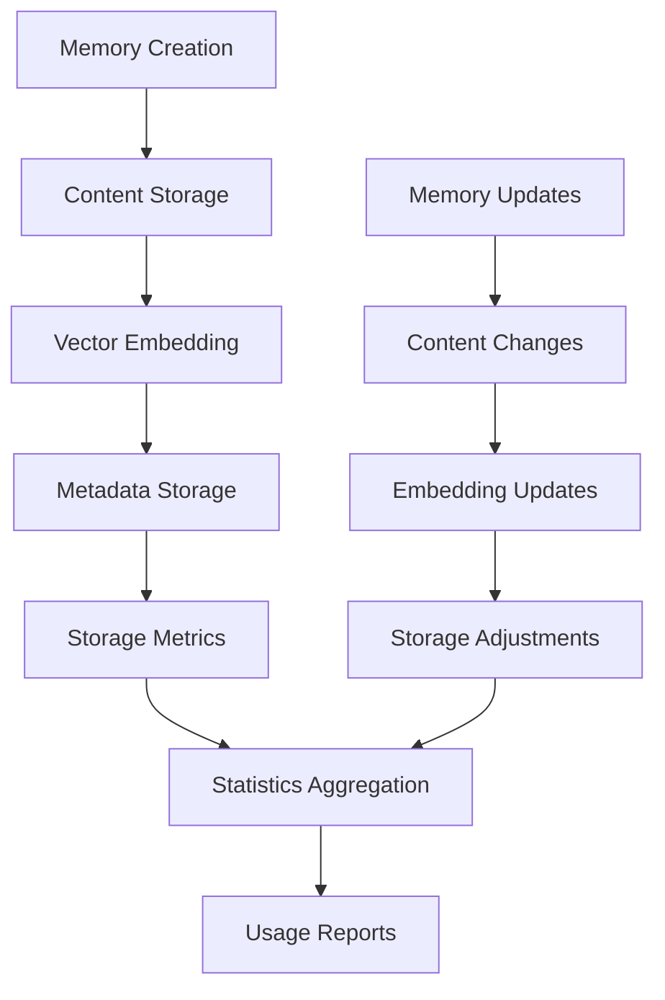
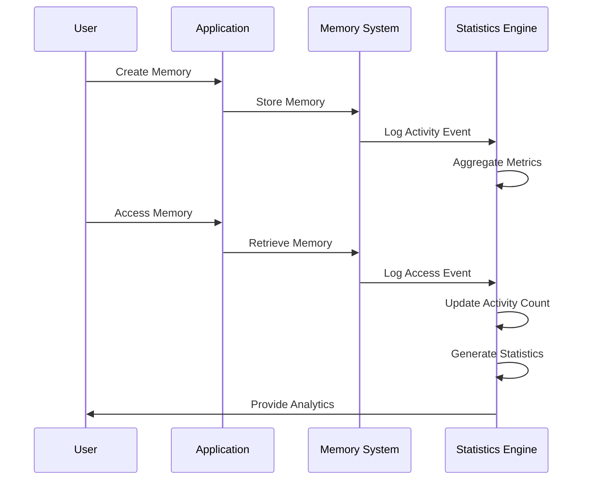
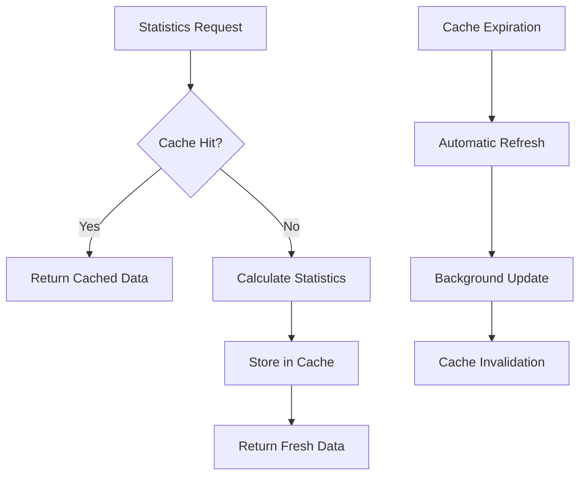

# Statistics Endpoints

<cite>
**Referenced Files in This Document**
- [stats.py](file://openmemory/api/app/routers/stats.py)
- [models.py](file://openmemory/api/app/models.py)
- [schemas.py](file://openmemory/api/app/schemas.py)
- [categorization.py](file://openmemory/api/app/utils/categorization.py)
- [prompts.py](file://openmemory/api/app/utils/prompts.py)
- [memories.py](file://openmemory/api/app/routers/memories.py)
- [apps.py](file://openmemory/api/app/routers/apps.py)
- [useStats.ts](file://openmemory/ui/hooks/useStats.ts)
- [main.py](file://openmemory/api/main.py)
</cite>

## Table of Contents
1. [Introduction](#introduction)
2. [API Endpoint Overview](#api-endpoint-overview)
3. [GET /api/v1/stats](#get-apiv1stats)
4. [Query Parameters](#query-parameters)
5. [Response Data Model](#response-data-model)
6. [Categorization Algorithm](#categorization-algorithm)
7. [Storage Usage Calculation](#storage-usage-calculation)
8. [Recent Activity Metrics](#recent-activity-metrics)
9. [Caching Behavior](#caching-behavior)
10. [Usage Examples](#usage-examples)
11. [Use Cases](#use-cases)
12. [Troubleshooting](#troubleshooting)

## Introduction

The Statistics REST API provides comprehensive system analytics and user engagement metrics for the OpenMemory platform. This endpoint enables monitoring of system health, user activity patterns, and memory management effectiveness. The statistics endpoint aggregates data from multiple sources including memory counts, categorization metrics, app usage statistics, and recent activity trends.

The statistics system is designed for real-time monitoring and historical trend analysis, providing insights into user behavior, system performance, and memory utilization patterns. It serves as a foundation for system administration, user engagement analysis, and capacity planning.

## API Endpoint Overview

The statistics endpoint follows RESTful conventions and provides a single endpoint for retrieving comprehensive system analytics:



**Diagram sources**
- [stats.py](file://openmemory/api/app/routers/stats.py#L8-L29)

**Section sources**
- [stats.py](file://openmemory/api/app/routers/stats.py#L1-L29)
- [main.py](file://openmemory/api/main.py#L82-L84)

## GET /api/v1/stats

### Endpoint Description

Retrieves system analytics including total memories count, memories by category, storage usage, and recent activity metrics for a specific user.

### Authentication

The endpoint requires a valid `user_id` parameter to identify the user whose statistics are being retrieved. The system validates the user's existence before processing the request.

### Request Format

```
GET /api/v1/stats?user_id={user_id}
```

### Response Format

The endpoint returns a JSON object containing comprehensive statistics about the user's memory usage and system engagement.

**Section sources**
- [stats.py](file://openmemory/api/app/routers/stats.py#L8-L29)

## Query Parameters

### Required Parameters

| Parameter | Type | Description | Example |
|-----------|------|-------------|---------|
| `user_id` | string | Unique identifier for the user requesting statistics | `"user123"` |

### Optional Parameters

The current statistics endpoint does not support additional filtering parameters like date ranges or specific categories. All statistics are aggregated across the user's complete dataset.

**Section sources**
- [stats.py](file://openmemory/api/app/routers/stats.py#L10-L11)

## Response Data Model

The statistics endpoint returns a structured JSON response containing the following fields:



**Diagram sources**
- [stats.py](file://openmemory/api/app/routers/stats.py#L24-L28)
- [models.py](file://openmemory/api/app/models.py#L53-L71)

### Response Fields

| Field | Type | Description |
|-------|------|-------------|
| `total_memories` | integer | Total count of memories excluding deleted and archived memories |
| `total_apps` | integer | Total number of applications registered by the user |
| `apps` | array | Array of application objects with usage statistics |

### Application Statistics Structure

Each application object contains detailed usage metrics:

| Field | Type | Description |
|-------|------|-------------|
| `id` | UUID | Unique identifier for the application |
| `name` | string | Human-readable name of the application |
| `is_active` | boolean | Indicates whether the application is currently active |
| `total_memories_created` | integer | Number of memories created by this application |
| `total_memories_accessed` | integer | Number of memories accessed by this application |

**Section sources**
- [stats.py](file://openmemory/api/app/routers/stats.py#L24-L28)
- [models.py](file://openmemory/api/app/models.py#L53-L71)

## Categorization Algorithm

The system employs an automated categorization algorithm to organize memories into meaningful categories. This algorithm enhances statistics reporting by providing insights into memory distribution across different domains.

### Categorization Process



**Diagram sources**
- [categorization.py](file://openmemory/api/app/utils/categorization.py#L18-L44)
- [models.py](file://openmemory/api/app/models.py#L190-L243)

### Supported Categories

The categorization system recognizes the following predefined categories:

| Category | Description | Examples |
|----------|-------------|----------|
| `Personal` | Family, friends, hobbies, lifestyle | Personal achievements, family events, leisure activities |
| `Relationships` | Social connections, professional networks | Colleagues, significant others, social circles |
| `Preferences` | Likes, dislikes, habits, favorites | Favorite foods, hobbies, preferred media |
| `Health` | Physical and mental well-being | Fitness routines, mental health, dietary habits |
| `Travel` | Trips, destinations, travel plans | Vacation itineraries, travel experiences |
| `Work` | Professional activities, career | Job responsibilities, projects, company information |
| `Education` | Learning, skills, academic progress | Courses, certifications, skill development |
| `Finance` | Financial matters, budgeting | Income, expenses, investments |
| `Shopping` | Purchases, wishlists, returns | Online shopping, product reviews |
| `Legal` | Contracts, policies, compliance | Legal agreements, privacy policies |
| `Entertainment` | Media consumption, events | Movies, music, gaming |
| `Messages` | Communication records | Emails, SMS, notifications |
| `Customer Support` | Support interactions | Tickets, inquiries, resolutions |
| `News` | Current events, articles | News articles, trending topics |
| `Organization` | Scheduling, planning | Meetings, appointments, calendars |
| `Goals` | Objectives, KPIs, aspirations | Long-term goals, performance metrics |

### Algorithm Implementation

The categorization algorithm utilizes OpenAI's GPT-4o-mini model with structured output parsing:

1. **Content Analysis**: The system analyzes memory content against predefined category guidelines
2. **Structured Output**: Responses are formatted using Pydantic models for consistent parsing
3. **Retry Logic**: Automatic retry mechanism handles temporary failures
4. **Category Management**: Existing categories are reused while new ones are created as needed

**Section sources**
- [categorization.py](file://openmemory/api/app/utils/categorization.py#L1-L44)
- [prompts.py](file://openmemory/api/app/utils/prompts.py#L1-L29)
- [models.py](file://openmemory/api/app/models.py#L190-L243)

## Storage Usage Calculation

While the current statistics endpoint focuses on high-level metrics, the underlying system tracks storage usage through several mechanisms:

### Memory Storage Tracking



**Diagram sources**
- [models.py](file://openmemory/api/app/models.py#L85-L109)

### Storage Metrics

The system maintains several storage-related metrics:

| Metric | Description | Calculation Method |
|--------|-------------|-------------------|
| Memory Count | Total number of stored memories | Database row count with state filtering |
| Active Memories | Memories in active state | Count of memories with state != deleted/archived |
| App Storage | Per-application memory allocation | Aggregated by app_id with ownership checks |
| Vector Storage | Embedding storage requirements | Calculated based on embedding dimensions |
| Metadata Storage | Additional data storage | JSON field size calculations |

### Storage Optimization

The system implements several storage optimization strategies:

1. **State-based Filtering**: Deleted and archived memories are excluded from active storage calculations
2. **Index Optimization**: Strategic indexing reduces query times for storage calculations
3. **Batch Operations**: Bulk operations minimize database overhead during statistics collection

**Section sources**
- [stats.py](file://openmemory/api/app/routers/stats.py#L17-L22)
- [models.py](file://openmemory/api/app/models.py#L85-L109)

## Recent Activity Metrics

The statistics system tracks various activity patterns to provide insights into user engagement and system usage:

### Activity Tracking Mechanisms



**Diagram sources**
- [apps.py](file://openmemory/api/app/routers/apps.py#L108-L123)
- [models.py](file://openmemory/api/app/models.py#L176-L189)

### Activity Metrics

The system tracks the following activity metrics:

| Metric | Description | Collection Method |
|--------|-------------|-------------------|
| Memory Creation Rate | Frequency of new memory creation | Timestamp-based counting |
| Access Frequency | How often memories are accessed | MemoryAccessLog entries |
| App Engagement | Application usage patterns | Per-app statistics aggregation |
| User Activity Patterns | Daily/weekly usage trends | Temporal analysis |
| Memory Lifecycle | Creation to deletion/archive timeline | State change tracking |

### Temporal Analysis

The system provides temporal insights through:

1. **Creation Timing**: Distribution of memory creation over time
2. **Access Patterns**: When and how frequently memories are accessed
3. **Engagement Trends**: Long-term usage patterns and seasonality
4. **Activity Correlation**: Relationships between different types of activity

**Section sources**
- [apps.py](file://openmemory/api/app/routers/apps.py#L108-L123)
- [models.py](file://openmemory/api/app/models.py#L176-L189)

## Caching Behavior

The statistics endpoint implements intelligent caching to optimize performance and reduce database load:

### Caching Strategy



**Diagram sources**
- [stats.py](file://openmemory/api/app/routers/stats.py#L17-L22)

### Cache Configuration

The caching system implements the following strategies:

| Strategy | Description | Implementation |
|----------|-------------|----------------|
| Query-based Caching | Cache individual statistics queries | SQLAlchemy session caching |
| Result Aggregation | Combine cached results for composite queries | Application-level caching |
| TTL Management | Time-based cache expiration | Configurable timeout periods |
| Invalidation Triggers | Cache refresh on data changes | Event-driven invalidation |

### Performance Optimizations

1. **Lazy Loading**: Statistics are calculated on-demand rather than pre-computed
2. **Incremental Updates**: Only changed data triggers cache refresh
3. **Parallel Processing**: Multiple statistics can be computed concurrently
4. **Connection Pooling**: Database connections are pooled for efficiency

**Section sources**
- [stats.py](file://openmemory/api/app/routers/stats.py#L17-L22)

## Usage Examples

### Basic Statistics Retrieval

Retrieve basic statistics for a user:

```bash
curl -X GET "http://localhost:8765/api/v1/stats?user_id=user123" \
  -H "Content-Type: application/json"
```

### JavaScript Fetch Example

```javascript
const fetchStats = async (userId) => {
  try {
    const response = await fetch(`/api/v1/stats?user_id=${userId}`);
    const data = await response.json();
    
    console.log('Total Memories:', data.total_memories);
    console.log('Total Apps:', data.total_apps);
    console.log('Applications:', data.apps);
  } catch (error) {
    console.error('Failed to fetch stats:', error);
  }
};
```

### React Hook Usage

```typescript
import { useStats } from '@/hooks/useStats';

const StatisticsComponent = () => {
  const { fetchStats, isLoading, error } = useStats();
  
  useEffect(() => {
    fetchStats();
  }, []);
  
  if (isLoading) return <div>Loading...</div>;
  if (error) return <div>Error: {error}</div>;
  
  return (
    <div>
      <h2>User Statistics</h2>
      <p>Total Memories: {totalMemories}</p>
      <p>Total Apps: {totalApps}</p>
    </div>
  );
};
```

### Advanced Filtering (Future Enhancement)

```bash
# Future enhancement - date range filtering
curl -X GET "http://localhost:8765/api/v1/stats?user_id=user123&from_date=1704067200&to_date=1706745600" \
  -H "Content-Type: application/json"
```

**Section sources**
- [useStats.ts](file://openmemory/ui/hooks/useStats.ts#L40-L59)

## Use Cases

### System Health Monitoring

The statistics endpoint serves as a critical component for system health monitoring:

1. **Capacity Planning**: Track memory growth trends to plan storage expansion
2. **Performance Analysis**: Monitor system load through activity patterns
3. **Resource Allocation**: Understand user engagement to optimize resource distribution
4. **Error Detection**: Identify unusual patterns that may indicate system issues

### User Engagement Analysis

Understanding user behavior through statistics:

1. **Adoption Rates**: Measure how quickly users adopt the system
2. **Feature Usage**: Identify popular features and areas for improvement
3. **Retention Analysis**: Track user activity over time to measure retention
4. **Behavior Patterns**: Understand how users interact with different features

### Administrative Insights

System administrators benefit from comprehensive statistics:

1. **Usage Reporting**: Generate reports for stakeholders
2. **Support Requests**: Identify common issues through usage patterns
3. **Training Needs**: Understand user proficiency through statistics
4. **System Optimization**: Optimize system performance based on usage data

### Business Intelligence

Business teams leverage statistics for strategic decisions:

1. **Market Analysis**: Understand market adoption and competition
2. **Product Development**: Prioritize features based on usage data
3. **Customer Success**: Identify at-risk customers through engagement metrics
4. **Revenue Planning**: Forecast revenue based on user growth and engagement

### Compliance and Auditing

Statistics support compliance requirements:

1. **Data Retention**: Track data lifecycle for compliance purposes
2. **Access Logging**: Monitor who accesses what data
3. **Usage Patterns**: Understand data usage for regulatory compliance
4. **Security Monitoring**: Identify unusual access patterns

## Troubleshooting

### Common Issues and Solutions

#### User Not Found Error

**Problem**: `HTTP 404 - User not found`

**Cause**: Invalid or non-existent user_id parameter

**Solution**: Verify the user_id exists in the system and is correctly formatted

```bash
# Check if user exists
curl -X GET "http://localhost:8765/api/v1/users?user_id=invalid_user" \
  -H "Content-Type: application/json"
```

#### Performance Issues

**Problem**: Slow response times

**Cause**: Large datasets or missing indexes

**Solutions**:
1. Implement pagination for large datasets
2. Ensure proper database indexing
3. Consider adding caching layers
4. Optimize database queries

#### Missing Statistics Data

**Problem**: Incomplete or missing statistics

**Cause**: Data inconsistencies or processing errors

**Solutions**:
1. Verify data integrity
2. Check categorization system status
3. Review memory state consistency
4. Validate application associations

### Debugging Tools

#### Enable Debug Logging

```python
import logging
logging.basicConfig(level=logging.DEBUG)
```

#### Database Query Analysis

Monitor slow queries and optimize indexes:

```sql
-- Check query performance
EXPLAIN ANALYZE SELECT COUNT(*) FROM memories WHERE user_id = 'user123' AND state != 'deleted';
```

#### Statistics Validation

Verify statistics accuracy:

```python
# Manual statistics calculation for validation
def validate_statistics(user_id):
    # Compare calculated vs. reported statistics
    pass
```

### Monitoring and Alerting

Set up monitoring for statistics endpoint:

1. **Response Time Monitoring**: Track API response times
2. **Error Rate Tracking**: Monitor HTTP error rates
3. **Data Accuracy Checks**: Validate statistics accuracy
4. **System Resource Usage**: Monitor database and CPU usage

**Section sources**
- [stats.py](file://openmemory/api/app/routers/stats.py#L13-L15)
- [useStats.ts](file://openmemory/ui/hooks/useStats.ts#L49-L55)