# Advanced Features

<cite>
**Referenced Files in This Document**
- [storage.py](file://mem0/memory/storage.py)
- [main.py](file://mem0/memory/main.py)
- [base.py](file://mem0/memory/base.py)
- [utils.py](file://mem0/memory/utils.py)
- [prompts.py](file://mem0/configs/prompts.py)
- [base.py](file://mem0/configs/base.py)
- [graph_memory.py](file://mem0/memory/graph_memory.py)
- [enums.py](file://mem0/configs/enums.py)
- [customer-support-chatbot.ipynb](file://cookbooks/customer-support-chatbot.ipynb)
- [mem0-autogen.ipynb](file://cookbooks/mem0-autogen.ipynb)
- [configs.py](file://mem0/vector_stores/configs.py)
- [valkey.py](file://mem0/configs/vector_stores/valkey.py)
</cite>

## Table of Contents
1. [Introduction](#introduction)
2. [Procedural Memory for Task Sequence Learning](#procedural-memory-for-task-sequence-learning)
3. [Multi-Level Memory Management](#multi-level-memory-management)
4. [Custom Prompt Engineering](#custom-prompt-engineering)
5. [Metadata and Filtering Capabilities](#metadata-and-filtering-capabilities)
6. [Memory Inference Workflows](#memory-inference-workflows)
7. [History Tracking with SQLite Storage](#history-tracking-with-sqlite-storage)
8. [Advanced Use Cases and Implementation Patterns](#advanced-use-cases-and-implementation-patterns)
9. [Performance Considerations](#performance-considerations)
10. [Best Practices](#best-practices)

## Introduction

Mem0's advanced features provide sophisticated memory management capabilities that enable complex AI applications to maintain persistent, contextual, and intelligent memory systems. These features work together to create a comprehensive memory infrastructure that supports everything from simple fact storage to complex procedural memory sequences and multi-context awareness.

The advanced features include:
- **Procedural Memory**: Automatic learning of task sequences and workflows
- **Multi-Level Memory Management**: Hierarchical organization across user, session, and agent contexts
- **Custom Prompt Engineering**: Tailored LLM prompts for memory inference and evolution
- **Metadata and Filtering**: Sophisticated tagging and search capabilities
- **Memory Inference Workflows**: Automated memory evolution using LLMs
- **History Tracking**: Comprehensive audit trails with SQLite storage

## Procedural Memory for Task Sequence Learning

Procedural memory enables Mem0 to automatically learn and store complex task sequences, workflows, and operational procedures. This capability transforms simple conversations into structured knowledge bases that can be reused and evolved over time.

### Implementation Architecture

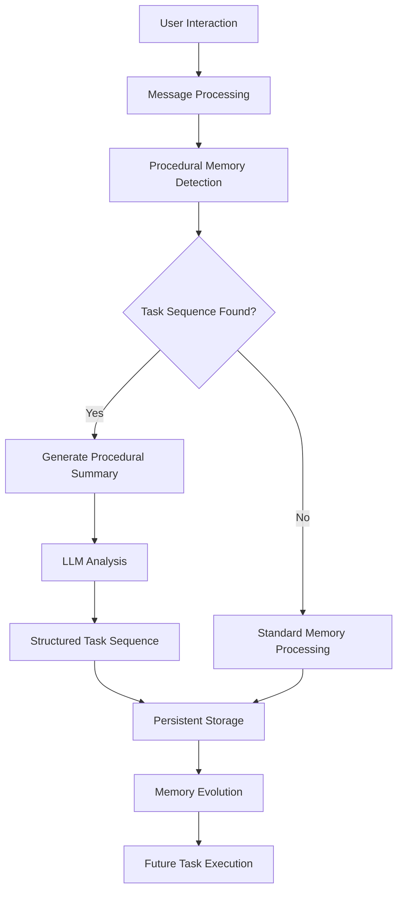

**Diagram sources**
- [main.py](file://mem0/memory/main.py#L878-L907)
- [prompts.py](file://mem0/configs/prompts.py#L211-L287)

### Procedural Memory Creation

The system automatically identifies task sequences and creates structured procedural memories using specialized prompts and LLM analysis:

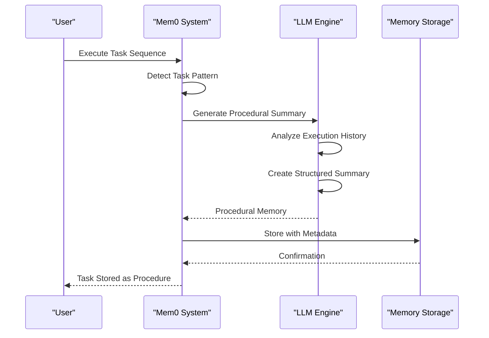

**Diagram sources**
- [main.py](file://mem0/memory/main.py#L878-L907)
- [prompts.py](file://mem0/configs/prompts.py#L211-L287)

### Memory Type Configuration

Procedural memories are distinguished by specific memory types and require agent context:

| Feature | Description | Configuration |
|---------|-------------|---------------|
| **Memory Type** | `MemoryType.PROCEDURAL` | Required for procedural memories |
| **Agent Context** | Must include `agent_id` | Essential for task sequence detection |
| **System Prompt** | `PROCEDURAL_MEMORY_SYSTEM_PROMPT` | Specialized for task analysis |
| **Output Format** | Structured task sequence | Verbatim execution history |

**Section sources**
- [main.py](file://mem0/memory/main.py#L878-L907)
- [enums.py](file://mem0/configs/enums.py#L4-L7)
- [prompts.py](file://mem0/configs/prompts.py#L211-L287)

## Multi-Level Memory Management

Mem0 implements a sophisticated multi-level memory management system that organizes memories across different scopes and contexts, enabling fine-grained access control and intelligent memory retrieval.

### Memory Scope Hierarchy

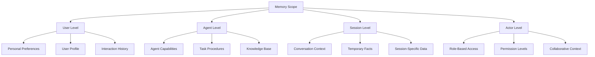

**Diagram sources**
- [main.py](file://mem0/memory/main.py#L46-L126)
- [base.py](file://mem0/memory/base.py#L46-L126)

### Contextual Memory Organization

The system builds comprehensive metadata templates and effective query filters to manage memories across multiple contexts:

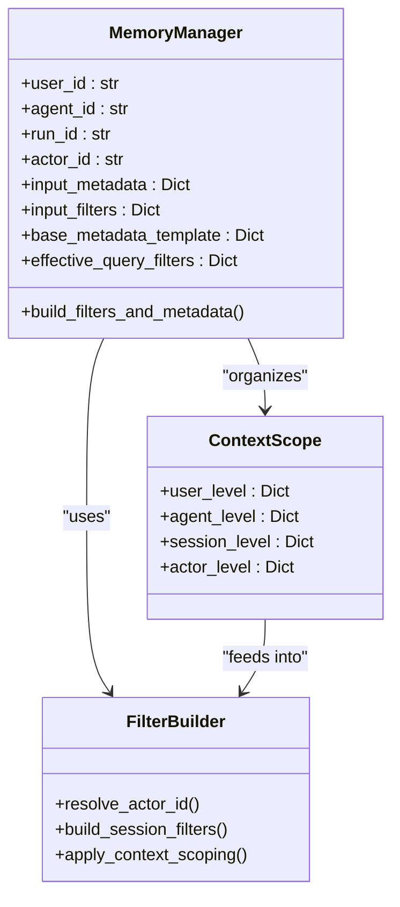

**Diagram sources**
- [main.py](file://mem0/memory/main.py#L46-L126)

### Memory Context Resolution

The system implements a sophisticated precedence system for actor filtering and context resolution:

| Priority | Parameter | Purpose | Scope Impact |
|----------|-----------|---------|--------------|
| **1** | `actor_id` argument | Explicit actor specification | Overrides other filters |
| **2** | `filters["actor_id"]` | Filter-based actor targeting | Applied after session scoping |
| **3** | Session identifiers | User/agent/run scoping | Primary context establishment |

**Section sources**
- [main.py](file://mem0/memory/main.py#L46-L126)

## Custom Prompt Engineering

Mem0 provides extensive customization capabilities for prompt engineering, allowing developers to tailor memory inference and evolution processes to specific use cases and domains.

### Prompt Customization Architecture

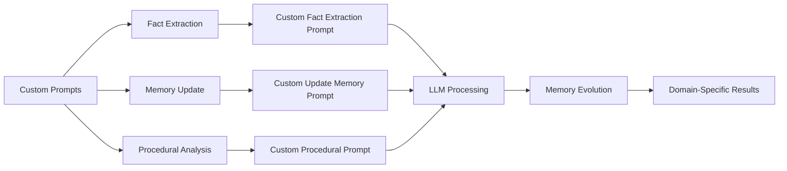

**Diagram sources**
- [prompts.py](file://mem0/configs/prompts.py#L1-L346)
- [utils.py](file://mem0/memory/utils.py#L7-L11)

### Available Custom Prompts

The system provides several customizable prompt templates:

| Prompt Type | Purpose | Configuration Key | Default Behavior |
|-------------|---------|-------------------|------------------|
| **Fact Extraction** | Custom fact extraction logic | `custom_fact_extraction_prompt` | Standard fact extraction |
| **Memory Update** | Custom memory evolution rules | `custom_update_memory_prompt` | Standard update logic |
| **Procedural Analysis** | Custom task sequence analysis | Built-in | Specialized procedure detection |

### Custom Prompt Implementation

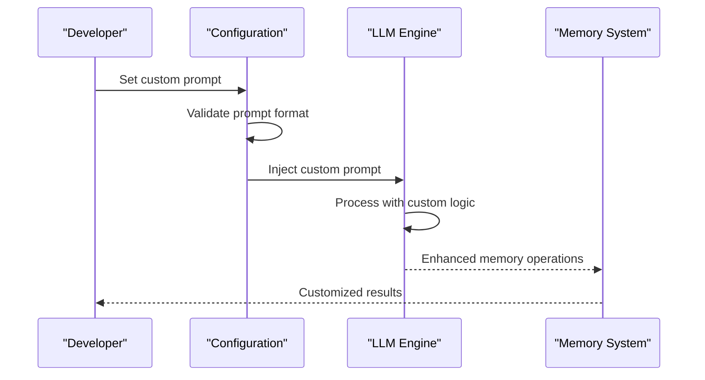

**Diagram sources**
- [prompts.py](file://mem0/configs/prompts.py#L291-L346)
- [base.py](file://mem0/configs/base.py#L54-L61)

**Section sources**
- [prompts.py](file://mem0/configs/prompts.py#L1-L346)
- [base.py](file://mem0/configs/base.py#L54-L61)

## Metadata and Filtering Capabilities

Mem0's metadata and filtering system provides powerful capabilities for organizing, searching, and retrieving memories with precision and flexibility.

### Metadata Schema Design

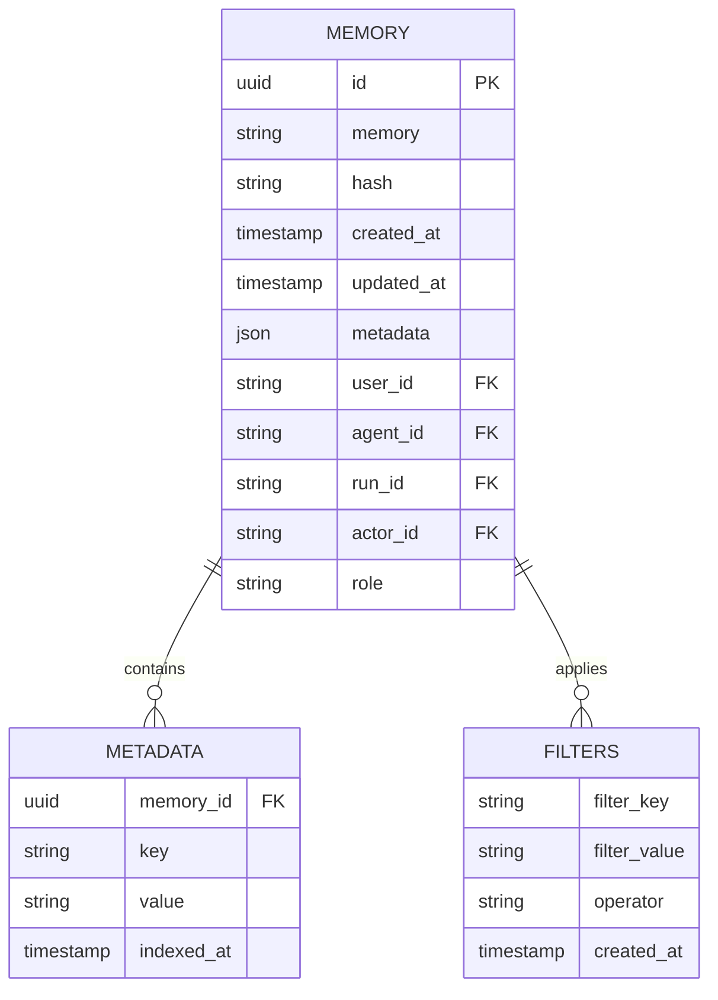

**Diagram sources**
- [main.py](file://mem0/memory/main.py#L46-L126)
- [utils.py](file://mem0/memory/utils.py#L120-L135)

### Advanced Filtering Operations

The system supports sophisticated filtering capabilities:

| Filter Type | Description | Use Case | Performance Impact |
|-------------|-------------|----------|-------------------|
| **Exact Match** | Direct value comparison | User identification | Low |
| **Range Queries** | Numeric/range filtering | Date/time ranges | Medium |
| **Pattern Matching** | Regex/string patterns | Category filtering | Medium-High |
| **Composite Filters** | Multiple condition combinations | Complex queries | High |

### Metadata Indexing Strategy

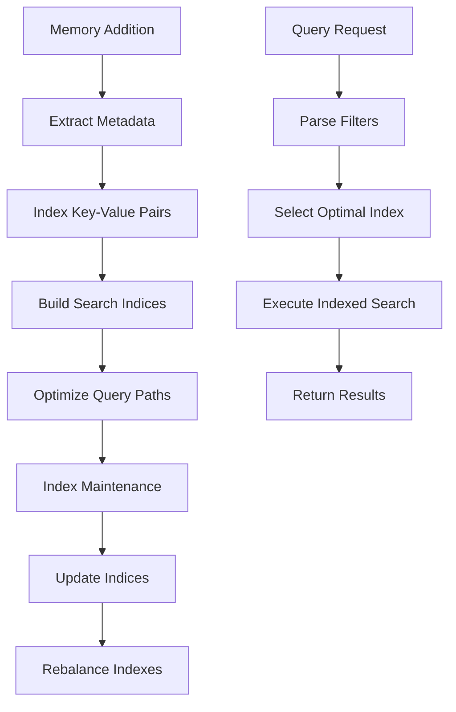

**Diagram sources**
- [main.py](file://mem0/memory/main.py#L46-L126)
- [utils.py](file://mem0/memory/utils.py#L120-L135)

**Section sources**
- [main.py](file://mem0/memory/main.py#L46-L126)
- [utils.py](file://mem0/memory/utils.py#L120-L135)

## Memory Inference Workflows

Mem0's memory inference system uses LLMs to automatically analyze, evolve, and optimize memory content through sophisticated workflow patterns.

### Memory Evolution Pipeline

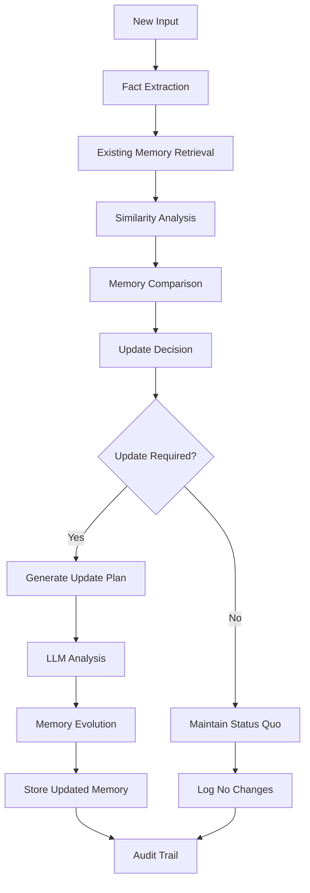

**Diagram sources**
- [main.py](file://mem0/memory/main.py#L347-L474)
- [prompts.py](file://mem0/configs/prompts.py#L291-L346)

### Memory Update Strategies

The system implements four primary memory update strategies:

| Strategy | Trigger Condition | LLM Analysis | Outcome |
|----------|-------------------|--------------|---------|
| **ADD** | New, previously unseen facts | Generates new memory entries | Creates fresh memory |
| **UPDATE** | Existing facts with new information | Analyzes content evolution | Modifies existing memory |
| **DELETE** | Contradictory or outdated information | Identifies conflicts | Removes obsolete memory |
| **NONE** | Redundant or unchanged information | Confirms status quo | Maintains current state |

### Inference Workflow Implementation

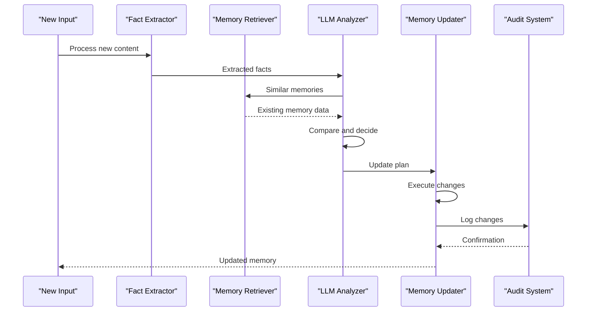

**Diagram sources**
- [main.py](file://mem0/memory/main.py#L347-L474)
- [prompts.py](file://mem0/configs/prompts.py#L291-L346)

**Section sources**
- [main.py](file://mem0/memory/main.py#L347-L474)
- [prompts.py](file://mem0/configs/prompts.py#L291-L346)

## History Tracking with SQLite Storage

Mem0 maintains comprehensive history tracking using SQLite databases, providing detailed audit trails and change management capabilities for all memory operations.

### History Database Schema

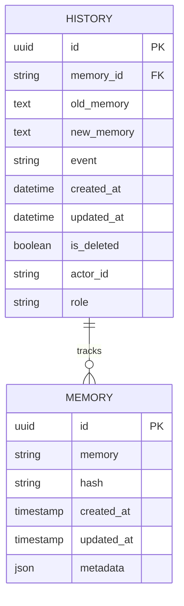

**Diagram sources**
- [storage.py](file://mem0/memory/storage.py#L100-L119)

### History Management Operations

The SQLiteManager provides comprehensive history tracking capabilities:

| Operation | Method | Purpose | Transaction Safety |
|-----------|--------|---------|-------------------|
| **Add History** | `add_history()` | Record memory changes | Atomic transactions |
| **Get History** | `get_history()` | Retrieve change log | Thread-safe queries |
| **Reset** | `reset()` | Clear history table | Safe rollback |
| **Close** | `close()` | Cleanup resources | Graceful shutdown |

### History Event Types

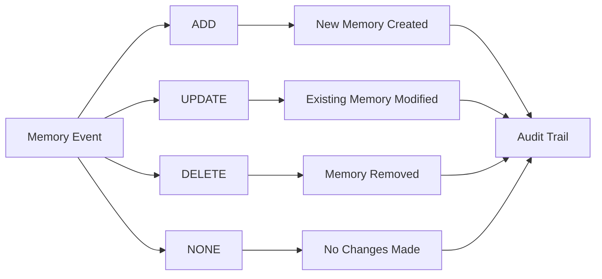

**Diagram sources**
- [storage.py](file://mem0/memory/storage.py#L126-L167)

### Migration and Compatibility

The system includes robust migration capabilities for database schema evolution:

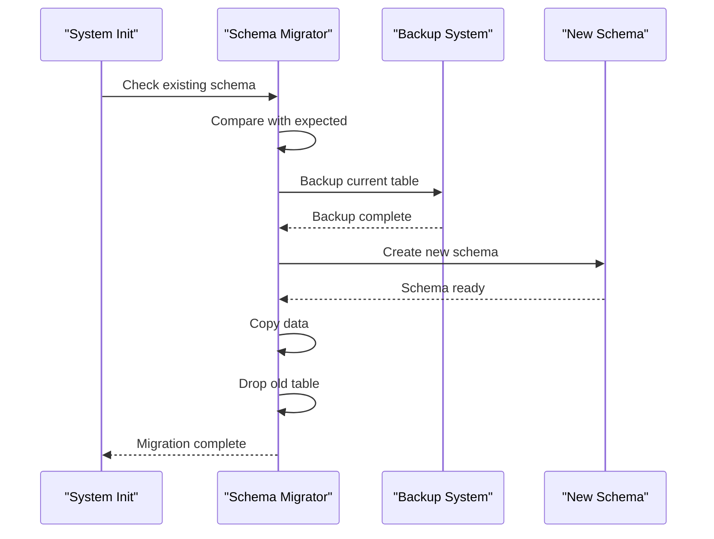

**Diagram sources**
- [storage.py](file://mem0/memory/storage.py#L18-L98)

**Section sources**
- [storage.py](file://mem0/memory/storage.py#L1-L219)

## Advanced Use Cases and Implementation Patterns

### Customer Support Chatbot Implementation

The customer support chatbot demonstrates sophisticated memory management across multiple contexts:

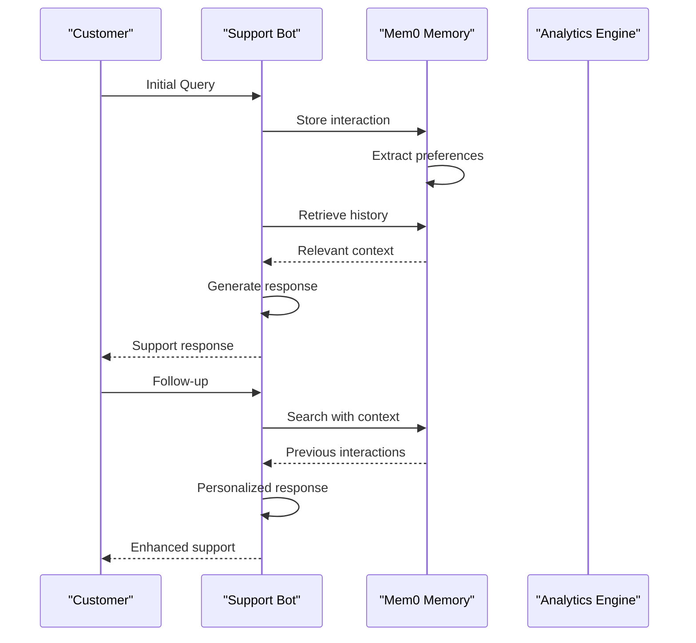

**Diagram sources**
- [customer-support-chatbot.ipynb](file://cookbooks/customer-support-chatbot.ipynb#L1-L200)

### Multi-Agent Collaboration

The AutoGen integration showcases advanced multi-agent memory coordination:

| Feature | Implementation | Benefit | Complexity |
|---------|----------------|---------|------------|
| **Shared Memory** | Agent-specific contexts | Collaborative knowledge | Medium |
| **Memory Synchronization** | Cross-agent sharing | Consistent information | High |
| **Conflict Resolution** | LLM-based merging | Coherent knowledge base | Very High |
| **Access Control** | Role-based permissions | Secure collaboration | Medium |

### Procedural Memory Applications

Procedural memory excels in workflow automation and task management:

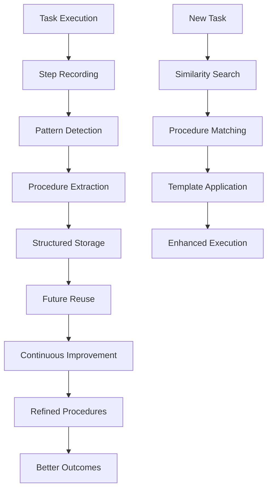

**Section sources**
- [customer-support-chatbot.ipynb](file://cookbooks/customer-support-chatbot.ipynb#L1-L200)
- [mem0-autogen.ipynb](file://cookbooks/mem0-autogen.ipynb#L544-L569)

## Performance Considerations

### Memory Management Performance

| Operation | Complexity | Optimization Strategy | Scaling Factor |
|-----------|------------|----------------------|----------------|
| **Add Memory** | O(log n) | Index optimization | Linear with data |
| **Search Memory** | O(k log n) | Vector indexing | Sub-linear with k |
| **Update Memory** | O(log n) | Incremental updates | Linear with changes |
| **Delete Memory** | O(log n) | Tombstone marking | Linear with deletions |

### Concurrent Access Management

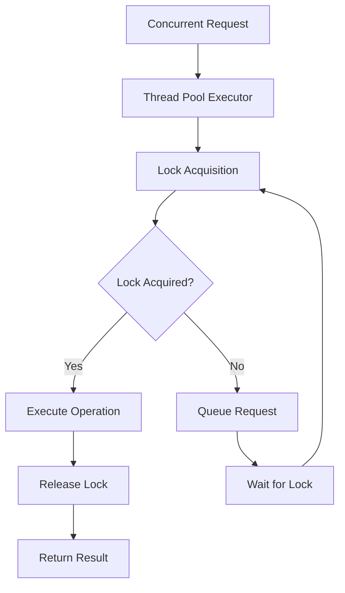

**Diagram sources**
- [main.py](file://mem0/memory/main.py#L283-L290)

### Memory Inference Performance

The memory inference system balances accuracy and performance through strategic optimizations:

| Optimization | Impact | Trade-off | Use Case |
|--------------|--------|-----------|----------|
| **Batch Processing** | High throughput | Higher latency | Bulk operations |
| **Caching** | Reduced latency | Memory usage | Frequent queries |
| **Lazy Loading** | Lower memory | Slower access | Large datasets |
| **Parallel Processing** | Better concurrency | Resource overhead | Complex operations |

**Section sources**
- [main.py](file://mem0/memory/main.py#L283-L290)

## Best Practices

### Memory Organization Principles

1. **Hierarchical Context**: Structure memories by user → agent → session → actor levels
2. **Granular Metadata**: Use specific, searchable metadata fields
3. **Consistent Naming**: Establish naming conventions for memory types and contexts
4. **Regular Cleanup**: Implement periodic memory maintenance and pruning

### Custom Prompt Development

1. **Domain-Specific Language**: Tailor prompts to your application domain
2. **Clear Instructions**: Provide explicit guidance for memory operations
3. **Example Integration**: Include domain-relevant examples
4. **Error Handling**: Design prompts for robust error recovery

### Performance Optimization

1. **Index Strategy**: Choose appropriate indexing for your query patterns
2. **Batch Operations**: Group related operations for better throughput
3. **Connection Pooling**: Manage database connections efficiently
4. **Monitoring**: Implement comprehensive performance monitoring

### Security and Privacy

1. **Access Control**: Implement role-based memory access
2. **Data Classification**: Tag sensitive information appropriately
3. **Audit Trails**: Maintain comprehensive change logs
4. **Encryption**: Protect sensitive memory content

### Integration Patterns

1. **Event-Driven Updates**: Trigger memory updates on relevant events
2. **Asynchronous Processing**: Use background tasks for heavy operations
3. **Circuit Breakers**: Implement failure handling for external dependencies
4. **Version Control**: Track memory schema evolution systematically