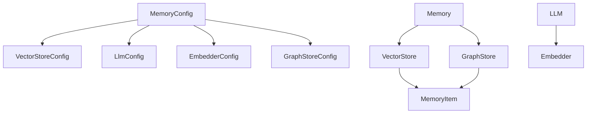

# Appendix

<cite>
**Referenced Files in This Document**   
- [base.py](file://mem0/configs/base.py)
- [vector_stores/configs.py](file://mem0/vector_stores/configs.py)
- [embeddings/configs.py](file://mem0/embeddings/configs.py)
- [llms/configs.py](file://mem0/llms/configs.py)
- [graphs/configs.py](file://mem0/graphs/configs.py)
- [main.py](file://mem0/memory/main.py)
- [chroma.py](file://mem0/vector_stores/chroma.py)
- [openai.py](file://mem0/llms/openai.py)
- [openai.py](file://mem0/embeddings/openai.py)
- [memory.ts](file://mem0-ts/src/oss/src/vector_stores/memory.ts)
- [pgvector.ts](file://mem0-ts/src/oss/src/vector_stores/pgvector.ts)
- [env.py](file://openmemory/api/alembic/env.py)
- [add_config_table.py](file://openmemory/api/alembic/versions/add_config_table.py)
- [0b53c747049a_initial_migration.py](file://openmemory/api/alembic/versions/0b53c747049a_initial_migration.py)
- [LLM.md](file://LLM.md)
</cite>

## Table of Contents
1. [Supported Providers](#supported-providers)
2. [Configuration Schema](#configuration-schema)
3. [Data Models](#data-models)
4. [Migration Guides](#migration-guides)
5. [Backward Compatibility and Deprecation Policies](#backward-compatibility-and-deprecation-policies)

## Supported Providers

### Vector Databases
The system supports 19 vector database providers, each with specific configuration requirements:

| Provider | Status | Configuration Requirements |
|--------|--------|---------------------------|
| qdrant | Stable | `provider: "qdrant"`, optional `config` with host, port, path, api_key, tenant |
| chroma | Stable | `provider: "chroma"`, optional `config` with collection_name, client, host, port, path, api_key, tenant |
| pinecone | Stable | `provider: "pinecone"`, optional `config` with api_key, environment, index_name |
| pgvector | Stable | `provider: "pgvector"`, optional `config` with connection_string, collection_name |
| mongodb | Stable | `provider: "mongodb"`, optional `config` with connection_string, db_name, collection_name |
| milvus | Stable | `provider: "milvus"`, optional `config` with host, port, collection_name |
| weaviate | Stable | `provider: "weaviate"`, optional `config` with url, api_key, collection_name |
| faiss | Stable | `provider: "faiss"`, optional `config` with path, collection_name |
| redis | Stable | `provider: "redis"`, optional `config` with host, port, password, db |
| elasticsearch | Stable | `provider: "elasticsearch"`, optional `config` with host, port, username, password |
| opensearch | Stable | `provider: "opensearch"`, optional `config` with host, port, username, password |
| azure_ai_search | Stable | `provider: "azure_ai_search"`, optional `config` with api_key, service_name, index_name |
| vertex_ai_vector_search | Stable | `provider: "vertex_ai_vector_search"`, optional `config` with project_id, region, index_name |
| upstash_vector | Stable | `provider: "upstash_vector"`, optional `config` with token, url |
| supabase | Stable | `provider: "supabase"`, optional `config` with url, api_key, table_name |
| baidu | Stable | `provider: "baidu"`, optional `config` with api_key, cluster_id, collection_name |
| langchain | Stable | `provider: "langchain"`, optional `config` with vector_store_type, kwargs |
| s3_vectors | Stable | `provider: "s3_vectors"`, optional `config` with bucket_name, aws_access_key_id, aws_secret_access_key |
| databricks | Stable | `provider: "databricks"`, optional `config` with host, token, catalog, schema, table |

**Section sources**
- [vector_stores/configs.py](file://mem0/vector_stores/configs.py#L6-L36)
- [LLM.md](file://LLM.md#L307-L326)

### LLMs
The system supports multiple LLM providers with various configuration options:

| Provider | Status | Configuration Requirements |
|--------|--------|---------------------------|
| openai | Stable | `provider: "openai"`, optional `config` with model, api_key, base_url |
| anthropic | Stable | `provider: "anthropic"`, optional `config` with model, api_key, base_url |
| azure_openai | Stable | `provider: "azure_openai"`, required `config` with azure_deployment, azure_endpoint, api_key |
| gemini | Stable | `provider: "gemini"`, optional `config` with model, api_key |
| groq | Stable | `provider: "groq"`, optional `config` with model, api_key |
| together | Stable | `provider: "together"`, optional `config` with model, api_key |
| vllm | Stable | `provider: "vllm"`, optional `config` with model, base_url |
| ollama | Stable | `provider: "ollama"`, optional `config` with model, base_url |
| deepseek | Stable | `provider: "deepseek"`, optional `config` with model, api_key |
| xai | Stable | `provider: "xai"`, optional `config` with model, api_key |

**Section sources**
- [llms/configs.py](file://mem0/llms/configs.py)
- [LLM.md](file://LLM.md)

### Embedding Models
The system supports 11 embedding providers with specific configuration requirements:

| Provider | Status | Configuration Requirements |
|--------|--------|---------------------------|
| openai | Stable | `provider: "openai"`, optional `config` with model, api_key, base_url |
| ollama | Stable | `provider: "ollama"`, optional `config` with model, base_url |
| huggingface | Stable | `provider: "huggingface"`, optional `config` with model, api_key, base_url |
| azure_openai | Stable | `provider: "azure_openai"`, required `config` with azure_deployment, azure_endpoint, api_key |
| gemini | Stable | `provider: "gemini"`, optional `config` with model, api_key |
| vertexai | Stable | `provider: "vertexai"`, optional `config` with model, project_id, location |
| together | Stable | `provider: "together"`, optional `config` with model, api_key |
| lmstudio | Stable | `provider: "lmstudio"`, optional `config` with model, base_url |
| langchain | Stable | `provider: "langchain"`, optional `config` with embedding_model_type, kwargs |
| aws_bedrock | Stable | `provider: "aws_bedrock"`, optional `config` with model_id, aws_access_key_id, aws_secret_access_key, region_name |
| github_copilot | Stable | `provider: "github_copilot"`, optional `config` with model, api_key |

**Section sources**
- [embeddings/configs.py](file://mem0/embeddings/configs.py#L6-L31)
- [LLM.md](file://LLM.md#L295-L305)

### Graph Stores
The system supports 4 graph store providers with specific configuration requirements:

| Provider | Status | Configuration Requirements |
|--------|--------|---------------------------|
| neo4j | Stable | `provider: "neo4j"`, required `config` with url, username, password, database |
| memgraph | Stable | `provider: "memgraph"`, required `config` with url, username, password |
| neptune | Stable | `provider: "neptune"`, required `config` with endpoint (format: 'neptune-db://<host>' or 'neptune-graph://<graphid>') |
| kuzu | Stable | `provider: "kuzu"`, optional `config` with db path (default: ":memory:") |

**Section sources**
- [graphs/configs.py](file://mem0/graphs/configs.py#L80-L106)
- [LLM.md](file://LLM.md#L328-L332)

## Configuration Schema

### Memory Configuration Schema
The core configuration schema defines the structure for memory system configuration:

```json
{
  "vector_store": {
    "provider": "string",
    "config": "object"
  },
  "llm": {
    "provider": "string",
    "config": "object"
  },
  "embedder": {
    "provider": "string",
    "config": "object"
  },
  "history_db_path": "string",
  "graph_store": {
    "provider": "string",
    "config": "object"
  },
  "version": "string",
  "custom_fact_extraction_prompt": "string",
  "custom_update_memory_prompt": "string"
}
```

**Section sources**
- [base.py](file://mem0/configs/base.py#L29-L62)

### Vector Store Configuration Schema
Each vector store provider has specific configuration options:

```json
{
  "provider": "string",
  "config": {
    "collection_name": "string",
    "host": "string",
    "port": "number",
    "path": "string",
    "api_key": "string",
    "tenant": "string",
    "connection_string": "string",
    "index_name": "string",
    "project_id": "string",
    "region": "string",
    "bucket_name": "string",
    "aws_access_key_id": "string",
    "aws_secret_access_key": "string"
  }
}
```

**Section sources**
- [vector_stores/configs.py](file://mem0/vector_stores/configs.py#L6-L36)

### LLM Configuration Schema
The LLM configuration schema includes common parameters across providers:

```json
{
  "provider": "string",
  "config": {
    "model": "string",
    "api_key": "string",
    "base_url": "string",
    "temperature": "number",
    "max_tokens": "number",
    "top_p": "number",
    "top_k": "number",
    "enable_vision": "boolean",
    "vision_details": "string"
  }
}
```

**Section sources**
- [llms/configs.py](file://mem0/llms/configs.py)

### Embedder Configuration Schema
The embedder configuration schema defines parameters for embedding models:

```json
{
  "provider": "string",
  "config": {
    "model": "string",
    "api_key": "string",
    "base_url": "string",
    "embedding_dims": "number"
  }
}
```

**Section sources**
- [embeddings/configs.py](file://mem0/embeddings/configs.py#L6-L31)

### Graph Store Configuration Schema
The graph store configuration schema varies by provider:

```json
{
  "provider": "string",
  "config": {
    "url": "string",
    "username": "string",
    "password": "string",
    "database": "string",
    "endpoint": "string",
    "db": "string"
  },
  "llm": "object",
  "custom_prompt": "string"
}
```

**Section sources**
- [graphs/configs.py](file://mem0/graphs/configs.py#L80-L106)

## Data Models

### MemoryItem Structure
The MemoryItem data model represents the core memory structure:

```json
{
  "id": "string",
  "memory": "string",
  "hash": "string",
  "metadata": "object",
  "score": "number",
  "created_at": "string",
  "updated_at": "string"
}
```

**Section sources**
- [base.py](file://mem0/configs/base.py#L16-L27)

### Relationships
The system establishes relationships between components through configuration and data flow:



**Diagram sources**
- [base.py](file://mem0/configs/base.py)
- [main.py](file://mem0/memory/main.py)

### Storage Formats
The system uses different storage formats based on the provider:

- **Vector Stores**: Store embeddings as numerical vectors with metadata
- **Graph Stores**: Store entities and relationships as nodes and edges
- **History Database**: SQLite database for operation logging
- **Memory Items**: JSON-serializable objects with core fields and metadata

**Section sources**
- [main.py](file://mem0/memory/main.py)
- [chroma.py](file://mem0/vector_stores/chroma.py)

## Migration Guides

### Configuration Changes
When migrating configuration between versions:

1. **From v1.0 to v1.1**:
   - Update `api_version` from "v1.0" to "v1.1"
   - Wrap API responses in a "results" object
   - Update deprecation warnings in code

2. **Provider-Specific Migrations**:
   - For vector stores: Update collection names and connection parameters
   - For LLMs: Update model names and API endpoints
   - For embedders: Update model specifications and dimensions

3. **Configuration File Updates**:
   - Validate all provider configurations against the latest schema
   - Update deprecated configuration options
   - Test connectivity with all providers

**Section sources**
- [main.py](file://mem0/memory/main.py#L292-L300)
- [main.py](file://mem0/memory/main.py#L593-L603)
- [main.py](file://mem0/memory/main.py#L708-L718)

### Version Upgrades
Step-by-step guide for version upgrades:

1. **Backup Current Configuration**:
   ```python
   # Save current config
   current_config = memory.config.model_dump()
   ```

2. **Update Dependencies**:
   ```bash
   pip install --upgrade mem0ai
   ```

3. **Migrate Vector Store**:
   - Export data from current vector store
   - Import data into new vector store
   - Update configuration with new provider settings

4. **Update API Calls**:
   - Replace deprecated API methods
   - Update response handling for new format
   - Test all integration points

5. **Verify Data Integrity**:
   - Compare record counts before and after migration
   - Validate data consistency across stores
   - Test search and retrieval functionality

**Section sources**
- [env.py](file://openmemory/api/alembic/env.py)
- [add_config_table.py](file://openmemory/api/alembic/versions/add_config_table.py)

### Database Migrations
The system uses Alembic for database migrations:

```python
def upgrade():
    # Create configs table if it doesn't exist
    op.create_table(
        'configs',
        sa.Column('id', sa.UUID(), nullable=False),
        sa.Column('key', sa.String(), nullable=False),
        sa.Column('value', sa.JSON(), nullable=False),
        sa.Column('created_at', sa.DateTime(), nullable=True),
        sa.Column('updated_at', sa.DateTime(), nullable=True),
        sa.PrimaryKeyConstraint('id'),
        sa.UniqueConstraint('key')
    )
    
    # Create index for key lookups
    op.create_index('idx_configs_key', 'configs', ['key'])

def downgrade():
    # Drop the configs table
    op.drop_index('idx_configs_key', 'configs')
    op.drop_table('configs')
```

**Section sources**
- [add_config_table.py](file://openmemory/api/alembic/versions/add_config_table.py)
- [0b53c747049a_initial_migration.py](file://openmemory/api/alembic/versions/0b53c747049a_initial_migration.py)

## Backward Compatibility and Deprecation Policies

### Backward Compatibility
The system maintains backward compatibility through:

1. **Versioned APIs**: Support for multiple API versions (v1.0, v1.1)
2. **Deprecation Warnings**: Clear warnings for deprecated features
3. **Configuration Flexibility**: Support for both old and new configuration formats
4. **Graceful Degradation**: Systems continue to function with deprecated configurations

### Deprecation Policy
The deprecation policy follows a clear timeline:

1. **Announcement Phase**:
   - Feature marked as deprecated
   - Warning messages added to logs and documentation
   - Alternative approaches documented

2. **Transition Phase**:
   - Deprecated feature continues to function
   - Users encouraged to migrate to new approach
   - Support available for migration assistance

3. **Removal Phase**:
   - Deprecated feature removed in major version update
   - Clear upgrade path provided
   - Migration tools available

### Deprecation Examples
Current deprecation warnings in the codebase:

```python
warnings.warn(
    "The current add API output format is deprecated. "
    "To use the latest format, set `api_version='v1.1'`. "
    "The current format will be removed in mem0ai 1.1.0 and later versions.",
    category=DeprecationWarning,
    stacklevel=2,
)
```

**Section sources**
- [main.py](file://mem0/memory/main.py#L292-L300)
- [main.py](file://mem0/memory/main.py#L593-L603)
- [main.py](file://mem0/memory/main.py#L708-L718)