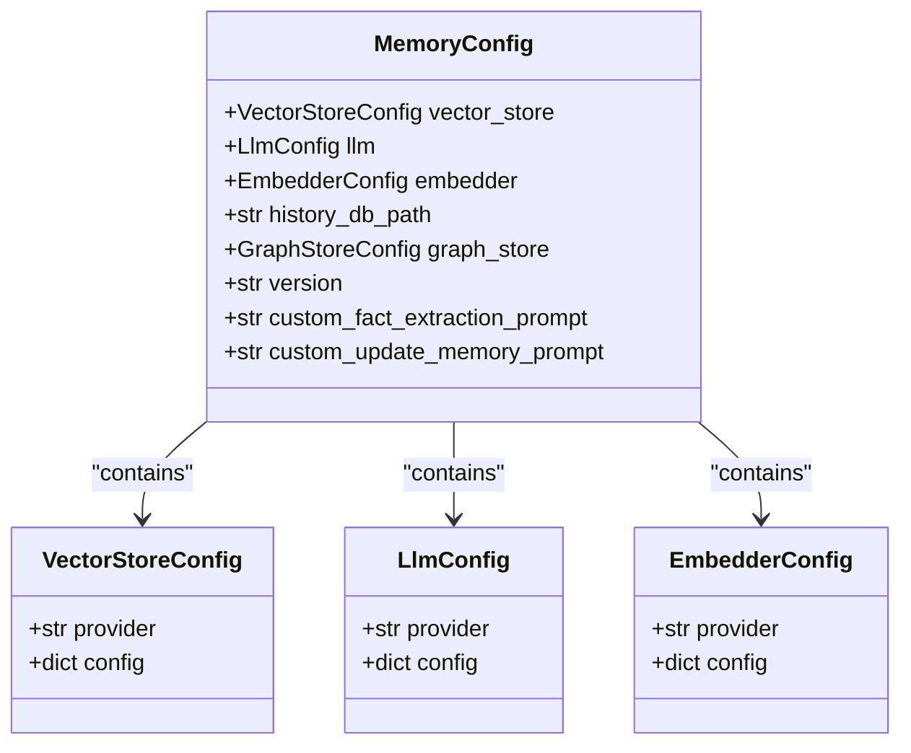
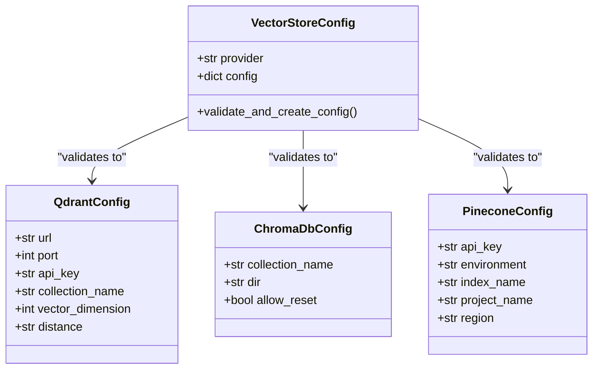
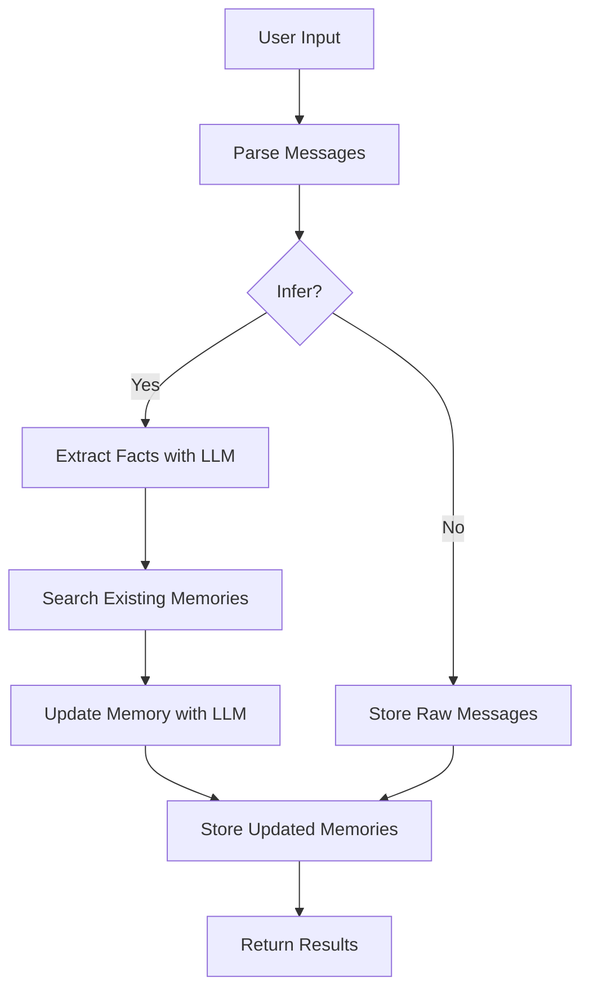

# Configuration Schema

<cite>
**Referenced Files in This Document**   
- [base.py](file://mem0/configs/base.py)
- [vector_stores/configs.py](file://mem0/vector_stores/configs.py)
- [llms/configs.py](file://mem0/llms/configs.py)
- [embeddings/configs.py](file://mem0/embeddings/configs.py)
- [chroma.yaml](file://embedchain/configs/chroma.yaml)
- [pinecone.yaml](file://embedchain/configs/pinecone.yaml)
- [azure_openai.yaml](file://embedchain/configs/azure_openai.yaml)
- [prompts.py](file://mem0/configs/prompts.py)
- [enums.py](file://mem0/configs/enums.py)
</cite>

## Table of Contents
1. [Introduction](#introduction)
2. [Configuration Hierarchy](#configuration-hierarchy)
3. [Core Configuration Schema](#core-configuration-schema)
4. [Vector Store Configuration](#vector-store-configuration)
5. [LLM Configuration](#llm-configuration)
6. [Embedding Model Configuration](#embedding-model-configuration)
7. [Memory Inference Settings](#memory-inference-settings)
8. [Telemetry Options](#telemetry-options)
9. [Configuration Examples](#configuration-examples)
10. [Environment Variables](#environment-variables)
11. [Best Practices](#best-practices)

## Introduction

The Mem0 framework provides a comprehensive configuration system that allows fine-tuning of various components including vector stores, language models, embedding models, and memory management. This document details the complete configuration schema used throughout the Mem0 framework, providing a reference for developers and system administrators to customize the behavior of the memory system according to their specific requirements.

The configuration system is built on Pydantic models, ensuring type safety and validation of configuration parameters. The schema supports hierarchical configuration with sensible defaults, allowing for both simple out-of-the-box usage and complex, customized deployments.

**Section sources**
- [base.py](file://mem0/configs/base.py#L1-L86)
- [vector_stores/configs.py](file://mem0/vector_stores/configs.py#L1-L66)

## Configuration Hierarchy

The Mem0 configuration system follows a hierarchical structure with multiple levels of configuration that can be overridden at different scopes. The hierarchy, from highest to lowest precedence, is:

1. **Runtime Configuration**: Configuration passed directly to the Memory class constructor
2. **Environment Variables**: Configuration values set as environment variables
3. **Configuration Files**: YAML or JSON configuration files
4. **Default Values**: Built-in defaults defined in the configuration schema

This hierarchy allows for flexible configuration management across different deployment environments. For example, production deployments can use environment variables for sensitive information like API keys, while development environments can use configuration files for convenience.

The configuration is centered around the `MemoryConfig` class, which serves as the root configuration object and contains nested configurations for vector stores, LLMs, and embedding models.



**Diagram sources**
- [base.py](file://mem0/configs/base.py#L29-L63)

**Section sources**
- [base.py](file://mem0/configs/base.py#L29-L63)

## Core Configuration Schema

The core configuration schema is defined by the `MemoryConfig` class, which serves as the main configuration container for the Mem0 framework. This class defines the top-level configuration options that control the overall behavior of the memory system.

### MemoryConfig

The `MemoryConfig` class contains the following fields:

```json
{
  "vector_store": {
    "provider": "qdrant",
    "config": {}
  },
  "llm": {
    "provider": "openai",
    "config": {}
  },
  "embedder": {
    "provider": "openai",
    "config": {}
  },
  "history_db_path": "/path/to/history.db",
  "graph_store": {
    "provider": "neptune",
    "config": {}
  },
  "version": "v1.1",
  "custom_fact_extraction_prompt": "Custom prompt for fact extraction",
  "custom_update_memory_prompt": "Custom prompt for updating memories"
}
```

**Field Definitions:**

- **vector_store**: Configuration for the vector store used to store and retrieve memories. This includes the provider (e.g., qdrant, chroma, pinecone) and provider-specific configuration options.
- **llm**: Configuration for the language model used for memory inference and processing. This includes the provider (e.g., openai, anthropic) and model-specific parameters.
- **embedder**: Configuration for the embedding model used to generate vector representations of text. This includes the provider and model-specific settings.
- **history_db_path**: Path to the SQLite database file used to store memory history and metadata. Defaults to `~/.mem0/history.db`.
- **graph_store**: Configuration for the graph database used to store relationships between memories. This is optional and can be disabled by not providing a configuration.
- **version**: API version to use for the memory operations. Currently supports "v1.0" and "v1.1".
- **custom_fact_extraction_prompt**: Custom prompt template for extracting facts from user input. If not provided, the default prompt is used.
- **custom_update_memory_prompt**: Custom prompt template for updating memories based on new information. If not provided, the default prompt is used.

**Section sources**
- [base.py](file://mem0/configs/base.py#L29-L63)

## Vector Store Configuration

The vector store configuration allows for customization of the vector database used to store and retrieve memories. The Mem0 framework supports multiple vector store providers through a pluggable architecture.

### VectorStoreConfig

The `VectorStoreConfig` class defines the configuration for the vector store:

```python
class VectorStoreConfig(BaseModel):
    provider: str = Field(
        description="Provider of the vector store (e.g., 'qdrant', 'chroma', 'upstash_vector')",
        default="qdrant",
    )
    config: Optional[Dict] = Field(description="Configuration for the specific vector store", default=None)
```

The framework supports the following vector store providers:

- qdrant
- chroma
- pgvector
- pinecone
- mongodb
- milvus
- baidu
- neptune
- upstash_vector
- azure_ai_search
- azure_mysql
- redis
- valkey
- databricks
- elasticsearch
- vertex_ai_vector_search
- opensearch
- supabase
- weaviate
- faiss
- langchain
- s3_vectors

Each provider has its own specific configuration options that are validated against the corresponding configuration class when the `validate_and_create_config` method is called.



**Diagram sources**
- [vector_stores/configs.py](file://mem0/vector_stores/configs.py#L6-L66)

**Section sources**
- [vector_stores/configs.py](file://mem0/vector_stores/configs.py#L6-L66)

## LLM Configuration

The LLM configuration allows for customization of the language model used for memory inference, fact extraction, and memory updates.

### LlmConfig

The `LlmConfig` class defines the configuration for the language model:

```python
class LlmConfig(BaseModel):
    provider: str = Field(
        description="Provider of the LLM (e.g., 'openai', 'anthropic', 'gemini')",
        default="openai",
    )
    config: Optional[Dict] = Field(description="Configuration for the specific LLM", default=None)
```

The configuration includes the provider (e.g., openai, anthropic, gemini) and provider-specific configuration options. The specific configuration options vary by provider but typically include:

- model: The specific model to use (e.g., "gpt-4o-mini", "claude-3-opus")
- temperature: Controls randomness in the output (0.0 to 1.0)
- max_tokens: Maximum number of tokens to generate
- top_p: Controls diversity via nucleus sampling
- stream: Whether to stream the response
- api_key: Authentication key for the provider
- base_url: Base URL for the API endpoint (for self-hosted models)

The LLM is used for several critical functions in the Mem0 framework:
- Fact extraction from user input
- Memory inference and updating
- Generating responses based on retrieved memories

**Section sources**
- [llms/configs.py](file://mem0/llms/configs.py#L1-L20)

## Embedding Model Configuration

The embedding model configuration allows for customization of the model used to generate vector representations of text for storage in the vector database.

### EmbedderConfig

The `EmbedderConfig` class defines the configuration for the embedding model:

```python
class EmbedderConfig(BaseModel):
    provider: str = Field(
        description="Provider of the embedding model (e.g., 'openai', 'huggingface', 'ollama')",
        default="openai",
    )
    config: Optional[Dict] = Field(description="Configuration for the specific embedding model", default=None)
```

The configuration includes the provider (e.g., openai, huggingface, ollama) and provider-specific configuration options. Common configuration options include:

- model: The specific embedding model to use (e.g., "text-embedding-ada-002")
- api_key: Authentication key for the provider
- base_url: Base URL for the API endpoint (for self-hosted models)
- dimensions: Number of dimensions in the embedding vector
- chunk_size: Size of text chunks to embed

The embedding model is critical for the vector search functionality, as it determines how text is converted to vectors and how similar memories are retrieved.

**Section sources**
- [embeddings/configs.py](file://mem0/embeddings/configs.py#L1-L20)

## Memory Inference Settings

The memory inference settings control how the system processes user input to extract, update, and manage memories.

### Inference Process

The memory inference process involves several steps:

1. **Fact Extraction**: The system uses the LLM to extract key facts from user input based on the conversation history.
2. **Memory Retrieval**: Relevant existing memories are retrieved from the vector store using semantic search.
3. **Memory Update Decision**: The system determines whether to add, update, or delete memories based on the new facts and existing memories.
4. **Memory Storage**: The updated memories are stored in the vector store and history database.

### Configuration Options

The following configuration options control the memory inference process:

- **custom_fact_extraction_prompt**: A custom prompt template for extracting facts from user input. This allows customization of what types of information are considered important to remember.
- **custom_update_memory_prompt**: A custom prompt template for deciding how to update memories based on new information. This controls the logic for adding, updating, or deleting memories.

The default prompts are designed to extract personal preferences, important details, plans, activity preferences, health preferences, professional details, and miscellaneous information.



**Diagram sources**
- [main.py](file://mem0/memory/main.py#L195-L800)

**Section sources**
- [main.py](file://mem0/memory/main.py#L195-L800)
- [prompts.py](file://mem0/configs/prompts.py#L3-L346)

## Telemetry Options

The Mem0 framework includes telemetry functionality to collect usage data and improve the system over time.

### Telemetry Configuration

Telemetry is configured through the vector store configuration, as the telemetry data is stored in the same vector store as memories. The telemetry system captures events such as:

- mem0.init: When a Memory instance is created
- mem0.add: When memories are added
- mem0.get: When a memory is retrieved by ID
- mem0.get_all: When all memories are retrieved
- mem0.search: When a search is performed
- mem0.update: When a memory is updated
- mem0.delete: When a memory is deleted

The telemetry data includes:
- Event type
- Version information
- Session identifiers (user_id, agent_id, run_id)
- Sync type (sync or async)
- Additional event-specific data

Telemetry can be disabled by not initializing the telemetry vector store, which occurs when the vector store provider is not supported for telemetry storage.

**Section sources**
- [main.py](file://mem0/memory/main.py#L165-L167)
- [telemetry.py](file://mem0/memory/telemetry.py#L1-L20)

## Configuration Examples

This section provides examples of configuration files in both YAML and Python dictionary formats.

### YAML Configuration Examples

**Chroma Configuration (chroma.yaml):**
```yaml
app:
  config:
    id: 'my-app'

llm:
  provider: openai
  config:
    model: 'gpt-4o-mini'
    temperature: 0.5
    max_tokens: 1000
    top_p: 1
    stream: false

vectordb:
  provider: chroma
  config:
    collection_name: 'my-app'
    dir: db
    allow_reset: true

embedder:
  provider: openai
  config:
    model: 'text-embedding-ada-002'
```

**Pinecone Configuration (pinecone.yaml):**
```yaml
vectordb:
  provider: pinecone
  config:
    metric: cosine
    vector_dimension: 1536
    collection_name: my-pinecone-index
```

**Azure OpenAI Configuration (azure_openai.yaml):**
```yaml
app:
  config:
    id: azure-openai-app

llm:
  provider: azure_openai
  config:
    model: gpt-35-turbo
    deployment_name: your_llm_deployment_name
    temperature: 0.5
    max_tokens: 1000
    top_p: 1
    stream: false

embedder:
  provider: azure_openai
  config:
    model: text-embedding-ada-002
    deployment_name: you_embedding_model_deployment_name
```

### Python Dictionary Configuration

```python
config_dict = {
    "vector_store": {
        "provider": "qdrant",
        "config": {
            "url": "http://localhost:6333",
            "api_key": "your-api-key",
            "collection_name": "memories",
            "vector_dimension": 1536,
            "distance": "Cosine"
        }
    },
    "llm": {
        "provider": "openai",
        "config": {
            "model": "gpt-4o-mini",
            "temperature": 0.7,
            "max_tokens": 1000,
            "api_key": "your-openai-key"
        }
    },
    "embedder": {
        "provider": "openai",
        "config": {
            "model": "text-embedding-ada-002",
            "api_key": "your-openai-key"
        }
    },
    "history_db_path": "/path/to/history.db",
    "version": "v1.1",
    "custom_fact_extraction_prompt": "Custom prompt for fact extraction",
    "custom_update_memory_prompt": "Custom prompt for updating memories"
}
```

**Section sources**
- [chroma.yaml](file://embedchain/configs/chroma.yaml#L1-L25)
- [pinecone.yaml](file://embedchain/configs/pinecone.yaml#L1-L7)
- [azure_openai.yaml](file://embedchain/configs/azure_openai.yaml#L1-L20)

## Environment Variables

The Mem0 framework supports configuration through environment variables, which can override values set in configuration files.

### Supported Environment Variables

- **MEM0_DIR**: Custom directory for Mem0 data (defaults to ~/.mem0)
- **OPENAI_API_KEY**: API key for OpenAI services
- **ANTHROPIC_API_KEY**: API key for Anthropic services
- **GOOGLE_API_KEY**: API key for Google services
- **PINECONE_API_KEY**: API key for Pinecone services
- **QDRANT_API_KEY**: API key for Qdrant services
- **WEAVIATE_API_KEY**: API key for Weaviate services
- **MONGODB_URI**: Connection string for MongoDB
- **REDIS_URL**: Connection URL for Redis

Environment variables are automatically detected and used when initializing the corresponding providers. For example, if OPENAI_API_KEY is set in the environment, it will be used for both the LLM and embedding model when using the OpenAI provider.

**Section sources**
- [base.py](file://mem0/configs/base.py#L11-L14)
- [llms/openai.py](file://mem0/llms/openai.py#L1-L20)
- [embeddings/openai.py](file://mem0/embeddings/openai.py#L1-L20)

## Best Practices

This section provides guidance on best practices for configuration management in different deployment scenarios.

### Development Environment

For development environments, use configuration files with the following recommendations:

1. Use local vector stores like Chroma or FAISS for fast iteration
2. Set `allow_reset: true` to easily clear data between tests
3. Use lower `temperature` values (0.3-0.5) for more consistent results during testing
4. Set `stream: false` for easier debugging of responses
5. Use the default history database path for simplicity

### Production Environment

For production environments, follow these best practices:

1. Use managed vector stores like Pinecone, Weaviate, or Qdrant for scalability and reliability
2. Set appropriate API keys through environment variables, not configuration files
3. Use higher `temperature` values (0.7-0.9) for more creative responses
4. Enable streaming (`stream: true`) for better user experience with long responses
5. Regularly backup the history database
6. Monitor vector store performance and scale as needed

### Multi-Tenant Applications

For applications serving multiple users or tenants:

1. Use unique `collection_name` values for each tenant
2. Implement proper session scoping using `user_id`, `agent_id`, or `run_id`
3. Consider using separate vector store instances for high-traffic tenants
4. Implement rate limiting at the application level
5. Use secure authentication for vector store access

### Performance Optimization

To optimize performance:

1. Choose embedding models with appropriate dimensionality for your use case
2. Use vector stores with efficient indexing for your data size
3. Set appropriate `max_tokens` limits to control response length
4. Consider using smaller, faster LLMs for simple queries
5. Implement caching for frequently accessed memories
6. Monitor and optimize the vector search threshold based on your accuracy requirements

**Section sources**
- [base.py](file://mem0/configs/base.py)
- [vector_stores/configs.py](file://mem0/vector_stores/configs.py)
- [llms/configs.py](file://mem0/llms/configs.py)
- [embeddings/configs.py](file://mem0/embeddings/configs.py)