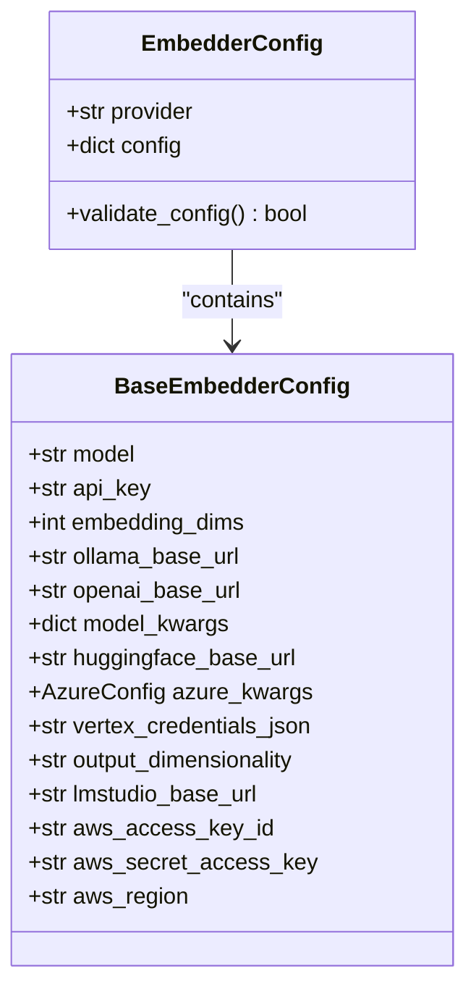
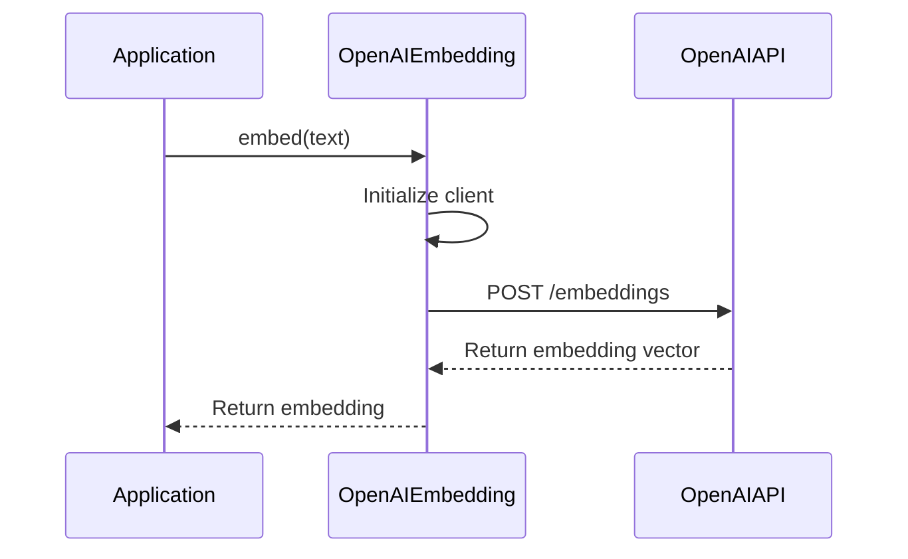
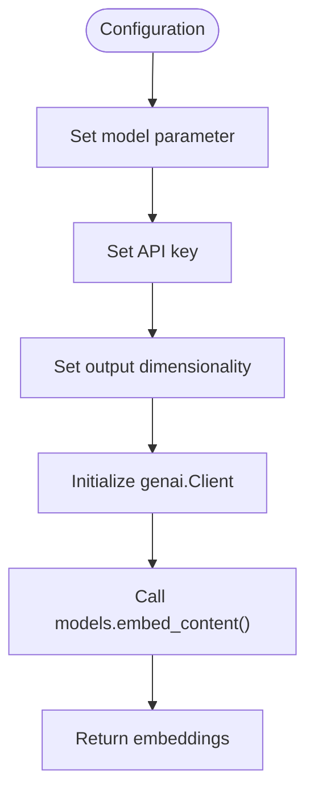
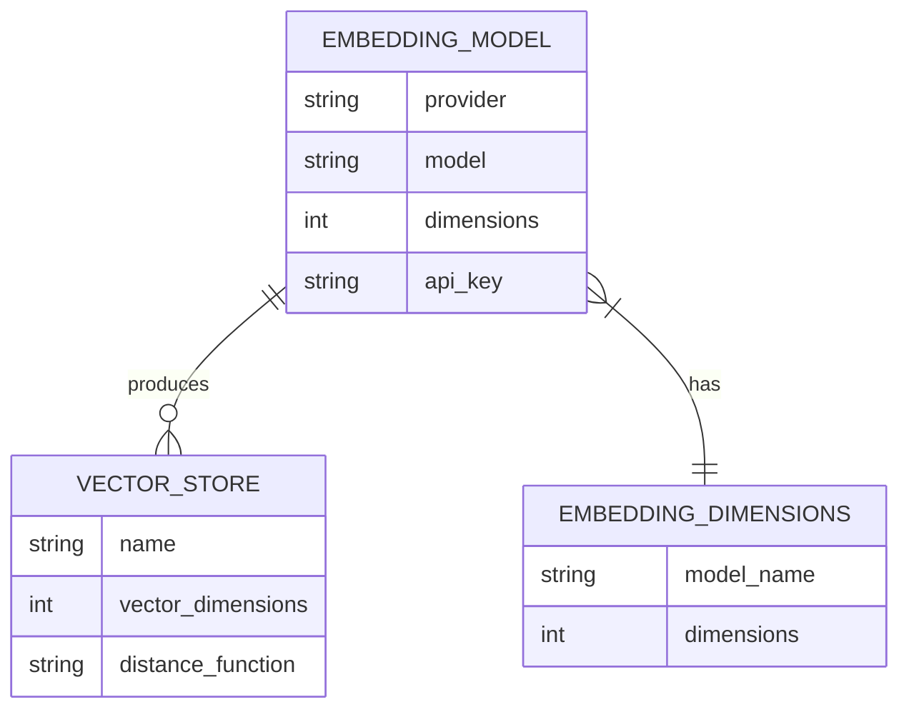

# Embedding Model Configuration

<cite>
**Referenced Files in This Document**   
- [base.py](file://mem0/configs/embeddings/base.py)
- [configs.py](file://mem0/embeddings/configs.py)
- [openai.py](file://mem0/embeddings/openai.py)
- [azure_openai.py](file://mem0/embeddings/azure_openai.py)
- [gemini.py](file://mem0/embeddings/gemini.py)
- [huggingface.py](file://mem0/embeddings/huggingface.py)
- [ollama.py](file://mem0/embeddings/ollama.py)
- [azure_openai.yaml](file://embedchain/configs/azure_openai.yaml)
- [ollama.yaml](file://embedchain/configs/ollama.yaml)
- [vector_dimensions.py](file://embedchain/models/vector_dimensions.py)
</cite>

## Table of Contents
1. [Introduction](#introduction)
2. [Core Configuration Schema](#core-configuration-schema)
3. [Provider-Specific Configuration](#provider-specific-configuration)
4. [Configuration Examples](#configuration-examples)
5. [Vector Store Integration](#vector-store-integration)
6. [Performance Considerations](#performance-considerations)
7. [Model Selection Guidance](#model-selection-guidance)
8. [Troubleshooting](#troubleshooting)

## Introduction
This document provides comprehensive guidance on configuring embedding models in Mem0, a memory framework for AI applications. The embedding configuration system supports multiple providers including OpenAI, Azure, Gemini, HuggingFace, Ollama, and custom endpoints. This documentation covers the configuration schema, provider-specific parameters, integration with vector stores, performance characteristics, and troubleshooting guidance.

**Section sources**
- [configs.py](file://mem0/embeddings/configs.py#L6-L31)
- [base.py](file://mem0/configs/embeddings/base.py#L10-L111)

## Core Configuration Schema

The embedding configuration in Mem0 follows a standardized schema with a provider-based architecture. The core configuration consists of two main components: the provider identifier and provider-specific configuration options.



**Diagram sources**
- [configs.py](file://mem0/embeddings/configs.py#L6-L31)
- [base.py](file://mem0/configs/embeddings/base.py#L10-L111)

The configuration schema is defined by two primary classes:

1. **EmbedderConfig**: The top-level configuration class that specifies the provider and contains provider-specific configuration
2. **BaseEmbedderConfig**: The base configuration class that defines common parameters across all providers

Key configuration parameters include:
- **provider**: The embedding service provider (e.g., 'openai', 'azure_openai', 'gemini')
- **model**: The specific embedding model to use
- **api_key**: Authentication key for the embedding service
- **embedding_dims**: The dimensionality of the embedding vectors
- **base URLs**: Custom endpoints for self-hosted or alternative service locations

**Section sources**
- [configs.py](file://mem0/embeddings/configs.py#L6-L31)
- [base.py](file://mem0/configs/embeddings/base.py#L10-L111)

## Provider-Specific Configuration

### OpenAI Configuration
The OpenAI embedding provider supports both standard and Azure deployments. Key configuration options include:

- **model**: The embedding model to use (default: "text-embedding-3-small")
- **api_key**: OpenAI API key (can be set via OPENAI_API_KEY environment variable)
- **openai_base_url**: Custom base URL for OpenAI-compatible services
- **embedding_dims**: Vector dimensionality (defaults to 1536 for OpenAI models)



**Diagram sources**
- [openai.py](file://mem0/embeddings/openai.py#L11-L50)
- [base.py](file://mem0/configs/embeddings/base.py#L10-L111)

### Azure OpenAI Configuration
Azure OpenAI configuration requires additional parameters for Azure-specific deployment:

- **deployment_name**: The name of the deployed model in Azure
- **azure_endpoint**: The Azure OpenAI service endpoint
- **api_version**: The API version to use
- **azure_deployment**: The deployment name for the embedding model
- **api_key**: Azure OpenAI API key

Authentication can be handled via API key or Azure DefaultAzureCredential for managed identity.

**Section sources**
- [azure_openai.py](file://mem0/embeddings/azure_openai.py#L13-L56)
- [base.py](file://mem0/configs/embeddings/base.py#L10-L111)

### Gemini Configuration
The Google Gemini embedding provider (Google GenAI) configuration includes:

- **model**: The Gemini embedding model (default: "models/text-embedding-004")
- **api_key**: Google API key (can be set via GOOGLE_API_KEY environment variable)
- **output_dimensionality**: The desired output dimensionality
- **embedding_dims**: Vector dimensionality (defaults to 768)



**Diagram sources**
- [gemini.py](file://mem0/embeddings/gemini.py#L11-L40)
- [base.py](file://mem0/configs/embeddings/base.py#L10-L111)

### HuggingFace Configuration
HuggingFace embedding configuration supports both local models and Text Embeddings Inference (TEI) servers:

- **model**: The HuggingFace model identifier (default: "multi-qa-MiniLM-L6-cos-v1")
- **huggingface_base_url**: URL for TEI server
- **model_kwargs**: Additional arguments for the SentenceTransformer model
- **embedding_dims**: Automatically determined from model if not specified

When huggingface_base_url is provided, the configuration uses OpenAI-compatible TEI endpoints.

**Section sources**
- [huggingface.py](file://mem0/embeddings/huggingface.py#L15-L42)
- [base.py](file://mem0/configs/embeddings/base.py#L10-L111)

### Ollama Configuration
Ollama embedding configuration enables local model execution:

- **model**: The Ollama model name (default: "nomic-embed-text")
- **ollama_base_url**: The Ollama server URL (default: None, uses default)
- **embedding_dims**: Vector dimensionality (defaults to 512)
- **auto-pull**: Automatically downloads models if not present locally

The Ollama integration includes automatic model management, pulling models from the Ollama registry when needed.

**Section sources**
- [ollama.py](file://mem0/embeddings/ollama.py#L24-L54)
- [base.py](file://mem0/configs/embeddings/base.py#L10-L111)

## Configuration Examples

### Python Configuration
```python
from mem0.embeddings.configs import EmbedderConfig
from mem0.configs.embeddings.base import BaseEmbedderConfig

# OpenAI configuration
openai_config = EmbedderConfig(
    provider="openai",
    config={
        "model": "text-embedding-3-large",
        "api_key": "your-openai-api-key",
        "embedding_dims": 3072
    }
)

# Azure OpenAI configuration
azure_config = EmbedderConfig(
    provider="azure_openai",
    config={
        "model": "text-embedding-ada-002",
        "azure_kwargs": {
            "api_key": "your-azure-api-key",
            "azure_deployment": "your-deployment-name",
            "azure_endpoint": "https://your-resource.azure.com",
            "api_version": "2023-05-15"
        }
    }
)

# Ollama configuration
ollama_config = EmbedderConfig(
    provider="ollama",
    config={
        "model": "mxbai-embed-large:latest",
        "ollama_base_url": "http://localhost:11434",
        "embedding_dims": 1024
    }
)
```

### YAML Configuration
```yaml
# Azure OpenAI configuration
embedder:
  provider: azure_openai
  config:
    model: text-embedding-ada-002
    azure_kwargs:
      api_key: your-azure-api-key
      azure_deployment: your-embedding-deployment
      azure_endpoint: https://your-resource.azure.com
      api_version: 2023-05-15

# Ollama configuration
embedder:
  provider: ollama
  config:
    model: mxbai-embed-large:latest
    ollama_base_url: http://localhost:11434
    embedding_dims: 1024

# HuggingFace configuration
embedder:
  provider: huggingface
  config:
    model: BAAI/bge-large-en-v1.5
    embedding_dims: 1024
```

**Section sources**
- [azure_openai.yaml](file://embedchain/configs/azure_openai.yaml#L15-L20)
- [ollama.yaml](file://embedchain/configs/ollama.yaml#L13-L15)
- [openai.py](file://mem0/embeddings/openai.py#L11-L50)
- [azure_openai.py](file://mem0/embeddings/azure_openai.py#L13-L56)

## Vector Store Integration

Embedding configurations directly impact vector store compatibility and search quality. The dimensionality of embeddings must match the vector store schema to ensure proper indexing and retrieval.



**Diagram sources**
- [vector_dimensions.py](file://embedchain/models/vector_dimensions.py#L5-L16)
- [base.py](file://mem0/configs/embeddings/base.py#L10-L111)

### Default Vector Dimensions
The following table lists the default dimensions for supported embedding providers:

| Provider | Default Model | Default Dimensions | Notes |
|----------|---------------|-------------------|-------|
| OpenAI | text-embedding-3-small | 1536 | Can be customized up to 3072 |
| Azure OpenAI | text-embedding-ada-002 | 1536 | Fixed dimensionality |
| Gemini | text-embedding-004 | 768 | Supports dimensionality reduction |
| HuggingFace | multi-qa-MiniLM-L6-cos-v1 | 384 | Varies by model |
| Ollama | nomic-embed-text | 512 | Varies by model |
| AWS Bedrock | Titan v2 | 1024 | Titan v1 uses 1536 |

**Section sources**
- [vector_dimensions.py](file://embedchain/models/vector_dimensions.py#L5-L16)
- [base.py](file://mem0/configs/embeddings/base.py#L10-L111)

## Performance Considerations

### Latency and Throughput
Different embedding providers exhibit varying performance characteristics:

- **OpenAI/Azure**: Cloud-based with typical latency of 200-500ms per request
- **Ollama**: Local execution with latency dependent on hardware (50-200ms on modern CPUs)
- **HuggingFace**: Local models have lower latency than cloud APIs but require more memory
- **Gemini**: Google's infrastructure provides consistent low-latency responses

### Token Limits and Batching
- **OpenAI**: Maximum 8191 tokens per request
- **Azure OpenAI**: Maximum 8191 tokens per request
- **Gemini**: Maximum 8192 tokens per request
- **Ollama**: Varies by model, typically 2048-8192 tokens

For optimal performance with large texts, implement batching strategies that split content into chunks within token limits.

### Caching Strategies
Implement response caching for frequently embedded content to reduce API calls and improve response times. The framework supports configurable caching mechanisms that can be enabled in the embedding configuration.

**Section sources**
- [openai.py](file://mem0/embeddings/openai.py#L44-L49)
- [azure_openai.py](file://mem0/embeddings/azure_openai.py#L54-L56)
- [gemini.py](file://mem0/embeddings/gemini.py#L31-L40)
- [ollama.py](file://mem0/embeddings/ollama.py#L52-L54)

## Model Selection Guidance

### Accuracy vs. Cost Trade-offs
When selecting embedding models, consider the following factors:

- **High accuracy requirements**: Use larger models like text-embedding-3-large (OpenAI) or BAAI/bge-large-en-v1.5 (HuggingFace)
- **Cost-sensitive applications**: Use smaller models like text-embedding-3-small (OpenAI) or nomic-embed-text (Ollama)
- **Latency-critical applications**: Use local models (Ollama, HuggingFace) to eliminate network overhead

### Provider Comparison
| Provider | Accuracy | Cost | Latency | Self-hosting | Best Use Case |
|---------|---------|------|---------|-------------|---------------|
| OpenAI | High | $$$$ | Medium | No | Production applications requiring high accuracy |
| Azure OpenAI | High | $$$$ | Medium | No | Enterprise applications with Azure integration |
| Gemini | High | $$$ | Low | No | Google Cloud ecosystem applications |
| HuggingFace | Medium-High | $-$$$ | Low-Medium | Yes | Custom models and fine-tuning |
| Ollama | Medium | $ | Low | Yes | Local development and privacy-sensitive applications |

### Dimensionality Impact
Higher dimensionality embeddings generally provide better semantic separation but require more storage and computational resources. Choose dimensionality based on:
- Available memory and storage
- Required search precision
- Vector store capabilities
- Query performance requirements

**Section sources**
- [vector_dimensions.py](file://embedchain/models/vector_dimensions.py#L5-L16)
- [openai.py](file://mem0/embeddings/openai.py#L15-L16)
- [gemini.py](file://mem0/embeddings/gemini.py#L16-L17)

## Troubleshooting

### Common Issues and Solutions

#### Dimension Mismatch Errors
**Symptom**: "Vector dimension mismatch" or "embedding dimension does not match index dimension"
**Solution**: 
1. Verify the embedding_dims parameter matches your vector store configuration
2. Check the default dimensions for your chosen model
3. Explicitly set embedding_dims in the configuration

```python
config = EmbedderConfig(
    provider="openai",
    config={
        "model": "text-embedding-3-small",
        "embedding_dims": 1536  # Ensure this matches your vector store
    }
)
```

#### Authentication Errors
**Symptom**: "Authentication failed" or "Invalid API key"
**Solution**:
1. Verify the API key is correct and has embedding permissions
2. Check environment variables if using key injection
3. For Azure, ensure the deployment name is correct
4. For AWS Bedrock, verify IAM permissions

#### Model Not Found
**Symptom**: "Model not found" or "Deployment not found"
**Solution**:
1. Verify the model name is correct and available in your region
2. For Ollama, ensure the model is pulled locally or the URL is accessible
3. For Azure, confirm the deployment name matches exactly

#### High Latency
**Symptom**: Slow embedding generation
**Solution**:
1. Consider switching to local models (Ollama, HuggingFace)
2. Implement batching for multiple texts
3. Add caching for frequently embedded content
4. Check network connectivity to cloud providers

**Section sources**
- [openai.py](file://mem0/embeddings/openai.py#L18-L24)
- [azure_openai.py](file://mem0/embeddings/azure_openai.py#L17-L21)
- [ollama.py](file://mem0/embeddings/ollama.py#L38-L41)
- [huggingface.py](file://mem0/embeddings/huggingface.py#L19-L22)