# LLM Configuration

<cite>
**Referenced Files in This Document**   
- [base.py](file://mem0/configs/llms/base.py)
- [openai.py](file://mem0/configs/llms/openai.py)
- [anthropic.py](file://mem0/configs/llms/anthropic.py)
- [azure.py](file://mem0/configs/llms/azure.py)
- [ollama.py](file://mem0/configs/llms/ollama.py)
- [vllm.py](file://mem0/configs/llms/vllm.py)
- [deepseek.py](file://mem0/configs/llms/deepseek.py)
- [lmstudio.py](file://mem0/configs/llms/lmstudio.py)
- [factory.py](file://mem0/utils/factory.py)
- [vllm_example.py](file://mem0/examples/misc/vllm_example.py)
- [exceptions.py](file://mem0/exceptions.py)
- [azure_openai.yaml](file://embedchain/configs/azure_openai.yaml)
- [anthropic.yaml](file://embedchain/configs/anthropic.yaml)
- [vllm.yaml](file://embedchain/configs/vllm.yaml)
- [gpt4.yaml](file://embedchain/configs/gpt4.yaml)
- [vertexai.yaml](file://embedchain/configs/vertexai.yaml)
</cite>

## Table of Contents
1. [Introduction](#introduction)
2. [Core Configuration Architecture](#core-configuration-architecture)
3. [Base LLM Configuration](#base-llm-configuration)
4. [Provider-Specific Configurations](#provider-specific-configurations)
   - [OpenAI Configuration](#openai-configuration)
   - [Anthropic Configuration](#anthropic-configuration)
   - [Azure OpenAI Configuration](#azure-openai-configuration)
   - [Ollama Configuration](#ollama-configuration)
   - [vLLM Configuration](#vllm-configuration)
   - [DeepSeek Configuration](#deepseek-configuration)
   - [LM Studio Configuration](#lm-studio-configuration)
5. [Configuration Examples](#configuration-examples)
   - [Python Configuration Examples](#python-configuration-examples)
   - [YAML Configuration Examples](#yaml-configuration-examples)
6. [Generation Parameters](#generation-parameters)
7. [Streaming Options](#streaming-options)
8. [Error Handling and Troubleshooting](#error-handling-and-troubleshooting)
9. [Model Selection Guidance](#model-selection-guidance)

## Introduction

The Mem0 framework provides a comprehensive configuration system for Large Language Models (LLMs) that supports multiple providers including OpenAI, Anthropic, Azure, Ollama, vLLM, DeepSeek, and others. This documentation details the configuration schema, parameters, and best practices for setting up and using different LLM providers within the Mem0 ecosystem.

The configuration system is designed with a hierarchical architecture where common parameters are defined in a base configuration class, while provider-specific settings are handled by individual configuration classes. This approach ensures consistency across providers while allowing for the unique requirements of each service.

**Section sources**
- [base.py](file://mem0/configs/llms/base.py#L1-L63)
- [factory.py](file://mem0/utils/factory.py#L1-L224)

## Core Configuration Architecture

The LLM configuration system in Mem0 follows a factory pattern with a base configuration class that defines common parameters across all providers. The architecture consists of:

1. **BaseLlmConfig**: Abstract base class containing common parameters shared by all LLM providers
2. **Provider-specific Config Classes**: Individual classes that inherit from BaseLlmConfig and add provider-specific parameters
3. **LlmFactory**: Factory class that creates LLM instances based on provider configuration
4. **Configuration Validation**: Built-in validation to ensure proper setup

The factory pattern enables dynamic creation of LLM instances based on provider configuration, supporting both object-based and dictionary-based configuration approaches. This design allows for easy extension to support new providers while maintaining a consistent interface.

```mermaid
classDiagram
class BaseLlmConfig {
+model : Optional[Union[str, Dict]]
+temperature : float
+api_key : Optional[str]
+max_tokens : int
+top_p : float
+top_k : int
+enable_vision : bool
+vision_details : Optional[str]
+http_client : Optional[httpx.Client]
+__init__(model, temperature, api_key, max_tokens, top_p, top_k, enable_vision, vision_details, http_client_proxies)
}
class OpenAIConfig {
+openai_base_url : Optional[str]
+models : Optional[List[str]]
+route : Optional[str]
+openrouter_base_url : Optional[str]
+site_url : Optional[str]
+app_name : Optional[str]
+store : bool
+response_callback : Optional[Callable[[Any, dict, dict], None]]
+__init__(model, temperature, api_key, max_tokens, top_p, top_k, enable_vision, vision_details, http_client_proxies, openai_base_url, models, route, openrouter_base_url, site_url, app_name, store, response_callback)
}
class AnthropicConfig {
+anthropic_base_url : Optional[str]
+__init__(model, temperature, api_key, max_tokens, top_p, top_k, enable_vision, vision_details, http_client_proxies, anthropic_base_url)
}
class AzureOpenAIConfig {
+azure_kwargs : AzureConfig
+__init__(model, temperature, api_key, max_tokens, top_p, top_k, enable_vision, vision_details, http_client_proxies, azure_kwargs)
}
class OllamaConfig {
+ollama_base_url : Optional[str]
+__init__(model, temperature, api_key, max_tokens, top_p, top_k, enable_vision, vision_details, http_client_proxies, ollama_base_url)
}
class VllmConfig {
+vllm_base_url : Optional[str]
+__init__(model, temperature, api_key, max_tokens, top_p, top_k, enable_vision, vision_details, http_client_proxies, vllm_base_url)
}
class DeepSeekConfig {
+deepseek_base_url : Optional[str]
+__init__(model, temperature, api_key, max_tokens, top_p, top_k, enable_vision, vision_details, http_client_proxies, deepseek_base_url)
}
class LMStudioConfig {
+lmstudio_base_url : Optional[str]
+lmstudio_response_format : Optional[Dict[str, Any]]
+__init__(model, temperature, api_key, max_tokens, top_p, top_k, enable_vision, vision_details, http_client_proxies, lmstudio_base_url, lmstudio_response_format)
}
BaseLlmConfig <|-- OpenAIConfig
BaseLlmConfig <|-- AnthropicConfig
BaseLlmConfig <|-- AzureOpenAIConfig
BaseLlmConfig <|-- OllamaConfig
BaseLlmConfig <|-- VllmConfig
BaseLlmConfig <|-- DeepSeekConfig
BaseLlmConfig <|-- LMStudioConfig
```



**Diagram sources**
- [base.py](file://mem0/configs/llms/base.py#L7-L63)
- [openai.py](file://mem0/configs/llms/openai.py#L6-L80)
- [anthropic.py](file://mem0/configs/llms/anthropic.py#L6-L57)
- [azure.py](file://mem0/configs/llms/azure.py#L7-L58)
- [ollama.py](file://mem0/configs/llms/ollama.py#L6-L57)
- [vllm.py](file://mem0/configs/llms/vllm.py#L6-L57)
- [deepseek.py](file://mem0/configs/llms/deepseek.py#L6-L57)
- [lmstudio.py](file://mem0/configs/llms/lmstudio.py#L6-L57)

**Section sources**
- [base.py](file://mem0/configs/llms/base.py#L7-L63)
- [factory.py](file://mem0/utils/factory.py#L23-L129)

## Base LLM Configuration

The `BaseLlmConfig` class defines the common parameters that are shared across all LLM providers. These parameters control fundamental aspects of LLM behavior and are available regardless of the specific provider being used.

### Common Parameters

The base configuration includes the following parameters:

- **model**: The model identifier to use (e.g., "gpt-4o-mini", "claude-3-5-sonnet-20240620"). Defaults to None.
- **temperature**: Controls the randomness of the model's output. Higher values (closer to 1) make output more random, lower values make it more deterministic. Range: 0.0 to 2.0. Defaults to 0.1.
- **api_key**: API key for the LLM provider. If None, will try to get from environment variables. Defaults to None.
- **max_tokens**: Maximum number of tokens to generate in the response. Range: 1 to 4096 (varies by model). Defaults to 2000.
- **top_p**: Nucleus sampling parameter. Controls diversity via nucleus sampling. Higher values (closer to 1) make word selection more diverse. Range: 0.0 to 1.0. Defaults to 0.1.
- **top_k**: Top-k sampling parameter. Limits the number of tokens considered for each step. Higher values make word selection more diverse. Range: 1 to 40. Defaults to 1.
- **enable_vision**: Whether to enable vision capabilities for the model. Only applicable to vision-enabled models. Defaults to False.
- **vision_details**: Level of detail for vision processing. Options: "low", "high", "auto". Defaults to "auto".
- **http_client_proxies**: Proxy settings for HTTP client. Can be a dict or string. Defaults to None.

These parameters provide a consistent interface for controlling LLM behavior across different providers, ensuring that core functionality remains uniform regardless of the underlying service.

**Section sources**
- [base.py](file://mem0/configs/llms/base.py#L16-L63)

## Provider-Specific Configurations

### OpenAI Configuration

The `OpenAIConfig` class extends the base configuration with parameters specific to OpenAI and OpenRouter services.

#### OpenAI-Specific Parameters

- **openai_base_url**: OpenAI API base URL. Defaults to None.
- **models**: List of models for OpenRouter. Defaults to None.
- **route**: OpenRouter route strategy. Defaults to "fallback".
- **openrouter_base_url**: OpenRouter base URL. Defaults to None.
- **site_url**: Site URL for OpenRouter. Defaults to None.
- **app_name**: Application name for OpenRouter. Defaults to None.
- **store**: Boolean flag for storing data. Defaults to False.
- **response_callback**: Optional callback function for monitoring LLM responses.

The OpenAI configuration supports both direct OpenAI API usage and OpenRouter routing, providing flexibility for different deployment scenarios. The response callback allows for monitoring and logging of LLM interactions, which can be useful for debugging and analytics.

**Section sources**
- [openai.py](file://mem0/configs/llms/openai.py#L12-L80)

### Anthropic Configuration

The `AnthropicConfig` class extends the base configuration with parameters specific to the Anthropic service.

#### Anthropic-Specific Parameters

- **anthropic_base_url**: Anthropic API base URL. Defaults to None.

The Anthropic configuration is relatively simple, focusing on the base URL for API requests. This allows users to specify custom endpoints for Anthropic services, which can be useful for enterprise deployments or when using Anthropic through different hosting arrangements.

**Section sources**
- [anthropic.py](file://mem0/configs/llms/anthropic.py#L12-L57)

### Azure OpenAI Configuration

The `AzureOpenAIConfig` class extends the base configuration with parameters specific to Azure OpenAI services.

#### Azure-Specific Parameters

- **azure_kwargs**: Azure-specific configuration as a dictionary. This is converted to an `AzureConfig` object during initialization.

The Azure configuration uses a flexible approach by accepting a dictionary of Azure-specific parameters, which are then converted to an `AzureConfig` object. This design allows for the inclusion of various Azure-specific settings without cluttering the main configuration class.

**Section sources**
- [azure.py](file://mem0/configs/llms/azure.py#L13-L58)

### Ollama Configuration

The `OllamaConfig` class extends the base configuration with parameters specific to Ollama services.

#### Ollama-Specific Parameters

- **ollama_base_url**: Ollama base URL. Defaults to None.

The Ollama configuration allows users to specify the base URL for their Ollama server, enabling local or remote deployment options. This is particularly useful for self-hosted Ollama instances.

**Section sources**
- [ollama.py](file://mem0/configs/llms/ollama.py#L12-L57)

### vLLM Configuration

The `VllmConfig` class extends the base configuration with parameters specific to vLLM services.

#### vLLM-Specific Parameters

- **vllm_base_url**: vLLM base URL. Defaults to "http://localhost:8000/v1".

The vLLM configuration includes a default URL pointing to a local vLLM server, making it easy to get started with local deployment. The configuration supports high-performance inference with benefits including 2.7x higher throughput and 5x faster time-per-output-token compared to standard implementations.

**Section sources**
- [vllm.py](file://mem0/configs/llms/vllm.py#L12-L57)

### DeepSeek Configuration

The `DeepSeekConfig` class extends the base configuration with parameters specific to DeepSeek services.

#### DeepSeek-Specific Parameters

- **deepseek_base_url**: DeepSeek API base URL. Defaults to None.

The DeepSeek configuration allows users to specify the base URL for DeepSeek API requests, providing flexibility for different deployment scenarios and hosting arrangements.

**Section sources**
- [deepseek.py](file://mem0/configs/llms/deepseek.py#L12-L57)

### LM Studio Configuration

The `LMStudioConfig` class extends the base configuration with parameters specific to LM Studio services.

#### LM Studio-Specific Parameters

- **lmstudio_base_url**: LM Studio base URL. Defaults to None.
- **lmstudio_response_format**: Response format configuration for LM Studio. Defaults to None.

The LM Studio configuration supports both URL specification and response format customization, allowing for fine-tuned control over LM Studio interactions.

**Section sources**
- [lmstudio.py](file://mem0/configs/llms/lmstudio.py#L12-L57)

## Configuration Examples

### Python Configuration Examples

#### Basic OpenAI Configuration

```python
from mem0.configs.llms.openai import OpenAIConfig

config = OpenAIConfig(
    model="gpt-4o-mini",
    temperature=0.7,
    api_key="your-api-key",
    max_tokens=2000,
    top_p=0.9,
    openai_base_url="https://api.openai.com/v1"
)
```

#### Azure OpenAI Configuration

```python
from mem0.configs.llms.azure import AzureOpenAIConfig

config = AzureOpenAIConfig(
    model="gpt-35-turbo",
    temperature=0.5,
    api_key="your-api-key",
    max_tokens=1000,
    azure_kwargs={
        "azure_endpoint": "https://your-resource.azure.com",
        "api_version": "2023-05-15"
    }
)
```

#### vLLM Configuration

```python
from mem0 import Memory
from mem0.configs.llms.vllm import VllmConfig

config = {
    "llm": {
        "provider": "vllm",
        "config": {
            "model": "Qwen/Qwen2.5-32B-Instruct",
            "vllm_base_url": "http://localhost:8000/v1",
            "api_key": "vllm-api-key",
            "temperature": 0.7,
            "max_tokens": 100,
        },
    },
    "embedder": {"provider": "openai", "config": {"model": "text-embedding-3-small"}},
    "vector_store": {
        "provider": "qdrant",
        "config": {"collection_name": "vllm_memories", "host": "localhost", "port": 6333},
    },
}

memory = Memory.from_config(config)
```

**Section sources**
- [vllm_example.py](file://mem0/examples/misc/vllm_example.py#L28-L44)
- [openai.py](file://mem0/configs/llms/openai.py#L12-L80)
- [azure.py](file://mem0/configs/llms/azure.py#L13-L58)
- [vllm.py](file://mem0/configs/llms/vllm.py#L12-L57)

### YAML Configuration Examples

#### Azure OpenAI Configuration

```yaml
app:
  config:
    id: azure-openai-app

llm:
  provider: azure_openai
  config:
    model: gpt-35-turbo
    deployment_name: your_llm_deployment_name
    temperature: 0.5
    max_tokens: 1000
    top_p: 1
    stream: false

embedder:
  provider: azure_openai
  config:
    model: text-embedding-ada-002
    deployment_name: you_embedding_model_deployment_name
```

#### Anthropic Configuration

```yaml
llm:
  provider: anthropic
  config:
    model: 'claude-instant-1'
    temperature: 0.5
    max_tokens: 1000
    top_p: 1
    stream: false
```

#### vLLM Configuration

```yaml
llm:
  provider: vllm
  config:
    model: 'meta-llama/Llama-2-70b-hf'
    temperature: 0.5
    top_p: 1
    top_k: 10
    stream: true
    trust_remote_code: true

embedder:
  provider: huggingface
  config:
    model: 'BAAI/bge-small-en-v1.5'
```

#### GPT-4 Configuration

```yaml
llm:
  provider: openai
  config:
    model: 'gpt-4'
    temperature: 0.5
    max_tokens: 1000
    top_p: 1
    stream: false
```

#### Vertex AI Configuration

```yaml
llm:
  provider: vertexai
  config:
    model: 'chat-bison'
    temperature: 0.5
    top_p: 0.5
```

**Section sources**
- [azure_openai.yaml](file://embedchain/configs/azure_openai.yaml#L1-L20)
- [anthropic.yaml](file://embedchain/configs/anthropic.yaml#L1-L9)
- [vllm.yaml](file://embedchain/configs/vllm.yaml#L1-L15)
- [gpt4.yaml](file://embedchain/configs/gpt4.yaml#L1-L8)
- [vertexai.yaml](file://embedchain/configs/vertexai.yaml#L1-L6)

## Generation Parameters

The Mem0 LLM configuration system provides fine-grained control over text generation through several key parameters:

### Temperature

The temperature parameter controls the randomness of the model's output. Lower values (closer to 0) make the output more deterministic and focused, while higher values (closer to 2.0) increase randomness and creativity. The default value is 0.1, which provides a good balance between consistency and creativity for most use cases.

### Max Tokens

This parameter sets the maximum number of tokens to generate in the response. The range varies by model but typically falls between 1 and 4096 tokens. Setting appropriate token limits is crucial for managing response length and API costs.

### Top-p (Nucleus Sampling)

Top-p sampling controls diversity by considering only the most probable tokens whose cumulative probability exceeds the p threshold. A value of 1.0 considers all tokens, while lower values create more focused output. The default value is 0.1, which creates focused responses.

### Top-k Sampling

Top-k sampling limits the number of tokens considered for each generation step to the k most likely options. This parameter provides another way to control output diversity, with higher values allowing for more varied word selection. The default value is 1, which selects the most likely token at each step.

### Model Selection

The model parameter specifies which specific model to use within a provider. Different models have varying capabilities, context window sizes, and performance characteristics. For example, "gpt-4o-mini" is optimized for efficiency, while "gpt-4" provides more advanced reasoning capabilities.

**Section sources**
- [base.py](file://mem0/configs/llms/base.py#L18-L26)

## Streaming Options

The Mem0 framework supports streaming responses from LLMs, allowing for real-time display of generated content. While the base configuration classes don't directly include a streaming parameter, streaming is supported through provider-specific implementations and configuration.

In YAML configuration files, the `stream` parameter can be set to control streaming behavior:

```yaml
llm:
  provider: openai
  config:
    model: 'gpt-4'
    temperature: 0.5
    max_tokens: 1000
    top_p: 1
    stream: true
```

When streaming is enabled, the LLM response is delivered incrementally rather than as a complete response. This is particularly useful for applications that need to display content as it's generated, such as chat interfaces or real-time assistants.

**Section sources**
- [gpt4.yaml](file://embedchain/configs/gpt4.yaml#L8)
- [vllm.yaml](file://embedchain/configs/vllm.yaml#L8)

## Error Handling and Troubleshooting

The Mem0 framework includes comprehensive error handling through a structured exception hierarchy defined in the `exceptions.py` file. These exceptions provide detailed information for troubleshooting common issues.

### Common Error Types

#### AuthenticationError
Raised when authentication fails due to invalid API keys, expired tokens, or missing credentials. The suggestion typically advises checking API key configuration.

#### RateLimitError
Raised when API rate limits are exceeded. Includes debug information such as `retry_after` (seconds to wait before retrying), `limit` (current rate limit), and `remaining` (remaining requests in current window).

#### NetworkError
Raised for network connectivity issues such as connection timeouts, DNS resolution failures, or service unavailability.

#### ConfigurationError
Raised when client configuration is invalid, such as missing API keys or invalid host URLs.

#### LLMError
Raised when LLM operations fail, such as text generation or model inference errors.

### Troubleshooting Common Issues

#### Rate Limiting
When encountering rate limiting issues:
1. Implement exponential backoff in your application
2. Check the `retry_after` value in the error's debug_info
3. Consider upgrading your plan for higher rate limits
4. Implement request queuing to manage throughput

#### Authentication Failures
For authentication issues:
1. Verify your API key is correctly configured
2. Check that the key has the necessary permissions
3. Ensure the key hasn't expired
4. Confirm the key is being passed to the correct provider

#### Model Availability
If a model is not available:
1. Verify the model name is correct and supported by the provider
2. Check that your account has access to the model
3. Confirm the model is properly deployed (for self-hosted solutions)
4. Try an alternative model as a fallback

#### Timeout Issues
For timeout problems:
1. Check your network connectivity
2. Verify the service endpoint is reachable
3. Increase timeout settings if supported
4. Consider using a closer regional endpoint

**Section sources**
- [exceptions.py](file://mem0/exceptions.py#L34-L503)

## Model Selection Guidance

Selecting the appropriate model depends on your specific use case requirements, performance needs, and cost considerations.

### Use Case Recommendations

#### Customer Support Chatbots
For customer support applications, prioritize models with:
- Fast response times
- High accuracy in understanding user queries
- Cost-effective pricing
Recommended models: gpt-35-turbo, claude-instant-1, gpt-4o-mini

#### Complex Reasoning Tasks
For applications requiring advanced reasoning and problem-solving:
- Use models specifically designed for reasoning (e.g., o1, o3)
- Consider models with larger context windows
- Prioritize accuracy over speed
Recommended models: gpt-4, claude-3-opus, o1

#### High-Volume Applications
For applications with high request volumes:
- Focus on cost efficiency
- Consider models with lower per-token pricing
- Optimize for throughput
Recommended models: gpt-35-turbo, gpt-4o-mini, Llama-2-70b

#### Vision Capabilities
For applications requiring image analysis:
- Select vision-enabled models
- Consider the required detail level (low, high, auto)
- Balance image processing quality with cost
Recommended models: gpt-4o, claude-3-opus with vision

### Cost Considerations

When evaluating cost:
1. Consider both input and output token pricing
2. Factor in the average conversation length
3. Evaluate the cost of embedding operations if used
4. Consider the total monthly volume and potential volume discounts

### Performance Trade-offs

Different models offer various performance trade-offs:
- **Speed vs. Quality**: Smaller models are faster but may have lower quality
- **Cost vs. Capability**: More capable models typically cost more
- **Latency vs. Throughput**: Some configurations optimize for low latency, others for high throughput

The vLLM integration provides significant performance benefits with 2.7x higher throughput and 5x faster time-per-output-token, making it an excellent choice for high-performance requirements.

**Section sources**
- [vllm_example.py](file://mem0/examples/misc/vllm_example.py#L123-L127)
- [base.py](file://mem0/configs/llms/base.py#L31-L53)
- [exceptions.py](file://mem0/exceptions.py#L115-L135)