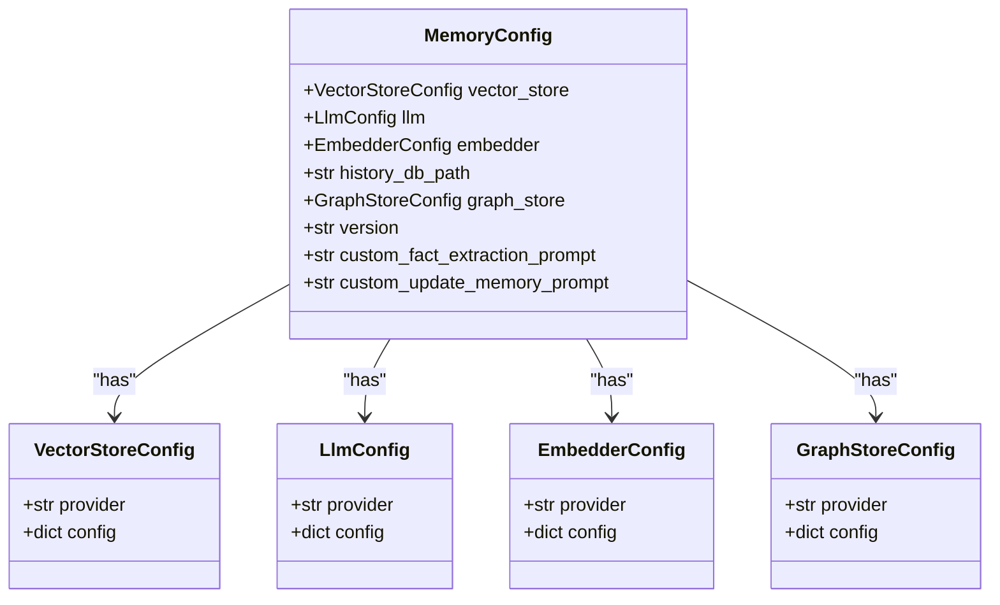
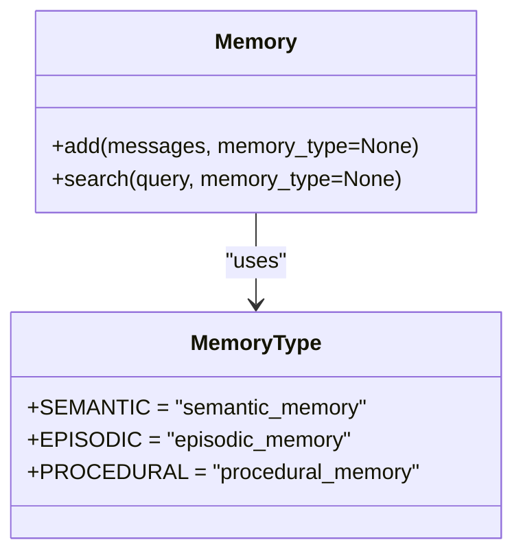
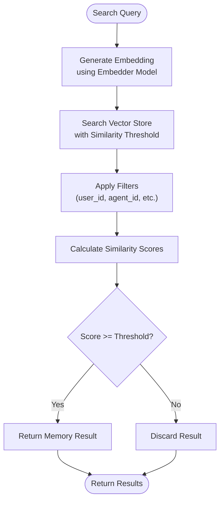
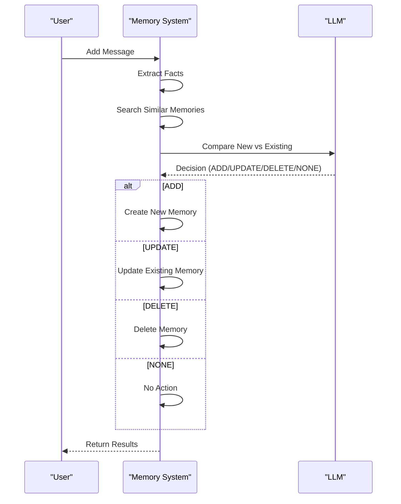
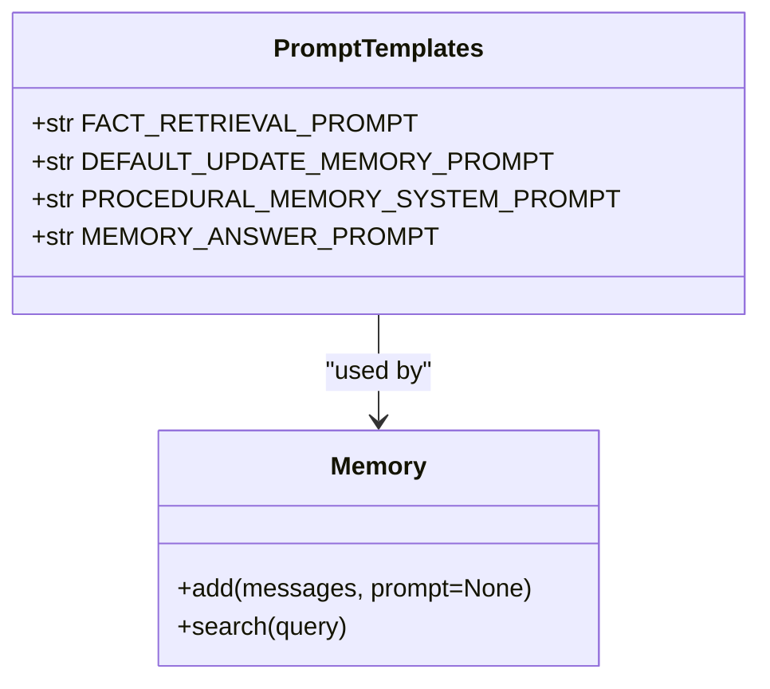
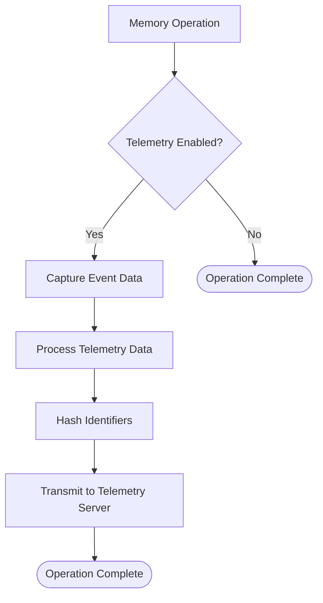
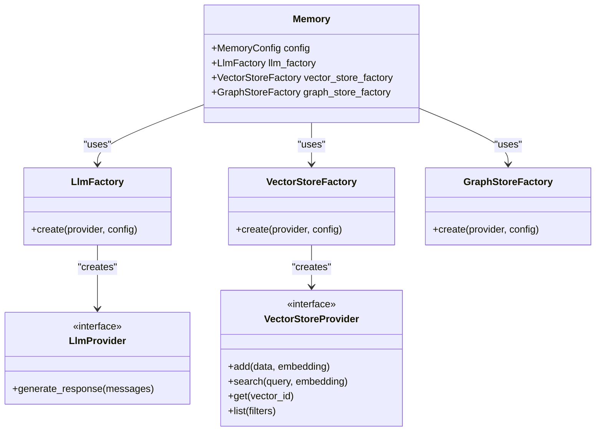

# Memory Configuration

<cite>
**Referenced Files in This Document**   
- [prompts.py](file://mem0/configs/prompts.py)
- [main.py](file://mem0/memory/main.py)
- [base.py](file://mem0/configs/base.py)
- [enums.py](file://mem0/configs/enums.py)
- [utils.py](file://mem0/memory/utils.py)
- [vector_stores/configs.py](file://mem0/vector_stores/configs.py)
- [embeddings/configs.py](file://mem0/embeddings/configs.py)
- [llms/configs.py](file://mem0/llms/configs.py)
- [memory/storage.py](file://mem0/memory/storage.py)
- [telemetry.py](file://mem0/memory/telemetry.py)
</cite>

## Table of Contents
1. [Introduction](#introduction)
2. [Memory Configuration Schema](#memory-configuration-schema)
3. [Memory Types](#memory-types)
4. [Inference and Similarity Settings](#inference-and-similarity-settings)
5. [Memory Deduplication and Merging](#memory-deduplication-and-merging)
6. [Prompt Templates](#prompt-templates)
7. [Memory History and Telemetry](#memory-history-and-telemetry)
8. [Configuration Examples](#configuration-examples)
9. [Integration with LLMs and Vector Stores](#integration-with-llms-and-vector-stores)
10. [Best Practices](#best-practices)

## Introduction

Mem0 provides a comprehensive memory management system that enables AI applications to store, retrieve, and manage information across interactions. The memory configuration schema offers extensive customization options for memory behavior, including inference thresholds, similarity scoring, memory types, retention policies, and integration with various LLMs and vector stores.

The system is designed to handle different types of memories (user, session, agent) with configurable deduplication, merging strategies, and update policies. It supports both structured and unstructured data storage with sophisticated prompt templates for memory extraction and summarization.

This documentation provides a detailed overview of the memory configuration options, explaining how to customize memory behavior for specific application requirements and performance goals.

**Section sources**
- [main.py](file://mem0/memory/main.py#L1-L100)
- [base.py](file://mem0/configs/base.py#L1-L50)

## Memory Configuration Schema

The Memory Configuration Schema in Mem0 is defined by the `MemoryConfig` class, which serves as the central configuration object for all memory-related settings. The schema is structured to provide comprehensive control over memory behavior, storage, and retrieval mechanisms.

The configuration schema includes several key components:

- **Vector Store Configuration**: Controls the vector database used for memory storage and retrieval
- **LLM Configuration**: Specifies the language model provider and parameters for memory operations
- **Embedder Configuration**: Defines the embedding model for vectorization of memory content
- **History Database**: Manages the SQLite database for storing memory history
- **Graph Store**: Optional graph database integration for relationship-based memory storage
- **API Version**: Specifies the API version for backward compatibility
- **Custom Prompts**: Allows customization of fact extraction and memory update prompts

The configuration is hierarchical, with each component having its own configuration class that inherits from Pydantic's BaseModel, ensuring type safety and validation.



**Diagram sources**
- [base.py](file://mem0/configs/base.py#L29-L62)
- [vector_stores/configs.py](file://mem0/vector_stores/configs.py#L6-L66)
- [embeddings/configs.py](file://mem0/embeddings/configs.py#L6-L32)
- [llms/configs.py](file://mem0/llms/configs.py#L6-L34)

**Section sources**
- [base.py](file://mem0/configs/base.py#L29-L62)
- [vector_stores/configs.py](file://mem0/vector_stores/configs.py#L6-L66)

## Memory Types

Mem0 supports three primary memory types, each serving different purposes in the memory management system. These types are defined in the `MemoryType` enum and can be specified when creating memories to control their behavior and storage characteristics.

### Semantic Memory
Semantic memory stores general knowledge, facts, and information that is not tied to specific events or contexts. This type of memory is ideal for storing user preferences, personal information, and domain knowledge that remains relatively stable over time.

### Episodic Memory
Episodic memory captures specific events, conversations, and experiences in chronological order. This memory type is useful for maintaining context in conversations and tracking the sequence of interactions between users and agents.

### Procedural Memory
Procedural memory stores step-by-step procedures, workflows, and processes. This type is particularly valuable for agent systems that need to remember complex sequences of actions or instructions.

The memory type can be specified when adding memories using the `memory_type` parameter. By default, memories are created as a combination of short-term and long-term memories (semantic and episodic). To create procedural memories, the `memory_type` parameter must be set to "procedural_memory".



**Diagram sources**
- [enums.py](file://mem0/configs/enums.py#L4-L8)
- [main.py](file://mem0/memory/main.py#L195-L227)

**Section sources**
- [enums.py](file://mem0/configs/enums.py#L4-L8)
- [main.py](file://mem0/memory/main.py#L195-L227)

## Inference and Similarity Settings

The inference and similarity settings in Mem0 control how memories are processed, retrieved, and matched based on semantic similarity. These settings are crucial for determining the accuracy and relevance of memory retrieval operations.

### Inference Threshold
The inference system uses LLMs to extract key facts from conversations and determine whether to add, update, or delete memories. The `infer` parameter (default: True) controls whether this intelligent processing is enabled. When enabled, the system analyzes messages to extract meaningful facts rather than storing raw messages.

### Similarity Scoring
Similarity scoring is used during memory search operations to determine how closely a query matches stored memories. The system uses vector embeddings to calculate cosine similarity between the query and stored memories. The similarity threshold can be controlled through the `threshold` parameter in search operations.

### Search Configuration
The search functionality includes several configurable parameters:
- **Limit**: Maximum number of results to return (default: 100)
- **Threshold**: Minimum similarity score for inclusion in results (optional)
- **Filters**: Custom key-value filters to narrow search scope

The similarity threshold helps filter out irrelevant results, ensuring that only memories with sufficient semantic similarity are returned. This prevents information overload and improves the quality of retrieved memories.



**Diagram sources**
- [main.py](file://mem0/memory/main.py#L644-L720)
- [utils.py](file://mem0/memory/utils.py#L35-L47)
- [vector_stores/configs.py](file://mem0/vector_stores/configs.py#L6-L66)

**Section sources**
- [main.py](file://mem0/memory/main.py#L644-L720)
- [utils.py](file://mem0/memory/utils.py#L35-L47)

## Memory Deduplication and Merging

Mem0 implements sophisticated memory deduplication and merging strategies to maintain memory quality and prevent redundancy. These mechanisms ensure that the memory system remains efficient and relevant over time.

### Deduplication Process
The deduplication process occurs during memory addition and involves several steps:
1. Extract facts from incoming messages
2. Search for existing memories with similar content
3. Compare new facts with existing memories
4. Determine appropriate action (add, update, delete, or no change)

The system uses vector similarity to identify potentially duplicate memories, typically retrieving the top 5 most similar existing memories for comparison.

### Merging Strategies
When similar memories are identified, the system applies intelligent merging strategies based on the content:

- **Add**: When new information is discovered that doesn't exist in current memories
- **Update**: When existing information is enhanced or modified
- **Delete**: When information is contradicted or should be removed
- **No Change**: When information is already present or irrelevant

The merging logic is controlled by the update memory prompt, which guides the LLM in making these decisions based on specific guidelines for each operation type.

### Update Policies
The update policies are designed to preserve the most complete and accurate information:
- When updating, the system keeps the same memory ID to maintain referential integrity
- Updated memories preserve their creation timestamp but update the last modified timestamp
- The system prioritizes information that is more detailed or recent



**Diagram sources**
- [main.py](file://mem0/memory/main.py#L310-L481)
- [prompts.py](file://mem0/configs/prompts.py#L61-L345)
- [utils.py](file://mem0/memory/utils.py#L7-L20)

**Section sources**
- [main.py](file://mem0/memory/main.py#L310-L481)
- [prompts.py](file://mem0/configs/prompts.py#L61-L345)

## Prompt Templates

Mem0 uses several prompt templates to control memory extraction, updating, and summarization processes. These templates are critical for guiding the LLM's behavior in managing memories and can be customized to suit specific application requirements.

### Fact Retrieval Prompt
The fact retrieval prompt is used to extract key information from conversations. It instructs the LLM to identify and organize relevant facts about the user, including:

- Personal preferences (food, products, activities)
- Important personal details (names, relationships, dates)
- Plans and intentions (events, trips, goals)
- Activity and service preferences (dining, travel, hobbies)
- Health and wellness preferences (dietary restrictions, fitness routines)
- Professional details (job titles, career goals)
- Miscellaneous information (favorite books, movies, brands)

The prompt includes examples and guidelines to ensure consistent fact extraction across different conversations.

### Update Memory Prompt
The update memory prompt controls how memories are modified in response to new information. It defines four operations:

1. **ADD**: For new information not present in current memories
2. **UPDATE**: For information that modifies existing memories
3. **DELETE**: For information that contradicts existing memories
4. **NONE**: For information that is already present or irrelevant

The prompt provides specific guidelines and examples for each operation, ensuring consistent decision-making by the LLM.

### Procedural Memory Prompt
The procedural memory prompt is used to create comprehensive summaries of agent interactions. It records complete interaction histories with detailed metadata, including:

- Task objectives and progress status
- Sequential agent actions with parameters
- Exact action results (unmodified)
- Key findings and navigation history
- Errors and challenges encountered
- Current context and next steps

This prompt ensures that procedural memories contain all necessary details for agents to continue tasks without ambiguity.



**Diagram sources**
- [prompts.py](file://mem0/configs/prompts.py#L3-L345)
- [main.py](file://mem0/memory/main.py#L19-L22)

**Section sources**
- [prompts.py](file://mem0/configs/prompts.py#L3-L345)

## Memory History and Telemetry

Mem0 provides comprehensive memory history tracking and telemetry capabilities to monitor memory operations and system performance.

### History Tracking
The system maintains a history database (SQLite) that records all memory operations, including:
- Memory creation, updates, and deletions
- Timestamps for all operations
- Metadata about the context of each operation
- User, agent, and session identifiers

The history database path is configurable through the `history_db_path` parameter in the MemoryConfig, with a default location in the user's home directory under `.mem0/history.db`.

### Telemetry Configuration
Telemetry is enabled by default and can be controlled through environment variables:
- **MEM0_TELEMETRY**: Set to "false" to disable telemetry collection
- The system captures events for key operations (init, add, get, search, update, delete)

Telemetry data includes:
- Operation type and timestamp
- Client version and source
- API host and version
- Session identifiers (user_id, agent_id, run_id)
- Performance metrics

The telemetry system is designed to be privacy-conscious, with session identifiers hashed before transmission to protect user identity.

### Event Capture
The system captures events for the following operations:
- Initialization (`mem0.init`)
- Memory addition (`mem0.add`)
- Memory retrieval (`mem0.get`)
- Memory listing (`mem0.get_all`)
- Memory search (`mem0.search`)
- Memory update (`mem0.update`)
- Memory deletion (`mem0.delete`)



**Diagram sources**
- [telemetry.py](file://mem0/memory/telemetry.py)
- [main.py](file://mem0/memory/main.py#L27-L28)
- [base.py](file://mem0/configs/base.py#L42-L45)
- [test_telemetry.py](file://tests/test_telemetry.py#L1-L35)

**Section sources**
- [telemetry.py](file://mem0/memory/telemetry.py)
- [main.py](file://mem0/memory/main.py#L27-L28)
- [base.py](file://mem0/configs/base.py#L42-L45)

## Configuration Examples

This section provides complete examples of memory configurations in both Python and YAML formats, demonstrating various use cases and integration scenarios.

### Python Configuration Examples

#### Basic Configuration with OpenAI
```python
from mem0 import Memory, MemoryConfig

config = MemoryConfig(
    llm={
        "provider": "openai",
        "config": {
            "model": "gpt-4o-mini",
            "temperature": 0.1,
            "max_tokens": 1000
        }
    },
    embedder={
        "provider": "openai",
        "config": {
            "model": "text-embedding-3-small"
        }
    }
)
memory = Memory(config)
```

#### Local Setup with Ollama
```python
config = MemoryConfig(
    llm={
        "provider": "ollama",
        "config": {
            "model": "llama3.1:8b",
            "ollama_base_url": "http://localhost:11434"
        }
    },
    embedder={
        "provider": "ollama",
        "config": {
            "model": "nomic-embed-text"
        }
    },
    vector_store={
        "provider": "chroma",
        "config": {
            "collection_name": "my_memories",
            "path": "./chroma_db"
        }
    }
)
memory = Memory(config)
```

#### Graph Memory with Neo4j
```python
config = MemoryConfig(
    graph_store={
        "provider": "neo4j",
        "config": {
            "url": "bolt://localhost:7687",
            "username": "neo4j",
            "password": "password",
            "database": "neo4j"
        }
    }
)
memory = Memory(config)
```

#### Custom Prompts Configuration
```python
custom_extraction_prompt = """
Extract key facts from the conversation focusing on:
1. Personal preferences
2. Technical skills
3. Project requirements
4. Important dates and deadlines

Conversation: {messages}
"""

config = MemoryConfig(
    custom_fact_extraction_prompt=custom_extraction_prompt
)
memory = Memory(config)
```

### YAML Configuration Examples

#### OpenAI Configuration (config.yaml)
```yaml
llm:
  provider: openai
  config:
    model: gpt-4o-mini
    temperature: 0.1
    max_tokens: 1000
embedder:
  provider: openai
  config:
    model: text-embedding-3-small
vector_store:
  provider: qdrant
  config:
    collection_name: mem0_collection
    url: http://localhost:6333
```

#### Chroma Local Configuration (chroma-config.yaml)
```yaml
llm:
  provider: ollama
  config:
    model: llama3.1:8b
    ollama_base_url: http://localhost:11434
embedder:
  provider: ollama
  config:
    model: nomic-embed-text
vector_store:
  provider: chroma
  config:
    collection_name: my_memories
    path: ./chroma_db
history_db_path: ./mem0_history.db
```

#### Procedural Memory Configuration (procedural-config.yaml)
```yaml
llm:
  provider: openai
  config:
    model: gpt-4-turbo
graph_store:
  provider: neo4j
  config:
    url: bolt://localhost:7687
    username: neo4j
    password: mypassword
    database: mem0_db
version: v1.1
```

**Section sources**
- [LLM.md](file://LLM.md#L334-L691)
- [base.py](file://mem0/configs/base.py#L29-L62)
- [main.py](file://mem0/memory/main.py#L131-L149)

## Integration with LLMs and Vector Stores

Mem0 is designed to integrate seamlessly with various LLM providers and vector stores, offering flexibility in choosing the best components for specific use cases.

### LLM Integration
The system supports multiple LLM providers through a factory pattern, allowing easy switching between different models:

- **OpenAI**: GPT-3.5, GPT-4, and other models
- **Ollama**: Local LLMs including Llama, Mistral, and others
- **Anthropic**: Claude models
- **Google**: Gemini models
- **Azure OpenAI**: Enterprise-grade models
- **Together**: High-performance models
- **Groq**: Fast inference models

The LLM configuration includes parameters for:
- Model selection
- Temperature (creativity control)
- Max tokens (response length)
- Top-p (nucleus sampling)
- Frequency and presence penalties

### Vector Store Integration
Mem0 supports numerous vector database providers, each with its own configuration options:

- **Qdrant**: High-performance vector search
- **Chroma**: Lightweight, easy-to-use vector store
- **Pinecone**: Managed vector database service
- **Weaviate**: Hybrid vector search with GraphQL
- **Milvus**: Scalable vector database
- **PGVector**: PostgreSQL extension for vector storage
- **Redis**: In-memory data structure store
- **Elasticsearch**: Full-text search with vector capabilities
- **FAISS**: Facebook AI Similarity Search
- **Azure AI Search**: Microsoft's cloud search service

The vector store configuration allows specifying:
- Collection name
- Connection details (URL, credentials)
- Storage path (for local databases)
- Indexing parameters
- Distance metrics (cosine, Euclidean, etc.)

### Factory Pattern Implementation
The integration is implemented using a factory pattern that dynamically creates instances based on the provider configuration:



**Diagram sources**
- [main.py](file://mem0/memory/main.py#L35-L40)
- [utils/factory.py](file://mem0/utils/factory.py)
- [vector_stores/configs.py](file://mem0/vector_stores/configs.py#L6-L66)
- [llms/configs.py](file://mem0/llms/configs.py#L6-L34)

**Section sources**
- [main.py](file://mem0/memory/main.py#L35-L40)
- [utils/factory.py](file://mem0/utils/factory.py)

## Best Practices

This section provides recommendations for configuring and tuning memory parameters based on application requirements and performance goals.

### Performance Optimization
- **Vector Store Selection**: Use Qdrant or Milvus for high-performance applications with large datasets
- **Embedding Models**: Choose embedding models that balance accuracy and speed based on your use case
- **Batch Operations**: When adding multiple memories, consider batching to reduce API calls
- **Caching**: Implement caching for frequently accessed memories to reduce latency

### Memory Quality
- **Custom Prompts**: Tailor fact extraction prompts to your specific domain to improve relevance
- **Similarity Threshold**: Adjust the threshold based on precision/recall requirements
- **Regular Cleanup**: Implement periodic memory cleanup to remove outdated or irrelevant information
- **Deduplication**: Monitor and tune deduplication settings to prevent information loss

### Scalability Considerations
- **Database Choice**: For large-scale applications, consider managed vector databases like Pinecone or Azure AI Search
- **Indexing Strategy**: Configure appropriate indexing for your query patterns
- **Sharding**: For very large datasets, consider sharding across multiple collections
- **Resource Monitoring**: Monitor memory usage and adjust configurations as needed

### Security and Privacy
- **Data Encryption**: Ensure sensitive memory data is encrypted at rest and in transit
- **Access Control**: Implement proper access controls for memory operations
- **Audit Logging**: Maintain logs of memory access and modifications
- **Compliance**: Ensure memory handling complies with relevant regulations (GDPR, CCPA, etc.)

### Application-Specific Tuning
- **Chat Applications**: Lower similarity thresholds for more conversational context
- **Knowledge Bases**: Higher thresholds for more precise information retrieval
- **Agent Systems**: Enable procedural memory for workflow tracking
- **Personal Assistants**: Focus on semantic memory for user preferences

**Section sources**
- [main.py](file://mem0/memory/main.py)
- [configs/base.py](file://mem0/configs/base.py)
- [configs/prompts.py](file://mem0/configs/prompts.py)
- [memory/utils.py](file://mem0/memory/utils.py)
- [LLM.md](file://LLM.md)