# Vector Store Configuration

<cite>
**Referenced Files in This Document**   
- [vector_stores/configs.py](file://mem0/vector_stores/configs.py)
- [configs/vector_stores/chroma.py](file://mem0/configs/vector_stores/chroma.py)
- [configs/vector_stores/qdrant.py](file://mem0/configs/vector_stores/qdrant.py)
- [configs/vector_stores/pinecone.py](file://mem0/configs/vector_stores/pinecone.py)
- [configs/vector_stores/weaviate.py](file://mem0/configs/vector_stores/weaviate.py)
- [configs/vector_stores/opensearch.py](file://mem0/configs/vector_stores/opensearch.py)
- [configs/vector_stores/faiss.py](file://mem0/configs/vector_stores/faiss.py)
- [configs/vector_stores/elasticsearch.py](file://mem0/configs/vector_stores/elasticsearch.py)
- [configs/vector_stores/redis.py](file://mem0/configs/vector_stores/redis.py)
- [configs/vector_stores/pgvector.py](file://mem0/configs/vector_stores/pgvector.py)
- [configs/vector_stores/mongodb.py](file://mem0/configs/vector_stores/mongodb.py)
- [configs/base.py](file://mem0/configs/base.py)
- [embedchain/configs/chroma.yaml](file://embedchain/configs/chroma.yaml)
- [embedchain/configs/pinecone.yaml](file://embedchain/configs/pinecone.yaml)
- [embedchain/configs/opensearch.yaml](file://embedchain/configs/opensearch.yaml)
- [embedchain/configs/weaviate.yaml](file://embedchain/configs/weaviate.yaml)
</cite>

## Table of Contents
1. [Introduction](#introduction)
2. [Configuration Schema Overview](#configuration-schema-overview)
3. [Vector Store Providers](#vector-store-providers)
   - [Chroma](#chroma)
   - [Qdrant](#qdrant)
   - [Pinecone](#pinecone)
   - [Weaviate](#weaviate)
   - [OpenSearch](#opensearch)
   - [FAISS](#faiss)
   - [Elasticsearch](#elasticsearch)
   - [Redis](#redis)
   - [PGVector](#pgvector)
   - [MongoDB](#mongodb)
4. [Configuration Examples](#configuration-examples)
5. [Advanced Configuration Options](#advanced-configuration-options)
6. [Troubleshooting Guide](#troubleshooting-guide)
7. [Security Considerations](#security-considerations)
8. [Best Practices](#best-practices)

## Introduction
This document provides comprehensive documentation for configuring vector stores in Mem0, a memory management system for AI applications. The document covers all available vector store options, including Chroma, Qdrant, Pinecone, Weaviate, OpenSearch, FAISS, and others. For each provider, it specifies required parameters, connection settings, authentication methods, and performance tuning options. The documentation includes configuration examples in both Python and YAML formats, explains how to set up and configure each vector store with proper credentials and endpoints, and details advanced settings such as distance metrics, indexing strategies, and dimension configurations.

**Section sources**
- [vector_stores/configs.py](file://mem0/vector_stores/configs.py#L6-L36)

## Configuration Schema Overview
The vector store configuration in Mem0 follows a consistent schema pattern across all providers. The base configuration is defined by the `VectorStoreConfig` class, which contains a provider field and a config field that holds provider-specific settings. Each vector store provider has its own configuration class that inherits from Pydantic's BaseModel, ensuring type safety and validation.

The configuration system supports environment variable integration and provides default values for common settings. All configurations are validated at initialization time to ensure that required parameters are present and that incompatible options are not specified together.

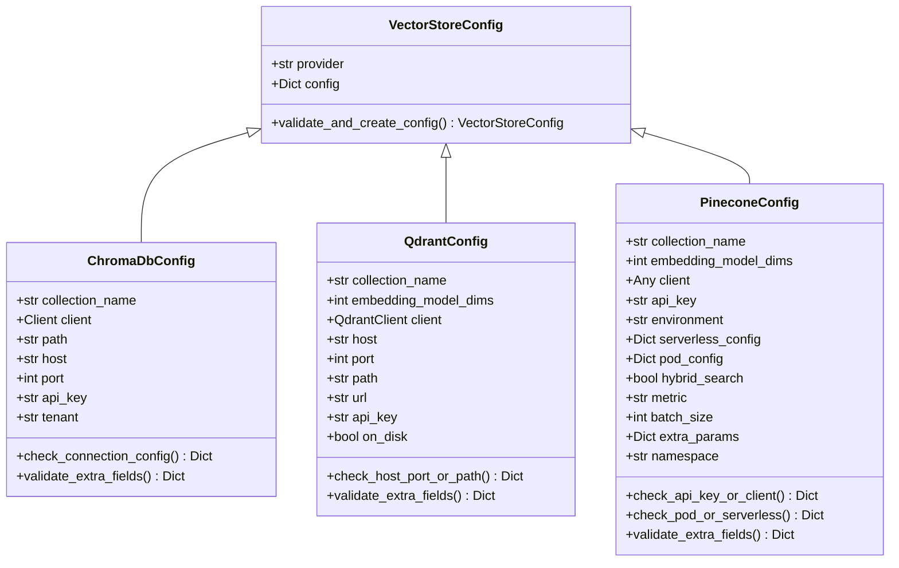

**Diagram sources**
- [vector_stores/configs.py](file://mem0/vector_stores/configs.py#L6-L65)
- [configs/vector_stores/chroma.py](file://mem0/configs/vector_stores/chroma.py#L6-L58)
- [configs/vector_stores/qdrant.py](file://mem0/configs/vector_stores/qdrant.py#L6-L47)
- [configs/vector_stores/pinecone.py](file://mem0/configs/vector_stores/pinecone.py#L7-L55)

**Section sources**
- [vector_stores/configs.py](file://mem0/vector_stores/configs.py#L6-L65)

## Vector Store Providers

### Chroma
Chroma is a lightweight, open-source vector database that can run in-memory, on-disk, or as a client-server setup. It supports both local and cloud deployments.

**Required Parameters:**
- `collection_name`: Name of the collection (default: "mem0")
- One of the following connection configurations:
  - Local: `path` to database directory
  - Server: `host` and `port`
  - Cloud: `api_key` and `tenant`

**Authentication Methods:**
- Cloud: API key and tenant ID
- Server: No authentication by default (can be secured with reverse proxy)

**Performance Tuning Options:**
- `path`: Specify custom storage location for persistent data
- `client`: Reuse existing ChromaDB client instance

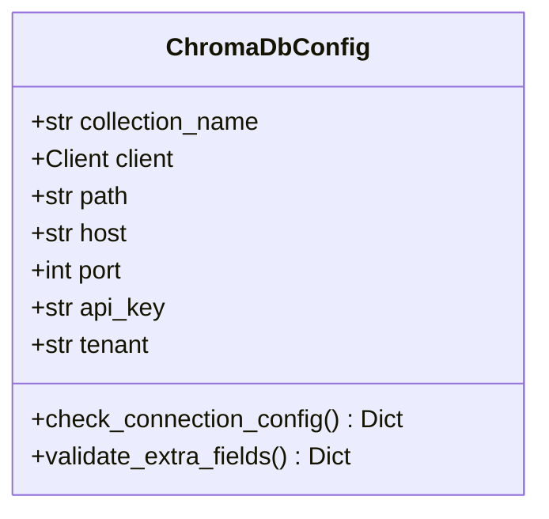

**Diagram sources**
- [configs/vector_stores/chroma.py](file://mem0/configs/vector_stores/chroma.py#L6-L58)

**Section sources**
- [configs/vector_stores/chroma.py](file://mem0/configs/vector_stores/chroma.py#L6-L58)

### Qdrant
Qdrant is a vector database written in Rust that offers high performance and efficiency. It supports both dense and sparse vectors and provides advanced filtering capabilities.

**Required Parameters:**
- `collection_name`: Name of the collection (default: "mem0")
- One of the following connection configurations:
  - Local: `path` to database directory
  - Server: `host` and `port`
  - URL: `url` and `api_key`

**Authentication Methods:**
- API key authentication for remote servers
- No authentication for local instances

**Performance Tuning Options:**
- `embedding_model_dims`: Dimensions of the embedding model (default: 1536)
- `on_disk`: Enables persistent storage (default: False)
- `client`: Reuse existing Qdrant client instance

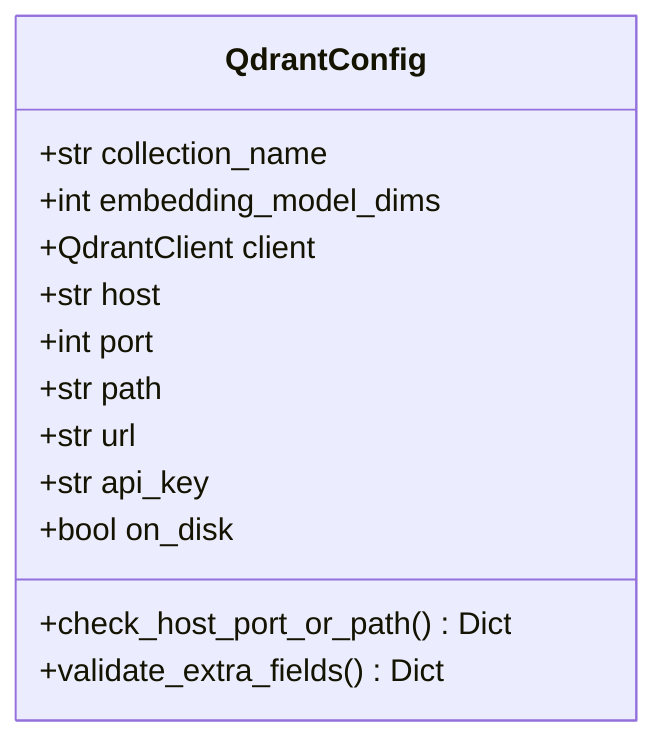

**Diagram sources**
- [configs/vector_stores/qdrant.py](file://mem0/configs/vector_stores/qdrant.py#L6-L47)

**Section sources**
- [configs/vector_stores/qdrant.py](file://mem0/configs/vector_stores/qdrant.py#L6-L47)

### Pinecone
Pinecone is a fully managed vector database service that offers serverless and pod-based deployment options. It's designed for production-scale applications with high availability requirements.

**Required Parameters:**
- `collection_name`: Name of the index/collection (default: "mem0")
- One of the following authentication methods:
  - `api_key`: Pinecone API key
  - `client`: Existing Pinecone client instance
  - `PINECONE_API_KEY` environment variable

**Authentication Methods:**
- API key authentication
- Environment variable authentication

**Performance Tuning Options:**
- `embedding_model_dims`: Dimensions of the embedding model (default: 1536)
- `serverless_config`: Configuration for serverless deployment
- `pod_config`: Configuration for pod-based deployment
- `hybrid_search`: Enable hybrid search (default: False)
- `metric`: Distance metric for vector similarity (default: "cosine")
- `batch_size`: Batch size for operations (default: 100)
- `namespace`: Namespace for the collection

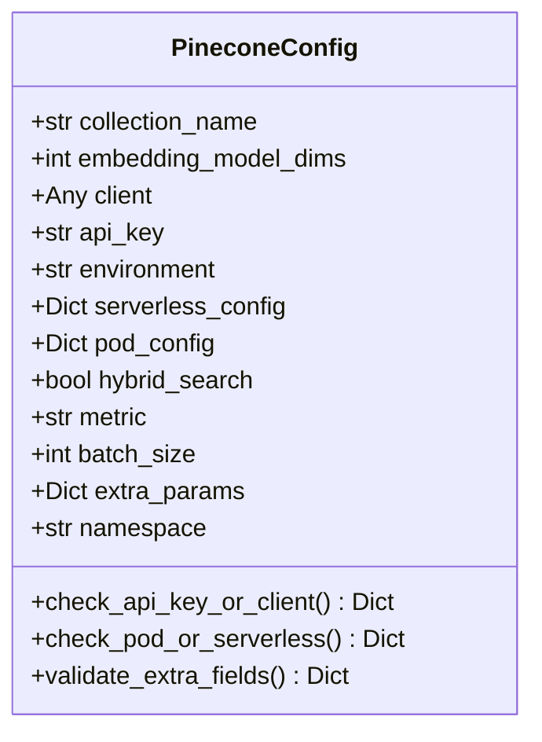

**Diagram sources**
- [configs/vector_stores/pinecone.py](file://mem0/configs/vector_stores/pinecone.py#L7-L55)

**Section sources**
- [configs/vector_stores/pinecone.py](file://mem0/configs/vector_stores/pinecone.py#L7-L55)

### Weaviate
Weaviate is an open-source vector database that combines vector search with a graph-based storage model. It supports hybrid search and semantic understanding.

**Required Parameters:**
- `collection_name`: Name of the collection (default: "mem0")
- `cluster_url`: URL for Weaviate server

**Authentication Methods:**
- API key via `auth_client_secret`
- Additional headers via `additional_headers`

**Performance Tuning Options:**
- `embedding_model_dims`: Dimensions of the embedding model (default: 1536)
- `client`: Reuse existing Weaviate client instance

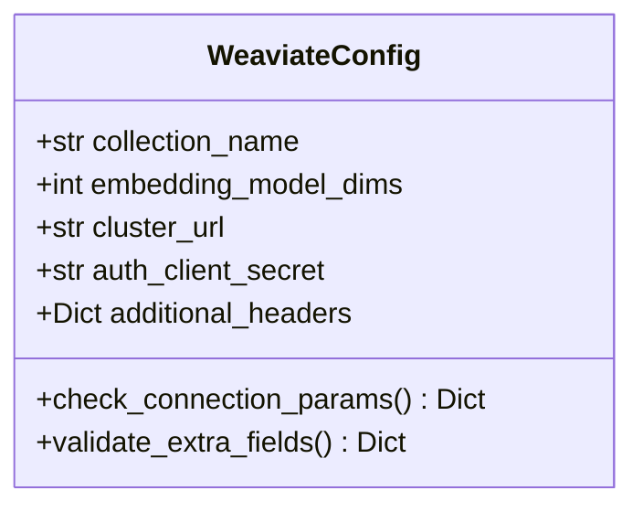

**Diagram sources**
- [configs/vector_stores/weaviate.py](file://mem0/configs/vector_stores/weaviate.py#L6-L41)

**Section sources**
- [configs/vector_stores/weaviate.py](file://mem0/configs/vector_stores/weaviate.py#L6-L41)

### OpenSearch
OpenSearch is an open-source search and analytics suite derived from Elasticsearch. It provides vector search capabilities through its k-NN plugin.

**Required Parameters:**
- `collection_name`: Name of the index (default: "mem0")
- `host`: OpenSearch host (default: "localhost")
- `port`: OpenSearch port (default: 9200)

**Authentication Methods:**
- Basic authentication: `user` and `password`
- API key authentication: `api_key`
- HTTP authentication: `http_auth`

**Performance Tuning Options:**
- `embedding_model_dims`: Dimension of the embedding vector (default: 1536)
- `verify_certs`: Verify SSL certificates (default: False)
- `use_ssl`: Use SSL for connection (default: False)
- `connection_class`: Connection class for OpenSearch (default: "RequestsHttpConnection")
- `pool_maxsize`: Maximum number of connections in the pool (default: 20)

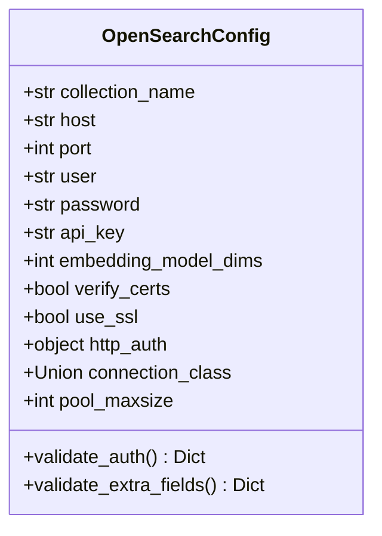

**Diagram sources**
- [configs/vector_stores/opensearch.py](file://mem0/configs/vector_stores/opensearch.py#L6-L41)

**Section sources**
- [configs/vector_stores/opensearch.py](file://mem0/configs/vector_stores/opensearch.py#L6-L41)

### FAISS
FAISS (Facebook AI Similarity Search) is a library for efficient similarity search and clustering of dense vectors. It's designed for maximum performance and can handle very large vector collections.

**Required Parameters:**
- `collection_name`: Default name for the collection (default: "mem0")
- `path`: Path to store FAISS index and metadata

**Authentication Methods:**
- No authentication required (local file-based storage)

**Performance Tuning Options:**
- `distance_strategy`: Distance strategy to use (options: "euclidean", "inner_product", "cosine"; default: "euclidean")
- `normalize_L2`: Whether to normalize L2 vectors (only applicable for euclidean distance; default: False)
- `embedding_model_dims`: Dimension of the embedding vector (default: 1536)

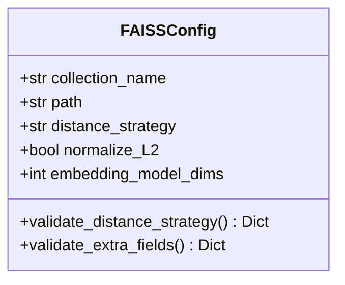

**Diagram sources**
- [configs/vector_stores/faiss.py](file://mem0/configs/vector_stores/faiss.py#L6-L37)

**Section sources**
- [configs/vector_stores/faiss.py](file://mem0/configs/vector_stores/faiss.py#L6-L37)

### Elasticsearch
Elasticsearch is a distributed search and analytics engine based on Apache Lucene. It provides powerful full-text search capabilities along with vector search.

**Required Parameters:**
- One of the following connection configurations:
  - `cloud_id`: Cloud ID for Elastic Cloud
  - `host`: Elasticsearch host (default: "localhost")
- One of the following authentication methods:
  - `api_key`: API key for authentication
  - `user` and `password`: Username and password for authentication

**Authentication Methods:**
- API key authentication
- Basic authentication: `user` and `password`
- Cloud ID for Elastic Cloud

**Performance Tuning Options:**
- `collection_name`: Name of the index (default: "mem0")
- `port`: Elasticsearch port (default: 9200)
- `embedding_model_dims`: Dimension of the embedding vector (default: 1536)
- `verify_certs`: Verify SSL certificates (default: True)
- `use_ssl`: Use SSL for connection (default: True)
- `auto_create_index`: Automatically create index during initialization (default: True)
- `custom_search_query`: Custom search query function
- `headers`: Custom headers to include in requests

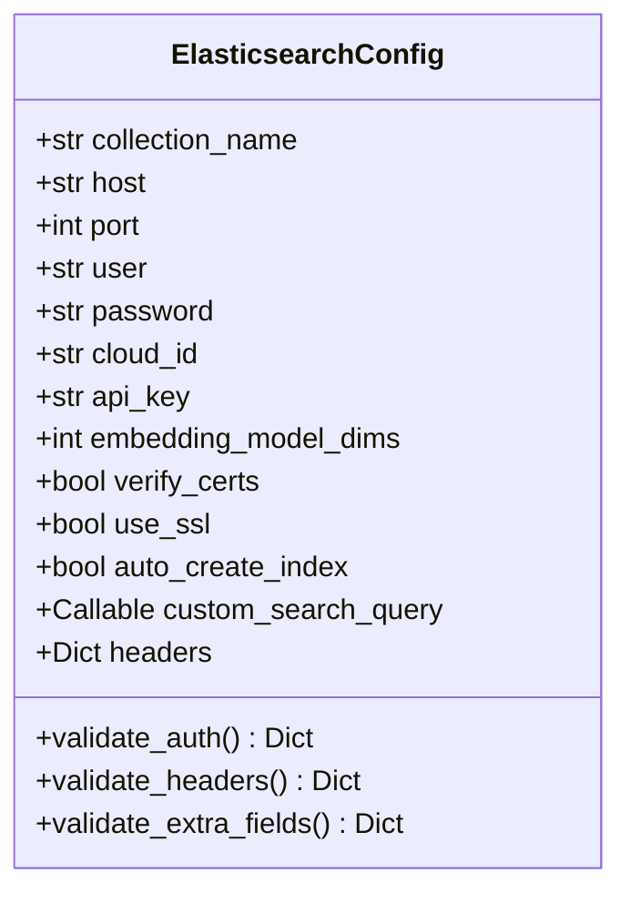

**Diagram sources**
- [configs/vector_stores/elasticsearch.py](file://mem0/configs/vector_stores/elasticsearch.py#L7-L65)

**Section sources**
- [configs/vector_stores/elasticsearch.py](file://mem0/configs/vector_stores/elasticsearch.py#L7-L65)

### Redis
Redis is an in-memory data structure store that can be used as a vector database with the Redis Stack extension. It offers high performance and low latency.

**Required Parameters:**
- `redis_url`: Redis URL
- `collection_name`: Collection name (default: "mem0")

**Authentication Methods:**
- Redis URL with authentication credentials

**Performance Tuning Options:**
- `embedding_model_dims`: Embedding model dimensions (default: 1536)

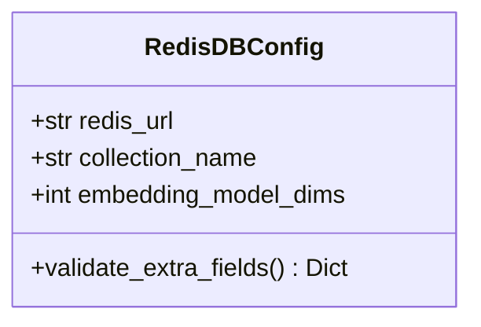

**Diagram sources**
- [configs/vector_stores/redis.py](file://mem0/configs/vector_stores/redis.py#L7-L24)

**Section sources**
- [configs/vector_stores/redis.py](file://mem0/configs/vector_stores/redis.py#L7-L24)

### PGVector
PGVector is an extension for PostgreSQL that adds vector similarity search capabilities. It allows you to store vectors alongside your relational data.

**Required Parameters:**
- `dbname`: Name for the database (default: "postgres")
- One of the following connection methods:
  - Individual parameters: `user`, `password`, `host`, `port`
  - `connection_string`: PostgreSQL connection string
  - `connection_pool`: psycopg connection pool object

**Authentication Methods:**
- Username and password
- Connection string with embedded credentials
- Connection pool with configured authentication

**Performance Tuning Options:**
- `collection_name`: Name for the collection (default: "mem0")
- `embedding_model_dims`: Dimensions of the embedding model (default: 1536)
- `diskann`: Use diskann for approximate nearest neighbors search (default: False)
- `hnsw`: Use hnsw for faster search (default: True)
- `minconn`: Minimum number of connections in the pool (default: 1)
- `maxconn`: Maximum number of connections in the pool (default: 5)
- `sslmode`: SSL mode for PostgreSQL connection (e.g., "require", "prefer", "disable")

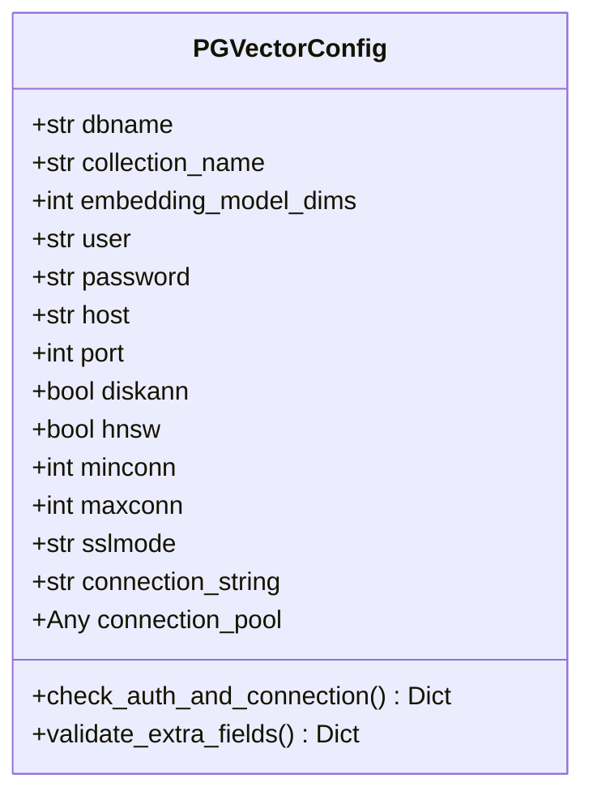

**Diagram sources**
- [configs/vector_stores/pgvector.py](file://mem0/configs/vector_stores/pgvector.py#L6-L52)

**Section sources**
- [configs/vector_stores/pgvector.py](file://mem0/configs/vector_stores/pgvector.py#L6-L52)

### MongoDB
MongoDB is a NoSQL document database that supports vector search through its Atlas Vector Search feature. It's ideal for applications that need flexible data models.

**Required Parameters:**
- `db_name`: Name of the MongoDB database (default: "mem0_db")
- `collection_name`: Name of the MongoDB collection (default: "mem0")
- `mongo_uri`: MongoDB URI (default: "mongodb://localhost:27017")

**Authentication Methods:**
- MongoDB URI with authentication credentials
- Connection string with username and password

**Performance Tuning Options:**
- `embedding_model_dims`: Dimensions of the embedding vectors (default: 1536)

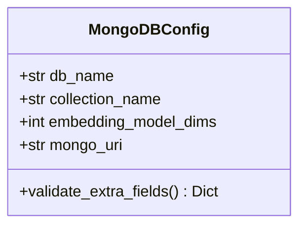

**Diagram sources**
- [configs/vector_stores/mongodb.py](file://mem0/configs/vector_stores/mongodb.py#L6-L25)

**Section sources**
- [configs/vector_stores/mongodb.py](file://mem0/configs/vector_stores/mongodb.py#L6-L25)

## Configuration Examples

### Python Configuration Examples
```python
# Chroma configuration
from mem0.configs.vector_stores import VectorStoreConfig, ChromaDbConfig

# Local Chroma configuration
chroma_local_config = VectorStoreConfig(
    provider="chroma",
    config=ChromaDbConfig(
        collection_name="my_collection",
        path="/path/to/chroma/db"
    )
)

# Qdrant configuration
from mem0.configs.vector_stores import QdrantConfig

qdrant_config = VectorStoreConfig(
    provider="qdrant",
    config=QdrantConfig(
        collection_name="my_collection",
        host="localhost",
        port=6333,
        embedding_model_dims=1536
    )
)

# Pinecone configuration
from mem0.configs.vector_stores import PineconeConfig

pinecone_config = VectorStoreConfig(
    provider="pinecone",
    config=PineconeConfig(
        collection_name="my_index",
        api_key="your-api-key",
        environment="gcp-starter",
        metric="cosine",
        dimension=1536
    )
)
```

### YAML Configuration Examples
```yaml
# Chroma configuration
vectordb:
  provider: chroma
  config:
    collection_name: my-chroma-collection
    dir: ./chroma_db
    allow_reset: true

# Pinecone configuration
vectordb:
  provider: pinecone
  config:
    metric: cosine
    vector_dimension: 1536
    collection_name: my-pinecone-index

# OpenSearch configuration
vectordb:
  provider: opensearch
  config:
    opensearch_url: https://localhost:9200
    http_auth:
      - admin
      - admin
    vector_dimension: 1536
    collection_name: my-app
    use_ssl: false
    verify_certs: false

# Weaviate configuration
vectordb:
  provider: weaviate
  config:
    collection_name: my_weaviate_index
```

**Section sources**
- [embedchain/configs/chroma.yaml](file://embedchain/configs/chroma.yaml#L1-L25)
- [embedchain/configs/pinecone.yaml](file://embedchain/configs/pinecone.yaml#L1-L7)
- [embedchain/configs/opensearch.yaml](file://embedchain/configs/opensearch.yaml#L1-L34)
- [embedchain/configs/weaviate.yaml](file://embedchain/configs/weaviate.yaml#L1-L4)

## Advanced Configuration Options

### Distance Metrics
Different vector stores support various distance metrics for measuring similarity between vectors:

- **Cosine**: Measures the cosine of the angle between vectors (range: -1 to 1)
- **Euclidean**: Measures the straight-line distance between vectors
- **Inner Product**: Measures the dot product of vectors
- **Manhattan**: Measures the sum of absolute differences between coordinates

The choice of distance metric affects search results and should be matched to your embedding model and use case.

### Indexing Strategies
Each vector store implements different indexing strategies for efficient similarity search:

- **HNSW (Hierarchical Navigable Small World)**: Creates a multi-layered graph structure for fast approximate nearest neighbor search
- **IVF (Inverted File Index)**: Partitions vectors into clusters and searches only relevant clusters
- **DiskANN**: Optimized for large datasets that don't fit in memory
- **PQ (Product Quantization)**: Compresses vectors to reduce memory usage

### Dimension Configurations
The `embedding_model_dims` parameter must match the dimensionality of your chosen embedding model. Common dimensions include:

- 1536: OpenAI's text-embedding-ada-002
- 384: Sentence Transformers models
- 768: BERT-based models
- 1024: Larger transformer models

Mismatched dimensions will result in errors during vector operations.

**Section sources**
- [configs/vector_stores/chroma.py](file://mem0/configs/vector_stores/chroma.py#L13-L21)
- [configs/vector_stores/qdrant.py](file://mem0/configs/vector_stores/qdrant.py#L12-L19)
- [configs/vector_stores/pinecone.py](file://mem0/configs/vector_stores/pinecone.py#L11-L18)
- [configs/vector_stores/weaviate.py](file://mem0/configs/vector_stores/weaviate.py#L12-L13)
- [configs/vector_stores/opensearch.py](file://mem0/configs/vector_stores/opensearch.py#L13-L14)
- [configs/vector_stores/faiss.py](file://mem0/configs/vector_stores/faiss.py#L15-L16)

## Troubleshooting Guide

### Common Connection Issues
1. **Connection Refused**: Verify that the vector store service is running and accessible at the specified host and port.
2. **Authentication Failed**: Check that credentials (API keys, usernames, passwords) are correct and have appropriate permissions.
3. **SSL/TLS Errors**: For self-signed certificates, set `verify_certs: false` or configure proper certificate validation.
4. **Network Timeout**: Increase timeout settings or check network connectivity between client and server.

### Compatibility Problems
1. **Version Mismatch**: Ensure that client libraries are compatible with the server version.
2. **Dimension Mismatch**: Verify that `embedding_model_dims` matches your embedding model's output dimension.
3. **Unsupported Features**: Some providers may not support all configuration options (e.g., hybrid search in FAISS).

### Performance Issues
1. **Slow Queries**: Consider using approximate nearest neighbor search instead of exact search for large datasets.
2. **High Memory Usage**: Implement proper indexing strategies and consider using disk-based storage for large collections.
3. **Connection Pool Exhaustion**: Adjust connection pool settings (`minconn`, `maxconn`) based on your application's concurrency needs.

**Section sources**
- [configs/vector_stores/chroma.py](file://mem0/configs/vector_stores/chroma.py#L23-L44)
- [configs/vector_stores/qdrant.py](file://mem0/configs/vector_stores/qdrant.py#L23-L33)
- [configs/vector_stores/pinecone.py](file://mem0/configs/vector_stores/pinecone.py#L25-L31)
- [configs/vector_stores/weaviate.py](file://mem0/configs/vector_stores/weaviate.py#L22-L23)
- [configs/vector_stores/opensearch.py](file://mem0/configs/vector_stores/opensearch.py#L26-L27)
- [configs/vector_stores/elasticsearch.py](file://mem0/configs/vector_stores/elasticsearch.py#L28-L33)

## Security Considerations
When deploying vector stores in production environments, consider the following security best practices:

1. **Credential Management**: Store API keys and passwords in environment variables or secure secret management systems rather than hardcoding them in configuration files.
2. **Network Security**: Use TLS/SSL encryption for all network communications, especially when transmitting sensitive data.
3. **Access Control**: Implement proper authentication and authorization mechanisms to restrict access to vector stores.
4. **Data Encryption**: Enable encryption at rest for sensitive data stored in vector databases.
5. **Audit Logging**: Enable logging and monitoring to detect and respond to suspicious activities.
6. **Regular Updates**: Keep vector store software and client libraries up to date with security patches.

For cloud-based vector stores, leverage the provider's built-in security features such as VPC peering, private endpoints, and identity federation.

**Section sources**
- [configs/vector_stores/opensearch.py](file://mem0/configs/vector_stores/opensearch.py#L14-L15)
- [configs/vector_stores/elasticsearch.py](file://mem0/configs/vector_stores/elasticsearch.py#L14-L15)
- [configs/vector_stores/weaviate.py](file://mem0/configs/vector_stores/weaviate.py#L14-L15)
- [configs/vector_stores/redis.py](file://mem0/configs/vector_stores/redis.py#L8-L9)

## Best Practices

### Data Persistence
1. **Regular Backups**: Implement automated backup procedures for critical vector data.
2. **Redundancy**: Use replication and high availability configurations for production deployments.
3. **Data Lifecycle Management**: Implement policies for archiving or deleting old vector data.

### Scalability
1. **Horizontal Scaling**: Choose vector stores that support clustering and horizontal scaling for high-load applications.
2. **Resource Monitoring**: Monitor memory, CPU, and disk usage to identify scaling needs.
3. **Load Testing**: Perform load testing to understand performance characteristics under expected workloads.

### Development Workflow
1. **Environment Separation**: Use different vector store instances for development, testing, and production environments.
2. **Configuration Management**: Use configuration files or environment variables to manage different deployment settings.
3. **Testing**: Implement comprehensive tests for vector store operations, including edge cases and error conditions.

4. **Monitoring and Alerting**: Set up monitoring for key metrics such as query latency, error rates, and resource utilization.

**Section sources**
- [configs/vector_stores/chroma.py](file://mem0/configs/vector_stores/chroma.py#L15-L17)
- [configs/vector_stores/qdrant.py](file://mem0/configs/vector_stores/qdrant.py#L16-L17)
- [configs/vector_stores/pinecone.py](file://mem0/configs/vector_stores/pinecone.py#L10-L11)
- [configs/vector_stores/weaviate.py](file://mem0/configs/vector_stores/weaviate.py#L11-L12)
- [configs/vector_stores/opensearch.py](file://mem0/configs/vector_stores/opensearch.py#L8-L9)
- [configs/vector_stores/faiss.py](file://mem0/configs/vector_stores/faiss.py#L8-L9)
- [configs/vector_stores/elasticsearch.py](file://mem0/configs/vector_stores/elasticsearch.py#L9-L10)
- [configs/vector_stores/redis.py](file://mem0/configs/vector_stores/redis.py#L9-L10)
- [configs/vector_stores/pgvector.py](file://mem0/configs/vector_stores/pgvector.py#L8-L9)
- [configs/vector_stores/mongodb.py](file://mem0/configs/vector_stores/mongodb.py#L10-L11)