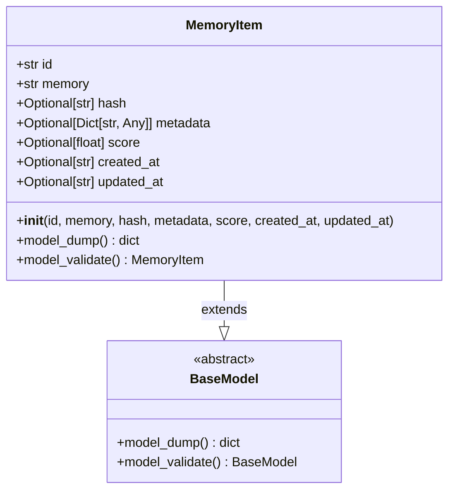
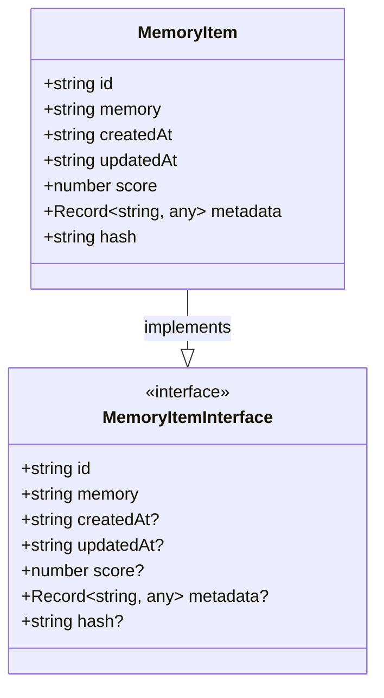
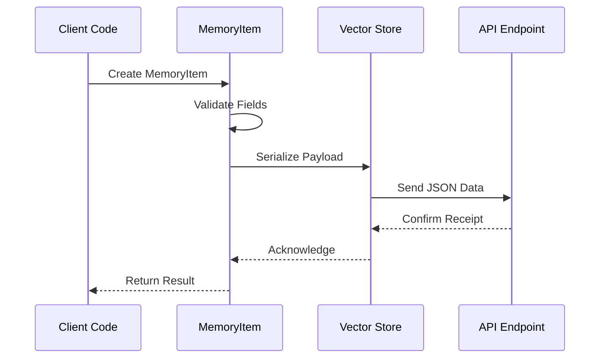
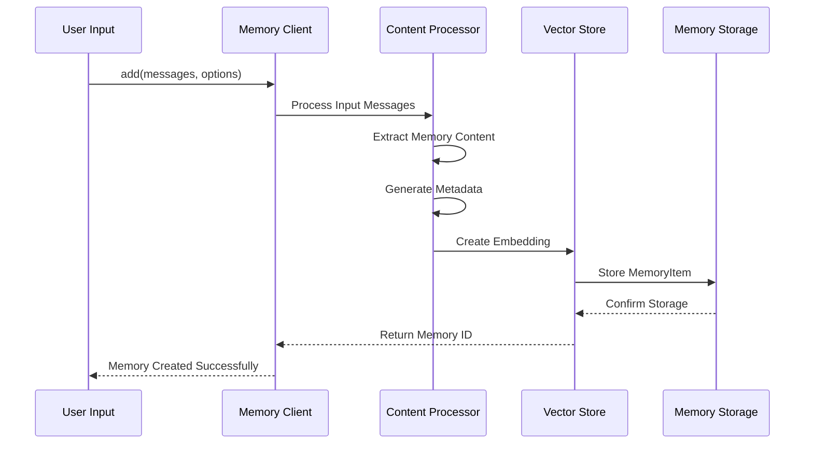
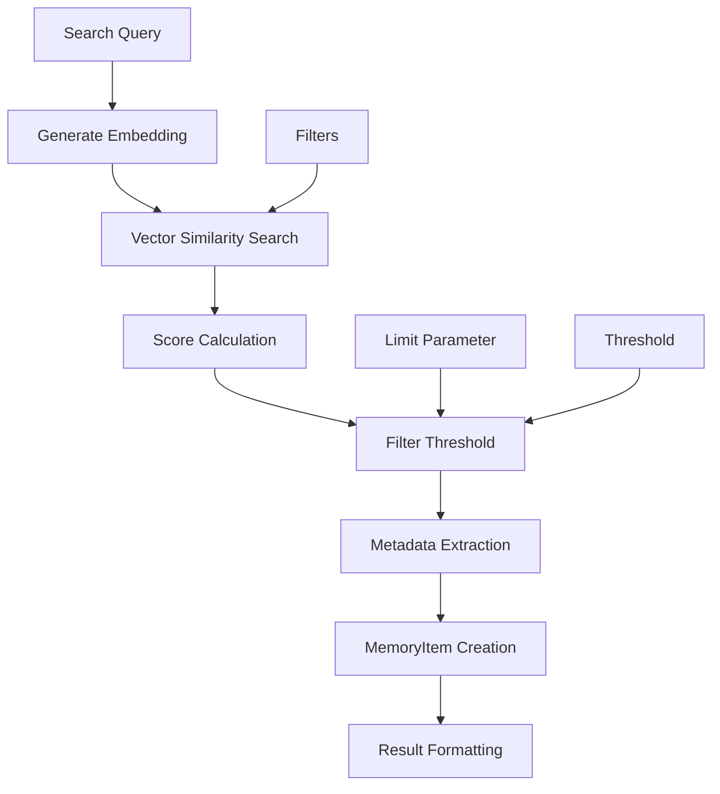
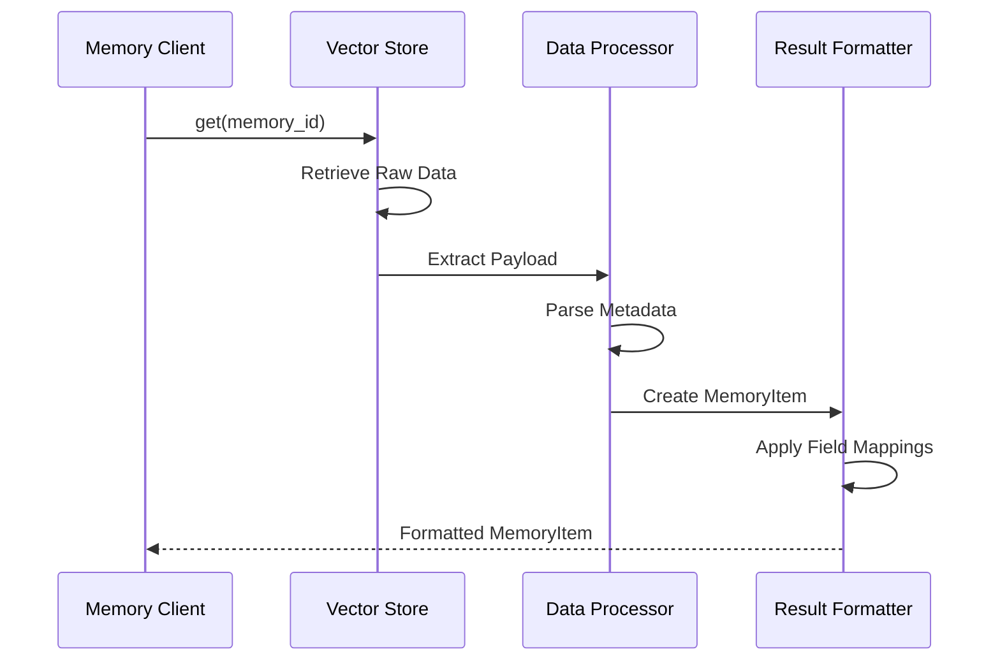

# Core Memory Model

<cite>
**Referenced Files in This Document**
- [base.py](file://mem0/configs/base.py)
- [index.ts](file://mem0-ts/src/oss/src/types/index.ts)
- [main.py](file://mem0/memory/main.py)
- [index.ts](file://mem0-ts/src/oss/src/memory/index.ts)
- [schemas.py](file://openmemory/api/app/schemas.py)
- [models.py](file://openmemory/api/app/models.py)
- [redis.ts](file://mem0-ts/src/oss/src/vector_stores/redis.ts)
- [MemoryHistoryManager.ts](file://mem0-ts/src/client/MemoryHistoryManager.ts)
- [test_main.py](file://tests/test_main.py)
- [memory.test.ts](file://mem0-ts/src/oss/tests/memory.test.ts)
</cite>

## Table of Contents
1. [Introduction](#introduction)
2. [MemoryItem Model Definition](#memoryitem-model-definition)
3. [Field Specifications](#field-specifications)
4. [Platform Implementation Details](#platform-implementation-details)
5. [Serialization and Deserialization](#serialization-and-deserialization)
6. [Usage Patterns](#usage-patterns)
7. [Common Issues and Solutions](#common-issues-and-solutions)
8. [Best Practices](#best-practices)
9. [Troubleshooting Guide](#troubleshooting-guide)

## Introduction

The MemoryItem entity serves as the fundamental data structure in the Mem0 system, representing individual memories with comprehensive metadata and temporal information. This model encapsulates the core concept of persistent, searchable knowledge units that power the system's memory capabilities across both Python and TypeScript implementations.

The MemoryItem model is built using robust validation frameworks (Pydantic for Python and TypeScript interfaces) to ensure data integrity and type safety while maintaining flexibility for diverse use cases. It supports various operations including creation, search, retrieval, and management of memories across different vector stores and storage backends.

## MemoryItem Model Definition

### Python Implementation

The Python MemoryItem model is defined using Pydantic's BaseModel, providing automatic validation and serialization capabilities:



**Diagram sources**
- [base.py](file://mem0/configs/base.py#L15-L25)

### TypeScript Implementation

The TypeScript MemoryItem interface provides equivalent functionality with native JavaScript type safety:



**Diagram sources**
- [index.ts](file://mem0-ts/src/oss/src/types/index.ts#L83-L91)

**Section sources**
- [base.py](file://mem0/configs/base.py#L15-L25)
- [index.ts](file://mem0-ts/src/oss/src/types/index.ts#L83-L91)

## Field Specifications

### Core Fields

#### id (str, required)
- **Purpose**: Unique identifier for the memory instance
- **Validation**: Required field with automatic UUID generation in most implementations
- **Format**: String representation of UUID or custom identifier
- **Constraints**: Must be unique across all memories in the system
- **Example**: `"mem_123abc456def"`

#### memory (str, required)
- **Purpose**: The deduced memory content extracted from input data
- **Validation**: Required string field with automatic content processing
- **Format**: Natural language description of learned information
- **Constraints**: Cannot be empty or null
- **Example**: `"User enjoys playing tennis on weekends"`

### Optional Fields

#### hash (str, optional)
- **Purpose**: Cryptographic hash for memory verification and deduplication
- **Validation**: Optional string with automatic hashing capabilities
- **Format**: Hexadecimal hash string
- **Constraints**: Generated automatically if not provided
- **Example**: `"sha256:e3b0c44298fc1c149afbf4c8996fb92427ae41e4649b934ca495991b7852b855"`

#### metadata (Dict[str, Any], optional)
- **Purpose**: Additional contextual information and arbitrary data
- **Validation**: Optional dictionary with flexible key-value pairs
- **Format**: JSON-serializable dictionary
- **Constraints**: Supports any JSON-compatible data types
- **Example**: `{"source": "conversation", "confidence": 0.95, "tags": ["personal", "hobbies"]}`

#### score (float, optional)
- **Purpose**: Relevance score for search and ranking operations
- **Validation**: Optional floating-point number between 0.0 and 1.0
- **Format**: Decimal number representing memory relevance
- **Constraints**: Typically used for search result ranking
- **Example**: `0.875`

#### created_at (str, optional)
- **Purpose**: Timestamp marking memory creation
- **Validation**: Optional ISO 8601 formatted string
- **Format**: ISO 8601 timestamp (YYYY-MM-DDTHH:MM:SSZ)
- **Constraints**: Automatically generated if not provided
- **Example**: `"2024-01-15T10:30:45.123Z"`

#### updated_at (str, optional)
- **Purpose**: Timestamp marking last modification
- **Validation**: Optional ISO 8601 formatted string
- **Format**: ISO 8601 timestamp (YYYY-MM-DDTHH:MM:SSZ)
- **Constraints**: Updated automatically on modifications
- **Example**: `"2024-01-15T14:22:18.456Z"`

**Section sources**
- [base.py](file://mem0/configs/base.py#L16-L25)
- [index.ts](file://mem0-ts/src/oss/src/types/index.ts#L83-L91)

## Platform Implementation Details

### Type Consistency Between Platforms

The MemoryItem model maintains strict type consistency between Python and TypeScript implementations:

| Field | Python Type | TypeScript Type | Validation Rules |
|-------|-------------|-----------------|------------------|
| id | `str` | `string` | Required, unique identifier |
| memory | `str` | `string` | Required, content field |
| hash | `Optional[str]` | `string?` | Optional, cryptographic hash |
| metadata | `Optional[Dict[str, Any]]` | `Record<string, any>?` | Optional, flexible data |
| score | `Optional[float]` | `number?` | Optional, relevance score |
| created_at | `Optional[str]` | `string?` | Optional, ISO 8601 timestamp |
| updated_at | `Optional[str]` | `string?` | Optional, ISO 8601 timestamp |

### Platform-Specific Adaptations

#### Python Implementation Features
- **Automatic Validation**: Built-in Pydantic validation with custom validators
- **Serialization**: Native JSON serialization support
- **Type Hints**: Comprehensive type annotations for IDE support
- **Field Exclusions**: Flexible field exclusion during serialization

#### TypeScript Implementation Features
- **Runtime Validation**: Compile-time type checking with runtime validation
- **Flexible Metadata**: Generic Record type for unlimited key-value pairs
- **Timestamp Handling**: Automatic ISO 8601 parsing and formatting
- **Promise-Based Operations**: Asynchronous memory operations

**Section sources**
- [base.py](file://mem0/configs/base.py#L15-L25)
- [index.ts](file://mem0-ts/src/oss/src/types/index.ts#L83-L91)

## Serialization and Deserialization

### Python Serialization Patterns

The MemoryItem model supports multiple serialization formats for different use cases:

```mermaid
flowchart TD
A[MemoryItem Instance] --> B{Serialization Method}
B --> C[model_dump()]
B --> D[model_dump_json()]
B --> E[dict conversion]
C --> F[Python Dictionary]
D --> G[JSON String]
E --> H[Standard Dictionary]
F --> I[API Response]
G --> J[Network Transmission]
H --> K[Internal Processing]
```

**Diagram sources**
- [main.py](file://mem0/memory/main.py#L624-L630)

### TypeScript Serialization Patterns

TypeScript implementations handle serialization through multiple approaches:



**Diagram sources**
- [index.ts](file://mem0-ts/src/oss/src/memory/index.ts#L387-L412)

### Cross-Platform Compatibility

Both implementations ensure seamless data exchange through standardized formats:

- **JSON Compatibility**: All fields serialize to JSON-compatible formats
- **Timestamp Standardization**: ISO 8601 format for temporal data
- **Metadata Flexibility**: Support for arbitrary key-value pairs
- **Error Handling**: Graceful degradation on malformed data

**Section sources**
- [main.py](file://mem0/memory/main.py#L622-L642)
- [index.ts](file://mem0-ts/src/oss/src/memory/index.ts#L387-L412)

## Usage Patterns

### Add Operation Pattern

Creating new memories follows a consistent pattern across both platforms:



**Diagram sources**
- [main.py](file://mem0/memory/main.py#L624-L630)
- [index.ts](file://mem0-ts/src/oss/src/memory/index.ts#L387-L412)

### Search Operation Pattern

Memory search operations demonstrate sophisticated retrieval mechanisms:



**Diagram sources**
- [main.py](file://mem0/memory/main.py#L644-L756)
- [index.ts](file://mem0-ts/src/oss/src/memory/index.ts#L415-L479)

### Get Operation Pattern

Retrieving individual memories involves comprehensive data reconstruction:



**Diagram sources**
- [main.py](file://mem0/memory/main.py#L622-L642)
- [index.ts](file://mem0-ts/src/oss/src/memory/index.ts#L380-L412)

**Section sources**
- [main.py](file://mem0/memory/main.py#L622-L756)
- [index.ts](file://mem0-ts/src/oss/src/memory/index.ts#L380-L479)

## Common Issues and Solutions

### Metadata Type Flexibility Issues

**Problem**: TypeScript's Record<string, any> allows any data type, potentially causing runtime errors.

**Solution**: Implement runtime validation and type guards:
```typescript
// Type guard for metadata validation
function isValidMetadata(metadata: any): metadata is Record<string, any> {
    return metadata && typeof metadata === 'object';
}
```

### Timestamp Formatting Conflicts

**Problem**: Different systems may use varying timestamp formats.

**Solution**: Standardize on ISO 8601 format with validation:
```python
# Python validation
from datetime import datetime
import pytz

def validate_timestamp(timestamp: str) -> datetime:
    try:
        dt = datetime.fromisoformat(timestamp.replace('Z', '+00:00'))
        return dt.astimezone(pytz.utc)
    except ValueError:
        raise ValueError(f"Invalid timestamp format: {timestamp}")
```

### Memory Deduplication Challenges

**Problem**: Identical memories may be created with different hashes.

**Solution**: Implement content-based deduplication:
```python
def calculate_memory_hash(content: str, metadata: dict) -> str:
    """Calculate consistent hash for memory deduplication"""
    import hashlib
    import json
    
    # Normalize data before hashing
    normalized_data = {
        'content': content.strip(),
        'metadata': dict(sorted(metadata.items())) if metadata else {}
    }
    
    # Create hash
    hash_input = json.dumps(normalized_data, sort_keys=True).encode('utf-8')
    return hashlib.sha256(hash_input).hexdigest()
```

### Cross-Platform Serialization Issues

**Problem**: Differences in how Python and TypeScript handle JSON serialization.

**Solution**: Implement consistent serialization protocols:
```typescript
// TypeScript serialization helper
function serializeMemoryItem(item: MemoryItem): string {
    const cleanItem = {
        id: item.id,
        memory: item.memory,
        hash: item.hash,
        createdAt: item.createdAt,
        updatedAt: item.updatedAt,
        score: item.score,
        metadata: item.metadata || {}
    };
    return JSON.stringify(cleanItem);
}
```

**Section sources**
- [redis.ts](file://mem0-ts/src/oss/src/vector_stores/redis.ts#L460-L498)
- [MemoryHistoryManager.ts](file://mem0-ts/src/client/MemoryHistoryManager.ts#L1-L58)

## Best Practices

### Field Validation Strategies

1. **Required Field Enforcement**: Always validate presence of core fields (id, memory)
2. **Type Consistency**: Maintain identical type definitions across platforms
3. **Range Validation**: Validate score values between 0.0 and 1.0
4. **Format Validation**: Ensure timestamp strings conform to ISO 8601

### Memory Content Management

1. **Content Normalization**: Strip whitespace and normalize content before processing
2. **Metadata Structuring**: Use consistent key naming conventions
3. **Size Limits**: Implement reasonable limits for memory content length
4. **Sensitive Data**: Sanitize metadata to prevent information leakage

### Performance Optimization

1. **Indexing Strategy**: Properly index frequently queried fields
2. **Batch Operations**: Use batch processing for bulk memory operations
3. **Caching**: Implement appropriate caching for frequently accessed memories
4. **Pagination**: Use pagination for large result sets

### Error Handling Patterns

1. **Graceful Degradation**: Handle malformed data without crashing
2. **Validation Errors**: Provide clear error messages for validation failures
3. **Network Resilience**: Implement retry logic for transient failures
4. **Logging**: Comprehensive logging for debugging and monitoring

## Troubleshooting Guide

### Common Validation Errors

| Error Type | Symptoms | Solution |
|------------|----------|----------|
| Missing Required Fields | ValidationError during instantiation | Ensure id and memory fields are provided |
| Invalid Timestamp Format | Datetime parsing errors | Use ISO 8601 format for timestamps |
| Invalid Metadata Type | Type mismatch errors | Ensure metadata is JSON-serializable |
| Score Range Violation | Validation errors | Keep scores between 0.0 and 1.0 |

### Performance Issues

**Problem**: Slow memory search operations

**Diagnostic Steps**:
1. Check vector store indexing configuration
2. Verify embedding model performance
3. Review query complexity and filters
4. Monitor memory store size and fragmentation

**Solutions**:
- Optimize vector store configuration
- Implement query result caching
- Use appropriate similarity thresholds
- Consider memory compaction strategies

### Data Integrity Issues

**Problem**: Inconsistent memory data across platforms

**Diagnostic Approach**:
1. Compare serialization formats
2. Verify timestamp handling
3. Check metadata field mapping
4. Validate hash calculation methods

**Resolution Strategy**:
- Standardize serialization protocols
- Implement bidirectional validation
- Add data migration scripts for schema changes
- Create automated data integrity checks

**Section sources**
- [test_main.py](file://tests/test_main.py#L95-L131)
- [memory.test.ts](file://mem0-ts/src/oss/tests/memory.test.ts#L84-L160)