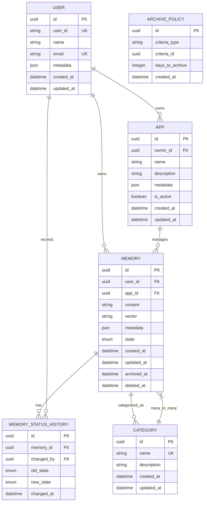
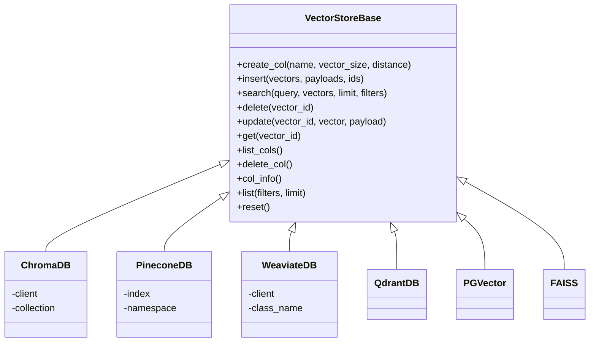
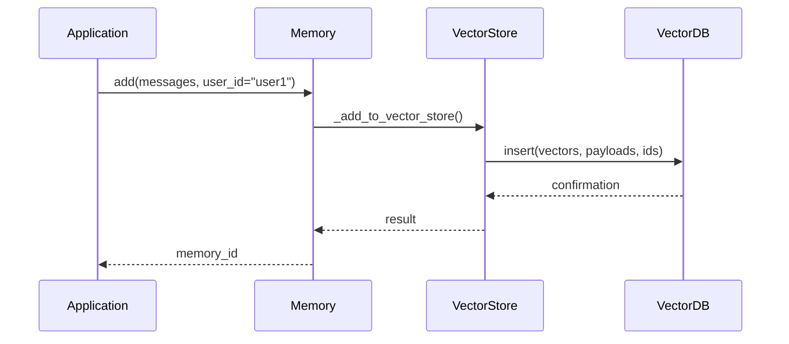
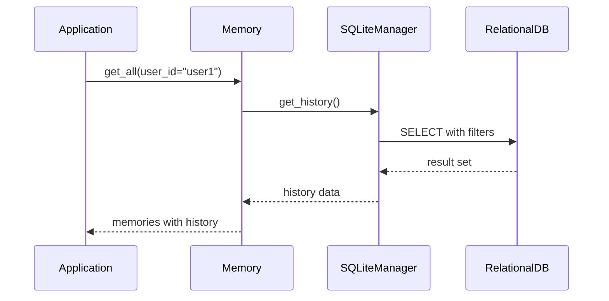
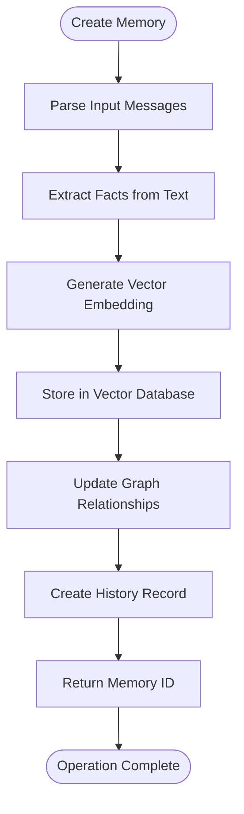
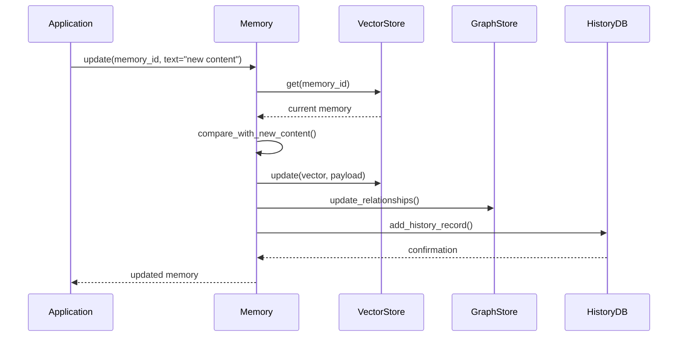

# Data Models

<cite>
**Referenced Files in This Document**   
- [MemoryItem](file://mem0\configs\base.py#L15-L25)
- [Memory](file://openmemory\api\app\models.py#L85-L109)
- [MemoryStatusHistory](file://openmemory\api\app\models.py#L161-L173)
- [ArchivePolicy](file://openmemory\api\app\models.py#L148-L158)
- [SQLiteManager](file://mem0\memory\storage.py#L10-L219)
- [VectorStoreBase](file://mem0\vector_stores\base.py#L1-L59)
- [UPDATE_GRAPH_PROMPT](file://mem0\graphs\utils.py#L1-L16)
</cite>

## Table of Contents
1. [Introduction](#introduction)
2. [MemoryItem Entity](#memoryitem-entity)
3. [Database Schema](#database-schema)
4. [Vector Storage](#vector-storage)
5. [Graph Representation](#graph-representation)
6. [Data Access Patterns](#data-access-patterns)
7. [Data Lifecycle Management](#data-lifecycle-management)
8. [CRUD Operations](#crud-operations)
9. [Conclusion](#conclusion)

## Introduction
The Mem0 system implements a comprehensive data model for managing AI agent memories with support for both vector-based and graph-based storage. The system provides a unified interface for storing, retrieving, and managing memories with rich metadata, versioning, and access control. This documentation details the core data models, storage formats, relationships, and operational patterns that enable Mem0's scalable long-term memory capabilities for AI agents.

## MemoryItem Entity
The MemoryItem entity represents the fundamental unit of memory in the Mem0 system, containing both the semantic content and associated metadata. This entity serves as the interface between the application layer and the underlying storage systems.

### Core Fields
The MemoryItem entity contains the following fields:

| Field | Data Type | Constraints | Description |
|-------|-----------|-----------|-------------|
| id | string | Required, Unique | The unique identifier for the memory |
| memory | string | Required | The deduced memory content from input text |
| hash | string | Optional | Cryptographic hash of the memory content for change detection |
| metadata | Dict[str, Any] | Optional | Flexible key-value store for additional context and properties |
| score | float | Optional | Relevance or confidence score associated with the memory |
| created_at | string | Optional | ISO timestamp when the memory was created |
| updated_at | string | Optional | ISO timestamp when the memory was last modified |

**Section sources**
- [MemoryItem](file://mem0\configs\base.py#L15-L25)
- [Memory](file://openmemory\api\app\models.py#L85-L109)

## Database Schema
The Mem0 system implements a relational database schema to manage memory metadata, relationships, and lifecycle states. The schema is designed to support efficient querying, access control, and historical tracking.

### Relational Data Model
The core relational model consists of several interconnected tables that manage memory entities and their relationships:



**Diagram sources**
- [Memory](file://openmemory\api\app\models.py#L85-L109)
- [MemoryStatusHistory](file://openmemory\api\app\models.py#L161-L173)
- [ArchivePolicy](file://openmemory\api\app\models.py#L148-L158)

### Key Relationships
The data model establishes several important relationships between entities:

- **User-Memory Relationship**: Each memory is owned by a specific user, enabling personalized memory management and access control.
- **App-Memory Relationship**: Memories can be associated with specific applications, allowing for application-specific memory contexts.
- **Memory-Category Relationship**: A many-to-many relationship that enables categorization of memories for improved organization and retrieval.
- **Memory Status History**: Tracks all state transitions for memories, providing an audit trail of memory lifecycle changes.

### Indexing Strategy
The database schema implements a comprehensive indexing strategy to optimize query performance:

- Composite indexes on `(user_id, state)` and `(app_id, state)` for efficient filtering of active memories
- Indexes on `created_at`, `updated_at`, `archived_at`, and `deleted_at` for time-based queries
- Unique constraint on user_id to prevent duplicate user records
- Foreign key indexes to ensure referential integrity and optimize join operations

**Section sources**
- [Memory](file://openmemory\api\app\models.py#L85-L109)
- [MemoryStatusHistory](file://openmemory\api\app\models.py#L161-L173)

## Vector Storage
The Mem0 system utilizes vector databases to store and retrieve memories based on semantic similarity. The vector storage layer provides high-performance similarity search capabilities for AI applications.

### Storage Format
Vector embeddings are stored with their associated metadata in a standardized format across different vector database implementations:

```json
{
  "memory_id": "uuid",
  "hash": "string",
  "memory": "string",
  "created_at": "datetime",
  "updated_at": "datetime",
  "agent_id": "uuid",
  "run_id": "uuid",
  "user_id": "uuid",
  "embedding": "float32_array"
}
```

The embedding vector is stored as a binary float32 array, while all other metadata is stored as structured fields to enable filtering and faceted search.

### Supported Vector Databases
Mem0 supports multiple vector database backends through a unified interface:

- **Chroma**: Lightweight, in-memory vector store for development and testing
- **Pinecone**: Cloud-native vector database with managed infrastructure
- **Weaviate**: Open-source vector search engine with GraphQL interface
- **Qdrant**: High-performance vector search engine with payload filtering
- **PGVector**: PostgreSQL extension for vector similarity search
- **FAISS**: Facebook AI Similarity Search library for local vector operations

Each vector store implementation adheres to the common VectorStoreBase interface while leveraging the specific capabilities of the underlying database.



**Diagram sources**
- [VectorStoreBase](file://mem0\vector_stores\base.py#L1-L59)
- [Databricks](file://mem0\vector_stores\databricks.py#L86-L600)

### Query Patterns
The vector storage layer supports several query patterns for memory retrieval:

- **Similarity Search**: Find memories similar to a query vector or text
- **Filtered Search**: Apply metadata filters to constrain search results
- **Hybrid Search**: Combine vector similarity with keyword-based BM25 scoring
- **Range Queries**: Retrieve memories within a specific time range

These patterns enable sophisticated memory retrieval strategies that balance semantic relevance with contextual constraints.

**Section sources**
- [VectorStoreBase](file://mem0\vector_stores\base.py#L1-L59)
- [Databricks](file://mem0\vector_stores\databricks.py#L86-L600)

## Graph Representation
The Mem0 system implements a graph-based memory model to capture relationships between entities and concepts. This graph representation enables reasoning over connected knowledge and complex inference patterns.

### Graph Data Model
The graph memory model represents knowledge as nodes and relationships:

- **Nodes**: Represent entities, concepts, or memories
- **Relationships**: Represent semantic connections between nodes
- **Properties**: Key-value pairs attached to nodes and relationships

The graph structure is designed to capture implicit knowledge and enable reasoning over connected information.

### Relationship Inference
The system uses AI to infer relationships from text input and update the graph structure:

```python
UPDATE_GRAPH_PROMPT = """
You are an AI expert specializing in graph memory management and optimization. Your task is to analyze existing graph memories alongside new information, and update the relationships in the memory list to ensure the most accurate, current, and coherent representation of knowledge.

Input:
1. Existing Graph Memories: A list of current graph memories, each containing source, target, and relationship information.
2. New Graph Memory: Fresh information to be integrated into the existing graph structure.

Guidelines:
1. Identification: Use the source and target as primary identifiers when matching existing memories with new information.
2. Conflict Resolution:
   - If new information contradicts an existing memory:
     a) For matching source and target but differing content, update the relationship of the existing memory.
     b) If the new memory provides more recent or accurate information, update the existing memory accordingly.
3. Comprehensive Review: Thoroughly examine each existing graph memory against the new information, updating relationships as necessary. Multiple updates may be required.
4. Consistency: Maintain a uniform and clear style across all memories. Each entry should be concise yet comprehensive.
5. Semantic Coherence: Ensure that updates maintain or improve the overall semantic structure of the graph.
"""
```

This prompt guides the AI in maintaining a coherent and accurate graph structure over time.

### Supported Graph Databases
Mem0 supports multiple graph database backends:

- **Kuzu**: Lightweight, disk-based graph database
- **Memgraph**: High-performance graph database with Cypher support
- **Neptune**: AWS-managed graph database service
- **Neo4j**: Enterprise graph database platform

Each implementation provides the same interface for graph operations while leveraging the specific capabilities of the underlying database.

**Section sources**
- [UPDATE_GRAPH_PROMPT](file://mem0\graphs\utils.py#L1-L16)
- [graph_memory.py](file://mem0\memory\graph_memory.py)
- [kuzu_memory.py](file://mem0\memory\kuzu_memory.py)

## Data Access Patterns
The Mem0 system implements optimized data access patterns for both vector and relational storage, ensuring efficient memory operations for AI applications.

### Vector Database Access
The vector store interface provides a consistent API across different database backends:



The access pattern follows a consistent flow from application to storage, with proper error handling and result propagation.

### Relational Database Access
For metadata and relationship operations, the system uses the relational database:



The SQLiteManager provides a thread-safe interface to the relational database, handling transactions and connection management.

### Caching Strategy
The system implements a multi-layer caching strategy:

- **In-memory cache**: For frequently accessed memories
- **Query result cache**: For common query patterns
- **Vector cache**: For recently computed embeddings

This caching strategy reduces latency and database load for common operations.

**Section sources**
- [VectorStoreBase](file://mem0\vector_stores\base.py#L1-L59)
- [SQLiteManager](file://mem0\memory\storage.py#L10-L219)

## Data Lifecycle Management
The Mem0 system implements comprehensive data lifecycle management to ensure data integrity, compliance, and optimal performance.

### Memory States
Memories can exist in one of several states:

- **Active**: The memory is available for retrieval and use
- **Paused**: The memory is temporarily disabled but preserved
- **Archived**: The memory is moved to long-term storage
- **Deleted**: The memory is marked for removal

State transitions are tracked in the MemoryStatusHistory table, providing a complete audit trail.

### Retention Policies
The system supports configurable retention policies:

- **Time-based archiving**: Automatically archive memories after a specified period
- **Usage-based retention**: Keep frequently accessed memories active
- **Event-driven archiving**: Archive memories based on specific triggers

These policies are defined in the ArchivePolicy table and applied automatically by the system.

### Data Archival
Archived memories are moved to long-term storage with the following characteristics:

- **Compressed storage**: Reduced storage footprint
- **Slower access**: Optimized for infrequent retrieval
- **Cost-effective**: Lower storage costs for historical data

The archival process preserves all metadata and relationships while optimizing for storage efficiency.

### Data Deletion
When memories are deleted, the system follows a secure deletion process:

- **Soft delete**: Mark memories as deleted with a timestamp
- **Hard delete**: Permanently remove memories after a grace period
- **Audit logging**: Record all deletion operations

This approach ensures data integrity while complying with privacy regulations.

**Section sources**
- [Memory](file://openmemory\api\app\models.py#L85-L109)
- [MemoryStatusHistory](file://openmemory\api\app\models.py#L161-L173)
- [ArchivePolicy](file://openmemory\api\app\models.py#L148-L158)

## CRUD Operations
The Mem0 system provides a comprehensive API for creating, reading, updating, and deleting memories through both synchronous and asynchronous interfaces.

### Create Operation
The create operation processes input text and stores it as a memory:



The create operation also triggers automatic categorization and relationship inference.

### Read Operation
The read operation retrieves memories based on various criteria:

- **By ID**: Retrieve a specific memory
- **By query**: Find similar memories using vector search
- **By filters**: Retrieve memories matching specific metadata
- **By history**: Get all versions of a memory

The system optimizes read operations through indexing and caching.

### Update Operation
The update operation modifies existing memories:



The update process preserves history and updates all related components.

### Delete Operation
The delete operation removes memories from the system:

- **Soft delete**: Mark memory as deleted with timestamp
- **Hard delete**: Permanently remove after retention period
- **Cascade delete**: Remove related history and relationships

The system ensures referential integrity during deletion operations.

**Section sources**
- [Memory](file://mem0\memory\main.py#L195-L200)
- [SQLiteManager](file://mem0\memory\storage.py#L126-L168)

## Conclusion
The Mem0 data model provides a comprehensive foundation for AI agent memory management, combining vector-based semantic storage with graph-based relationship modeling. The system's relational database schema ensures data integrity and efficient querying, while the vector and graph storage layers enable sophisticated memory retrieval and inference capabilities. The well-defined data lifecycle management, retention policies, and CRUD operations make Mem0 suitable for production AI applications requiring scalable, persistent memory. By supporting multiple storage backends and providing a consistent API, the system offers flexibility for different deployment scenarios and performance requirements.