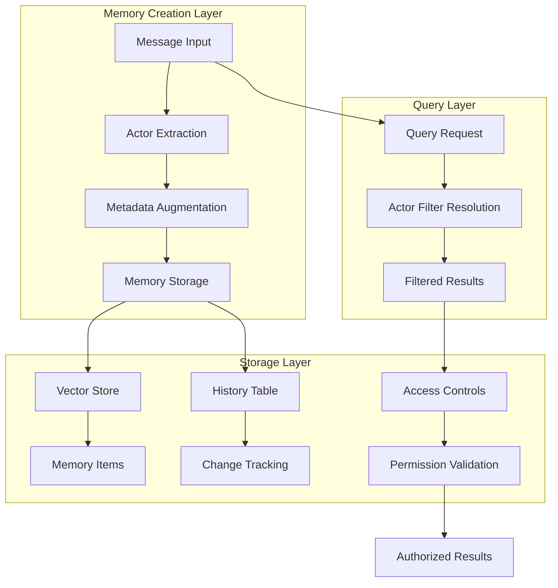
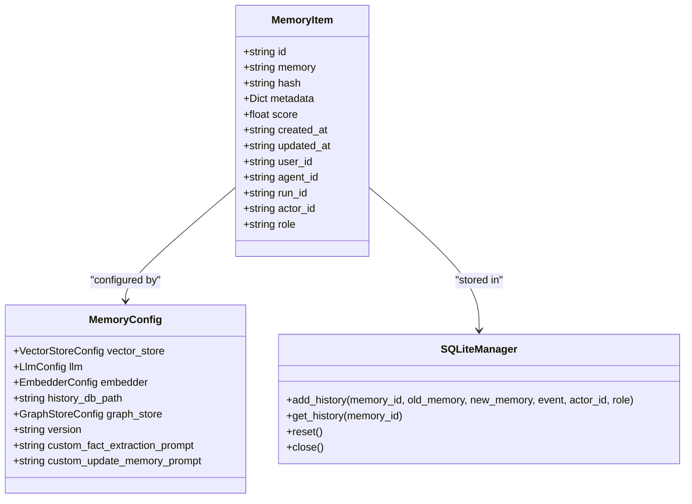
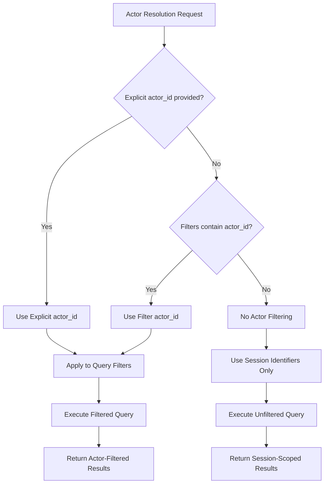
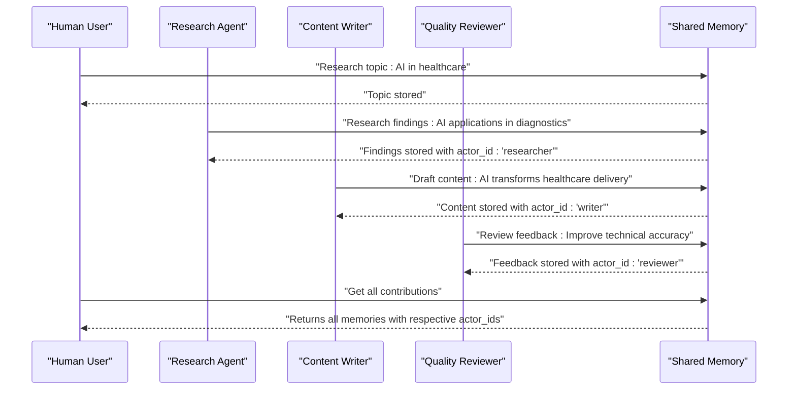
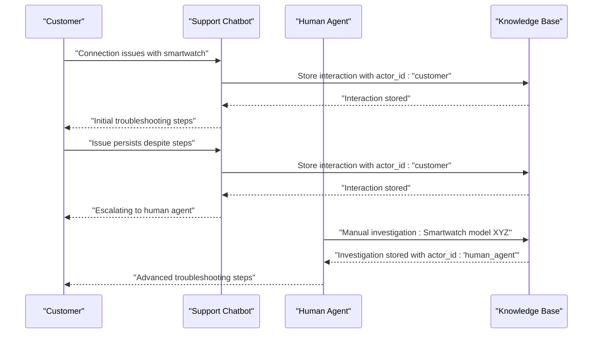
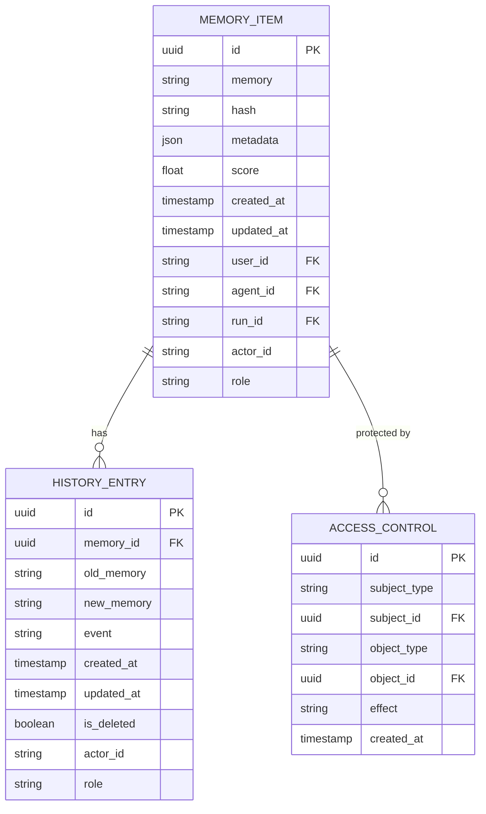
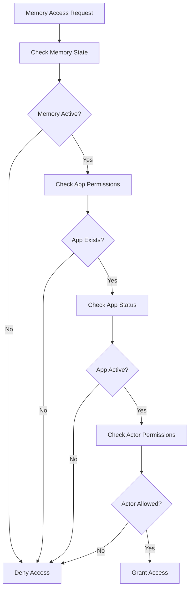
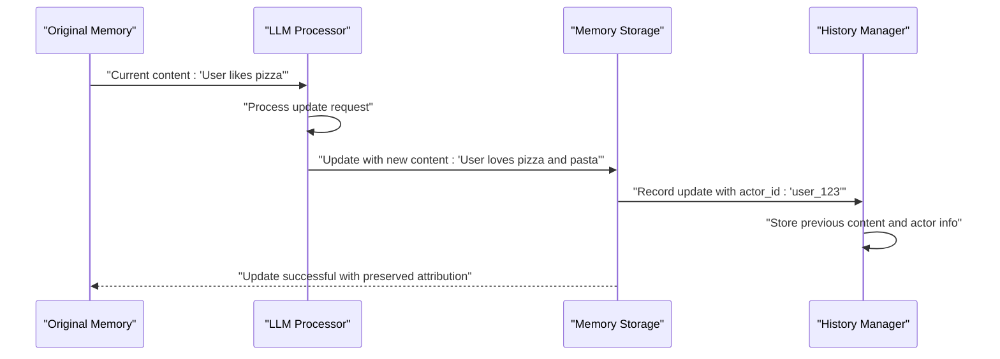

# Actor Attribution

<cite>
**Referenced Files in This Document**
- [main.py](file://mem0/memory/main.py)
- [storage.py](file://mem0/memory/storage.py)
- [base.py](file://mem0/configs/base.py)
- [customer-support-chatbot.ipynb](file://cookbooks/customer-support-chatbot.ipynb)
- [prompts.py](file://mem0/configs/prompts.py)
- [utils.py](file://mem0/graphs/utils.py)
- [models.py](file://openmemory/api/app/models.py)
- [memories.py](file://openmemory/api/app/routers/memories.py)
- [permissions.py](file://openmemory/api/app/utils/permissions.py)
- [backup.py](file://openmemory/api/app/routers/backup.py)
</cite>

## Table of Contents
1. [Introduction](#introduction)
2. [Actor Attribution Architecture](#actor-attribution-architecture)
3. [Core Data Model](#core-data-model)
4. [Actor Resolution and Precedence](#actor-resolution-and-precedence)
5. [Multi-Actor Scenarios](#multi-actor-scenarios)
6. [Integration with Metadata Fields](#integration-with-metadata-fields)
7. [Practical Implementation Examples](#practical-implementation-examples)
8. [Permission Management](#permission-management)
9. [Memory Updates and Merges](#memory-updates-and-meres)
10. [Common Issues and Best Practices](#common-issues-and-best-practices)
11. [Troubleshooting Guide](#troubleshooting-guide)
12. [Conclusion](#conclusion)

## Introduction

Actor attribution in the Mem0 system provides a sophisticated mechanism for establishing message-level attribution for memory items, enabling role-based filtering and comprehensive source tracking. This system allows different users or agents to contribute to memory content while maintaining clear provenance and accountability for each contribution.

The actor attribution system serves as the foundation for multi-actor scenarios where various entities participate in memory creation, modification, and retrieval. It enables organizations to track who contributed what information, analyze interaction patterns between different actors, and implement fine-grained permission controls based on actor relationships.

## Actor Attribution Architecture

The actor attribution system in Mem0 operates through a multi-layered architecture that integrates seamlessly with the core memory management infrastructure:



**Diagram sources**
- [main.py](file://mem0/memory/main.py#L45-L126)
- [storage.py](file://mem0/memory/storage.py#L126-L167)

The architecture ensures that actor information is consistently maintained throughout the memory lifecycle, from creation through updates and retrieval.

**Section sources**
- [main.py](file://mem0/memory/main.py#L45-L126)
- [storage.py](file://mem0/memory/storage.py#L126-L167)

## Core Data Model

The actor attribution system is built around several key data structures that work together to provide comprehensive relationship tracking:

### MemoryItem Structure

The fundamental memory item includes actor-related fields that establish attribution relationships:



**Diagram sources**
- [base.py](file://mem0/configs/base.py#L16-L26)
- [storage.py](file://mem0/memory/storage.py#L126-L167)

### Actor Field Integration

The actor attribution system integrates with multiple metadata fields to provide comprehensive relationship tracking:

| Field | Purpose | Scope | Example Usage |
|-------|---------|-------|---------------|
| `actor_id` | Explicit actor identification | Query-time filtering | `"user_123"`, `"assistant_agent"` |
| `user_id` | User session scoping | Memory isolation | `"customer_456"`, `"admin_user"` |
| `agent_id` | Agent session scoping | Agent-specific memories | `"support_bot"`, `"research_agent"` |
| `run_id` | Execution session scoping | Workflow tracking | `"session_abc123"`, `"task_xyz789"` |
| `role` | Message role attribution | Content classification | `"user"`, `"assistant"`, `"system"` |

**Section sources**
- [base.py](file://mem0/configs/base.py#L16-L26)
- [main.py](file://mem0/memory/main.py#L1375-L1380)

## Actor Resolution and Precedence

The actor attribution system implements a sophisticated resolution mechanism that determines which actor identifier takes precedence in different contexts:



**Diagram sources**
- [main.py](file://mem0/memory/main.py#L119-L123)

### Resolution Precedence Rules

The actor resolution follows a strict precedence order:

1. **Explicit `actor_id` argument** - Highest priority, overrides all other sources
2. **`filters["actor_id"]`** - Second priority, used when no explicit argument provided
3. **Session identifiers only** - Lowest priority, used when no actor-specific filters

This precedence ensures predictable behavior while allowing flexibility in how actor attribution is applied.

**Section sources**
- [main.py](file://mem0/memory/main.py#L45-L126)

## Multi-Actor Scenarios

The actor attribution system excels in multi-actor scenarios where different entities contribute to memory content. Here are several practical examples:

### Collaborative Task Management



**Diagram sources**
- [main.py](file://mem0/memory/main.py#L300-L400)
- [LLM.md](file://LLM.md#L818-L859)

### Customer Support Interaction

In customer support scenarios, actor attribution helps track interactions between customers, support agents, and automated systems:



**Diagram sources**
- [customer-support-chatbot.ipynb](file://cookbooks/customer-support-chatbot.ipynb#L53-L110)

**Section sources**
- [main.py](file://mem0/memory/main.py#L300-L400)
- [customer-support-chatbot.ipynb](file://cookbooks/customer-support-chatbot.ipynb#L53-L110)

## Integration with Metadata Fields

Actor attribution integrates seamlessly with other metadata fields to provide comprehensive relationship tracking:

### Metadata Field Relationships



**Diagram sources**
- [storage.py](file://mem0/memory/storage.py#L126-L167)
- [models.py](file://openmemory/api/app/models.py#L132-L170)

### Enhanced Metadata Capabilities

The integration enables several advanced capabilities:

- **Role-based filtering**: Filter memories by message roles (user, assistant, system)
- **Actor-specific queries**: Retrieve memories contributed by specific actors
- **Collaboration analytics**: Analyze interaction patterns between different actors
- **Audit trails**: Track changes made by specific actors over time

**Section sources**
- [storage.py](file://mem0/memory/storage.py#L126-L167)
- [models.py](file://openmemory/api/app/models.py#L132-L170)

## Practical Implementation Examples

### Basic Actor Attribution Setup

```python
# Initialize memory with actor attribution
memory = Memory()

# Store user interaction with explicit actor identification
memory.add(
    messages="User reported connection issues with smartwatch",
    user_id="customer_123",
    actor_id="customer_123",
    metadata={"issue_type": "technical", "priority": "high"}
)

# Store agent response with agent attribution
memory.add(
    messages="Provided troubleshooting steps for connection issues",
    agent_id="support_agent_456",
    actor_id="support_agent_456",
    metadata={"response_type": "technical_support"}
)
```

### Advanced Multi-Actor Workflows

```python
# Collaborative research workflow
class ResearchWorkflow:
    def __init__(self):
        self.memory = Memory()
        self.researcher = ResearchAgent()
        self.writer = ContentWriter()
        self.reviewer = QualityReviewer()
    
    def execute_workflow(self, task: str, session_id: str):
        # Research phase with researcher attribution
        research_results = self.researcher.analyze(task)
        self.memory.add(
            f"Research findings: {research_results}",
            agent_id="researcher",
            run_id=session_id,
            actor_id="researcher",
            metadata={"phase": "research", "confidence_score": 0.9}
        )
        
        # Writing phase with writer attribution
        research_context = self.memory.search(
            "research findings",
            run_id=session_id
        )
        draft = self.writer.create_content(task, research_context)
        self.memory.add(
            f"Draft content: {draft}",
            agent_id="writer",
            run_id=session_id,
            actor_id="writer",
            metadata={"phase": "writing", "word_count": len(draft.split())}
        )
        
        # Review phase with reviewer attribution
        all_context = self.memory.get_all(run_id=session_id)
        final_output = self.reviewer.review(draft, all_context)
        
        return final_output
```

### Filtering by Actor Contributions

```python
# Retrieve all memories contributed by a specific actor
actor_memories = memory.get_all(
    user_id="customer_123",
    filters={"actor_id": "support_agent_456"}
)

# Search for memories by specific actor
relevant_memories = memory.search(
    query="connection issues",
    user_id="customer_123",
    filters={"actor_id": "customer_123"}
)

# Get all contributions from a specific agent
agent_contributions = memory.get_all(
    run_id="session_abc123",
    filters={"agent_id": "support_agent_456"}
)
```

**Section sources**
- [main.py](file://mem0/memory/main.py#L195-L308)
- [LLM.md](file://LLM.md#L818-L859)

## Permission Management

The actor attribution system provides robust permission management capabilities through access control lists and role-based filtering:

### Access Control Integration



**Diagram sources**
- [permissions.py](file://openmemory/api/app/utils/permissions.py#L8-L53)

### Role-Based Access Control

The system implements fine-grained access control based on actor relationships:

| Access Level | Description | Use Case |
|--------------|-------------|----------|
| **Full Access** | All memories accessible | System administrators |
| **Actor-Specific** | Memories from specific actors only | Departmental access |
| **Role-Based** | Memories from specific roles only | Role-based dashboards |
| **Filtered Access** | Custom filtered subsets | Analytics views |

**Section sources**
- [permissions.py](file://openmemory/api/app/utils/permissions.py#L8-L53)
- [memories.py](file://openmemory/api/app/routers/memories.py#L60-L96)

## Memory Updates and Merges

The actor attribution system maintains integrity during memory updates and merges through careful handling of actor information:

### Update Integrity Mechanisms



**Diagram sources**
- [main.py](file://mem0/memory/main.py#L1811-L1838)

### Merge Strategies

During memory merging operations, the system preserves actor attribution through several strategies:

1. **Preserved Actor IDs**: Original actor information is maintained during updates
2. **Incremental Attribution**: New contributions receive appropriate actor assignments
3. **Conflict Resolution**: When conflicts arise, actor context helps resolve ambiguities
4. **Audit Trail**: Complete history of actor contributions is maintained

**Section sources**
- [main.py](file://mem0/memory/main.py#L1811-L1838)
- [storage.py](file://mem0/memory/storage.py#L126-L167)

## Common Issues and Best Practices

### Proper Actor ID Assignment

**Best Practice**: Always assign explicit actor IDs when creating memories to ensure accurate attribution:

```python
# Good: Explicit actor assignment
memory.add(
    messages="Technical issue reported",
    user_id="customer_123",
    actor_id="customer_123",  # Explicit assignment
    metadata={"severity": "high"}
)

# Avoid: Implicit actor assignment
memory.add(
    messages="Technical issue reported",
    user_id="customer_123",
    # No actor_id specified - may lead to incorrect attribution
    metadata={"severity": "high"}
)
```

### Session Identifier Management

**Best Practice**: Use appropriate session identifiers for different contexts:

```python
# User sessions
memory.add(messages, user_id="user_123")

# Agent sessions  
memory.add(messages, agent_id="support_agent_456")

# Workflow sessions
memory.add(messages, run_id="workflow_session_abc123")
```

### Actor Filtering Strategies

**Best Practice**: Leverage actor filtering for efficient memory retrieval:

```python
# Filter by specific actor
memories = memory.get_all(
    user_id="customer_123",
    filters={"actor_id": "specific_agent"}
)

# Filter by role
memories = memory.search(
    query="technical support",
    user_id="customer_123",
    filters={"role": "assistant"}
)
```

### Maintaining Attribution Integrity

**Best Practice**: Preserve actor information during memory operations:

```python
# When updating memories, preserve actor information
existing_memory = memory.get(memory_id)
updated_content = "Updated content with new insights"

memory.update(
    memory_id=memory_id,
    data=updated_content,
    metadata={
        **existing_memory.get("metadata", {}),
        "actor_id": existing_memory.get("actor_id"),
        "updated_by": "admin_user"
    }
)
```

## Troubleshooting Guide

### Missing Actor Attribution

**Problem**: Actor IDs not appearing in memory records

**Solution**: Ensure explicit actor ID assignment during memory creation:

```python
# Check if actor_id is being set
memory.add(
    messages="User interaction",
    user_id="customer_123",
    actor_id="customer_123",  # Must be explicitly set
    metadata={}
)
```

### Incorrect Actor Filtering

**Problem**: Queries return unexpected results when filtering by actor

**Solution**: Verify actor resolution precedence and filter construction:

```python
# Debug actor resolution
filters = {"actor_id": "specific_actor"}
memories = memory.get_all(
    user_id="customer_123",
    filters=filters
)
print(f"Resolved filters: {filters}")
```

### Permission Denied Issues

**Problem**: Access denied errors when retrieving actor-specific memories

**Solution**: Check access control configurations and actor permissions:

```python
# Verify app permissions
from app.utils.permissions import check_memory_access_permissions

has_access = check_memory_access_permissions(
    db=session,
    memory=memory_record,
    app_id=app_id
)
```

### Memory Update Conflicts

**Problem**: Actor attribution lost during memory updates

**Solution**: Preserve actor information during update operations:

```python
# Preserve actor during updates
existing_memory = memory.get(memory_id)
memory.update(
    memory_id=memory_id,
    data=new_content,
    metadata={
        **existing_memory.get("metadata", {}),
        "actor_id": existing_memory.get("actor_id"),
        "last_updated_by": current_actor
    }
)
```

**Section sources**
- [main.py](file://mem0/memory/main.py#L45-L126)
- [permissions.py](file://openmemory/api/app/utils/permissions.py#L8-L53)

## Conclusion

The actor attribution system in Mem0 provides a comprehensive solution for managing multi-actor scenarios in memory management. Through its sophisticated architecture, the system enables:

- **Precise Attribution**: Clear identification of who contributed what information
- **Flexible Filtering**: Powerful querying capabilities based on actor relationships
- **Robust Security**: Fine-grained access control based on actor permissions
- **Complete Audit Trails**: Comprehensive tracking of all actor interactions

The system's integration with metadata fields, permission management, and memory operations ensures that actor attribution remains intact throughout the memory lifecycle. This foundation enables organizations to build sophisticated multi-agent systems, collaborative platforms, and analytical tools that leverage actor relationships for improved functionality and security.

By following the best practices outlined in this documentation and leveraging the system's robust features, developers can create powerful applications that benefit from comprehensive actor attribution capabilities while maintaining data integrity and security.