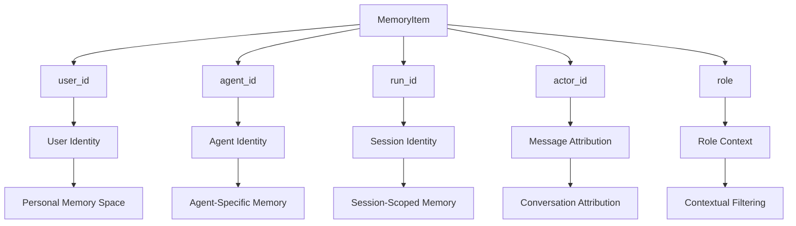
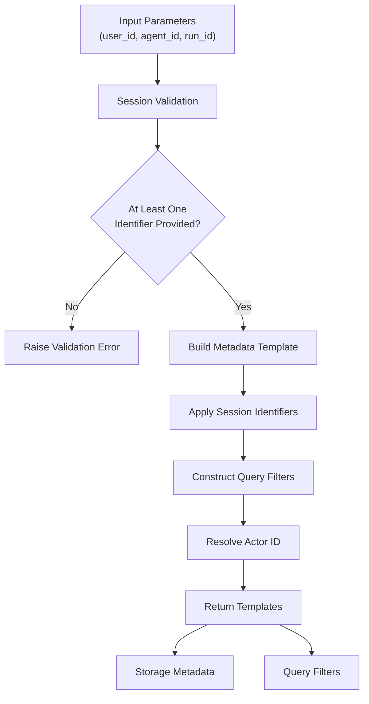
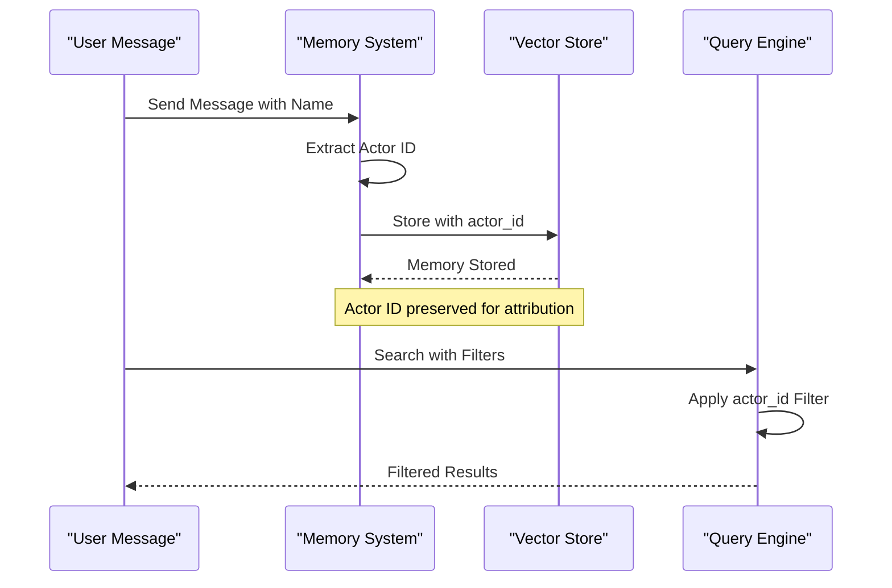
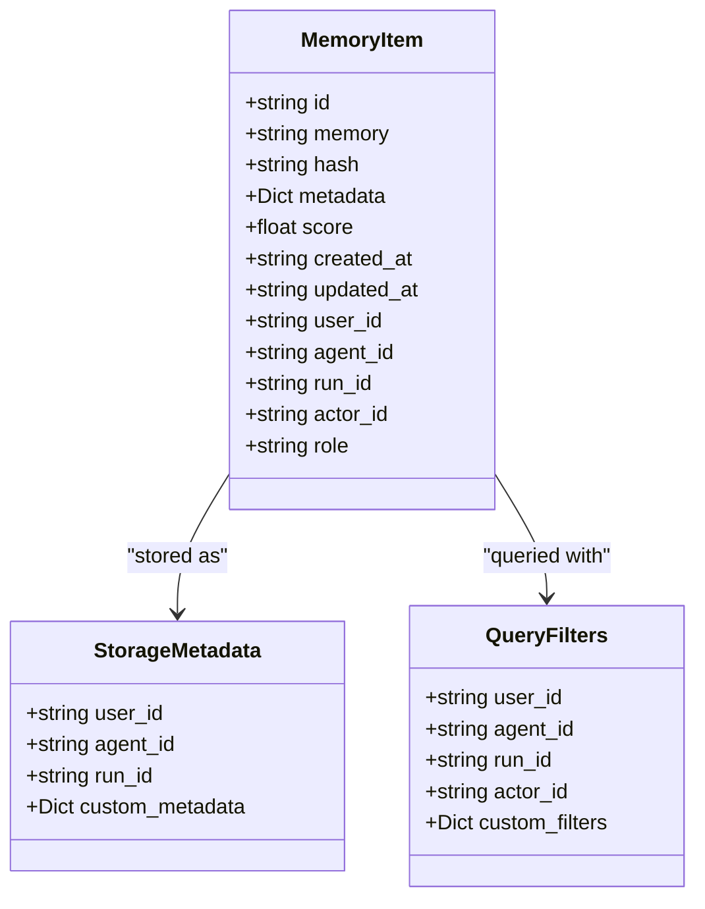
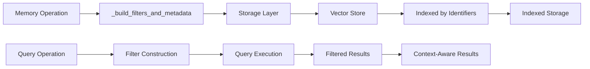
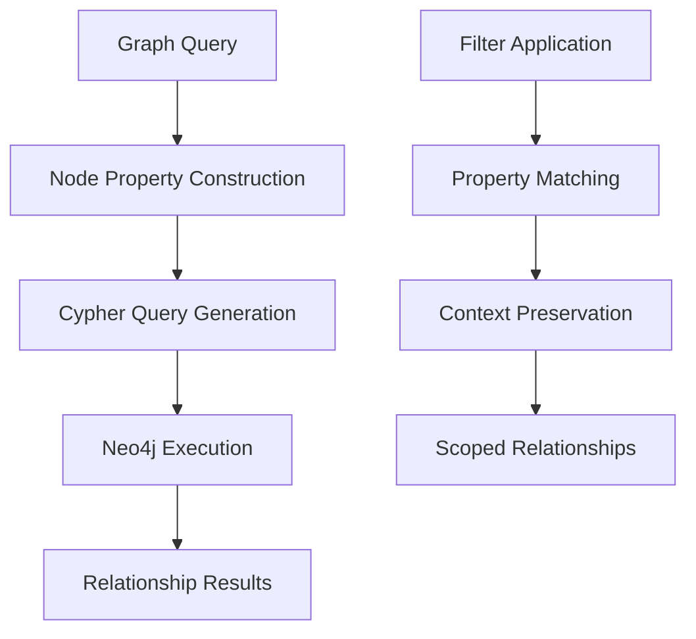
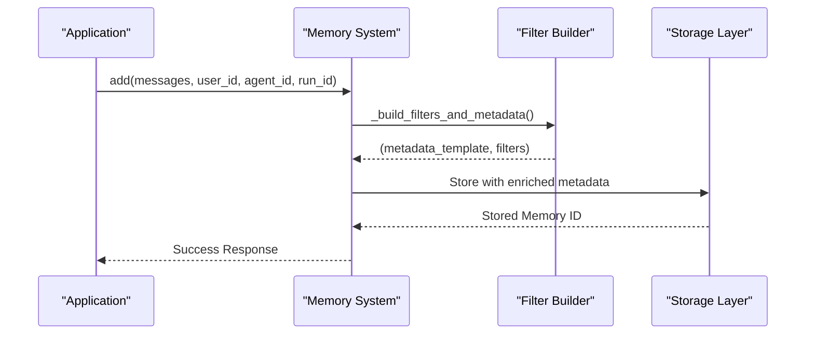
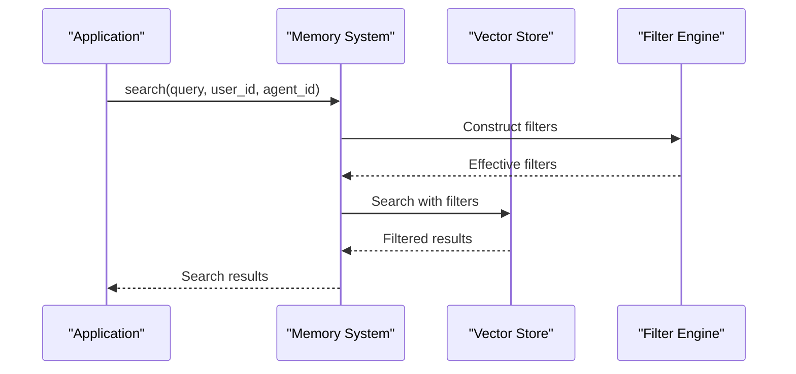
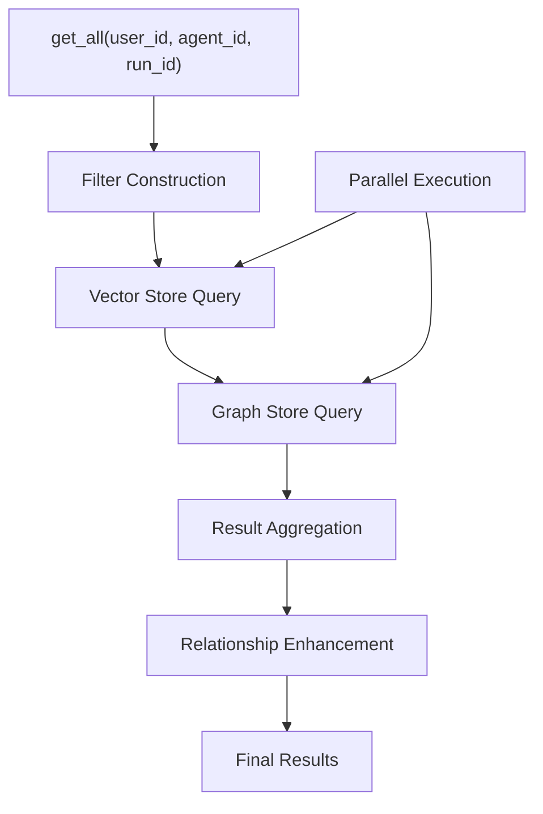

# Relationships

<cite>
**Referenced Files in This Document**
- [main.py](file://mem0/memory/main.py)
- [storage.py](file://mem0/memory/storage.py)
- [base.py](file://mem0/memory/base.py)
- [graph_memory.py](file://mem0/memory/graph_memory.py)
- [base.py](file://mem0/configs/base.py)
- [memory.types.ts](file://mem0-ts/src/oss/src/memory/memory.types.ts)
- [exceptions.py](file://mem0/exceptions.py)
- [multillm_memory.py](file://examples/misc/multillm_memory.py)
- [LLM.md](file://LLM.md)
</cite>

## Table of Contents
1. [Introduction](#introduction)
2. [Core Relationship Model](#core-relationship-model)
3. [Session Identifiers and Scoping](#session-identifiers-and-scoping)
4. [Actor Attribution System](#actor-attribution-system)
5. [Metadata Architecture](#metadata-architecture)
6. [Scoping Mechanism Implementation](#scoping-mechanism-implementation)
7. [Relationship Management Patterns](#relationship-management-patterns)
8. [Practical Usage Examples](#practical-usage-examples)
9. [Common Issues and Solutions](#common-issues-and-solutions)
10. [Best Practices](#best-practices)

## Introduction

The Mem0 system implements a sophisticated relationship model that enables fine-grained memory management through multiple identifier systems. At its core, the system associates MemoryItem objects with users, agents, and sessions through metadata fields, enabling targeted memory operations and scoped searches while maintaining data isolation and contextual relevance.

This relationship architecture serves as the foundation for the system's ability to provide personalized, context-aware memory experiences across different use cases, from individual user interactions to multi-agent collaborative environments.

## Core Relationship Model

The Mem0 system's relationship model is built around four primary identifier types that establish hierarchical relationships between entities:



**Diagram sources**
- [main.py](file://mem0/memory/main.py#L46-L124)
- [base.py](file://mem0/configs/base.py#L16-L26)

Each MemoryItem maintains relationships through these identifiers, which serve different purposes in the memory management hierarchy:

- **user_id**: Establishes ownership and personalization boundaries
- **agent_id**: Enables agent-specific memory contexts
- **run_id**: Provides session-scoped memory isolation
- **actor_id**: Supports message-level attribution and role-based filtering
- **role**: Maintains contextual information about the entity's function

**Section sources**
- [main.py](file://mem0/memory/main.py#L46-L124)
- [base.py](file://mem0/configs/base.py#L16-L26)

## Session Identifiers and Scoping

### The _build_filters_and_metadata Helper

The `_build_filters_and_metadata` function serves as the central mechanism for constructing query filters and storage metadata based on session identifiers. This helper ensures consistent scoping across all memory operations.



**Diagram sources**
- [main.py](file://mem0/memory/main.py#L46-L124)

### Session Identifier Precedence

The system implements a clear precedence hierarchy for session identifiers:

1. **Required Identifiers**: At least one of `user_id`, `agent_id`, or `run_id` must be provided
2. **Optional Actor Filtering**: `actor_id` can be specified for query-time filtering
3. **Metadata Augmentation**: All provided identifiers are added to storage metadata

### Scoping Behavior

Different combinations of session identifiers create distinct scoping behaviors:

| Combination | Scope Level | Use Case |
|-------------|-------------|----------|
| user_id only | Personal | Individual user memories |
| user_id + agent_id | Agent-specific | Agent-user interactions |
| user_id + run_id | Session-based | Single conversation sessions |
| agent_id + run_id | Agent-session | Multi-turn agent conversations |
| All three | Full context | Complete interaction traces |

**Section sources**
- [main.py](file://mem0/memory/main.py#L46-L124)

## Actor Attribution System

### Message-Level Attribution

The actor attribution system enables precise message-level tracking and role-based filtering through the `actor_id` field. This system operates at multiple levels:



**Diagram sources**
- [main.py](file://mem0/memory/main.py#L328-L331)
- [main.py](file://mem0/memory/main.py#L120-L122)

### Role-Based Filtering

The system supports role-based filtering through the `role` field, enabling queries that focus on specific types of interactions:

- **user**: User-initiated messages and actions
- **assistant**: System or agent responses
- **system**: System-generated informational messages
- **tool**: Tool or function invocation results

### Actor Resolution Precedence

The system follows a specific precedence order for actor identification:

1. **Explicit actor_id parameter** takes highest precedence
2. **filters["actor_id"]** is checked next
3. **Message content actor_id** is extracted from message metadata

**Section sources**
- [main.py](file://mem0/memory/main.py#L328-L331)
- [main.py](file://mem0/memory/main.py#L120-L122)

## Metadata Architecture

### MemoryItem Structure

The MemoryItem class defines the core data structure that encapsulates all relationship information:



**Diagram sources**
- [base.py](file://mem0/configs/base.py#L16-L26)
- [main.py](file://mem0/memory/main.py#L46-L124)

### Metadata Promotion

The system automatically promotes relationship fields to the top-level structure for easy access:

| Promoted Field | Source | Purpose |
|----------------|--------|---------|
| user_id | Payload metadata | User identification |
| agent_id | Payload metadata | Agent identification |
| run_id | Payload metadata | Session identification |
| actor_id | Payload metadata | Message attribution |
| role | Payload metadata | Interaction context |

### Custom Metadata Handling

The system preserves custom metadata through the `metadata` field, allowing applications to store additional context-specific information without interfering with relationship management.

**Section sources**
- [base.py](file://mem0/configs/base.py#L16-L26)
- [main.py](file://mem0/memory/main.py#L537-L562)

## Scoping Mechanism Implementation

### Vector Store Integration

The scoping mechanism integrates seamlessly with vector stores through consistent metadata application:



**Diagram sources**
- [main.py](file://mem0/memory/main.py#L245-L250)
- [main.py](file://mem0/memory/main.py#L565-L566)

### Graph Store Integration

For systems with graph storage capabilities, the scoping mechanism extends to relationship queries:



**Diagram sources**
- [graph_memory.py](file://mem0/memory/graph_memory.py#L154-L185)

### Search and Retrieval Optimization

The scoping mechanism optimizes search and retrieval operations by:

1. **Index Utilization**: Leveraging indexed relationship fields for fast lookups
2. **Filter Pruning**: Reducing search space through early filtering
3. **Result Ranking**: Maintaining relevance while preserving context

**Section sources**
- [main.py](file://mem0/memory/main.py#L245-L250)
- [main.py](file://mem0/memory/main.py#L565-L566)
- [graph_memory.py](file://mem0/memory/graph_memory.py#L154-L185)

## Relationship Management Patterns

### Add Operations Pattern

The add operation pattern demonstrates comprehensive relationship management:



**Diagram sources**
- [main.py](file://mem0/memory/main.py#L195-L243)

### Search Operations Pattern

Search operations leverage the relationship model for targeted retrieval:



**Diagram sources**
- [main.py](file://mem0/memory/main.py#L644-L679)

### Get All Operations Pattern

The get all operation pattern showcases comprehensive relationship enumeration:



**Diagram sources**
- [main.py](file://mem0/memory/main.py#L537-L603)

**Section sources**
- [main.py](file://mem0/memory/main.py#L195-L243)
- [main.py](file://mem0/memory/main.py#L644-L679)
- [main.py](file://mem0/memory/main.py#L537-L603)

## Practical Usage Examples

### Individual User Memory Management

Basic user-centric memory operations demonstrate fundamental relationship patterns:

```python
# Adding user-specific memories
memory.add(
    "User prefers dark mode interface",
    user_id="user_123",
    metadata={"preference": "dark_mode", "timestamp": "2024-01-15"}
)

# Retrieving all user memories
user_memories = memory.get_all(user_id="user_123")

# Searching within user context
preferences = memory.search(
    "interface preferences",
    user_id="user_123",
    limit=10
)
```

### Multi-Agent Collaboration

Advanced scenarios showcase agent-specific relationship management:

```python
# Research team collaboration example
research_team = {
    "tech_analyst": {"model": "gpt-4", "role": "Technical Analysis"},
    "writer": {"model": "claude", "role": "Documentation"},
    "data_analyst": {"model": "gpt-4-mini", "role": "Insights"}
}

# Agent-specific memory storage
memory.add(
    "Recommended tech stack: React + Node.js + PostgreSQL",
    user_id="project_abc",
    agent_id="tech_analyst",
    metadata={"analysis_type": "architecture", "confidence": "high"}
)

# Cross-agent knowledge sharing
team_knowledge = memory.search(
    "technical architecture",
    user_id="project_abc",
    agent_id="writer"
)
```

### Session-Based Interactions

Session-scoped relationships enable conversation continuity:

```python
# Session initialization
session_id = f"session_{datetime.now().strftime('%Y%m%d_%H%M%S')}"

# Conversation with session context
memory.add(
    "User asked about account settings",
    user_id="user_456",
    run_id=session_id,
    metadata={"conversation_topic": "account_management"}
)

# Later retrieval within same session
session_memories = memory.get_all(
    user_id="user_456",
    run_id=session_id
)
```

**Section sources**
- [multillm_memory.py](file://examples/misc/multillm_memory.py#L51-L102)
- [LLM.md](file://LLM.md#L911-L957)

## Common Issues and Solutions

### Required Session Identifiers

**Issue**: Missing required session identifiers during memory operations

**Symptoms**:
- `Mem0ValidationError` with error code "VALIDATION_001"
- "At least one of 'user_id', 'agent_id', or 'run_id' must be provided"

**Solution**: Always provide at least one session identifier:

```python
# Correct - provide user_id
memory.add("User preference", user_id="user_123")

# Correct - provide agent_id  
memory.add("Agent response", agent_id="agent_456")

# Correct - provide run_id
memory.search("query", run_id="session_789")
```

### Improper Relationship Management

**Issue**: Inconsistent relationship field usage across operations

**Symptoms**:
- Memory retrieval returns unexpected results
- Search operations miss relevant memories
- Cross-session data leakage

**Solution**: Maintain consistent relationship patterns:

```python
# Consistent pattern: use same identifiers for related operations
user_id = "user_123"
agent_id = "agent_456"

# Add memory with proper context
memory.add("User query", user_id=user_id, agent_id=agent_id)

# Retrieve with same context
results = memory.search("query", user_id=user_id, agent_id=agent_id)
```

### Actor ID Resolution Conflicts

**Issue**: Conflicting actor ID resolution during queries

**Symptoms**:
- Unexpected actor-based filtering results
- Message attribution inconsistencies

**Solution**: Understand actor resolution precedence:

```python
# Highest precedence: explicit actor_id parameter
memory.search("query", actor_id="specific_user")

# Medium precedence: filters dictionary
memory.search("query", filters={"actor_id": "specific_user"})

# Lowest precedence: message content actor_id
# Automatically extracted from message metadata
```

### Metadata Field Conflicts

**Issue**: Custom metadata conflicting with relationship fields

**Symptoms**:
- Relationship fields overwritten by custom metadata
- Query filters behaving unexpectedly

**Solution**: Avoid naming conflicts in custom metadata:

```python
# Avoid using reserved field names
# Wrong - conflicts with relationship fields
metadata = {
    "user_id": "conflicting_value",  # Conflict!
    "agent_id": "another_conflict"   # Conflict!
}

# Correct - use unique custom keys
metadata = {
    "user_preference": "dark_mode",
    "agent_category": "technical"
}
```

**Section sources**
- [main.py](file://mem0/memory/main.py#L111-L117)
- [exceptions.py](file://mem0/exceptions.py#L140-L175)

## Best Practices

### Identifier Naming Conventions

Establish consistent naming patterns for relationship identifiers:

```python
# User identifiers
user_id = f"user_{user_email.replace('@', '_')}"

# Agent identifiers  
agent_id = f"agent_{agent_name}_{version}"

# Session/run identifiers
run_id = f"session_{datetime.now().strftime('%Y%m%d_%H%M%S')}_{session_token}"
```

### Memory Organization Strategies

Organize memories using hierarchical relationship patterns:

```python
# Project-level organization
project_id = "product_x_research"

# Team member contributions
team_members = ["tech_analyst", "writer", "data_analyst"]

for member in team_members:
    memory.add(
        f"Research findings from {member}",
        user_id=project_id,
        agent_id=member,
        metadata={"contributor": member, "timestamp": current_time}
    )
```

### Search Optimization Techniques

Leverage relationship fields for efficient search operations:

```python
# Specific searches using relationship fields
technical_memories = memory.search(
    "technical architecture",
    user_id="project_abc",
    agent_id="tech_analyst",
    limit=5
)

# Broad searches with filtering
recent_memories = memory.get_all(
    user_id="user_123",
    filters={"metadata.timestamp": {"$gte": "2024-01-01"}},
    limit=100
)
```

### Data Isolation Guidelines

Maintain proper data isolation through careful relationship management:

```python
# User isolation
user_memories = memory.get_all(user_id=current_user_id)

# Agent isolation  
agent_responses = memory.get_all(agent_id=current_agent_id)

# Session isolation
session_conversation = memory.get_all(run_id=current_session_id)
```

### Performance Considerations

Optimize relationship-based operations for performance:

1. **Index utilization**: Ensure relationship fields are properly indexed
2. **Filter specificity**: Use the most specific relationship combination
3. **Limit usage**: Apply reasonable limits to prevent excessive data transfer
4. **Batch operations**: Group related operations when possible

**Section sources**
- [LLM.md](file://LLM.md#L911-L957)
- [multillm_memory.py](file://examples/misc/multillm_memory.py#L94-L102)