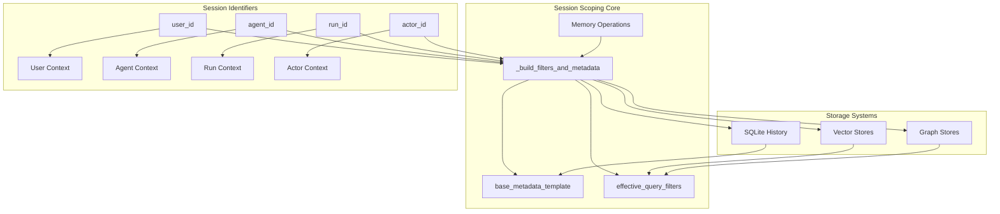
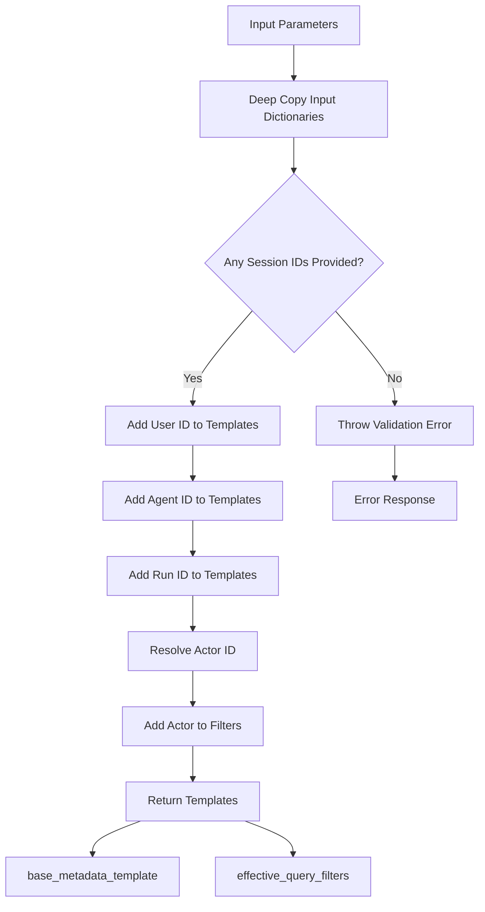
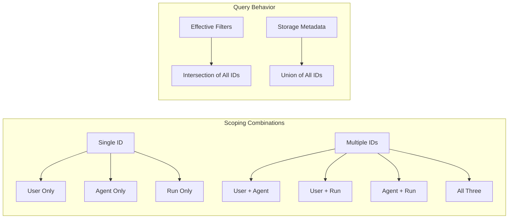
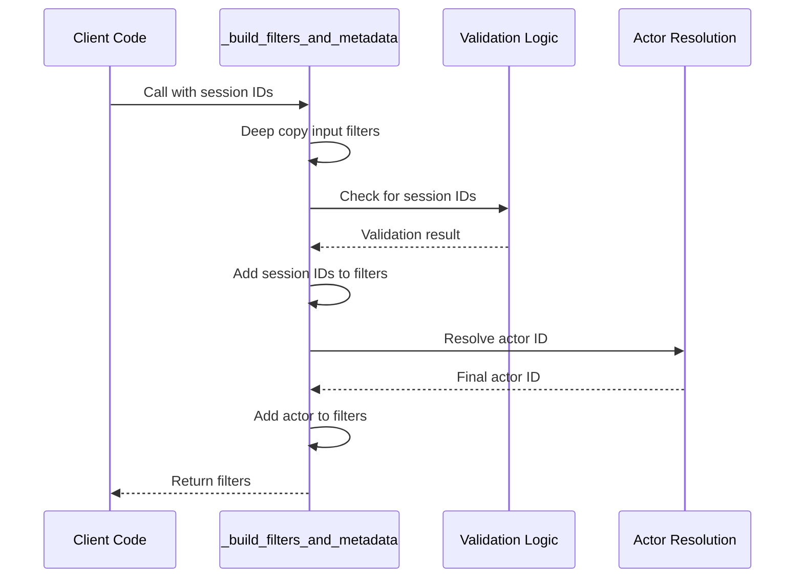
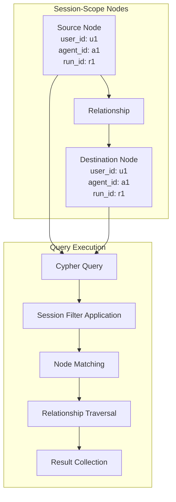

# Session Scoping

<cite>
**Referenced Files in This Document**
- [main.py](file://mem0/memory/main.py)
- [utils.py](file://mem0/memory/utils.py)
- [base.py](file://mem0/memory/base.py)
- [graph_memory.py](file://mem0/memory/graph_memory.py)
- [_build_filters_and_metadata](file://mem0/memory/main.py#L45-L126)
- [process_telemetry_filters](file://mem0/memory/utils.py#L120-L136)
- [test_neo4j_cypher_syntax.py](file://tests/memory/test_neo4j_cypher_syntax.py)
- [chroma.py](file://tests/vector_stores/test_chroma.py)
- [weaviate.py](file://mem0/vector_stores/weaviate.py)
- [index.ts](file://mem0-ts/src/oss/src/memory/index.ts)
</cite>

## Table of Contents
1. [Introduction](#introduction)
2. [Session Scoping Architecture](#session-scoping-architecture)
3. [The _build_filters_and_metadata Helper Function](#the-_build_filters_and_metadata-helper-function)
4. [Hierarchical Scoping Mechanism](#hierarchical-scoping-mechanism)
5. [Storage Metadata Template](#storage-metadata-template)
6. [Query Filters Construction](#query-filters-construction)
7. [Practical Implementation Examples](#practical-implementation-examples)
8. [Vector Store Integration](#vector-store-integration)
9. [Graph Store Integration](#graph-store-integration)
10. [Common Issues and Best Practices](#common-issues-and-best-practices)
11. [Performance Considerations](#performance-considerations)
12. [Troubleshooting Guide](#troubleshooting-guide)

## Introduction

Session scoping in the Mem0 system provides a sophisticated mechanism for organizing and accessing memories based on contextual identifiers. This system enables precise targeting of memory operations by associating memories with specific user sessions, agents, or application runs through four primary session identifiers: `user_id`, `agent_id`, `run_id`, and `actor_id`.

The session scoping architecture ensures that memories are appropriately isolated and retrievable within their intended contexts while maintaining flexibility for cross-context operations. This hierarchical approach enables fine-grained control over memory visibility and accessibility across different application scenarios.

## Session Scoping Architecture

The Mem0 session scoping system operates through a centralized filtering and metadata construction mechanism that supports multiple session identifiers simultaneously. The architecture consists of several key components working together to provide comprehensive session-based memory management.



**Diagram sources**
- [main.py](file://mem0/memory/main.py#L45-L126)
- [graph_memory.py](file://mem0/memory/graph_memory.py#L29-L72)

The architecture ensures that each memory operation receives properly scoped filters and metadata, enabling efficient storage and retrieval while maintaining data isolation across different session contexts.

**Section sources**
- [main.py](file://mem0/memory/main.py#L45-L126)
- [base.py](file://mem0/memory/base.py#L1-L64)

## The _build_filters_and_metadata Helper Function

The `_build_filters_and_metadata` function serves as the cornerstone of Mem0's session scoping implementation. This helper function takes multiple session identifiers and constructs appropriate metadata templates and query filters for memory operations.

### Function Signature and Parameters

The function accepts the following parameters:

| Parameter | Type | Description |
|-----------|------|-------------|
| `user_id` | Optional[str] | User identifier for session scoping |
| `agent_id` | Optional[str] | Agent identifier for session scoping |
| `run_id` | Optional[str] | Run identifier for session scoping |
| `actor_id` | Optional[str] | Explicit actor identifier for query-time filtering |
| `input_metadata` | Optional[Dict[str, Any]] | Base metadata dictionary to augment |
| `input_filters` | Optional[Dict[str, Any]] | Base filters dictionary to augment |

### Core Functionality

The function performs several critical operations:

1. **Deep Copy Initialization**: Creates independent copies of input dictionaries to prevent unintended mutations
2. **Session Identifier Processing**: Adds provided session identifiers to both metadata and filters
3. **Validation**: Ensures at least one session identifier is provided
4. **Actor Resolution**: Handles actor filtering precedence logic
5. **Template Construction**: Builds appropriate metadata and filter structures



**Diagram sources**
- [main.py](file://mem0/memory/main.py#L45-L126)

**Section sources**
- [main.py](file://mem0/memory/main.py#L45-L126)

## Hierarchical Scoping Mechanism

The hierarchical scoping mechanism in Mem0 provides flexible memory organization through multiple levels of context identification. This system supports three primary scoping levels that can be used independently or in combination.

### Scoping Levels

| Level | Identifier | Purpose | Scope |
|-------|------------|---------|-------|
| User Level | `user_id` | Individual user context | Personal conversations, preferences, history |
| Agent Level | `agent_id` | Agent-specific context | Agent capabilities, configurations, training |
| Run Level | `run_id` | Session/application run context | Temporary sessions, batch operations, experiments |
| Actor Level | `actor_id` | Message author/context | Conversation participants, roles, permissions |

### Scoping Precedence and Combination

The system supports flexible combination of scoping identifiers:



**Diagram sources**
- [main.py](file://mem0/memory/main.py#L96-L109)

### Validation and Constraints

The system enforces strict validation to ensure meaningful scoping:

- **Minimum Requirement**: At least one session identifier must be provided
- **Flexibility**: Multiple identifiers can be combined for granular scoping
- **Consistency**: All provided identifiers are applied consistently across storage and querying

**Section sources**
- [main.py](file://mem0/memory/main.py#L111-L117)

## Storage Metadata Template

The storage metadata template (`base_metadata_template`) serves as the foundation for memory persistence, incorporating session identifiers along with any additional metadata provided by the user.

### Template Construction Process

The template construction follows a systematic approach:

1. **Initialization**: Start with deep-copied input metadata
2. **Session Addition**: Add each provided session identifier
3. **Preservation**: Maintain original metadata alongside session identifiers
4. **Structure**: Create a unified metadata structure for storage

### Metadata Structure

The resulting metadata template includes:

```python
{
    "user_id": "user_123",
    "agent_id": "agent_support",
    "run_id": "session_20241201_1430",
    "actor_id": "john_doe",  # Optional
    "custom_key": "custom_value",  # From input_metadata
    "timestamp": "2024-12-01T14:30:00Z",
    "source": "chat_interface"
}
```

### Storage Integration

The metadata template integrates seamlessly with various storage backends:

- **Vector Stores**: Used for semantic search and similarity queries
- **Graph Stores**: Enables relationship-based memory organization
- **History Database**: Maintains temporal ordering and change tracking

**Section sources**
- [main.py](file://mem0/memory/main.py#L90-L91)
- [main.py](file://mem0/memory/main.py#L96-L109)

## Query Filters Construction

The effective query filters (`effective_query_filters`) provide the targeting mechanism for memory retrieval operations, ensuring that queries are scoped appropriately to the desired context.

### Filter Construction Process



**Diagram sources**
- [main.py](file://mem0/memory/main.py#L45-L126)

### Actor Filtering Precedence

The system implements a clear precedence order for actor filtering:

1. **Explicit Parameter**: `actor_id` parameter takes highest precedence
2. **Filter Override**: Existing `actor_id` in filters is preserved
3. **No Actor**: No actor filtering if neither parameter nor filter provides an actor ID

### Filter Application Patterns

Different storage systems apply filters in various ways:

| Storage Type | Filter Application | Example Pattern |
|--------------|-------------------|-----------------|
| Vector Stores | Semantic + Metadata | `{user_id: "u1", agent_id: "a1"}` |
| Graph Stores | Node Properties | `MATCH (n:user_id:$user_id)` |
| SQL Databases | WHERE Clauses | `WHERE user_id = ? AND agent_id = ?` |

**Section sources**
- [main.py](file://mem0/memory/main.py#L119-L123)
- [utils.py](file://mem0/memory/utils.py#L120-L136)

## Practical Implementation Examples

### Basic Memory Operations with Session Scoping

#### Adding Memories with User Context

```python
# Basic user-scoped memory addition
memory.add(
    "User reported login issues with 2FA",
    user_id="user_12345",
    metadata={"category": "technical", "priority": "high"}
)
```

#### Multi-Level Scoping for Agent Sessions

```python
# Agent-specific memory with run context
memory.add(
    "Implemented rate limiting for API endpoint",
    user_id="user_12345",
    agent_id="agent_api_v2",
    run_id="batch_process_20241201",
    metadata={"operation": "rate_limiting", "impact": "moderate"}
)
```

#### Actor-Based Filtering in Queries

```python
# Search with actor filtering
results = memory.search(
    "security concerns",
    user_id="user_12345",
    actor_id="security_team",
    limit=10
)
```

### Advanced Scoping Patterns

#### Hierarchical Memory Retrieval

```python
# Get all memories for a user
user_memories = memory.get_all(user_id="user_12345")

# Get memories for specific agent run
agent_run_memories = memory.get_all(
    user_id="user_12345",
    agent_id="agent_support",
    run_id="session_20241201_1430"
)
```

#### Cross-Context Search Operations

```python
# Search across multiple contexts
cross_context_results = memory.search(
    "account recovery",
    filters={
        "metadata.category": "support",
        "metadata.priority": {"$in": ["high", "critical"]}
    }
)
```

### Real-World Usage Patterns

#### Customer Support Scenario

```python
# Create support session
session_id = f"support_session_{uuid.uuid4()}"

# Add conversation memories
memory.add(
    "Customer reported account locked due to failed login attempts",
    user_id=customer_id,
    agent_id="support_agent_001",
    run_id=session_id,
    metadata={"ticket_id": ticket_number, "severity": "medium"}
)

# Search relevant memories for response
relevant_memories = memory.search(
    "account lockout",
    user_id=customer_id,
    agent_id="support_agent_001",
    limit=5
)
```

#### Multi-Agent Collaboration

```python
# Agent collaboration session
collaboration_run = f"collab_{datetime.now().strftime('%Y%m%d_%H%M%S')}"

# Agent 1 adds operational memory
memory.add(
    "System monitoring detected unusual traffic patterns",
    user_id="admin_001",
    agent_id="monitoring_agent",
    run_id=collaboration_run,
    metadata={"alert_level": "warning", "source": "network_monitor"}
)

# Agent 2 adds analysis memory
memory.add(
    "Traffic analysis suggests potential DDoS attack",
    user_id="admin_001",
    agent_id="analysis_agent",
    run_id=collaboration_run,
    metadata={"confidence": "high", "threat_level": "critical"}
)
```

**Section sources**
- [main.py](file://mem0/memory/main.py#L195-L250)
- [LLM.md](file://LLM.md#L911-L957)

## Vector Store Integration

The session scoping system integrates seamlessly with various vector store implementations, each applying session filters according to their specific query mechanisms.

### ChromaDB Integration

ChromaDB applies session filters using MongoDB-style query syntax:

```python
# Filter structure for ChromaDB
filters = {
    "$and": [
        {"user_id": "user_123"},
        {"agent_id": "agent_support"},
        {"run_id": "session_20241201"}
    ]
}
```

### Weaviate Integration

Weaviate uses GraphQL-like filtering with property equality:

```python
# Filter structure for Weaviate
filter_conditions = [
    Filter.by_property("user_id").equal("user_123"),
    Filter.by_property("agent_id").equal("agent_support"),
    Filter.by_property("run_id").equal("session_20241201")
]
```

### Generic Vector Store Pattern

Most vector stores follow a common pattern:


**Diagram sources**
- [chroma.py](file://tests/vector_stores/test_chroma.py#L51-L68)
- [weaviate.py](file://mem0/vector_stores/weaviate.py#L192-L223)

### Filter Application Examples

#### Single Filter Application

```python
# User-specific search
results = vector_store.search(
    query="password reset",
    vectors=embeddings,
    filters={"user_id": "user_12345"},
    limit=10
)
```

#### Multi-Filter Application

```python
# Comprehensive session search
results = vector_store.search(
    query="technical support",
    vectors=embeddings,
    filters={
        "user_id": "user_12345",
        "agent_id": "agent_support",
        "run_id": "session_20241201_1430"
    },
    limit=20
)
```

**Section sources**
- [chroma.py](file://tests/vector_stores/test_chroma.py#L51-L68)
- [weaviate.py](file://mem0/vector_stores/weaviate.py#L192-L223)

## Graph Store Integration

The graph store implementation extends session scoping to relationship-based memory organization, enabling sophisticated entity and relationship queries within session contexts.

### Cypher Query Construction

Graph stores construct Cypher queries that incorporate session filters:

```cypher
MATCH (n:`__Entity__` {user_id: $user_id, agent_id: $agent_id, run_id: $run_id})-[r]->(m:`__Entity__` {user_id: $user_id, agent_id: $agent_id, run_id: $run_id})
RETURN n.name AS source, type(r) AS relationship, m.name AS target
LIMIT $limit
```

### Entity Relationship Scoping

The graph store applies session filters to both source and destination nodes:



**Diagram sources**
- [graph_memory.py](file://mem0/memory/graph_memory.py#L165-L172)

### Graph Search Operations

Graph stores support both semantic and relationship-based searches:

#### Semantic Search with Graph Context

```python
# Combined semantic and graph search
results = graph_memory.search(
    query="customer service issues",
    filters={
        "user_id": "user_12345",
        "agent_id": "support_agent",
        "run_id": "session_20241201"
    },
    limit=50
)
```

#### Relationship-Based Retrieval

```python
# Get all relationships for a session
relationships = graph_memory.get_all(
    filters={
        "user_id": "user_12345",
        "agent_id": "agent_support"
    },
    limit=100
)
```

### Graph Store Filter Patterns

The graph store implements consistent filter application patterns:

| Filter Type | Application Method | Example |
|-------------|-------------------|---------|
| User Filter | Node property constraint | `user_id: $user_id` |
| Agent Filter | Node property constraint | `agent_id: $agent_id` |
| Run Filter | Node property constraint | `run_id: $run_id` |
| Composite | Multiple property constraints | All three together |

**Section sources**
- [graph_memory.py](file://mem0/memory/graph_memory.py#L131-L193)
- [test_neo4j_cypher_syntax.py](file://tests/memory/test_neo4j_cypher_syntax.py#L111-L261)

## Common Issues and Best Practices

### Required Session Identifiers

#### Validation Errors

The most common issue occurs when attempting memory operations without providing any session identifiers:

```python
# ❌ Incorrect - No session identifiers
memory.add("Simple statement")  # Raises validation error

# ✅ Correct - Provide at least one identifier
memory.add("Simple statement", user_id="user_123")
```

#### Error Handling Strategies

```python
try:
    memory.add(
        "Memory content",
        user_id=user_id,
        agent_id=agent_id,
        run_id=run_id
    )
except Mem0ValidationError as e:
    if e.error_code == "VALIDATION_001":
        logger.error("Missing required session identifiers")
        # Implement fallback or error recovery
```

### Proper Scoping Hierarchy

#### Identifier Selection Guidelines

Choose appropriate identifiers based on use case:

| Use Case | Recommended Identifiers | Rationale |
|----------|------------------------|-----------|
| Personal Chat | `user_id` | Individual user context |
| Multi-Agent System | `user_id` + `agent_id` | Agent-specific user interactions |
| Batch Processing | `user_id` + `run_id` | Operation-wide context |
| Collaborative Work | `user_id` + `agent_id` + `run_id` | Complete collaboration context |

#### Identifier Naming Conventions

```python
# Good: Descriptive and consistent
user_id = f"user_{user_email.replace('@', '_')}"
agent_id = f"agent_{agent_name}_{version}"
run_id = f"session_{datetime.now().strftime('%Y%m%d_%H%M%S')}"

# Avoid: Too generic or inconsistent
user_id = "user123"  # Not descriptive
agent_id = "agent"  # Too generic
run_id = "run"  # Not unique
```

### Best Practices for Session-Based Relationships

#### Memory Organization

```python
# ✅ Good: Structured memory organization
memory.add(
    "User preference for dark mode",
    user_id=user_id,
    metadata={
        "category": "preference",
        "scope": "interface",
        "timestamp": datetime.now().isoformat()
    }
)

# ❌ Avoid: Unclear scoping
memory.add("Dark mode preference")
```

#### Search Optimization

```python
# ✅ Good: Targeted searches
results = memory.search(
    "dark mode settings",
    user_id=user_id,
    agent_id=agent_id,
    limit=5
)

# ❌ Avoid: Broad searches without context
results = memory.search("settings")
```

#### Memory Lifecycle Management

```python
# Clean up session memories when appropriate
memory.delete_all(
    user_id=user_id,
    agent_id=agent_id,
    run_id=run_id
)
```

### Performance Considerations

#### Filter Efficiency

- **Index Utilization**: Ensure session identifiers are indexed in vector stores
- **Filter Complexity**: Minimize the number of session identifiers when possible
- **Query Optimization**: Use specific filters rather than broad searches

#### Memory Management

- **Scope Appropriateness**: Match scoping granularity to use case requirements
- **Cleanup Procedures**: Implement proper cleanup for temporary session data
- **Resource Monitoring**: Monitor memory usage across different session scopes

**Section sources**
- [main.py](file://mem0/memory/main.py#L111-L117)
- [LLM.md](file://LLM.md#L911-L957)

## Performance Considerations

### Filter Performance Impact

Session filters significantly impact query performance across different storage systems:

#### Vector Store Performance

- **Index Efficiency**: Proper indexing of session identifiers improves search speed
- **Filter Cardinality**: Lower cardinality filters (fewer unique values) perform better
- **Composite Filters**: Multiple session identifiers increase query complexity

#### Graph Store Performance

- **Node Traversal**: Session filters reduce the graph traversal scope
- **Relationship Density**: Higher relationship density benefits from proper scoping
- **Query Complexity**: Complex Cypher queries with multiple session filters may impact performance

### Optimization Strategies

#### Filter Design

```python
# Optimal: Minimal necessary filters
results = vector_store.search(
    query="content",
    vectors=embeddings,
    filters={"user_id": "user_123"},  # Single filter
    limit=10
)

# Less optimal: Excessive filters
results = vector_store.search(
    query="content",
    vectors=embeddings,
    filters={
        "user_id": "user_123",
        "agent_id": "agent_1",
        "run_id": "run_1",
        "actor_id": "actor_1"  # Often unnecessary
    },
    limit=10
)
```

#### Storage Backend Considerations

| Storage Type | Performance Characteristics | Optimization Tips |
|--------------|---------------------------|-------------------|
| ChromaDB | MongoDB-style indexing | Use compound indexes for common filter combinations |
| Weaviate | GraphQL-like queries | Leverage built-in vector indexing |
| Pinecone | Cloud-native vector store | Optimize namespace usage |
| FAISS | Local vector search | Consider batch operations for bulk processing |

### Monitoring and Metrics

#### Key Performance Indicators

- **Query Latency**: Time taken for memory operations
- **Filter Efficiency**: Percentage of relevant results returned
- **Storage Growth**: Memory usage patterns across different scopes
- **Cache Hit Rate**: Effectiveness of caching strategies

#### Performance Monitoring

```python
# Performance monitoring example
import time

def timed_memory_operation(operation_func, *args, **kwargs):
    start_time = time.time()
    result = operation_func(*args, **kwargs)
    end_time = time.time()
    
    logger.info(f"Operation took {end_time - start_time:.2f} seconds")
    return result
```

## Troubleshooting Guide

### Common Error Scenarios

#### Validation Errors

**Problem**: `Mem0ValidationError: At least one of 'user_id', 'agent_id', or 'run_id' must be provided`

**Solution**: Ensure at least one session identifier is provided in all memory operations.

```python
# Fix validation errors
memory.add("Content", user_id="user_123")  # Required
memory.search("Query", user_id="user_123")  # Required
memory.get_all(user_id="user_123")  # Required
```

#### Filter Compatibility Issues

**Problem**: Filters not working as expected in vector stores

**Diagnosis Steps**:
1. Verify filter structure matches vector store requirements
2. Check for proper escaping of special characters
3. Ensure session identifiers are properly indexed

**Solution**: Review vector store documentation for filter syntax requirements.

#### Graph Store Cypher Errors

**Problem**: Cypher syntax errors in graph operations

**Common Causes**:
- Improper node label specification
- Missing parameter bindings
- Invalid property name references

**Debugging Approach**:
```python
# Enable query logging for debugging
import logging
logging.getLogger('neo4j').setLevel(logging.DEBUG)

# Test Cypher query construction
params = {"user_id": "user_123", "limit": 10}
query = "MATCH (n {user_id: $user_id}) RETURN n LIMIT $limit"
result = graph.query(query, params=params)
```

### Debugging Tools and Techniques

#### Filter Inspection

```python
# Debug filter construction
def debug_filters(user_id=None, agent_id=None, run_id=None):
    filters, metadata = _build_filters_and_metadata(
        user_id=user_id,
        agent_id=agent_id,
        run_id=run_id
    )
    print(f"Filters: {filters}")
    print(f"Metadata: {metadata}")
    return filters, metadata
```

#### Storage Backend Verification

```python
# Verify vector store filter application
def test_vector_store_filter(vector_store, query, filters):
    print(f"Testing filters: {filters}")
    results = vector_store.search(
        query=query,
        vectors=[0.1, 0.2, 0.3],  # Example embedding
        filters=filters,
        limit=5
    )
    print(f"Results count: {len(results)}")
    return results
```

### Performance Troubleshooting

#### Slow Query Diagnosis

1. **Enable Query Logging**: Monitor query execution times
2. **Analyze Filter Complexity**: Simplify complex filter combinations
3. **Check Index Usage**: Verify proper indexing of session identifiers
4. **Review Memory Patterns**: Identify inefficient memory access patterns

#### Memory Usage Optimization

```python
# Monitor memory usage patterns
def analyze_memory_usage(memory, user_id):
    total_memories = memory.get_all(user_id=user_id)
    print(f"Total memories for user: {len(total_memories)}")
    
    # Analyze memory distribution
    categories = {}
    for mem in total_memories:
        cat = mem.get('metadata', {}).get('category', 'uncategorized')
        categories[cat] = categories.get(cat, 0) + 1
    
    print(f"Category distribution: {categories}")
```

### Recovery Procedures

#### Corrupted Session Data

**Symptoms**: Inconsistent results, missing memories, or query failures

**Recovery Steps**:
1. **Backup Current State**: Export existing session data
2. **Clear Problematic Sessions**: Remove corrupted session data
3. **Rebuild Indexes**: Rebuild vector store indexes
4. **Verify Integrity**: Test with known good data

#### Migration Issues

**Scenario**: Upgrading Mem0 with existing session data

**Migration Strategy**:
1. **Export Existing Data**: Backup all session memories
2. **Validate Schema Changes**: Ensure compatibility with new version
3. **Test Migration**: Perform migration in staging environment
4. **Monitor Post-Migration**: Verify data integrity and performance

**Section sources**
- [main.py](file://mem0/memory/main.py#L111-L117)
- [utils.py](file://mem0/memory/utils.py#L120-L136)