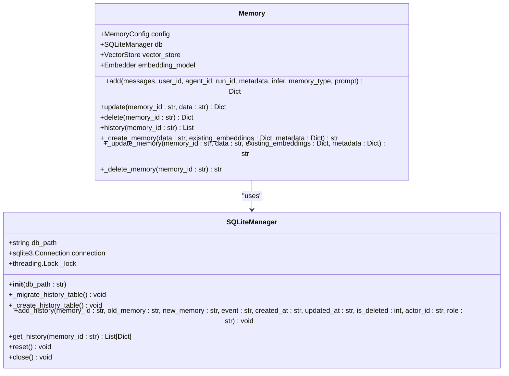
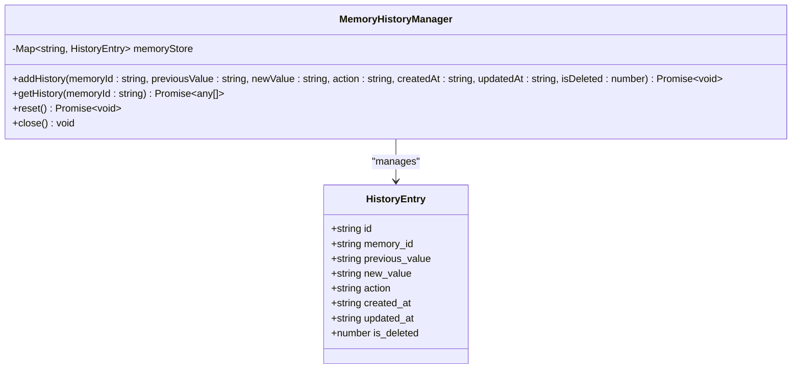
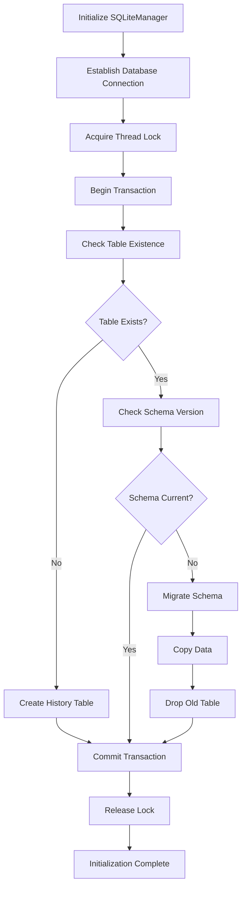
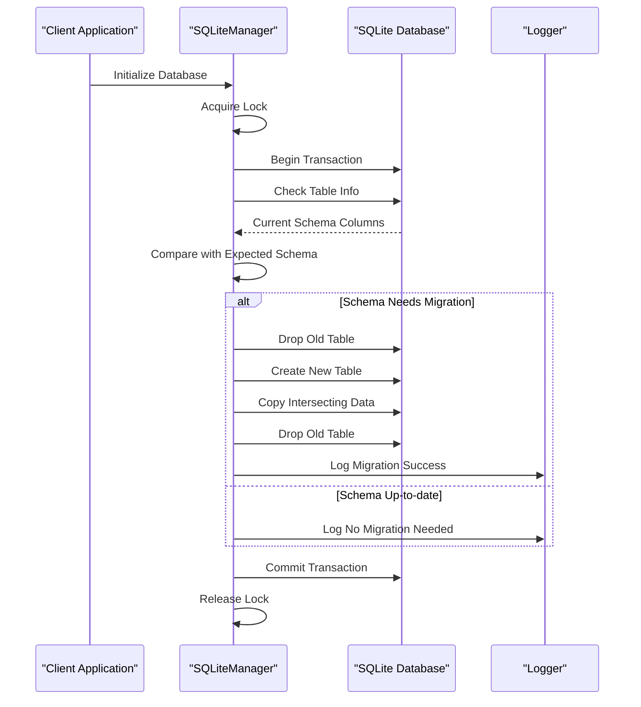
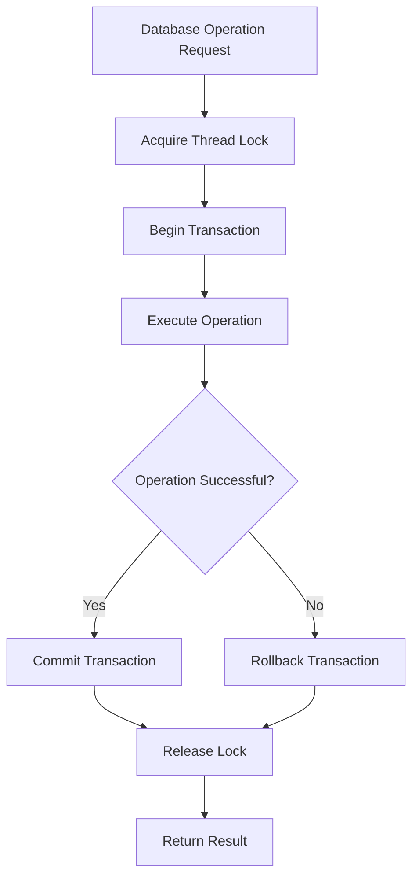
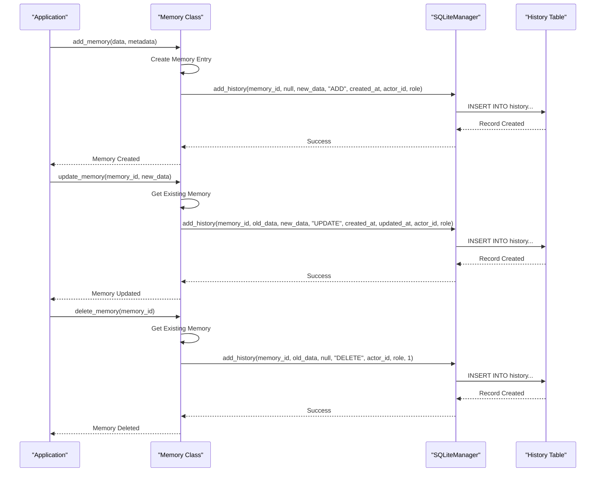
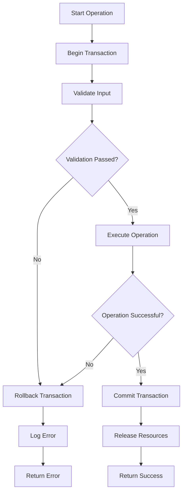

# SQLite History Storage

<cite>
**Referenced Files in This Document**
- [storage.py](file://mem0/memory/storage.py)
- [main.py](file://mem0/memory/main.py)
- [test_storage.py](file://tests/memory/test_storage.py)
- [SQLiteManager.ts](file://mem0-ts/src/oss/src/storage/SQLiteManager.ts)
- [MemoryHistoryManager.ts](file://mem0-ts/src/oss/src/storage/MemoryHistoryManager.ts)
- [base.ts](file://mem0-ts/src/oss/src/storage/base.ts)
- [factory.py](file://mem0/utils/factory.py)
</cite>

## Table of Contents
1. [Introduction](#introduction)
2. [Database Schema Design](#database-schema-design)
3. [Core Components](#core-components)
4. [Database Initialization](#database-initialization)
5. [Schema Evolution and Migration](#schema-evolution-and-migration)
6. [Thread-Safe Access Patterns](#thread-safe-access-patterns)
7. [CRUD Operations and History Tracking](#crud-operations-and-history-tracking)
8. [Transaction Management](#transaction-management)
9. [Performance Considerations](#performance-considerations)
10. [Troubleshooting Guide](#troubleshooting-guide)
11. [Best Practices](#best-practices)

## Introduction

The SQLite history storage system in Mem0 provides comprehensive audit and rollback capabilities for memory management operations. This system automatically tracks all changes to memories through a dedicated `history` table, enabling administrators to monitor modifications, implement rollback functionality, and maintain compliance with audit requirements.

The history storage system serves as a critical component for maintaining data integrity and providing transparency into memory lifecycle events. It captures every addition, modification, and deletion operation performed on memories, storing detailed information about who made changes, when they occurred, and what the previous state was.

## Database Schema Design

### History Table Schema

The `history` table follows a structured schema designed to capture comprehensive change information:

| Field Name | Data Type | Constraints | Purpose |
|------------|-----------|-------------|---------|
| `id` | TEXT | PRIMARY KEY | Unique identifier for each history record |
| `memory_id` | TEXT | NULLABLE | Reference to the associated memory |
| `old_memory` | TEXT | NULLABLE | Previous content/state of the memory |
| `new_memory` | TEXT | NULLABLE | Updated content/state of the memory |
| `event` | TEXT | NOT NULL | Type of operation (ADD, UPDATE, DELETE) |
| `created_at` | DATETIME | NULLABLE | Timestamp when the record was created |
| `updated_at` | DATETIME | NULLABLE | Timestamp when the record was last updated |
| `is_deleted` | INTEGER | DEFAULT 0 | Soft deletion flag (1 = deleted, 0 = active) |
| `actor_id` | TEXT | NULLABLE | Identifier of the user/agent performing the operation |
| `role` | TEXT | NULLABLE | Role of the actor (user, assistant, system) |

### Schema Evolution

The system supports schema evolution through automatic migration mechanisms. The initial schema focused on conversation tracking, but evolved to support broader memory management operations while maintaining backward compatibility.

**Section sources**
- [storage.py](file://mem0/memory/storage.py#L66-L77)
- [test_storage.py](file://tests/memory/test_storage.py#L76-L86)

## Core Components

### SQLiteManager Class

The `SQLiteManager` class serves as the primary interface for history storage operations, providing thread-safe access to the SQLite database through connection pooling and locking mechanisms.

**Diagram sources**
- [storage.py](file://mem0/memory/storage.py#L10-L219)
- [main.py](file://mem0/memory/main.py#L131-L1911)

### MemoryHistoryManager (TypeScript)

The TypeScript implementation provides an alternative in-memory history management solution for environments where persistent storage isn't required.

**Diagram sources**
- [MemoryHistoryManager.ts](file://mem0-ts/src/oss/src/storage/MemoryHistoryManager.ts#L1-L58)

**Section sources**
- [storage.py](file://mem0/memory/storage.py#L10-L219)
- [MemoryHistoryManager.ts](file://mem0-ts/src/oss/src/storage/MemoryHistoryManager.ts#L1-L58)

## Database Initialization

### Connection Setup

The database initialization process establishes a robust foundation for history tracking through several key steps:

**Diagram sources**
- [storage.py](file://mem0/memory/storage.py#L101-L124)

### Initialization Process Details

The initialization process involves several critical phases:

1. **Connection Establishment**: Creates a SQLite connection with `check_same_thread=False` to support multi-threaded access
2. **Lock Acquisition**: Uses `threading.Lock()` to prevent concurrent initialization conflicts
3. **Transaction Management**: Wraps initialization in transactions for atomicity
4. **Schema Validation**: Checks existing schema versions and applies migrations as needed
5. **Index Creation**: Establishes appropriate indexes for query performance

**Section sources**
- [storage.py](file://mem0/memory/storage.py#L10-L17)

## Schema Evolution and Migration

### Migration Strategy

The system implements a sophisticated migration strategy to handle schema evolution while preserving existing data:

**Diagram sources**
- [storage.py](file://mem0/memory/storage.py#L18-L98)

### Migration Implementation

The migration process handles several scenarios:

- **Legacy Schema Detection**: Identifies tables with older column sets
- **Data Preservation**: Copies only intersecting columns to maintain compatibility
- **Atomic Operations**: Ensures migration completes successfully or rolls back entirely
- **Logging and Monitoring**: Provides detailed logs for debugging and monitoring

**Section sources**
- [storage.py](file://mem0/memory/storage.py#L18-L98)

## Thread-Safe Access Patterns

### Connection Locking Mechanism

The system implements comprehensive thread safety through multiple layers of protection:

**Diagram sources**
- [storage.py](file://mem0/memory/storage.py#L139-L167)

### Lock Implementation Details

The locking mechanism provides several benefits:

1. **Concurrency Control**: Prevents simultaneous write operations
2. **Deadlock Prevention**: Uses consistent lock ordering
3. **Resource Management**: Ensures proper cleanup of database resources
4. **Exception Safety**: Guarantees locks are released even during errors

**Section sources**
- [storage.py](file://mem0/memory/storage.py#L139-L167)

## CRUD Operations and History Tracking

### Automatic History Generation

Every memory operation automatically generates corresponding history records, providing comprehensive audit trails:

**Diagram sources**
- [main.py](file://mem0/memory/main.py#L858-L977)

### History Record Structure

Each history record captures essential information for audit and rollback purposes:

| Operation Type | Old Memory Content | New Memory Content | Event Type |
|----------------|-------------------|-------------------|------------|
| ADD | NULL | New Content | "ADD" |
| UPDATE | Previous Content | Updated Content | "UPDATE" |
| DELETE | Existing Content | NULL | "DELETE" |

**Section sources**
- [main.py](file://mem0/memory/main.py#L858-L977)

## Transaction Management

### ACID Compliance

The system ensures ACID properties through careful transaction management:

**Diagram sources**
- [storage.py](file://mem0/memory/storage.py#L139-L167)

### Error Handling and Recovery

The transaction management system provides robust error handling:

1. **Automatic Rollback**: Exceptions trigger immediate transaction rollback
2. **Resource Cleanup**: Ensures database connections are properly closed
3. **Error Logging**: Comprehensive logging for debugging and monitoring
4. **State Consistency**: Maintains database integrity during failures

**Section sources**
- [storage.py](file://mem0/memory/storage.py#L139-L167)

## Performance Considerations

### Query Optimization

The history storage system implements several performance optimization strategies:

- **Index Strategy**: Creates appropriate indexes on frequently queried columns
- **Batch Operations**: Supports efficient bulk insert operations
- **Connection Pooling**: Reuses database connections to reduce overhead
- **Lazy Loading**: Loads history records on-demand rather than pre-loading

### Scalability Factors

Key factors affecting performance at scale:

- **History Retention**: Long-term retention increases storage requirements
- **Query Patterns**: Frequent historical queries may impact performance
- **Concurrent Access**: High concurrency levels require careful lock management
- **Storage Medium**: SSD vs. HDD performance differences

## Troubleshooting Guide

### Common Issues and Solutions

#### Database Connection Problems

**Issue**: Connection timeouts or lock contention
**Solution**: 
- Verify database file permissions
- Check available disk space
- Monitor concurrent access patterns
- Adjust timeout settings appropriately

#### Migration Failures

**Issue**: Schema migration fails or corrupts data
**Solution**:
- Backup database before migration
- Check for incompatible data types
- Verify sufficient privileges for table operations
- Review migration logs for specific errors

#### Performance Degradation

**Issue**: Slow history queries or high resource usage
**Solution**:
- Analyze query patterns and add appropriate indexes
- Consider history retention policies
- Monitor concurrent operations
- Evaluate hardware resources

**Section sources**
- [storage.py](file://mem0/memory/storage.py#L94-L98)

## Best Practices

### Database Maintenance

1. **Regular Backups**: Implement automated backup procedures for production databases
2. **Retention Policies**: Define and enforce history retention periods
3. **Monitoring**: Set up monitoring for database health and performance
4. **Testing**: Regularly test migration and recovery procedures

### Security Considerations

1. **Access Control**: Restrict database file access to authorized processes
2. **Encryption**: Consider encrypting sensitive history data
3. **Audit Logging**: Maintain separate audit logs for database operations
4. **Network Security**: Secure database connections in distributed environments

### Development Guidelines

1. **Testing**: Thoroughly test history operations in development environments
2. **Documentation**: Maintain clear documentation of schema changes
3. **Version Control**: Track database schema changes through version control
4. **Staging**: Test migrations in staging environments before production deployment