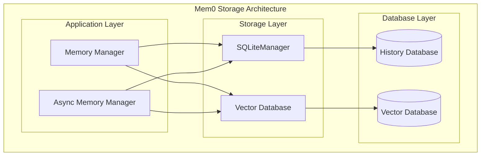
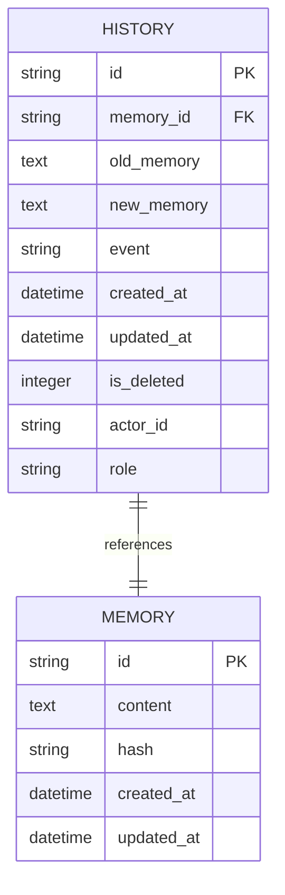
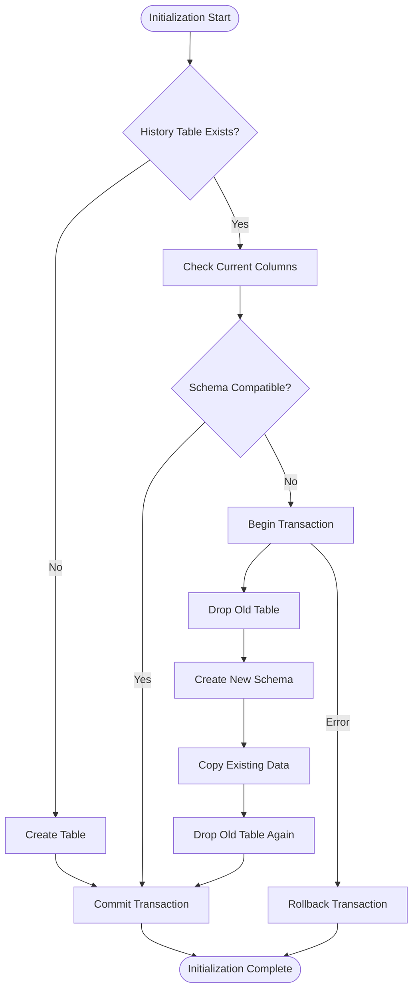
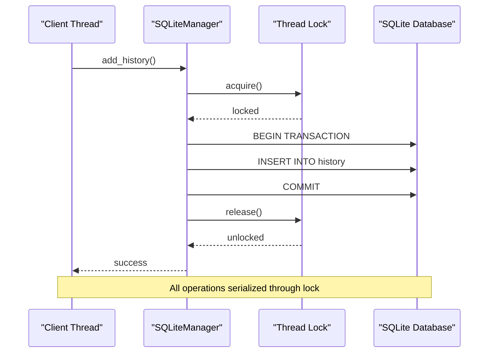
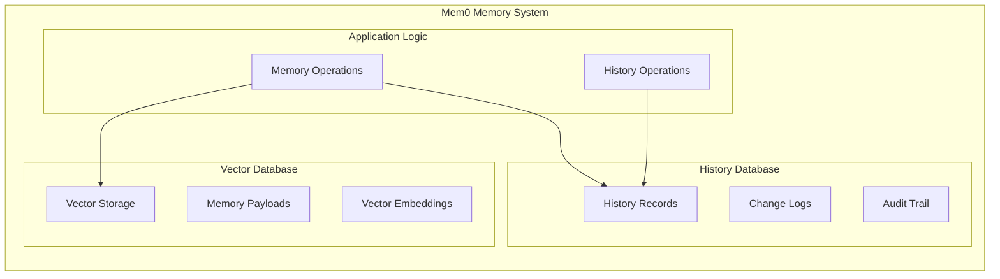
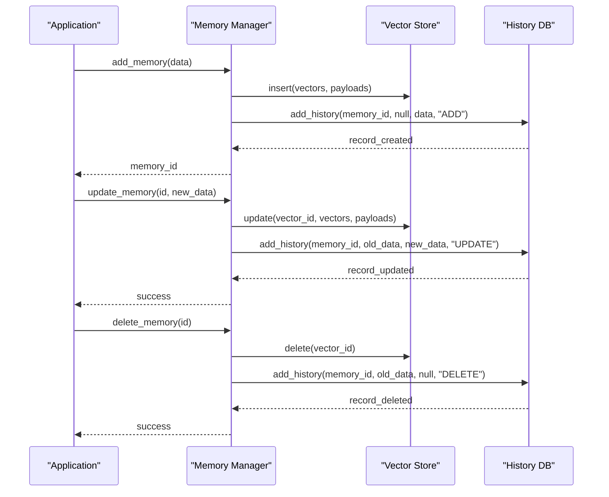
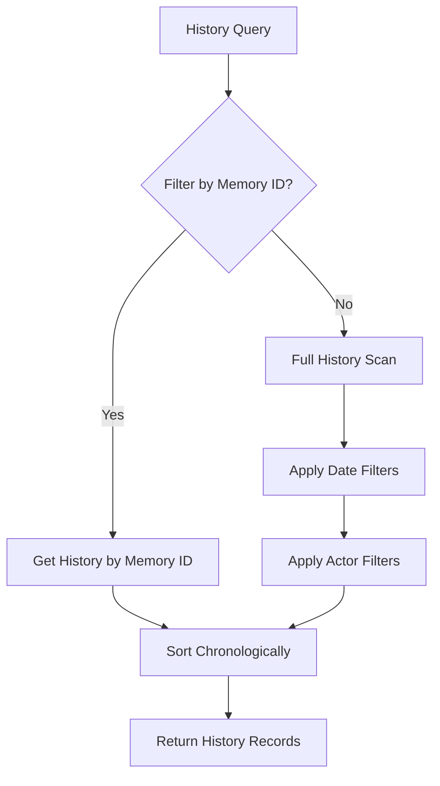
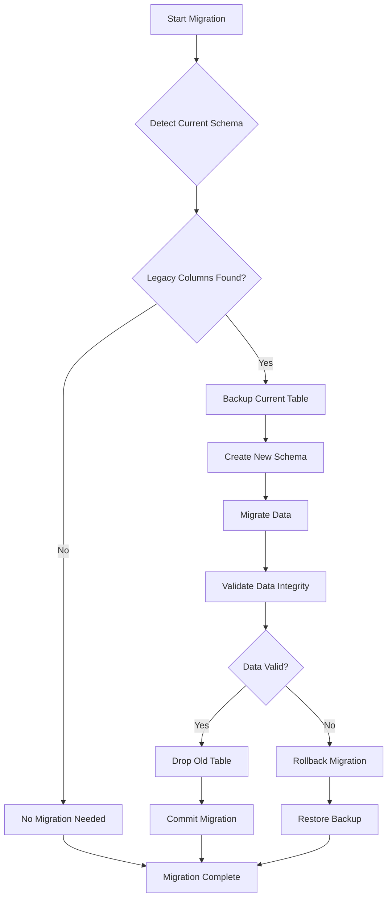

# Storage Schema

<cite>
**Referenced Files in This Document**
- [storage.py](file://mem0/memory/storage.py)
- [main.py](file://mem0/memory/main.py)
- [test_storage.py](file://tests/memory/test_storage.py)
- [SQLiteManager.ts](file://mem0-ts/src/oss/src/storage/SQLiteManager.ts)
- [base.ts](file://mem0-ts/src/oss/src/storage/base.ts)
- [MemoryHistoryManager.ts](file://mem0-ts/src/oss/src/storage/MemoryHistoryManager.ts)
- [DummyHistoryManager.ts](file://mem0-ts/src/oss/src/storage/DummyHistoryManager.ts)
- [pgvector.py](file://mem0/vector_stores/pgvector.py)
- [qdrant.py](file://mem0/vector_stores/qdrant.py)
- [pinecone.py](file://mem0/vector_stores/pinecone.py)
- [chroma.py](file://mem0/vector_stores/chroma.py)
</cite>

## Table of Contents
1. [Introduction](#introduction)
2. [SQLite History Storage Architecture](#sqlite-history-storage-architecture)
3. [History Table Schema](#history-table-schema)
4. [Database Initialization and Migration](#database-initialization-and-migration)
5. [Thread-Safe Access Patterns](#thread-safe-access-patterns)
6. [Integration with Vector Databases](#integration-with-vector-databases)
7. [CRUD Operations and History Records](#crud-operations-and-history-records)
8. [Schema Consistency Management](#schema-consistency-management)
9. [Performance Considerations](#performance-considerations)
10. [Troubleshooting Guide](#troubleshooting-guide)

## Introduction

Mem0 implements a dual-layer storage architecture that separates memory content from its change history. The system uses SQLite for persistent history storage while integrating with various vector databases (Qdrant, Chroma, Pinecone, etc.) for primary memory vector storage and payloads. This separation enables efficient memory operations while maintaining comprehensive audit trails of all memory modifications.

The storage architecture consists of:
- **SQLite History Storage**: Persistent storage for memory change logs
- **Vector Database Integration**: Primary storage for memory vectors and payloads
- **Thread-Safe Access Patterns**: Concurrent access protection using connection locking
- **Automatic Migration System**: Schema evolution capabilities for backward compatibility

## SQLite History Storage Architecture

The SQLite history storage serves as the authoritative record of all memory operations, providing:
- **Immutable Audit Trail**: Complete history of memory modifications
- **Temporal Queries**: Ability to track changes over time
- **Recovery Mechanisms**: Point-in-time restoration capabilities
- **Cross-Platform Compatibility**: Portable database file storage

**Diagram sources**
- [storage.py](file://mem0/memory/storage.py#L10-L217)
- [main.py](file://mem0/memory/main.py#L131-L168)

**Section sources**
- [storage.py](file://mem0/memory/storage.py#L10-L217)
- [main.py](file://mem0/memory/main.py#L131-L168)

## History Table Schema

The SQLite history table follows a comprehensive schema designed to capture all aspects of memory operations:

| Field | Type | Constraints | Purpose |
|-------|------|-------------|---------|
| `id` | TEXT | PRIMARY KEY, UNIQUE | Unique identifier for each history record |
| `memory_id` | TEXT | NOT NULL | Reference to the associated memory |
| `old_memory` | TEXT | NULLABLE | Previous content before modification |
| `new_memory` | TEXT | NULLABLE | Updated content after modification |
| `event` | TEXT | NOT NULL | Operation type: ADD, UPDATE, DELETE |
| `created_at` | DATETIME | NOT NULL | Timestamp of the operation |
| `updated_at` | DATETIME | NULLABLE | Timestamp of subsequent updates |
| `is_deleted` | INTEGER | DEFAULT 0 | Soft deletion marker (1 = deleted) |
| `actor_id` | TEXT | NULLABLE | Identifier of the entity performing the operation |
| `role` | TEXT | NULLABLE | Role of the actor (user, system, assistant) |

### Field Descriptions

**Primary Key Fields:**
- `id`: Universally unique identifier generated using UUID4 for each history record
- `memory_id`: References the parent memory object, enabling history queries by memory

**Content Fields:**
- `old_memory`: Stores the previous state of memory content before modifications
- `new_memory`: Contains the updated memory content after operations
- `event`: Categorizes the operation type for historical analysis

**Temporal Fields:**
- `created_at`: ISO-formatted timestamp marking when the operation occurred
- `updated_at`: Optional timestamp for tracking subsequent modifications

**Metadata Fields:**
- `is_deleted`: Integer flag (0/1) for soft deletion support
- `actor_id`: Identifies the entity responsible for the operation
- `role`: Indicates the actor's role in the conversation context

**Diagram sources**
- [storage.py](file://mem0/memory/storage.py#L66-L76)

**Section sources**
- [storage.py](file://mem0/memory/storage.py#L66-L76)
- [test_storage.py](file://tests/memory/test_storage.py#L39-L49)

## Database Initialization and Migration

The SQLiteManager implements a robust initialization and migration system that ensures schema consistency across different versions:

### Initialization Process

The initialization follows a structured approach:

1. **Connection Establishment**: Creates SQLite connection with `check_same_thread=False`
2. **Lock Acquisition**: Establishes thread-safe access using `threading.Lock()`
3. **Migration Check**: Verifies existing schema compatibility
4. **Table Creation**: Ensures history table exists with current schema

### Migration System

The migration system handles schema evolution gracefully:

**Diagram sources**
- [storage.py](file://mem0/memory/storage.py#L18-L98)

### Migration Implementation Details

The migration process handles several scenarios:
- **Legacy Schema Detection**: Identifies older table structures with missing columns
- **Data Preservation**: Safely migrates existing data to new schema
- **Transaction Safety**: Uses BEGIN/COMMIT/ROLLBACK for atomic operations
- **Error Recovery**: Rolls back on failures to maintain consistency

**Section sources**
- [storage.py](file://mem0/memory/storage.py#L18-L98)
- [test_storage.py](file://tests/memory/test_storage.py#L252-L282)

## Thread-Safe Access Patterns

Mem0 implements comprehensive thread safety using connection-level locking to prevent race conditions and ensure data consistency:

### Locking Strategy

The SQLiteManager employs a single global lock for all database operations:

**Diagram sources**
- [storage.py](file://mem0/memory/storage.py#L13-L14)

### Access Pattern Implementation

Each database operation follows a consistent pattern:

1. **Lock Acquisition**: `with self._lock:` ensures exclusive access
2. **Transaction Management**: BEGIN/COMMIT/ROLLBACK blocks for atomicity
3. **Error Handling**: Automatic rollback on exceptions
4. **Resource Cleanup**: Proper connection management

### Thread Safety Benefits

- **Concurrent Access**: Multiple threads can safely access the database
- **Atomic Operations**: Prevents partial updates during concurrent access
- **Deadlock Prevention**: Single lock prevents deadlock scenarios
- **Consistency Guarantees**: Maintains ACID properties across operations

**Section sources**
- [storage.py](file://mem0/memory/storage.py#L13-L14)
- [storage.py](file://mem0/memory/storage.py#L138-L167)

## Integration with Vector Databases

Mem0's storage architecture maintains clear separation between history and vector storage, with each serving distinct purposes:

### Storage Separation Model

**Diagram sources**
- [main.py](file://mem0/memory/main.py#L131-L168)

### Supported Vector Database Providers

Mem0 supports multiple vector database backends:

| Provider | Type | Features | Use Case |
|----------|------|----------|----------|
| Qdrant | Local/Cloud | High-performance, filtering | Production deployments |
| Chroma | Local/Server | Easy setup, Python native | Development environments |
| Pinecone | Cloud | Managed service, scalability | Enterprise applications |
| Weaviate | Cloud/Local | GraphQL API, semantic search | Complex query requirements |
| PGVector | PostgreSQL Extension | SQL compatibility | Relational database integration |
| Redis | In-Memory | High speed, caching | Real-time applications |

### Integration Architecture

The integration follows a standardized pattern:

1. **Vector Storage**: Handles memory vectors and metadata payloads
2. **History Storage**: Manages operation logs and change tracking
3. **Coordination**: Application logic coordinates between both systems
4. **Consistency**: Ensures atomic operations across both storage types

**Section sources**
- [main.py](file://mem0/memory/main.py#L131-L168)
- [pgvector.py](file://mem0/vector_stores/pgvector.py#L96-L126)
- [qdrant.py](file://mem0/vector_stores/qdrant.py#L170-L200)

## CRUD Operations and History Records

Mem0 automatically creates history records for all memory operations, providing comprehensive audit capabilities:

### Memory Operation Triggers

Each CRUD operation generates corresponding history entries:

**Diagram sources**
- [main.py](file://mem0/memory/main.py#L841-L978)

### History Record Creation

The history creation process captures comprehensive metadata:

**Add Operations:**
- `old_memory`: NULL (new record)
- `new_memory`: Content being added
- `event`: "ADD"
- `actor_id`: From metadata if available
- `role`: From message context

**Update Operations:**
- `old_memory`: Previous content from vector store
- `new_memory`: Updated content
- `event`: "UPDATE"
- `created_at`: Original creation timestamp
- `updated_at`: New modification timestamp

**Delete Operations:**
- `old_memory`: Content before deletion
- `new_memory`: NULL
- `event`: "DELETE"
- `is_deleted`: 1 (soft delete marker)

### History Query Patterns

Applications can query history using various criteria:

**Diagram sources**
- [storage.py](file://mem0/memory/storage.py#L169-L196)

**Section sources**
- [main.py](file://mem0/memory/main.py#L841-L978)
- [storage.py](file://mem0/memory/storage.py#L126-L196)

## Schema Consistency Management

Mem0 implements sophisticated schema consistency management to handle version evolution and backward compatibility:

### Version Control Strategy

The system maintains schema versioning through:

1. **Column Set Comparison**: Tracks existing table columns vs. expected schema
2. **Migration Planning**: Identifies required migration steps
3. **Data Preservation**: Ensures existing data remains intact
4. **Rollback Capability**: Supports migration failure recovery

### Migration Execution Flow

**Diagram sources**
- [storage.py](file://mem0/memory/storage.py#L18-L98)

### Consistency Validation

The migration system performs multiple validation checks:

- **Column Existence**: Verifies required columns are present
- **Data Integrity**: Ensures data type compatibility
- **Constraint Compliance**: Validates referential integrity
- **Performance Impact**: Monitors migration performance

**Section sources**
- [storage.py](file://mem0/memory/storage.py#L18-L98)
- [test_storage.py](file://tests/memory/test_storage.py#L252-L282)

## Performance Considerations

The storage architecture incorporates several performance optimization strategies:

### Indexing Strategy

While the current schema doesn't include explicit indexes, the design supports efficient querying:

- **Primary Key Index**: `id` field provides O(log n) lookup performance
- **Foreign Key Relationship**: `memory_id` enables efficient history queries
- **Temporal Ordering**: `created_at` and `updated_at` support time-based queries

### Concurrency Performance

Thread safety mechanisms impact performance:

- **Single Global Lock**: Prevents contention but limits parallelism
- **Transaction Isolation**: Ensures consistency at the cost of throughput
- **Connection Pooling**: SQLite connections are managed efficiently

### Storage Efficiency

The dual-storage approach optimizes for different access patterns:

- **History Storage**: Optimized for append-only operations
- **Vector Storage**: Optimized for similarity search and updates
- **Separation of Concerns**: Reduces cross-system dependencies

### Scalability Considerations

For large-scale deployments:

- **Database Size**: History tables grow with operation volume
- **Memory Usage**: Thread locks consume minimal memory overhead
- **Network Latency**: Vector database access may introduce latency

## Troubleshooting Guide

Common issues and their solutions:

### Database Connection Issues

**Problem**: SQLite connection errors
**Solution**: 
- Verify database file permissions
- Check disk space availability
- Ensure thread safety configuration

### Migration Failures

**Problem**: Schema migration errors
**Solution**:
- Review migration logs for specific errors
- Verify database integrity before migration
- Consider manual backup before migration

### Performance Issues

**Problem**: Slow history queries
**Solution**:
- Monitor database file size
- Consider periodic cleanup of old records
- Evaluate indexing strategies for frequently queried fields

### Data Integrity Problems

**Problem**: History records inconsistent with vector data
**Solution**:
- Verify atomic operation implementation
- Check for concurrent access violations
- Validate migration completeness

**Section sources**
- [storage.py](file://mem0/memory/storage.py#L138-L167)
- [storage.py](file://mem0/memory/storage.py#L94-L98)