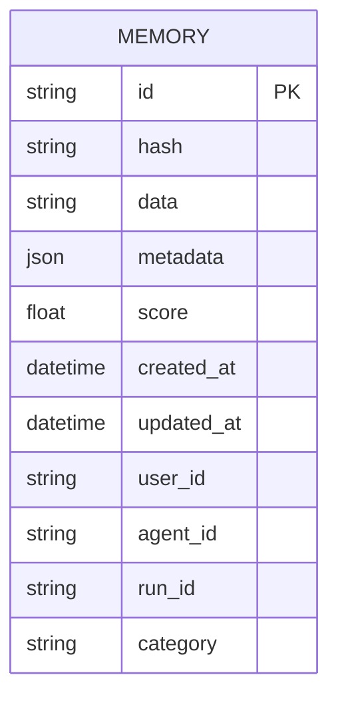
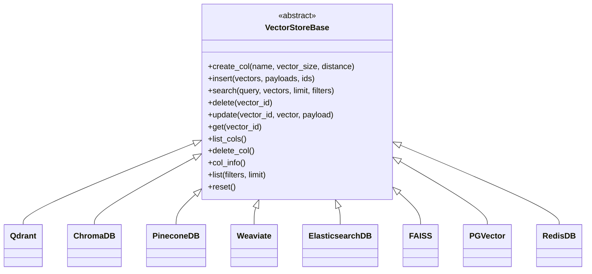
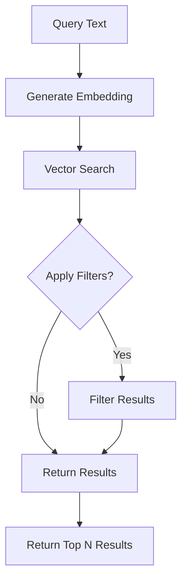
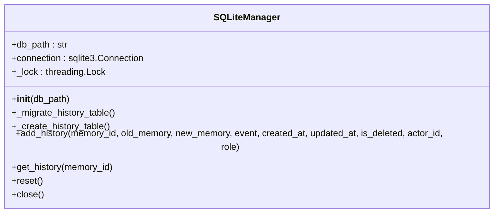

# Vector Database Integration

<cite>
**Referenced Files in This Document**   
- [base.py](file://mem0/vector_stores/base.py)
- [qdrant.py](file://mem0/vector_stores/qdrant.py)
- [chroma.py](file://mem0/vector_stores/chroma.py)
- [pinecone.py](file://mem0/vector_stores/pinecone.py)
- [weaviate.py](file://mem0/vector_stores/weaviate.py)
- [elasticsearch.py](file://mem0/vector_stores/elasticsearch.py)
- [faiss.py](file://mem0/vector_stores/faiss.py)
- [pgvector.py](file://mem0/vector_stores/pgvector.py)
- [redis.py](file://mem0/vector_stores/redis.py)
- [storage.py](file://mem0/memory/storage.py)
- [configs.py](file://mem0/vector_stores/configs.py)
</cite>

## Table of Contents
1. [Introduction](#introduction)
2. [Data Model](#data-model)
3. [VectorStore Abstraction Layer](#vectorstore-abstraction-layer)
4. [Database-Specific Implementations](#database-specific-implementations)
5. [Vector Embedding Process](#vector-embedding-process)
6. [Similarity Search Mechanisms](#similarity-search-mechanisms)
7. [Metadata Filtering Capabilities](#metadata-filtering-capabilities)
8. [History Tracking System Integration](#history-tracking-system-integration)
9. [Configuration and Initialization](#configuration-and-initialization)
10. [Conclusion](#conclusion)

## Introduction
Mem0 provides a comprehensive vector database integration system that enables persistent memory storage across various vector database backends. The system is designed to be flexible and extensible, supporting multiple vector database providers including Qdrant, Chroma, Pinecone, Weaviate, and others. This documentation details the data model, vector embedding process, similarity search mechanisms, metadata filtering capabilities, and the abstraction layer that enables seamless integration with different vector databases.

The vector database integration in Mem0 serves as the primary storage mechanism for memory data, enabling efficient storage, retrieval, and management of vector embeddings and associated metadata. The system is built around a base abstraction layer that defines a consistent interface across all supported vector databases, while allowing for database-specific optimizations and features.

**Section sources**
- [base.py](file://mem0/vector_stores/base.py#L1-L59)

## Data Model
The data model for vector database integration in Mem0 is designed to store memory information with rich metadata and temporal tracking. Each memory record consists of the following fields:

- **id**: Unique identifier for the memory record
- **memory**: Text content of the memory (stored as "data" in the payload)
- **hash**: Hash value for the memory content to detect changes
- **metadata**: Additional metadata associated with the memory, stored as a JSON object
- **score**: Similarity score returned during search operations
- **created_at**: Timestamp when the memory was created
- **updated_at**: Timestamp when the memory was last updated
- **user_id**: Identifier for the user associated with the memory
- **agent_id**: Identifier for the agent that created or modified the memory
- **run_id**: Identifier for the specific run or session
- **category**: Classification or categorization of the memory

The data model is implemented consistently across all vector database backends, with the payload field containing the structured metadata. The vector embedding itself is stored separately as a dense vector representation of the memory text content.

**Diagram sources **
- [qdrant.py](file://mem0/vector_stores/qdrant.py#L121-L146)
- [weaviate.py](file://mem0/vector_stores/weaviate.py#L131-L146)
- [pgvector.py](file://mem0/vector_stores/pgvector.py#L156-L160)

**Section sources**
- [weaviate.py](file://mem0/vector_stores/weaviate.py#L131-L146)
- [pgvector.py](file://mem0/vector_stores/pgvector.py#L156-L160)

## VectorStore Abstraction Layer
The VectorStore abstraction layer in Mem0 provides a consistent interface for interacting with different vector database backends. This abstraction is implemented through the `VectorStoreBase` abstract base class, which defines the core operations required for vector database functionality.

The base class defines the following abstract methods that must be implemented by all concrete vector store implementations:

- `create_col`: Create a new collection with specified parameters
- `insert`: Insert vectors and associated payloads into the collection
- `search`: Search for similar vectors using a query vector
- `delete`: Delete a vector by ID
- `update`: Update a vector and its payload
- `get`: Retrieve a vector by ID
- `list_cols`: List all available collections
- `delete_col`: Delete a collection
- `col_info`: Get information about a collection
- `list`: List all vectors in a collection with optional filtering
- `reset`: Reset the collection by deleting and recreating it

This abstraction enables Mem0 to support multiple vector database backends while maintaining a consistent API for memory operations. Each concrete implementation adapts these operations to the specific features and requirements of its underlying database system.

**Diagram sources **
- [base.py](file://mem0/vector_stores/base.py#L4-L59)

**Section sources**
- [base.py](file://mem0/vector_stores/base.py#L4-L59)

## Database-Specific Implementations
Mem0 supports multiple vector database backends, each with its own implementation that adapts the abstract interface to the specific features and requirements of the underlying database system.

### Qdrant Implementation
The Qdrant implementation provides a robust vector database solution with support for both local and remote deployments. It creates collections with configurable vector size and distance metrics, and automatically creates indexes for commonly used filter fields such as user_id, agent_id, and run_id. The implementation handles both local file-based storage and remote server connections, with support for API keys and secure connections.

**Section sources**
- [qdrant.py](file://mem0/vector_stores/qdrant.py#L22-L271)

### Chroma Implementation
The Chroma implementation supports both local and cloud-based deployments. For local storage, it can use a file path or in-memory storage, while for cloud deployments, it integrates with ChromaDB Cloud using API keys and tenant IDs. The implementation includes a custom output parsing mechanism to handle the response format from Chroma queries and supports metadata filtering through properly formatted where clauses.

**Section sources**
- [chroma.py](file://mem0/vector_stores/chroma.py#L23-L268)

### Pinecone Implementation
The Pinecone implementation supports both serverless and pod-based deployments with configurable specifications. It includes support for hybrid search using both dense and sparse vectors, with automatic initialization of the BM25 encoder when hybrid search is enabled. The implementation handles batch operations for efficient insertion of multiple vectors and supports namespace isolation for multi-tenancy scenarios.

**Section sources**
- [pinecone.py](file://mem0/vector_stores/pinecone.py#L25-L383)

### Weaviate Implementation
The Weaviate implementation creates collections with a predefined schema that includes all the required memory fields. It uses Weaviate's hybrid search capabilities with both vector and keyword-based filtering. The implementation maps the memory fields to Weaviate properties and handles the conversion between Weaviate's UUID-based identifiers and the string-based IDs used in the Mem0 system.

**Section sources**
- [weaviate.py](file://mem0/vector_stores/weaviate.py#L31-L344)

### Elasticsearch Implementation
The Elasticsearch implementation uses Elasticsearch's dense vector field type for storing vector embeddings with cosine similarity. It creates indices with appropriate mappings for the vector field and metadata, and supports both basic authentication and cloud-based deployments. The implementation includes support for custom search queries and KNN search with pre-filtering for efficient retrieval.

**Section sources**
- [elasticsearch.py](file://mem0/vector_stores/elasticsearch.py#L24-L238)

### FAISS Implementation
The FAISS implementation provides a lightweight, file-based vector database solution. It stores the FAISS index and associated metadata in separate files, enabling persistence across sessions. The implementation supports different distance strategies (euclidean, inner_product, cosine) and includes options for L2 normalization. It handles metadata filtering in-memory after retrieval from the vector index.

**Section sources**
- [faiss.py](file://mem0/vector_stores/faiss.py#L40-L480)

### PGVector Implementation
The PGVector implementation leverages PostgreSQL with the pgvector extension for vector storage and similarity search. It creates tables with UUID primary keys, vector columns, and JSONB payload storage. The implementation supports both HNSW and DiskANN indexing for efficient similarity search and uses connection pooling for optimal performance. It handles JSON serialization of metadata based on the psycopg version.

**Section sources**
- [pgvector.py](file://mem0/vector_stores/pgvector.py#L39-L405)

### Redis Implementation
The Redis implementation uses Redis with the RedisVL library for vector search capabilities. It defines a schema with tag fields for categorical data, text fields for content, numeric fields for timestamps, and a vector field for embeddings. The implementation uses Redis search indexes with appropriate field types and supports complex filtering expressions using tag conditions.

**Section sources**
- [redis.py](file://mem0/vector_stores/redis.py#L48-L296)

## Vector Embedding Process
The vector embedding process in Mem0 converts text content into dense vector representations that can be efficiently stored and searched in vector databases. While the specific embedding implementation is not detailed in the provided files, the vector store implementations reveal the requirements and characteristics of the embedding process.

Vector embeddings are typically generated using a pre-trained language model and have a fixed dimensionality that must be specified when creating a vector store collection. The dimensionality is a critical parameter that must match between the embedding model and the vector database configuration. Common embedding dimensions include 1536 (for OpenAI's text-embedding-3-small) and other sizes depending on the specific embedding model.

When inserting data into a vector store, the text content of the memory is first converted to a vector embedding, which is then stored alongside the original text and metadata in the database. The embedding process is abstracted from the vector store layer, allowing different embedding models to be used without changing the vector database implementation.

The embedding process also considers the context in which the embedding is being created, with different embedding functions potentially used for adding, searching, or updating memories. This allows for optimization of embeddings based on their intended use case.

**Section sources**
- [qdrant.py](file://mem0/vector_stores/qdrant.py#L26-L27)
- [pinecone.py](file://mem0/vector_stores/pinecone.py#L29-L30)
- [pgvector.py](file://mem0/vector_stores/pgvector.py#L44-L45)

## Similarity Search Mechanisms
The similarity search mechanisms in Mem0 enable efficient retrieval of relevant memories based on vector similarity. Each vector database implementation provides its own search functionality, but they all follow a consistent pattern defined by the VectorStoreBase interface.

The search operation takes a query vector (or vectors) and returns the most similar vectors from the collection, ranked by their similarity score. The similarity metric used varies by database but typically includes cosine similarity, Euclidean distance, or inner product. The search results include both the vector data and the associated metadata payload.

Most implementations support limiting the number of results returned and applying filters to constrain the search to specific subsets of data. The filtering is typically applied either as a pre-filter before the vector search or as a post-filter after retrieval, depending on the capabilities of the underlying database.

For databases that support hybrid search (like Pinecone), both dense and sparse vector representations can be used to improve search relevance. The sparse vectors capture keyword-based information that complements the semantic information in the dense vectors.

**Diagram sources **
- [qdrant.py](file://mem0/vector_stores/qdrant.py#L162-L182)
- [chroma.py](file://mem0/vector_stores/chroma.py#L143-L161)
- [pinecone.py](file://mem0/vector_stores/pinecone.py#L206-L242)

**Section sources**
- [qdrant.py](file://mem0/vector_stores/qdrant.py#L162-L182)
- [chroma.py](file://mem0/vector_stores/chroma.py#L143-L161)
- [pinecone.py](file://mem0/vector_stores/pinecone.py#L206-L242)

## Metadata Filtering Capabilities
Mem0's vector database integration provides robust metadata filtering capabilities that allow for targeted retrieval of memories based on specific criteria. The filtering system enables queries to be constrained by user_id, agent_id, run_id, and other metadata fields, making it possible to retrieve memories relevant to specific contexts.

Each vector database implementation handles filtering differently based on the capabilities of the underlying system:

- **Qdrant**: Creates payload indexes for commonly used filter fields and uses Qdrant's native filtering syntax with FieldCondition and MatchValue
- **Chroma**: Uses properly formatted where clauses, supporting both single filters and combined filters with $and operators
- **Pinecone**: Converts filters to Pinecone's filter dictionary format with $eq and range operators ($gte, $lte)
- **Weaviate**: Uses Weaviate's Filter.by_property syntax to create filter conditions that are combined with Filter.all_of
- **Elasticsearch**: Applies filters as boolean must conditions on metadata fields using term queries
- **FAISS**: Applies filtering in-memory after retrieval, checking each result against the filter criteria
- **PGVector**: Uses SQL WHERE clauses with parameterized queries to filter by metadata fields
- **Redis**: Uses RedisVL's Tag conditions combined with logical operators

The filtering system supports both exact matching and range queries, allowing for flexible querying based on metadata values. This enables complex queries such as retrieving all memories for a specific user within a certain time range.

**Section sources**
- [qdrant.py](file://mem0/vector_stores/qdrant.py#L141-L160)
- [chroma.py](file://mem0/vector_stores/chroma.py#L247-L267)
- [pinecone.py](file://mem0/vector_stores/pinecone.py#L189-L204)

## History Tracking System Integration
The history tracking system in Mem0 provides a complete audit trail of memory changes, enabling versioning and change tracking. This system is implemented separately from the vector database storage, using a SQLite database to store historical records.

The history tracking system captures the following information for each memory change:
- Memory ID
- Previous memory content (old_memory)
- New memory content (new_memory)
- Event type (e.g., "add", "update", "delete")
- Timestamps for creation and update
- Deletion status
- Actor ID (identifying the entity that made the change)
- Role of the actor

The SQLiteManager class handles the creation and management of the history table, including schema migration for backward compatibility. It provides methods for adding history records, retrieving the history for a specific memory, and resetting the history table.

This separation of concerns allows the vector database to focus on efficient similarity search while the history system maintains a complete record of changes. The two systems work together to provide both high-performance retrieval and comprehensive change tracking.

**Diagram sources **
- [storage.py](file://mem0/memory/storage.py#L10-L219)

**Section sources**
- [storage.py](file://mem0/memory/storage.py#L10-L219)

## Configuration and Initialization
The vector database integration in Mem0 is configured through a flexible system that supports both programmatic configuration and environment variables. The configuration system is designed to be extensible, allowing new vector database providers to be added with minimal changes.

The VectorStoreConfig class defines the configuration structure, specifying the provider (e.g., 'qdrant', 'chroma', 'pinecone') and optional provider-specific configuration parameters. This configuration is used to initialize the appropriate vector store implementation with the required parameters.

Initialization parameters vary by provider but typically include:
- Collection/index name
- Embedding model dimensions
- Connection parameters (host, port, URL, API keys)
- Storage paths (for local databases)
- Indexing and search parameters

The configuration system supports multiple deployment scenarios, from local development with file-based storage to cloud deployments with managed vector database services. Environment variables can be used to configure connection parameters, making it easy to deploy across different environments without changing code.

**Section sources**
- [configs.py](file://mem0/vector_stores/configs.py#L6-L38)

## Conclusion
The vector database integration in Mem0 provides a comprehensive and flexible system for persistent memory storage across multiple vector database backends. The architecture is built around a robust abstraction layer that enables consistent functionality while allowing for database-specific optimizations.

Key features of the system include:
- Support for multiple vector database providers
- Consistent data model with rich metadata and temporal tracking
- Efficient vector embedding and similarity search
- Robust metadata filtering capabilities
- Complete history tracking for audit and versioning
- Flexible configuration and initialization

This integration enables Mem0 to provide persistent, searchable memory storage that can be adapted to different deployment requirements and performance needs. The modular design allows for easy addition of new vector database backends and ensures that the system can evolve with changing technology and requirements.