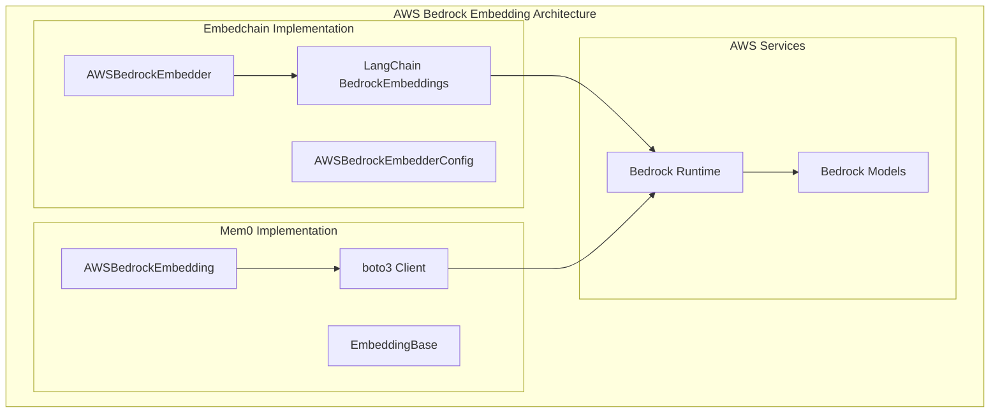
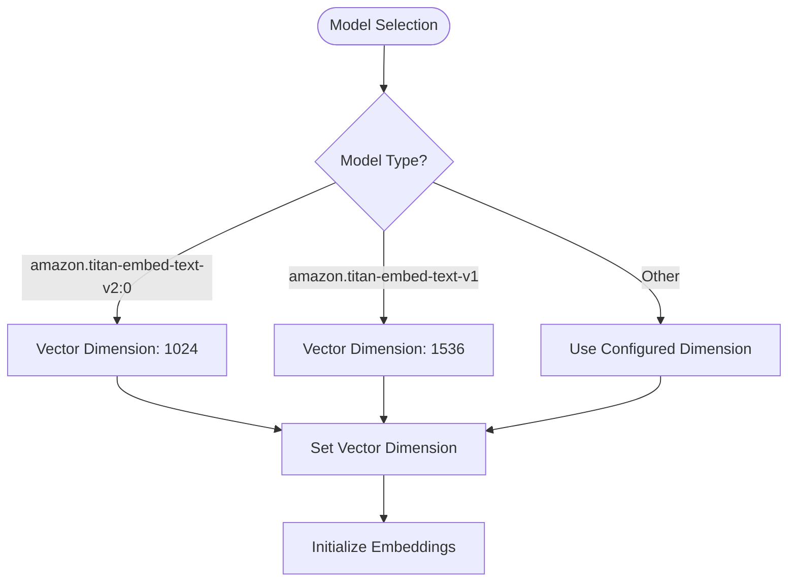
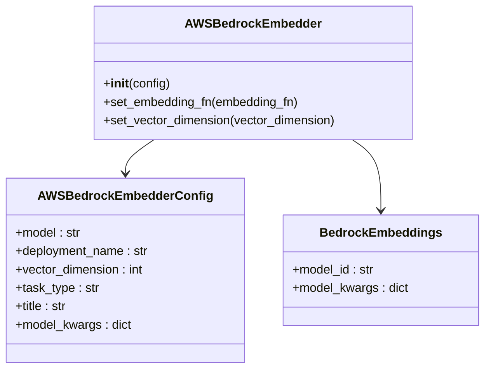
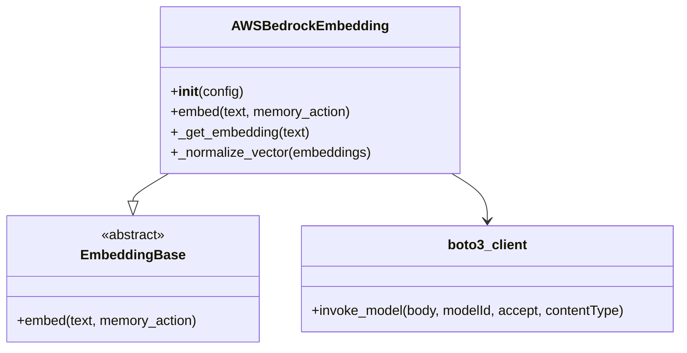

# AWS Bedrock Embeddings

<cite>
**Referenced Files in This Document**
- [embedchain/embedchain/embedder/aws_bedrock.py](file://embedchain/embedchain/embedder/aws_bedrock.py)
- [embedchain/embedchain/config/embedder/aws_bedrock.py](file://embedchain/embedchain/config/embedder/aws_bedrock.py)
- [mem0/embeddings/aws_bedrock.py](file://mem0/embeddings/aws_bedrock.py)
- [mem0/configs/embeddings/aws_bedrock.py](file://mem0/configs/embeddings/aws_bedrock.py)
- [mem0/configs/embeddings/base.py](file://mem0/configs/embeddings/base.py)
- [embedchain/configs/aws_bedrock.yaml](file://embedchain/configs/aws_bedrock.yaml)
- [embedchain/notebooks/aws-bedrock.ipynb](file://embedchain/notebooks/aws-bedrock.ipynb)
- [mem0/embeddings/base.py](file://mem0/embeddings/base.py)
- [embedchain/embedchain/models/vector_dimensions.py](file://embedchain/embedchain/models/vector_dimensions.py)
- [mem0/configs/llms/aws_bedrock.py](file://mem0/configs/llms/aws_bedrock.py)
- [mem0/llms/aws_bedrock.py](file://mem0/llms/aws_bedrock.py)
</cite>

## Table of Contents
1. [Introduction](#introduction)
2. [Architecture Overview](#architecture-overview)
3. [Configuration Options](#configuration-options)
4. [Authentication Methods](#authentication-methods)
5. [Model Selection and Versioning](#model-selection-and-versioning)
6. [Implementation Details](#implementation-details)
7. [Code Examples](#code-examples)
8. [Performance Considerations](#performance-considerations)
9. [Error Handling and Troubleshooting](#error-handling-and-troubleshooting)
10. [Best Practices](#best-practices)

## Introduction

AWS Bedrock provides access to foundation models including Amazon Titan Embeddings for text embedding tasks. This integration supports both Embedchain and Mem0 frameworks, offering flexible configuration options for authentication, model selection, and regional deployment. The implementation handles multiple embedding models with automatic dimension detection and supports various input formatting requirements.

## Architecture Overview

The AWS Bedrock embedding integration consists of two primary implementations: one for Embedchain and another for Mem0. Both implementations share common authentication and configuration patterns while providing framework-specific interfaces.



**Diagram sources**
- [embedchain/embedchain/embedder/aws_bedrock.py](file://embedchain/embedchain/embedder/aws_bedrock.py#L15-L31)
- [mem0/embeddings/aws_bedrock.py](file://mem0/embeddings/aws_bedrock.py#L16-L47)

## Configuration Options

### Embedchain Configuration

The Embedchain implementation uses a dedicated configuration class with LangChain integration:

| Parameter | Type | Description | Default |
|-----------|------|-------------|---------|
| `model` | str | Model identifier (e.g., "amazon.titan-embed-text-v2:0") | "amazon.titan-embed-text-v2:0" |
| `deployment_name` | str | Deployment identifier | None |
| `vector_dimension` | int | Expected embedding dimensions | Auto-detected |
| `task_type` | str | Task classification | "retrieval_document" |
| `title` | str | Embedding title | "Embeddings for Embedchain" |
| `model_kwargs` | dict | Additional model parameters | {} |

**Section sources**
- [embedchain/embedchain/config/embedder/aws_bedrock.py](file://embedchain/embedchain/config/embedder/aws_bedrock.py#L8-L21)

### Mem0 Configuration

The Mem0 implementation inherits from a base configuration with AWS-specific parameters:

| Parameter | Type | Description | Default |
|-----------|------|-------------|---------|
| `model` | str | Model identifier | "amazon.titan-embed-text-v1" |
| `aws_access_key_id` | str | AWS access key | Environment variable |
| `aws_secret_access_key` | str | AWS secret key | Environment variable |
| `aws_region` | str | AWS region | "us-west-2" |
| `aws_session_token` | str | Temporary session token | Environment variable |

**Section sources**
- [mem0/configs/embeddings/base.py](file://mem0/configs/embeddings/base.py#L40-L43)
- [mem0/embeddings/aws_bedrock.py](file://mem0/embeddings/aws_bedrock.py#L25-L39)

### YAML Configuration Example

```yaml
llm:
  provider: aws_bedrock
  config:
    model: amazon.titan-text-express-v1
    deployment_name: your_llm_deployment_name
    temperature: 0.5
    max_tokens: 8192
    top_p: 1
    stream: false

embedder::
  provider: aws_bedrock
  config:
    model: amazon.titan-embed-text-v2:0
    deployment_name: your_embedding_model_deployment_name
```

**Section sources**
- [embedchain/configs/aws_bedrock.yaml](file://embedchain/configs/aws_bedrock.yaml#L1-L15)

## Authentication Methods

### Environment Variables

The simplest authentication method uses environment variables:

```bash
export AWS_ACCESS_KEY_ID="your-access-key-id"
export AWS_SECRET_ACCESS_KEY="your-secret-access-key"
export AWS_SESSION_TOKEN="your-session-token"
export AWS_DEFAULT_REGION="us-west-2"
```

### Programmatic Configuration

Both implementations support programmatic credential configuration:

```python
# Embedchain approach
config = AWSBedrockEmbedderConfig(
    model="amazon.titan-embed-text-v2:0",
    aws_access_key_id="your-access-key-id",
    aws_secret_access_key="your-secret-access-key",
    aws_region="us-west-2"
)

# Mem0 approach
config = {
    "model": "amazon.titan-embed-text-v1",
    "aws_access_key_id": "your-access-key-id",
    "aws_secret_access_key": "your-secret-access-key",
    "aws_region": "us-west-2"
}
```

### IAM Role-Based Access

For AWS environments, IAM roles provide secure credential management:

```python
# Using IAM role (no explicit credentials needed)
config = AWSBedrockConfig(
    model="amazon.titan-text-express-v1",
    aws_region="us-west-2",
    aws_profile=None  # Uses default or configured profile
)
```

**Section sources**
- [mem0/configs/llms/aws_bedrock.py](file://mem0/configs/llms/aws_bedrock.py#L55-L60)
- [mem0/embeddings/aws_bedrock.py](file://mem0/embeddings/aws_bedrock.py#L28-L39)

## Model Selection and Versioning

### Supported Models

The integration supports multiple Amazon Titan embedding models:

| Model | Dimensions | Description | Use Case |
|-------|------------|-------------|----------|
| `amazon.titan-embed-text-v1` | 1536 | Original Titan embedding | General purpose |
| `amazon.titan-embed-text-v2:0` | 1024 | Enhanced Titan embedding | Improved performance |

### Automatic Dimension Detection

The system automatically detects vector dimensions based on model selection:



**Diagram sources**
- [embedchain/embedchain/embedder/aws_bedrock.py](file://embedchain/embedchain/embedder/aws_bedrock.py#L19-L25)

### Provider-Specific Input Formatting

Different providers require specific input formatting:

| Provider | Input Format | Example |
|----------|--------------|---------|
| Amazon Titan | `{"inputText": "text"}` | Standard format |
| Cohere | `{"input_type": "search_document", "texts": ["text"]}` | Specialized for search |

**Section sources**
- [mem0/embeddings/aws_bedrock.py](file://mem0/embeddings/aws_bedrock.py#L59-L67)

## Implementation Details

### Embedchain Implementation

The Embedchain implementation leverages LangChain's Bedrock integration:



**Diagram sources**
- [embedchain/embedchain/embedder/aws_bedrock.py](file://embedchain/embedchain/embedder/aws_bedrock.py#L15-L31)
- [embedchain/embedchain/config/embedder/aws_bedrock.py](file://embedchain/embedchain/config/embedder/aws_bedrock.py#L8-L21)

### Mem0 Implementation

The Mem0 implementation provides direct boto3 integration:



**Diagram sources**
- [mem0/embeddings/aws_bedrock.py](file://mem0/embeddings/aws_bedrock.py#L16-L101)
- [mem0/embeddings/base.py](file://mem0/embeddings/base.py#L7-L32)

**Section sources**
- [embedchain/embedchain/embedder/aws_bedrock.py](file://embedchain/embedchain/embedder/aws_bedrock.py#L15-L31)
- [mem0/embeddings/aws_bedrock.py](file://mem0/embeddings/aws_bedrock.py#L16-L101)

## Code Examples

### Basic Embedchain Usage

```python
from embedchain import App
from embedchain.config import BaseLlmConfig

# Configure AWS credentials
import os
os.environ["AWS_ACCESS_KEY_ID"] = "your-access-key"
os.environ["AWS_SECRET_ACCESS_KEY"] = "your-secret-key"
os.environ["AWS_DEFAULT_REGION"] = "us-west-2"

# Create configuration
config = """
embedder:
  provider: aws_bedrock
  config:
    model: amazon.titan-embed-text-v2:0
"""

# Initialize app
app = App.from_config(config_path="aws_bedrock.yaml")
app.reset()

# Add data source
app.add("https://www.example.com")

# Perform search
results = app.search("your query")
```

**Section sources**
- [embedchain/notebooks/aws-bedrock.ipynb](file://embedchain/notebooks/aws-bedrock.ipynb#L39-L52)

### Advanced Mem0 Usage

```python
from mem0 import MemoryClient
from mem0.configs.embeddings.aws_bedrock import AWSBedrockEmbeddingConfig

# Configure embedding
embedding_config = AWSBedrockEmbeddingConfig(
    model="amazon.titan-embed-text-v1",
    aws_access_key_id="your-access-key",
    aws_secret_access_key="your-secret-key",
    aws_region="us-west-2"
)

# Initialize client
client = MemoryClient(config={"embeddings": embedding_config})

# Add memory
client.add("User mentioned they like coffee", user_id="user123")

# Search memory
results = client.search("coffee preferences", user_id="user123")
```

### Direct boto3 Usage

```python
import boto3
import json

# Initialize client
client = boto3.client(
    "bedrock-runtime",
    region_name="us-west-2",
    aws_access_key_id="your-access-key",
    aws_secret_access_key="your-secret-key"
)

# Prepare input
input_body = {
    "inputText": "Your text here"
}
body = json.dumps(input_body)

# Get embedding
response = client.invoke_model(
    body=body,
    modelId="amazon.titan-embed-text-v1",
    accept="application/json",
    contentType="application/json"
)

# Parse response
response_body = json.loads(response.get("body").read())
embedding = response_body.get("embedding")
```

## Performance Considerations

### Request Latency

AWS Bedrock embedding requests typically have the following characteristics:

- **Average Latency**: 50-200ms for standard requests
- **Batch Processing**: Not supported natively (process texts individually)
- **Concurrent Requests**: Limited by AWS account quotas

### Throughput Limits

AWS Bedrock has built-in throttling mechanisms:

| Limit Type | Default | Adjustable |
|------------|---------|------------|
| Requests per second | 10-100 | Yes (via AWS support) |
| Concurrent connections | 100 | Yes (via AWS support) |
| Total daily quota | 10,000+ | Yes (via AWS support) |

### Cost Optimization Strategies

1. **Model Selection**: Choose appropriate model based on requirements
   - Use `amazon.titan-embed-text-v1` for legacy compatibility
   - Use `amazon.titan-embed-text-v2:0` for improved performance

2. **Caching**: Implement application-level caching for repeated queries

3. **Batch Processing**: Process multiple texts in sequence rather than concurrently

4. **Region Optimization**: Deploy in regions closest to your infrastructure

### Vector Normalization

The Mem0 implementation includes vector normalization for improved similarity calculations:

```python
def _normalize_vector(self, embeddings):
    """Normalize the embedding to a unit vector."""
    emb = np.array(embeddings)
    norm_emb = emb / np.linalg.norm(emb)
    return norm_emb.tolist()
```

**Section sources**
- [mem0/embeddings/aws_bedrock.py](file://mem0/embeddings/aws_bedrock.py#L49-L54)

## Error Handling and Troubleshooting

### Common Authentication Errors

| Error | Cause | Solution |
|-------|-------|----------|
| `NoCredentialsError` | Missing AWS credentials | Set environment variables or provide credentials in config |
| `UnauthorizedOperation` | Insufficient permissions | Verify IAM permissions for Bedrock access |
| `SignatureDoesNotMatch` | Invalid credentials | Check access key and secret key validity |

### Regional Availability Issues

```python
# Check model availability in region
def check_model_availability(region, model):
    try:
        client = boto3.client("bedrock", region_name=region)
        response = client.list_foundation_models()
        available_models = [m["modelId"] for m in response["modelSummaries"]]
        
        if model not in available_models:
            print(f"Model {model} not available in {region}")
            return False
        return True
    except Exception as e:
        print(f"Error checking model availability: {e}")
        return False
```

### Input Validation Errors

The system validates model identifiers against supported providers:

```python
valid_providers = [
    "ai21", "amazon", "anthropic", "cohere", "meta", "mistral", 
    "stability", "writer", "deepseek", "gpt-oss", "perplexity", 
    "snowflake", "titan", "command", "j2", "llama"
]
```

### Network and Timeout Issues

Implement retry logic for transient failures:

```python
import time
import boto3
from botocore.exceptions import ClientError

def get_embedding_with_retry(client, text, model_id, max_retries=3):
    for attempt in range(max_retries):
        try:
            response = client.invoke_model(
                body=json.dumps({"inputText": text}),
                modelId=model_id,
                accept="application/json",
                contentType="application/json"
            )
            return json.loads(response.get("body").read()).get("embedding")
        except ClientError as e:
            if attempt == max_retries - 1:
                raise
            time.sleep(2 ** attempt)  # Exponential backoff
```

**Section sources**
- [mem0/configs/llms/aws_bedrock.py](file://mem0/configs/llms/aws_bedrock.py#L86-L99)
- [mem0/llms/aws_bedrock.py](file://mem0/llms/aws_bedrock.py#L76-L100)

## Best Practices

### Security Best Practices

1. **Credential Management**: Use IAM roles when possible
2. **Environment Separation**: Store credentials in separate environment files
3. **Rotation**: Regularly rotate access keys
4. **Least Privilege**: Grant minimal required permissions

### Configuration Management

1. **Centralized Config**: Use configuration files for environment-specific settings
2. **Validation**: Validate model identifiers and regions
3. **Fallbacks**: Implement fallback models for regional unavailability

### Monitoring and Observability

1. **Logging**: Enable detailed logging for debugging
2. **Metrics**: Track request latency and success rates
3. **Alerting**: Set up alerts for authentication failures

### Testing Strategies

1. **Unit Tests**: Test configuration loading and validation
2. **Integration Tests**: Test with real AWS credentials
3. **Mock Testing**: Use mocks for offline development

**Section sources**
- [embedchain/tests/embedder/test_aws_bedrock_embedder.py](file://embedchain/tests/embedder/test_aws_bedrock_embedder.py#L1-L21)
- [mem0/llms/aws_bedrock.py](file://mem0/llms/aws_bedrock.py#L101-L117)