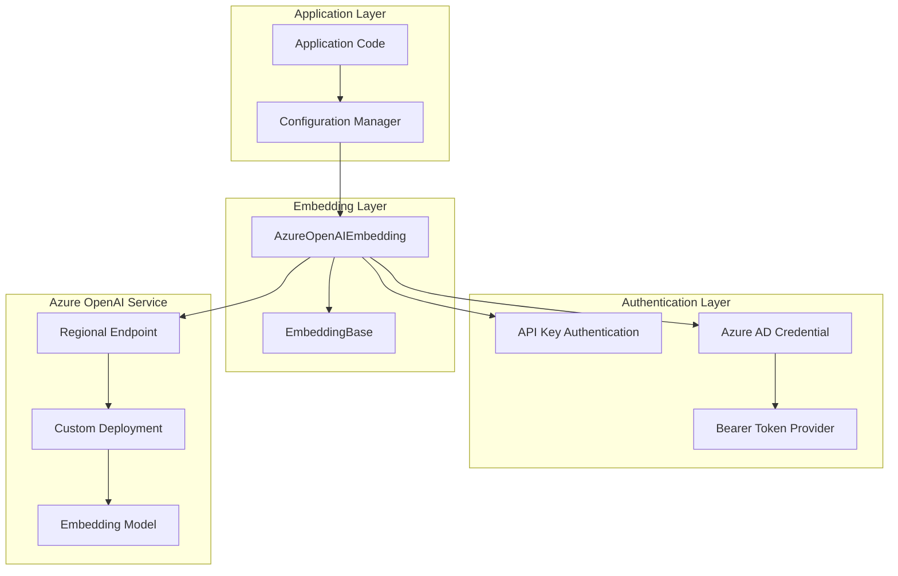
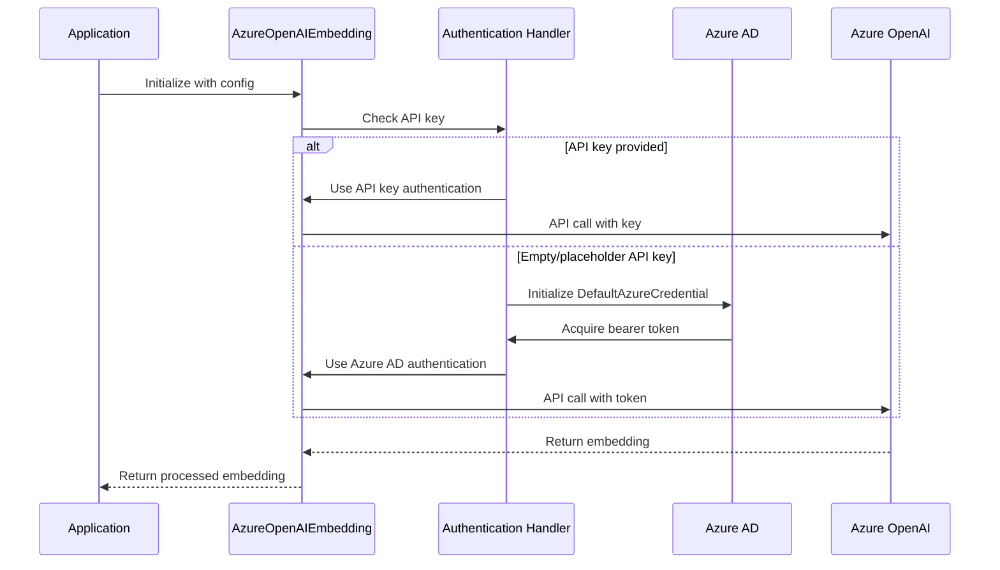
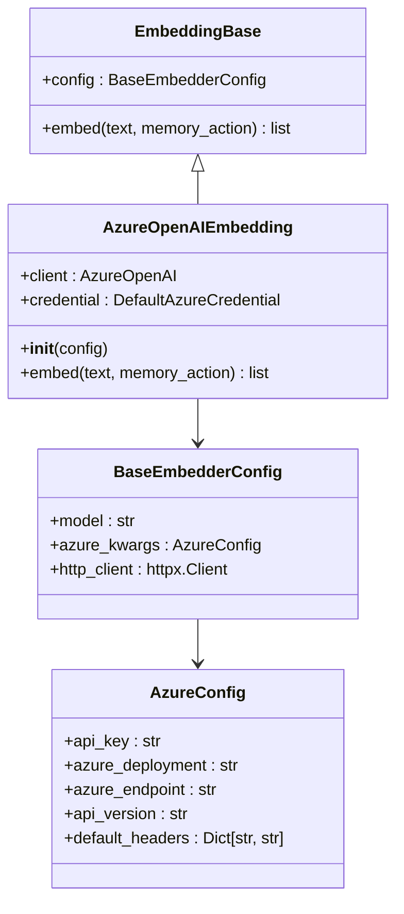
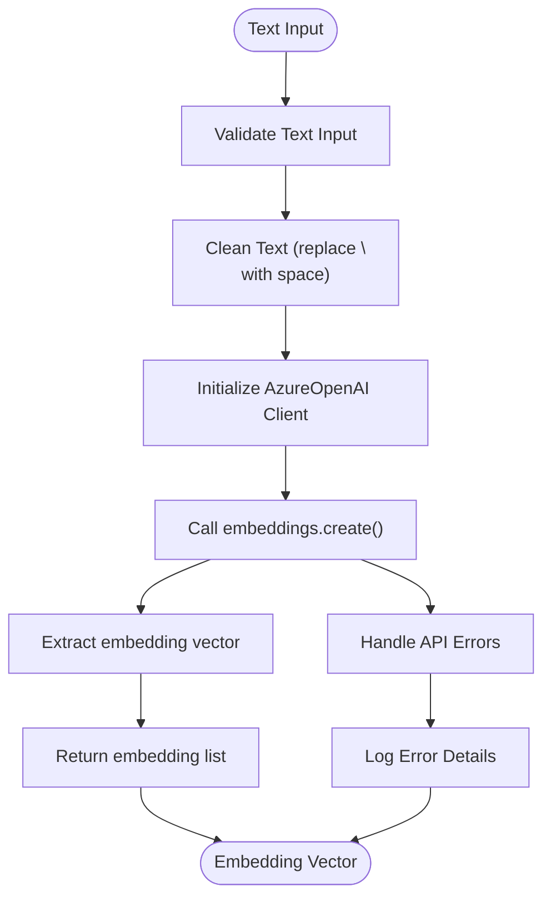
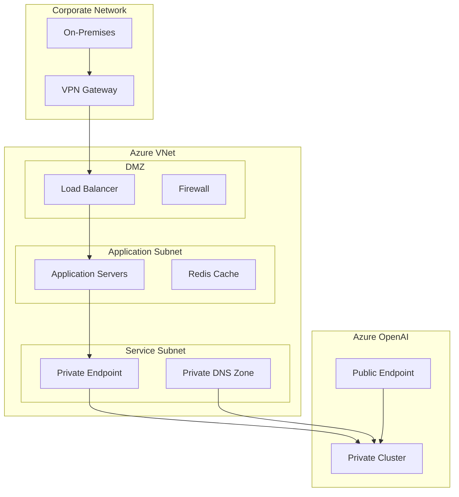

# Azure OpenAI Embeddings

<cite>
**Referenced Files in This Document**
- [mem0/embeddings/azure_openai.py](file://mem0/embeddings/azure_openai.py)
- [mem0/configs/embeddings/base.py](file://mem0/configs/embeddings/base.py)
- [mem0/configs/base.py](file://mem0/configs/base.py)
- [mem0/configs/llms/azure.py](file://mem0/configs/llms/azure.py)
- [embedchain/embedder/azure_openai.py](file://embedchain/embedder/azure_openai.py)
- [embedchain/configs/azure_openai.yaml](file://embedchain/configs/azure_openai.yaml)
- [tests/embeddings/test_azure_openai_embeddings.py](file://tests/embeddings/test_azure_openai_embeddings.py)
- [embedchain/notebooks/azure-openai.ipynb](file://embedchain/notebooks/azure-openai.ipynb)
- [mem0-ts/src/oss/src/embeddings/azure.ts](file://mem0-ts/src/oss/src/embeddings/azure.ts)
- [mem0/llms/azure_openai.py](file://mem0/llms/azure_openai.py)
- [mem0/vector_stores/azure_ai_search.py](file://mem0/vector_stores/azure_ai_search.py)
</cite>

## Table of Contents
1. [Introduction](#introduction)
2. [Architecture Overview](#architecture-overview)
3. [Configuration Setup](#configuration-setup)
4. [Authentication Methods](#authentication-methods)
5. [Implementation Details](#implementation-details)
6. [VNet and Private Link Configuration](#vnet-and-private-link-configuration)
7. [Common Issues and Troubleshooting](#common-issues-and-troubleshooting)
8. [Production Best Practices](#production-best-practices)
9. [Versioning Strategies](#versioning-strategies)
10. [Examples and Use Cases](#examples-and-use-cases)

## Introduction

Azure OpenAI embeddings provide a powerful way to convert text into high-dimensional vectors for semantic search, similarity matching, and machine learning applications. This documentation covers the comprehensive integration of Azure OpenAI embeddings within the Mem0 ecosystem, focusing on configuration, deployment, and production considerations.

Azure OpenAI differs from standard OpenAI APIs in several key ways:
- **Custom Deployment Requirements**: Each model must be deployed separately with specific configurations
- **Regional Endpoints**: Deployments are region-specific and require proper endpoint configuration
- **Enterprise Security**: Enhanced security features including VNet isolation and private links
- **Subscription Management**: Different quota models and billing structures compared to public OpenAI

## Architecture Overview

The Azure OpenAI embedding integration follows a modular architecture that supports both Mem0 and EmbedChain frameworks:



**Diagram sources**
- [mem0/embeddings/azure_openai.py](file://mem0/embeddings/azure_openai.py#L13-L56)
- [mem0/configs/embeddings/base.py](file://mem0/configs/embeddings/base.py#L10-L111)

**Section sources**
- [mem0/embeddings/azure_openai.py](file://mem0/embeddings/azure_openai.py#L1-L56)
- [mem0/configs/embeddings/base.py](file://mem0/configs/embeddings/base.py#L1-L111)

## Configuration Setup

### Basic Configuration

The Azure OpenAI embedding class supports multiple configuration methods:

#### Environment Variables
```python
# Embedding-specific environment variables
EMBEDDING_AZURE_OPENAI_API_KEY = "your-api-key"
EMBEDDING_AZURE_DEPLOYMENT = "your-deployment-name"
EMBEDDING_AZURE_ENDPOINT = "https://your-resource.openai.azure.com/"
EMBEDDING_AZURE_API_VERSION = "2024-02-01"

# LLM-specific environment variables (for comparison)
LLM_AZURE_OPENAI_API_KEY = "your-api-key"
LLM_AZURE_DEPLOYMENT = "your-deployment-name"
LLM_AZURE_ENDPOINT = "https://your-resource.openai.azure.com/"
LLM_AZURE_API_VERSION = "2024-02-01"
```

#### Programmatic Configuration
```python
from mem0.configs.embeddings.base import BaseEmbedderConfig
from mem0.embeddings.azure_openai import AzureOpenAIEmbedding

config = BaseEmbedderConfig(
    model="text-embedding-ada-002",
    azure_kwargs={
        "api_key": "your-api-key",
        "azure_deployment": "your-deployment-name",
        "azure_endpoint": "https://your-resource.openai.azure.com/",
        "api_version": "2024-02-01",
        "default_headers": {"custom-header": "value"}
    }
)

embedder = AzureOpenAIEmbedding(config)
```

#### YAML Configuration
```yaml
embedder:
  provider: azure_openai
  config:
    model: text-embedding-ada-002
    deployment_name: your-embedding-deployment
    azure_kwargs:
      api_key: "${EMBEDDING_AZURE_OPENAI_API_KEY}"
      azure_endpoint: "${EMBEDDING_AZURE_ENDPOINT}"
      api_version: "2024-02-01"
```

**Section sources**
- [mem0/embeddings/azure_openai.py](file://mem0/embeddings/azure_openai.py#L17-L21)
- [embedchain/configs/azure_openai.yaml](file://embedchain/configs/azure_openai.yaml#L16-L20)
- [tests/embeddings/test_azure_openai_embeddings.py](file://tests/embeddings/test_azure_openai_embeddings.py#L39-L48)

## Authentication Methods

### API Key Authentication

The simplest authentication method involves providing a direct API key:

```python
# Direct API key configuration
config = BaseEmbedderConfig(
    azure_kwargs={
        "api_key": "your-actual-api-key-here",
        "azure_deployment": "deployment-name",
        "azure_endpoint": "https://resource.openai.azure.com/",
        "api_version": "2024-02-01"
    }
)
```

### Azure Active Directory Authentication

For enterprise environments, Azure AD authentication provides enhanced security:

```python
# Using DefaultAzureCredential for Azure AD authentication
config = BaseEmbedderConfig(
    azure_kwargs={
        "api_key": "",  # Empty or placeholder key triggers Azure AD
        "azure_deployment": "deployment-name",
        "azure_endpoint": "https://resource.openai.azure.com/",
        "api_version": "2024-02-01"
    }
)
```

The system automatically handles:
- **Credential Discovery**: Searches for credentials in order of precedence
- **Token Acquisition**: Automatic token refresh and rotation
- **Scope Management**: Proper OAuth2 scopes for Azure Cognitive Services

### Authentication Flow



**Diagram sources**
- [mem0/embeddings/azure_openai.py](file://mem0/embeddings/azure_openai.py#L23-L32)
- [tests/embeddings/test_azure_openai_embeddings.py](file://tests/embeddings/test_azure_openai_embeddings.py#L117-L140)

**Section sources**
- [mem0/embeddings/azure_openai.py](file://mem0/embeddings/azure_openai.py#L23-L32)
- [tests/embeddings/test_azure_openai_embeddings.py](file://tests/embeddings/test_azure_openai_embeddings.py#L72-L167)

## Implementation Details

### Core Implementation

The AzureOpenAIEmbedding class extends EmbeddingBase and provides robust embedding functionality:



**Diagram sources**
- [mem0/embeddings/azure_openai.py](file://mem0/embeddings/azure_openai.py#L13-L56)
- [mem0/configs/embeddings/base.py](file://mem0/configs/embeddings/base.py#L10-L111)
- [mem0/configs/base.py](file://mem0/configs/base.py#L64-L86)

### Embedding Generation Process

The embedding process follows a standardized workflow:



**Diagram sources**
- [mem0/embeddings/azure_openai.py](file://mem0/embeddings/azure_openai.py#L44-L56)

### Key Features

1. **Text Preprocessing**: Automatic newline replacement for optimal embedding quality
2. **Flexible Authentication**: Supports both API keys and Azure AD credentials
3. **Custom Headers**: Allows injection of custom HTTP headers for monitoring and debugging
4. **Error Handling**: Comprehensive error handling for various failure scenarios
5. **Proxy Support**: Built-in support for HTTP proxies and custom clients

**Section sources**
- [mem0/embeddings/azure_openai.py](file://mem0/embeddings/azure_openai.py#L13-L56)
- [mem0-ts/src/oss/src/embeddings/azure.ts](file://mem0-ts/src/oss/src/embeddings/azure.ts#L1-L39)

## VNet and Private Link Configuration

### Virtual Network (VNet) Integration

Azure OpenAI supports VNet isolation for enhanced security:

#### Private Endpoint Configuration
```python
# VNet-enabled configuration
config = BaseEmbedderConfig(
    azure_kwargs={
        "azure_endpoint": "https://private-cluster.openai.azure.com/",
        "api_version": "2024-02-01",
        "default_headers": {
            "x-ms-compute-location": "eastus",
            "x-ms-private-dns-zone": "/subscriptions/subscription-id/resourceGroups/resource-group/providers/Microsoft.Network/privateDnsZones/privatelink.openai.azure.com"
        }
    }
)
```

#### Private Link Setup Requirements
1. **Private DNS Zones**: Configure private DNS zones for internal resolution
2. **Network Rules**: Set up network rules to restrict access to authorized VNets
3. **Service Endpoints**: Enable service endpoints for seamless connectivity
4. **Firewall Rules**: Configure firewall rules to allow traffic from specific IP ranges

### Network Security Considerations

| Security Feature | Description | Configuration |
|------------------|-------------|---------------|
| Private Endpoints | Isolate traffic within your VNet | Configure private DNS zones |
| Service Endpoints | Allow traffic from specific VNets | Set up network rules |
| Firewall Rules | Restrict access by IP address | Configure allowed IP ranges |
| Private DNS | Internal domain resolution | Set up private DNS zones |
| Network Policies | Apply network security policies | Configure NSGs and UDRs |

### Production Network Architecture



**Section sources**
- [mem0/embeddings/azure_openai.py](file://mem0/embeddings/azure_openai.py#L17-L21)
- [mem0/configs/base.py](file://mem0/configs/base.py#L76-L85)

## Common Issues and Troubleshooting

### Deployment Not Found Errors

**Problem**: `Deployment not found` or `Invalid deployment name` errors

**Causes and Solutions**:

1. **Incorrect Deployment Name**
   ```python
   # Verify deployment name matches exactly
   config = BaseEmbedderConfig(
       azure_kwargs={
           "azure_deployment": "correct-deployment-name",  # Case-sensitive!
           "azure_endpoint": "https://resource.openai.azure.com/"
       }
   )
   ```

2. **Model Not Available in Region**
   ```python
   # Check model availability in your region
   # Example: text-embedding-ada-002 may not be available in all regions
   config = BaseEmbedderConfig(
       model="text-embedding-3-small",  # Alternative model
       azure_kwargs={
           "azure_deployment": "embedding-deployment",
           "api_version": "2024-02-01"
       }
   )
   ```

3. **Subscription Quotas**
   ```python
   # Check and increase quotas if needed
   # Use Azure CLI: az openai list-skus --location eastus
   ```

### CORS Restrictions

**Problem**: Cross-origin request blocked errors

**Solutions**:
```python
# Configure appropriate headers
config = BaseEmbedderConfig(
    azure_kwargs={
        "default_headers": {
            "Access-Control-Allow-Origin": "*",
            "Access-Control-Allow-Methods": "GET, POST, OPTIONS"
        }
    }
)
```

### Subscription Quota Limits

**Monitoring Quota Usage**:
```python
# Check quota usage programmatically
import requests

def check_quota_usage(endpoint, api_key):
    headers = {
        "Authorization": f"Bearer {api_key}",
        "Content-Type": "application/json"
    }
    
    response = requests.get(f"{endpoint}/openai/deployments", headers=headers)
    return response.json()
```

### Authentication Issues

| Error | Cause | Solution |
|-------|-------|----------|
| `401 Unauthorized` | Invalid API key | Verify API key and regenerate if needed |
| `403 Forbidden` | Insufficient permissions | Check role assignments and access policies |
| `404 Not Found` | Incorrect endpoint | Verify endpoint URL and region |
| `AADSTS` | Azure AD authentication failure | Check credential configuration |

### Performance Optimization

```python
# Optimize for production throughput
from httpx import Timeout

config = BaseEmbedderConfig(
    azure_kwargs={
        "azure_endpoint": "https://resource.openai.azure.com/",
        "api_version": "2024-02-01"
    },
    http_client_proxies={
        "http://": "http://proxy.company.com:8080",
        "https://": "https://proxy.company.com:8080"
    }
)
```

**Section sources**
- [tests/embeddings/test_azure_openai_embeddings.py](file://tests/embeddings/test_azure_openai_embeddings.py#L72-L167)
- [mem0/embeddings/azure_openai.py](file://mem0/embeddings/azure_openai.py#L23-L32)

## Production Best Practices

### Configuration Management

#### Environment-Specific Configurations
```python
import os
from mem0.configs.embeddings.base import BaseEmbedderConfig

class AzureOpenAIConfigManager:
    @staticmethod
    def get_production_config():
        return BaseEmbedderConfig(
            model="text-embedding-3-large",
            azure_kwargs={
                "api_key": os.getenv("AZURE_OPENAI_API_KEY"),
                "azure_deployment": os.getenv("AZURE_DEPLOYMENT_NAME"),
                "azure_endpoint": os.getenv("AZURE_ENDPOINT"),
                "api_version": "2024-02-01",
                "default_headers": {
                    "User-Agent": "production-app/1.0",
                    "X-Tenant-ID": os.getenv("TENANT_ID")
                }
            }
        )
    
    @staticmethod
    def get_staging_config():
        return BaseEmbedderConfig(
            model="text-embedding-3-small",
            azure_kwargs={
                "api_key": os.getenv("AZURE_OPENAI_API_KEY_STAGING"),
                "azure_deployment": os.getenv("AZURE_DEPLOYMENT_NAME_STAGING"),
                "azure_endpoint": os.getenv("AZURE_ENDPOINT_STAGING"),
                "api_version": "2024-02-01"
            }
        )
```

#### Health Monitoring
```python
import time
from typing import Dict, Any

class AzureOpenAIHealthChecker:
    def __init__(self, embedder):
        self.embedder = embedder
    
    def check_health(self) -> Dict[str, Any]:
        """Check Azure OpenAI service health"""
        try:
            start_time = time.time()
            
            # Test embedding generation
            test_text = "health check"
            embedding = self.embedder.embed(test_text)
            
            latency = time.time() - start_time
            
            return {
                "status": "healthy",
                "latency_ms": latency * 1000,
                "dimensions": len(embedding),
                "timestamp": time.time()
            }
        
        except Exception as e:
            return {
                "status": "unhealthy",
                "error": str(e),
                "timestamp": time.time()
            }
```

### Error Handling and Retry Logic

```python
import time
import random
from typing import Optional, Callable

class AzureOpenAIEmbeddingWithRetry:
    def __init__(self, embedder, max_retries=3, base_delay=1):
        self.embedder = embedder
        self.max_retries = max_retries
        self.base_delay = base_delay
    
    def embed_with_retry(self, text: str, retry_condition: Optional[Callable] = None):
        """Embed text with exponential backoff retry logic"""
        
        for attempt in range(self.max_retries):
            try:
                return self.embedder.embed(text)
                
            except Exception as e:
                if retry_condition and not retry_condition(e):
                    raise
                
                if attempt == self.max_retries - 1:
                    raise
                
                delay = self.base_delay * (2 ** attempt) + random.uniform(0, 1)
                time.sleep(delay)
        
        raise Exception("Max retries exceeded")
```

### Resource Management

```python
import gc
from contextlib import contextmanager

@contextmanager
def managed_azure_openai_session():
    """Context manager for proper resource cleanup"""
    try:
        # Initialize resources
        embedder = AzureOpenAIEmbedding(config)
        yield embedder
    finally:
        # Cleanup resources
        if hasattr(embedder, 'client'):
            embedder.client.close()
        gc.collect()

# Usage
with managed_azure_openai_session() as embedder:
    embedding = embedder.embed("test text")
```

**Section sources**
- [mem0/embeddings/azure_openai.py](file://mem0/embeddings/azure_openai.py#L13-L56)
- [tests/embeddings/test_azure_openai_embeddings.py](file://tests/embeddings/test_azure_openai_embeddings.py#L1-L167)

## Versioning Strategies

### API Version Management

Azure OpenAI supports multiple API versions for backward compatibility and feature access:

#### Current Recommended Versions
```python
# Production-ready versions
PRODUCTION_API_VERSIONS = {
    "stable": "2024-02-01",  # Latest stable version
    "preview": "2024-06-01",  # Latest preview features
    "legacy": "2023-12-01"    # Legacy compatibility
}

# Version selection strategy
def select_api_version(environment: str) -> str:
    version_map = {
        "production": PRODUCTION_API_VERSIONS["stable"],
        "staging": PRODUCTION_API_VERSIONS["preview"],
        "development": PRODUCTION_API_VERSIONS["preview"]
    }
    return version_map.get(environment, PRODUCTION_API_VERSIONS["stable"])
```

### Model Versioning

Different embedding models have varying capabilities and performance characteristics:

| Model | Dimensions | Max Tokens | Use Case | Performance |
|-------|------------|------------|----------|-------------|
| text-embedding-ada-002 | 1536 | 8191 | General purpose | Good |
| text-embedding-3-small | 1536 | 8191 | Cost-effective | Excellent |
| text-embedding-3-large | 3072 | 8191 | High-quality | Premium |

### Migration Strategies

```python
class AzureOpenAIMigrationManager:
    def __init__(self, current_version: str, target_version: str):
        self.current_version = current_version
        self.target_version = target_version
    
    def migrate_config(self, config: BaseEmbedderConfig) -> BaseEmbedderConfig:
        """Migrate configuration between API versions"""
        
        # Update API version
        config.azure_kwargs.api_version = self.target_version
        
        # Handle breaking changes
        if self._needs_model_migration():
            config.model = self._get_compatible_model(config.model)
        
        # Update headers for new version
        if self._requires_new_headers():
            config.azure_kwargs.default_headers = self._get_updated_headers()
        
        return config
    
    def _needs_model_migration(self) -> bool:
        """Check if model migration is required"""
        return self.current_version < "2024-02-01" and self.target_version >= "2024-02-01"
    
    def _get_compatible_model(self, old_model: str) -> str:
        """Map old models to compatible new models"""
        model_mapping = {
            "text-similarity-ada-001": "text-embedding-ada-002",
            "text-search-ada-doc-001": "text-embedding-3-small"
        }
        return model_mapping.get(old_model, old_model)
```

### Backward Compatibility

```python
class AzureOpenAIVersionAdapter:
    def __init__(self, config: BaseEmbedderConfig):
        self.config = config
        self.api_version = config.azure_kwargs.api_version
    
    def adapt_for_version(self, target_version: str):
        """Adapt configuration for target API version"""
        
        # Handle parameter changes
        if self._version_changed("2023-12-01", target_version):
            self._adapt_pre_2024_parameters()
        
        # Handle response format changes
        if self._version_changed("2024-02-01", target_version):
            self._adapt_post_2024_format()
    
    def _adapt_pre_2024_parameters(self):
        """Adapt parameters for pre-2024 API versions"""
        # Parameter mapping logic here
        pass
    
    def _adapt_post_2024_format(self):
        """Adapt response handling for post-2024 API versions"""
        # Response format adaptation logic here
        pass
```

**Section sources**
- [mem0/embeddings/azure_openai.py](file://mem0/embeddings/azure_openai.py#L17-L21)
- [mem0/configs/base.py](file://mem0/configs/base.py#L76-L85)

## Examples and Use Cases

### Basic Embedding Generation

```python
from mem0.configs.embeddings.base import BaseEmbedderConfig
from mem0.embeddings.azure_openai import AzureOpenAIEmbedding

# Initialize with configuration
config = BaseEmbedderConfig(
    model="text-embedding-ada-002",
    azure_kwargs={
        "api_key": "your-api-key",
        "azure_deployment": "embedding-deployment",
        "azure_endpoint": "https://resource.openai.azure.com/",
        "api_version": "2024-02-01"
    }
)

embedder = AzureOpenAIEmbedding(config)

# Generate embeddings
text = "Hello, world!"
embedding = embedder.embed(text)
print(f"Embedding dimension: {len(embedding)}")
```

### Batch Embedding Processing

```python
import asyncio
from typing import List

class AzureOpenAIBatchProcessor:
    def __init__(self, embedder: AzureOpenAIEmbedding):
        self.embedder = embedder
    
    async def batch_embed_async(self, texts: List[str]) -> List[List[float]]:
        """Asynchronously process multiple texts"""
        tasks = [asyncio.to_thread(self.embedder.embed, text) for text in texts]
        return await asyncio.gather(*tasks)
    
    def batch_embed_sync(self, texts: List[str], batch_size: int = 10) -> List[List[float]]:
        """Synchronously process texts in batches"""
        results = []
        for i in range(0, len(texts), batch_size):
            batch = texts[i:i + batch_size]
            batch_results = [self.embedder.embed(text) for text in batch]
            results.extend(batch_results)
        return results

# Usage
processor = AzureOpenAIBatchProcessor(embedder)
texts = ["Text 1", "Text 2", "Text 3", "..."]
embeddings = processor.batch_embed_sync(texts)
```

### Semantic Search Implementation

```python
from sklearn.metrics.pairwise import cosine_similarity
import numpy as np

class AzureOpenAISemanticSearch:
    def __init__(self, embedder: AzureOpenAIEmbedding):
        self.embedder = embedder
        self.documents = []
        self.embeddings = []
    
    def add_document(self, text: str):
        """Add a document and its embedding"""
        embedding = self.embedder.embed(text)
        self.documents.append(text)
        self.embeddings.append(embedding)
    
    def search(self, query: str, top_k: int = 5) -> List[Dict]:
        """Perform semantic search"""
        query_embedding = self.embedder.embed(query)
        
        similarities = []
        for doc_embedding in self.embeddings:
            similarity = cosine_similarity([query_embedding], [doc_embedding])[0][0]
            similarities.append(similarity)
        
        # Get top-k results
        top_indices = sorted(range(len(similarities)), key=lambda i: similarities[i], reverse=True)[:top_k]
        
        results = []
        for idx in top_indices:
            results.append({
                "text": self.documents[idx],
                "similarity": similarities[idx],
                "embedding": self.embeddings[idx]
            })
        
        return results

# Usage
search_engine = AzureOpenAISemanticSearch(embedder)
search_engine.add_document("Machine learning is fascinating")
search_engine.add_document("Artificial intelligence transforms industries")
search_engine.add_document("Natural language processing enables human-AI interaction")

results = search_engine.search("AI and ML applications", top_k=2)
for result in results:
    print(f"Similarity: {result['similarity']:.4f}")
    print(f"Text: {result['text']}")
```

### Integration with Vector Databases

```python
from mem0.vector_stores.chroma import ChromaVectorStore

class AzureOpenAIVectorStoreIntegration:
    def __init__(self, embedder: AzureOpenAIEmbedding):
        self.embedder = embedder
        self.vector_store = ChromaVectorStore()
    
    def store_documents(self, documents: List[Dict]):
        """Store documents with embeddings in vector store"""
        for doc in documents:
            embedding = self.embedder.embed(doc["text"])
            self.vector_store.add(
                ids=[doc["id"]],
                embeddings=[embedding],
                metadatas=[doc["metadata"]],
                documents=[doc["text"]]
            )
    
    def search_similar(self, query: str, limit: int = 10) -> List[Dict]:
        """Search for similar documents"""
        query_embedding = self.embedder.embed(query)
        results = self.vector_store.query(
            query_embeddings=[query_embedding],
            n_results=limit
        )
        return results

# Usage
integration = AzureOpenAIVectorStoreIntegration(embedder)
documents = [
    {"id": "doc1", "text": "Document 1 content", "metadata": {"category": "tech"}},
    {"id": "doc2", "text": "Document 2 content", "metadata": {"category": "business"}}
]

integration.store_documents(documents)
similar_docs = integration.search_similar("technology trends")
```

### Real-time Chat Application

```python
import json
from datetime import datetime

class AzureOpenAIChatEmbedder:
    def __init__(self, embedder: AzureOpenAIEmbedding):
        self.embedder = embedder
        self.conversation_history = []
    
    def process_message(self, message: str, user_id: str) -> Dict:
        """Process chat message with embedding context"""
        
        # Generate embedding for current message
        message_embedding = self.embedder.embed(message)
        
        # Store in conversation history
        timestamp = datetime.now().isoformat()
        self.conversation_history.append({
            "user_id": user_id,
            "message": message,
            "embedding": message_embedding,
            "timestamp": timestamp
        })
        
        # Generate response embedding for context
        context = self._build_context(user_id, message)
        response_embedding = self.embedder.embed(context)
        
        return {
            "processed_message": message,
            "message_embedding": message_embedding,
            "response_embedding": response_embedding,
            "timestamp": timestamp
        }
    
    def _build_context(self, user_id: str, current_message: str) -> str:
        """Build contextual information for response generation"""
        recent_history = [
            msg for msg in self.conversation_history[-10:]  # Last 10 messages
            if msg["user_id"] == user_id
        ]
        
        context_parts = []
        for msg in recent_history:
            context_parts.append(f"Message: {msg['message']}")
        
        context_parts.append(f"Current: {current_message}")
        
        return "\n".join(context_parts)

# Usage
chat_processor = AzureOpenAIChatEmbedder(embedder)
response = chat_processor.process_message("What's the weather like?", "user123")
print(json.dumps(response, indent=2))
```

**Section sources**
- [embedchain/notebooks/azure-openai.ipynb](file://embedchain/notebooks/azure-openai.ipynb#L1-L175)
- [mem0/embeddings/azure_openai.py](file://mem0/embeddings/azure_openai.py#L44-L56)

## Conclusion

Azure OpenAI embeddings provide a robust foundation for semantic search and AI-powered applications. The integration offers flexibility through multiple authentication methods, comprehensive configuration options, and strong enterprise security features.

Key takeaways for successful implementation:

1. **Proper Configuration**: Use environment variables and structured configuration for maintainability
2. **Authentication Security**: Choose appropriate authentication method based on your security requirements
3. **Network Planning**: Design VNet and private link configurations for production deployments
4. **Error Handling**: Implement comprehensive error handling and retry logic
5. **Version Management**: Plan for API version migrations and model updates
6. **Performance Optimization**: Consider batching, caching, and asynchronous processing for high-throughput applications

The modular architecture supports both Mem0 and EmbedChain frameworks, enabling seamless integration into existing systems while maintaining flexibility for future enhancements.