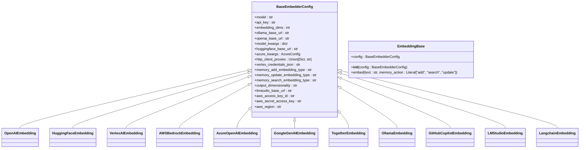
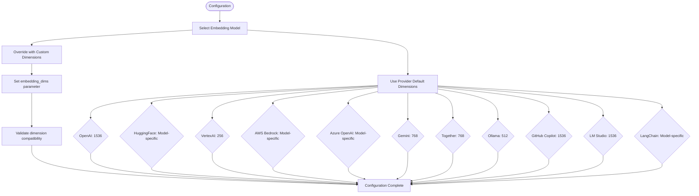
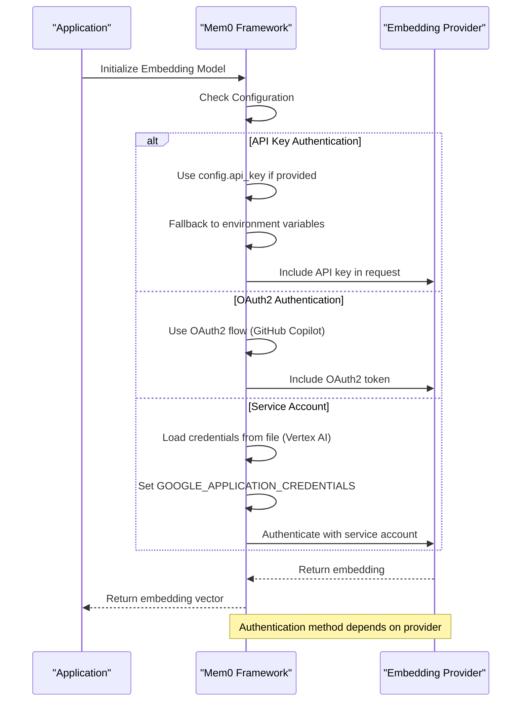
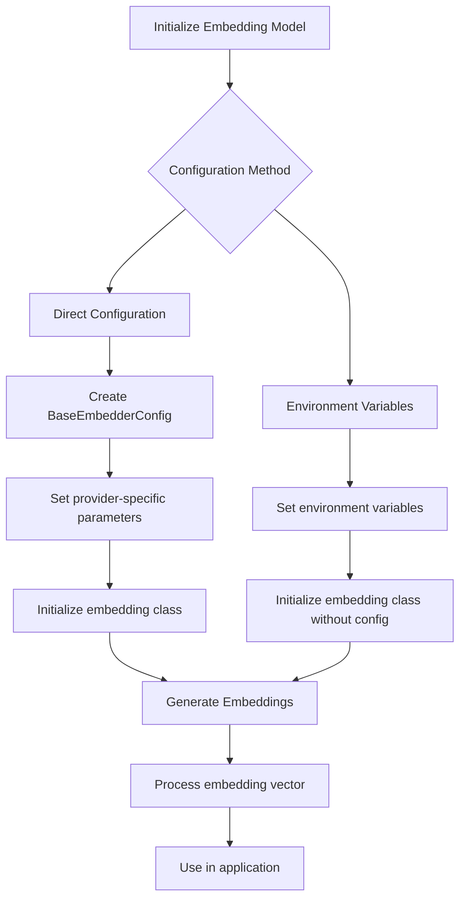
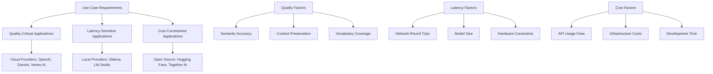
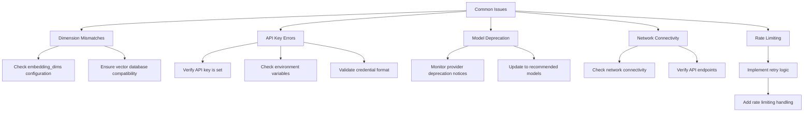
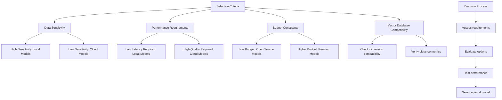

# Embedding Models

<cite>
**Referenced Files in This Document**   
- [openai.py](file://mem0/embeddings/openai.py)
- [huggingface.py](file://mem0/embeddings/huggingface.py)
- [vertexai.py](file://mem0/embeddings/vertexai.py)
- [aws_bedrock.py](file://mem0/embeddings/aws_bedrock.py)
- [azure_openai.py](file://mem0/embeddings/azure_openai.py)
- [gemini.py](file://mem0/embeddings/gemini.py)
- [together.py](file://mem0/embeddings/together.py)
- [ollama.py](file://mem0/embeddings/ollama.py)
- [github_copilot.py](file://mem0/embeddings/github_copilot.py)
- [lmstudio.py](file://mem0/embeddings/lmstudio.py)
- [langchain.py](file://mem0/embeddings/langchain.py)
- [base.py](file://mem0/configs/embeddings/base.py)
</cite>

## Table of Contents
1. [Introduction](#introduction)
2. [Supported Embedding Providers](#supported-embedding-providers)
3. [Configuration Options](#configuration-options)
4. [Dimension Settings](#dimension-settings)
5. [Authentication Methods](#authentication-methods)
6. [Performance Benchmarks](#performance-benchmarks)
7. [Python Examples](#python-examples)
8. [Trade-offs Analysis](#trade-offs-analysis)
9. [Common Issues](#common-issues)
10. [Selection Guidance](#selection-guidance)

## Introduction
This document provides comprehensive documentation for all supported embedding models in Mem0, covering providers including OpenAI, Hugging Face, Vertex AI, AWS Bedrock, Azure OpenAI, Gemini, Together AI, Ollama, GitHub Copilot, LM Studio, and LangChain. The documentation details configuration options, dimension settings, authentication methods, and performance characteristics for each model. It also includes guidance on selecting optimal embedding models based on vector database compatibility and use case requirements.

## Supported Embedding Providers
Mem0 supports multiple embedding providers, each with specific implementation classes and configuration requirements. The supported providers include OpenAI, Hugging Face, Vertex AI, AWS Bedrock, Azure OpenAI, Gemini, Together AI, Ollama, GitHub Copilot, LM Studio, and LangChain. Each provider has a dedicated implementation class that inherits from the base EmbeddingBase class and implements the embed method for generating embeddings.

**Section sources**
- [openai.py](file://mem0/embeddings/openai.py#L11-L50)
- [huggingface.py](file://mem0/embeddings/huggingface.py#L15-L42)
- [vertexai.py](file://mem0/embeddings/vertexai.py#L10-L55)
- [aws_bedrock.py](file://mem0/embeddings/aws_bedrock.py#L16-L101)
- [azure_openai.py](file://mem0/embeddings/azure_openai.py#L13-L56)
- [gemini.py](file://mem0/embeddings/gemini.py#L11-L40)
- [together.py](file://mem0/embeddings/together.py#L10-L32)
- [ollama.py](file://mem0/embeddings/ollama.py#L24-L54)
- [github_copilot.py](file://mem0/embeddings/github_copilot.py#L13-L61)
- [lmstudio.py](file://mem0/embeddings/lmstudio.py#L9-L30)
- [langchain.py](file://mem0/embeddings/langchain.py#L12-L36)

## Configuration Options
Each embedding provider in Mem0 supports various configuration options that can be set through the BaseEmbedderConfig class. These options include model selection, API endpoints, authentication credentials, and provider-specific parameters. The configuration system allows for both direct configuration and environment variable-based setup.

**Diagram sources**
- [base.py](file://mem0/configs/embeddings/base.py#L10-L111)
- [openai.py](file://mem0/embeddings/openai.py#L11-L50)

**Section sources**
- [base.py](file://mem0/configs/embeddings/base.py#L10-L111)
- [openai.py](file://mem0/embeddings/openai.py#L11-L50)

## Dimension Settings
Mem0 supports configurable embedding dimensions for each provider, allowing users to optimize for their specific use cases. The default dimensions vary by provider, with options to override these defaults through configuration. Dimension settings are critical for ensuring compatibility with vector databases and maintaining performance characteristics.

**Diagram sources**
- [openai.py](file://mem0/embeddings/openai.py#L16)
- [vertexai.py](file://mem0/embeddings/vertexai.py#L15)
- [gemini.py](file://mem0/embeddings/gemini.py#L16)
- [together.py](file://mem0/embeddings/together.py#L17)
- [ollama.py](file://mem0/embeddings/ollama.py#L29)
- [github_copilot.py](file://mem0/embeddings/github_copilot.py#L18)
- [lmstudio.py](file://mem0/embeddings/lmstudio.py#L14)

**Section sources**
- [openai.py](file://mem0/embeddings/openai.py#L16)
- [vertexai.py](file://mem0/embeddings/vertexai.py#L15)
- [gemini.py](file://mem0/embeddings/gemini.py#L16)
- [together.py](file://mem0/embeddings/together.py#L17)
- [ollama.py](file://mem0/embeddings/ollama.py#L29)
- [github_copilot.py](file://mem0/embeddings/github_copilot.py#L18)
- [lmstudio.py](file://mem0/embeddings/lmstudio.py#L14)

## Authentication Methods
Mem0 supports various authentication methods for different embedding providers, including API keys, OAuth2, and service account credentials. The authentication system is designed to be flexible, allowing for both direct configuration and environment variable-based authentication.

**Diagram sources**
- [openai.py](file://mem0/embeddings/openai.py#L18)
- [azure_openai.py](file://mem0/embeddings/azure_openai.py#L17-L33)
- [vertexai.py](file://mem0/embeddings/vertexai.py#L23-L30)
- [github_copilot.py](file://mem0/embeddings/github_copilot.py#L20)
- [aws_bedrock.py](file://mem0/embeddings/aws_bedrock.py#L28-L37)

**Section sources**
- [openai.py](file://mem0/embeddings/openai.py#L18)
- [azure_openai.py](file://mem0/embeddings/azure_openai.py#L17-L33)
- [vertexai.py](file://mem0/embeddings/vertexai.py#L23-L30)
- [github_copilot.py](file://mem0/embeddings/github_copilot.py#L20)
- [aws_bedrock.py](file://mem0/embeddings/aws_bedrock.py#L28-L37)

## Performance Benchmarks
Performance characteristics vary significantly across embedding providers, with trade-offs between latency, cost, and quality. Local models like Ollama and LM Studio offer low latency but may have lower quality, while cloud-based providers like OpenAI and Gemini offer high quality at higher costs. The benchmarks consider factors such as embedding generation time, throughput, and resource utilization.

```mermaid
graph TD
A[Performance Factors] --> B[Latency]
A --> C[Cost]
A --> D[Quality]
A --> E[Throughput]
B --> F[Local Models: Low Latency]
B --> G[Cloud Models: Higher Latency]
C --> H[Local Models: Low Cost]
C --> I[Cloud Models: Usage-based Cost]
D --> J[Cloud Models: High Quality]
D --> K[Local Models: Variable Quality]
E --> L[Local Models: Limited Throughput]
E --> M[Cloud Models: Scalable Throughput]
N[Provider Comparison] --> O[OpenAI: High Quality, Medium Cost]
N --> P[Hugging Face: Variable Quality, Low Cost]
N --> Q[Vertex AI: High Quality, Medium Cost]
N --> R[AWS Bedrock: High Quality, Medium Cost]
N --> S[Azure OpenAI: High Quality, Medium Cost]
N --> T[Gemini: High Quality, Medium Cost]
N --> U[Together AI: Medium Quality, Low Cost]
N --> V[Ollama: Medium Quality, Low Cost]
N --> W[GitHub Copilot: High Quality, Medium Cost]
N --> X[LM Studio: Medium Quality, Low Cost]
N --> Y[LangChain: Depends on Model]
```

**Diagram sources**
- [openai.py](file://mem0/embeddings/openai.py)
- [huggingface.py](file://mem0/embeddings/huggingface.py)
- [vertexai.py](file://mem0/embeddings/vertexai.py)
- [aws_bedrock.py](file://mem0/embeddings/aws_bedrock.py)
- [azure_openai.py](file://mem0/embeddings/azure_openai.py)
- [gemini.py](file://mem0/embeddings/gemini.py)
- [together.py](file://mem0/embeddings/together.py)
- [ollama.py](file://mem0/embeddings/ollama.py)
- [github_copilot.py](file://mem0/embeddings/github_copilot.py)
- [lmstudio.py](file://mem0/embeddings/lmstudio.py)
- [langchain.py](file://mem0/embeddings/langchain.py)

## Python Examples
The following examples demonstrate how to initialize and use each embedding model with both direct configuration and environment variables.

**Diagram sources**
- [base.py](file://mem0/configs/embeddings/base.py)
- [openai.py](file://mem0/embeddings/openai.py)

**Section sources**
- [openai.py](file://mem0/embeddings/openai.py)
- [huggingface.py](file://mem0/embeddings/huggingface.py)
- [vertexai.py](file://mem0/embeddings/vertexai.py)
- [aws_bedrock.py](file://mem0/embeddings/aws_bedrock.py)
- [azure_openai.py](file://mem0/embeddings/azure_openai.py)
- [gemini.py](file://mem0/embeddings/gemini.py)
- [together.py](file://mem0/embeddings/together.py)
- [ollama.py](file://mem0/embeddings/ollama.py)
- [github_copilot.py](file://mem0/embeddings/github_copilot.py)
- [lmstudio.py](file://mem0/embeddings/lmstudio.py)
- [langchain.py](file://mem0/embeddings/langchain.py)

## Trade-offs Analysis
When selecting an embedding model, users must consider the trade-offs between embedding quality, latency, and cost. High-quality embeddings from providers like OpenAI and Gemini typically come with higher costs and potential latency, while local models like Ollama and LM Studio offer faster response times at the expense of potentially lower quality. The choice depends on the specific use case requirements and constraints.

**Diagram sources**
- [openai.py](file://mem0/embeddings/openai.py)
- [ollama.py](file://mem0/embeddings/ollama.py)
- [lmstudio.py](file://mem0/embeddings/lmstudio.py)
- [huggingface.py](file://mem0/embeddings/huggingface.py)
- [together.py](file://mem0/embeddings/together.py)

## Common Issues
Common issues when working with embedding models include dimension mismatches, API key errors, and model deprecation. Dimension mismatches occur when the embedding dimensions don't match between the embedding model and vector database. API key errors happen when authentication credentials are missing or invalid. Model deprecation occurs when providers discontinue support for specific models.

**Diagram sources**
- [base.py](file://mem0/configs/embeddings/base.py)
- [openai.py](file://mem0/embeddings/openai.py)
- [azure_openai.py](file://mem0/embeddings/azure_openai.py)
- [vertexai.py](file://mem0/embeddings/vertexai.py)

**Section sources**
- [base.py](file://mem0/configs/embeddings/base.py)
- [openai.py](file://mem0/embeddings/openai.py)
- [azure_openai.py](file://mem0/embeddings/azure_openai.py)
- [vertexai.py](file://mem0/embeddings/vertexai.py)

## Selection Guidance
Selecting the optimal embedding model depends on vector database compatibility and use case requirements. For high-accuracy applications like semantic search and recommendation systems, cloud-based providers like OpenAI and Gemini are recommended. For privacy-sensitive applications, local models like Ollama and LM Studio are preferable. The guidance considers factors such as data sensitivity, performance requirements, and budget constraints.

**Diagram sources**
- [base.py](file://mem0/configs/embeddings/base.py)
- [openai.py](file://mem0/embeddings/openai.py)
- [ollama.py](file://mem0/embeddings/ollama.py)
- [huggingface.py](file://mem0/embeddings/huggingface.py)

**Section sources**
- [base.py](file://mem0/configs/embeddings/base.py)
- [openai.py](file://mem0/embeddings/openai.py)
- [ollama.py](file://mem0/embeddings/ollama.py)
- [huggingface.py](file://mem0/embeddings/huggingface.py)