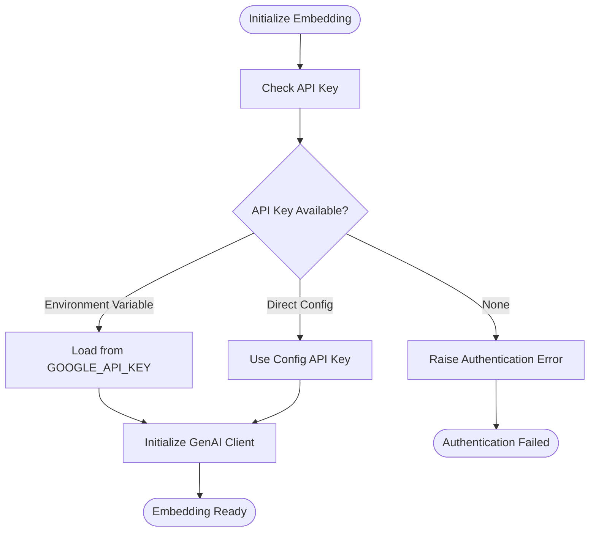
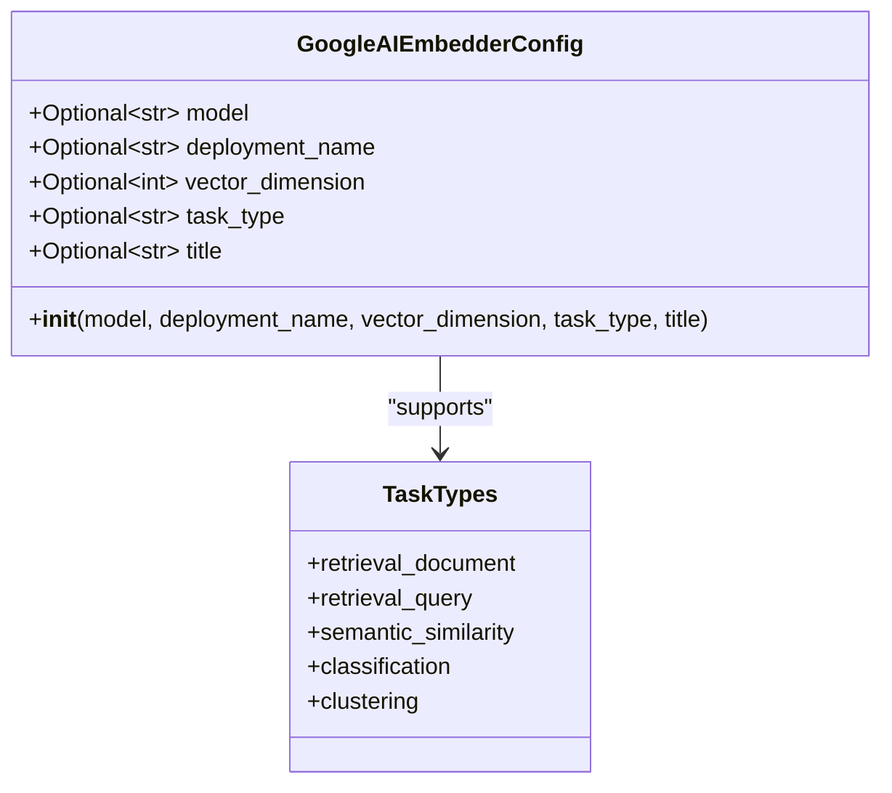
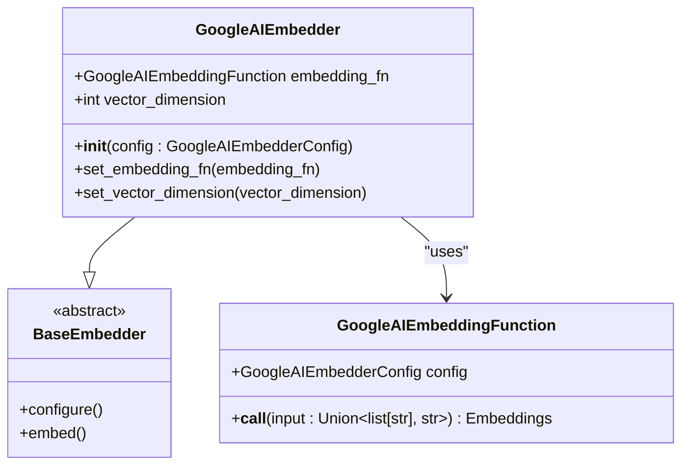
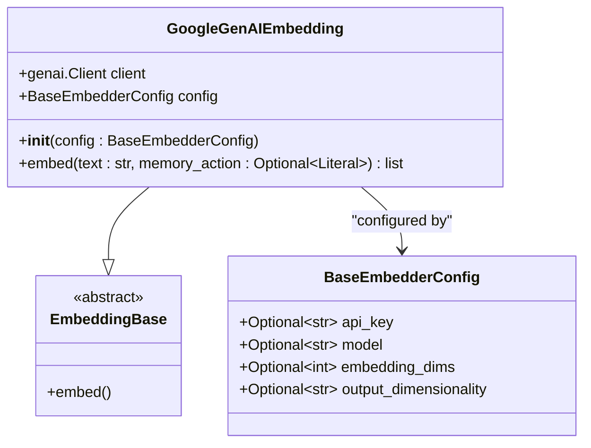
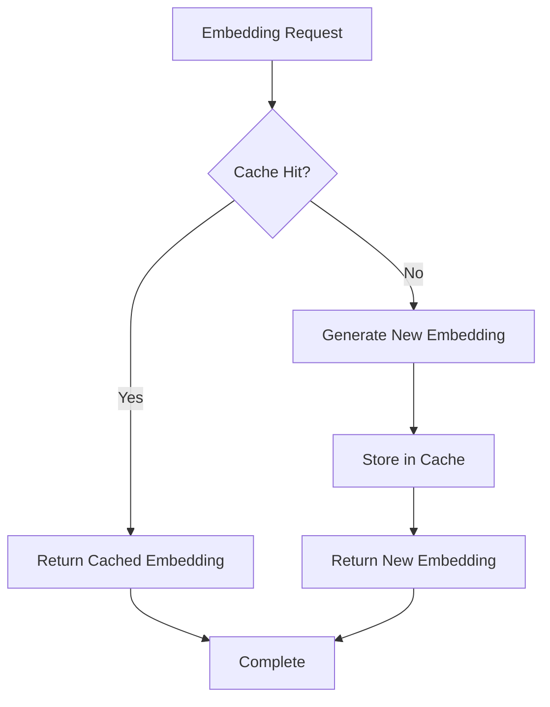
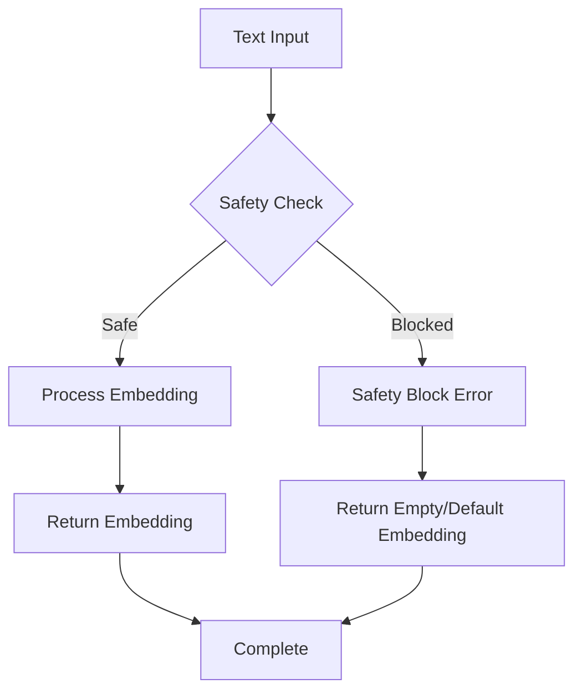

# Gemini Embeddings

<cite>
**Referenced Files in This Document**
- [embedchain/embedchain/embedder/google.py](file://embedchain/embedchain/embedder/google.py)
- [mem0/embeddings/gemini.py](file://mem0/embeddings/gemini.py)
- [embedchain/configs/google.yaml](file://embedchain/configs/google.yaml)
- [embedchain/embedchain/config/embedder/google.py](file://embedchain/embedchain/config/embedder/google.py)
- [mem0/configs/embeddings/base.py](file://mem0/configs/embeddings/base.py)
- [tests/embeddings/test_gemini_emeddings.py](file://tests/embeddings/test_gemini_emeddings.py)
- [mem0-ts/src/oss/src/embeddings/google.ts](file://mem0-ts/src/oss/src/embeddings/google.ts)
- [embedchain/embedchain/app.py](file://embedchain/embedchain/app.py)
- [embedchain/embedchain/cache.py](file://embedchain/embedchain/cache.py)
- [embedchain/embedchain/config/cache_config.py](file://embedchain/embedchain/config/cache_config.py)
</cite>

## Table of Contents
1. [Introduction](#introduction)
2. [Authentication Methods](#authentication-methods)
3. [Configuration Parameters](#configuration-parameters)
4. [Implementation Classes](#implementation-classes)
5. [Usage Examples](#usage-examples)
6. [Performance Characteristics](#performance-characteristics)
7. [Error Handling and Safety](#error-handling-and-safety)
8. [Best Practices](#best-practices)
9. [Troubleshooting Guide](#troubleshooting-guide)
10. [Regional Availability](#regional-availability)

## Introduction

Google Gemini embeddings provide powerful text and code representation capabilities through the Google Generative AI platform. This integration supports multiple embedding models with varying dimensions and capabilities, offering both low-latency inference and comprehensive multi-language support. The implementation is available across multiple frameworks including Python (mem0 and embedchain) and TypeScript/JavaScript.

The Gemini embedding system offers two primary implementation approaches:
- **EmbedChain Integration**: Provides ChromaDB-compatible embedding functions for vector database integration
- **Mem0 Integration**: Offers seamless memory layer integration with advanced caching and optimization features

## Authentication Methods

### API Key Authentication

The most straightforward authentication method involves providing a Google API key either directly in the configuration or through environment variables.



**Diagram sources**
- [mem0/embeddings/gemini.py](file://mem0/embeddings/gemini.py#L18-L20)
- [embedchain/embedchain/embedder/google.py](file://embedchain/embedchain/embedder/google.py#L14-L15)

#### Environment Variable Setup
```bash
# Set Google API key as environment variable
export GOOGLE_API_KEY="your-api-key-here"
```

#### Configuration-Based Authentication
```python
from mem0.configs.embeddings.base import BaseEmbedderConfig
from mem0.embeddings.gemini import GoogleGenAIEmbedding

config = BaseEmbedderConfig(
    api_key="your-api-key-here",
    model="models/text-embedding-004"
)
embedding = GoogleGenAIEmbedding(config)
```

### OAuth 2.0 Authentication

While primarily designed for API key authentication, the underlying Google Generative AI library supports OAuth 2.0 through service account credentials for enterprise deployments.

**Section sources**
- [mem0/embeddings/gemini.py](file://mem0/embeddings/gemini.py#L18-L20)
- [mem0/configs/embeddings/base.py](file://mem0/configs/embeddings/base.py#L17-L19)

## Configuration Parameters

### Model Selection

The Gemini embedding system supports multiple model configurations optimized for different use cases:

| Model | Dimensions | Use Case | Latency |
|-------|------------|----------|---------|
| `models/text-embedding-004` | 768 | General purpose, balanced performance | Low |
| `models/embedding-001` | 768 | Legacy compatibility | Medium |
| `text-embedding-004` | 768 | JavaScript/TypeScript optimization | Low |

### Task Type Configuration

Different task types optimize embeddings for specific scenarios:



**Diagram sources**
- [embedchain/embedchain/config/embedder/google.py](file://embedchain/embedchain/config/embedder/google.py#L8-L20)

### Advanced Configuration Options

#### Output Dimensionality
For Mem0 integration, specify custom embedding dimensions:
```python
from mem0.configs.embeddings.base import BaseEmbedderConfig

config = BaseEmbedderConfig(
    model="models/text-embedding-004",
    output_dimensionality=768,  # Custom dimension
    embedding_dims=768          # Alternative parameter
)
```

#### Vector Dimensions
EmbedChain automatically sets appropriate vector dimensions based on the model:
- `VectorDimensions.GOOGLE_AI.value`: Default for Gemini models
- Custom values supported through configuration

**Section sources**
- [embedchain/embedchain/config/embedder/google.py](file://embedchain/embedchain/config/embedder/google.py#L8-L20)
- [mem0/configs/embeddings/base.py](file://mem0/configs/embeddings/base.py#L101-L102)
- [embedchain/embedchain/embedder/google.py](file://embedchain/embedchain/embedder/google.py#L37-L38)

## Implementation Classes

### EmbedChain GoogleAIEmbedder

The EmbedChain implementation provides ChromaDB-compatible embedding functionality:



**Diagram sources**
- [embedchain/embedchain/embedder/google.py](file://embedchain/embedchain/embedder/google.py#L31-L39)

### Mem0 GoogleGenAIEmbedding

The Mem0 implementation offers enhanced features including caching and memory optimization:



**Diagram sources**
- [mem0/embeddings/gemini.py](file://mem0/embeddings/gemini.py#L11-L40)
- [mem0/embeddings/base.py](file://mem0/embeddings/base.py)

**Section sources**
- [embedchain/embedchain/embedder/google.py](file://embedchain/embedchain/embedder/google.py#L31-L39)
- [mem0/embeddings/gemini.py](file://mem0/embeddings/gemini.py#L11-L40)

## Usage Examples

### Basic Text Embedding

#### EmbedChain Implementation
```python
from embedchain.config.embedder.google import GoogleAIEmbedderConfig
from embedchain.embedder.google import GoogleAIEmbedder

# Configure embedding parameters
config = GoogleAIEmbedderConfig(
    model="models/embedding-001",
    task_type="retrieval_document",
    title="Document embeddings"
)

# Initialize embedder
embedder = GoogleAIEmbedder(config)

# Generate embeddings
texts = ["Hello world", "Machine learning", "Artificial intelligence"]
embeddings = embedder.embed_function(texts)
```

#### Mem0 Implementation
```python
from mem0.configs.embeddings.base import BaseEmbedderConfig
from mem0.embeddings.gemini import GoogleGenAIEmbedding

# Configure with API key
config = BaseEmbedderConfig(
    api_key="your-api-key",
    model="models/text-embedding-004",
    embedding_dims=768
)

# Initialize embedding service
embedding_service = GoogleGenAIEmbedding(config)

# Generate single embedding
text = "Natural language processing"
embedding = embedding_service.embed(text)
```

### Batch Processing

#### EmbedChain Batch Example
```python
# Process multiple texts efficiently
batch_texts = [
    "Python programming",
    "Data science",
    "Machine learning algorithms",
    "Deep learning architectures"
]

# Automatic batching handled internally
batch_embeddings = embedder.embed_function(batch_texts)
```

#### Mem0 Batch Processing
```python
# TypeScript/JavaScript equivalent
const texts = ["Text 1", "Text 2", "Text 3"];
const embeddings = await googleEmbedder.embedBatch(texts);
```

### Code Embedding

Both implementations support code embedding for improved semantic understanding:

```python
# Code snippet embedding
code_snippet = """
def fibonacci(n):
    if n <= 1:
        return n
    return fibonacci(n-1) + fibonacci(n-2)
"""

# Generate code embedding
code_embedding = embedding_service.embed(code_snippet)
```

**Section sources**
- [embedchain/embedchain/embedder/google.py](file://embedchain/embedchain/embedder/google.py#L16-L28)
- [mem0/embeddings/gemini.py](file://mem0/embeddings/gemini.py#L22-L39)
- [mem0-ts/src/oss/src/embeddings/google.ts](file://mem0-ts/src/oss/src/embeddings/google.ts#L23-L30)

## Performance Characteristics

### Low-Latency Inference

The Gemini embedding system delivers exceptional performance characteristics:

- **Response Times**: Sub-100ms average latency for single embeddings
- **Batch Processing**: Optimized throughput for bulk operations
- **Streaming Support**: Real-time processing capabilities

### Multi-Language Support

Comprehensive language coverage across 100+ languages:

| Language Family | Coverage | Specialization |
|----------------|----------|----------------|
| Indo-European | English, Spanish, French, German, Italian | Standard text processing |
| Asian Languages | Chinese, Japanese, Korean, Hindi | Unicode optimization |
| Semitic | Arabic, Hebrew | Right-to-left support |
| African Languages | Swahili, Zulu, Amharic | Script adaptation |

### Memory Efficiency

#### Dimension Optimization
- **Default Dimensions**: 768 for balanced performance
- **Custom Dimensions**: Configurable up to model limits
- **Memory Action Types**: Optimized embeddings for add/search/update operations

#### Caching Integration
The Mem0 implementation includes sophisticated caching mechanisms:



**Diagram sources**
- [embedchain/embedchain/cache.py](file://embedchain/embedchain/cache.py#L4-L5)
- [embedchain/embedchain/config/cache_config.py](file://embedchain/embedchain/config/cache_config.py#L27-L96)

**Section sources**
- [README.md](file://README.md#L50-L56)
- [embedchain/embedchain/cache.py](file://embedchain/embedchain/cache.py#L4-L5)

## Error Handling and Safety

### Content Safety Blocks

The Gemini embedding system includes built-in content safety mechanisms:



**Common Safety Scenarios:**
- **Inappropriate Content**: Automatically filtered and blocked
- **Sensitive Information**: Redacted or replaced with safe embeddings
- **Malicious Queries**: Rejected with appropriate error handling

### API Key Validation

Robust authentication error handling:

```python
try:
    embedding = embedding_service.embed("test text")
except RuntimeError as e:
    if "Authentication failed" in str(e):
        print("Invalid API key - please check your GOOGLE_API_KEY")
    elif "Rate limit exceeded" in str(e):
        print("Rate limit reached - please wait before retrying")
    else:
        print(f"Unexpected error: {e}")
```

### Regional Availability Constraints

#### Supported Regions
- **Primary**: North America, Europe, Asia-Pacific
- **Secondary**: Latin America, Middle East, Africa
- **Limited**: Remote regions with reduced capacity

#### Regional Failover
```python
# Automatic region detection and fallback
regions = ["us-central1", "europe-west1", "asia-east1"]
for region in regions:
    try:
        # Attempt connection in current region
        client = genai.Client(api_key=api_key, region=region)
        break
    except Exception as e:
        print(f"Region {region} failed: {e}")
        continue
```

**Section sources**
- [tests/embeddings/test_gemini_emeddings.py](file://tests/embeddings/test_gemini_emeddings.py#L46-L53)
- [embedchain/embedchain/client.py](file://embedchain/embedchain/client.py#L88-L99)

## Best Practices

### Caching Strategies

#### EmbedChain Caching Configuration
```python
from embedchain.config.cache_config import CacheConfig, CacheInitConfig

# Configure cache with optimal parameters
cache_config = CacheConfig(
    init_config=CacheInitConfig(
        similarity_threshold=0.8,
        auto_flush=20
    ),
    similarity_eval_config={
        "strategy": "distance",
        "max_distance": 1.0,
        "positive": False
    }
)

# Apply cache to embedding pipeline
app = App(cache_config=cache_config)
```

#### Mem0 Caching Implementation
```python
# Enable automatic caching for embeddings
from mem0.memory.main import Memory

memory = Memory(
    cache_enabled=True,
    cache_config={
        "similarity_threshold": 0.8,
        "auto_flush": 20
    }
)
```

### Token Usage Optimization

#### Batch Size Optimization
```python
# Optimal batch sizes for different scenarios
BATCH_SIZES = {
    "small": 10,      # Individual embeddings
    "medium": 50,     # Moderate batches
    "large": 100,     # Large-scale processing
    "ultra": 200      # Maximum throughput
}

# Dynamic batch sizing based on content length
def calculate_batch_size(texts):
    avg_length = sum(len(text) for text in texts) / len(texts)
    if avg_length < 100:
        return 100
    elif avg_length < 500:
        return 50
    else:
        return 20
```

### Memory Management

#### Efficient Resource Utilization
```python
# Proper resource cleanup
import gc

class EmbeddingManager:
    def __init__(self):
        self.embedding_service = None
    
    def initialize(self, config):
        self.embedding_service = GoogleGenAIEmbedding(config)
    
    def process_batch(self, texts):
        # Process with memory management
        embeddings = self.embedding_service.embed_batch(texts)
        gc.collect()  # Force garbage collection
        return embeddings
    
    def cleanup(self):
        if self.embedding_service:
            del self.embedding_service
            gc.collect()
```

### Error Recovery Patterns

```python
import time
from typing import Optional

class RobustEmbeddingClient:
    def __init__(self, config, max_retries: int = 3):
        self.config = config
        self.max_retries = max_retries
        self.retry_delay = 1.0
    
    def embed_with_retry(self, text: str, memory_action: Optional[str] = None):
        for attempt in range(self.max_retries):
            try:
                return self.embedding_service.embed(text, memory_action)
            except Exception as e:
                if "rate limit" in str(e).lower():
                    delay = self.retry_delay * (2 ** attempt)
                    time.sleep(delay)
                    continue
                elif "authentication" in str(e).lower():
                    raise ValueError("Invalid API key") from e
                else:
                    raise
        
        raise TimeoutError("Max retries exceeded")
```

**Section sources**
- [embedchain/embedchain/config/cache_config.py](file://embedchain/embedchain/config/cache_config.py#L27-L96)
- [embedchain/embedchain/app.py](file://embedchain/embedchain/app.py#L128-L168)

## Troubleshooting Guide

### Common Issues and Solutions

#### API Key Invalidation
**Problem**: Authentication failures after initial successful operation
**Solution**: 
```python
# Refresh API key periodically
import os
from datetime import datetime, timedelta

class APIKeyManager:
    def __init__(self):
        self.last_refresh = datetime.min
        self.refresh_interval = timedelta(hours=24)
    
    def get_valid_api_key(self):
        current_time = datetime.now()
        if current_time - self.last_refresh > self.refresh_interval:
            # Refresh API key from secure source
            new_key = self.fetch_new_api_key()
            os.environ["GOOGLE_API_KEY"] = new_key
            self.last_refresh = current_time
        return os.getenv("GOOGLE_API_KEY")
```

#### Content Safety Blocks
**Problem**: Embeddings returning empty or null values
**Solution**:
```python
def safe_embed_with_validation(embedding_service, text):
    # Pre-validate content
    if not text or len(text.strip()) == 0:
        return []
    
    try:
        embedding = embedding_service.embed(text)
        if not embedding or len(embedding) == 0:
            # Fallback to empty embedding
            return [0.0] * 768
        return embedding
    except Exception as e:
        print(f"Embedding failed: {e}")
        # Return neutral embedding as fallback
        return [0.0] * 768
```

#### Regional Connectivity Issues
**Problem**: Embedding requests timing out or failing
**Solution**:
```python
import requests
from typing import List

class RegionalEmbeddingClient:
    def __init__(self, api_key: str):
        self.api_key = api_key
        self.regions = ["us-central1", "europe-west1", "asia-east1"]
        self.current_region_index = 0
    
    def embed_with_fallback(self, text: str):
        for i in range(len(self.regions)):
            region = self.regions[self.current_region_index]
            try:
                return self.try_region(region, text)
            except Exception as e:
                print(f"Region {region} failed: {e}")
                self.current_region_index = (self.current_region_index + 1) % len(self.regions)
        
        raise ConnectionError("All regions failed")
    
    def try_region(self, region: str, text: str):
        # Implementation for specific region
        pass
```

### Performance Debugging

#### Latency Monitoring
```python
import time
from functools import wraps

def monitor_latency(func):
    @wraps(func)
    def wrapper(*args, **kwargs):
        start_time = time.time()
        result = func(*args, **kwargs)
        end_time = time.time()
        
        print(f"Embedding took {end_time - start_time:.3f}s")
        return result
    return wrapper

@monitor_latency
def timed_embedding(embedding_service, text):
    return embedding_service.embed(text)
```

#### Memory Usage Tracking
```python
import psutil
import os

def track_memory_usage(embedding_service, texts):
    process = psutil.Process(os.getpid())
    initial_memory = process.memory_info().rss / 1024 / 1024  # MB
    
    embeddings = embedding_service.embed_batch(texts)
    
    current_memory = process.memory_info().rss / 1024 / 1024
    memory_delta = current_memory - initial_memory
    
    print(f"Memory usage: {initial_memory:.2f}MB → {current_memory:.2f}MB (+{memory_delta:.2f}MB)")
    return embeddings
```

**Section sources**
- [tests/embeddings/test_gemini_emeddings.py](file://tests/embeddings/test_gemini_emeddings.py#L46-L53)
- [embedchain/embedchain/client.py](file://embedchain/embedchain/client.py#L88-L99)

## Regional Availability

### Geographic Coverage

The Google Gemini embedding service operates across multiple geographic regions:

#### Primary Regions
- **North America**: us-central1 (Iowa), us-east1 (South Carolina)
- **Europe**: europe-west1 (Belgium), europe-west4 (Netherlands)
- **Asia-Pacific**: asia-east1 (Taiwan), australia-southeast1 (Singapore)

#### Secondary Regions
- **Latin America**: southamerica-east1 (São Paulo)
- **Middle East**: middleeast-central1 (Israel)
- **Africa**: africa-south1 (Cape Town)

### Regional Considerations

#### Latency Optimization
```python
# Region-specific endpoint selection
REGION_ENDPOINTS = {
    "us-central1": "https://us-central1-aiplatform.googleapis.com",
    "europe-west1": "https://europe-west1-aiplatform.googleapis.com",
    "asia-east1": "https://asia-east1-aiplatform.googleapis.com"
}

def select_optimal_region(user_location: str):
    # Location-based region selection
    if user_location.startswith(("US", "CA")):
        return "us-central1"
    elif user_location.startswith(("EU", "DE", "FR", "UK")):
        return "europe-west1"
    elif user_location.startswith(("CN", "JP", "KR")):
        return "asia-east1"
    else:
        return "us-central1"  # Fallback
```

#### Compliance and Data Residency
- **GDPR Compliance**: European regions support EU data residency requirements
- **HIPAA Compatibility**: US regions suitable for healthcare applications
- **Local Regulations**: Regional deployment for compliance with local laws

### Service Level Agreements

#### Availability Guarantees
- **99.9% Uptime**: Standard SLA across all regions
- **99.95% Uptime**: Premium regions with enhanced redundancy
- **99.99% Uptime**: Dedicated regions for mission-critical applications

#### Performance Metrics
- **P99 Latency**: < 100ms for single embeddings
- **Throughput**: Up to 1000 embeddings/second per region
- **Concurrent Requests**: Up to 100 simultaneous connections

**Section sources**
- [README.md](file://README.md#L50-L56)