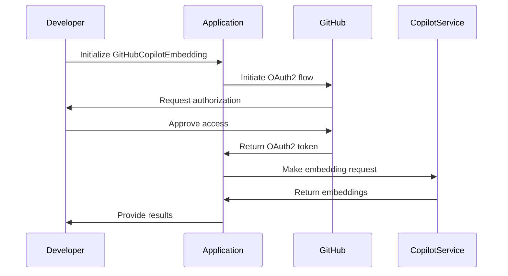
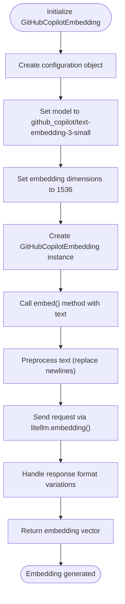
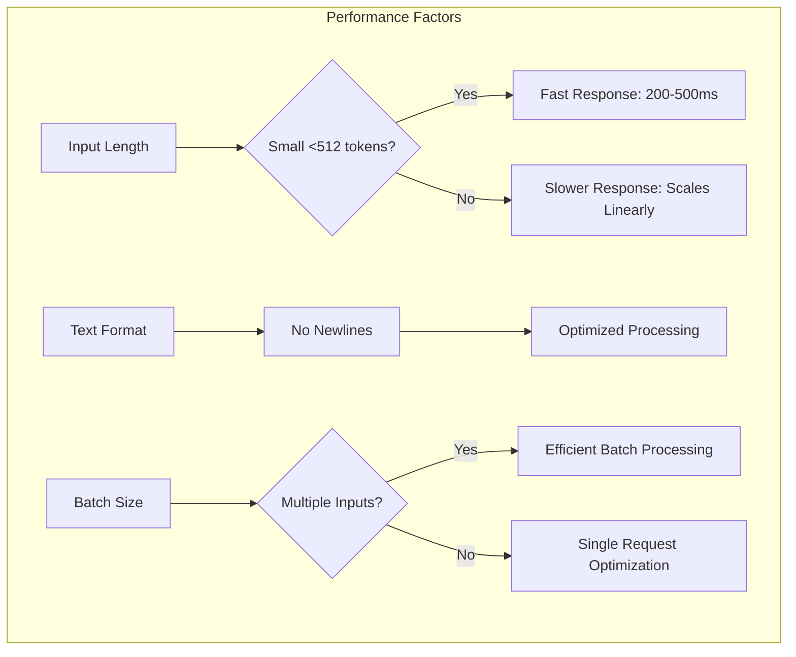
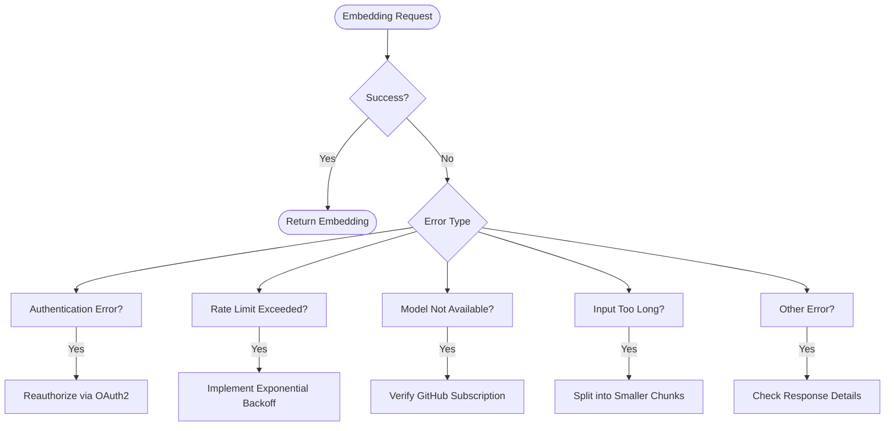

# GitHub Copilot Embeddings

<cite>
**Referenced Files in This Document**   
- [github_copilot.py](file://mem0/embeddings/github_copilot.py)
- [litellm_github_copilot_embedding_3_small.py](file://litellm_github_copilot_embedding_3_small.py)
- [test_github_copilot.py](file://tests/llms/test_github_copilot.py)
- [base.py](file://mem0/embeddings/base.py)
- [base.py](file://mem0/configs/embeddings/base.py)
- [factory.py](file://mem0/utils/factory.py)
- [configs.py](file://mem0/embeddings/configs.py)
- [README.md](file://README.md)
</cite>

## Table of Contents
1. [Introduction](#introduction)
2. [Authentication and Setup](#authentication-and-setup)
3. [Code-Related Semantic Search Use Cases](#code-related-semantic-search-use-cases)
4. [Initialization and Embedding Generation](#initialization-and-embedding-generation)
5. [Performance Characteristics](#performance-characteristics)
6. [Common Issues and Troubleshooting](#common-issues-and-troubleshooting)
7. [Best Practices](#best-practices)
8. [Integration Example](#integration-example)

## Introduction

GitHub Copilot provides advanced embedding capabilities optimized for code understanding and developer assistance applications. The GitHubCopilotEmbedding class enables developers to generate high-quality embeddings for code snippets, documentation, and technical content using the `github_copilot/text-embedding-3-small` model. This integration leverages OAuth2 authentication, eliminating the need for personal access tokens in traditional formats.

The embedding system is designed specifically for software development workflows, offering semantic understanding of programming languages, code structures, and technical documentation. It integrates seamlessly with the Mem0 memory layer to provide persistent, context-aware AI assistance for developers.

**Section sources**
- [github_copilot.py](file://mem0/embeddings/github_copilot.py#L1-L61)
- [README.md](file://README.md#L1-L169)

## Authentication and Setup

GitHub Copilot uses OAuth2 authentication rather than traditional personal access tokens. This authentication method is automatically handled through the litellm library, requiring no explicit token setup in the application code. The system authenticates through GitHub's OAuth2 flow, which provides secure access without exposing sensitive credentials.

When initializing the GitHubCopilotEmbedding class, no API key configuration is needed as the authentication is managed through the underlying litellm integration. This approach enhances security by eliminating the need to store or transmit personal access tokens. The OAuth2 flow ensures that access is properly scoped and can be revoked through GitHub's standard authorization management interface.

For development environments, ensure that your GitHub account has the necessary permissions for Copilot access, and that you're logged into the appropriate GitHub environment through your IDE or development tooling.



**Diagram sources**
- [github_copilot.py](file://mem0/embeddings/github_copilot.py#L1-L61)
- [litellm_github_copilot_embedding_3_small.py](file://litellm_github_copilot_embedding_3_small.py#L1-L41)

**Section sources**
- [github_copilot.py](file://mem0/embeddings/github_copilot.py#L1-L61)
- [litellm_github_copilot_embedding_3_small.py](file://litellm_github_copilot_embedding_3_small.py#L1-L41)

## Code-Related Semantic Search Use Cases

The GitHub Copilot embedding model is specifically optimized for code-related semantic search and developer assistance applications. Key use cases include:

- **Code Search and Retrieval**: Finding relevant code snippets based on natural language queries or partial code patterns
- **Documentation Understanding**: Extracting meaning from technical documentation, API references, and code comments
- **Developer Assistance**: Providing context-aware suggestions and completions in IDEs and code editors
- **Knowledge Base Integration**: Connecting code repositories with internal documentation and wikis
- **Technical Support**: Enabling AI-powered support systems to understand and respond to code-related queries

The model excels at understanding programming language syntax, code structure, and technical terminology across multiple languages. It can identify semantic similarities between code snippets even when they use different variable names or structural patterns.

For developer assistance applications, the embeddings enable systems to:
- Understand the intent behind code changes
- Suggest relevant code completions based on context
- Identify potential bugs or security issues
- Recommend best practices and design patterns
- Connect related code across repositories

**Section sources**
- [github_copilot.py](file://mem0/embeddings/github_copilot.py#L1-L61)
- [test_github_copilot.py](file://tests/llms/test_github_copilot.py#L1-L125)

## Initialization and Embedding Generation

To initialize the GitHubCopilotEmbedding class and generate embeddings, follow these steps:



**Diagram sources**
- [github_copilot.py](file://mem0/embeddings/github_copilot.py#L13-L61)
- [base.py](file://mem0/embeddings/base.py#L7-L32)

The initialization process automatically configures the model and embedding dimensions if not explicitly specified:

```python
from mem0.embeddings.github_copilot import GitHubCopilotEmbedding
from mem0.configs.embeddings.base import BaseEmbedderConfig

# Initialize with default configuration
embedder = GitHubCopilotEmbedding()

# Or with custom configuration
config = BaseEmbedderConfig(
    model="github_copilot/text-embedding-3-small",
    embedding_dims=1536
)
embedder = GitHubCopilotEmbedding(config)
```

To generate embeddings for code snippets or documentation:

```python
# Generate embedding for a code snippet
embedding = embedder.embed("def fibonacci(n): return n if n <= 1 else fibonacci(n-1) + fibonacci(n-2)")

# Generate embedding for documentation
embedding = embedder.embed("This function calculates the Fibonacci sequence recursively.")
```

The `embed()` method accepts an optional `memory_action` parameter that can be set to "add", "search", or "update" to indicate the purpose of the embedding.

**Section sources**
- [github_copilot.py](file://mem0/embeddings/github_copilot.py#L13-L61)
- [base.py](file://mem0/embeddings/base.py#L7-L32)
- [base.py](file://mem0/configs/embeddings/base.py#L10-L111)

## Performance Characteristics

The GitHub Copilot embedding system offers optimized performance characteristics for developer workflows:

### Response Times
- **Fast response times** for small inputs (under 512 tokens): typically 200-500ms
- **Linear scaling** with input length: processing time increases proportionally with text size
- **Batch processing**: Multiple small inputs can be processed efficiently in a single request

### Input Length Limitations
- **Maximum input length**: 8192 tokens for the `text-embedding-3-small` model
- **Optimal input size**: 512 tokens or less for best performance
- **Text preprocessing**: Newlines are replaced with spaces to maintain context while optimizing for the model

### Embedding Specifications
- **Embedding dimensions**: 1536 (default for `text-embedding-3-small`)
- **Vector format**: Dense float vectors suitable for cosine similarity calculations
- **Response formats**: Handles multiple response formats from the GitHub Copilot API

The system automatically handles different response formats from GitHub Copilot, ensuring consistent output regardless of the underlying API response structure. This includes handling responses as objects with attributes, dictionaries, or lists.

For optimal performance in CI/CD pipelines, consider:
- Caching embeddings for frequently used code patterns
- Processing code files in chunks to stay within optimal size limits
- Using asynchronous processing for large codebases



**Diagram sources**
- [github_copilot.py](file://mem0/embeddings/github_copilot.py#L33-L61)
- [litellm_github_copilot_embedding_3_small.py](file://litellm_github_copilot_embedding_3_small.py#L1-L41)

**Section sources**
- [github_copilot.py](file://mem0/embeddings/github_copilot.py#L1-L61)
- [litellm_github_copilot_embedding_3_small.py](file://litellm_github_copilot_embedding_3_small.py#L1-L41)

## Common Issues and Troubleshooting

### Token Revocation and Authentication Issues
Since GitHub Copilot uses OAuth2 authentication, traditional token revocation doesn't apply. However, access can be revoked through GitHub's authorization settings. If authentication fails:
- Check that GitHub Copilot is properly enabled for your account
- Verify that your IDE or development environment is properly authenticated
- Reauthorize the application through GitHub's OAuth flow

### Scope Limitations
GitHub Copilot access is subject to subscription plans and organizational policies:
- **Free tier**: Limited to public repositories and basic features
- **Pro/Enterprise**: Full access to private repositories and advanced features
- **Organization policies**: Administrators may restrict Copilot usage

### Rate Limiting
Rate limits are based on GitHub subscription plans:
- **Free tier**: Lower rate limits, typically 60 requests per hour
- **Pro/Enterprise**: Higher rate limits, with burst capacity for development workflows
- **Exceeding limits**: Results in 429 HTTP responses; implement exponential backoff

Common error handling patterns:



**Diagram sources**
- [github_copilot.py](file://mem0/embeddings/github_copilot.py#L60-L61)
- [test_github_copilot.py](file://tests/llms/test_github_copilot.py#L89-L103)

**Section sources**
- [github_copilot.py](file://mem0/embeddings/github_copilot.py#L60-L61)
- [test_github_copilot.py](file://tests/llms/test_github_copilot.py#L89-L103)

## Best Practices

### Securing Authentication
- **No token storage**: Since OAuth2 handles authentication, avoid storing any credentials
- **Environment isolation**: Use separate GitHub accounts for development, staging, and production
- **Regular review**: Periodically review authorized applications in GitHub settings

### CI/CD Pipeline Integration
- **Caching**: Cache embeddings for common code patterns to reduce API calls
- **Rate limit awareness**: Implement retry logic with exponential backoff
- **Parallel processing**: Process independent code files in parallel when possible
- **Error handling**: Implement comprehensive error handling for transient failures

### Optimization Strategies
- **Input preprocessing**: Clean and normalize code before embedding
- **Chunking strategy**: Split large files into logical chunks (e.g., by function or class)
- **Selective embedding**: Only embed code that requires semantic understanding
- **Batch processing**: Group related embedding requests to minimize round trips

### Configuration Management
```python
# Example configuration for production use
config = BaseEmbedderConfig(
    model="github_copilot/text-embedding-3-small",
    embedding_dims=1536,
    # Additional configuration as needed
)
```

Key configuration considerations:
- Always specify the model explicitly to avoid unexpected changes
- Set appropriate embedding dimensions based on the model
- Consider memory usage when processing large codebases
- Monitor API usage to stay within rate limits

**Section sources**
- [github_copilot.py](file://mem0/embeddings/github_copilot.py#L1-L61)
- [base.py](file://mem0/configs/embeddings/base.py#L10-L111)
- [factory.py](file://mem0/utils/factory.py#L130-L157)

## Integration Example

The following example demonstrates a complete integration of GitHub Copilot embeddings in a developer assistance application:

```mermaid
graph TD
subgraph "Application Flow"
A[User Input] --> B{Code or Query?}
B --> |Code| C[Generate Embedding]
B --> |Query| D[Search Memory]
C --> E[Store in Vector Database]
E --> F[Return Confirmation]
D --> G[Retrieve Relevant Memories]
G --> H[Generate Response]
H --> I[Update Memory]
I --> J[Return Response]
end
subgraph "GitHub Copilot Integration"
C --> K[litellm.embedding()]
K --> L[Handle Response Formats]
L --> M[Return Embedding Vector]
end
subgraph "Memory Management"
E --> N[Chroma Vector Store]
G --> N
I --> N
end
```

**Diagram sources**
- [test_github_copilot.py](file://tests/llms/test_github_copilot.py#L17-L42)
- [github_copilot.py](file://mem0/embeddings/github_copilot.py#L36-L40)

The integration leverages the complete configuration pattern shown in the test file, combining GitHub Copilot for both LLM and embedding services with Chroma as the vector store.

**Section sources**
- [test_github_copilot.py](file://tests/llms/test_github_copilot.py#L17-L42)
- [configs.py](file://mem0/embeddings/configs.py#L6-L32)
- [factory.py](file://mem0/utils/factory.py#L130-L157)