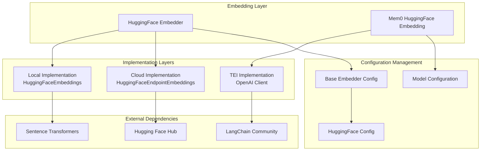
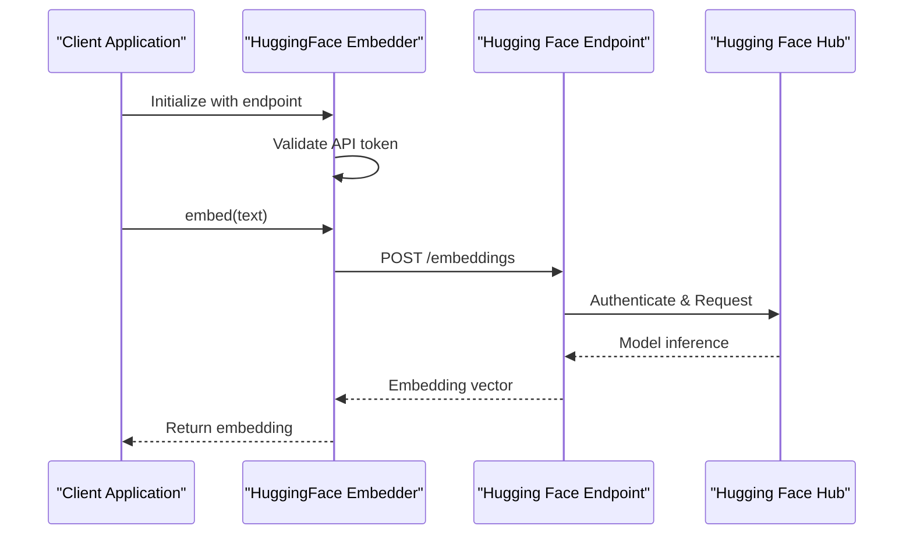
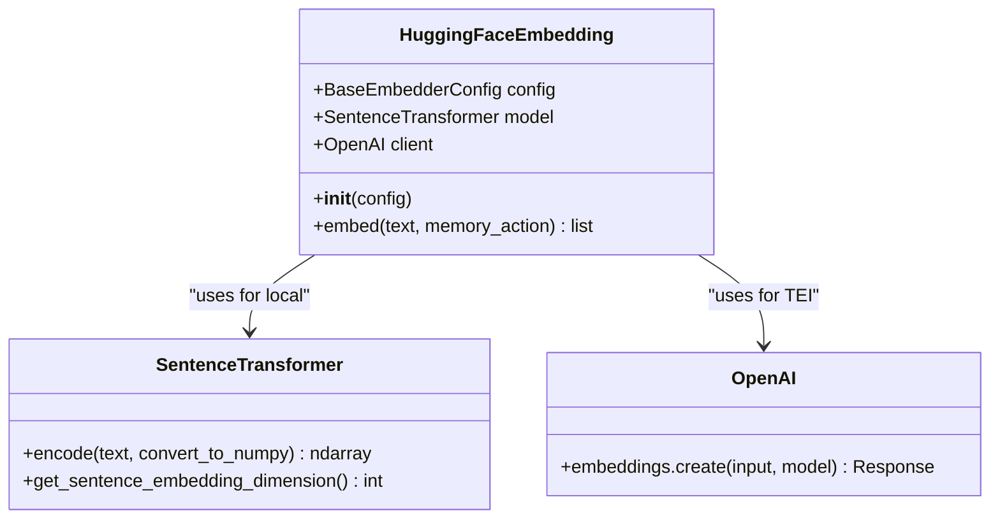
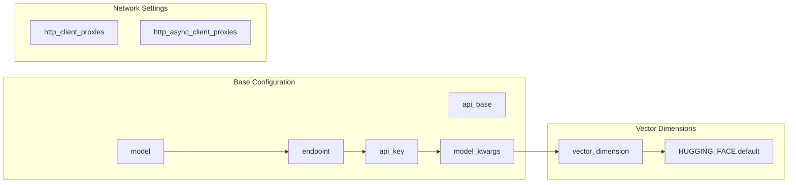
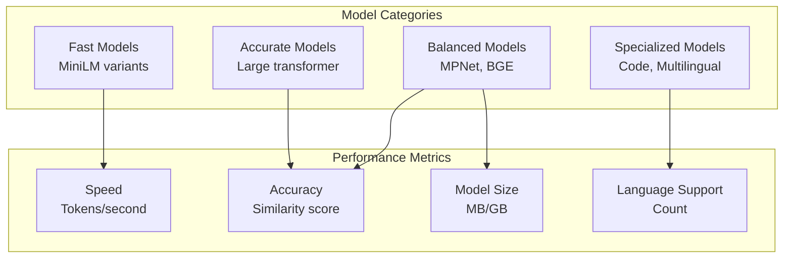
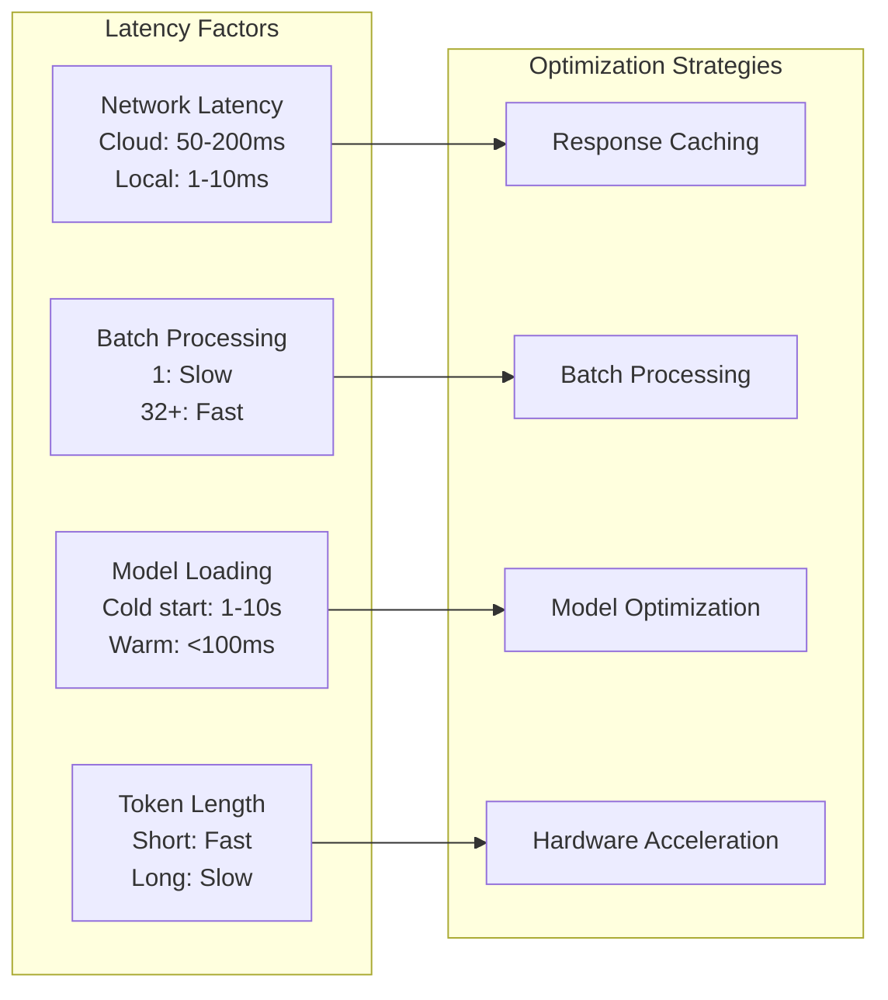
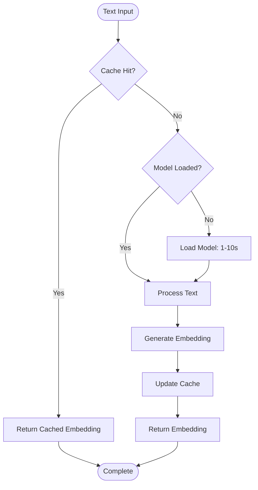
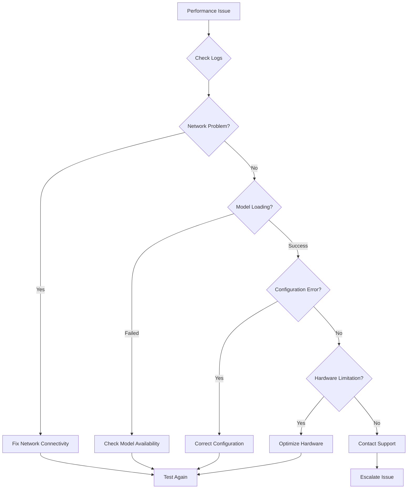

# Hugging Face Embeddings

<cite>
**Referenced Files in This Document**
- [embedchain/embedchain/embedder/huggingface.py](file://embedchain/embedchain/embedder/huggingface.py)
- [embedchain/configs/huggingface.yaml](file://embedchain/configs/huggingface.yaml)
- [mem0/embeddings/huggingface.py](file://mem0/embeddings/huggingface.py)
- [embedchain/embedchain/config/embedder/base.py](file://embedchain/embedchain/config/embedder/base.py)
- [mem0/configs/embeddings/base.py](file://mem0/configs/embeddings/base.py)
- [embedchain/notebooks/hugging_face_hub.ipynb](file://embedchain/notebooks/hugging_face_hub.ipynb)
- [embedchain/embedchain/models/vector_dimensions.py](file://embedchain/embedchain/models/vector_dimensions.py)
- [tests/embeddings/test_huggingface_embeddings.py](file://tests/embeddings/test_huggingface_embeddings.py)
- [embedchain/embedchain/llm/huggingface.py](file://embedchain/embedchain/llm/huggingface.py)
- [embedchain/tests/llm/test_huggingface.py](file://embedchain/tests/llm/test_huggingface.py)
</cite>

## Table of Contents
1. [Introduction](#introduction)
2. [Architecture Overview](#architecture-overview)
3. [Cloud-Based Hugging Face Embeddings](#cloud-based-hugging-face-embeddings)
4. [Local Hugging Face Embeddings](#local-hugging-face-embeddings)
5. [Configuration Options](#configuration-options)
6. [Model Selection Guidelines](#model-selection-guidelines)
7. [Performance Considerations](#performance-considerations)
8. [Common Issues and Troubleshooting](#common-issues-and-troubleshooting)
9. [Best Practices](#best-practices)
10. [Advanced Usage Examples](#advanced-usage-examples)

## Introduction

Hugging Face embeddings provide powerful text representation capabilities for natural language processing tasks. The integration supports both cloud-based inference endpoints and local model deployment, offering flexibility for different deployment scenarios and performance requirements.

The system offers two primary approaches:
- **Cloud-based embeddings**: Utilizing Hugging Face's hosted inference API for scalable, managed embedding generation
- **Local embeddings**: Running models directly on your infrastructure for privacy and performance control

Both approaches leverage the extensive ecosystem of pre-trained models available on the Hugging Face Hub, supporting various languages, use cases, and computational requirements.

## Architecture Overview

The Hugging Face embedding integration follows a modular architecture that separates concerns between embedding generation and configuration management.



**Diagram sources**
- [embedchain/embedchain/embedder/huggingface.py](file://embedchain/embedchain/embedder/huggingface.py#L19-L40)
- [mem0/embeddings/huggingface.py](file://mem0/embeddings/huggingface.py#L15-L42)

**Section sources**
- [embedchain/embedchain/embedder/huggingface.py](file://embedchain/embedchain/embedder/huggingface.py#L1-L41)
- [mem0/embeddings/huggingface.py](file://mem0/embeddings/huggingface.py#L1-L42)

## Cloud-Based Hugging Face Embeddings

Cloud-based embeddings utilize Hugging Face's hosted inference API, providing scalable and managed embedding generation without requiring local model deployment.

### Implementation Details

The cloud implementation uses the `HuggingFaceEndpointEmbeddings` class from LangChain, configured for remote API access:



**Diagram sources**
- [embedchain/embedchain/embedder/huggingface.py](file://embedchain/embedchain/embedder/huggingface.py#L23-L32)

### Configuration Requirements

| Parameter | Type | Description | Required |
|-----------|------|-------------|----------|
| `endpoint` | str | Hugging Face endpoint URL | Yes (for cloud mode) |
| `api_key` | str | Hugging Face access token | Yes (if not in environment) |
| `model_kwargs` | dict | Additional model parameters | No |

### Authentication Setup

Authentication can be configured through environment variables or directly in the configuration:

```python
# Environment variable approach
import os
os.environ["HUGGINGFACE_ACCESS_TOKEN"] = "your-access-token"

# Or directly in configuration
config = {
    "embedder": {
        "provider": "huggingface",
        "config": {
            "endpoint": "https://api-inference.huggingface.co/models/sentence-transformers/all-mpnet-base-v2",
            "api_key": "your-access-token"
        }
    }
}
```

**Section sources**
- [embedchain/embedchain/embedder/huggingface.py](file://embedchain/embedchain/embedder/huggingface.py#L23-L32)
- [embedchain/embedchain/config/embedder/base.py](file://embedchain/embedchain/config/embedder/base.py#L32-L55)

## Local Hugging Face Embeddings

Local embeddings run models directly on your infrastructure, providing privacy, offline capability, and potentially better performance for high-throughput scenarios.

### Implementation Architecture



**Diagram sources**
- [mem0/embeddings/huggingface.py](file://mem0/embeddings/huggingface.py#L15-L42)

### Configuration Options

| Parameter | Type | Description | Default |
|-----------|------|-------------|---------|
| `model` | str | Model identifier from Hugging Face Hub | "multi-qa-MiniLM-L6-cos-v1" |
| `huggingface_base_url` | str | TEI endpoint URL | None |
| `model_kwargs` | dict | Model initialization parameters | {} |
| `embedding_dims` | int | Expected embedding dimension | Auto-detected |

### Hardware Requirements

| Model Size | RAM Requirement | GPU Memory | CPU Cores | Latency |
|------------|----------------|------------|-----------|---------|
| MiniLM-L6 | 500MB | 0.5GB | 1+ | Fast |
| MPNet-Base | 1GB | 1GB | 2+ | Medium |
| BGE-Base | 2GB | 2GB | 4+ | Medium |
| Large Models | 4GB+ | 4GB+ | 8+ | Slow |

**Section sources**
- [mem0/embeddings/huggingface.py](file://mem0/embeddings/huggingface.py#L16-L26)
- [tests/embeddings/test_huggingface_embeddings.py](file://tests/embeddings/test_huggingface_embeddings.py#L18-L72)

## Configuration Options

### Embedder Configuration

The base embedder configuration supports comprehensive customization for both cloud and local deployments:



**Diagram sources**
- [embedchain/embedchain/config/embedder/base.py](file://embedchain/embedchain/config/embedder/base.py#L30-L55)

### Mem0-Specific Configuration

Mem0 provides specialized configuration options for embedding dimensions and TEI integration:

| Parameter | Type | Description | Example |
|-----------|------|-------------|---------|
| `embedding_dims` | int | Override auto-detected dimensions | 768 |
| `huggingface_base_url` | str | TEI server endpoint | "http://localhost:8080" |
| `model_kwargs` | dict | Model initialization parameters | {"device": "cuda"} |

### YAML Configuration Examples

**Basic Local Configuration:**
```yaml
embedder:
  provider: huggingface
  config:
    model: "sentence-transformers/all-mpnet-base-v2"
    model_kwargs:
      device: "cpu"
      batch_size: 32
```

**Cloud Endpoint Configuration:**
```yaml
embedder:
  provider: huggingface
  config:
    endpoint: "https://api-inference.huggingface.co/models/sentence-transformers/all-mpnet-base-v2"
    api_key: "${HUGGINGFACE_ACCESS_TOKEN}"
    model_kwargs:
      max_seq_length: 512
```

**Mem0 TEI Configuration:**
```yaml
embedder:
  provider: huggingface
  config:
    huggingface_base_url: "http://localhost:8080"
    model: "sentence-transformers/all-MiniLM-L6-v2"
```

**Section sources**
- [embedchain/embedchain/config/embedder/base.py](file://embedchain/embedchain/config/embedder/base.py#L30-L55)
- [mem0/configs/embeddings/base.py](file://mem0/configs/embeddings/base.py#L55-L90)
- [embedchain/configs/huggingface.yaml](file://embedchain/configs/huggingface.yaml#L1-L9)

## Model Selection Guidelines

### Recommended Models by Use Case

| Use Case | Model | Dimension | Performance | Language Support |
|----------|-------|-----------|-------------|------------------|
| General Purpose | `all-MiniLM-L6-v2` | 384 | Fast | Multilingual |
| Academic Research | `all-mpnet-base-v2` | 768 | Medium | Multilingual |
| Production Systems | `BAAI/bge-base-en-v1.5` | 768 | Medium | English |
| Multilingual | `paraphrase-multilingual-MiniLM-L12-v2` | 384 | Medium | 50+ languages |
| Code Analysis | `sentence-transformers/codebert-base` | 768 | Medium | Programming |

### Model Comparison Matrix



### Dimension Selection Guide

The vector dimensions impact both performance and compatibility:

| Dimension | Use Case | Memory Impact | Compatibility |
|-----------|----------|---------------|---------------|
| 384 | Fast applications | Low | Wide |
| 512 | Balanced | Medium | Good |
| 768 | High accuracy | Medium | Standard |
| 1024+ | Research/High precision | High | Limited |

**Section sources**
- [embedchain/embedchain/models/vector_dimensions.py](file://embedchain/embedchain/models/vector_dimensions.py#L1-L17)

## Performance Considerations

### Latency Analysis



### Throughput Optimization

| Strategy | Improvement | Trade-offs |
|----------|-------------|------------|
| Batch Processing | 3-5x | Higher memory usage |
| Model Quantization | 2-3x | Slight accuracy loss |
| GPU Acceleration | 10-50x | Hardware cost |
| Model Pruning | 2-4x | Reduced accuracy |
| Caching | 1000+x | Storage requirement |

### Hardware Requirements

#### CPU Deployment
- **Minimum**: 2 cores, 4GB RAM
- **Recommended**: 4 cores, 8GB RAM
- **High Performance**: 8+ cores, 16GB+ RAM

#### GPU Deployment
- **RTX 3060**: ~20 tokens/sec
- **RTX 4090**: ~50 tokens/sec
- **V100**: ~30 tokens/sec
- **CPU Only**: ~2 tokens/sec

### Memory Usage Patterns



**Section sources**
- [embedchain/embedchain/models/vector_dimensions.py](file://embedchain/embedchain/models/vector_dimensions.py#L1-L17)

## Common Issues and Troubleshooting

### Model Loading Failures

**Issue**: ImportError or ModuleNotFoundError
```python
# Error: ModuleNotFoundError: No module named 'langchain_huggingface'
# Solution: Install required dependencies
pip install langchain_huggingface
```

**Issue**: Model download failures
```python
# Error: Could not load model from Hugging Face Hub
# Solution: Check network connectivity and model availability
# Alternative: Download model manually and use local path
```

### Token Expiration Issues

**Issue**: Authentication failures
```python
# Error: Invalid Hugging Face Access Token
# Solution: Regenerate token from Hugging Face website
# Check environment variable: HUGGINGFACE_ACCESS_TOKEN
```

**Issue**: Rate limiting
```python
# Error: Too Many Requests
# Solution: Implement retry logic with exponential backoff
# Consider upgrading to paid tier for higher limits
```

### Dimension Mismatches

**Issue**: Vector dimension conflicts
```python
# Error: Vector dimension mismatch
# Solution: Ensure embedding dimensions match vector database
# Check: VectorDimensions.HUGGING_FACE.value (384)
```

### Performance Issues

**Issue**: Slow inference
```python
# Diagnosis: Profile embedding generation time
# Solutions:
# - Use smaller models
# - Enable GPU acceleration
# - Implement caching
# - Use batch processing
```

### Configuration Problems

**Issue**: Invalid configuration parameters
```python
# Error: Unexpected keyword argument
# Solution: Check model_kwargs compatibility
# Reference: Model-specific parameter documentation
```

### Debugging Workflow



**Section sources**
- [embedchain/embedchain/embedder/huggingface.py](file://embedchain/embedchain/embedder/huggingface.py#L6-L12)
- [embedchain/embedchain/llm/huggingface.py](file://embedchain/embedchain/llm/huggingface.py#L27-L30)

## Best Practices

### Security Considerations

1. **API Token Management**
   - Store tokens securely using environment variables
   - Rotate tokens regularly
   - Use least-privilege access policies

2. **Network Security**
   - Use HTTPS endpoints
   - Implement proper firewall rules
   - Monitor API usage patterns

3. **Data Privacy**
   - Consider local deployment for sensitive data
   - Implement data retention policies
   - Audit embedding usage

### Performance Optimization

1. **Caching Strategy**
   ```python
   # Implement intelligent caching
   cache = {}
   def cached_embed(text):
       if text in cache:
           return cache[text]
       embedding = embedder.embed(text)
       cache[text] = embedding
       return embedding
   ```

2. **Batch Processing**
   ```python
   # Process multiple texts efficiently
   texts = ["text1", "text2", "text3"]
   embeddings = embedder.embed_batch(texts)
   ```

3. **Model Selection**
   - Choose models based on accuracy vs speed requirements
   - Consider quantization for production
   - Monitor model performance metrics

### Monitoring and Observability

1. **Key Metrics to Track**
   - Embedding generation latency
   - Token usage and costs
   - Model loading times
   - Error rates and types

2. **Logging Strategy**
   ```python
   import logging
   logging.getLogger("transformers").setLevel(logging.WARNING)
   logging.getLogger("sentence_transformers").setLevel(logging.WARNING)
   ```

### Deployment Patterns

1. **Development Environment**
   - Use smaller models for faster iteration
   - Enable detailed logging
   - Implement hot-reload capabilities

2. **Production Environment**
   - Use GPU acceleration
   - Implement health checks
   - Set up monitoring and alerting

**Section sources**
- [mem0/embeddings/huggingface.py](file://mem0/embeddings/huggingface.py#L10-L12)
- [tests/embeddings/test_huggingface_embeddings.py](file://tests/embeddings/test_huggingface_embeddings.py#L1-L72)

## Advanced Usage Examples

### Custom Model Configuration

```python
# Advanced configuration with custom parameters
config = {
    "model": "sentence-transformers/all-mpnet-base-v2",
    "model_kwargs": {
        "device": "cuda",
        "max_seq_length": 512,
        "normalize_embeddings": True
    },
    "vector_dimension": 768
}
```

### Multi-Language Support

```python
# Configure for multilingual applications
multilingual_config = {
    "model": "paraphrase-multilingual-MiniLM-L12-v2",
    "model_kwargs": {
        "device": "cpu",
        "batch_size": 16
    }
}
```

### Production Deployment

```python
# Production-ready configuration
production_config = {
    "endpoint": "https://api-inference.huggingface.co/models/BAAI/bge-base-en-v1.5",
    "api_key": "${HUGGINGFACE_ACCESS_TOKEN}",
    "model_kwargs": {
        "max_seq_length": 512,
        "batch_size": 32,
        "device": "cuda"
    }
}
```

### Memory Optimization

```python
# Memory-efficient configuration
memory_optimized_config = {
    "model": "sentence-transformers/all-MiniLM-L6-v2",
    "model_kwargs": {
        "device": "cpu",
        "batch_size": 64,
        "convert_to_tensor": False
    }
}
```

### Integration Examples

The Hugging Face embedding system integrates seamlessly with various frameworks and use cases:

1. **Embedchain Integration**
   - Automatic data source processing
   - Vector database integration
   - Query enhancement capabilities

2. **Mem0 Memory System**
   - Persistent memory storage
   - Context-aware embeddings
   - Long-term memory management

3. **Custom Applications**
   - Chatbots and virtual assistants
   - Search and recommendation systems
   - Content moderation and classification

**Section sources**
- [embedchain/notebooks/hugging_face_hub.ipynb](file://embedchain/notebooks/hugging_face_hub.ipynb#L69-L96)
- [tests/embeddings/test_huggingface_embeddings.py](file://tests/embeddings/test_huggingface_embeddings.py#L29-L72)