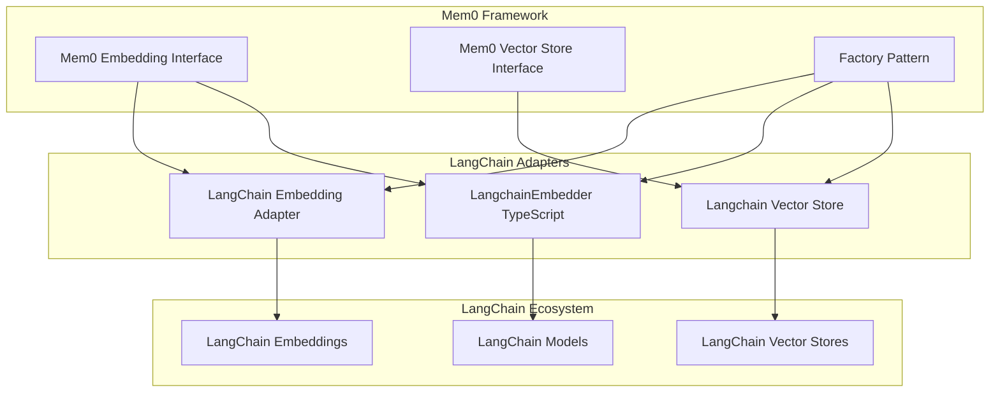
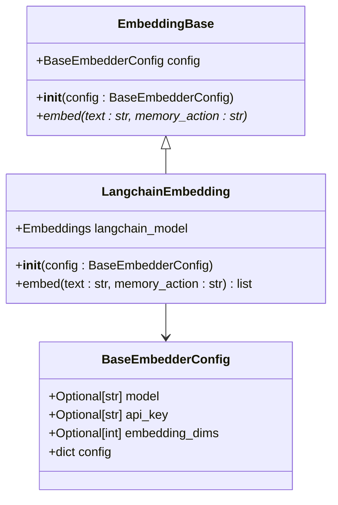
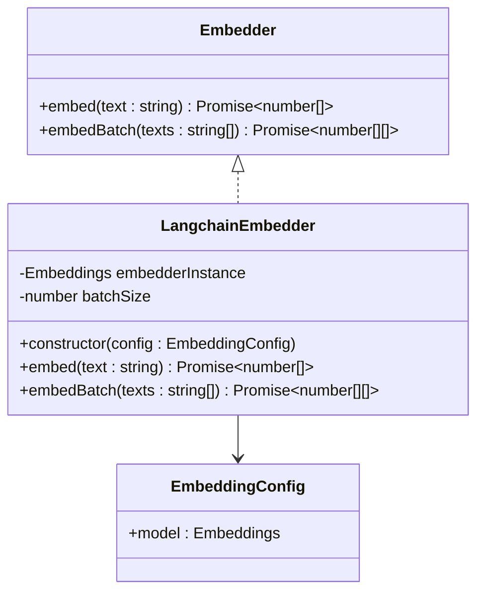
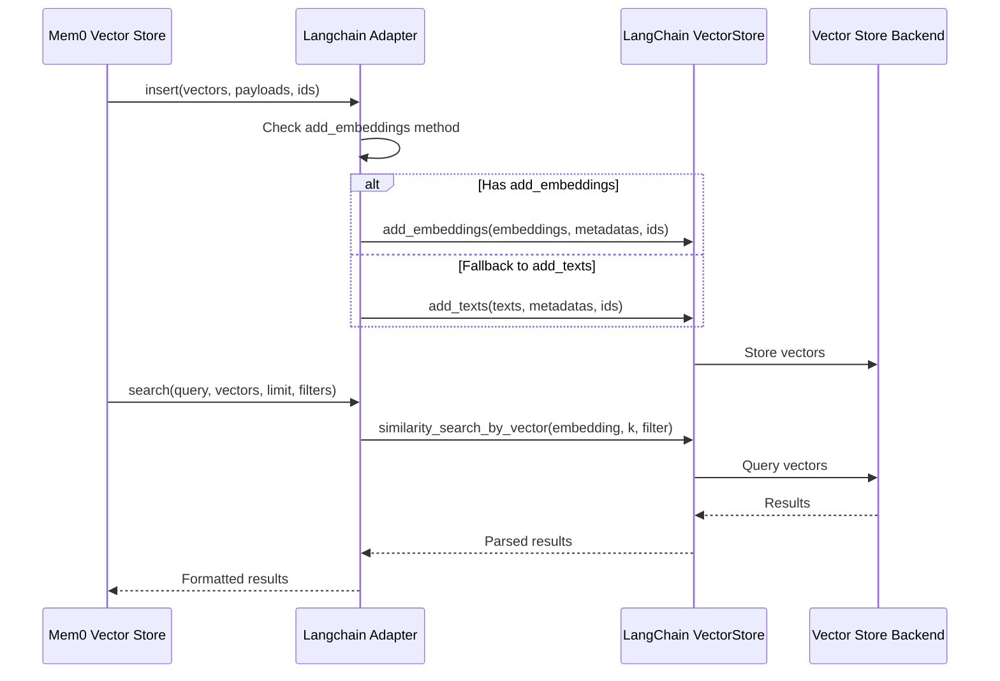
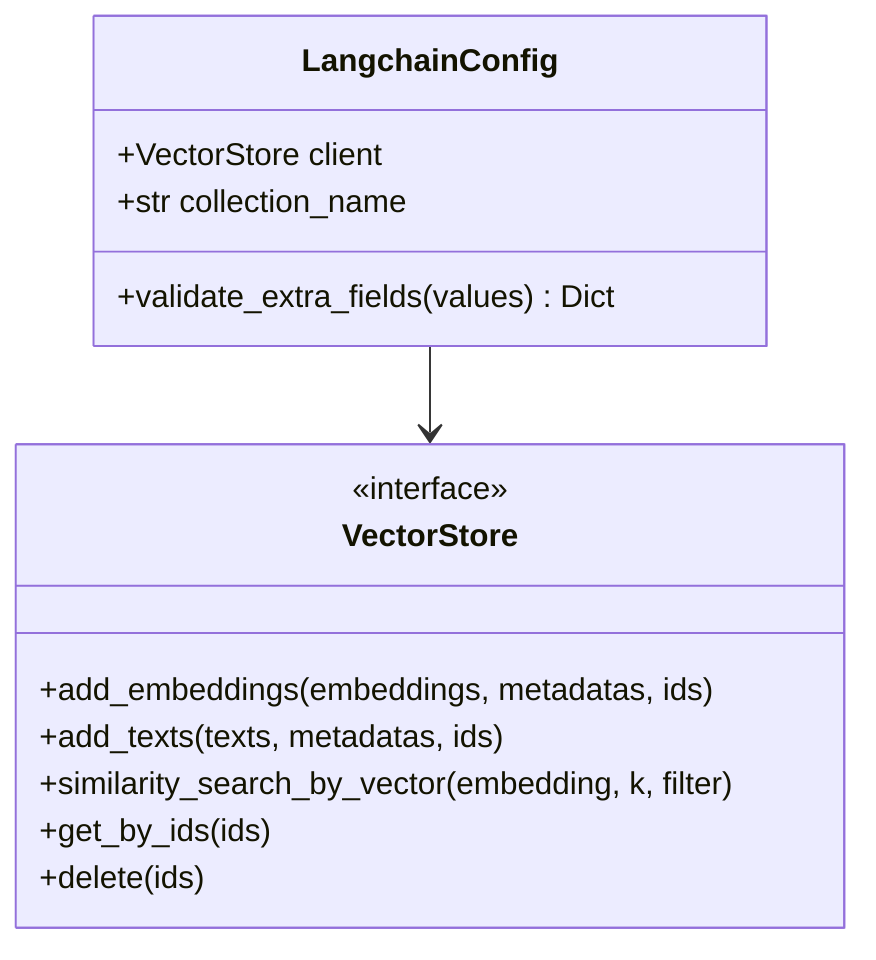
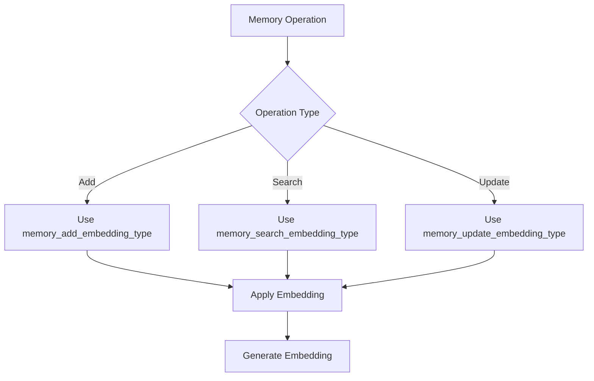
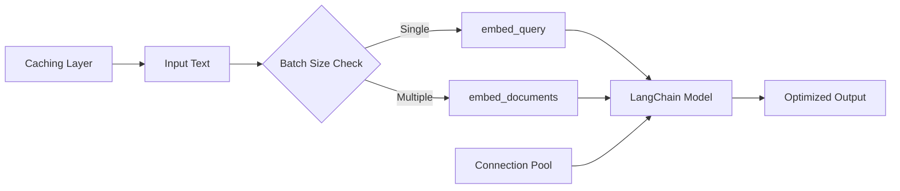

# LangChain Embeddings

<cite>
**Referenced Files in This Document**
- [mem0/embeddings/langchain.py](file://mem0/embeddings/langchain.py)
- [mem0/configs/embeddings/base.py](file://mem0/configs/embeddings/base.py)
- [mem0/embeddings/base.py](file://mem0/embeddings/base.py)
- [mem0/configs/vector_stores/langchain.py](file://mem0/configs/vector_stores/langchain.py)
- [mem0/vector_stores/langchain.py](file://mem0/vector_stores/langchain.py)
- [mem0/llms/langchain.py](file://mem0/llms/langchain.py)
- [mem0/utils/factory.py](file://mem0/utils/factory.py)
- [mem0-ts/src/oss/src/embeddings/langchain.ts](file://mem0-ts/src/oss/src/embeddings/langchain.ts)
- [mem0-ts/src/oss/src/vector_stores/langchain.ts](file://mem0-ts/src/oss/src/vector_stores/langchain.ts)
- [tests/vector_stores/test_langchain_vector_store.py](file://tests/vector_stores/test_langchain_vector_store.py)
- [tests/embeddings/test_langchain.py](file://tests/embeddings/test_langchain.py)
- [tests/llms/test_langchain.py](file://tests/llms/test_langchain.py)
</cite>

## Table of Contents
1. [Introduction](#introduction)
2. [Architecture Overview](#architecture-overview)
3. [LangChainEmbedding Adapter](#langchainembedding-adapter)
4. [LangchainEmbedder (TypeScript)](#langchainembedder-typescript)
5. [Langchain Vector Store Integration](#langchain-vector-store-integration)
6. [Configuration Options](#configuration-options)
7. [Initialization Patterns](#initialization-patterns)
8. [Parameter Propagation](#parameter-propagation)
9. [Use Cases and Examples](#use-cases-and-examples)
10. [Common Issues and Solutions](#common-issues-and-solutions)
11. [Performance Optimization](#performance-optimization)
12. [Best Practices](#best-practices)
13. [Version Compatibility](#version-compatibility)

## Introduction

The Mem0 framework provides seamless integration with LangChain embedding providers through dedicated adapters that enable developers to leverage existing LangChain configurations and access niche embedding models not natively supported by Mem0. This integration allows for maximum flexibility in choosing embedding providers while maintaining compatibility across different LangChain versions.

The LangChain integration consists of three main components:
- **LangChain Embedding Adapter**: Python implementation for embedding generation
- **LangchainEmbedder**: TypeScript implementation for JavaScript/TypeScript environments
- **Langchain Vector Store**: Adapter for LangChain-compatible vector stores

## Architecture Overview

The LangChain integration follows a layered architecture that provides abstraction over LangChain's embedding and vector store implementations:



**Diagram sources**
- [mem0/embeddings/langchain.py](file://mem0/embeddings/langchain.py#L11-L36)
- [mem0-ts/src/oss/src/embeddings/langchain.ts](file://mem0-ts/src/oss/src/embeddings/langchain.ts#L5-L50)
- [mem0/vector_stores/langchain.py](file://mem0/vector_stores/langchain.py#L24-L181)

## LangChainEmbedding Adapter

The Python LangChainEmbedding adapter provides a bridge between Mem0's embedding interface and LangChain's embedding implementations.

### Core Implementation

The LangChainEmbedding class inherits from EmbeddingBase and validates that the provided model is a valid LangChain Embeddings instance:



**Diagram sources**
- [mem0/embeddings/base.py](file://mem0/embeddings/base.py#L7-L32)
- [mem0/embeddings/langchain.py](file://mem0/embeddings/langchain.py#L12-L36)
- [mem0/configs/embeddings/base.py](file://mem0/configs/embeddings/base.py#L10-L111)

### Key Features

1. **Type Safety**: Validates that the provided model is an instance of LangChain's Embeddings class
2. **Error Handling**: Provides clear error messages for missing dependencies and invalid configurations
3. **Memory Action Support**: Supports different embedding types for add, search, and update operations
4. **Minimal Overhead**: Direct delegation to LangChain's embed_query method

**Section sources**
- [mem0/embeddings/langchain.py](file://mem0/embeddings/langchain.py#L12-L36)

## LangchainEmbedder (TypeScript)

The TypeScript implementation provides equivalent functionality for JavaScript/TypeScript environments.

### Implementation Details

The LangchainEmbedder class implements the Embedder interface and provides robust validation for LangChain embeddings:



**Diagram sources**
- [mem0-ts/src/oss/src/embeddings/langchain.ts](file://mem0-ts/src/oss/src/embeddings/langchain.ts#L5-L50)

### Validation and Error Handling

The TypeScript implementation includes comprehensive validation:

1. **Instance Validation**: Ensures the provided model is an object with required methods
2. **Method Validation**: Verifies presence of embedQuery and embedDocuments methods
3. **Error Messages**: Provides clear error messages for configuration issues
4. **Batch Size Handling**: Automatically detects and stores batch size information

**Section sources**
- [mem0-ts/src/oss/src/embeddings/langchain.ts](file://mem0-ts/src/oss/src/embeddings/langchain.ts#L9-L28)

## Langchain Vector Store Integration

The Langchain vector store adapter enables integration with any LangChain-compatible vector store implementation.

### Core Architecture



**Diagram sources**
- [mem0/vector_stores/langchain.py](file://mem0/vector_stores/langchain.py#L79-L103)

### Supported Operations

The Langchain vector store adapter supports all standard vector store operations:

| Operation | LangChain Method | Fallback Method |
|-----------|------------------|-----------------|
| Insert | `add_embeddings()` | `add_texts()` |
| Search | `similarity_search_by_vector()` | N/A |
| Get | `get_by_ids()` | N/A |
| Delete | `delete(ids)` | N/A |
| Update | Delete + Insert | N/A |
| List | Collection-specific | N/A |

### Configuration Options

The Langchain vector store configuration accepts any LangChain VectorStore instance:



**Diagram sources**
- [mem0/configs/vector_stores/langchain.py](file://mem0/configs/vector_stores/langchain.py#L6-L31)

**Section sources**
- [mem0/vector_stores/langchain.py](file://mem0/vector_stores/langchain.py#L24-L181)
- [mem0/configs/vector_stores/langchain.py](file://mem0/configs/vector_stores/langchain.py#L6-L31)

## Configuration Options

### Embedding Configuration

The LangChain embedding adapter accepts configurations through the BaseEmbedderConfig class:

| Parameter | Type | Description | Required |
|-----------|------|-------------|----------|
| `model` | Embeddings | Initialized LangChain embeddings instance | Yes |
| `api_key` | str | API key for the embedding service | No |
| `embedding_dims` | int | Dimensionality of embeddings | No |
| `memory_add_embedding_type` | str | Embedding type for add operations | No |
| `memory_search_embedding_type` | str | Embedding type for search operations | No |
| `memory_update_embedding_type` | str | Embedding type for update operations | No |

### Vector Store Configuration

The Langchain vector store configuration supports:

| Parameter | Type | Description | Default |
|-----------|------|-------------|---------|
| `client` | VectorStore | Existing LangChain vector store instance | Required |
| `collection_name` | str | Name of the collection to use | "mem0" |

**Section sources**
- [mem0/configs/embeddings/base.py](file://mem0/configs/embeddings/base.py#L10-L111)
- [mem0/configs/vector_stores/langchain.py](file://mem0/configs/vector_stores/langchain.py#L15-L16)

## Initialization Patterns

### Python Initialization

```python
# Basic LangChain embedding initialization
from langchain_community.embeddings import OpenAIEmbeddings
from mem0 import EmbeddingConfig, LangchainEmbedding

# Initialize LangChain embedding
langchain_embeddings = OpenAIEmbeddings(api_key="your-api-key")

# Configure Mem0 embedding
config = EmbeddingConfig(
    provider="langchain",
    config={
        "model": langchain_embeddings
    }
)

# Create LangChain embedding adapter
embedding = LangchainEmbedding(config)
```

### TypeScript Initialization

```typescript
// TypeScript LangChain embedding initialization
import { OpenAIEmbeddings } from "@langchain/openai";
import { EmbeddingConfig, LangchainEmbedder } from "mem0";

// Initialize LangChain embedding
const langchainEmbeddings = new OpenAIEmbeddings({
    openAIApiKey: "your-api-key"
});

// Configure Mem0 embedding
const config: EmbeddingConfig = {
    provider: "langchain",
    model: langchainEmbeddings
};

// Create LangChain embedder
const embedder = new LangchainEmbedder(config);
```

### Vector Store Initialization

```python
# LangChain vector store initialization
from langchain_community.vectorstores import Chroma
from mem0 import VectorStoreConfig, Langchain

# Initialize LangChain vector store
langchain_vector_store = Chroma(
    persist_directory="./chroma_db",
    embedding_function=langchain_embeddings
)

# Configure Mem0 vector store
vector_config = VectorStoreConfig(
    provider="langchain",
    config={
        "client": langchain_vector_store,
        "collection_name": "mem0_collection"
    }
)

# Create LangChain vector store adapter
vector_store = Langchain(**vector_config.config)
```

**Section sources**
- [mem0/embeddings/langchain.py](file://mem0/embeddings/langchain.py#L13-L23)
- [mem0-ts/src/oss/src/embeddings/langchain.ts](file://mem0-ts/src/oss/src/embeddings/langchain.ts#L9-L28)

## Parameter Propagation

### Memory Action Types

The LangChain adapters support different embedding types for different memory operations:



### Parameter Forwarding

Both adapters forward parameters appropriately:

1. **Python Adapter**: Passes memory_action parameter to LangChain's embed_query
2. **TypeScript Adapter**: Uses embedQuery and embedDocuments methods directly
3. **Vector Store**: Forwards all parameters to LangChain's vector store methods

**Section sources**
- [mem0/embeddings/langchain.py](file://mem0/embeddings/langchain.py#L24-L35)
- [mem0-ts/src/oss/src/embeddings/langchain.ts](file://mem0-ts/src/oss/src/embeddings/langchain.ts#L30-L49)

## Use Cases and Examples

### Reusing Existing LangChain Configurations

When migrating from LangChain-based applications to Mem0:

```python
# Reuse existing LangChain configuration
from langchain_community.embeddings import HuggingFaceEmbeddings

# Existing LangChain configuration
existing_config = {
    "model_name": "sentence-transformers/all-MiniLM-L6-v2",
    "cache_folder": "./models",
    "model_kwargs": {"device": "cpu"}
}

# Initialize LangChain embeddings
langchain_embeddings = HuggingFaceEmbeddings(**existing_config)

# Use in Mem0
from mem0 import EmbeddingConfig, LangchainEmbedding
config = EmbeddingConfig(
    provider="langchain",
    config={"model": langchain_embeddings}
)
embedding = LangchainEmbedding(config)
```

### Accessing Niche Embedding Models

For specialized embedding models not natively supported by Mem0:

```python
# Access niche embedding models through LangChain
from langchain_community.embeddings import SentenceTransformersEmbeddings

# Specialized embedding model
specialized_embeddings = SentenceTransformersEmbeddings(
    model_name="paraphrase-multilingual-MiniLM-L12-v2"
)

# Use with Mem0
config = EmbeddingConfig(
    provider="langchain",
    config={"model": specialized_embeddings}
)
```

### Hybrid Memory Systems

Combining LangChain embeddings with Mem0's memory capabilities:

```python
# Hybrid approach: LangChain for embeddings, Mem0 for memory management
from langchain_community.embeddings import OpenAIEmbeddings
from mem0 import Memory

# Initialize LangChain embeddings
langchain_embeddings = OpenAIEmbeddings()

# Initialize Mem0 memory
memory = Memory()

# Use LangChain for embeddings, Mem0 for persistence
def add_memory_with_langchain_embeddings(user_id, content):
    # Get embedding from LangChain
    embedding = langchain_embeddings.embed_query(content)
    
    # Store with Mem0
    memory.add(
        [{"role": "user", "content": content}],
        user_id=user_id,
        embedding=embedding
    )
```

**Section sources**
- [tests/embeddings/test_langchain.py](file://tests/embeddings/test_langchain.py#L1-L36)

## Common Issues and Solutions

### Dependency Conflicts

**Issue**: Version conflicts between LangChain and other dependencies

**Solution**: Use virtual environments and pin compatible versions:

```python
# Compatible LangChain versions
# langchain-community>=0.3.0
# langchain-core>=0.3.0
# langchain-openai>=0.2.0
```

**Issue**: Missing LangChain installation

**Solution**: Install required packages:
```bash
pip install langchain langchain-community langchain-core
```

### Initialization Errors

**Issue**: Invalid LangChain model instance

**Solution**: Validate model type before passing to adapter:

```python
from langchain.embeddings.base import Embeddings

def validate_langchain_model(model):
    if not isinstance(model, Embeddings):
        raise ValueError("Model must be an instance of langchain.embeddings.base.Embeddings")
    return True
```

**Issue**: Missing required methods

**Solution**: Check for required methods:

```python
def validate_langchain_embedding_methods(embedding):
    required_methods = ['embed_query', 'embed_documents']
    for method in required_methods:
        if not hasattr(embedding, method) or not callable(getattr(embedding, method)):
            raise ValueError(f"Missing required method: {method}")
```

### Performance Overhead

**Issue**: Adapter layer introduces latency

**Solution**: Optimize by:
1. Using batch operations when possible
2. Implementing connection pooling
3. Caching frequently used embeddings

**Section sources**
- [mem0/embeddings/langchain.py](file://mem0/embeddings/langchain.py#L6-L10)
- [mem0-ts/src/oss/src/embeddings/langchain.ts](file://mem0-ts/src/oss/src/embeddings/langchain.ts#L11-L24)

## Performance Optimization

### Memory Usage Optimization

1. **Connection Pooling**: Reuse LangChain embedding instances
2. **Batch Processing**: Use embed_documents for multiple texts
3. **Lazy Loading**: Initialize LangChain models only when needed

### Adapter Layer Optimization



### Best Practices for Performance

1. **Reuse Instances**: Create LangChain models once and reuse them
2. **Batch Operations**: Group multiple embeddings into single calls
3. **Async Processing**: Use async/await for non-blocking operations
4. **Resource Management**: Properly close connections and clean up resources

**Section sources**
- [mem0-ts/src/oss/src/embeddings/langchain.ts](file://mem0-ts/src/oss/src/embeddings/langchain.ts#L30-L49)

## Best Practices

### Factory Pattern Usage

Use the factory pattern for consistent initialization:

```python
from mem0.utils.factory import EmbedderFactory, VectorStoreFactory

# Factory-based initialization
embedder = EmbedderFactory.create(
    "langchain",
    {
        "model": langchain_embeddings
    }
)

vector_store = VectorStoreFactory.create(
    "langchain",
    {
        "client": langchain_vector_store,
        "collection_name": "mem0_collection"
    }
)
```

### Error Handling Patterns

Implement comprehensive error handling:

```python
try:
    embedding = LangchainEmbedding(config)
    result = embedding.embed("test text")
except ImportError as e:
    print(f"LangChain not installed: {e}")
except ValueError as e:
    print(f"Invalid configuration: {e}")
except Exception as e:
    print(f"Unexpected error: {e}")
```

### Configuration Management

Use environment variables for sensitive configuration:

```python
import os
from langchain_community.embeddings import OpenAIEmbeddings

# Environment-based configuration
langchain_embeddings = OpenAIEmbeddings(
    api_key=os.getenv("OPENAI_API_KEY")
)
```

**Section sources**
- [mem0/utils/factory.py](file://mem0/utils/factory.py#L131-L157)

## Version Compatibility

### LangChain Version Support

The LangChain integration maintains compatibility across major LangChain versions:

| LangChain Version | Compatibility | Notes |
|-------------------|---------------|-------|
| >= 0.3.0 | ✅ Full Support | Latest features available |
| >= 0.2.0 | ⚠️ Partial Support | Some features may be deprecated |
| >= 0.1.0 | ❌ Not Supported | Requires migration |

### Migration Strategies

1. **Gradual Migration**: Replace adapters incrementally
2. **Compatibility Layer**: Use wrapper classes for version differences
3. **Testing**: Comprehensive testing across versions

### Future Compatibility

The adapter pattern ensures future compatibility by:

1. **Abstraction Layer**: Separates Mem0 logic from LangChain implementation
2. **Interface Stability**: Relies on stable LangChain interfaces
3. **Plugin Architecture**: Easy to replace adapters when needed

**Section sources**
- [mem0/llms/langchain.py](file://mem0/llms/langchain.py#L6-L10)
- [mem0-ts/pnpm-lock.yaml](file://mem0-ts/pnpm-lock.yaml#L822-L826)