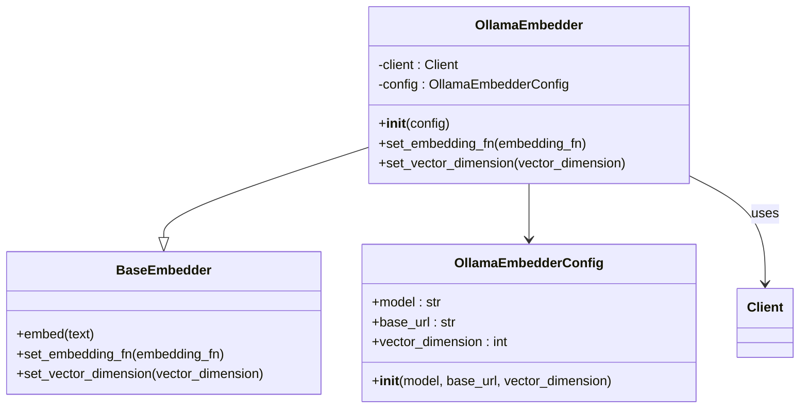
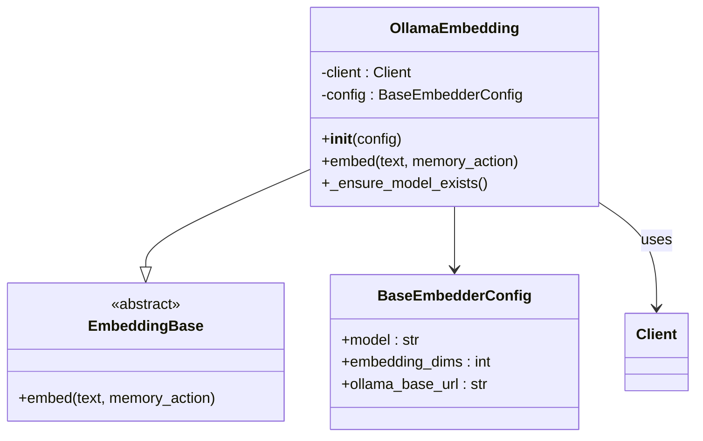
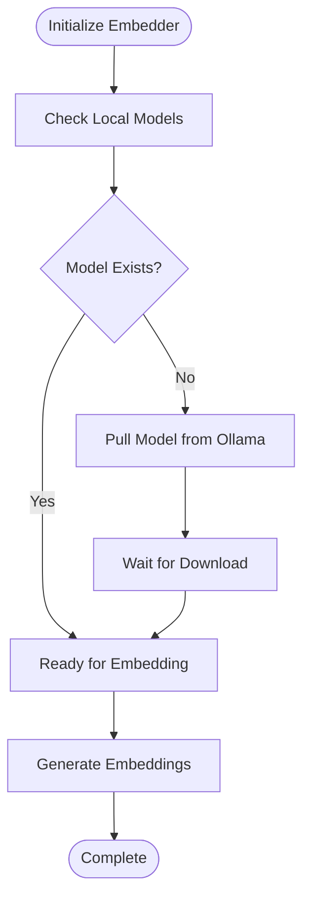
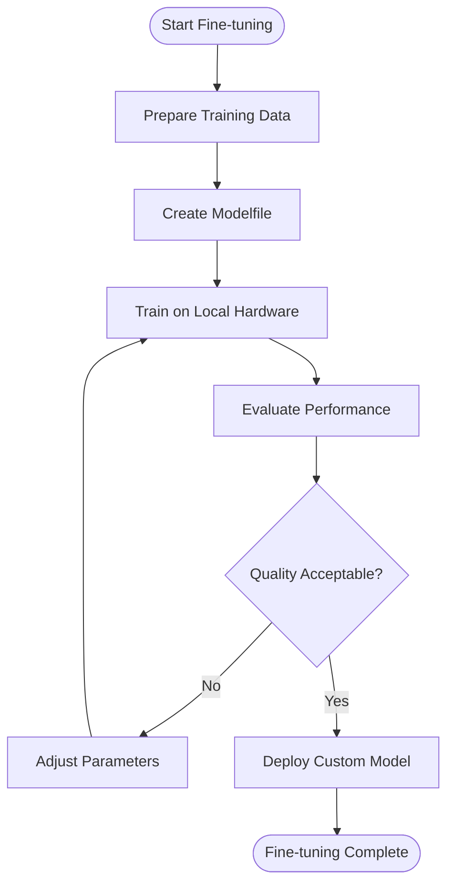

# Ollama Embeddings

<cite>
**Referenced Files in This Document**
- [embedchain/embedchain/embedder/ollama.py](file://embedchain/embedchain/embedder/ollama.py)
- [embedchain/embedchain/config/embedder/ollama.py](file://embedchain/embedchain/config/embedder/ollama.py)
- [mem0/embeddings/ollama.py](file://mem0/embeddings/ollama.py)
- [mem0/configs/embeddings/base.py](file://mem0/configs/embeddings/base.py)
- [mem0/embeddings/base.py](file://mem0/embeddings/base.py)
- [embedchain/notebooks/ollama.ipynb](file://embedchain/notebooks/ollama.ipynb)
- [embedchain/configs/ollama.yaml](file://embedchain/configs/ollama.yaml)
- [tests/embeddings/test_ollama_embeddings.py](file://tests/embeddings/test_ollama_embeddings.py)
- [mem0-ts/src/oss/src/embeddings/ollama.ts](file://mem0-ts/src/oss/src/embeddings/ollama.ts)
- [mem0-ts/src/oss/src/llms/ollama.ts](file://mem0-ts/src/oss/src/llms/ollama.ts)
</cite>

## Table of Contents
1. [Introduction](#introduction)
2. [Installation and Setup](#installation-and-setup)
3. [Configuration Options](#configuration-options)
4. [Implementation Details](#implementation-details)
5. [Performance Considerations](#performance-considerations)
6. [Troubleshooting Guide](#troubleshooting-guide)
7. [Customization and Fine-tuning](#customization-and-fine-tuning)
8. [Best Practices](#best-practices)
9. [Conclusion](#conclusion)

## Introduction

Ollama embeddings provide a powerful solution for generating text embeddings locally without relying on cloud-based APIs. This integration enables privacy-conscious applications to leverage state-of-the-art embedding models like nomic-embed-text while maintaining complete control over data processing and model deployment.

The Ollama embedding system offers several key advantages:
- **Privacy Protection**: All processing occurs locally on your infrastructure
- **Cost Efficiency**: Eliminates per-token pricing associated with cloud APIs
- **Customization**: Supports custom model fine-tuning and Modelfile configurations
- **Offline Capability**: Functions without internet connectivity requirements
- **Hardware Flexibility**: Optimized for various CPU and GPU configurations

## Installation and Setup

### Prerequisites

Before integrating Ollama embeddings, ensure you have the following components installed:

1. **Ollama Server**: The core Ollama runtime for model management
2. **Python Environment**: Compatible Python version for your project
3. **Required Libraries**: Ollama Python client and embedding dependencies

### Installing Ollama Server

The Ollama server installation varies by operating system:

```bash
# macOS/Linux
curl -fsSL https://ollama.ai/install.sh | sh

# Windows
# Download installer from https://ollama.ai/download
```

### Python Dependencies

Install the required Python packages:

```bash
pip install ollama mem0ai
```

### Basic Setup Verification

Verify your Ollama installation and server status:

```bash
# Check Ollama version
ollama --version

# List available models
ollama list

# Start Ollama server
ollama serve
```

**Section sources**
- [mem0/embeddings/ollama.py](file://mem0/embeddings/ollama.py#L8-L21)
- [embedchain/embedchain/embedder/ollama.py](file://embedchain/embedchain/embedder/ollama.py#L4-L7)

## Configuration Options

### Core Configuration Parameters

The Ollama embedding system supports comprehensive configuration through multiple approaches:

#### EmbedChain Configuration

```python
from embedchain import App
from embedchain.config import OllamaEmbedderConfig

# Basic configuration
config = {
    "embedder": {
        "provider": "ollama",
        "config": {
            "model": "nomic-embed-text",
            "base_url": "http://localhost:11434",
            "vector_dimension": 768
        }
    }
}

# Initialize with configuration
app = App.from_config(config=config)
```

#### Mem0 Configuration

```python
from mem0 import Memory
from mem0.configs.embeddings.base import BaseEmbedderConfig

# Configure Ollama embedding for Mem0
config = BaseEmbedderConfig(
    model="nomic-embed-text",
    embedding_dims=512,
    ollama_base_url="http://localhost:11434"
)

memory = Memory(config=config)
```

### Advanced Configuration Options

| Parameter | Type | Default | Description |
|-----------|------|---------|-------------|
| `model` | string | `"nomic-embed-text"` | The embedding model to use |
| `base_url` | string | `"http://localhost:11434"` | Ollama server endpoint |
| `embedding_dims` | integer | `512` | Output vector dimensions |
| `ollama_base_url` | string | `None` | Alternative Ollama server URL |

### Environment Variables

Configure Ollama through environment variables for production deployments:

```bash
export OLLAMA_BASE_URL="http://localhost:11434"
export OLLAMA_MODEL="nomic-embed-text"
```

**Section sources**
- [embedchain/embedchain/config/embedder/ollama.py](file://embedchain/embedchain/config/embedder/ollama.py#L7-L16)
- [mem0/configs/embeddings/base.py](file://mem0/configs/embeddings/base.py#L15-L111)
- [embedchain/configs/ollama.yaml](file://embedchain/configs/ollama.yaml#L1-L15)

## Implementation Details

### EmbedChain Implementation

The EmbedChain Ollama embedder integrates seamlessly with the framework's architecture:



**Diagram sources**
- [embedchain/embedchain/embedder/ollama.py](file://embedchain/embedchain/embedder/ollama.py#L18-L33)
- [embedchain/embedchain/config/embedder/ollama.py](file://embedchain/embedchain/config/embedder/ollama.py#L7-L16)

### Mem0 Implementation

The Mem0 implementation provides a more flexible embedding interface:



**Diagram sources**
- [mem0/embeddings/ollama.py](file://mem0/embeddings/ollama.py#L24-L54)
- [mem0/embeddings/base.py](file://mem0/embeddings/base.py#L7-L32)

### Model Management

Both implementations automatically handle model lifecycle management:



**Diagram sources**
- [mem0/embeddings/ollama.py](file://mem0/embeddings/ollama.py#L34-L42)
- [embedchain/embedchain/embedder/ollama.py](file://embedchain/embedchain/embedder/ollama.py#L22-L26)

**Section sources**
- [embedchain/embedchain/embedder/ollama.py](file://embedchain/embedchain/embedder/ollama.py#L18-L33)
- [mem0/embeddings/ollama.py](file://mem0/embeddings/ollama.py#L24-L54)

## Performance Considerations

### Hardware Requirements

#### Minimum Requirements
- **CPU**: Intel i5 or equivalent ARM processor
- **RAM**: 8GB minimum, 16GB recommended
- **Storage**: 10GB free space for model downloads
- **Network**: Local network connection for Ollama server

#### Recommended Specifications
- **CPU**: Intel i7/i9 or AMD Ryzen 7/9 with AVX2 support
- **RAM**: 16GB minimum, 32GB for multiple concurrent requests
- **Storage**: SSD with 50GB+ free space
- **GPU**: NVIDIA GTX 1660 or equivalent for accelerated inference

### Memory Usage Patterns

| Model Size | RAM Usage | Storage Required | Inference Speed |
|------------|-----------|------------------|-----------------|
| nomic-embed-text | 2-4GB | 4GB | ~100 tokens/sec |
| mxbai-embed-large | 4-6GB | 6GB | ~50 tokens/sec |
| Custom fine-tuned | Variable | Variable | Depends on architecture |

### Inference Performance Optimization

#### Batch Processing
```python
# Efficient batch embedding
texts = ["text1", "text2", "text3"]
embeddings = embedder.embed_batch(texts)
```

#### Concurrent Processing
```python
import asyncio
from mem0.embeddings.ollama import OllamaEmbedding

async def process_texts(texts):
    embedder = OllamaEmbedding()
    tasks = [embedder.embed(text) for text in texts]
    return await asyncio.gather(*tasks)
```

### Performance Monitoring

Monitor key metrics for optimal performance:

```python
import time
from mem0.embeddings.ollama import OllamaEmbedding

embedder = OllamaEmbedding()

# Measure embedding performance
start_time = time.time()
embedding = embedder.embed("Sample text")
end_time = time.time()

print(f"Embedding generated in {end_time - start_time:.3f} seconds")
```

**Section sources**
- [mem0/embeddings/ollama.py](file://mem0/embeddings/ollama.py#L28-L29)

## Troubleshooting Guide

### Common Issues and Solutions

#### Ollama Server Not Running

**Problem**: Connection refused errors when initializing embedders.

**Solution**:
```bash
# Start Ollama server
ollama serve

# Verify server status
curl http://localhost:11434/api/tags
```

**Diagnostic Steps**:
1. Check if Ollama process is running
2. Verify port 11434 availability
3. Review Ollama logs for errors

#### Model Download Failures

**Problem**: Models fail to download or become corrupted.

**Solution**:
```bash
# Clear model cache
ollama rm nomic-embed-text

# Redownload model
ollama pull nomic-embed-text
```

**Common Causes**:
- Insufficient disk space
- Network connectivity issues
- Firewall blocking connections

#### Version Compatibility Problems

**Problem**: Incompatible Ollama client versions.

**Solution**:
```bash
# Check client version compatibility
pip show ollama

# Update to latest version
pip install --upgrade ollama
```

#### Memory and Resource Issues

**Problem**: Out of memory errors during embedding generation.

**Solutions**:
1. **Reduce batch size**: Process texts in smaller chunks
2. **Close unused models**: Use `ollama stop <model>` to free resources
3. **Increase system RAM**: Upgrade physical memory
4. **Optimize model selection**: Choose lighter models for resource-constrained environments

### Error Handling Patterns

```python
from mem0.embeddings.ollama import OllamaEmbedding
from mem0.exceptions import NetworkError, ModelNotFoundError

def robust_embedding(text, max_retries=3):
    for attempt in range(max_retries):
        try:
            embedder = OllamaEmbedding()
            return embedder.embed(text)
        except NetworkError as e:
            if attempt == max_retries - 1:
                raise
            print(f"Network error, retrying ({attempt + 1}/{max_retries})...")
            time.sleep(2 ** attempt)  # Exponential backoff
        except ModelNotFoundError:
            print("Model not found, pulling fresh copy...")
            embedder._ensure_model_exists()
```

### Debugging Tools

#### Enable Verbose Logging
```python
import logging
logging.basicConfig(level=logging.DEBUG)

# This will show detailed Ollama client interactions
```

#### Health Check Script
```python
def check_ollama_health():
    try:
        from ollama import Client
        
        client = Client(host="http://localhost:11434")
        models = client.list()
        
        print(f"Ollama server running with {len(models.get('models', []))} models")
        return True
    except Exception as e:
        print(f"Ollama health check failed: {e}")
        return False
```

**Section sources**
- [mem0/embeddings/ollama.py](file://mem0/embeddings/ollama.py#L8-L21)
- [tests/embeddings/test_ollama_embeddings.py](file://tests/embeddings/test_ollama_embeddings.py#L1-L43)

## Customization and Fine-tuning

### Modelfile Configuration

Ollama allows extensive customization through Modelfiles:

#### Creating Custom Embedding Models

```dockerfile
# Custom embedding model Modelfile
FROM nomic-embed-text:latest

# Customize model parameters
PARAMETER temperature 0.1
PARAMETER top_p 0.9
PARAMETER top_k 40

# Set custom dimensions
EMBEDDING_DIMENSIONS 1024

# Add custom instructions
INSTRUCTION """
Generate embeddings optimized for semantic similarity in legal documents.
Focus on contract terms, obligations, and compliance language.
"""
```

#### Applying Modelfile Customizations

```bash
# Build custom model from Modelfile
ollama create my-custom-embedder -f Modelfile

# Use custom model in applications
ollama run my-custom-embedder "Your text here"
```

### Local Model Fine-tuning

#### Fine-tuning Workflow



#### Fine-tuning Example

```python
# Example training script for custom embedding model
import torch
from transformers import AutoTokenizer, AutoModel

# Load base model
tokenizer = AutoTokenizer.from_pretrained("nomic-embed-text")
model = AutoModel.from_pretrained("nomic-embed-text")

# Prepare custom training data
training_data = [
    {"text": "Legal contract clause", "label": "legal"},
    {"text": "Financial agreement", "label": "finance"},
    # Add more domain-specific examples
]

# Fine-tune for specific domain
def train_custom_embedding():
    # Implement domain-specific training logic
    pass
```

### Integration with Custom Pipelines

#### Custom Embedding Pipeline

```python
from mem0.embeddings.base import EmbeddingBase
from typing import List

class DomainSpecificEmbedder(EmbeddingBase):
    def __init__(self, config=None):
        super().__init__(config)
        self.domain_model = self.load_domain_specific_model()
    
    def embed(self, text: str, memory_action=None):
        # Apply domain-specific preprocessing
        processed_text = self.preprocess_for_domain(text)
        
        # Generate embedding using custom model
        embedding = self.domain_model.encode(processed_text)
        
        # Post-process embedding for domain-specific use
        return self.post_process_embedding(embedding)
    
    def preprocess_for_domain(self, text: str) -> str:
        # Custom preprocessing logic
        return text.lower().strip()
    
    def post_process_embedding(self, embedding: List[float]) -> List[float]:
        # Normalize or transform embedding
        return embedding
```

**Section sources**
- [mem0/embeddings/ollama.py](file://mem0/embeddings/ollama.py#L34-L42)
- [mem0-ts/src/oss/src/embeddings/ollama.ts](file://mem0-ts/src/oss/src/embeddings/ollama.ts#L40-L51)

## Best Practices

### Security Considerations

#### Local Deployment Security
1. **Network Isolation**: Run Ollama server on isolated networks
2. **Access Control**: Use firewall rules to restrict server access
3. **Regular Updates**: Keep Ollama and models updated
4. **Backup Strategy**: Regularly backup custom models and configurations

#### Data Privacy
```python
# Secure embedding pipeline
import hashlib
from cryptography.fernet import Fernet

class SecureEmbeddingPipeline:
    def __init__(self, encryption_key):
        self.key = encryption_key
        self.f = Fernet(encryption_key)
    
    def secure_embed(self, text: str) -> bytes:
        # Hash sensitive data before embedding
        hashed_text = hashlib.sha256(text.encode()).digest()
        encrypted_hash = self.f.encrypt(hashed_text)
        return encrypted_hash
```

### Production Deployment

#### Containerized Deployment
```yaml
# docker-compose.yml for Ollama embeddings
version: '3.8'
services:
  ollama-embeddings:
    image: ollama/ollama:latest
    ports:
      - "11434:11434"
    volumes:
      - ollama_data:/root/.ollama
    environment:
      - OLLAMA_MODELS=/root/.ollama/models
    restart: unless-stopped
    
  embedding-service:
    build: .
    depends_on:
      - ollama-embeddings
    environment:
      - OLLAMA_BASE_URL=http://ollama-embeddings:11434
      - EMBEDDING_MODEL=nomic-embed-text

volumes:
  ollama_data:
```

#### Load Balancing and Scaling
```python
# Multi-instance embedding service
from flask import Flask, request, jsonify
from mem0.embeddings.ollama import OllamaEmbedding
import random

app = Flask(__name__)

# Pool of embedding instances
embedding_instances = [
    OllamaEmbedding(),
    OllamaEmbedding(),
    OllamaEmbedding()
]

@app.route('/embed', methods=['POST'])
def embed_text():
    data = request.json
    text = data.get('text')
    
    # Route to random instance for load balancing
    embedder = random.choice(embedding_instances)
    embedding = embedder.embed(text)
    
    return jsonify({'embedding': embedding})
```

### Monitoring and Maintenance

#### Performance Monitoring
```python
import time
import psutil
from typing import Dict

class EmbeddingMonitor:
    def __init__(self):
        self.metrics = {}
    
    def track_embedding(self, text: str) -> Dict:
        start_time = time.time()
        start_memory = psutil.virtual_memory().used
        
        # Generate embedding
        embedding = self.generate_embedding(text)
        
        end_time = time.time()
        end_memory = psutil.virtual_memory().used
        
        duration = end_time - start_time
        memory_delta = end_memory - start_memory
        
        return {
            'duration': duration,
            'memory_delta': memory_delta,
            'embedding_length': len(embedding),
            'timestamp': time.time()
        }
```

**Section sources**
- [mem0-ts/src/oss/src/embeddings/ollama.ts](file://mem0-ts/src/oss/src/embeddings/ollama.ts#L12-L20)
- [mem0-ts/src/oss/src/llms/ollama.ts](file://mem0-ts/src/oss/src/llms/ollama.ts#L12-L20)

## Conclusion

Ollama embeddings provide a robust, privacy-focused solution for local text embedding generation. The integration offers comprehensive configuration options, automatic model management, and extensive customization capabilities while maintaining excellent performance characteristics.

Key benefits of the Ollama embedding system include:

- **Complete Data Control**: All processing remains on-premises
- **Cost Efficiency**: No per-token pricing structure
- **Flexibility**: Support for custom models and fine-tuning
- **Reliability**: Offline capability and predictable performance
- **Scalability**: Support for various hardware configurations

The implementation supports both EmbedChain and Mem0 frameworks, providing developers with multiple integration pathways. With proper configuration, monitoring, and maintenance, Ollama embeddings deliver reliable, high-performance text embedding capabilities suitable for production AI applications.

For optimal results, ensure adequate hardware resources, implement proper error handling, and consider domain-specific fine-tuning for specialized use cases. The modular architecture allows for easy extension and customization while maintaining compatibility with existing frameworks and deployment patterns.